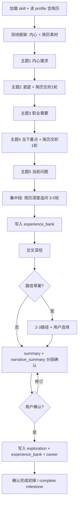

# 职业内核探索

将 Superpowers [brainstorming](https://github.com/shareAI-lab/learn-claude-code/tree/main/skills/brainstorming) 的 **「先澄清、逐步深入、分段确认、再落档」** 范式，用于用户的 **职业初探** 阶段——陪用户触及 **内心五主题**，并通过对基线简历的 **深度追问** 扩充可落档的经历素材（`resume.experience_bank`），供后续 JD 匹配与简历优化使用。

## 与 brainstorming 的差异

| 头脑风暴（Superpowers） | 本技能包 |
|------------------------------|----------|
| 产出技术/产品设计 spec | 产出 `profile.json` → `exploration.*` + `resume.experience_bank` |
| 下一步 `writing-plans` | 下一步：用户确认初探 → `complete_task` 里程碑 → 解锁岗位描述流程 |
| 禁止写代码 | 禁止 JD 评估、简历 HTML、建 `jd_*` 任务 list；**禁止** 在本阶段改写 `resume.source_text` 正文 |

## HARD-GATE

**不得** 在用户未确认「进入深度探讨」或未提交表单前调用本技能包（该阶段由入口编排智能体普通对话 + [B01 对话入口](../docs/prd/B01.%20流程-对话入口与建档%20PRD.md) 完成）。

在以下条件 **全部满足前**，不得：

- 粘贴/分析岗位描述、调用市场/岗位智能体
- 优化简历、生成简历网页、建 `jd_*` 任务列表
- 用泛泛的职场鸡汤替代 **逐字段** 探索

允许：在用户已提交表单后阅读 `profile.json`、更新 `preference_tags.custom[]`（须用户确认）、创建/推进 `explore_*` 下的里程碑与对话。

初探 **落档完成** 的唯一出口：用户发送附录 B 话术（如 `确认完成初探`）且各探索字段已写入后，调用 `complete_task` 并设置 `exploration.completed_at`。

---

## 模式选择：首次初探 vs 初探复盘

入口编排智能体（运行框架）须在加载本技能包时标明模式（或根据 `profile.json` 自行判断）：

| 模式 | 条件 | 走哪条清单 |
|------|------|------------|
| **首次初探** | 无 `exploration.completed_at`，或用户明确是第一次深度探索 | **完整清单**（五主题 + 简历深挖 + 交叉/路径/summary） |
| **初探复盘** | 已有 `exploration.completed_at`，用户要更新/纠正既往结论 | **复盘短路径**（见下节），不从头五主题；**按需** 补 `experience_bank` |

复盘触发示例：「重新梳理职业方向」「优先级变了」「上次初探不太准」「还有段经历没写进简历」。

---

## 执行清单 A：首次初探（完整清单）

为当前 `explore_*` list 创建或勾选对应 **work** 子任务（若 Task 系统已启用）；对话本身仍遵循下列顺序：

1. **读取上下文** — 读取 `data/profile.json`（表单字段、`resume.source_text`、`resume.experience_bank`（若有）、`preference_tags`）；若有简历，用 2–3 句指出「简历写了什么 / 可能还缺什么素材」；**不要** 连珠炮提问。
2. **建立探索框架** — 说明本轮 **两条线**：内心五主题（慢聊）+ 对照简历把 **没写全的经历** 挖出来；本轮 **不写投递简历、不对 JD**。
3. **主题 1：内心真实需求**（`exploration.inner_needs`）— 见 [phases.md](phases.md)；**每次只问一个问题**。
4. **主题 2：渴望**（`exploration.desires`）— 主题 1 结束后 **穿插 1 轮** 简历对照问（见 phases「交织对照」）。
5. **主题 3：职业需要**（`exploration.career_needs`）
6. **主题 4：当下最重要**（`exploration.priorities_now`）— 主题 3 结束后 **穿插 1 轮** 简历对照问。
7. **主题 5：当前问题**（`exploration.current_problems`）
8. **简历深度追问（集中段）** — 对照 `source_text`，至少 **3–5 轮**（一次一问）；发掘未写项目、个人贡献、量化、隐性能力；逐条确认后写入 `experience_bank.items[]`；见 phases「简历深度追问」。
9. **交叉与深挖** — 内心五主题与简历素材是否矛盾；**一个** 追问澄清；镜像倾听。
10. **路径草案（可选）** — 2–3 种职业方向/节奏 trade-off；写入 `career.next_hop` / `career.horizon_3_5y` **草案** 前须分段确认。
11. **初探摘要 + 经历素材摘要** — `exploration.summary`（200–400 字）与 `resume.experience_bank.narrative_summary`（200–500 字）**分段呈现**，分别确认。
12. **落档** — 写入 `exploration.*`、`resume.experience_bank`、更新 `career.*` 草案；`exploration.completed_at`；`complete_task` 初探 milestone；提示可粘贴 JD。

**交织原则**：步骤 4、6 的简历对照问用于 **轻触达**；步骤 8 为 **集中深挖**，不可省略（有 `source_text` 时）。

---

## 执行清单 B：初探复盘（短路径）

**不** 按主题 1–5 从头问一遍。顺序：

1. **读取既有档案** — 读取 `exploration.*`、`resume.experience_bank`、`career.*` 草案；3–5 句话复述，请用户确认「哪句已经不对了」。
2. **变化探针（一次一问）** — 「五块里（需求/渴望/职业需要/当下重点/当前问题）哪 **1–2 块** 和你现在感受不一致？」必要时 A/B/C。
3. **简历素材探针（一次一问）** — 「有没有 **新经历或新成果** 要补进档案？（简历里没写全的也算）」— 若 **无**，保留原 `experience_bank`；若 **有**，走 2–4 轮短追问并更新 `items[]` / `narrative_summary`。
4. **交叉深挖** — 仅针对 **发生变化** 的内心字段追问 2–4 轮；未变字段保留原值。
5. **更新 summary** — 修订 `exploration.summary`（及按需修订 `narrative_summary`），**分段确认**。
6. **落档** — 更新有变字段；刷新 `exploration.completed_at`；用户 `确认完成初探` / `确认复盘完成` 后 `complete_task`。

---

## 对话原则（继承 brainstorming，针对心理安全加强）

- **一次只问一个问题** — 禁止一条消息里堆 3+ 个问题。
- **优先选择题** — 在用户犹豫时，给 A/B/C 或「都不太像，我补充」。
- **允许沉默与回头** — 用户说「跳过/之后再说」则记入 metadata 或留空，稍后在简历集中段或交叉阶段再触达。
- **禁止评判** — 不对用户选择做道德或「正确职业」评判；只反映后果与 trade-off。
- **由浅入深** — 每个内心主题至少 2–4 轮；简历追问用 **具体项目/时间段** 逼近，而非「你还有别的经历吗」一句带过。
- **简历是浓缩而非全集** — 明确告知：追问是为了 **以后按 JD 改简历时有料可选**，不是现在改稿。
- **YAGNI** — 不主动扩展到薪酬谈判、副业变现等 **未在表单或用户话术中出现** 的话题，除非用户提起。

---

## 流程图

---

## 落档字段（必须完整）

| 字段 | 要求 |
|------|------|
| `exploration.inner_needs` | 完整句，避免空洞形容词 |
| `exploration.desires` | 含理想状态与成就感来源 |
| `exploration.career_needs` | 理性诉求：岗位类型、成长、约束 |
| `exploration.priorities_now` | 6–12 个月 **最多 3 项**，排序 |
| `exploration.current_problems` | 阻碍/焦虑/缺口，可量化则量化 |
| `exploration.summary` | 用户确认后的叙事摘要 |
| `exploration.completed_at` | ISO8601 |
| `resume.experience_bank.items[]` | 经用户确认的条目；无新素材可 `[]` 但须说明 |
| `resume.experience_bank.narrative_summary` | 用户确认后的经历素材摘要；可与 items 同步修订 |

---

## 示例（单问句式）

**反例（禁止）**：
> 你的需求、渴望、职业目标和现在的问题分别是什么？

**正例（主题 1 开场）**：
> 抛开简历和 JD，如果接下来一年只允许你解决 **一件** 和职业相关的事，你会选什么？为什么是它而不是别的？

**正例（简历集中段）**：
> 你简历里 **2022–2023** 那段只写了「负责后端开发」——当时你 **个人** 负责的最硬的一个技术决策或交付是什么？结果有没有数字？

**正例（交织对照）**：
> 你刚说最看重 **技术影响力**；简历项目栏里有没有 **带人、推标准、写方案被采纳** 这类事其实做过但没写？举一个最近的例子。

---

## 延伸阅读

- 各主题与简历问题库：[phases.md](phases.md)
- 产品规格：`docs/prd/B02. 流程-职业初探 PRD.md`（初探）、`docs/prd/A02. 机制-任务系统 PRD.md`（任务）、`docs/prd/00. 职业规划 Agent PRD.md` §4.1（架构）
