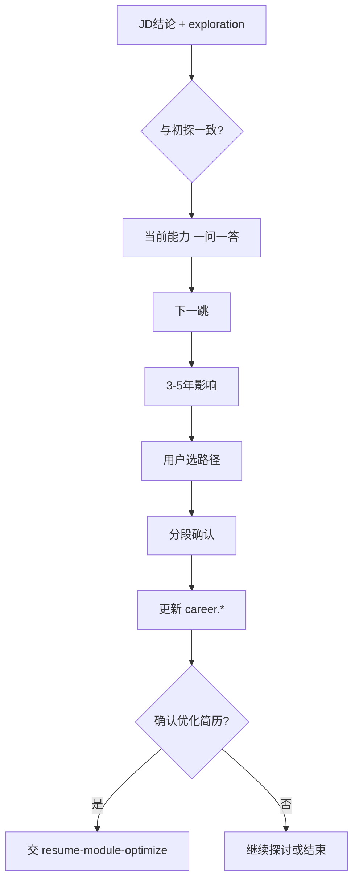

# 岗位对齐探讨

在 **职业初探已落档**（`exploration.completed_at` 存在）且用户已粘贴 **当前 JD** 之后，围绕 **这一份 JD** 与用户对齐：当前能力、下一跳、3–5 年影响，并支撑用户决定是否按该 JD 优化简历。

## HARD-GATE

在以下条件满足前，不得：

- 生成/修改简历 HTML、`claim` 简历类 `work` 任务
- 替代市场/岗位智能体做匹配打分（匹配结论由市场/岗位智能体对话输出，本技能包 **引用** 该结论）

允许：更新 `career.current_assessment` / `next_hop` / `horizon_3_5y` / `selected_path_id`；记录 `career.jd_override`（用户在不推荐时仍继续）。

**出口**：用户明确 **确认按该岗位描述优化简历**（附录 B）→ 入口编排智能体 `complete_task` 对应里程碑 → 加载 `resume-module-optimize`。

---

## 前置输入（必须由运行框架注入）

- `exploration.summary` 及 `exploration.*` 各字段
- 当前岗位描述全文（或指纹对应缓存）
- 市场/岗位智能体结论：`recommended | not_recommended` + 理由（对话摘要）
- 若 `not_recommended`：仅当用户已 **确认仍继续** 后进入本技能包，且须在对话中再次提示风险

---

## 执行清单

1. **对齐初探** — 用 2–3 句话说明：本 JD 讨论不会改简历，只帮你判断「这份 JD 在你的人生剧本里意味着什么」；**一次一问**。
2. **与初探一致性** — 该 JD 是否符合 `exploration` 中的渴望与 `priorities_now`？符合/冲突/部分符合，请用户确认感受（选择题优先）。
3. **三时间维度（逐项，每次只展开一项）**
   - **当前能力**：对照岗位必备项，强项、短板、证据缺口；联系 `current_problems`
   - **下一跳**：若进入该岗位，6–18 个月履历与能力重心
   - **3–5 年影响**：路径 A/B（或维持初探已选路径的对照），长期标签影响
4. **路径选择** — 若有分歧，用 **2–3 个** 选项陈述利弊权衡（非技术方案）；用户选定后拟写入 `career.selected_path_id`
5. **分段确认** — 将上述结论分成 2–3 段复述，每段问「是否准确」；修订后再进入落档
6. **落档** — 更新 `career.*`；若从不推荐仍继续，追加 `career.jd_override[]` 记录
7. **优化许可** — 明确询问：「是否确认按 **该岗位描述** 优化简历？」仅肯定答复后通知入口编排智能体完成里程碑并切换 `resume-module-optimize`

---

## 对话原则

- **一次只问一个问题**；优先选择题
- **必须引用** `exploration.summary`，避免与已确认内心意向长期背离；若用户坚持冲突选择，记录在 `metadata` 而非评判
- **不推荐 JD**：先完整说明理由；用户确认继续前不得进入步骤 3 的「下一跳/长期」乐观描述
- **YAGNI**：不展开面试模拟、薪资谈判细节，除非用户提起

---

## 流程图

---

## 延伸阅读

- 产品规格：`docs/prd/B04. 流程-职业战略与投递策略 PRD.md`（JD 对齐）、`docs/prd/B03. 流程-市场岗位分析 PRD.md`（JD 分析）
- 初探结论来源：`career-inner-exploration` skill
