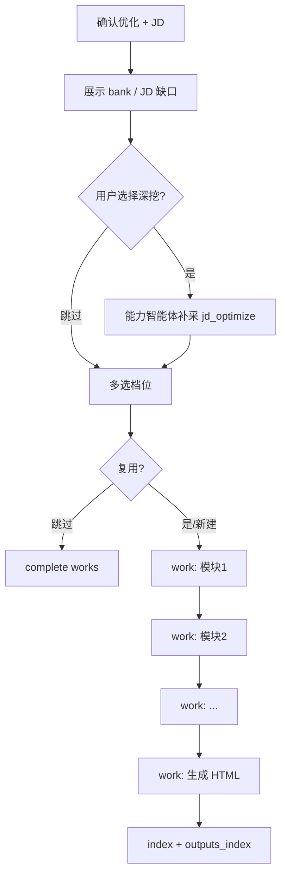

# 简历模块化优化

用户已 **确认按该岗位描述优化简历**，且入口编排智能体已完成 milestone 闸门并 **指派** 本技能包。**简历智能体** 在当前 `list_type=jd` 的 list 下 **自行** `create_task` 拆分 `work`（按模块/档位等，按需；新建任务须带 `list_type: jd`），在推理-行动循环中逐条执行，**小步 complete**，无需用户逐步确认每个模块。

## HARD-GATE

**禁止**：

- 开展职业初探五主题或 JD 对齐式长篇探讨（澄清一句即可，不加载 `career-inner-exploration` / `career-jd-alignment`）
- 在用户未选择是否深挖前，直接进入模块化 `work` 改写（须先完成 [B06 §5.5.0](../../docs/prd/B06.%20流程-简历优化%20PRD.md#550-jd-后经历素材补齐可选深挖)）
- 虚构未提供的经历、项目、职级、指标
- 在用户未确认优化前开始改简历

**必须**：

- 遵守用户 **多选** 的语义档位 **`保守`/`标准`/`进取`**（至少一档）；**每档各生成一份** HTML，文件名含 `-保守`/`-标准`/`-进取` 后缀（见下表与 [B06 简历优化 PRD](../docs/prd/B06.%20流程-简历优化%20PRD.md)）
- 对齐当前岗位描述的必备项表述（**标准/进取** 档）
- 每个 `work` 任务：`claim` → 修改 → `complete` → 删除对应 task JSON（[A02 §5.8.6](../docs/prd/A02.%20机制-任务系统%20PRD.md#586-任务完成与删除按文件非删目录)）
- 全部 work 完成后生成/更新 HTML 并维护 `outputs_index[]`

---

## 优化三档（与 [B06 简历优化 PRD](../docs/prd/B06.%20流程-简历优化%20PRD.md) 一致）

| 档位 | 允许 | 禁止 |
|------|------|------|
| **保守** | 措辞、结构、错别字 | 新增未提供事实 |
| **标准** | 保守档 + 情境-任务-行动-结果（STAR）+ 基于档案的量化 | 夸大或虚构指标 |
| **进取** | 标准档 + 招聘系统关键词、可迁移能力突出 | 任何造假 |

---

## 执行清单

1. **读取上下文** — `profile.json`（`resume.source_path` → 读取基线 Markdown、**`resume.experience_bank`**、`exploration.summary`、`career.*`、本 JD 指纹）、复用决策（沿用某 HTML / 新建）。
2. **JD 后素材闸门（[B06 §5.5.0](../../docs/prd/B06.%20流程-简历优化%20PRD.md#550-jd-后经历素材补齐可选深挖)）** — 由能力智能体（或协作）**先展示** 已有 `experience_bank` / capability / JD 缺口摘要；对话询问用户 **跳过深挖** 或 **继续深挖**（附录 B 话术）。若深挖：2–5 轮 JD 定向一问，确认后写入 `items[]`（`source: jd_optimize`），可更新 `narrative_summary`。**未完成本步不得** 进入档位选择与 `work`。
3. **多选档位** — 用户勾选 `levels[]`（至少一档，如 `["保守","进取"]`）。**标准/进取** 补全经历时 **优先** 使用 `experience_bank`（含 `jd_optimize`）中经确认的事实，禁止添加 bank 与对话均未出现的内容。
4. **复用分支**
   - 用户指定或已确认复用某 HTML → 以该版为基底，仅跑未覆盖的 `work`
   - 跳过优化 → 不创建新文件，直接 `complete` 剩余 work 并说明原因
5. **按 work 顺序执行**（典型拆分，由简历智能体按需 `create_task` 增减）：
   - 工作经历模块
   - 项目经历模块
   - 技能/其他模块
   - 全文连贯性 pass（可选 work）
   - **大语言模型选取文件名标签**（见下）→ 对 **每个所选档位** 生成 `{YYYY-MM-DD}-{能力偏好摘要}-{保守|标准|进取}.html`
   - 更新 `index.html` 列表（每档一行，`outputs_index[].optimization_level`）
6. **单模块循环** — 每个 work：产出修改片段 → 合并进当前稿 → 在 `proposed_task_completions` 建议对应 `work` task_id；**不** 自行 `claim_task` / `complete_task`（协调者 resume Run 成功后 B3 代为 complete）
7. **文件名标签（大语言模型）** — 生成网页前，根据 `profile.json`（含 exploration/career/简历）+ **当前岗位描述 + 当轮对话** 选 1–3 个标签；`custom[]` = 默认词表外，交付确认后沉淀新词表外标签：
   - 优先级：`selected[]` > 默认词表**未选**项 > `custom[]` > 必要时生成新词表外标签（简历交付确认后写入 `custom[]`）
   - **禁止** 照搬历史文件名/`outputs_index` 组合
   - 完整文件名冲突时在 `{能力偏好摘要}` 末加 `(1)`、`(2)` …；写入 `outputs_index[].filename_tags[]`（不含 `(n)` 消歧后缀）
8. **网页产出** — 单份简历 HTML **仅**优化后正文（打印友好，可直打 PDF）；管理见 `index.html`（[B07](../../docs/prd/B07.%20流程-HTML%20交付%20PRD.md)）
9. **收尾** — 更新 `outputs_index[]`（含每档 `optimization_level`）、`resume.last_optimization_levels[]`、`profile.meta.updated_at`；告知用户各档 HTML 路径；按档可选一句差异说明

---

## 与用户确认的关系

| 类型 | 是否需要用户逐步确认 |
|------|----------------------|
| 里程碑（确认按岗位描述优化） | **是**（进入本技能包前已完成） |
| JD 后是否继续深挖经历（§5.5.0） | **是**（展示已知信息后用户选择；可跳过） |
| 各 `work` 模块 | **否**，简历智能体自动推理-行动循环 |
| 最终是否满意 | 对话中可邀请用户查看网页，属反馈非闸门 |

---

## 流程图

---

## 延伸阅读

- 产品规格：`docs/prd/B06. 流程-简历优化 PRD.md`、`docs/prd/B05. 流程-简历复用 PRD.md`、`docs/prd/B07. 流程-HTML 交付 PRD.md`；架构见 `docs/prd/00. 职业规划 Agent PRD.md` §4.1
- 前置对齐：`career-jd-alignment` skill
