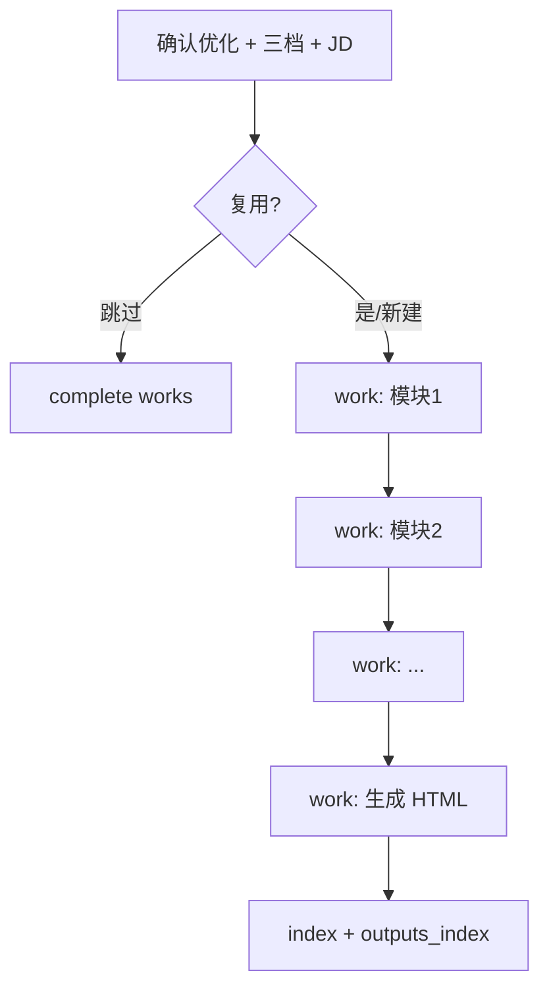

# 简历模块化优化（Resume Module Optimize）

用户已 **确认按该 JD 优化简历**，且主 Agent 已创建 `jd_*` list 下的 **`work` 子任务**（按简历模块拆分）。本 skill 约束 **简历专家** 在 ReAct 循环中逐模块执行，**小步 complete**，无需用户逐步确认每个模块。

## HARD-GATE

**禁止**：

- 开展职业初探或 JD 对齐式长篇探讨（澄清一句即可，不加载 `career-inner-exploration` / `career-jd-alignment`）
- 虚构未提供的经历、项目、职级、指标
- 在用户未确认优化前开始改简历

**必须**：

- 遵守用户选择的 **L1/L2/L3** 档位（见下表）
- 对齐当前 JD 的 must-have 表述（L2/L3）
- 每个 `work` 任务：`claim` → 修改 → `complete` → 删除对应 task JSON（§5.8.6）
- 全部 work 完成后生成/更新 HTML 并维护 `outputs_index[]`

---

## 优化三档（与 PRD §5.5 一致）

| 档位 | 允许 | 禁止 |
|------|------|------|
| **L1 保守** | 措辞、结构、错别字 | 新增未提供事实 |
| **L2 标准** | L1 + STAR + 基于档案的量化 | 夸大或虚构指标 |
| **L3 进取** | L2 + ATS 关键词、可迁移能力突出 | 任何造假 |

---

## 执行清单

1. **读取上下文** — `profile.json`（`resume.source_text`、**`resume.experience_bank`**、`exploration.summary`、`career.*`、本 JD 指纹）、用户选定档位、复用决策（沿用某 HTML / 新建）。L2/L3 补全经历时 **优先** 使用 `experience_bank` 中经初探确认的事实，禁止添加 bank 与对话均未出现的内容。
2. **复用分支**
   - 用户指定或已确认复用某 HTML → 以该版为基底，仅跑未覆盖的 `work`
   - 跳过优化 → 不创建新文件，直接 `complete` 剩余 work 并说明原因
3. **按 work 顺序执行**（典型拆分，主 Agent 可动态增减）：
   - 工作经历模块
   - 项目经历模块
   - 技能/其他模块
   - 全文连贯性 pass（可选 work）
   - **LLM 选取文件名标签**（见下）→ 生成 `{YYYY-MM-DD}-{能力偏好摘要}.html`
   - 更新 `index.html` 列表
4. **单模块循环** — 每个 work：`claim_task` → 产出修改片段（内部推理）→ 合并进当前稿 → `complete_task`（删除该 task 文件）
5. **文件名标签（LLM）** — 生成 HTML 前，根据 `profile.json`（含 exploration/career/简历）+ **当前 JD + 当轮对话**，从候选池选 1–3 个标签：
   - 优先级：`selected[]` > `custom[]` > 默认词表中用户**未选**但贴合本 JD 的项
   - **禁止** 使用候选池外自造词；写入 `outputs_index[].filename_tags[]`
6. **HTML 产出** — 顶栏渲染 `exploration.summary` + `career` 摘要；正文打印友好 CSS
7. **收尾** — 更新 `outputs_index[]`、`profile.meta.updated_at`；告知用户打开 `output/` 与索引页；可选一句说明为何选这些标签

---

## 与用户确认的关系

| 类型 | 是否需要用户逐步确认 |
|------|----------------------|
| milestone（确认按 JD 优化） | **是**（进入本 skill 前已完成） |
| 各 `work` 模块 | **否**，Agent 自动 ReAct |
| 最终是否满意 | 对话中可邀请用户查看 HTML，属反馈非闸门 |

---

## 流程图

---

## 延伸阅读

- 产品规格：`docs/prd/career-planning-agent-prd.md` §5.5、§5.6、§5.7（HTML）、§4.1（Agent）
- 前置对齐：`career-jd-alignment` skill
