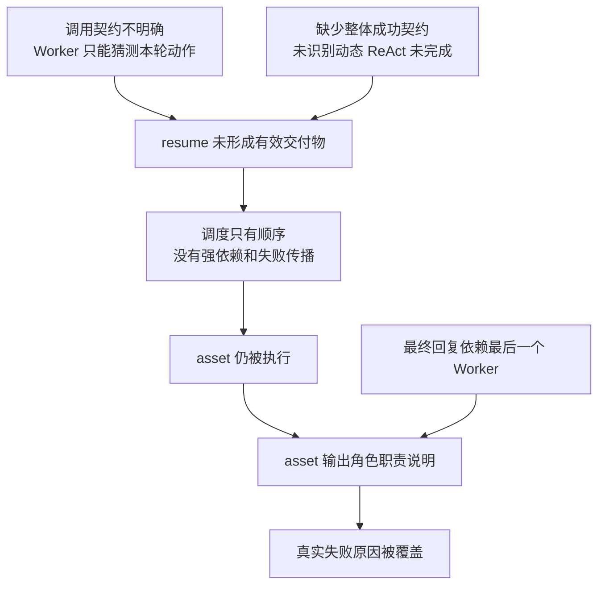
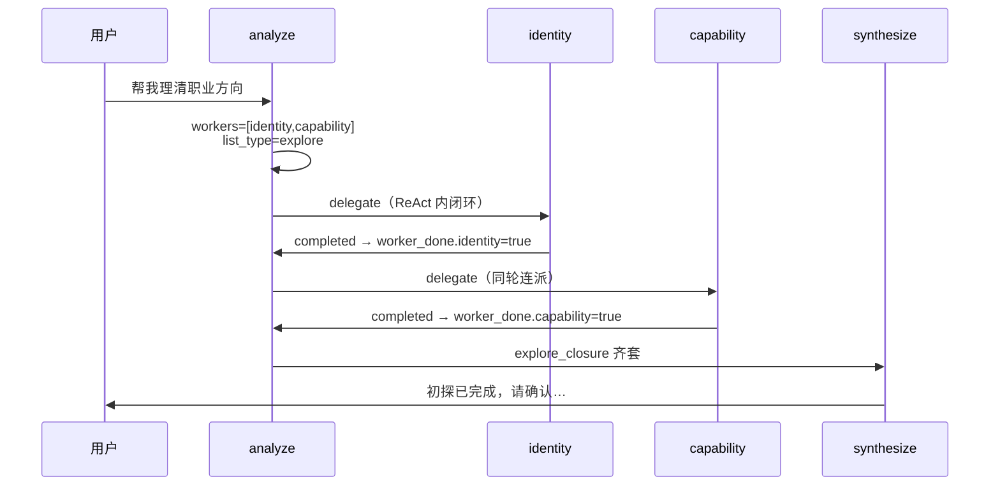

# Bug 记录

本文件记录已知缺陷，便于排查与排期修复。格式：**状态** · **发现日期** · **简述**。

## 模板（后续条目可复制）

```markdown
## BUG-XXX：标题

| 项 | 内容 |
| **状态** | 待修复 / 已修复 /  wontfix |
| **发现日期** | YYYY-MM-DD |
| **严重程度** | 高 / 中 / 低 |

### 现象
### 复现步骤
### 期望行为
### 实际行为
### 根因分析
使用因果图和文字说明触发条件、错误传播与用户影响，不记录容易过时的具体代码路径。
### 修复方向
### 验证建议
```

---

## BUG-002：简历生成失败后仍执行资产 Worker，最终回复被角色说明覆盖

| 项 | 内容 |
| --- | --- |
| **状态** | 待修复（Spec 与 Implementation Plan 已完成，运行时代码尚未实施） |
| **发现日期** | 2026-07-22 |
| **严重程度** | 高（核心交付链路错误，且向用户隐藏真实失败原因） |
| **影响范围** | `resume → asset` 简历交付链、Coordinator 调度与合成、Worker 结果判定、失败传播、Trace |

### 现象

用户进入简历优化流程后，`resume` Worker 没有成功生成可验证的 HTML 简历，但系统仍继续执行 `asset` Worker。最终回复没有说明简历生成失败，而是输出：

> 我的角色主要负责**资产登记和复用建议**，简历内容的优化（比如项目描述的改写、措辞调整）不是我直接负责的范畴。

用户无法得知真正失败的是简历生成，也无法判断是否产生了文件或资产登记记录。

### 复现步骤

1. 在干净环境创建 Session，并完成进入 `resume_optimize` 阶段所需的前置流程。
2. 确认开始简历优化，使当前调度包含 `resume` 和后续 `asset`。
3. 让 `resume` Worker 未形成有效 HTML 交付物，例如：
   - `write_resume_html`（写入 HTML 简历的 Tool）调用失败；
   - ReAct 提前结束；
   - Worker 返回合法 JSON，但 `html_deliveries`（HTML 交付物列表）为空；
   - Worker 只返回说明性文字，没有完成简历生成目标。
4. 观察系统仍继续执行 `asset` Worker。
5. 观察最终回复被 `asset` 的角色说明覆盖，没有展示 `resume` 的真实失败原因。

### 期望行为

- `resume` Worker Run 只有在至少产生一份经过验证的 HTML 交付物后才能判定成功。
- `resume` 失败、结果不完整或结果无法确认时，依赖它的 `asset.register_outputs` 不得执行。
- 未执行的 `asset` 节点应标记为 `blocked_by_upstream`（被上游阻断），且不创建虚假的 asset Worker Run。
- Turn 最终结果应根据整个 ExecutionPlan 和 Worker Run 状态聚合，而不是采用最后一个 Worker 的摘要。
- 用户应看到确定性、可理解的失败说明，例如“本次简历未能生成”，而不是 Worker 角色或内部职责说明。
- 输出目录和资产索引不得出现与失败 Run 对应的不完整新增记录。

### 实际行为

```text
resume Worker 没有形成成功交付物
→ Coordinator 未阻断 pending_workers 中的后续 asset
→ asset 继续收到面向简历优化的自然语言 goal
→ asset 根据自身角色生成职责边界说明
→ Coordinator 使用最后一个 Worker 结果生成最终回复
→ resume 的真实失败原因被覆盖
```

### 根因分析

该问题不是单一 Prompt 措辞错误，而是调用契约、运行结果和失败传播三层机制同时缺失。

1. **Worker 调用缺少强类型业务动作**

   Coordinator 当前主要传递 `worker_id`（Worker 标识）和自然语言 `goal`（本轮目标），没有不可变 `WorkerInvocation`（Worker 结构化调用契约）明确 `run_kind`（业务动作）、输入、允许 operation、必需 Skill 和成功契约。同一个 `asset` Worker 同时承担复用建议、产物登记和删除等动作，只能根据用户原话和零散 Session 状态猜测本轮职责。

2. **Worker Run 缺少整体成功判定**

   当前 Worker 返回结构化 JSON 或 ReAct 正常结束，不等于业务目标已经完成。系统没有统一检查必需 Tool 是否成功、交付物是否存在、HTML 是否有效、档位是否一致，也无法捕获“没有已知 Tool 错误但整体目标未完成”的动态 ReAct 失败。

3. **Coordinator 缺少依赖感知的失败传播**

   `pending_workers`（待执行 Worker 队列）只表达顺序，不表达 `asset.register_outputs` 对 `resume.generate_optimized_resume` 成功结果的强依赖。上游失败后，下游仍可能被继续调度。

4. **最终回复依赖最后一个 Worker**

   Coordinator 的合成路径主要读取 `last_worker_result`（最后一个 Worker 结果）。当错误执行的 asset 成为最后一个 Worker 时，其角色说明会覆盖 resume 的真实失败事实。

5. **失败策略与 Trace 不完整**

   Tool、模型、Store 和整体 Worker Run 没有统一的 Failure 分类、策略注册表和 Run 层级关联。当前 Trace 难以直接回答 resume 为什么失败、是否重试、为何继续 asset，以及最终消息为何采用 asset 摘要。



### 暂不采用的修复方向

以下三个顺序阶段现均标记为“暂不实现”，仅保留历史方案参考；未经重新评审和明确确认，不得据此修改当前系统。

1. **强类型 WorkerInvocation 与结果契约**
   - Coordinator 只提出 `InvocationProposal`（调用提议），内容为 Worker 和 Run Kind。
   - Harness 生成不可变 `WorkerInvocation`，冻结输入、允许 operation、Skill 和成功契约。
   - 确定性 Success Contract 只有在业务条件满足时才产生 `VerifiedOutcome`（已验证业务结果）。

2. **ExecutionPlan 与受控执行生命周期**
   - 使用 `ExecutionPlan` 表达 `resume.generate_optimized_resume → asset.register_outputs` 的依赖。
   - `asset.register_outputs` 只有取得上游已验证的 `verified_html_deliveries` 后才能物化 Invocation 并进入 ready。
   - Session、Gate、operation 授权和产物索引进入同一受控生命周期。

3. **全局失败机制**
   - 所有有业务意义的 operation 统一返回 Success、BusinessOutcome 或 Failure。
   - 由 OperationPolicyRegistry 按 operation 类型、错误码和幂等能力决定重试、核对、降级或失败。
   - Worker Run 同时检查已知 operation 事实和整体 Success Contract。
   - Turn 根据整个 Plan 聚合成功、失败、部分成功和上游阻断。
   - 用户错误消息由确定性目录生成，LLM 只能在严格约束下润色。

相关设计与实施计划：

- [强类型 WorkerInvocation 与结果契约 Spec（暂不实现）](docs/superpowers/specs/2026-07-23-typed-worker-invocation-contract-design-暂不实现.md)
- [强类型 WorkerInvocation 与结果契约 Plan（暂不实现）](docs/superpowers/plans/2026-07-23-typed-worker-invocation-contract-暂不实现.md)
- [ExecutionPlan 与受控执行生命周期 Spec（暂不实现）](docs/superpowers/specs/2026-07-23-execution-plan-controlled-lifecycle-design-暂不实现.md)
- [ExecutionPlan 与受控执行生命周期 Plan（暂不实现）](docs/superpowers/plans/2026-07-23-execution-plan-controlled-lifecycle-暂不实现.md)
- [全局失败机制 Spec（暂不实现）](docs/superpowers/specs/2026-07-23-global-failure-mechanism-design-暂不实现.md)
- [全局失败机制 Plan（暂不实现）](docs/superpowers/plans/2026-07-23-global-failure-mechanism-暂不实现.md)

### 验证建议

如果未来重新批准并完成三个阶段，在全局失败机制 Plan 的最终系统验收阶段使用干净临时环境增加跨模块回归测试：

- [ ] 创建全新 Session 并进入 `resume_optimize`。
- [ ] 创建 `resume.generate_optimized_resume → asset.register_outputs` ExecutionPlan。
- [ ] 模拟 resume 没有已知 Tool 错误，但交付物为空或语义结果不完整。
- [ ] 验证 resume Worker Run 不为 success。
- [ ] 验证 asset handler 未执行，节点为 `blocked_by_upstream`，且不存在 asset Worker Run。
- [ ] 验证 Turn 聚合结果正确，用户消息明确说明简历未生成。
- [ ] 验证回复不包含资产 Worker 的角色说明或同义推诿。
- [ ] 验证输出目录和资产索引无新增。
- [ ] 验证 Snapshot、Trace 和 Failure 使用同一组 Run、Plan、Invocation 与 operation 标识关联。
- [ ] 使用确定性 Runner、Adapter 和 Clock，不依赖真实 LLM、浏览器或网络。

---

## BUG-001：职业初探首条消息即提示「初探已完成」

| 项 | 内容 |
| --- | --- |
| **状态** | 已修复（方案 B：`phase_status`） |
| **发现日期** | 2026-05-31 |
| **严重程度** | 高（核心流程体验错误） |
| **影响范围** | explore 链（identity + capability）、协调者 synthesize、E2 `explore_closure` |

### 现象

用户首次表达职业初探意图（如「帮我理清职业方向」）时，协调者回复称 **身份与能力两线初步问询已完成**，并弹出 **explore_complete** 确认门（「是否确认初探完成」），与用户预期（应先多轮问询）不符。

### 复现步骤

1. 新建会话（或确保 `explore_closure` 未齐套、`exploration.completed_at` 未落档）。
2. 发送：`帮我理清职业方向`（或同类 explore 意图，不含寒暄）。
3. 观察协调者回复：出现「初探已完成 / 两线已完成」类表述，并请求确认是否完成初探。

### 期望行为

- 用户启动职业问询后，应先进入 **多轮对话式初探**（身份线、能力线逐步深挖）。
- 仅在用户与系统完成足够深度的问询后，才由协调者发起 **explore_complete** 收束确认。

### 实际行为

- 单条用户消息内，analyze 同时派工 `identity` + `capability`。
- 两 Worker 各跑一轮 ReAct 并返回 `structured_output` 即视为 `completed`。
- `explore_closure.worker_done` 齐套 → synthesize 写入 `explore_complete` gate，draft 为「初探两线已完成，请确认是否完成初探？」；LLM 润色后更易被理解成「已经聊完了」。

### 根因分析

**机制与产品语义不一致**：`worker_done[id]=true` 表示「该 Worker 本轮 Run 成功结束」，**不等于**「已与用户完成深度问询」。



**叠加因素**：

1. Worker ReAct 在 **单轮 chat 请求内** 执行，不向用户展示中间问询；用户仅看到协调者最终回复。
2. 协调者的 explore 场景会同时派发两个 Worker。
3. 同轮顺序委托的两条探索线都返回 `completed` 后，流程立即进入 explore gate。

### 非根因（可排除）

- 非 `exploration.completed_at` 已落档导致的 JD 前置误判（该字段影响 `jd_prerequisites_met`，不单独解释「首句即完成」）。
- 非旧 session `worker_done` 残留为主因（新会话 `explore_closure` 为 `null`，首次 delegate 会 `init_explore_closure()`）。

### 修复方向（待产品确认）

| 方案 | 思路 | 备注 |
| --- | --- | --- |
| **A** | explore 首轮只派一个 Worker（如先 identity） | 改动小，避免首句齐套 |
| **B** | Worker 区分「进行中 / 本段完成」；信息不足时不置 `worker_done` | 需扩展输出契约与 Harness |
| **C** | 首 explore 阶段禁止 `explore_complete`（如最少轮次 / patch 阈值） | 规则硬编码，易维护 |
| **D** | 初探由协调者主导多轮对话，够深再 delegate 落档 | 体验最接近预期，改动面大 |

### 修复说明（2026-05-31，方案 B）

- identity / capability 输出新增 **`phase_status`**：`in_progress` | `segment_complete`（默认 `in_progress`）
- `explore_closure.worker_done` 仅在 `segment_complete` 时置 true
- explore 链 **每轮最多派 1 个 Worker**；`in_progress` 时 **停止连派**，synthesize 展示 Worker 追问

### 验证建议（修复后）

- [x] 首条 explore 意图消息 **不** 出现 `explore_complete` gate
- [x] 多轮交互后（两线均 `segment_complete`）才触发 E2 收束
- [x] 自动化回归覆盖首轮不收束和多轮完成后收束两类场景

---

## BUG-000：职业初探多轮对话逐渐偏离探索主题

| 项 | 内容 |
| --- | --- |
| **状态** | 待修复 |
| **发现日期** | 2026-06-07 |
| **严重程度** | 高（影响职业初探有效性） |

### 现象

职业初探经过多轮对话后，问题逐渐深入到与个性探索或能力探索无关的细节，偏离职业初探目标。

### 根因分析

初步判断是长对话缺少周期性的目标重申和范围约束，导致后续问题随局部细节持续扩展。

### 修复方向

每三轮对话重新注入“当前正在进行职业初探”的目标提醒，并约束后续问题继续服务于个性或能力探索；可参考上下文自动压缩中的目标保留方式。

### 验证建议

- [ ] 连续进行六轮以上职业初探，问题仍围绕个性或能力探索。
- [ ] 发现无关细节时，系统主动收束并返回职业初探主题。
