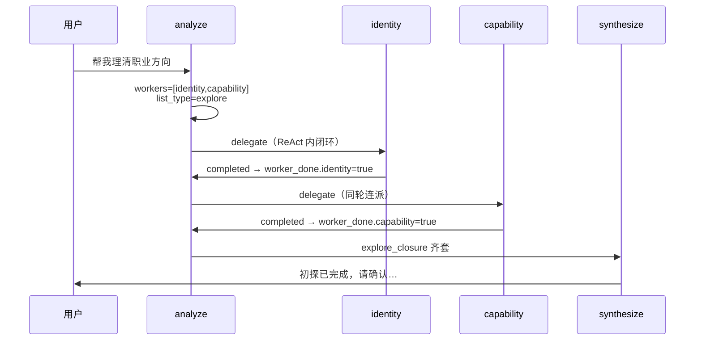

# Bug 记录

本文件记录已知缺陷，便于排查与排期修复。格式：**状态** · **发现日期** · **简述**。

---

## BUG-001：职业初探首条消息即提示「初探已完成」

| 项 | 内容 |
| --- | --- |
| **状态** | 已修复（方案 B：`phase_status`） |
| **发现日期** | 2026-05-31 |
| **严重程度** | 高（核心流程体验错误） |
| **影响范围** | explore 链（identity + capability）、协调者 synthesize、E2 `explore_closure` |

### 现象

用户首次表达职业初探意图（如「帮我理清职业方向」）时，协调者回复称 **身份与能力两线初步问询已完成**，并弹出 **explore_complete** 确认门（「是否确认初探完成」），与用户预期（应先多轮问询）不符。

### 复现步骤

1. 新建会话（或确保 `explore_closure` 未齐套、`exploration.completed_at` 未落档）。
2. 发送：`帮我理清职业方向`（或同类 explore 意图，不含寒暄）。
3. 观察协调者回复：出现「初探已完成 / 两线已完成」类表述，并请求确认是否完成初探。

### 期望行为

- 用户启动职业问询后，应先进入 **多轮对话式初探**（身份线、能力线逐步深挖）。
- 仅在用户与系统完成足够深度的问询后，才由协调者发起 **explore_complete** 收束确认。

### 实际行为

- 单条用户消息内，analyze 同时派工 `identity` + `capability`。
- 两 Worker 各跑一轮 ReAct 并返回 `structured_output` 即视为 `completed`。
- `explore_closure.worker_done` 齐套 → synthesize 写入 `explore_complete` gate，draft 为「初探两线已完成，请确认是否完成初探？」；LLM 润色后更易被理解成「已经聊完了」。

### 根因分析

**机制与产品语义不一致**：`worker_done[id]=true` 表示「该 Worker 本轮 Run 成功结束」，**不等于**「已与用户完成深度问询」。



**叠加因素**：

1. Worker ReAct 在 **单轮 chat 请求内** 执行，不向用户展示中间问询；用户仅看到协调者最终回复。
2. 协调者 prompt explore 场景示例为 **同时派双 Worker**（见 `platform/prompt/coordinator/system.md` 场景 C）。
3. E2 设计：同轮顺序 delegate，两线均 `completed` 后立即走 explore gate（见 `docs/architecture/10-会话闸门与state.md` §2.5）。

### 相关代码

| 路径 | 说明 |
| --- | --- |
| `backend/career_os/agents/graphs/coordinator.py` | `mark_worker_done`、`can_set_explore_gate_pending`、synthesize 写 `explore_complete` |
| `backend/career_os/harness/explore_closure.py` | `worker_done` 齐套判定 |
| `backend/career_os/agents/graphs/workers/react_runner.py` | Worker 单轮 ReAct 返回 JSON 即 `completed` |
| `backend/career_os/platform/prompt/coordinator/system.md` | explore 双 Worker 派工示例 |
| `backend/career_os/agents/lc/coordinator_llm.py` | analyze / synthesize LLM 调用 |

### 非根因（可排除）

- 非 `exploration.completed_at` 已落档导致的 JD 前置误判（该字段影响 `jd_prerequisites_met`，不单独解释「首句即完成」）。
- 非旧 session `worker_done` 残留为主因（新会话 `explore_closure` 为 `null`，首次 delegate 会 `init_explore_closure()`）。

### 修复方向（待产品确认）

| 方案 | 思路 | 备注 |
| --- | --- | --- |
| **A** | explore 首轮只派一个 Worker（如先 identity） | 改动小，避免首句齐套 |
| **B** | Worker 区分「进行中 / 本段完成」；信息不足时不置 `worker_done` | 需扩展输出契约与 Harness |
| **C** | 首 explore 阶段禁止 `explore_complete`（如最少轮次 / patch 阈值） | 规则硬编码，易维护 |
| **D** | 初探由协调者主导多轮对话，够深再 delegate 落档 | 体验最接近预期，改动面大 |

### 修复说明（2026-05-31，方案 B）

- identity / capability 输出新增 **`phase_status`**：`in_progress` | `segment_complete`（默认 `in_progress`）
- `explore_closure.worker_done` 仅在 `segment_complete` 时置 true
- explore 链 **每轮最多派 1 个 Worker**；`in_progress` 时 **停止连派**，synthesize 展示 Worker 追问
- 相关：`explore_closure.py`、`coordinator.py`、`workers.py`、identity/capability `system.md`

### 验证建议（修复后）

- [x] 首条 explore 意图消息 **不** 出现 `explore_complete` gate
- [x] 多轮交互后（两线均 `segment_complete`）才触发 E2 收束
- [x] `tests/e2e/test_explore_closure_e2e.py`、`test_coordinator_explore_phase.py` 覆盖

---

## 模板（后续条目可复制）

```markdown
## BUG-XXX：标题

| 项 | 内容 |
| **状态** | 待修复 / 已修复 /  wontfix |
| **发现日期** | YYYY-MM-DD |
| **严重程度** | 高 / 中 / 低 |

### 现象
### 复现步骤
### 期望行为
### 实际行为
### 根因分析
### 相关代码
### 修复方向
### 验证建议
```
