# AI-Optimized-Resume-V2

面向 IT 的职业规划智能体：结构化档案、Harness 动态任务、三阶段技能包（初探 / 岗位对齐 / 简历模块化）、本地网页简历。

**分支策略**：仅维护 `main`（本地与远端一致）。

```bash
# 首次（项目根）
make install
# 编辑 backend/.env：LLM_PROVIDER / LLM_API_KEY

# 空白环境（data/blank）
make dev blank
# 手测：make dev test · 演示：make dev demo
# 清空某环境数据：make clean demo
```

访问：**http://localhost:15173**

## 文档索引

| 类型      | 链接                                                                                                                                                   |
|---------|------------------------------------------------------------------------------------------------------------------------------------------------------|
| 产品需求    | [docs/prd/00. 职业规划 Agent PRD.md](docs/prd/00.%20职业规划%20Agent%20PRD.md)（总领）；A/B 系列子 PRD 见同目录                                                          |
| 架构设计    | [docs/architecture/00-架构总览.md](docs/architecture/00-架构总览.md)（一主多从协调者 + **Python 单体** + SSE）                                                          |
| 实施计划    | [Career OS v0.1](docs/superpowers/plans/2026-05-31-career-os-v0.1.md) · [Worker ReAct](docs/superpowers/plans/2026-05-31-real-agent-worker-react.md) |
| 简历项目描述  | [docs/简历项目描述.md](docs/简历项目描述.md)（直贴简历用）                                                                                                              |
| 技能包     | [.agent/README.md](.agent/README.md)（`load_skill` 索引）                                                                                                |
| Eval 清单 | [backend/tests/eval/CASES.md](backend/tests/eval/CASES.md)                                                                                           |
| 边界参考    | [docs/参考文档.md](docs/参考文档.md)                                                                                                                         |

## 当前状态（v0.1 · main）

| 模块          | 状态                                                                                  |
|-------------|-------------------------------------------------------------------------------------|
| Harness 运行时 | Task / Profile / Tool / Skill / Storage 平台服务；`load_skill` + `capability_bundle` 派工  |
| 协调者         | LangGraph 编排；analyze 选人 + synthesize **LiteLLM 真流式**                                |
| 7 类 Worker  | 全部 **ReAct**（`run_worker_react`）；无 `LLM_API_KEY` 时 L1 走 `react_mocks`               |
| LLM         | [LiteLLM](backend/career_os/agents/lc/providers.py) 统一路由；配置见 `backend/.env.example` |
| 前端          | React + Vite；Chat SSE（含 `gate` 事件展示）                                                |
| 评测          | **96** pytest（L1 **90** + LLM **6**）；trace 写入各环境 `data/{demo                        |test}/logs/traces/` |
| 市场调研        | 用户确认冻结方案后，专用可见 Chrome 串行采集搜索关注度与 BOSS 当前岗位；状态卡轮询、结果确认、复用和方向重试已接入                    |

尚未落地或待深化：记忆索引 side-query、三档 HTML 生成顺序复用、Browser Tool 生产级降级、部分 PRD 业务流程细节（见下方「优化点」）。

## 实机演示

以下截图展示从隔离环境启动、职业信息建档、受控市场调研、JD 分析到简历交付与环境清理的完整主链路。

### 1. 本地环境启动

#### 1.1 一条命令启动

开发者运行 `make dev demo`，脚本初始化隔离的演示环境并启动 FastAPI 后端与 Vite 前端。终端同步显示本地访问地址和服务启动状态，方便现场复现。

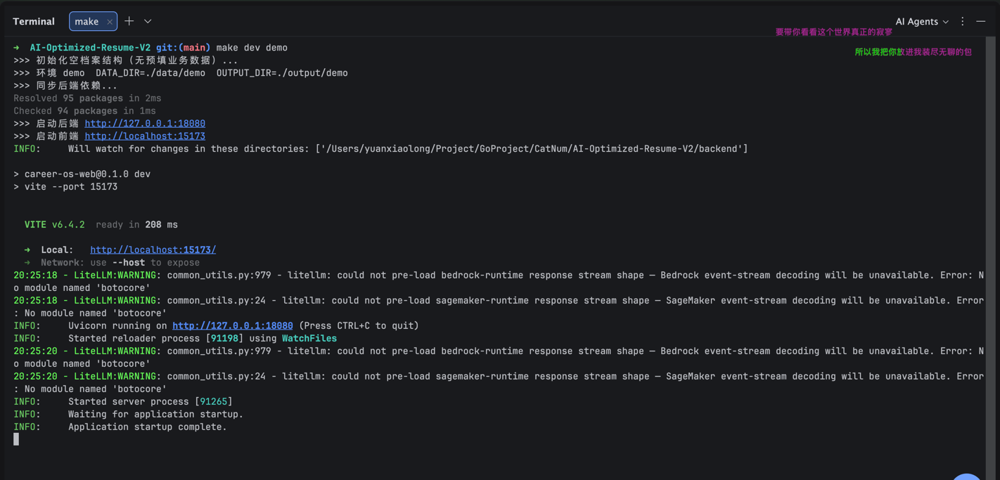

### 2. 建档与职业初探

#### 2.1 新建隔离会话

用户创建新会话后，系统从职业初探阶段开始，后续阶段保持未启用状态。会话列表、阶段状态和简历产物区彼此分离，为每次职业规划保留独立上下文。

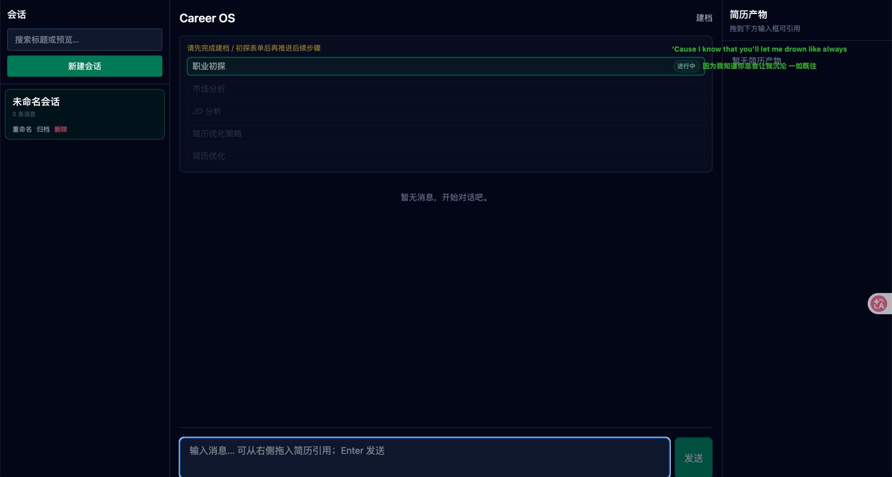

#### 2.2 通过对话开始职业规划

用户描述转行、岗位提升或探索新方向等目标，系统在职业初探阶段继续追问背景和约束。对话结果逐步形成后续市场分析与岗位决策所需的稳定上下文。

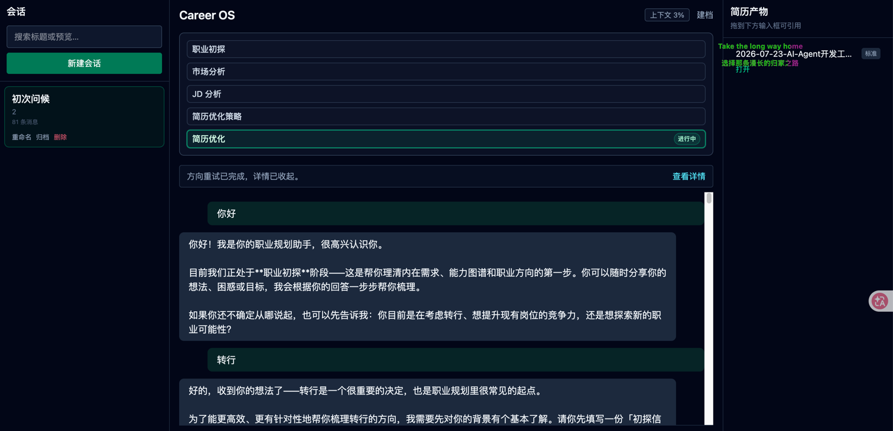

#### 2.3 收集基础职业信息

用户可以粘贴完整简历，并按需补充工作年限、目标岗位和薪资预期。系统先通过结构化表单建立职业上下文，再在后续对话中确认缺失信息。

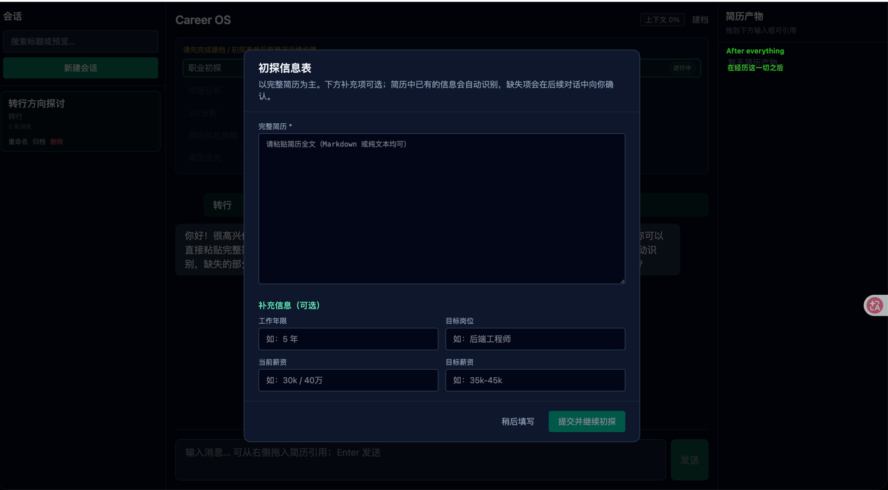

#### 2.4 拒绝越级调研

用户在职业上下文不足时请求直接发起市场调研。流程闸门拒绝越级执行，并引导用户先补充调研所需的职业信息。

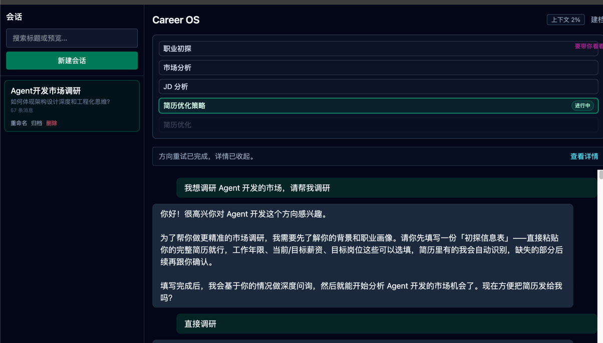

### 3. 市场调研执行

#### 3.1 可观测的异步进度

市场调研以独立任务运行，状态卡持续展示当前阶段、候选数、有效数、过滤原因和耗时。用户可以在界面中查看重试状态，并在需要时取消任务。

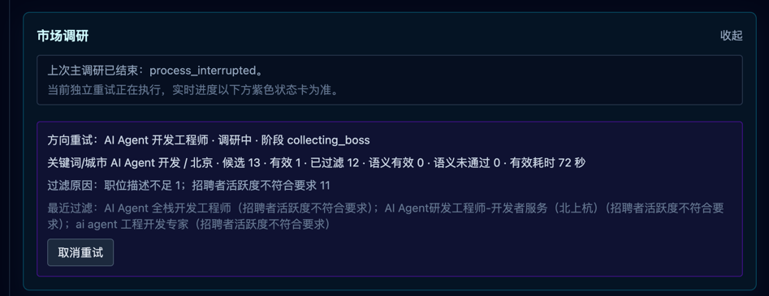

#### 3.2 真实岗位数据采集

专用浏览器按照已确认的关键词和城市条件访问招聘页面并采集岗位。浏览器过程保持可见，便于现场确认 Agent 正在执行真实工具操作。

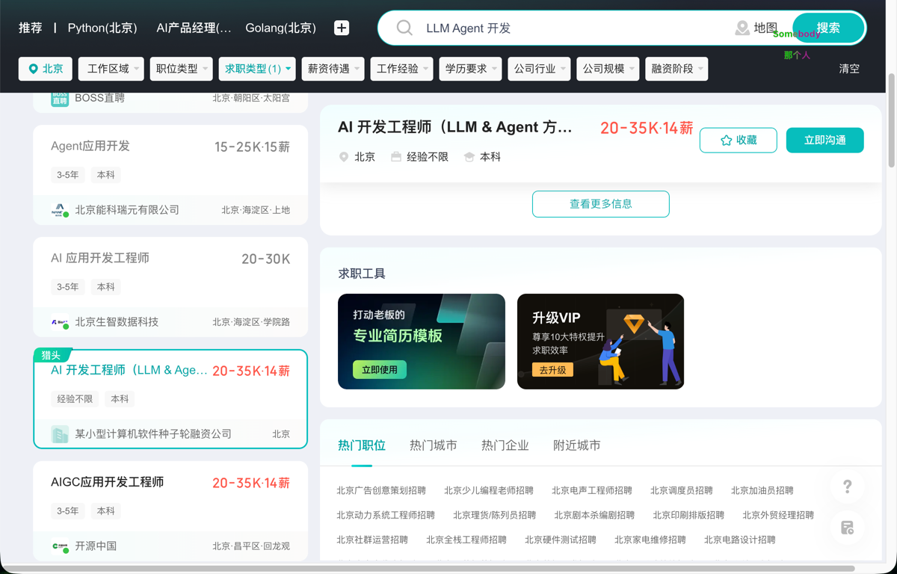

#### 3.3 市场调研结果

系统结合市场调研结果与候选人的能力背景给出方向匹配总结，同时明确样本限制和待补足项。用户确认结果后，流程才进入具体 JD 分析阶段。

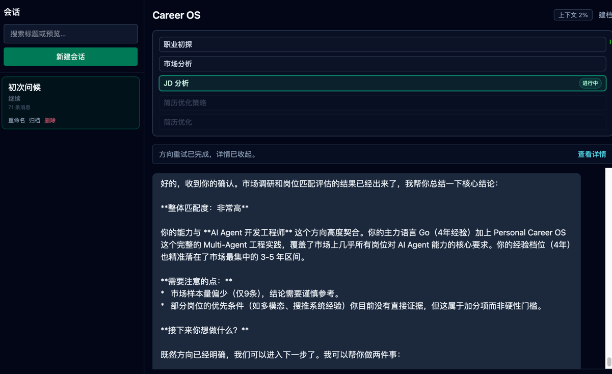

### 4. JD 分析与策略确认

#### 4.1 分析具体 JD

用户提供目标岗位 JD 后，系统对照已有能力与项目经历识别匹配优势和关键差距。分析结果进一步给出是否值得投递以及面试准备方向。

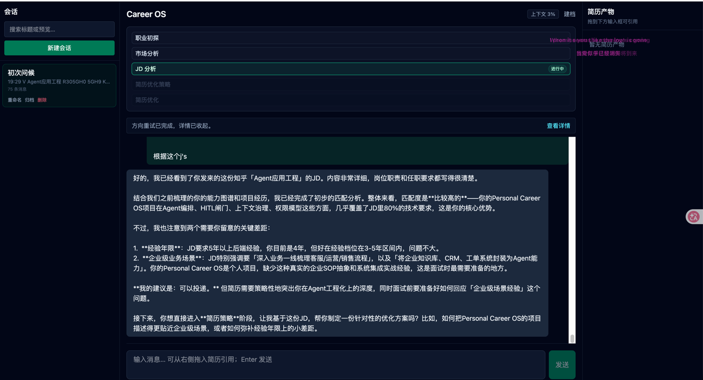

#### 4.2 生成并确认优化策略

系统根据具体 JD 生成简历优化策略，说明项目叙事和经验补强方向。真正修改简历前再次请求用户确认，避免模型未经授权直接改写交付物。

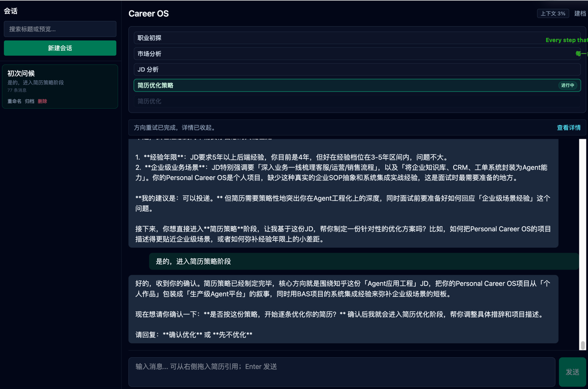

### 5. 最终交付

#### 5.1 选择简历优化档位

用户确认进入简历优化阶段后，可以在保守档、标准档和进取档之间选择调整幅度。系统先说明不同档位的改写边界，再根据用户选择执行对应的优化策略。

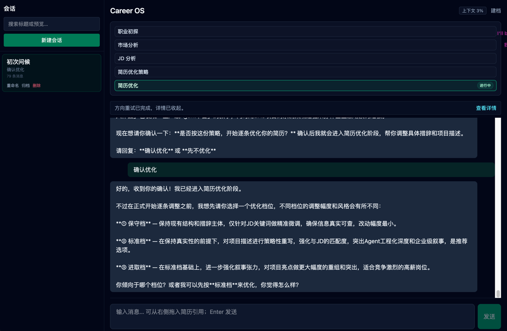

#### 5.2 生成并登记简历产物

系统按照用户选择的档位完成内容优化，并生成带有明确名称的 HTML 简历文件。生成结果同步登记到简历产物区，用户可以直接打开后续交付物。

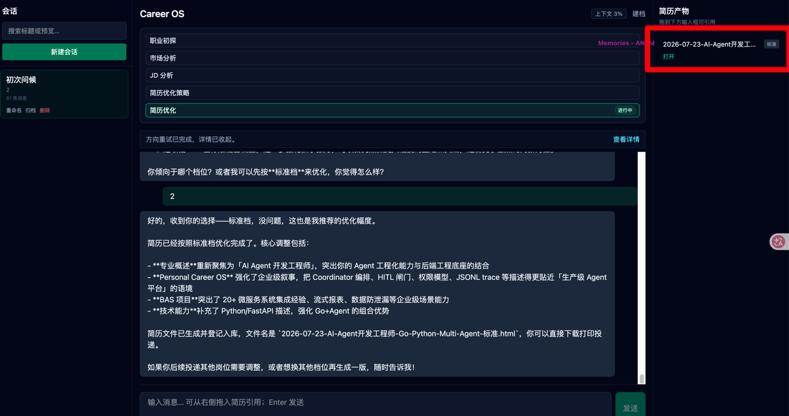

#### 5.3 查看最终 HTML 简历

用户从简历产物区打开生成文件，即可查看、下载和打印完整的 HTML 简历。最终页面集中呈现专业概述、工作经历和核心项目等求职内容。

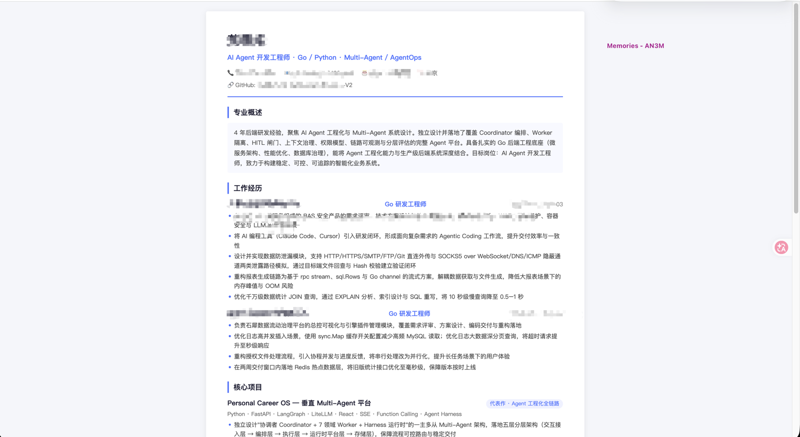

### 6. 演示收尾

#### 6.1 按环境清理运行数据

开发者运行 `make clean <suffix>` 清除指定环境的数据与输出，并获得本次清理路径和后续启动提示。清理命令只作用于目标后缀，便于重复演示时恢复干净状态。

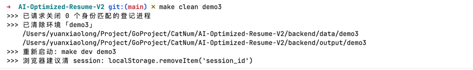

> 更多运行过程、诊断信息和中间状态截图，见 [docs/assets/screenshots/](docs/assets/screenshots/)。
>
> 以上截图来自两次独立任务：主流程截图运行于 `make dev demo`，环境清理截图运行于 `make clean demo3`。

## 快速开始

**环境**：Python ≥ 3.11、[uv](https://docs.astral.sh/uv/)、Node.js（前端）。

**一键启动**（后端 `:18080` + 前端 `:15173`）：

```bash
make dev blank      # 空白档案
make dev test       # 手测（data/test）
make dev demo       # 演示环境（空档案结构，无预填业务数据）
make dev sandbox    # 任意后缀，数据完全隔离
```

数据落在 `backend/data/{后缀}/`、`backend/output/{后缀}/`。启动时会创建 **`profile.json` 空结构**（无姓名、JD
等预填值）；业务数据仅在「建档」或对话落档后写入。`data/profile.example.json` 仅供文档/测试参考。

**清空某环境数据**（删除该后缀下的档案、会话、trace、HTML 产出；不影响其它后缀）：

```bash
make clean demo       # 清除 data/demo 与 output/demo
make clean test
./scripts/clean.sh blank
```

清除后重新启动：`make dev demo`。若浏览器仍连着旧会话，请无痕打开或执行 `localStorage.removeItem('session_id')`。

`make dev <后缀>` 会在 `backend/data/<后缀>/market_research/runtime/` 登记 dev shell、后端、前端和按需启动的专用 Chrome
进程身份。`make clean <后缀>` 会先复核 demo、PID、启动时间、可执行路径和命令标识，只关闭身份仍匹配的进程；先发送 TERM 并等待最多
10 秒，仍未退出时才对同一身份发送 KILL，然后删除该后缀的数据和输出。日常 Chrome 与其他 demo 不在清理范围内。

## 市场调研主路径

1. 在职业初探后查看 1～3 个方向的调研方案，核对 BOSS 词、搜索关注度词、城市顺序、经验口径和固定筛选规则。
2. 如有需要先修改方案；点击“确认方案并开始调研”后，当前 Session 的聊天输入和附件会锁定。
3. 专用可见 Chrome 需要登录或验证时，状态卡进入 `waiting_user`（等待用户），完成操作后点击继续；也可以安全取消。
4. 完成后普通 assistant 消息展示纯文本报告。必须再次确认当前不可变结果，Opportunity Worker 才能读取市场上下文并进入 JD 分析。
5. 同 demo 的其他 Session 只会看到未过期复用候选，不会自动复用；方向重试拥有独立状态，原主任务终态和旧结果版本保持不变。

市场调研不保存 JD 原文。岗位职责和要求是经校验的 LLM 提取结果；人工审计只保留 10% 页面抽样截图。招聘者活跃度固定允许“刚刚活跃”“今日活跃”“3
日内活跃”。Google 数据只表示搜索关注度，不代表招聘趋势。

静态与前端构建检查：

```bash
make market-check
```

**分步启动**（需两个终端）：

```bash
# 1. 后端依赖
cd backend && uv sync

# 2. LLM（可选；不配 Key 时 L1 测试与 mock 路径仍可用）
cp .env.example .env
# 编辑 .env：LLM_PROVIDER / LLM_API_KEY

# 3. 启动后端（默认 18080，与前端 proxy 一致）
uv run uvicorn career_os.main:app --reload --port 18080

# 4. 另开终端：前端
cd web && npm install && npm run dev
# → http://localhost:15173
```

本地数据与产出（`backend/data/{SUFFIX}/`、`backend/output/{SUFFIX}/`，均不入 Git）：

| 后缀      | 典型用途                  |
|---------|-----------------------|
| `blank` | 一次性空白验证               |
| `test`  | 长期手测                  |
| `demo`  | 演示（与 blank 相同，档案按需产生） |

端口冲突：`BACKEND_PORT=19080 FRONTEND_PORT=16173 make dev blank`

## 仓库结构

```text
.
├── backend/career_os/     # FastAPI + Harness + 协调者/Worker + LiteLLM
├── backend/tests/         # L1 / e2e / eval（-m llm 需 Key）
├── web/                   # React Chat UI
├── .agent/skills/         # 三阶段 Skill 包（Worker Run 内 load_skill）
├── docs/prd/              # 产品规格
├── docs/architecture/     # 架构与协议
├── docs/assets/screenshots/ # 产品运行界面截图
├── docs/superpowers/plans/ # 迭代实施计划
├── scripts/dev.sh         # make dev <suffix>
├── scripts/clean.sh       # make clean <suffix>
└── Makefile
```

## 测试

```bash
cd backend

# L1：确定性，无需 Key（默认）
uv run pytest tests/ -m "not llm" -q

# LLM eval：需 backend/.env 配置 LLM_API_KEY
uv run pytest tests/eval/ -m llm -v
```

## 规划

- [ ] Multi-Agent 架构，不用岗位使用不同的 Agent 支持
    - [ ] 路由：关键词适配 -> 语义向量适配 -> 大模型路由
    - [ ] ReAct 架构、Plan And Execute 架构
    - [ ] 加入一个审批 Agent，对结果进行审批
- [ ] 编排服务 langgraph？
    - [ ] 专业领域 Agent + HR Agent
    - [ ] 业务流程：
        - [ ] 获取基本信息（JD、候选人信息（简历、过往经历越细越好）、候选人偏好等）
        - [ ] 以面试官的视角深挖简历经历，或者也不是以面试官的视角，就是一步一步的问，深挖经历（为什么这么做，因为简历是经历的浓缩，但是不代表全部的经历）
        - [ ] 判断 JD 和候选人信息是否强不一致
        - [ ] 判断 候选人是否要转行
- [ ] 记忆系统
- [ ] Task 系统
- [ ] 工具
    - [ ] function call
        - [ ] 联网能力
    - [ ] skill 机制
    - [ ] Prompt 管理
        - [ ] 简历模版 Prompt，用户选择风格，使用不同 prompt 生成对应的 html 效果
    - [ ] mcp
        - [ ] 将斯坦福人生设计设计为 mcp，参照 langchian 文档的设计【这里可以不参照 langchain，其实 rag 比较合适，langchain
          设计为 mcp 的原因是方便大家接入】
    - [ ] rag
- [ ] 【重要】加入评测 benchmark，评测体系需要好好想想
- [ ] 需要一份 禁止 列表，告诉 Agent 什么不能做
- [ ] 业务流程：
    - [ ] 简历优化需要细化，增加 skill
    - [ ] JD 评估需要细化？
    - [ ] 简单的用户 query 改写。比如指代性的语句改写

## 优化点

- [x] 一份 prd 拆分为多份，一份太大了，不好优化
    - [x] prd、技术文档按需拆解，在做某一部分的代码编写的时候只看某一部分的文档
- [ ] 各业务流程细节的确认优化
    - [ ] 需要确认长期记忆都存储哪些信息，Agent
      执行的时候都调用长期记忆中的哪些信息（见 [A01 机制-职业档案 PRD](docs/prd/A01.%20机制-职业档案%20PRD.md)）
    - [ ] 简历优化遵循 STAR 原则（见 [B06 流程-简历优化 PRD](docs/prd/B06.%20流程-简历优化%20PRD.md)、
      `resume-module-optimize` SKILL）
- [ ] career-inner-exploration skill 目前在身份智能体和能力智能体两个智能体中都使用了，需要拆分为两个 skill，或者在 skill
  中设置分支，分别描述两个 agent 需要的能力
- [x] JD 后简历优化前可选深挖经历（先展示已有
  bank，用户选择；见 [B06 §5.5.0](docs/prd/B06.%20流程-简历优化%20PRD.md#550-jd-后经历素材补齐可选深挖)）
- [ ] 在进行 JD 适配评测时，也可以深挖用户经历来更深度的辅助判断是否适配（B03 阶段，与 B06 优化前深挖不同）
- [ ] 如果要同时生成多种档位的 html 简历优化，应该按照保守、标准、进取的顺序进行生成，在创建细分多任务列表时，注意哪些信息可以复用（PRD
  已定义多选多份与语义后缀 [B06](docs/prd/B06.%20流程-简历优化%20PRD.md)；生成顺序与 work 复用待实现）
    - [ ] 这里应该引入一个 skill
- [ ] 如何区分任务是否需要拆分为多任务列表？
- [ ] 记忆系统（主要指长期记忆）
    - [ ] 文件数多了之后，进行去重、合并、剪枝
    - [ ] 加索引，索引常驻 System Prompt，按需加载
        - [ ] 通过 side-query 将索引文件发给 llm，让 llm 选择；side-query 失败（API 错误、JSON 解析失败），降级到关键词匹配
          name + description
- [ ] 当前任务过于固定，改为动态生成
- [x] 去掉简历的四个小任务阶段
- [ ] 思考过程比较慢，需要优化
- [x] 【Bug】长期记忆会话隔离，一个会话上传简历信息了，但是另一个会话没有看到
- [x] 【Bug】刚创建会话时，任务列表应该无选中“进行中”的任务，而且如果进入随便聊聊状态，不应该进入任何一个任务
  - [ ]【】目前的任务是固定大任务流程，针对大任务之内的执行，应该分析用户消息来动态创建小步骤的任务来执行
- [ ] Agent 间的通知机制【需要优化】
- [ ] 【已形成设计，待实施】Worker 缺少强类型调用契约：Coordinator 当前主要传递 `worker_id` 与自然语言 `goal`，同一 Worker
  承担多个业务动作时，会根据用户原话和零散 Session 状态猜测本次职责，存在选错 Skill mode、调用错误 Tool、遗漏必需输入或错误串行下游
  Worker 的风险
    -
    设计见 [强类型 WorkerInvocation 与 ExecutionPlan](docs/superpowers/specs/2026-07-23-typed-worker-invocation-execution-plan-design.md)
    ；它是 [全局失败机制](docs/superpowers/specs/2026-07-23-global-failure-mechanism-design.md) 的前置改造
    -
    实施计划：[强类型调用](docs/superpowers/plans/2026-07-23-typed-worker-invocation-execution-plan.md) → [全局失败机制](docs/superpowers/plans/2026-07-23-global-failure-mechanism.md)
    - `WorkerInvocation` 至少明确 `worker`、`run_kind`、`required_inputs`、`allowed_operations`、`required_skills`、
      `success_contract_id`
    - 建议区分：`identity.exploration_first / exploration_revisit`、
      `capability.exploration_first / exploration_revisit / jd_bank_deep_dive`、
      `market.propose_plan / revise_plan / start_research`、`opportunity.evaluate`、
      `strategy.jd_application / career_plan`、`resume.collect_optimization_levels / generate_optimized_resume`、
      `asset.reuse_outputs / register_outputs / delete_output`
    - 两份 spec 和两份 plan 已分别完成；实施顺序固定为“先强类型调用、后全局失败机制”，最终在干净环境执行原 Bug 的跨模块系统级回归
- [ ] **需要做简历的脱敏**

## todo

- [x] 加入评测（L1 + `-m llm` 分层；清单见 [CASES.md](backend/tests/eval/CASES.md)）
- [x] Worker ReAct + LiteLLM 真推理（协调者 analyze/synthesize + 7 Worker）
- [ ] 加入监测、可审计、过程日志记录，帮助升级 Harness（trace JSONL 已有基础，待产品化）
- [ ] 引入 offer 对比、选择：规划 AI Agent 引入外包、正编、五险一金等 offer 对比功能，使用 skill 引入
- [ ] 就业城市选择、大学城市、专业选择、定居城市选择等等（要不要做呢？有点大而全了）：AI Agent
  的项目其实还可以做更多东西，比如说城市选择、未来结婚的时间点、行业与城市供应链选择；从大学刚毕业或高考之后选专业、大学城市，再选行业与所在城市，以及跟对象的定居城市、长期发展城市等
- [ ] 上下文压缩：session memory 关注同一会话内的连续性；compact 之后，当前会话还需要保留哪些上下文。两者配合使用：Memory
  管长期知识，session memory 管当前会话的压缩续接
- [x] Skill 管理：Python `career_os` Harness（见 [docs/architecture/02-平台服务.md](docs/architecture/02-平台服务.md)）
- [ ] 加入评测 Agent
- [ ] 引入简历模板 Skill：在创建简历 HTML 时，根据用户选择的预置风格，调用 Skill 中不同的部分，生成对应的最终简历
    - [ ] 引入模板解析 Agent：用户上传简历模板，做一个模板解析 agent，解析成对应的 html，解析出对应的模板简历风格，补充到用户自定义的简历模板
      Skill 中
- [ ] 市场 Agent 可以在初探表单填写完成之后就后台异步执行，而不是一个必须经过的流程
    - 基于简历内容、目标岗位来进行市场调研和分析。结构化调研流程、调研内容、输出结果，沉淀为 skill。
    - 【ai 参考用户简历进行用户调研会导致调研结果偏向简历，不客观，是美化后的结果】市场调研不得参考当前用户信息。
- [ ] 如果用户有多个预期方向怎么办？
    - 这里的数据是否需要会话隔离还是共享？
- [ ] 用户在深挖过程中没有找到自己的优势、最能体现技术点的经历怎么办？
- [ ] Agent 在做简历和 JD 匹配度高的时候，依据是什么？需要确定，以及需要出报告
- [ ] 需要 Mutil-Agent 架构吗？
    - 答：好像不需要，同步Agent 好像不需要，只要根据不同流程，维护不同的 system Prompt、tool、skill 等工具配套，只要开一个 api
      调用就算一个 agent。如果不是 异步提速、Token 爆炸的场景，好像都不需要子 Agent。
- [ ] 简历优化 Agent 完全可以全量数据传递，分阶段裁剪省 token。【这里好像没必要省 token，为了准确性都传更好一些】
- [ ] 多流程 Agent 其实是父子型，多简历生成，简历不同模块的并发生成其实是主从型【真的需要主从型吗？感觉不需要，简历优化吞吐量比较小】。
    - 主从型的优势就是异步并行

## 核心

1. 如何做出随着模型能力提升而提升的 harness 产品？
    - 哪些是 harness 该管的，哪些是模型该管的。边界是什么
    - harness 应该与 **业务** 有关吗？**【详情见示例】**
        - 我们在教一个孩子的时候，会分别专门教他**分析销售数据**和**分析用户行为数据**两套逻辑吗？不会吧，如果需要分别教
          llm，则说明 llm 还不够聪明，这应该是大脑负责的事情，不应该 harness 来做。
2. Agent 如何切割？Agent 的边界是什么？（类似微服务的切割）
3. 大脑才是决策。
    - 分部门分组织架构的目的就是为了将信息一层一层的精炼收集到最高层，然后让最高层决策。
    - 那我们的 Agent 架构是不是应该也是这样做？
4. ~~如果要做 GO + Python 的架构，如何切割？~~ → **已决策：v0.1 纯 Python**
   （见 [docs/architecture/04-应用运行时与部署.md](docs/architecture/04-应用运行时与部署.md)）

## 产品演进

- **V1**：主要功能为根据 JD 修改简历，判断是否符合职业规划为次要功能
- **V2（当前）**：长期规划，根据 JD 修改简历是其中的一个功能。产品不再只聚焦单次 JD 投递，而是长期职业记忆 + 职业资本推演 + 简历
  HTML 交付的个人职业操作系统。
- **V3**：寻找自己。扩展到多行业多岗位时，才能扩展到这一步。
    - 规划的本质是找自己，向内求，每个人的自己都不一样，别人的成功不一定适合自己。
    - AI
      这个项目是叫人生规划系统，其实它是一个寻找自己的系统。其实人生规划不是你要成为多成功的人，而是在寻找自己路上如何成为一个自己人在最后，无论如何都会接近，无限接近，然后成为自己的，不管是经历怎样的路程，你都会是最初自己。不管是有世俗的成功也好，或者是没有世俗的成功也好
    - 自己的偏好更重要，而不是以外界世界的成功来作为主要资料引导规划路径

## 示例

### 示例 1 Harness 应该与业务有关吗？

下面这份 Skill 的描述来自于 hello-agents，但是这个描述与业务强相关。

不应该抽取 Text -> SQL 这个抽象，然后让 LLM 这个大脑去实际填充业务吗？

这样 Harness 工程就与业务分割开，可以随着 llm 能力的提升而提升，而且可以适配多种业务场景。

```
description: >
  将中文业务问题转换为 SQL 查询并分析 MySQL employees 示例数据库。
  适用于员工信息查询、薪资统计、部门分析、职位变动历史等场景。
  当用户询问关于员工、薪资、部门的数据时使用此技能。
```
