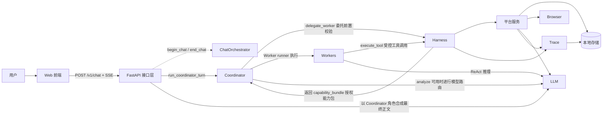
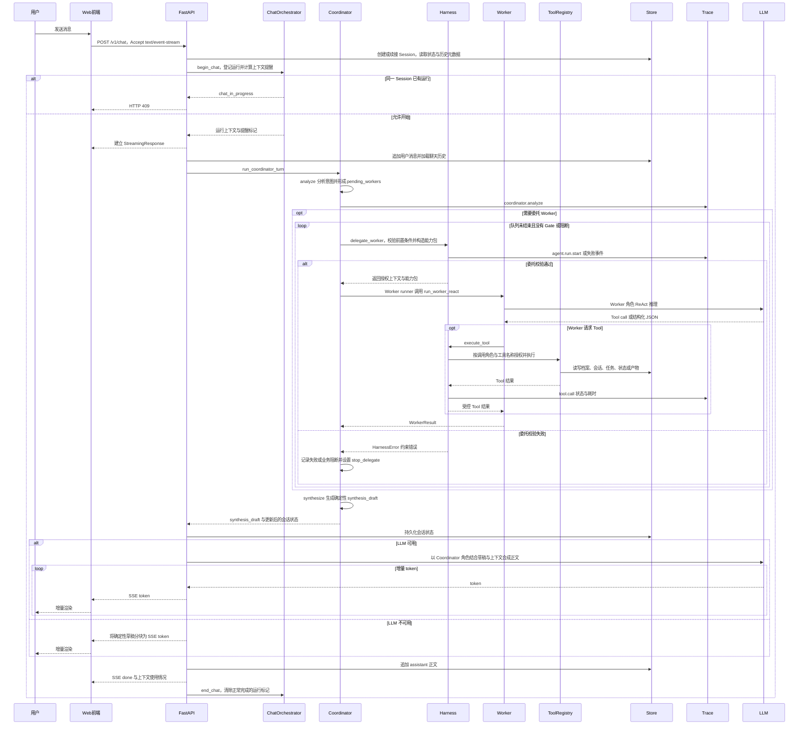

# Career OS

可控、可观测、可评测的职业规划 AI Agent。

## 1. Career OS 定位与解决的问题

Career OS 面向持续的职业规划：从职业初探建立结构化上下文，延伸到市场调研、JD（职位描述）分析、简历优化和 HTML 简历交付。它不是只针对单个
JD 做一次改写，而是把职业事实、阶段决策、受控执行和最终产物串成一条本地优先的工作流。

项目的工程边界是：**模型负责决策，Harness 负责约束；执行过程可追踪，最终效果可评测。** Harness（受控执行层）负责
Gate（阶段确认关卡）、Worker（业务工作者）委托、Tool（工具）授权、状态约束和 Trace（运行追踪），作用是让模型生成的计划在确定性边界内执行。

- 仓库代号：`AI-Optimized-Resume-V2`，用于标识当前代码仓库。
- 当前产品文档版本：`v2.2（开发中）`，用于说明当前交付范围与状态；`v2.1` 已按“验收未完成”归档。产品路线版本不同于代码包版本。
- 分支策略：只维护 `main`。

### 1.1 产品愿景与代际演进

- **V1**：主要功能是根据 JD 修改简历，判断是否符合职业规划是次要功能。
- **V2（当前代际）**：以长期规划为主，根据 JD 修改简历是其中一个功能。产品不再只聚焦单次 JD 投递，而是成为由长期职业记忆、职业资本推演与简历
  HTML 交付构成的个人职业操作系统。
- **V3**：在能力扩展到多行业、多岗位时进入“寻找自己”的阶段。
    - 规划的本质是找自己、向内求。每个人的自己不同，别人的成功不一定适合自己。
    - “人生规划系统”也可以理解成“寻找自己的系统”：人生规划不是要求成为多成功的人，而是在寻找自己的路上不断接近、最终成为自己；无论经历怎样的路程，也无论是否取得世俗意义上的成功，最终都应回到最初的自己。
    - 自己的偏好比外界定义的成功更重要，规划路径不应主要由外部成功样本引导。

完整的跨版本规划、候选方向和设计思考持续维护在[《产品规划与技术演进》](docs/roadmap/产品规划与技术演进.md)。

## 2. 快速开始

### 2.1 最短启动路径

1. 准备 Python 3.11 或更高版本、[uv](https://docs.astral.sh/uv/) 以及包含 `npm` 的 Node.js 环境。
2. 在项目根目录运行安装命令：

   ```bash
   make install
   ```

   `make install`（安装命令）会同步后端 Python 依赖、安装前端 Node.js 依赖，并在 `backend/.env` 不存在时从
   `backend/.env.example` 创建配置文件。
3. 编辑 `backend/.env`，配置 `LLM_PROVIDER`（大语言模型服务提供方）和 `LLM_API_KEY`（访问该服务的密钥）。未配置可用 Key 时，只能使用
   mock（确定性模拟）等不依赖真实模型的路径。
4. 启动空白隔离环境：

   ```bash
   make dev blank
   ```

   后端默认监听 `18080` 端口，前端默认监听 `15173` 端口。
5. 访问 **http://localhost:15173**。

### 2.2 隔离环境、数据与空档案

`make dev <suffix>`（按后缀启动环境的命令）使用 `<suffix>`（环境后缀）隔离本地数据、输出和运行进程。以下四种命令覆盖现有常用方式：

```bash
make dev blank      # 一次性空白验证
make dev test       # 长期手动测试
make dev demo       # 演示环境，档案按需产生
make dev sandbox    # 任意自定义后缀示例
```

每个环境的数据保存在 `backend/data/<suffix>/`，作用是存放档案、会话、任务和 Trace；HTML 等产物保存在
`backend/output/<suffix>/`，作用是隔离可交付输出。这两类运行目录都不应提交到 Git。

启动时会创建 `profile.json` 空结构，但不会预填姓名、JD 等业务数据；业务数据只在建档或对话落档后写入。
`data/profile.example.json` 是示例档案，只用于文档或测试参考，不会被复制为空白环境的用户档案。

### 2.3 清理环境与旧会话

清理命令会删除目标后缀下的档案、会话、Trace 和 HTML 产物，不影响其他后缀。执行前应确认目标环境可以清理：

```bash
make clean demo
make clean test
./scripts/clean.sh blank
```

`make dev <suffix>` 会在 `backend/data/<suffix>/market_research/runtime/` 登记 dev shell、后端、前端和按需启动的专用
Chrome 进程身份。`make clean <suffix>`（按后缀清理环境的命令）会复核环境后缀、PID（进程标识）、启动时间、可执行路径和命令标识，只关闭身份仍匹配的进程；它先发送
TERM（正常终止信号）并等待最多 10 秒，仍未退出时才对同一身份发送 KILL（强制终止信号），然后删除该后缀的数据和输出。日常 Chrome
与其他后缀环境不在清理范围内。

清理后可用对应的 `make dev <suffix>` 重新启动。若浏览器仍连接旧会话，可使用无痕窗口，或在浏览器控制台执行：

```javascript
localStorage.removeItem('session_id')
```

`session_id`（会话标识）用于让浏览器关联一次本地会话；删除该本地存储项的作用是让前端停止续接旧会话。

### 2.4 分步启动、端口覆盖与静态检查

分步启动必须从项目根目录运行，并使用独立子 Shell，避免前一条命令改变后一条命令的工作目录：

```bash
# 终端 1：后端
(cd backend && uv sync)
(cd backend && uv run uvicorn career_os.main:app --reload --port 18080)

# 终端 2：前端
(cd web && npm install && npm run dev)
```

如默认端口冲突，可在项目根目录覆盖后端和前端端口：

```bash
BACKEND_PORT=19080 FRONTEND_PORT=16173 make dev blank
```

完成依赖安装后，可运行市场调研相关静态与前端构建检查；该命令会编译后端 Python 包并构建前端，不需要 LLM Key：

```bash
make market-check
```

## 3. 实机演示

以下截图展示从隔离环境启动、职业信息建档、受控市场调研、JD 分析到简历交付与环境清理的完整主链路。

### 1. 本地环境启动

#### 1.1 一条命令启动

开发者运行 `make dev demo`，脚本初始化隔离的演示环境并启动 FastAPI 后端与 Vite 前端。终端同步显示本地访问地址和服务启动状态，方便现场复现。


### 2. 建档与职业初探

#### 2.1 新建隔离会话

用户创建新会话后，系统从职业初探阶段开始，后续阶段保持未启用状态。会话列表、阶段状态和简历产物区彼此分离，为每次职业规划保留独立上下文。


#### 2.2 通过对话开始职业规划

用户描述转行、岗位提升或探索新方向等目标，系统在职业初探阶段继续追问背景和约束。对话结果逐步形成后续市场分析与岗位决策所需的稳定上下文。


#### 2.3 收集基础职业信息

用户可以粘贴完整简历，并按需补充工作年限、目标岗位和薪资预期。系统先通过结构化表单建立职业上下文，再在后续对话中确认缺失信息。


#### 2.4 拒绝越级调研

用户在职业上下文不足时请求直接发起市场调研。流程闸门拒绝越级执行，并引导用户先补充调研所需的职业信息。


### 3. 市场调研执行

#### 3.1 可观测的异步进度

市场调研以独立任务运行，状态卡持续展示当前阶段、候选数、有效数、过滤原因和耗时。用户可以在界面中查看重试状态，并在需要时取消任务。


#### 3.2 真实岗位数据采集

专用浏览器按照已确认的关键词和城市条件访问招聘页面并采集岗位。浏览器过程保持可见，便于现场确认 Agent 正在执行真实工具操作。


#### 3.3 市场调研结果

系统结合市场调研结果与候选人的能力背景给出方向匹配总结，同时明确样本限制和待补足项。用户确认结果后，流程才进入具体 JD 分析阶段。


### 4. JD 分析与策略确认

#### 4.1 分析具体 JD

用户提供目标岗位 JD 后，系统对照已有能力与项目经历识别匹配优势和关键差距。分析结果进一步给出是否值得投递以及面试准备方向。


#### 4.2 生成并确认优化策略

系统根据具体 JD 生成简历优化策略，说明项目叙事和经验补强方向。真正修改简历前再次请求用户确认，避免模型未经授权直接改写交付物。


### 5. 最终交付

#### 5.1 选择简历优化档位

用户确认进入简历优化阶段后，可以在保守档、标准档和进取档之间选择调整幅度。系统先说明不同档位的改写边界，再根据用户选择执行对应的优化策略。


#### 5.2 生成并登记简历产物

系统按照用户选择的档位完成内容优化，并生成带有明确名称的 HTML 简历文件。生成结果同步登记到简历产物区，用户可以直接打开后续交付物。


#### 5.3 查看最终 HTML 简历

用户从简历产物区打开生成文件，即可查看、下载和打印完整的 HTML 简历。最终页面集中呈现专业概述、工作经历和核心项目等求职内容。


### 6. 演示收尾

#### 6.1 按环境清理运行数据

开发者运行 `make clean <suffix>` 清除指定环境的数据与输出，并获得本次清理路径和后续启动提示。清理命令只作用于目标后缀，便于重复演示时恢复干净状态。


> 更多运行过程、诊断信息和中间状态截图，见 [docs/assets/screenshots/](docs/assets/screenshots/)。
>
> 以上截图来自两次独立任务：主流程截图运行于 `make dev demo`，环境清理截图运行于 `make clean demo3`。

## 4. 多级仓库结构

以下目录树来自当前工作区，只选择与产品主链路和工程边界直接相关的目录；树中不展示文件、缓存、依赖目录、运行数据或输出目录，展开深度最多为五级。

```text
.                                      # 仓库根目录：组织产品代码、业务资源、文档、配置与开发脚本
├── .agent/                            # Agent 资源根目录：集中组织运行时可发现的业务资源
│   └── skills/                        # 业务 Skill 包目录：提供可加载的领域知识、模式与 Worker 使用边界
├── backend/                           # 后端工作区：承载 Python 服务端应用与后端测试
│   ├── career_os/                     # 后端应用包：组织 Career OS 的接口、编排、约束、平台与传输能力
│   │   ├── api/                       # FastAPI 接口层：校验 HTTP 输入并提供聊天、会话和市场调研接口
│   │   ├── agents/                    # Agent 模型编排层：承载 Coordinator、Worker、状态模型与 LLM 运行
│   │   │   └── graphs/                # Agent 图目录：组织协调图及其 Worker 执行节点
│   │   │       └── workers/           # Worker 实现目录：执行各阶段的专门业务推理与受控工具调用
│   │   ├── harness/                   # 受控执行层：负责 Gate、委托、路由、授权和状态约束
│   │   ├── platform/                  # 平台能力层：向 Agent 与 Harness 提供可复用的通用运行服务
│   │   │   ├── market_research/       # 市场调研服务目录：管理方案、浏览器采集、任务状态、结果与重试
│   │   │   ├── prompt/                # Prompt 资源目录：按角色和场景组织模型输入模板
│   │   │   ├── skill/                 # Skill 平台目录：发现、索引并按权限加载业务 Skill
│   │   │   ├── store/                 # 本地存储目录：读写档案、会话、任务、产物和相关索引
│   │   │   ├── tool/                  # Tool 平台目录：注册、授权并调度模型可调用的确定性工具
│   │   │   │   └── handlers/          # Tool 处理器目录：实现档案、市场调研、简历和产物等具体操作
│   │   │   └── trace/                 # Trace 平台目录：记录可追踪的结构化运行事件
│   │   └── runtime/                   # 运行时传输目录：把后端结果转换为前端可消费的 SSE 事件
│   └── tests/                         # 后端测试目录：覆盖确定性单元、集成、端到端和 LLM Eval 场景
├── web/                               # 前端工作区：承载 React 与 Vite 的浏览器端应用
│   └── src/                           # 前端源码目录：实现页面、组件、Hook 和接口调用
├── docs/                              # 项目文档目录：集中保存架构、产品、版本与实施依据
│   ├── architecture/                  # 架构文档目录：说明系统边界、协议与关键调用关系
│   ├── prd/                           # 产品需求目录：定义机制和业务流程的预期行为
│   ├── roadmap/                       # 版本路线目录：记录版本范围、状态、承诺与验收证据
│   └── superpowers/                   # Spec 与 Plan 目录：保存设计约束和实施步骤，不代表能力已交付
├── config/                            # 项目配置目录：集中维护可提交的运行与模型配置
└── scripts/                           # 开发脚本目录：提供环境启动、清理和专项检查的可复用入口
```

## 5. 产品主链路：职业初探 → 市场调研 → JD 分析 → 简历交付

### 5.1 四阶段总览

| 阶段    | 用户输入                                                       | 系统行为                                                                 | 可验证产出                                   | 关键约束                                                    |
|-------|------------------------------------------------------------|----------------------------------------------------------------------|-----------------------------------------|---------------------------------------------------------|
| 职业初探  | 简历、工作年限、目标岗位、薪资预期，以及对身份、能力和职业偏好的补充回答                       | 校验初探表单，围绕身份与能力继续追问，并把已确认事实写入职业档案和当前会话状态                              | 本地职业档案、会话阶段状态，以及供后续调研使用的职业方向上下文         | 职业上下文不足时不越级启动市场调研；模型生成的探索结论需经过 Gate 后才能推进阶段             |
| 市场调研  | 一至三个职业方向，以及 BOSS 搜索词、Google Trends 搜索关注度词、城市顺序、经验口径和固定筛选规则 | 冻结用户确认的方案，通过专用可见 Chrome 串行采集搜索关注度与当前岗位，执行语义提取、确定性统计和只读综合             | 状态卡、普通 assistant 纯文本报告，以及带不可变版本号的正式市场结果 | 运行中锁定当前 Session 的聊天输入和附件；登录或验证时等待用户；正式结果需再次确认才可进入 JD 分析 |
| JD 分析 | 具体 JD，以及已确认的职业档案和市场结果                                      | Opportunity Worker（机会分析工作者）对照岗位要求、职业事实和市场上下文识别匹配点与差距，随后形成简历优化策略并请求确认 | JD 匹配分析、差距与投递建议、待用户确认的优化策略              | 未确认正式市场结果时不得读取市场上下文推进下游；未确认优化策略时不得直接改写简历                |
| 简历交付  | 已确认的优化策略，以及保守档、标准档或进取档等调整幅度                                | Resume Worker（简历工作者）按确认范围生成 HTML 简历，Asset Worker（产物工作者）登记可交付产物并供前端展示 | 本地 HTML 简历和简历产物区中的交付记录                  | 只在用户确认的档位和策略范围内修改；本地输出包含求职隐私，不进入公开文档或 Git               |

表中“阶段”表示产品流程所处的业务环节，作用是界定当前允许的输入和动作；“用户输入”表示继续推进所需的用户事实或确认，作用是约束模型不得自行补全关键决策；“系统行为”表示当前代码组织的处理步骤，作用是说明执行职责，不代表已经通过生产环境验证的效果指标；“可验证产出”表示可从本地状态、界面、产物或
Trace 中核对的结果，作用是给验收留下证据入口；“关键约束”表示 Gate、状态和数据边界，作用是阻止越级执行、未经确认的修改或隐私外泄。

### 5.2 市场调研主路径与数据边界

1. **方案确认和输入锁定。** 职业初探后，用户查看一至三个方向的调研方案，核对 BOSS 搜索词、Google Trends
   搜索关注度词、城市顺序、经验口径和固定筛选规则；方案可先修改，点击“确认方案并开始调研”后冻结本次输入，并锁定当前 Session
   的聊天输入和附件。Session（会话）是隔离聊天历史、阶段状态和产物的一次本地对话空间，作用是防止不同职业规划任务相互污染。
2. **等待用户和安全取消。** 专用可见 Chrome 遇到登录或验证时，状态卡进入 `waiting_user`；`waiting_user`
   是等待用户操作的调研状态，作用是暂停自动采集，待用户完成操作后再继续。用户也可以请求安全取消，任务会在安全检查点停止并清理临时数据，而不是把未完成数据发布为正式结果。
3. **报告展示和正式结果确认。** 调研完成后，普通 assistant 消息展示纯文本报告；这条报告用于向用户呈现结果，不替代正式结果确认。系统发布的
   `result_version` 是正式市场结果的不可变版本号，作用是把后续确认和读取固定到同一份结果；用户必须再次确认当前版本，Opportunity
   Worker（机会分析工作者）才能读取市场上下文、评估具体岗位并进入 JD 分析。
4. **跨 Session 复用和方向重试。** 同一隔离环境中的其他 Session
   只会看到未过期的同方向复用候选，不会自动复用；用户选择候选后仍需正式确认。失败方向可以创建独立重试，重试状态与原主任务分开，原主任务的终态和已有不可变
   `result_version` 保持不变。
5. **最小化保存和指标口径。** 市场调研 Trace 不保存完整 JD
   原文；Trace（运行追踪）是结构化执行事件记录，作用是支持诊断和审计，同时避免写入不必要的岗位隐私正文。岗位职责和要求只保存经校验的
   LLM 提取结果；人工审计对每个最终入样岗位按默认 10% 独立概率抽样，并保留命中的页面截图。招聘者活跃度固定允许“刚刚活跃”“今日活跃”“3
   日内活跃”；Google Trends 数据只表示关键词的相对搜索关注度，不代表岗位数量、招聘需求或招聘趋势。

## 6. 系统架构与关键请求链路

### 6.1 当前实现架构



真实主链是 `FastAPI → Coordinator → Harness 委托校验 → Worker / Tool`，不是 `FastAPI → Harness → Coordinator`。
`ChatOrchestrator` 是聊天运行协调器，作用仅是在 API 侧维护同一 Session 的进程内并发标记并计算上下文提醒；它不进入
Coordinator 或 Harness 的调用链。`Harness.delegate_worker` 是委托 Worker 的函数，作用是校验调用角色、Gate 和业务前置条件并构造
`capability_bundle`（能力包）；该字段包含本轮可加载的 Skill 索引和可用 Tool 索引，用于限定 Worker 能看到的能力。校验通过后，Coordinator
注入的 Worker runner 才调用 Worker。Worker 之间不直接通信，其 Tool 调用也必须回到 Harness 完成可见性与角色授权。

平台服务承接 Prompt、Skill、Tool、Store、Trace 和市场调研等通用能力：Store 把档案、会话、任务、运行状态与产物写入当前隔离环境；
`TraceWriter.emit` 是写入结构化运行事件的函数，作用是把 Coordinator 分析、Worker 委托和 Tool 调用等事件记录为本地
JSONL；市场调研服务还会在后台 Runner 中使用专用 Browser，并在语义提取或综合阶段按 Worker 角色调用
LLM。更完整的背景与分层说明见[架构总览](docs/architecture/00-架构总览.md)和[系统分层](docs/architecture/03-系统分层.md)
；旧文档若与本节冲突，以当前代码链路为准。

### 6.2 单轮聊天关键时序



`session_id` 是会话唯一标识字段，作用是隔离聊天历史、状态和产物；`pending_workers` 是待执行 Worker 队列字段，作用是让
Coordinator 集中控制派工顺序；`synthesis_draft` 是 Coordinator 图生成的确定性回复草稿字段，作用是给最终合成提供可追踪的业务依据。
`run_coordinator_turn` 是运行一轮协调图的函数，作用是执行 `analyze → delegate → synthesize`；`run_worker_react` 是运行真实
ReAct Worker 的函数，作用是在 Worker 角色下循环推理，并把 Tool 调用交回 Harness；`ToolRegistry.execute` 是按角色执行已注册
Tool 的函数，作用是阻止 Worker 绕过白名单直接调用平台能力。

`_chat_stream` 是 API 层处理单轮聊天流的函数，作用是直接调用 `run_coordinator_turn`、持久化状态并输出 SSE；Worker
内部模型输出不会直接流向前端。Coordinator 图先生成 `synthesis_draft`，随后 `_chat_stream` 在 LLM 可用时以 Coordinator
角色合成最终正文，在 LLM 不可用时直接分块草稿。`format_sse` 是 SSE 格式化函数，作用是把事件名和 JSON 数据编码为前端可读的事件块；
`useChatSSE` 是前端消费聊天流的 Hook，作用是解析 `session`、`token`、`history_notice`、`explore_intake`、`done` 和 `error`
事件并调用对应界面处理器。

当前仍有一个明确的异常边界：`_active_runs` 是活动会话运行表，作用是阻止同一 Session 并发写状态；但 `_chat_stream` 只在正常
SSE 完成路径调用 `end_chat` 清除标记，尚未用 `finally` 覆盖异常、客户端中断或 LLM 流式失败。因此当前不能声称异常路径一定会释放聊天运行标记。

## 7. 核心工程设计：模型决策、Harness 约束、Trace 追踪、Eval 评测

| 工程问题          | 设计机制                                                                                                                                                                                                                                                                                | 代码或运行证据                                                                                         | 当前边界                                                                                                          |
|---------------|-------------------------------------------------------------------------------------------------------------------------------------------------------------------------------------------------------------------------------------------------------------------------------------|-------------------------------------------------------------------------------------------------|---------------------------------------------------------------------------------------------------------------|
| 模型如何做决策       | Coordinator（协调者）的 `analyze`（分析节点函数）根据用户意图和当前状态形成 `pending_workers`（待执行 Worker 队列字段），用于集中控制派工顺序；Worker 在各自角色下执行 ReAct 推理；`synthesize`（确定性合成节点函数）生成 `synthesis_draft`（回复草稿字段），用于给 API 最终正文合成提供可追踪依据。                                                                                  | [协调者与 Worker](docs/architecture/01-协调者与Worker.md)、[Coordinator 测试](backend/tests/agents/)       | 模型路由和正文质量仍受 Provider、Prompt 与输入影响；当前证据只能证明调用链和契约存在，不能推导所有模型决策都正确。                                             |
| 如何防止 Agent 越权 | `Harness.delegate_worker`（委托 Worker 的函数）校验角色、Gate 和业务前置条件，并生成本轮能力包；`Harness.execute_tool`（执行受控工具的函数）先检查工具对调用角色是否可见，再交给 `ToolRegistry.execute`（执行已注册工具的函数）校验工具是否已注册及 `actors`（允许调用角色集合字段）是否包含当前角色。`TOOL_SCHEMAS`（暴露给 LLM 的工具参数结构映射）用于指导模型生成调用参数；具体业务输入约束由各 Tool handler（工具处理函数）分别校验。 | [平台服务与 Harness 约束](docs/architecture/02-平台服务.md)、[Harness 测试](backend/tests/harness/)           | 当前没有统一的运行时参数 Schema 验证；Worker 调用仍以标识与自然语言目标为主，强类型 `WorkerInvocation`（Worker 结构化调用契约，用于冻结动作与输入）及统一的全局失败传播尚未实现。 |
| 如何追踪执行过程      | `TraceWriter.emit`（写入追踪事件的函数）记录 Coordinator 分析、Worker 委托、Tool 调用、Gate 意图匹配、Skill 加载和市场调研事件；`session_id`（会话标识字段）用于把事件归到同一会话，`event`（事件类型字段）用于区分发生的动作，因此当前可以按会话和事件类型排查本地 JSONL。`run_id`（运行标识字段）用于标识执行单元，但调用方没有传入时，该函数会为当前事件生成一个随机 ID。                                                 | [v2.1 证据边界](docs/roadmap/v2.1.md)、[TraceWriter 自动化测试](backend/tests/trace/test_trace_writer.py) | 当前 Trace 不能统一按一个 Run 串联整次执行；Run 身份贯通、回放、审计检索、可视化、长期保留策略和生产级监测仍待完善。                                            |
| 如何判断效果        | 确定性 pytest 覆盖 Gate、派工、Tool、Store 和端到端契约；标记为 `llm` 的 Eval 单独验证真实模型链路；实机截图用于核对主流程交付，不与自动化回归混为一谈。                                                                                                                                                                                      | [Eval Case 清单](backend/tests/eval/CASES.md)、[运行截图](docs/assets/screenshots/)                    | 测试清单中的历史数量不是当前通过快照；真实 LLM 评测依赖 Key 和外部服务，截图也不能证明持续稳定。当前执行结果以第 8 章的最近验证快照为准。                                   |

## 8. 测试与评测

仓库保留确定性测试与真实 LLM Eval 两个入口。[Eval Case 清单](backend/tests/eval/CASES.md)中的统计是 2026-05-31
的审计快照，不代表当前工作区结果；下面只记录 2026-07-24 在当前工作区的实际验证，不沿用原 README 中无当前运行来源的“96 个测试”。

| 验证日期       | 执行命令                                                                                                      | 通过数 | 失败数 | 跳过/未选择数                  | 备注                                                                                                                                                                                                      |
|------------|-----------------------------------------------------------------------------------------------------------|----:|----:|--------------------------|---------------------------------------------------------------------------------------------------------------------------------------------------------------------------------------------------------|
| 2026-07-24 | `cd backend && uv run pytest tests/ -m "not llm" -q`                                                      |   0 |   0 | 0 skipped / 6 deselected | Exit 2；收集阶段出现 1 个 error，`tests/harness/test_browser_fetch_degrade.py` 导入 `career_os.platform.tool.handlers.browser_fetch` 时发生 `ModuleNotFoundError`。经本轮人工确认，这是 `browser_fetch` 修改后对应测试未及时更新；测试没有进入执行阶段。 |
| 2026-07-24 | `cd backend && uv run pytest tests/ -m "not llm" -q --ignore=tests/harness/test_browser_fetch_degrade.py` | 347 |  23 | 7 skipped / 6 deselected | Exit 1，1 warning，耗时 4.08s。失败至少涉及 Browser Fetch 工具断言、Coordinator/Harness/市场结果前置契约、Prompt 结构和 Session 默认结构等当前实现与既有测试不一致；不能据此把全部失败归为同一原因。                                                                  |
| 2026-07-24 | `cd backend && uv run pytest tests/eval/ -m llm -v`                                                       |   0 |   — | 未执行                      | 命令未启动。权限审查因测试会把提示词及仓库业务内容发送到 `backend/.env` 配置的外部 LLM Provider 而拒绝；本轮没有获得知情外发授权，不能记为通过。                                                                                                                 |
| 2026-07-24 | `make market-check`                                                                                       |   — |   — | —                        | 首次因沙箱无法访问用户级 `uv` 缓存而 Exit 2；授权重跑 Exit 0，Python `compileall` 通过，TypeScript 与 Vite 生产构建通过（56 modules，398ms）。构建通过只证明编译和生产构建成功，不代表存在或通过了前端 E2E。                                                            |

本快照保留失败、跳过、未选择和未执行状态。它用于说明本次文档维护时的真实工作区结果，不代表生产可靠性，也不以构建结果替代浏览器端自动化测试。

## 9. 文档索引

| 分组        | 主入口                                                                                                                                                          |
|-----------|--------------------------------------------------------------------------------------------------------------------------------------------------------------|
| 产品设计      | [职业规划 Agent PRD](docs/prd/00.%20职业规划%20Agent%20PRD.md)（产品需求总领）；[职业规划智能体边界参考](docs/参考文档.md)（产品职责边界）                                                           |
| 系统架构      | [架构总览](docs/architecture/00-架构总览.md)                                                                                                                         |
| 版本与演进     | [Roadmap 索引](docs/roadmap/README.md)                                                                                                                         |
| 实施记录      | [Career OS v0.1 实施计划](docs/superpowers/plans/2026-05-31-career-os-v0.1.md)；[Worker ReAct 实施计划](docs/superpowers/plans/2026-05-31-real-agent-worker-react.md) |
| 测试与评测     | [Eval Case 清单](backend/tests/eval/CASES.md)                                                                                                                  |
| 面试与项目表达   | 简历项目描述：**待补充**（原 README 的 `docs/简历项目描述.md` 当前没有真实承接文件，因此不保留死链）                                                                                               |
| Agent 技能包 | [项目 Skill 索引](.agent/README.md)                                                                                                                              |

## 10. 当前边界与后续演进

### 10.1 v2.1 归档边界

[v2.1](docs/roadmap/v2.1.md) 已归档，归档结论为“验收未完成”。以下边界作为历史实现与验证快照保留，不能表述为 v2.1 已完成：

- **本地优先，不是生产级 SaaS。** 会话、档案、任务、Trace 和 HTML 产物保存在本地隔离环境；当前不承诺多租户、云端高可用、灾备、计费或生产
  SLO。
- **强类型调用待实施。** Coordinator 当前主要以 Worker 标识和自然语言目标组织调用，尚未由强类型契约封闭业务动作、必需输入、允许操作和成功条件。
- **全局失败机制待实施。** 当前没有统一覆盖 Worker、Turn 和后台 Job 的失败分类、传播、重试、降级、部分成功与用户错误呈现，不能因最后一段自然语言回复正常就推断整条链路成功。
- **同一 Session 的异常清理尚未闭环。** `ChatOrchestrator`（聊天运行协调器）使用进程内 `_active_runs`（活动会话运行表）阻止同一
  Session 并发；但 `_chat_stream`（处理单轮聊天流的函数）只在正常完成路径调用 `end_chat`（清除活动运行标记的函数），尚未使用
  `finally`（无论成功或异常都会执行的收尾块）覆盖 SSE 中断或 LLM 异常。发生异常后，当前可能需要重启进程才能解除运行标记。
- **独立 `gate` SSE 事件声明已过期。** 旧 README 曾写“Chat SSE（含 `gate` 事件展示）”；当前 Gate（阶段确认关卡）仍用于阻止未满足条件的阶段推进，其结果由
  Coordinator 合成到回复正文，或通过现有状态与表单呈现。SSE（Server-Sent
  Events，服务端事件流）是后端向前端单向推送聊天事件的机制，作用是传输会话、增量正文、上下文提醒、初探表单请求和完成状态；当前后端发送与前端消费的事件集合中均没有独立的
  `gate` 事件，因此不能继续声称存在独立 `gate` SSE 展示。
- **评测覆盖不等于产品可靠性。** 后端已有确定性测试、端到端测试和真实 LLM Eval 入口，但实际通过快照必须以第 8 章的当次执行记录为准；
  `web/package.json` 当前只有开发、构建和预览脚本，没有前端自动化测试或浏览器 E2E 测试入口，因此不能声称前端 E2E 已覆盖。
- **浏览器与真实 LLM 依赖外部环境。** 市场调研依赖本机可见 Chrome、站点登录状态、页面结构、验证码和网络；真实 LLM 推理依赖有效
  Key、Provider 可用性和外部服务质量，失败时只能如实记录，不能以 mock 结果替代。

### 10.2 v2.2 当前开发方向

[v2.2（开发中）](docs/roadmap/v2.2.md) 是当前产品版本，按以下顺序推进，不自动吸收长期候选项：

1. **先实施强类型调用与执行计划。** `WorkerInvocation`（Worker 结构化调用契约）用于冻结单次业务动作、输入、权限与成功契约；
   `ExecutionPlan`
   （执行计划）用于保存节点、依赖、顺序和已验证结果。依据为[设计规格](docs/superpowers/specs/2026-07-23-typed-worker-invocation-execution-plan-design.md)
   和[实施计划](docs/superpowers/plans/2026-07-23-typed-worker-invocation-execution-plan.md)。
2. **再实施全局失败机制。**
   统一失败分类、状态传播、策略执行、证据关联与用户错误呈现，依据为[设计规格](docs/superpowers/specs/2026-07-23-global-failure-mechanism-design.md)
   和[实施计划](docs/superpowers/plans/2026-07-23-global-failure-mechanism.md)。
3. **之后规划并实施纯规划链的最小 pipeline 改造。** 只有前两项完成实现和验证后，才单独形成纯规划链的 Spec/Plan，并让它复用同一
   `WorkerInvocation`、`ExecutionPlan`、Gate 和全局失败语义；当前不提前扩充 15 个闭合 Run Kind，也不建立旁路编排。
4. **最后执行跨模块系统级回归。** 在干净临时环境证明上游失败会阻断下游、部分成功会保留真实成果、运行身份与 Trace 可以关联，并验证纯规划请求通过同一 pipeline 执行。

上述两份 Spec 和两份 Plan 共四份依赖文档当前工作区已存在，但不由本次 README/Roadmap
维护修改或暂存；它们由用户后续加入版本库。文档形成不代表对应业务代码已经实现。

### 10.3 长期候选方向

未确认版本归属的长期记忆索引、Offer 对比、简历模板 Skill、评测
Agent、动态任务和简历脱敏等只作为候选示例，统一收录在[产品规划与技术演进](docs/roadmap/产品规划与技术演进.md)，不属于 v2.2
已确认承诺。
