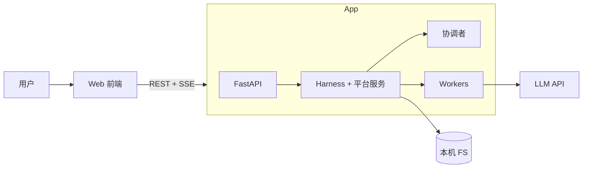
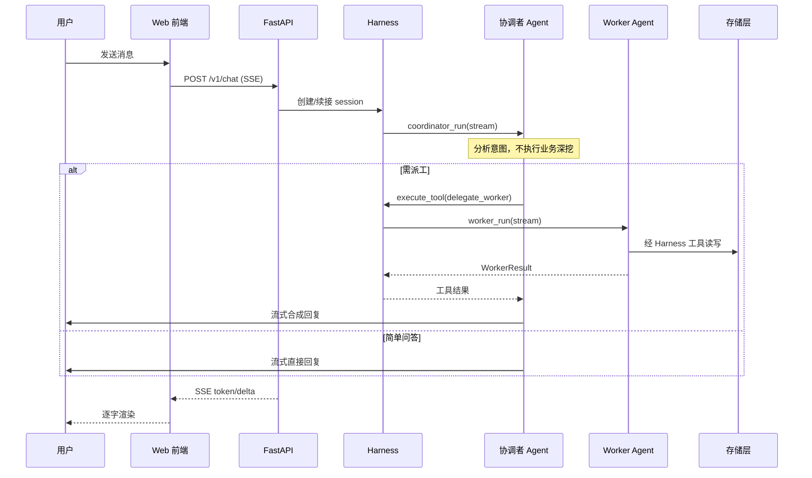

# 架构总览

| 属性 | 内容 |
|------|------|
| 文档版本 | v0.2 |
| 状态 | 草案（已对齐 2026-05-29 架构讨论） |
| 父文档 | [00. 职业规划 Agent PRD](../prd/00.%20职业规划%20Agent%20PRD.md) |
| 最后更新 | 2026-05-29 |

## 1. 目标

将 PRD 中的「个人职业操作系统」落实为可实现的系统边界：

- **一主多从**：协调者 Agent 分析意图、派工、收结果、合成回复；Worker **互不通信**。
- **Python 单体**：本机 **单进程** `career-os` 承载 API、Harness、平台服务、协调者/Worker 与 LLM 调用（**不引入 Go**）。
- **流式体验**：对话经 REST + **SSE**，页面逐字输出模型结果。
- **对话驱动任务**：「开始执行」「放弃当前流程」等由用户在对话中表达，协调者解析后调用 Harness 任务工具，**不**依赖固定「开始/放弃」按钮（进度条只读展示）。

## 2. 与 PRD 分层的关系

PRD [§4.1](../prd/00.%20职业规划%20Agent%20PRD.md#41-智能体架构) 的 L1–L7 产品分层保留；本架构在 L2 明确 **协调者** 角色，并将「Multi-Agent 互调传上下文」替换为 **协调者调度 + 档案/任务存储**。

| PRD 概念 | 本架构落点 |
|----------|------------|
| 入口编排智能体 | **协调者 Agent**（Python，`harness` 模块调度） |
| 身份/能力/市场/机会/策略/简历/资产 | **Worker Agent**（各域一个，互不直连） |
| `load_skill` | Python **Skill 管理** → Worker Run 内 **自选** 后按需加载正文（协调者只传 skill 索引） |
| 任务系统 | Python **Task 管理**（强约束在 Harness 工具层） |
| `profile.json` | Python **存储层 / Profile 服务** |
| 在途上下文（Agent 互传） | **取消**；改为协调者 `session_state` + 必要时读档案 |

## 3. 系统上下文图

## 4. 核心运行时序（单轮用户消息）

## 5. 技术栈（v0.1）

| 组件 | 选型 | 状态 |
|------|------|------|
| 后端（API + Harness + Agent） | **Python 3.11+** | 已定 |
| Web 框架 | **FastAPI + Uvicorn** | 已定 |
| Agent 框架 | **LangChain（组件）+ LangGraph（编排）** | 已定（见 [07-Agent运行时.md](./07-Agent运行时.md)） |
| 前端 | **React 19 + Vite + TypeScript** | 已定（见 [06-前端架构.md](./06-前端架构.md)） |
| API 协议 | REST + SSE（同进程，无 gRPC） | 已定 |
| 部署 | 本机单进程 + 前端 dev server | v0.1 |

## 6. 文档索引

| 文档 | 内容 |
|------|------|
| [01-协调者与Worker.md](./01-协调者与Worker.md) | 一主多从、职责边界、派工协议 |
| [02-平台服务.md](./02-平台服务.md) | Prompt / Skill / Tool / Task / 存储 |
| [03-系统分层.md](./03-系统分层.md) | 分层架构图与模块依赖 |
| [04-应用运行时与部署.md](./04-应用运行时与部署.md) | 单进程、本地启动、配置 |
| [05-API与流式协议.md](./05-API与流式协议.md) | REST、SSE 契约 |
| [06-前端架构.md](./06-前端架构.md) | 前端结构、流式 UI、无任务按钮 |
| [07-Agent运行时.md](./07-Agent运行时.md) | Agent 框架选型与 Run 模型 |
| [08-PRD追溯.md](./08-PRD追溯.md) | PRD 章节 → 架构模块追溯 |

## 7. 明确不在 v0.1 实现

- 执行层（周目标、学习路径监督等）— PRD 已标暂缓。
- Worker 之间直连调用。
- Go 服务 / 跨语言 gRPC。
- 独立 UI 按钮触发 `start_task_list` / 放弃 list（仅对话 + 协调者解析）。
- 会话全量持久化（仅 session 工作区 + 档案/任务/产物）。

---

*文档结束*
