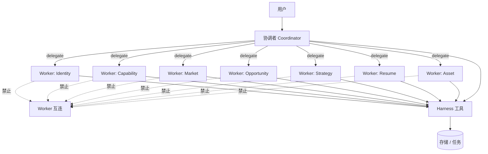
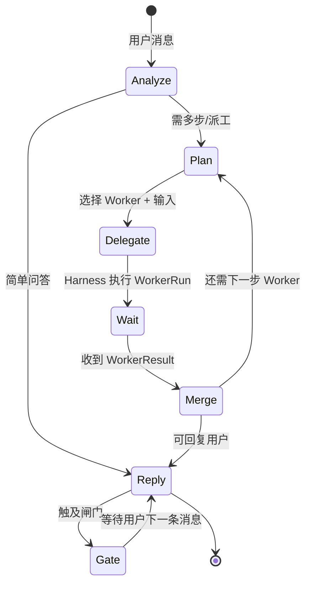
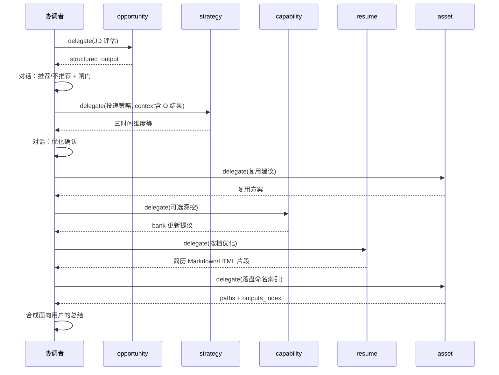

# 协调者与 Worker（一主多从）

| 属性 | 内容 |
|------|------|
| 文档版本 | v0.1 |
| 父文档 | [00-架构总览.md](./00-架构总览.md) |
| 最后更新 | 2026-05-29 |

## 1. 架构原则



| 规则 | 说明 |
|------|------|
| **协调者不干活** | 不做 JD 打分、不改写简历正文、不写 `profile` 字段；只做意图识别、派工计划、结果合成、闸门话术确认引导 |
| **Worker 不互通信** | 无 Worker→Worker 调用；上游结论由协调者写入 `session_state` 或经 Harness 落档后再派下一 Worker |
| **单一对话入口** | 用户只与「产品对话面」交互；背后始终是协调者 Run（PRD「入口编排」职责） |
| **存储经 Harness** | Worker 不直接 `os.Write`；通过 Tool 访问 Profile / Task / Output |

## 2. 角色与 PRD 智能体映射

| Worker ID | PRD 角色 | 典型职责 |
|-----------|----------|----------|
| `coordinator` | 入口编排智能体 | 意图、派工、合成、闸门引导 |
| `identity` | 身份智能体 | `exploration.*`、初探五主题 |
| `capability` | 能力智能体 | `experience_bank`、`capability.*`、JD 后可选深挖 |
| `market` | 市场智能体 | `market.trend_notes`、`role_families` |
| `opportunity` | 岗位/机会智能体 | `opportunity_snapshots`、推荐/不推荐 |
| `strategy` | 策略智能体 | `strategy.*`、`career.*`、三时间维度 |
| `resume` | 简历智能体 | 简历正文表达、`resume-module-optimize` |
| `asset` | 资产智能体 | 复用建议、命名、HTML、`outputs_index` |

> PRD 中的「策略读取岗位在途结论」：由 **协调者** 在派 `strategy` 时，将 `opportunity` Worker 返回的 `structured_output` 放入 `DelegateRequest.context`，而非 `opportunity` 直连 `strategy`。

## 3. 协调者 Run 循环



### 3.1 协调者可用工具（经 Harness）

| 工具 | 用途 |
|------|------|
| `delegate_worker` | 发起一次 Worker Run（指定 worker_id、goal、context、skill_name?） |
| `list_tasks` / `get_task` | 查看计划（只读或推进前检查） |
| `create_task_list` / `create_task` | 多步流程时建图（通常协调者决策后调用） |
| `start_task_list` | 用户对话表达「开始执行」后调用 |
| `abandon_task_list` | 用户对话表达放弃后调用 |
| `complete_task` | milestone 在用户确认话术后 |
| `load_skill` | 为 Worker 准备 skill 正文（或由 Harness 在 delegate 时自动附加） |
| `profile_get` / `profile_patch` | 协调者提议更新时（须用户确认后 patch） |

协调者 **不应** 拥有 `write_resume_html`；该工具仅开放给 `resume` / `asset` Worker（且受闸门约束）。

## 4. 派工协议 `DelegateRequest` / `WorkerResult`

### 4.1 请求（协调者 → Harness → Python Worker）

```json
{
  "run_id": "run_8f2c...",
  "worker_id": "opportunity",
  "goal": "解析用户粘贴的 JD，输出推荐结论与结构化匹配要点",
  "skill_name": null,
  "context": {
    "user_message": "...(本轮用户原文)...",
    "session_state": {
      "list_id": "list_7f3a9c2e",
      "list_type": "jd",
      "prior_results": {
        "market": { "summary": "..." }
      }
    },
    "profile_slices": ["exploration.summary", "capability.portfolio_summary"],
    "constraints": {
      "one_question_at_a_time": true,
      "no_fabrication": true
    }
  },
  "stream": true
}
```

- `session_state.prior_results`：仅放 **已完成 Worker** 的摘要/结构化输出，由协调者维护，**不**由 Worker 互相读取。
- `profile_slices`：Harness 按路径从 `profile.json` 截取后注入，避免整文件塞满上下文。

### 4.2 响应（Worker → Harness → 协调者）

```json
{
  "run_id": "run_8f2c...",
  "worker_id": "opportunity",
  "status": "completed",
  "structured_output": {
    "recommendation": "not_recommended",
    "jd_fingerprint": "sha256:...",
    "match_highlights": [],
    "blockers": [],
    "risks": [],
    "user_visible_summary": "供协调者合成对话的摘要"
  },
  "proposed_profile_patches": [],
  "proposed_task_completions": [],
  "assistant_message": "可选：Worker 侧直接生成的单轮追问（仍经协调者转发）"
}
```

- 落档：Harness 校验 `proposed_profile_patches` 白名单后写入；或由 Worker 通过 `profile_patch` 工具提交。
- **流式**：`assistant_message` 可在 Worker Run 中逐 token 流式返回；最终 `structured_output` 在 Run 结束时一次性交给协调者。

## 5. 典型派工链（JD 主路径）

PRD 阶段顺序不变；**调用拓扑**为星型：



## 6. 闸门与对话确认

所有 [PRD 附录 B](../prd/00.%20职业规划%20Agent%20PRD.md#附录-b确认话术建议) 闸门由 **协调者** 在合成回复中询问；Harness 提供 `match_gate_intent(user_text)` 辅助判定，**不**提供独立确认 API。

| 闸门 | 协调者行为 | Harness |
|------|------------|---------|
| 进入深度探讨 | 邀请 → 用户确认 → 通知前端弹表单 | 可选 `gate_deep_explore` 状态位 |
| 初探完成 | 派 `identity`/`capability` 完成后询问 | `exploration.completed_at` 校验 |
| 不推荐仍继续 | 展示 O 的结论后询问 | 写 `career.jd_override` |
| 优化确认 | 派 `resume` 前必须 true | 拒绝未确认时 `delegate_worker(resume)` |

## 7. 与「错误模型」的对比

| 旧方案（已废弃） | 现方案 |
|----------------|--------|
| Workflow 内 Agent 互传 `handoff` | 协调者 `session_state.prior_results` |
| 策略 Agent 直接读 opportunity 内存 | 协调者 delegate 时注入 `context` |
| 子 Agent 互相 `invoke` | 禁止；仅 `delegate_worker` |

---

*文档结束*
