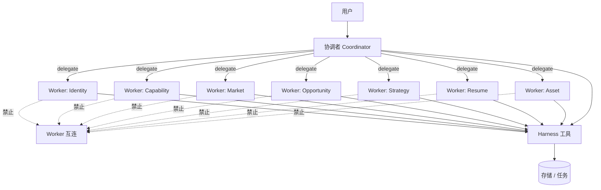
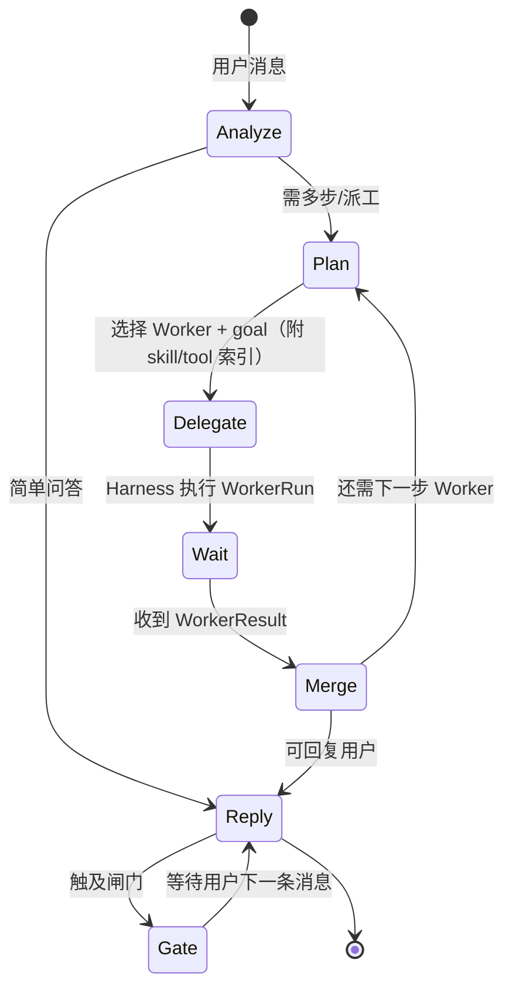
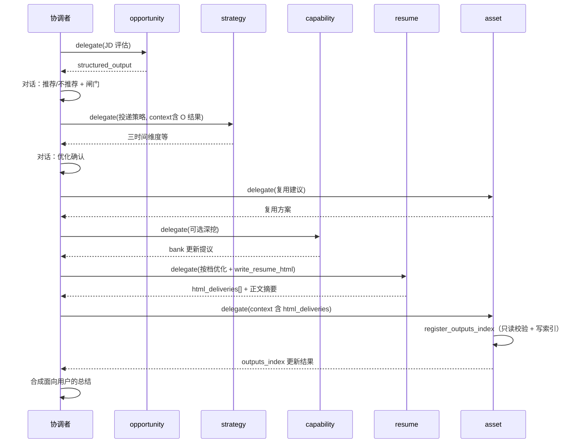
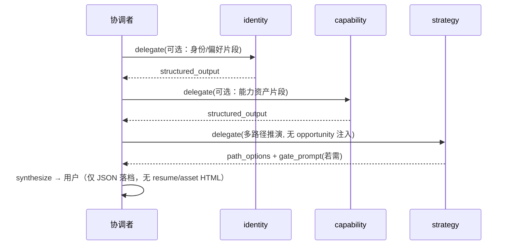
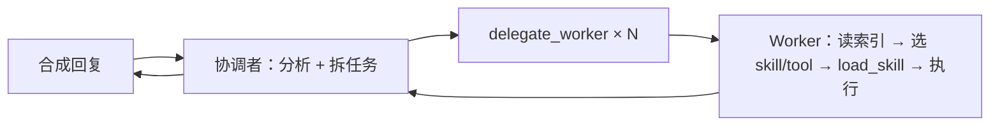

# 协调者与 Worker（一主多从）

| 属性 | 内容 |
|------|------|
| 文档版本 | v0.3 |
| 父文档 | [00-架构总览.md](./00-架构总览.md) |
| 最后更新 | 2026-05-30 |

## 1. 架构原则



| 规则 | 说明 |
|------|------|
| **协调者不干活** | 不做 JD 打分、不改写简历正文、不写 `profile` 字段；只做意图识别、**任务拆分与派工**、结果合成、闸门话术确认引导 |
| **协调者不选 Skill/Tool** | 派工时只给 Worker **`goal` + `context` + 能力索引**（`skill_index`、`tool_index`）；**不** 预指定 `skill_name`，**不** 预加载 skill 正文 |
| **Worker 自选能力** | 在同一 Worker Run 内，由 Worker **自行** 决定调用哪些 skill/tool（规则或 LLM）；可多次 `load_skill` |
| **Worker 不互通信** | 无 Worker→Worker 调用；上游结论由协调者写入 `session_state` 或经 Harness 落档后再派下一 Worker |
| **单一对话入口** | 用户只与「产品对话面」交互；背后始终是协调者 Run（PRD「入口编排」职责） |
| **Worker 不直出用户** | Worker 产出 `structured_output`（及可选 `internal_notes`）交协调者；**禁止** Worker 文本映射为 SSE `token` |
| **存储经 Harness** | Worker 不直接 `os.Write`；通过 Tool 访问 Profile / Task / Output |

## 2. 角色与 PRD 智能体映射

| Worker ID | PRD 角色 | 典型职责 |
|-----------|----------|----------|
| `coordinator` | 入口编排智能体 | 意图、派工、合成、闸门引导 |
| `identity` | 身份智能体 | `exploration.*`、初探五主题 |
| `capability` | 能力智能体 | `experience_bank`、`capability.*`、JD 后可选深挖 |
| `market` | 市场智能体 | `market.trend_notes`、`role_families` |
| `opportunity` | 岗位/机会智能体 | `opportunity_snapshots`、推荐/不推荐 |
| `strategy` | 策略智能体 | `strategy.*`、`career.*`、三时间维度 |
| `resume` | 简历智能体 | 简历正文表达、`resume-module-optimize` |
| `asset` | 资产智能体 | 复用建议、`outputs_index` / `index` 登记、文件管理 |

> PRD 中的「策略读取岗位在途结论」：由 **协调者** 在派 `strategy` 时，将 `opportunity` Worker 返回的 `structured_output` 放入 `DelegateRequest.context`，而非 `opportunity` 直连 `strategy`。

## 3. 协调者 Run 循环



### 3.1 协调者可用工具（经 Harness）

| 工具 | 用途 |
|------|------|
| `delegate_worker` | 发起 Worker Run：`worker_id`、`goal`、`context`；Harness 自动附加该 Worker 的 **skill_index / tool_index** |
| `list_tasks` / `get_task` | 查看计划（只读或推进前检查） |
| `create_task_list` / `create_task` | 多步流程时建图（通常协调者决策后调用） |
| `start_task_list` | 用户对话表达「开始执行」后调用 |
| `abandon_task_list` | 用户对话表达放弃后调用 |
| `complete_task` | milestone 在用户确认话术后 |
| `profile_get` / `profile_patch` | 协调者提议更新时（须用户确认后 patch） |

协调者 **没有** `load_skill`；该能力仅在 Worker 的 `worker_meta_tools` 中（见 [02-平台服务 §2](./02-平台服务.md#2-skill-管理注册表--worker-自选)）。

协调者 **不应** 拥有 `write_resume_html` / `register_outputs_index`。`write_resume_html` **仅** `resume`；`register_outputs_index` **仅** `asset`（消费 resume 的 `html_deliveries`，见 [§4.3](#43-html-交付协作resume-写盘--asset-登记)）。

### 3.2 Worker 侧能力工具（经 Harness）

| 工具 | 用途 |
|------|------|
| `load_skill(name, mode?)` | Worker 选中后加载正文并注入 **本 Run** 上下文；可重复调用 |
| `list_skills()` | 可选；索引已在 `capability_bundle` 时可不调 |
| 各业务 tool | 见 [02-平台服务 §3](./02-平台服务.md#3-tool-管理) |

## 4. 派工协议 `DelegateRequest` / `WorkerResult`

### 4.1 请求（协调者 → Harness → Python Worker）

```json
{
  "run_id": "run_8f2c...",
  "worker_id": "opportunity",
  "goal": "解析用户粘贴的 JD，输出推荐结论与结构化匹配要点",
  "capability_bundle": {
    "skill_index": [],
    "tool_index": [
      { "name": "profile_patch", "description": "..." },
      { "name": "browser_fetch", "description": "..." }
    ]
  },
  "context": {
    "user_message": "...(本轮用户原文)...",
    "session_state": {
      "list_id": "list_7f3a9c2e",
      "list_type": "jd",
      "prior_results": {
        "market": { "summary": "..." }
      }
    },
    "profile_slices": ["exploration.summary", "capability.portfolio_summary"],
    "constraints": {
      "one_question_at_a_time": true,
      "no_fabrication": true
    }
  },
  "stream": true
}
```

- `session_state.prior_results`：仅放 **已完成 Worker** 的摘要/结构化输出，由协调者维护，**不**由 Worker 互相读取。
- `profile_slices`：Harness 按路径从 `profile.json` 截取后注入，避免整文件塞满上下文。

### 4.2 响应（Worker → Harness → 协调者）

```json
{
  "run_id": "run_8f2c...",
  "worker_id": "opportunity",
  "status": "completed",
  "structured_output": {
    "recommendation": "not_recommended",
    "jd_fingerprint": "sha256:...",
    "match_highlights": [],
    "blockers": [],
    "risks": [],
    "user_visible_summary": "供协调者合成对话的摘要"
  },
  "proposed_profile_patches": [],
  "proposed_task_completions": [],
  "internal_notes": "可选：供协调者 synthesize 参考的内部要点，不对用户展示"
}
```

- 落档：Harness 校验 `proposed_profile_patches` 白名单后写入；或由 Worker 通过 `profile_patch` 工具提交。
- **对用户可见文案**：**仅** 协调者 `synthesize` 流式输出；Worker **不** 向 SSE 推送 `token`。协调者根据 `structured_output` / `internal_notes` 汇总后回复用户。

### 4.3 HTML 交付协作（resume 写盘 → asset 登记）

| 步骤 | 角色 | 动作 |
|------|------|------|
| 1 | `resume` | `write_resume_html` 写 `output/`（每档一份；schema 见 [05 §8](./05-API与流式协议.md#8-harness-toolwrite_resume_htmlresume)） |
| 2 | `resume` | `structured_output.html_deliveries[]` 回传协调者 |
| 3 | 协调者 | 写入 `session_state.prior_results.resume`，并 `delegate_worker(asset, …)` 注入 `context` |
| 4 | `asset` | `register_outputs_index`：校验路径只读存在 → 更新 `outputs_index` / `index.html`（参数 schema 见 [05 §7](./05-API与流式协议.md#7-harness-toolregister_outputs_indexasset)） |

**`html_deliveries[]` 单条示例**（resume `structured_output`）：

```json
{
  "path": "output/2026-05-30/2026-05-30-后端-云原生-标准.html",
  "filename": "2026-05-30-后端-云原生-标准.html",
  "optimization_level": "标准",
  "filename_tags": ["后端", "云原生"],
  "session_date": "2026-05-30"
}
```

- **禁止**：`asset` 调用 `write_resume_html` 或改写已落盘 HTML 正文。
- **禁止**：`asset` 在未收到 `html_deliveries`（或等价 `context`）时凭空编造 `outputs_index` 路径。
- 协调者可在同轮用户消息内先 `delegate(resume)` 再 `delegate(asset)`；多档时 `html_deliveries` 为数组，asset **一次** 登记即可。

## 5. 典型派工链（JD 主路径）

PRD 阶段顺序不变；**调用拓扑**为星型：



## 5.1 典型派工链（`list_type=plan` 纯规划）

无具体 JD、**不生成 HTML**；协调者星型派工，Preset 见 [02 §4.4 Preset `plan`](./02-平台服务.md#44-典型任务流程预设preset)。



- `strategy` 可读 `profile.json` 全档；**不要求** `opportunity_snapshots`。
- 用户确认的路径写入 `strategy.*`、`career.*` 后，可 `complete_task` 结束 `plan` list。

## 6. 闸门与对话确认

[PRD 附录 B](../prd/00.%20职业规划%20Agent%20PRD.md#附录-b确认话术建议) 闸门：**领域 Worker** 在 `structured_output` 中产出确认问句（如 `gate_prompt`）；**协调者** `synthesize` 转述后经 SSE 对用户呈现。Harness 提供 `match_gate_intent(user_text)` 辅助判定，**不**提供独立确认 API。

| 闸门 | Worker 产出 | 协调者 / Harness |
|------|-------------|------------------|
| 进入深度探讨 | 协调者自拟邀请 | 可选 `gate_deep_explore` 状态位 |
| 初探完成 | identity/capability 可选 `gate_prompt` | `exploration.completed_at` 校验 |
| 不推荐仍继续 | opportunity 结论 + 问句 | 写 `career.jd_override` |
| 优化确认 | strategy 的 `gate_prompt` | 派 `resume` 前须确认；拒绝未确认时 `delegate_worker(resume)` |

## 7. 与「错误模型」的对比

| 旧方案（已废弃） | 现方案 |
|----------------|--------|
| Workflow 内 Agent 互传 `handoff` | 协调者 `session_state.prior_results` |
| 策略 Agent 直接读 opportunity 内存 | 协调者 delegate 时注入 `context` |
| 子 Agent 互相 `invoke` | 禁止；仅 `delegate_worker` |
| 协调者预指定 `skill_name` | 禁止；Worker Run 内自选 + `load_skill` |

## 8. 单轮用户消息内的协作（总览）



同一 **用户消息触发的协调者循环** 内，可连续 `delegate` 多个 Worker；每个 Worker 在 **自己的 Run** 里独立完成 skill/tool 选型，协调者不传 skill 正文。

---

*文档结束*
