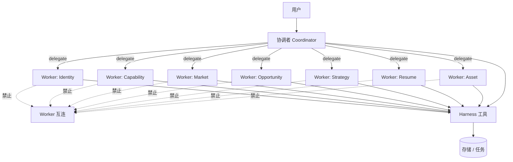
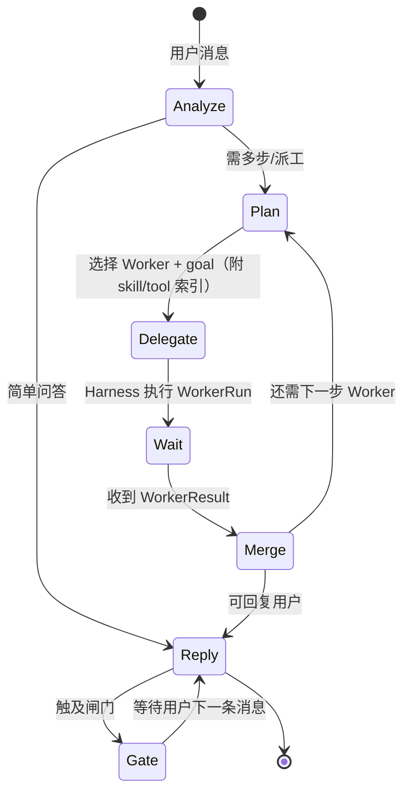
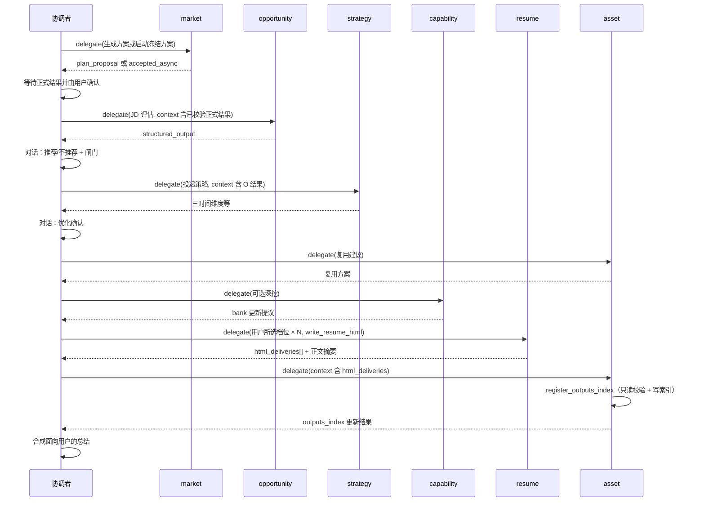
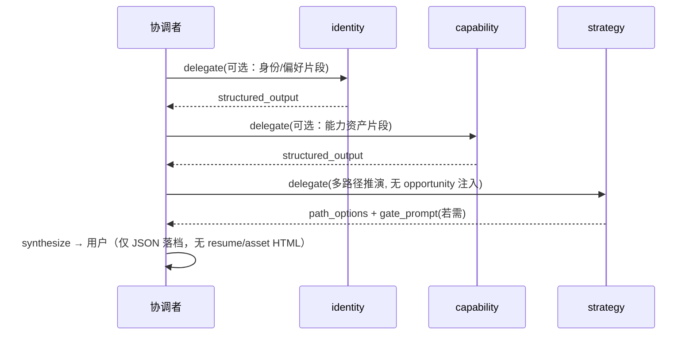
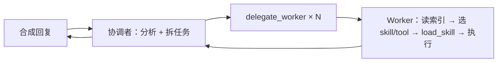

# 协调者与 Worker（一主多从）

| 属性 | 内容 |
|------|------|
| 文档版本 | v0.5 |
| 父文档 | [00-架构总览.md](./00-架构总览.md) |
| 最后更新 | 2026-05-31（E2 explore_closure） |

## 1. 架构原则



| 规则 | 说明 |
|------|------|
| **协调者不干活** | 不做 JD 打分、不改写简历正文、不写 `profile` 字段；只做意图识别、**任务拆分与派工**、结果合成、闸门话术确认引导 |
| **协调者不选 Skill/Tool** | 派工时只给 Worker **`goal` + `context` + 能力索引**（`skill_index`、`tool_index`）；**不** 预指定 `skill_name`，**不** 预加载 skill 正文 |
| **Worker 自选能力** | 在同一 Worker Run 内，由 Worker **自行** 决定调用哪些 skill/tool（规则或 LLM）；可多次 `load_skill` |
| **Worker 不互通信** | 无 Worker→Worker 调用；上游结论由协调者写入 `session_state` 或经 Harness 落档后再派下一 Worker |
| **单一对话入口** | 用户只与「产品对话面」交互；背后始终是协调者 Run（PRD「入口编排」职责） |
| **Worker 不直出用户** | Worker 产出 `structured_output`（及可选 `internal_notes`）交协调者；**禁止** Worker 文本映射为 SSE `token` |
| **存储经 Harness** | Worker 不直接 `os.Write`；通过 Tool 访问 Profile / Task / Output |

## 2. 角色与 PRD 智能体映射

| Worker ID | PRD 角色 | 典型职责 |
|-----------|----------|----------|
| `coordinator` | 入口编排智能体 | 意图、派工、合成、闸门引导 |
| `identity` | 身份智能体 | `exploration.*`、初探五主题 |
| `capability` | 能力智能体 | `experience_bank`、`capability.*`、JD 后可选深挖 |
| `market` | 市场智能体 | `market.trend_notes`、`role_families` |
| `opportunity` | 岗位/机会智能体 | `opportunity_snapshots`、推荐/不推荐 |
| `strategy` | 策略智能体 | `strategy.*`、`career.*`、三时间维度 |
| `resume` | 简历智能体 | 简历正文表达、`resume-module-optimize` |
| `asset` | 资产智能体 | 复用建议、`outputs_index` / `index` 登记、文件管理 |

> PRD 中的「策略读取岗位在途结论」：由 **协调者** 在派 `strategy` 时，将 `opportunity` Worker 返回的 `structured_output` 放入 `DelegateRequest.context`，而非 `opportunity` 直连 `strategy`。

## 3. 协调者 Run 循环



### 3.1 协调者可用工具（经 Harness）

| 工具 | 用途 |
|------|------|
| `delegate_worker` | 发起 Worker Run：`worker_id`、`goal`、`context`；Harness 自动附加该 Worker 的 **skill_index / tool_index** |
| `list_tasks` / `get_task` | 查看计划（只读或推进前检查） |
| `create_task_list` / `create_task` | 多步流程时建图（通常协调者决策后调用） |
| `start_task_list` | 用户对话表达「开始执行」后调用 |
| `abandon_task_list` | 用户对话表达放弃后调用 |
| `complete_task` | 用户确认话术后 **协调者** 调用（**B3**）；Worker 仅可返 `proposed_task_completions` |
| `profile_get` / `profile_patch` | 协调者提议更新时（须用户确认后 patch） |

协调者 **没有** `load_skill`；该能力仅在 Worker 的 `worker_meta_tools` 中（见 [02-平台服务 §2](./02-平台服务.md#2-skill-管理注册表--worker-自选)）。

协调者 **不应** 拥有 `write_resume_html` / `register_outputs_index`。`write_resume_html` **仅** `resume`；`register_outputs_index` **仅** `asset`（消费 resume 的 `html_deliveries`，见 [§4.3](#43-html-交付协作resume-写盘--asset-登记)）。

### 3.2 Worker 侧能力工具（经 Harness）

| 工具 | 用途 |
|------|------|
| `load_skill(name, mode?)` | Worker 选中后加载正文并注入 **本 Run** 上下文；可重复调用 |
| `list_skills()` | 可选；索引已在 `capability_bundle` 时可不调 |
| 各业务 tool | 见 [02-平台服务 §3](./02-平台服务.md#3-tool-管理) |

## 4. 派工协议 `DelegateRequest` / `WorkerResult`

### 4.1 请求（协调者 → Harness → Python Worker）

> 下列 JSON 中 `//` 为 **中文含义备注**（文档说明用）；实现侧传输对象须为合法 JSON，**不得** 含 `//` 注释。

```json
{
  "run_id": "run_8f2c...",              // 本次 Worker Run 唯一 ID（Agent 运行时，见 02 §5.1）
  "worker_id": "opportunity",           // 派工目标 Worker：岗位/机会智能体
  "goal": "解析用户粘贴的 JD，输出推荐结论与结构化匹配要点",  // 协调者下发的任务目标（自然语言指令）
  "capability_bundle": {                // 能力索引包：仅元数据，不含 skill 正文
    "skill_index": [],                  // 该 Worker 可用的 skill 目录（name/description/when_to_use）；opportunity 示例为空
    "tool_index": [                     // 该 Worker 可调用的 tool 目录（名称 + 描述）
      { "name": "profile_patch", "description": "..." }
    ]
  },
  "context": {                          // 派工上下文（协调者组装，非 Worker 互传）
    "user_message": "...(本轮用户原文)...",  // 触发本次派工的用户消息原文
    "session_state": {                  // 会话级工作状态（协调者维护）
      "list_id": "list_7f3a9c2e",       // 当前任务列表 ID（A02）
      "list_type": "jd",                // 业务流类型：explore | jd | plan
      "prior_results": {                // 已完成 Worker 的结构化结论摘要（按 worker_id 键）
        "opportunity": { "summary": "..." }
      }
    },
    "market_research_result": {         // Harness 本轮解析、校验并裁剪的正式市场结果
      "research_id": "research_...",
      "result_version": 1
    },
    "profile_slices": [                 // 从 profile.json 截取的路径列表，Harness 注入片段
      "exploration.summary",
      "capability.portfolio_summary"
    ],
    "constraints": {                    // 执行约束（Harness / Prompt 共同 enforce）
      "one_question_at_a_time": true,   // 一次只向用户提一个问题（初探等场景）
      "no_fabrication": true            // 禁止虚构未确认经历/事实
    }
  },
  "stream": true                        // Worker 内部 LLM 是否流式；不映射 SSE token（见 07 §6）
}
```

- `session_state.prior_results`：仅放 **已完成 Worker** 的摘要/结构化输出，由协调者维护，**不**由 Worker 互相读取。
- `profile_slices`：Harness 按路径从 `profile.json` 截取后注入，避免整文件塞满上下文。

### 4.2 响应（Worker → Harness → 协调者）

> 下列 JSON 中 `//` 为 **中文含义备注**（文档说明用）；落盘与 gRPC/内存传输须为合法 JSON，**不得** 含 `//` 注释。

```json
{
  "run_id": "run_8f2c...",              // 与 DelegateRequest 一致
  "worker_id": "opportunity",           // 执行本 Run 的 Worker ID
  "status": "completed",                // completed | failed | cancelled
  "structured_output": {                // 领域结构化结果（Pydantic 校验；schema 按 worker_id 注册）
    "recommendation": "not_recommended", // recommended | not_recommended
    "jd_fingerprint": "sha256:...",     // JD 内容指纹，用于去重与 outputs 关联
    "match_highlights": [],             // 匹配要点
    "blockers": [],                     // 硬伤 / 不匹配项
    "risks": [],                        // 投递或职业风险
    "user_visible_summary": "供协调者合成对话的摘要"  // 供协调者 synthesize 转述的摘要（非直出 SSE）
  },
  "proposed_profile_patches": [],       // 建议写入 profile 的 patch 列表（Harness 白名单校验后落档）
  "proposed_task_completions": [],      // 建议完成的 task_id；由 **协调者** 在用户确认/gate 后 execute complete_task（B3）
  "internal_notes": "可选：供协调者 synthesize 参考的内部要点，不对用户展示"  // 协调者汇总用；不映射 SSE
}
```

- 落档：Harness 校验 `proposed_profile_patches` 白名单后写入；或由 Worker 通过 `profile_patch` 工具提交。
- **任务完成（B3）**：Worker **不** 调用 `complete_task` / `claim_task`；在 `WorkerResult.proposed_task_completions` 建议 task_id，由协调者在 gate confirm 或 resume/asset 成功后代为 `complete_task`。
- **对用户可见文案**：**仅** 协调者 `synthesize` 流式输出；Worker **不** 向 SSE 推送 `token`。协调者根据 `structured_output` / `internal_notes` 汇总后回复用户。

### 4.3 HTML 交付协作（resume 写盘 → asset 登记）

| 步骤 | 角色 | 动作 |
|------|------|------|
| 1 | `resume` | `write_resume_html` 写 `output/`（每档一份；schema 见 [05 §8](./05-API与流式协议.md#8-harness-toolwrite_resume_htmlresume)） |
| 2 | `resume` | `structured_output.html_deliveries[]` 回传协调者 |
| 3 | 协调者 | 写入 `session_state.prior_results.resume`，并 `delegate_worker(asset, …)` 注入 `context` |
| 4 | `asset` | `register_outputs_index`：校验路径只读存在 → 更新 `outputs_index` / `index.html`（参数 schema 见 [05 §7](./05-API与流式协议.md#7-harness-toolregister_outputs_indexasset)） |

**`html_deliveries[]` 单条示例**（resume `structured_output`）：

```json
{
  "path": "output/2026-05-30/2026-05-30-后端-云原生-标准.html",
  "filename": "2026-05-30-后端-云原生-标准.html",
  "optimization_level": "标准",
  "filename_tags": ["后端", "云原生"],
  "session_date": "2026-05-30"
}
```

- **禁止**：`asset` 调用 `write_resume_html` 或改写已落盘 HTML 正文。
- **禁止**：`asset` 在未收到 `html_deliveries`（或等价 `context`）时凭空编造 `outputs_index` 路径。
- 协调者可在同轮用户消息内先 `delegate(resume)` 再 `delegate(asset)`；多档时 `html_deliveries` 为数组，asset **一次** 登记即可。

## 5. 典型派工链（JD 主路径）

> **非固定全局流水线**：协调者依据 [02 §3 Worker 注册表](./02-平台服务.md#3-worker-管理注册表--协调者-worker_index) 的 `worker_index` 选人；下图仅为 **golden path 参考**。v0.1 **同轮内顺序连派、不真并行**（C3 遇 gate 则停）。

PRD 阶段顺序不变；**调用拓扑**为星型。**JD 评估**须先完成市场调研并由用户确认正式结果；Harness 每次委托 `opportunity` 时重新解析引用并注入 `context.market_research_result`。



- **三档 HTML**：用户 **多选** `保守`/`标准`/`进取`（≥1）；同轮 resume Run 内按 **保守→标准→进取** 顺序 `write_resume_html` × N（对齐 [B06 §5.5.1](../prd/B06.%20流程-简历优化%20PRD.md#551-三档选项可多选--通用优化与针对-jd-优化共用)）。
- **档位解析（Opt-1）**：协调者从 **对话** 解析所选档位（无 UI 多选、无单独 gate）；解析完成后 **直接** `delegate(resume)`，`context.selected_optimization_levels` 注入；默认参考 `profile.resume.last_optimization_levels[]`（跨 session）。详见 [§9 Opt-1](#9-协调者路由策略)。

## 5.1 典型派工链（`list_type=plan` 纯规划）

无具体 JD、**不生成 HTML**；协调者星型派工（选人见 [02 §3](./02-平台服务.md#3-worker-管理注册表--协调者-worker_index)），Preset 见 [02 §5.4 Preset `plan`](./02-平台服务.md#54-典型任务流程预设preset)。



- `strategy` 可读 `profile.json` 全档；**不要求** `opportunity_snapshots`。
- 用户确认的路径写入 `strategy.*`、`career.*` 后，协调者 **`complete_task`** 结束 `plan` list（B3）。

## 6. 闸门与对话确认

[PRD 附录 B](../prd/00.%20职业规划%20Agent%20PRD.md#附录-b确认话术建议) 闸门分两类：

1. **Worker 闸门**：领域 Worker 在 `structured_output` 中产出 `gate_prompt`；协调者 `synthesize` 转述后经 SSE 对用户呈现。
2. **协调者闸门（E2）**：`explore_complete` / `explore_review_complete` — `explore_closure` 齐套后 **由协调者 synthesize 发问**（identity/capability **禁止** explore 类 `gate_prompt`）。

Harness 提供 `match_gate_intent(user_text)`（**M2**）。闸门临时态见 [10 §2](./10-会话闸门与state.md#2-gates闸门)；Worker `gate_prompt` 规则见 [09](./09-Worker结构化输出.md)；explore 收束见 [10 §2.5](./10-会话闸门与state.md#25-explore_closuree2-双-worker-收束)。

| `gate_name` | 产出者 | `gate_prompt` | 用户确认后（不可见域白名单 / 可见前置） |
|-------------|--------|---------------|----------------------------------------|
| 进入深度探讨 | 协调者自拟邀请 | — | `gates.flags.deep_explore_accepted`；可弹建档表单 |
| 初探完成 | **协调者（E2）** | Worker **禁止** | `apply_proposed_patches` + `exploration.completed_at`（[10 §3](./10-会话闸门与state.md#3-profile-落档双路径-p3)） |
| 初探复盘完成 | **协调者（E2）** | Worker **禁止** | 同上 + **刷新** `exploration.completed_at` |
| 不推荐仍继续 | `opportunity`（**O1**） | `not_recommended` 时 **必填** | `career.jd_override[]` + `jd_continue_despite_not_recommended` |
| 优化确认 | `strategy`（**St1**，JD 路径） | `requires_optimize_gate` 时 **必填**；`plan` **禁止** | `optimize_confirmed` → 允许 **可见** `write_resume_html`（[13 §3](./13-Profile-写入权限.md#3-可见域html-闸门链)） |
| 复用确认 | `asset`（`run_kind=reuse`） | **必填** | 用户选定复用/新建/跳过后再派 `resume` |

**协调者路由（C3）**：

- Worker 返回 **`gate_prompt`** → synthesize 后 **结束本轮**，等用户下一条消息。
- **`explore_closure` 齐套** 且协调者已 synthesize 确认问句（`gate_pending=true`）→ 同上，等用户 confirm。

**未初探走 JD（B1）**：协调者软引导；**不** HTTP 403；不可见域仍可按白名单写入评估 snapshot（O-P1）。

## 7. 与「错误模型」的对比

| 旧方案（已废弃） | 现方案 |
|----------------|--------|
| Workflow 内 Agent 互传 `handoff` | 协调者 `session_state.prior_results` |
| 策略 Agent 直接读 opportunity 内存 | 协调者 delegate 时注入 `context` |
| 子 Agent 互相 `invoke` | 禁止；仅 `delegate_worker` |
| 协调者预指定 `skill_name` | 禁止；Worker Run 内自选 + `load_skill` |
| E1 `gate_owner` 指定 explore gate 产出 Worker | **废弃** → **E2** `explore_closure` + 协调者发问（[10 §2.5](./10-会话闸门与state.md#25-explore_closuree2-双-worker-收束)） |

## 8. 单轮用户消息内的协作（总览）



同一 **用户消息触发的协调者循环** 内，**无 Worker `gate_prompt` 且 explore 未齐套时可顺序连派**；**Worker 返回 `gate_prompt`** 或 **`explore_closure` 已齐套并待发/coordinator 已问 explore gate** → synthesize 后 **结束本轮**（C3，见 [§9](#9-协调者路由策略)）。

## 9. 协调者路由策略

| 决策 | 规则 |
|------|------|
| **WR** | Run 启动注入 `worker_index`（`config/workers.registry.json`）；协调者 LLM 据此选人、写 `goal` / `context` |
| **C3** | 无 Worker `gate_prompt` 且 explore 收束未齐 → 可同轮 **顺序** 连派；Worker `gate_prompt` 或 explore 齐套待发 gate → synthesize 后 **结束本轮** |
| **E2** | `explore_closure`：`required_workers` + `worker_done`；齐套后 **协调者** 发问；不在 required 内 Worker **视为已结束**；默认首次 `["identity","capability"]` |
| **Opt-1** | 三档多选：**纯对话**解析 → **无 gate** → 直接 `delegate(resume)`；`context.selected_optimization_levels`；默认读 `profile.resume.last_optimization_levels[]`；**不**写 `state.json` 档位临时位 |
| **B3** | **`complete_task` 仅协调者**；Worker 返 `proposed_task_completions`；milestone 须在 gate/对话 confirm 后；`work` 在 resume 成功 + `html_deliveries` 校验后按档 complete |
| **M1** | 协调者 messages：**首条 user + 最近 40 条 / 12k tokens**；Worker 不读全量；见 [10 §1.5](./10-会话闸门与state.md#15-m1-对话历史上限与裁剪) |
| **M1-R** | `trimmed` 或 `usage_ratio≥0.95` → synthesize **推荐新会话**（不强制） |
| **JD-R1** | `opportunity` 前须能解析当前正式市场引用，结果未过期且用户确认引用与当前引用完全一致；旧缓存不授权 |
| **T6-1** | `explore` / `jd` / `plan` 主路径 **必须** `create_task_list`；闲聊/单次 FAQ **不建** list |
| **Harness** | 硬约束（`optimize_confirmed`、tool 权限、task 状态机、正式市场结果门禁、explore 类 Worker 禁 `gate_prompt`） |
| **协调者 LLM** | 意图识别、Worker 选择、`goal` / `context`（含 `explore_closure.required_workers`、`selected_optimization_levels`、`requires_optimize_gate` 等） |

#### Opt-1：三档多选（纯对话）

| 项 | 约定 |
|----|------|
| **触发** | `optimize_confirmed` 且（可选）B06 §5.5.0 深挖已跳过/完成 |
| **解析** | 协调者从用户消息识别 `保守`/`标准`/`进取`（≥1）；未明说时 **默认** `profile.resume.last_optimization_levels[]`（空则协调者 synthesize 询问，**仍无** formal gate） |
| **存储** | **不**在 `state.json` 存档位；仅 Run 内 `context.selected_optimization_levels` + 成功后 `resume` → `profile_patch` → `last_optimization_levels[]` |
| **派工** | 解析齐 → **直接** `delegate(resume)`；协调者按需先 `create_task` × N（Preset jd work） |
| **前端** | 无多选控件（[06 §3](./06-前端架构.md#3-流式-ui-行为)） |

`structured_output` 字段契约见 [09-Worker结构化输出.md](./09-Worker结构化输出.md)。

---

*文档结束*
