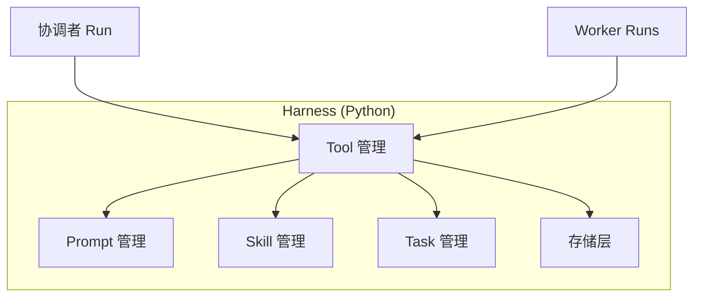

# 平台服务（Harness 内建）

| 属性 | 内容 |
|------|------|
| 文档版本 | v0.1 |
| 父文档 | [00-架构总览.md](./00-架构总览.md) |
| 最后更新 | 2026-05-29 |

Harness 不是「薄网关」，而是 **职业 OS 运行时**：在 Python 应用 `career_os` **同一进程** 内实现下列平台服务，对协调者/Worker 暴露统一 Tool 面。



## 1. Prompt 管理

**职责**：版本化系统/开发者提示词，与业务 Skill 分离；支持按 `worker_id` + `scene` 组装最终 system prompt。

| 能力 | 说明 |
|------|------|
| 模板存储 | `internal/prompts/{worker_id}/{scene}.tmpl` 或 `config/prompts/*.yaml` |
| 变量注入 | `{{skill_body}}`、`{{profile_slice}}`、`{{gate_rules}}` |
| 版本 | `prompt_version` 写入审计日志，便于 Harness 升级对比 |
| 热更新 | v0.1 重启生效；后续可做文件 watch |

**原则**（对齐 README Harness 边界）：

- **业务阶段步骤** → Skill（`.agent/skills`）
- **角色人格与工具约束** → Prompt 管理
- **禁止**在 Harness 代码中硬编码 JD 打分规则或大段领域知识（应交给 Skill + Worker）

## 2. Skill 管理

**职责**：实现 PRD `load_skill(name)`；读取 `.agent/skills/{name}/**`。

```text
load_skill(name, mode?)
  → read SKILL.md (+ phases.md 等)
  → validate front matter（name, version）
  → return SkillBundle { body, attachments[], hash }
```

| 字段 | 说明 |
|------|------|
| `name` | `career-inner-exploration` \| `career-jd-alignment` \| `resume-module-optimize` |
| `mode` | 如 `exploration_first` \| `exploration_review`（映射 PRD 初探/复盘） |
| 绑定 | A03 触发矩阵；由协调者在 `delegate_worker` 时指定 `skill_name` |

Skill 正文注入 **Worker** Run 的 system 段，**不**注入协调者（协调者仅保留「如何派工」类 prompt）。

## 3. Tool 管理

**职责**：工具注册、权限、参数校验、审计；LLM 只能看到其角色允许的工具子集。

| 工具集 | 绑定角色 |
|--------|----------|
| `coordinator_tools` | delegate_*, task 读/建/启/弃, profile_get, gate 辅助 |
| `identity_tools` | profile_patch(exploration), dialogue |
| `capability_tools` | profile_patch(capability, experience_bank), resume_read |
| `market_tools` | profile_patch(market), browser_fetch |
| `opportunity_tools` | profile_patch(opportunity_snapshots), browser_fetch |
| `strategy_tools` | profile_patch(strategy, career), load_skill(jd-alignment) |
| `resume_tools` | load_skill(resume-module-optimize), 正文生成（内存） |
| `asset_tools` | write_resume_html, outputs_index, list_outputs |

**强约束在 Tool 实现内**（非 Prompt）：

- `meta.status=ready` → `claim_task` / `complete_task` 返回错误
- 无 `optimize_confirmed` → `delegate_worker(resume)` 拒绝
- `profile_patch` 路径白名单 + schema 校验

## 4. Task 管理

对齐 [A02 机制-任务系统 PRD](../prd/A02.%20机制-任务系统%20PRD.md)。

### 4.1 任务 ID 生成规则

| 实体 | 规则 | 示例 |
|------|------|------|
| `list_id` | `list_` + 12 位 hex（`secrets.token_hex(6)`） | `list_7f3a9c2e1b04` |
| `task_id` | `{kind_prefix}_{seq}` 或 `task_` + 8 位 hex | `milestone_1`, `work_a3f2` |
| `run_id` | `run_` + ULID/hex | Agent 每次 Run |

- **禁止** `list_id` 带业务前缀（`jd_`、`explore_`）；业务类型仅 `meta.list_type` / 任务 JSON `list_type`。
- 同 list 内 `task_id` 唯一；文件名 `{task_id}.json` 与字段 `id` 一致。

### 4.2 列表生命周期（磁盘）

与 PRD 一致：`ready` | `active`；结束/放弃删除 `meta.json` 与全部 `{task_id}.json`。

**对话驱动**（无专用 UI 按钮）：

| 用户意图（自然语言） | 协调者动作 | Harness |
|----------------------|------------|---------|
| 「开始执行」「现在开始」 | 解析意图 | `start_task_list(list_id)` |
| 「放弃」「换 JD 不做了」 | 解析意图 | `abandon_task_list(list_id)` |
| 简单问答 | 不建 list | — |

实现：`parse_task_control_intent(text)` 规则 + 小模型分类（可选）；**不提供** `POST /tasks/start` 给前端按钮用（前端可保留只读进度条）。

### 4.3 典型任务流程预设（Preset）

Preset 是 **协调者建图模板**，非固定流水线；协调者可增删任务节点。

**Preset: `explore`（`list_type=explore`）**

| kind | subject | requires_user_confirm |
|------|---------|------------------------|
| milestone | 职业初探落档 | true |

**Preset: `jd`（`list_type=jd`）**

| kind | subject | blockedBy |
|------|---------|-----------|
| milestone | JD 录入确认 | — |
| milestone | 市场/岗位分析 | 上一 milestone |
| milestone | 投递策略对齐 | 上一 milestone |
| milestone | 确认按 JD 优化简历 | 上一 milestone |
| work | （由 resume Worker 动态追加） | 优化 milestone 完成后 |

**Preset: `plan`（`list_type=plan`）**

| kind | subject |
|------|---------|
| milestone | 规划探讨落档 |

单活跃 list、`complete` 删文件等规则见 A02。

## 5. 存储层

| 存储 | 路径 | 服务 API |
|------|------|----------|
| 职业档案 | `data/profile.json` | `ProfileStore.Get/Patch` |
| 简历基线 | `data/resume/source.md` | `ResumeStore.Read` |
| 任务 | `data/tasks/{list_id}/` | `TaskStore.*` |
| 活跃指针 | `data/tasks/_active.json` | 可选 |
| 产物 | `output/YYYY-MM-DD/` | `OutputStore.Write/List/Delete` |
| 配置 | `config/preference-tags-default.json` | 只读 |
| Session 工作区 | `data/sessions/{session_id}/state.json` | 协调者 `session_state`（gitignore） |

**原则**：

- 真实 `profile.json`、`tasks/**`、`output/**` 不进 Git（PRD §6.1）。
- 提供 `data/profile.example.json` 样例。
- Session 仅存协调者派工中间态，**不**存完整对话历史（PRD：会话不持久化；v0.1 可实现短期 TTL 便于刷新恢复）。

## 6. 审计与可观测（v0.1 最小）

| 事件 | 字段 |
|------|------|
| `agent.run.start` | run_id, worker_id, session_id |
| `agent.run.end` | status, token_usage |
| `tool.call` | tool_name, actor, latency_ms |
| `task.transition` | task_id, from, to |
| `gate.pass` | gate_name, user_text_hash |

日志落本地文件 `data/logs/`（gitignore），服务 README 说明 LLM 数据范围。

---

*文档结束*
