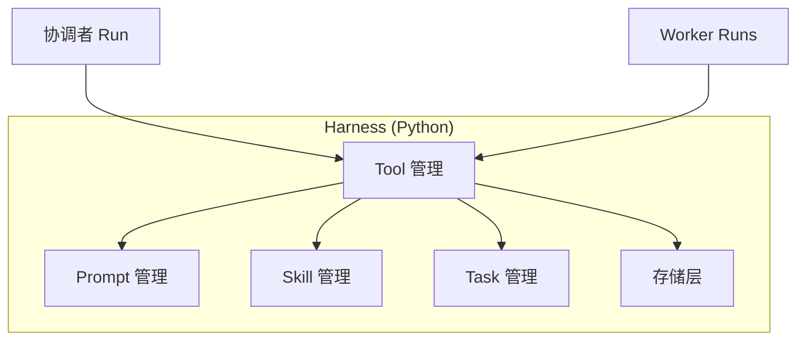
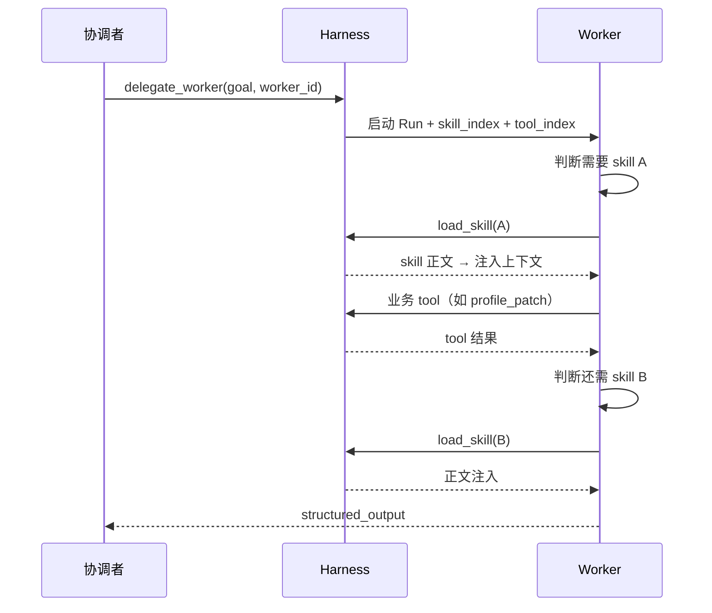
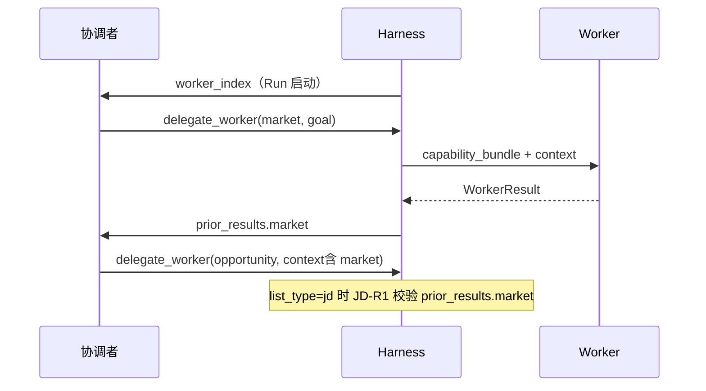
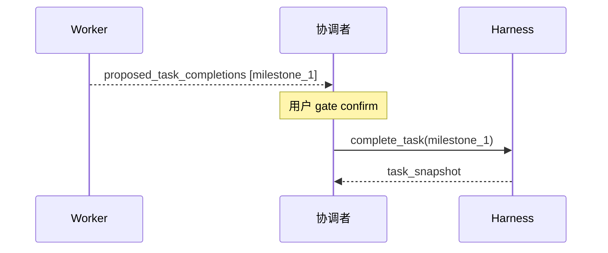

# 平台服务（Harness 内建）

| 属性 | 内容 |
|------|------|
| 文档版本 | v0.6 |
| 父文档 | [00-架构总览.md](./00-架构总览.md) |
| 最后更新 | 2026-05-31（Worker Registry、JD-R1） |

Harness 不是「薄网关」，而是 **职业 OS 运行时**：在 Python 应用 `career_os` **同一进程** 内实现下列平台服务，对协调者/Worker 暴露统一 Tool 面。



## 1. Prompt 管理

**职责**：版本化系统/开发者提示词，与业务 Skill 分离；支持按 `worker_id` + `scene` 组装最终 system prompt。

| 能力 | 说明 |
|------|------|
| 模板存储 | `career_os/platform/prompt/{worker_id}/{scene}.tmpl`（v0.1 重启生效） |
| 变量注入 | `{{profile_slice}}`、`{{gate_rules}}`、`{{worker_index}}`；`{{skill_body}}` 仅 Worker 在 `load_skill` 后动态注入 |
| 版本 | `prompt_version` 写入审计日志，便于 Harness 升级对比 |
| 热更新 | v0.1 重启生效；后续可做文件 watch |

**原则**（对齐 README Harness 边界）：

- **业务阶段步骤** → Skill（`.agent/skills`）
- **角色人格与工具约束** → Prompt 管理
- **禁止**在 Harness 代码中硬编码 JD 打分规则或大段领域知识（应交给 Skill + Worker）

## 2. Skill 管理（注册表 + Worker 自选）

**职责**：扫描 `.agent/skills/**`，维护 **Skill 注册表**；提供 **索引** 与 **按需加载正文** 两档 API。PRD 的 `load_skill(name)` 由 **Worker 在 Run 内调用**（或等价 Tool），**不由协调者预指定** `skill_name`。

### 2.1 注册表与索引

```text
list_skills(filter?)  → SkillIndexEntry[]
  # 每项仅元数据，不含 SKILL.md 正文

load_skill(name, mode?)  → SkillBundle
  # 读取 SKILL.md (+ phases.md 等)，校验 front matter
  # 返回 { body, attachments[], hash }，供 Worker 注入当轮上下文
```

| `SkillIndexEntry` 字段 | 说明 |
|------------------------|------|
| `name` | 技能标识，与目录名一致 |
| `description` | 简短说明（来自 front matter 或首段摘要） |
| `when_to_use` | 适用场景提示 |
| `allowed_workers[]` | 允许加载的 Worker ID（Harness 强制校验） |
| `modes[]` | 如 `exploration_first` \| `exploration_review` \| `capability_bank`（K2，见 [A03](../prd/A03.%20机制-技能包%20PRD.md)） |

后续新增 skill 只需增加目录 + 注册表扫描；**无需**改协调者 Prompt 全文。

### 2.2 谁选型、何时注入正文

| 阶段 | 行为 |
|------|------|
| **协调者 `delegate_worker`** | 只传 `worker_id`、`goal`、`context`；Harness 附带该 Worker 的 **`skill_index` + `tool_index`（元数据）**，**不传** skill 正文 |
| **Worker Run 内（同一轮循环可多步）** | Worker 根据任务进展 **自行** 决定调用哪些 skill/tool（规则或 LLM）；需要时调 `load_skill` → Harness 返回正文 → **注入 Worker 当轮 messages/state**（可多次、可换 skill） |
| **协调者** | **不** 加载 skill 正文；**不** 替 Worker 预选 `skill_name` |



**设计理由**：子任务执行中可能中途需要 **另一份** skill；协调者无法在一次派工里穷举。选型权在 **执行者（Worker）**，协调者只负责 **拆任务与派工**。

### 2.3 与 Prompt 的分工

- **Worker 基线 system**：`platform.prompt`（角色、约束、一次一问等）。
- **Skill 正文**：仅在 Worker 调用 `load_skill` 之后，以 **Tool 结果 / 追加 system 或 human 消息** 形式进入上下文，**不**在 Run 启动时默认塞入全部 skill。

## 3. Worker 管理（注册表 + 协调者 `worker_index`）

**职责**：维护 **Worker 注册表**，供协调者 LLM 选人、组 `goal` / `context`；与 Skill 注册表对称，**不含** Prompt 正文或 Skill 正文。

### 3.1 注册表

| 项 | 说明 |
|----|------|
| **路径** | `config/workers.registry.json`（v0.1 重启生效；与 [04 §4](./04-应用运行时与部署.md#4-配置与环境变量) 一并加载） |
| **扫描** | Harness 启动时加载；`worker_id` 须与 [01 §2](./01-协调者与Worker.md#2-角色与-prd-智能体映射) 一致 |
| **条目字段** | `worker_id`、`label`、`summary`、`when_to_use[]`、`outputs[]`、`skills[]`、`tools[]`、`gates_can_emit[]`；可选 `hard_prerequisites[]`、`notes` |

新增 Worker 时：**注册表 + Prompt 模板 + 子图 + structured_output 契约** 同步增加；协调者 Prompt **无需**手工维护 7 人职责表。

### 3.2 与 `capability_bundle` 的分工

| 注入对象 | 时机 | 受众 | 内容 |
|----------|------|------|------|
| **`worker_index`** | 协调者 Run **启动一次**（`begin_chat`） | 协调者 | 全部 Worker 的目录（who / when / 产出 / gate） |
| **`capability_bundle`** | 每次 **`delegate_worker`** | **当前** Worker | 该 Worker 的 `skill_index` + `tool_index` |

协调者 **不** `load_skill`；Worker **不** 接收 `worker_index`（避免越权派工）。



### 3.3 派工模式（v0.1）

| 规则 | 说明 |
|------|------|
| **选人** | 协调者 LLM 依据 `worker_index` + 用户意图 + `session_state`；**无**固定全局流水线（plan / explore 等仍灵活连派） |
| **连派** | 同一用户消息内 **顺序** `delegate` × N；**禁止** Worker asyncio 真并行 |
| **C3** | 任一 Worker 返回 `gate_prompt` → synthesize 后结束本轮 |
| **JD-R1** | `list_type=jd` 时 `delegate_worker(opportunity)` **须** `session_state.prior_results.market` 已存在；否则 Harness 返回 `delegate_blocked`（须先派 `market`） |
| **示例链** | JD golden path：`market` → `opportunity` → …（见 [01 §5](./01-协调者与Worker.md#5-典型派工链jd-主路径)） |

典型派工链文档为 **golden path 参考**，非硬编码 Workflow。

## 4. Tool 管理

**职责**：工具注册、权限、参数校验、审计。与 Skill 类似：**协调者派工时只给 `tool_index`（名称 + 描述 + 参数摘要）**；Worker 在 Run 内 **自行选择** 调用哪些 tool。`browser_fetch` 见 [11-L7-浏览器Tool.md](./11-L7-浏览器Tool.md)。

| 工具集 | 绑定角色 | 说明 |
|--------|----------|------|
| `coordinator_tools` | 协调者 | `delegate_worker`、task 读/建/启/弃/**complete**、`profile_get`、gate 辅助；**无** `load_skill` |
| `worker_meta_tools` | 各 Worker | `list_skills`（可选，索引已在 state 时可省略）、`load_skill` |
| `identity_tools` | identity | `profile_patch(exploration)` 等 |
| `capability_tools` | capability | `profile_patch`、`resume_read` 等 |
| `market_tools` | market | `profile_patch(market)`、`browser_fetch` 等 |
| `opportunity_tools` | opportunity | `profile_patch(opportunity_snapshots)` 等 |
| `strategy_tools` | strategy | `profile_patch(strategy, career)` 等 |
| `resume_tools` | resume | 正文生成、`write_resume_html`（[05 §8](./05-API与流式协议.md#8-harness-toolwrite_resume_htmlresume)）等 |
| `asset_tools` | asset | `register_outputs_index`（登记索引）、`refresh_index_html`、`delete_output` 等（**无** `write_resume_html`） |

`tool_index` 与真实 Tool 执行一一对应；Worker 未在索引内的 tool **不可见、不可调**。

**强约束在 Tool 实现内**（非 Prompt）：

- `meta.status=ready` → `claim_task` / `complete_task` 返回错误
- 无 `optimize_confirmed`（`state.json`，见 [10 §2](./10-会话闸门与state.md#2-gates-闸门)）→ `delegate_worker(resume)` 拒绝
- `profile_patch` 路径白名单 + schema 校验（详见 [13-Profile-写入权限.md](./13-Profile-写入权限.md)）
- Tool JSON Schema 全集见 [14-Harness-Tools-Schema.md](./14-Harness-Tools-Schema.md)
- `apply_proposed_patches`：在 `match_gate_intent` 确认后批量 apply `proposed_profile_patches`（见 [10 §3](./10-会话闸门与state.md#3-profile-落档双路径-p3)）
- `list_type=jd` 且无 `prior_results.market` → `delegate_worker(opportunity)` 拒绝（**JD-R1**，见 [§3.3](#33-派工模式v01)）

## 5. Task 管理

对齐 [A02 机制-任务系统 PRD](../prd/A02.%20机制-任务系统%20PRD.md)。

### 5.1 三类 ID 的含义与关系

任务系统（`list_id` / `task_id`）与 Agent 运行时（`run_id`）使用 **三套独立 ID**，不可混用。

| ID | 代表什么 | 谁创建 | 持久化 | 用户是否感知 |
|----|----------|--------|--------|--------------|
| **`list_id`** | 一次 **业务流程** 的容器（如一次职业初探、一次某 JD 全流程） | `create_task_list` | `data/tasks/{list_id}/meta.json` + 其下任务文件；**须** 含 `session_id` | 间接（进度条对应「当前流程」） |
| **`task_id`** | 该流程内的 **单条计划任务**（milestone 大步骤或 work 小步骤） | `create_task` | `data/tasks/{list_id}/{task_id}.json`；`complete` 后 **删文件** | 是（进度条每一行） |
| **`run_id`** | 一次 **Agent 推理执行**（协调者一轮或某 Worker 被 `delegate` 一次） | `delegate_worker` / 协调者 Run 启动 | 审计日志、内存；**不**写入任务 JSON | 否（技术追踪用） |

**层级关系（示意）**：

```text
list_id = list_7f3a9c2e1b04          ← 一次「JD 投递准备」全流程
  meta.json                          ← list_type=jd, status=active
  milestone_1.json                   ← task_id：JD 录入确认
  milestone_2.json                   ← task_id：岗位/机会分析
  work_a3f2.json                     ← task_id：简历某模块优化（work）

同一条用户消息触发的 Agent 侧（与上表并行、不替代 task_id）：
  run_id = run_01…                   ← 协调者 analyze + synthesize
  run_id = run_02…                   ← delegate → market Worker
  run_id = run_03…                   ← delegate → opportunity Worker
```

- **`list_id` / `task_id`**：落实 PRD「先计划再执行」；`blockedBy`、进度条、`claim/complete` 均引用 **task_id**。
- **`run_id`**：单次 LLM/子图调用的边界，用于流式、取消、审计；一次 **task** 的执行可能对应一个或多个 **run**（例如 Worker 内多轮 tool 通常仍属同一 `run_id`）。

### 5.2 ID 生成规则

| 实体 | 规则 | 示例 |
|------|------|------|
| `list_id` | `list_` + 12 位 hex（`secrets.token_hex(6)`） | `list_7f3a9c2e1b04` |
| `task_id` | `{kind_prefix}_{seq}` 或 `task_` + 8 位 hex | `milestone_1`, `work_a3f2` |
| `run_id` | `run_` + ULID/hex | `run_01J8K2…` |

- **禁止** `list_id` 带业务前缀（`jd_`、`explore_`）；业务类型仅 `meta.list_type` / 任务 JSON `list_type`。
- 同 list 内 `task_id` 唯一；文件名 `{task_id}.json` 与字段 `id` 一致。

### 5.3 列表生命周期（磁盘）

与 PRD 一致：`ready` | `active`；结束/放弃删除 `meta.json` 与全部 `{task_id}.json`。

**对话驱动**（无专用 UI 按钮）：

| 用户意图（自然语言） | 协调者动作 | Harness |
|----------------------|------------|---------|
| 「开始执行」「现在开始」 | 解析意图 | `start_task_list(list_id)` |
| 「放弃」「换 JD 不做了」 | 解析意图 | `abandon_task_list(list_id)` |
| 简单问答 | 不建 list | — |
| explore / jd / plan 主路径 | **必须** `create_task_list` | 协调者 LLM + 硬规则（T6-1） |

实现：`parse_task_control_intent(text)` 规则 + 小模型分类（可选）；**不提供** `POST /tasks/start` 给前端按钮用（前端可保留只读进度条）。

**Session 绑定**：`meta.json` 写入 `session_id`；换会话时删除该 session 下 **全部** list（`ready` + `active`），见 [10 §1](./10-会话闸门与state.md#1-会话工作区生命周期)。

### 5.4 典型任务流程预设（Preset）

Preset 是 **协调者建图模板**，非固定流水线；协调者可增删任务节点。

**Preset: `explore`（`list_type=explore`）**

| kind | subject | requires_user_confirm |
|------|---------|------------------------|
| milestone | 职业初探落档 | true |

**Preset: `jd`（`list_type=jd`）**

| kind | subject | blockedBy |
|------|---------|-----------|
| milestone | JD 录入确认 | — |
| milestone | 市场/岗位分析 | 上一 milestone |
| milestone | 投递策略对齐 | 上一 milestone |
| milestone | 确认按 JD 优化简历 | 上一 milestone |
| work | （用户多选档位动态 `create_task` × N；**顺序** 保守→标准→进取，N≥1） | 优化 milestone 完成后 |

**Preset: `plan`（`list_type=plan`）**

| kind | subject |
|------|---------|
| milestone | 规划探讨落档 |

单活跃 list、`complete` 删文件等规则见 A02。

### 5.5 任务完成（B3）

| 规则 | 说明 |
|------|------|
| **B3-1** | `complete_task` / `claim_task` **仅** `coordinator_tools`；Worker **不可见、不可调** |
| **B3-2** | Worker 在 `WorkerResult.proposed_task_completions[]` 建议 `task_id`；协调者在合适时机 **代为** `complete_task` |
| **B3-3** | **`milestone`**：须在用户 gate confirm 或 explore 协调者 gate confirm（E2）之后；协调者合并 Worker 建议与当前 milestone 对齐后 complete |
| **B3-4** | **`work`**（如三档 resume）：resume Run `status=completed` 且 `html_deliveries` 与所选档位一致后，协调者 **按档** `complete_task`（可合并 `proposed_task_completions`） |
| **Harness** | Worker 若误调 `complete_task` → tool 不可见；协调者在 `ready` list 上 complete → `task_blocked` |



## 6. 存储层

| 存储 | 路径 | 服务 API |
|------|------|----------|
| 职业档案 | `data/profile.json` | `ProfileStore.Get/Patch` |
| 简历基线 | `data/resume/source.md` | `ResumeStore.Read` |
| 任务 | `data/tasks/{list_id}/` | `TaskStore.*` |
| 活跃指针 | `data/tasks/_active.json` | 可选 |
| 产物 | `output/YYYY-MM-DD/` | `OutputStore.Write/List/Delete` |
| 配置 | `config/preference-tags-default.json`、`config/workers.registry.json` | 只读 |
| Session 工作区 | `data/sessions/{session_id}/` | 见 [10-会话闸门与state.md](./10-会话闸门与state.md) |

**原则**：

- 真实 `profile.json`、`tasks/**`、`output/**`、`sessions/**` 不进 Git（PRD §6.1）。
- 提供 `data/profile.example.json` 样例（可进 Git）。
- **Session 工作区**（gitignore）：
  - `messages.json`：当前会话对话历史（**不跨会话**；换会话清空）。
  - `state.json`：派工中间态（`prior_results`、`messages_meta`、`explore_closure`、`gates`、`list_id`、`last_activity_at` 等）。
  - 换会话时 **同步清空** 该 session 绑定的 **全部** `data/tasks/{list_id}/`（含 `ready` list）与 `_active.json`。
- **长期记忆**：跨会话事实仅 `profile.json`、`output/`、`outputs_index`；**不**把完整对话当长期存储。
- **HTML 分工（resume 写盘 → asset 登记，C1）**：
  1. **`resume`**：`write_resume_html` 将 HTML 写入 `output/YYYY-MM-DD/`（含文件名、`optimization_level`、`filename_tags` 等）。
  2. **`resume` → 协调者**：`WorkerResult.structured_output.html_deliveries[]` 列出每份产物的 `path` 与元数据（**不** 由 asset 读 resume Run 内部 tool 日志）。
  3. **协调者 → `asset`**：`delegate_worker` 的 `context` 注入上述交付清单（可来自 `session_state.prior_results.resume`）。
  4. **`asset`**：调用 `register_outputs_index(deliveries)` — **只读校验**磁盘文件存在 → `ProfileStore.patch(outputs_index[])` → `refresh_index_html`；**禁止**创建/改写 `.html` 正文。请求/响应 JSON Schema 见 [05 §7](./05-API与流式协议.md#7-harness-toolregister_outputs_indexasset)。

### 6.1 并发写锁（C1）

| 资源 | 机制 |
|------|------|
| `data/profile.json` | Harness **进程内 mutex** |
| `data/tasks/**` | 同上；`claim`/`complete` 与 patch 串行 |
| chat Run | [05 §3.5](./05-API与流式协议.md#35-chat-单飞-a1) 单飞锁（按 `session_id`） |

冲突时 Tool 返回 `profile_patch_rejected` 或 task 错误；与 A1 单飞叠加，避免双 Tab 竞态。

## 7. 审计与可观测（v0.1 最小）

| 事件 | 字段 |
|------|------|
| `agent.run.start` | run_id, worker_id, session_id |
| `agent.run.end` | status, token_usage |
| `tool.call` | tool_name, actor, latency_ms |
| `task.transition` | task_id, from, to |
| `gate.pass` | gate_name, user_text_hash |

日志落本地文件 `data/logs/`（gitignore），服务 README 说明 LLM 数据范围。Trace JSONL 与 Eval 分层见 [12-评测与可观测.md](./12-评测与可观测.md)。

---

*文档结束*
