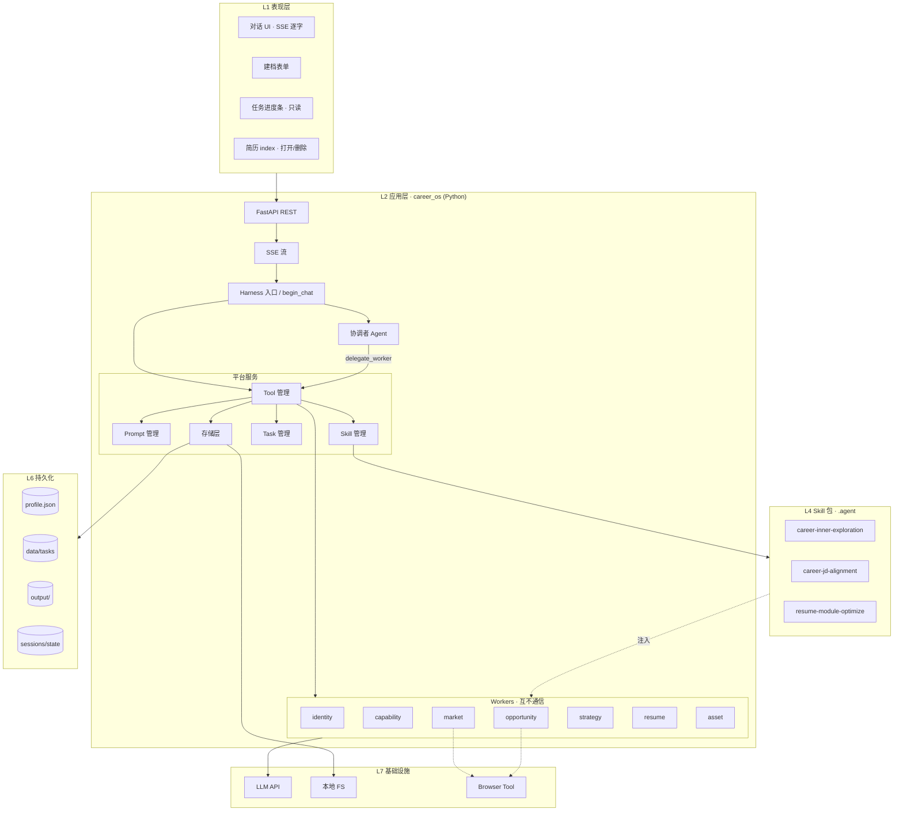

# 系统分层与模块

| 属性 | 内容 |
|------|------|
| 文档版本 | v0.2 |
| 父文档 | [00-架构总览.md](./00-架构总览.md) |
| 最后更新 | 2026-05-29 |

## 1. 分层架构图（实现视图）

在 PRD L1–L7 基础上，**单 Python 进程** 内划分 API、Harness 平台服务与 Agent。



## 2. 依赖规则

| 规则 | 说明 |
|------|------|
| UI → API only | 前端不直连 LLM、不读写 `profile.json` 文件 |
| 协调者 → Tool → 平台服务 | 不跳过 Harness 写盘 |
| Worker → Tool only | 同协调者，且工具集更小 |
| Worker ↛ Worker | 无互相 import / 调用 |
| Skill → Worker | Skill 不单独跑 LLM；由 Skill 管理注入 Worker |
| PRD 档案字段 | 仅经 `ProfileStore.patch` 写入 |

## 3. Python 仓库划分（建议）

```text
backend/
  pyproject.toml
  career_os/
    main.py                 # FastAPI app
    api/
      chat.py               # POST /v1/chat SSE
      profile.py
      tasks.py
      outputs.py
    harness/
      orchestrator.py       # begin_chat, cancel_run
      gate.py
    platform/
      prompt/
      skill/
      worker/               # Worker 注册表加载 → worker_index
      tool/                 # 工具注册 + 权限
      task/
      store/                # profile, resume, output, session
    agents/
      graphs/               # LangGraph：coordinator 主图 + worker 子图
      lc/                   # LangChain：models, tools, prompts
      state/                # CoordinatorState / WorkerState
    runtime/                # Run 上下文、astream → SSE
web/                        # React 前端
data/                       # gitignore
output/                     # gitignore
.agent/skills/
config/
  preference-tags-default.json
  workers.registry.json
```

## 4. 与 PRD L1–L7 对照

| PRD 层 | 本架构 |
|--------|--------|
| L1 表现层 | `web/` |
| L2 应用编排 | Python `harness` + `coordinator` |
| L3 领域智能体 | Python `agents/workers/*` |
| L4 技能包 | `.agent` + `platform/skill` |
| L5 任务协调 | `platform/task` |
| L6 存储 | `platform/store` |
| L7 基础设施 | LLM、FS、Browser |

---

*文档结束*
