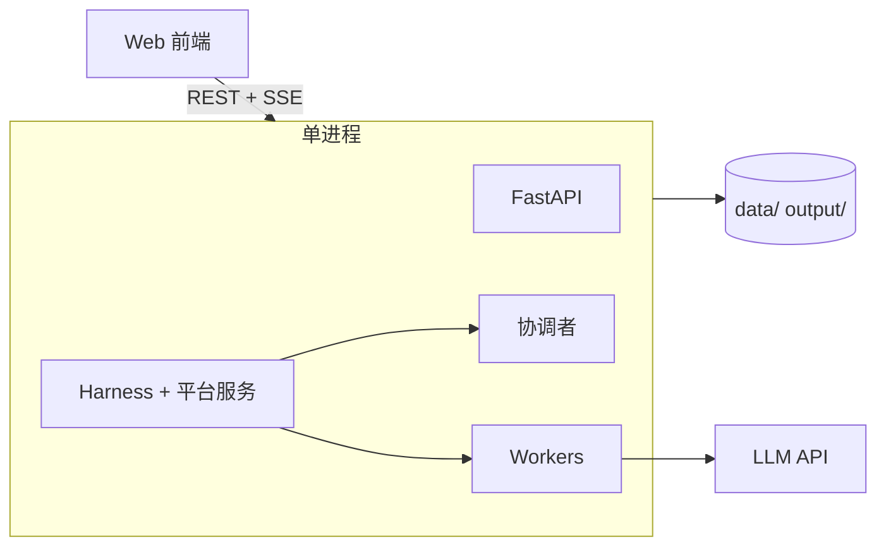
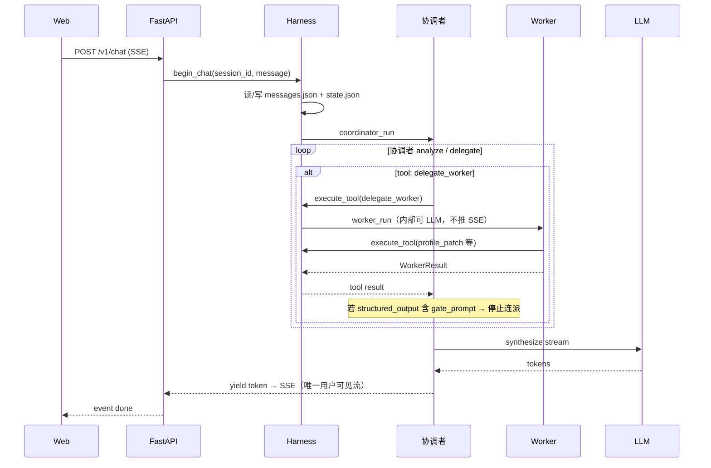

# 应用运行时与部署（Python 单体）

| 属性 | 内容 |
|------|------|
| 文档版本 | v0.2 |
| 父文档 | [00-架构总览.md](./00-架构总览.md) |
| 最后更新 | 2026-05-30（序列表与流式路径修订） |

## 1. 决策：纯 Python 单体

本产品定位为 **本机简历优化 / 职业规划 Agent**，v0.1 **不引入 Go**：

| 考量 | 说明 |
|------|------|
| 部署形态 | 单用户、本地优先；无需 Go 的并发/静态类型优势来扛多租户 |
| 迭代成本 | Agent、Harness、Tool、LLM 调用同属推理栈，放同一进程减少 gRPC/双仓库维护 |
| 与 PRD 一致 | 强约束在 Harness **工具层**；用 Python 实现 Task/Profile 校验即可 |
| 保留边界 | **Harness 平台服务** 与 **协调者/Worker** 仍模块分离，只是同进程 import |



## 2. 进程与入口

| 项 | 说明 |
|----|------|
| 进程名 | `career_os`（开发：`uvicorn career_os.main:app`） |
| 默认端口 | 后端 `18080` · 前端 dev `15173` |
| 工作目录 | 项目根（`DATA_DIR=./data`） |

**本地开发**

```bash
# 一键（项目根）
make dev-demo    # 演示 data/demo
make dev-test    # 手测 data/test

# 或分终端（需先 export DATA_DIR / OUTPUT_DIR，见 backend/.env.demo）
cd backend && uv sync && uv run uvicorn career_os.main:app --reload --port 18080
cd web && npm run dev
```

## 3. 进程内调用（无 gRPC）



- **Tool 执行**：同进程 `Harness.execute_tool(name, args, actor=...)`，权限在校验层完成。
- **流式**：**仅**协调者 `synthesize` 的 token 经 `async generator` yield 到 `StreamingResponse`；Worker 内部 LLM **不**映射为 SSE `token`（见 [07 §6](./07-Agent运行时.md#6-流式--sse仅协调者对用户输出)）。

## 4. 配置

| 变量 | 说明 |
|------|------|
| `LLM_API_KEY` | 模型密钥 |
| `LLM_BASE_URL` | 可选，兼容 OpenAI 协议网关 |
| `DATA_DIR` | 默认 `./data`；同机隔离见 `backend/.env.demo` / `.env.test` + `make dev-demo` / `dev-test` |
| `OUTPUT_DIR` | 默认 `./output`；与 `DATA_DIR` 成对切换 |
| `AGENT_RUN_TIMEOUT` | 默认 `600` 秒 |
| `SESSION_IDLE_TTL` | 默认 `86400` 秒（24h）；session 无活动过期（I2，见 [10 §1.4](./10-会话闸门与state.md#14-闲置过期i2)） |
| `CHAT_HISTORY_MAX_MESSAGES` | 默认 `40`；协调者注入窗口：首条 user + 最近 N 条（M1，[10 §1.5](./10-会话闸门与state.md#15-m1-对话历史上限与裁剪)） |
| `CHAT_HISTORY_MAX_TOKENS` | 默认 `12000`；与条数上限 **先触达** 者生效 |
| `CHAT_HISTORY_WARN_RATIO` | 默认 `0.95`；`usage_ratio` 达此值触发 M1-R 推荐新会话 |
| `CORS_ORIGINS` | 前端 dev 源，如 `http://127.0.0.1:15173` |
| `SEARCH_API_KEY` | 公开网页检索（L7，见 [11-L7-浏览器Tool.md](./11-L7-浏览器Tool.md)） |
| `SEARCH_PROVIDER` | 如 `tavily` / `serpapi` / `duckduckgo` |

**静态配置（非 env）**：

| 路径 | 说明 |
|------|------|
| `config/workers.registry.json` | Worker 注册表；Harness 启动加载 → 协调者 `worker_index`（[02 §3](./02-平台服务.md#3-worker-管理注册表--协调者-worker_index)） |
| `config/preference-tags-default.json` | 建档表单默认标签词表 |

## 5. 依赖建议（v0.1）

| 用途 | 包 |
|------|-----|
| HTTP + SSE | `fastapi`, `uvicorn[standard]` |
| 校验 | `pydantic` v2 |
| Agent | `langchain-*` + `langgraph` 见 [07-Agent运行时.md](./07-Agent运行时.md) |
| 环境 | `uv` 或 `poetry` 管理 `backend/pyproject.toml` |

## 6. 失败与降级

| 场景 | 行为 |
|------|------|
| LLM 不可用 | SSE `error`，协调者提示检查密钥/网络 |
| Tool 校验失败 | 错误回注 LLM，不向用户隐藏原因 |
| Run 超时 | `asyncio.wait_for` 取消任务，SSE `error` |
| Session 闲置过期 | 超过 `SESSION_IDLE_TTL` → **410** `session_expired`；清理工作区，保留 profile/output |
| 用户断开 SSE | 取消当前 Run（`AbortController` 对应服务端 task cancel） |

## 7. 后续扩展（仍可不引入 Go）

| 需求 | 方向 |
|------|------|
| 打包分发 | `pyinstaller` / 内嵌 `uvicorn` + 静态 `web/dist` |
| 性能 | 多 Worker 进程仅当真有 CPU 瓶颈时再考虑，与「去 Go」不矛盾 |
| 评测/批跑 | 独立 `python -m career_os.eval` 子命令，复用 Harness |

---

*文档结束*
