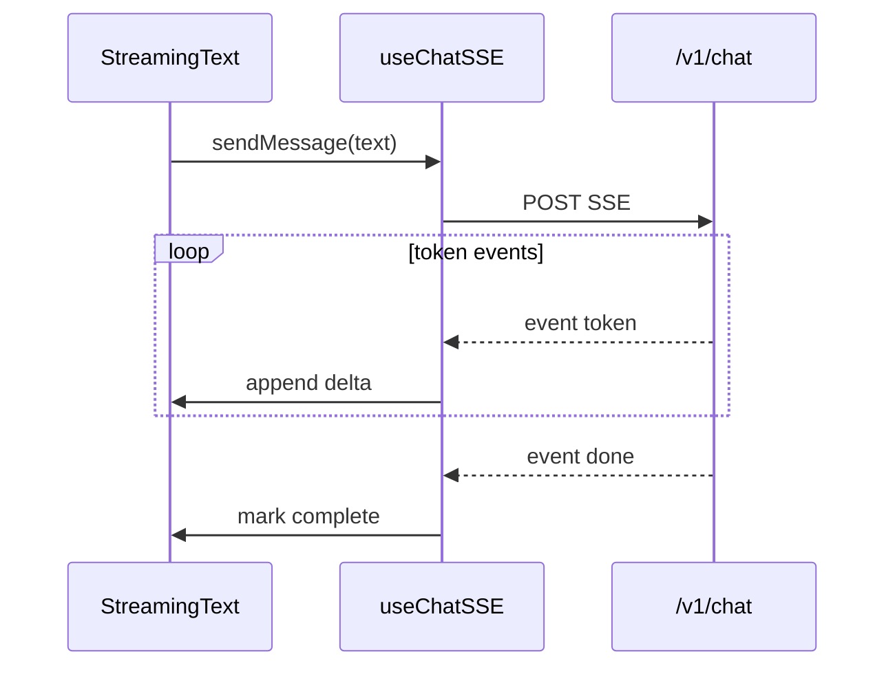

# 前端架构

| 属性 | 内容 |
|------|------|
| 文档版本 | v0.1 |
| 父文档 | [00-架构总览.md](./00-架构总览.md) |
| 最后更新 | 2026-05-30 |

## 1. 技术选型

| 项 | 选型 | 理由 |
|----|------|------|
| 框架 | **React 19 + TypeScript** | 生态成熟、SSE/流式状态好写 |
| 构建 | **Vite** | 本地启动快，适合作品 Demo |
| 样式 | **Tailwind CSS 4** | 表单/对话/进度条快速布局 |
| 路由 | **React Router** | 对话主页 + 简历 index 页 |
| SSE | **`fetch` + `ReadableStream`** | 比 EventSource 更易带 POST body 与自定义头 |
| 状态 | **Zustand**（轻量） | `session_id`、流式消息、任务快照 |

## 2. 页面结构

```text
web/
  src/
    pages/
      ChatPage.tsx        # 主对话（默认入口）
      OnboardingForm.tsx  # 模态/路由：协调者触发 form_request
      OutputsPage.tsx     # 简历列表：打开/删除（调 DELETE API）
    components/
      MessageList.tsx     # 消息气泡
      StreamingText.tsx   # 逐字追加 delta
      TaskProgress.tsx    # 只读进度条，无开始/放弃按钮
      ResumeMarkdownPreview.tsx
    hooks/
      useChatSSE.ts
    api/
      client.ts
```

## 3. 流式 UI 行为

聊天区 `token` **仅** 展示协调者汇总后的回复（Worker 在服务端后台执行，不直出到 SSE）。详见 [07-Agent运行时 §6](./07-Agent运行时.md#6-流式--sse仅协调者对用户输出)。



-  assistant 消息在收到首个 `token` 时插入空气泡，随后追加 `delta`。
- **Session（R2 + I2）**：浏览器刷新调用 `POST /v1/sessions/new` 或不复用旧 `session_id`；**聊天气泡清空**；任务进度条清空；`profile` / `outputs` 仍从 REST 读取。收到 **410** `session_expired` 时弹窗引导新建会话（见 [§4.1](#41-session-过期处理i2)）。
- `task_snapshot` 到达时更新 `TaskProgress`，**不**弹出「开始执行」按钮；用户继续在输入框打字即可。
- **三档（Opt-1）**：**无**档位多选控件；纯对话说明档位（[01 §9](./01-协调者与Worker.md#9-协调者路由策略)）。
- **M1-R**：收到 `history_notice` 且 `recommend_new_session` 时，可展示非阻塞提示条（「对话较长，建议新开对话；档案与 HTML 保留」），**不**自动 `sessions/new`。
- `form_request` → 打开 `OnboardingForm`；提交走 `POST /v1/profile/onboarding`，成功后回到对话。

## 4. 交互与 PRD 对齐

| PRD 要求 | 前端实现 |
|----------|----------|
| 启动不弹表单 | ChatPage 默认无表单 |
| 闸门对话确认 | 仅输入框；无「确认优化」专用按钮 |
| 任务开始/放弃 | **无** UI 按钮；用户自然语言 |
| 进度条 | `TaskProgress` 只读 |
| 简历 HTML | OutputsPage 新标签打开；打印 PDF 在浏览器完成 |
| 拖入历史 HTML | Chat 输入区 drop → `attachments` |

### 4.1 Session 过期处理（I2）

`POST /v1/chat` 若返回 **410** `session_expired`（非 SSE）：

1. 弹窗：「会话已过期（超过 24 小时未活动）。档案与历史 HTML 仍保留，是否开始新对话？」
2. 用户确认 → `POST /v1/sessions/new` → 更新 localStorage `session_id`
3. **清空** 本地聊天气泡与任务进度条（与服务端已清理工作区一致）
4. 可选：自动 **重发** 用户刚输入的那条消息（新 session）

标签页从后台恢复且 loading 卡住：若 fetch 已断，提示重发；不依赖过期逻辑。

## 5. 开发代理

Vite `server.proxy`：

```ts
'/v1': { target: 'http://127.0.0.1:18080', changeOrigin: true }
```

## 6. 可访问性与体验

- 发送中禁用输入（`done` 前不可再发）；收到 **409** `chat_in_progress` 时 toast 提示并恢复输入（[05 §3.5](./05-API与流式协议.md#35-chat-单飞-a1)）。
- 流式输出时显示光标闪烁；`done` 后停止。
- 发送中禁用输入，支持「停止生成」（`AbortController` 断开 fetch → 后端 `CancelRun`）。
- 错误 `event: error`  toast + 保留已生成 partial 文本。

---

*文档结束*
