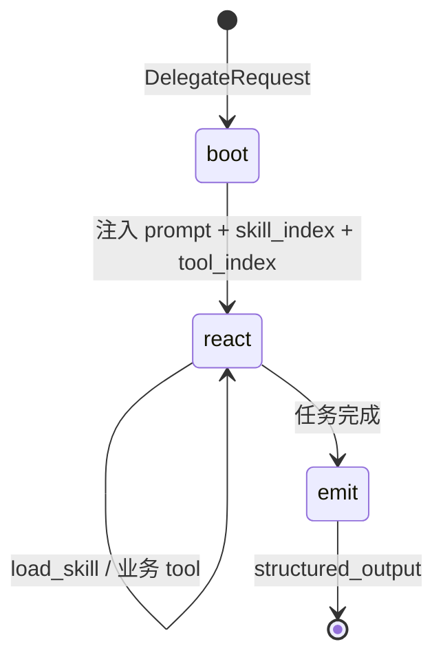
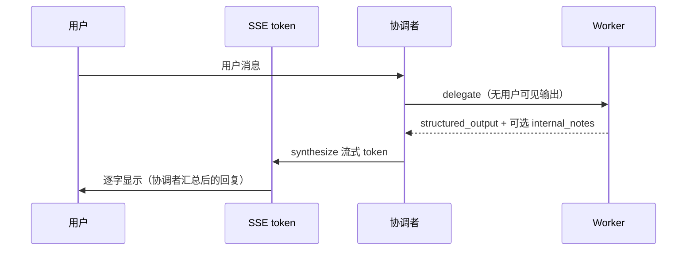

# Agent 运行时（LangChain + LangGraph）

| 属性 | 内容 |
|------|------|
| 文档版本 | v0.5 |
| 父文档 | [00-架构总览.md](./00-架构总览.md) |
| 最后更新 | 2026-05-29 |

## 1. 选型结论：二者结合

v0.1 采用：**LangChain** 提供 Prompts / Models / Tools；**LangGraph** 编排协调者主图与各 Worker 子图。

**能力选型原则**：协调者只 **派工 + 附索引**；Worker 在子图 **ReAct 循环** 内自行 `load_skill` 与调用业务 tool（见 [02-平台服务 §2–3](./02-平台服务.md)）。

## 2. 固定约束

| 约束 | 说明 |
|------|------|
| 单进程 | API、Harness、图均在 `career_os` 内 |
| 协调者不 `load_skill` | Skill 正文仅通过 Worker 的 tool 进入上下文 |
| Worker 子图内可多轮 | `load_skill` → 推理 → `tool` → 再 `load_skill` … 直至 `structured_output` |
| Tool 同源 | `@tool` → `Harness.execute_tool(actor=worker_id)` |
| 无 Worker↔Worker 边 | 仅协调者 `delegate` 触发子图 |
| **唯一用户出口** | 仅协调者 `synthesize` 的文本经 SSE `token` 面向用户；Worker **不** 流式直出 |

## 3. 协调者主图（LangGraph）

**状态字段**：`messages`、`session_id`、`session_state`（含 `prior_results`）、`last_worker_result` 等。

**节点**：`analyze` →（`gate_check`）→ `delegate` → `synthesize`。

`delegate` 调用 Harness `delegate_worker`：**不传 `skill_name`**，由 Harness 写入 `capability_bundle`（skill/tool 索引）。

## 4. Worker 子图（自选 Skill + Tool）



| 阶段 | 行为 |
|------|------|
| **boot** | `platform.prompt(worker_id)` + `goal` + `context` + **索引**（无 skill 正文） |
| **react** | LangChain `bind_tools`：`load_skill`、`list_skills`（可选）、业务 tools；LLM 或规则决定下一步 |
| **load_skill 之后** | 将 `SkillBundle.body` 追加到 `messages`（或 state.skill_context），**后续 token 可见** |
| **emit** | Pydantic 校验 `structured_output` 返回协调者 |

**典型 LC 拼装**：

```text
system = worker_base_prompt + "可用技能见 skill_index；需要步骤时调用 load_skill"
tools  = [load_skill, list_skills?, ...business_tools]
# 模型调用 load_skill("career-inner-exploration") → tool 返回正文 → 继续 react
```

**禁止**：子图启动时默认注入全部 skill 正文；禁止协调者在 `DelegateRequest` 里带 `skill_name` 绕过 Worker 选型。

## 5. LangChain 落点

| 能力 | 用法 |
|------|------|
| **Models** | 协调者与各 Worker 可共用或分模型配置 |
| **Prompts** | 协调者 / Worker 分场景 template；skill 正文 **不**写进静态 template |
| **Tools** | `load_skill` / 业务 tool 均注册为 LC Tool，执行走 Harness |
| **流式** | **仅**协调者 `synthesize` → SSE `token`（见 §6） |

## 6. 流式 → SSE（仅协调者对用户输出）

**产品约定**：用户 **只** 与协调者对话；页面上逐字出现的 `token` **全部** 来自协调者 `synthesize` 节点。Worker Run 在后台完成，其结论以 **结构化结果**（及可选内部摘要）交还协调者，由协调者 **汇总、改写、统一口吻** 后再流式输出。

| 组件 | 是否推送 SSE `token` | 说明 |
|------|----------------------|------|
| **协调者 `synthesize`** | **是** | 唯一面向用户的流式文本来源 |
| **Worker 子图** | **否** | 内部可 `astream` 调试；**禁止** 映射到前端 `token` |
| **`load_skill`** | **否** | 返回 skill 正文块，注入 Worker 上下文，非用户可见 |
| **业务 tool 结果** | **否** | 作为 tool message 留在 Worker Run 内 |



- Worker 若需「一次一问」，由协调者在 `synthesize` 中 **转述** Worker 的 `structured_output` / 追问要点，而非 Worker 原文直出。
- 实现：`astream_events` 过滤时 **仅** 订阅协调者 `synthesize` 节点的 `on_chat_model_stream`；Worker 子图 run 不在 SSE 管道上挂 `token` handler。

## 7. 目录建议

```text
backend/career_os/agents/
  graphs/coordinator.py
  graphs/workers/*.py      # 每 Worker 一个 react 子图
  lc/models.py
  lc/tools.py              # load_skill, harness_tools_for(worker_id)
  state/coordinator.py
  state/worker.py            # 含 loaded_skills[], skill_index
```

## 8. SPIKE 验收

1. 协调者 `delegate` 不带 `skill_name`，Worker 收到索引。
2. Worker 子图：先 `load_skill(A)` 执行几步，再 `load_skill(B)`，审计日志有两条 `skill.load`。
3. Harness 拒绝 Worker 加载 `allowed_workers` 不包含自己的 skill。

---

*文档结束*
