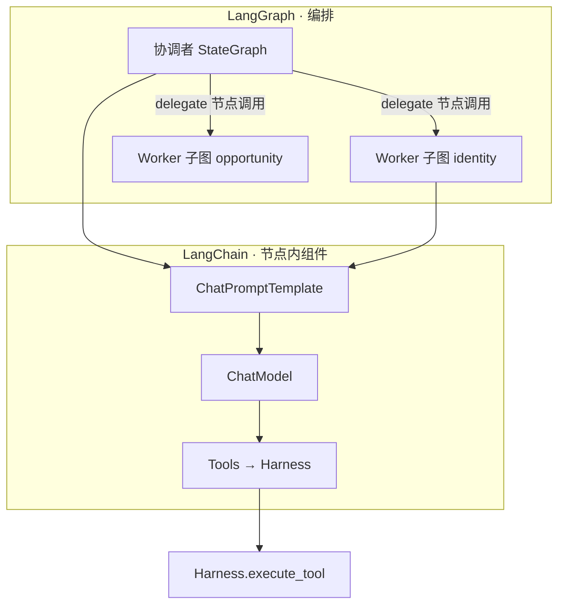
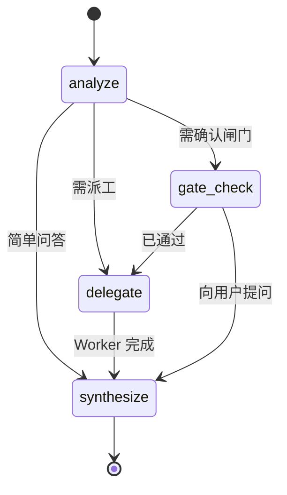

# Agent 运行时（LangChain + LangGraph）

| 属性 | 内容 |
|------|------|
| 文档版本 | v0.3 |
| 父文档 | [00-架构总览.md](./00-架构总览.md) |
| 最后更新 | 2026-05-29 |

## 1. 选型结论：二者结合

v0.1 采用生产常见做法：**底层统一 LangChain 生态，上层用 LangGraph 做图编排**。

| 层级 | 技术 | 在本项目中的职责 |
|------|------|------------------|
| **LangChain** | `Prompts`、`Models`、`Tools`、（节点内）`Runnable` / LCEL | 提示词模板、LLM 封装、Harness 工具包装为 `@tool`；节点内可拼短链 |
| **LangGraph** | `StateGraph`、节点、边、条件路由、`checkpointer` | 协调者主图；每个 Worker 一张**子图**；循环/派工/闸门路由 |



**与「一主多从」对齐**：

- **仅协调者主图**负责路由（是否派工、派哪个 Worker、是否继续追问用户）。
- **Worker 子图之间无边**；子图只被协调者图中的 `delegate_worker` 类节点 **invoke**，不得互相 `invoke`。
- 业务副作用仍全部落在 Harness Tool，LangChain Tool 仅是薄封装。

## 2. 固定约束（框架之上）

| 约束 | 说明 |
|------|------|
| 单进程 | API、Harness、图编译产物均在 `career_os` 内 |
| Tool 同源 | LangChain `@tool` → `Harness.execute_tool(actor=...)` |
| 流式一等 | 对外 `graph.astream_events` / `astream` → 映射为 SSE `token` |
| 结构化输出 | Worker 子图结束写入 state；Pydantic 校验 `structured_output` |
| Skill 注入 | `platform.skill` 正文填入 `ChatPromptTemplate` 的 system 段 |

## 3. 协调者主图（LangGraph）

**状态（`CoordinatorState`）建议字段**：

| 字段 | 用途 |
|------|------|
| `messages` | `Annotated[list, add_messages]` 对话历史 |
| `session_id` | 会话 ID |
| `session_state` | `prior_results`、闸门标记、当前 `list_id` |
| `pending_worker` | 待派工 Worker ID（可选） |
| `last_worker_result` | 最近一次 Worker 结构化结果 |

**典型节点**：

| 节点 | 类型 | 行为 |
|------|------|------|
| `analyze` | LC model + tools | 判断简单问答 / 需派工 / 需闸门话术 |
| `delegate` | 逻辑节点 | `invoke(worker_subgraph, input=...)`，合并结果到 state |
| `synthesize` | LC model | 面向用户流式回复 |
| `gate_check` | 逻辑节点 | 读 Harness `gate` 服务或规则，决定下一跳 |

**典型边**：



- **循环**：`analyze` ↔ `delegate` 可在用户多轮补充信息时重复，由条件边控制，避免无上限循环（`recursion_limit` / 自定义步数上限）。
- **检查点**：v0.1 可用 `MemorySaver` 或文件型 checkpointer 绑定 `session_id`，用于同会话内刷新恢复；**不**替代 `profile.json` 长期记忆。

## 4. Worker 子图（LangGraph + LangChain）

每个 `worker_id` 对应 **独立编译的子图**（如 `graphs/workers/opportunity.py`）。

| 节点 | LangChain 组件 |
|------|----------------|
| `prepare_context` | 读 Harness 预组装的 `profile_slices` + `DelegateRequest.context` |
| `run_skill_phase` | `ChatPromptTemplate` + `skill_body` + `ChatModel`（一次一问时循环） |
| `tool_loop` | `create_react_agent` 或 model.bind_tools + 条件边，工具走 Harness |
| `emit_structured` | 解析为 Pydantic `WorkerResult` / `structured_output` |

子图 **入口**：协调者 `delegate` 节点传入的 `DelegateRequest`。  
子图 **出口**：`structured_output` + 可选 `proposed_profile_patches`（经 Tool 落档）。

**禁止**：在子图内添加指向其他 Worker 子图的边。

## 5. LangChain 在项目中的落点

| 能力 | 实现建议 |
|------|----------|
| **Models** | `langchain_openai.ChatOpenAI`（或兼容网关）；统一 `base_url` / `api_key` 配置 |
| **Prompts** | `ChatPromptTemplate`；`platform.prompt` 渲染为 template 变量；Skill 进 `system` |
| **Tools** | `@tool` 装饰器，内部 `await harness.execute_tool(...)`；按角色注册不同 `ToolNode` |
| **结构化输出** | `with_structured_output` 或 Pydantic parser 作为子图最后一跳 |
| **流式** | 节点内 `model.astream`；图级 `graph.astream_events(version="v2")` 过滤 `on_chat_model_stream` |

### 5.1 与平台服务分工

| 平台服务 | LangChain 关系 |
|----------|----------------|
| `platform.prompt` | 产出 template 字符串 / YAML → `ChatPromptTemplate.from_messages` |
| `platform.skill` | 注入 system，**不**单独跑图 |
| `platform.tool` | 注册表 → 转为 `langchain_core.tools.StructuredTool` |
| Harness | Tool 的执行真相源；图不直接写文件 |

## 6. 流式 → SSE 映射

```text
LangGraph astream_events
  → 过滤 event: on_chat_model_stream / on_chain_stream
  → career_os StreamEvent.token(delta)
  → FastAPI SSE event: token
```

协调者 `synthesize` 节点与用户可见 Worker 追问共用同一套映射；`task_snapshot` / `form_request` 由 Harness 在 Tool 成功后注入 SSE（非 LangChain 事件）。

## 7. 依赖（backend）

```toml
# pyproject.toml 片段（版本以实施时锁定为准）
langchain-core = ">=0.3"
langchain-openai = ">=0.2"   # 或所用厂商包
langgraph = ">=0.2"
langgraph-checkpoint = ">=2.0"  # MemorySaver / SqliteSaver
```

## 8. 目录建议

```text
backend/career_os/agents/
  graphs/
    coordinator.py      # 主图 compile
    workers/
      identity.py
      opportunity.py
      ...
  lc/                     # 可复用 LangChain 构件
    models.py               # get_chat_model()
    tools.py                # harness_tools_for(actor)
    prompts.py              # build_prompt_template(worker_id)
  state/
    coordinator.py          # TypedDict / Pydantic state
    worker.py
```

## 9. Worker `structured_output` Schema

| worker_id | Pydantic 模型（示意） |
|-----------|----------------------|
| `opportunity` | `recommendation`, `jd_fingerprint`, `match_highlights`, ... |
| `strategy` | `three_horizons`, `selected_path_id`, `narrative_summary` |
| `resume` | `markdown_by_level: dict[Literal[保守,标准,进取], str]` |
| `asset` | `files`, `outputs_index_entries` |
| `identity` / `capability` | `exploration_patch`, `capability_patch` |

子图最后一节点 `emit_structured` 必须经校验失败则 Run `failed`，协调者在 `synthesize` 中向用户说明。

## 10. SPIKE 验收（实施前）

1. 协调者主图：`analyze` → `delegate`(mock 子图) → `synthesize`，SSE 流式通。
2. 真实子图 `opportunity`：`bind_tools` + `profile_get`，一次 Tool 往返 &lt; 50ms（本地）。
3. `MemorySaver` + `session_id`：刷新后会话可续（可选 v0.1）。

---

*文档结束*
