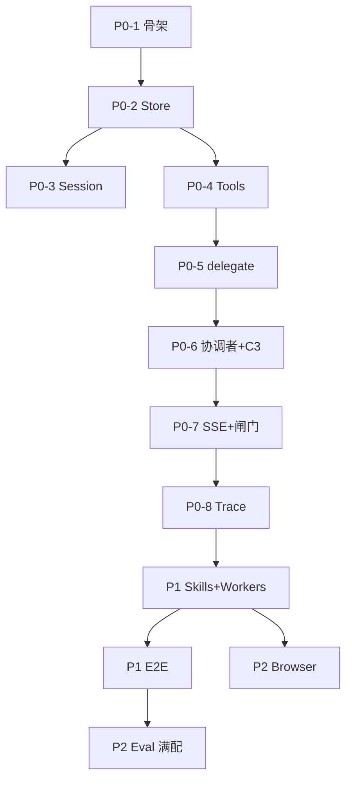

# PRD → 架构追溯表

| 属性 | 内容 |
|------|------|
| 文档版本 | v0.6 |
| 最后更新 | 2026-05-31 |

## 机制类

| PRD | 架构模块 | 文档 |
|-----|----------|------|
| A01 职业档案 | `store/profile`, `store/resume`, Patch 白名单 | [02-平台服务.md](./02-平台服务.md)、[13-Profile-写入权限.md](./13-Profile-写入权限.md) |
| A02 任务系统 | `platform/task`, Preset, ID 规则, 对话启停 | [02-平台服务.md](./02-平台服务.md) |
| A03 技能包 | `platform/skill`, `.agent/skills` | [02-平台服务.md](./02-平台服务.md) |
| Worker Registry | `config/workers.registry.json`, `platform/worker` | [02 §3](./02-平台服务.md#3-worker-管理注册表--协调者-worker_index) |
| Tool schema | Harness 工具契约 | [14-Harness-Tools-Schema.md](./14-Harness-Tools-Schema.md) |

## 流程类

| PRD | 协调者/Worker | 文档 |
|-----|---------------|------|
| B01 入口建档 | `coordinator` + 表单 API | [05-API与流式协议.md](./05-API与流式协议.md) |
| B02 初探 | `identity`, `capability` + skill `career-inner-exploration` | [01-协调者与Worker.md](./01-协调者与Worker.md) |
| B03 市场/JD | `market`, `opportunity` | [01-协调者与Worker.md](./01-协调者与Worker.md) |
| B04 策略 | `strategy` + skill `career-jd-alignment` | [01-协调者与Worker.md](./01-协调者与Worker.md) |
| B05 复用 | `asset`（优化前） | [01-协调者与Worker.md](./01-协调者与Worker.md) |
| B06 优化 | `capability`, `resume` + skill `resume-module-optimize` | [01-协调者与Worker.md](./01-协调者与Worker.md) |
| B07 HTML | `asset`（落盘/index） | [02-平台服务.md](./02-平台服务.md) |

## 总领 PRD 特殊项

| PRD 条目 | 架构决策 |
|----------|----------|
| §4.1 Multi-Agent 互调 | **废弃** → 一主多从；**PRD 00 §4.1 / B04 §5.4.1 已同步（2026-05-29）** |
| §4.1 L2 Workflow | 协调者循环 + `delegate_worker` |
| 附录 B 闸门 | 对话-only；`gate` SSE 可选 |
| 附录 C 目录 | `store` 路径一致 |
| T-05 index 删除 | `DELETE /v1/outputs` |
| T-06 任务启发式 | 协调者 + `parse_task_control_intent` |
| 执行层暂缓 | 无模块 |

## 架构讨论结论

| # | 日期 | 结论 |
|---|------|------|
| 1 | 2026-05-29 | 一主多从，Worker 互不通信 |
| 2 | 2026-05-29 | 平台服务：Prompt / Skill / Tool / Task / 存储 |
| 3 | 2026-05-29 | ~~Go + Python gRPC~~ → **纯 Python 单体** `career_os`（见 [04-应用运行时与部署.md](./04-应用运行时与部署.md)） |
| 4 | 2026-05-29 | REST + SSE 逐字流式 |
| 5 | 2026-05-29 | 任务开始/放弃仅对话，无专用 API/按钮 |
| 6 | 2026-05-29 | **Python + Web**（FastAPI + React） |
| 7 | 2026-05-29 | **LangChain + LangGraph 结合** → [07-Agent运行时.md](./07-Agent运行时.md) |
| 11 | 2026-05-29 | **Skill/Tool 由 Worker 自选** → [02-平台服务 §2](./02-平台服务.md#2-skill-管理注册表--worker-自选) |
| 12 | 2026-05-29 | **仅协调者 SSE 流式对用户**；Worker 结果汇总后 synthesize → [07 §6](./07-Agent运行时.md#6-流式--sse仅协调者对用户输出) |
| 8 | 2026-05-29 | 前端 React + Vite → [06-前端架构.md](./06-前端架构.md) |
| 9 | 2026-05-29 | 多篇 `docs/architecture/` |
| 10 | 2026-05-30 | **实施顺序** P0→P2 → 本文「实施顺序」节 |
| 13 | 2026-05-30 | 任务启停：**纯对话**，无「开始执行」按钮 → A02/06 已同步 |
| 14 | 2026-05-30 | 用户可见流式：**仅协调者 SSE** |
| 15 | 2026-05-30 | 闸门：Worker `gate_prompt` + 协调者转述 |
| 16 | 2026-05-30 | ~~Session 仅 state.json~~ → **#21/#28**：`messages.json` 会话级落盘，换会话清空 |
| 17 | 2026-05-30 | 废弃任务 `metadata.skill_name` |
| 18 | 2026-05-30 | `write_resume_html` **仅 resume**；asset `register_outputs_index`（resume → `html_deliveries` → asset 登记，见 [01 §4.3](./01-协调者与Worker.md#43-html-交付协作resume-写盘--asset-登记)） |
| 19 | 2026-05-30 | `list_type=plan` 派工链 → [01 §5.1](./01-协调者与Worker.md#51-典型派工链list_typeplan-纯规划) |
| 20 | 2026-05-30 | 命名统一 **`career_os`**；Prompt → `platform/prompt/` |
| 21 | 2026-05-30 | **Session 工作区**：`messages.json` + 换会话清空 tasks（含 ready）→ [10 §1](./10-会话闸门与state.md#1-会话工作区生命周期) |
| 22 | 2026-05-30 | **闸门 G1 + B1**：`state.json` 临时位；未初探 JD 软引导、无 HTTP 403 → [10 §2](./10-会话闸门与state.md#2-gates-闸门) |
| 23 | 2026-05-30 | **structured_output S2** + 各 Worker 契约 → [09](./09-Worker结构化输出.md) |
| 24 | 2026-05-30 | **Profile 落档 P3 + O-P1**：proposed vs patch；snapshot 即时 patch |
| 25 | 2026-05-30 | ~~旧公开搜索抓页方案~~；已由 2026-07-15 冻结方案市场调研工具替代 → [11](./11-市场调研Tool.md) |
| 26 | 2026-05-30 | **协调者 C3 + T6-1** → [01 §9](./01-协调者与Worker.md#9-协调者路由策略) |
| 27 | 2026-05-30 | ~~**初探 gate E1**：`gate_owner`~~ → **#45 E2** `explore_closure` 替代 |
| 28 | 2026-05-30 | 修订 #16：Session **含** `messages.json`（会话级，不跨会话） |
| 29 | 2026-05-30 | **Eval E-LLM**：L2/L3 真 LLM 优先；mock 仅无 Key 降级 → [12 §3.0](./12-评测与可观测.md#30-真-llm-优先e-llm) |
| 30 | 2026-05-30 | **PRD 同步 P2**：`00`/`A02`/`B04`/`B05`/`B07` 对齐 session、messages、tasks 绑定 |
| 31 | 2026-05-30 | **Profile 写入 V1**：可见仅 HTML；不可见白名单 → [13](./13-Profile-写入权限.md) |
| 32 | 2026-05-30 | **`match_gate_intent` M2**：规则优先 + 轻 LLM → [10 §2.3](./10-会话闸门与state.md#23-match_gate_intent) |
| 33 | 2026-05-30 | **Tool schema S2** 独立篇 → [14](./14-Harness-Tools-Schema.md) |
| 34 | 2026-05-30 | **初探 Skill K2**：单 skill + `mode` + `allowed_workers` → [A03](../prd/A03.%20机制-技能包%20PRD.md) |
| 35 | 2026-05-30 | **三档 HTML H1**：用户多选 N 档（N≥1）；work **顺序** 保守→标准→进取（非固定三份） |
| 36 | 2026-05-30 | **T-04 O1**：始终 `output/YYYY-MM-DD/`；文件名 `(n)` 消歧 |
| 37 | 2026-05-30 | **`preference-tags-default.json`**：分组全展示、V1 词表 |
| 38 | 2026-05-30 | **Chat A1**：409 `chat_in_progress` → [05 §3.5](./05-API与流式协议.md#35-chat-单飞-a1) |
| 39 | 2026-05-30 | **LangGraph B1**：无跨请求 checkpoint → [07 §8](./07-Agent运行时.md#8-langgraph-checkpointb1) |
| 40 | 2026-05-30 | **存储锁 C1**：profile/tasks mutex → [02 §6.1](./02-平台服务.md#61-并发写锁c1) |
| 41 | 2026-05-30 | **Session 闲置 I2**：24h TTL、410 `session_expired`、`/ping` → [10 §1.4](./10-会话闸门与state.md#14-闲置过期i2) |
| 42 | 2026-05-31 | **Worker Registry WR**：`config/workers.registry.json` + 协调者 `worker_index` → [02 §3](./02-平台服务.md#3-worker-管理注册表--协调者-worker_index) |
| 43 | 2026-05-31 | **顺序连派**：v0.1 同轮多 Worker **顺序** delegate，不 asyncio 真并行 |
| 44 | 2026-05-31 | **JD-R1（已收紧）**：`opportunity` 前须重新解析未过期正式市场结果，且用户确认当前引用；旧缓存不授权 |
| 45 | 2026-05-31 | **E2 explore_closure**：双 Worker 收束位 + 协调者 explore gate；废弃 E1 `gate_owner` → [10 §2.5](./10-会话闸门与state.md#25-explore_closuree2-双-worker-收束) |
| 46 | 2026-05-31 | **Opt-1 三档**：纯对话解析、无 gate、直接 delegate(resume)；持久化仅 `profile.resume.last_optimization_levels[]` |
| 47 | 2026-05-31 | **B3 complete_task**：仅协调者执行；Worker → `proposed_task_completions` → [02 §5.5](./02-平台服务.md#55-任务完成b3) |
| 48 | 2026-05-31 | **M1 + M1-R**：首条+40 条/12k 裁剪；`trimmed` 或 usage≥95% 推荐新会话 → [10 §1.5](./10-会话闸门与state.md#15-m1-对话历史上限与裁剪) |

> 原 #16「不存 messages」已由 #21/#28 替代：不 **长期/跨会话** 存对话，当前 session 可落盘 `messages.json`。

## 实施顺序（v0.1）

总原则：**先 Harness 确定性层 → 再 2 个 Worker 打通 delegate → 再 Skills/E2E → 最后 L7 与 Eval 满配**。详述与 trace/eval 见 [12-评测与可观测.md](./12-评测与可观测.md)。

### P0 — 可 Demo 最小编排（无真实 LLM 亦可测）

| 步骤 | 交付 | 验收 |
|:----:|------|------|
| P0-1 | `backend/` 骨架、`pyproject.toml`、FastAPI `/healthz` | `uv run uvicorn` 启动 |
| P0-2 | `ProfileStore` / `SessionStore` / `TaskStore` | 读写 `profile.example.json`；`messages.json` + `state.json` |
| P0-3 | `POST /v1/sessions/new` + session 换会话 **清 tasks** | [10 §1](./10-会话闸门与state.md#1-会话工作区生命周期) |
| P0-4 | Tool 注册表 + Worker Registry + `profile_get/patch`、`apply_proposed_patches` | L1 pytest ≥5（无 LLM） |
| P0-5 | `delegate_worker` + **真 LLM** Worker（先 `market`、`opportunity`、`strategy`） | 返 S2 schema；正式市场结果门禁；无 SSE Worker token |
| P0-6 | 协调者 LangGraph + **C3**（真 LLM 验证 gate 停链） | trajectory case ≥3（`-m llm`） |
| P0-7 | `POST /v1/chat` SSE（仅协调者 token）+ `match_gate_intent` + **409 单飞** | 闸门 3 个：深度探讨、不推荐继续、优化确认 |
| P0-8 | `TraceWriter` → `data/logs/traces/*.jsonl` | delegate / tool / gate 可 grep |

### P1 — 产品主路径

| 步骤 | 交付 | 验收 |
|:----:|------|------|
| P1-1 | Skill 扫描 + `load_skill` + `allowed_workers` | [07 §9 SPIKE](./07-Agent运行时.md#9-spike-验收) |
| P1-2 | 7 Worker 图（可先 4 个：identity、capability、opportunity、strategy） | [09](./09-Worker结构化输出.md) 校验 |
| P1-3 | Task `explore` / `jd` + `meta.session_id` + 对话 start/abandon | T6-1 |
| P1-4 | `write_resume_html` + `register_outputs_index` + 多档（用户多选，顺序 保守→标准→进取） | HTML + index 可打开 |
| P1-5 | E2E **真 LLM**：初探 → JD（market→opportunity）→ 策略 → 多档 HTML | 1 条 golden path `-m llm` 全绿 |
| P1-6 | `web/` Chat + SSE + R2 刷新 + 只读 TaskProgress | [06](./06-前端架构.md) |

### P2 — 作品完整度

| 步骤 | 交付 | 验收 |
|:----:|------|------|
| P2-1 | `market_research(plan_id)` 冻结方案异步调研 | accepted_async、状态机和正式结果门禁验收 |
| P2-2 | Eval **≥20**（真 LLM 为主；`-m not llm` 仅降级） | [12 §3.2](./12-评测与可观测.md#32-20-条-case-分布简历对齐) |
| P2-3 | 记录 LLM eval 通过率 + token 成本摘要 | 简历可引用实测数据 |
| P2-4 | `python -m career_os.trace replay`（可选） | 单 run_id 时序摘要 |

### 依赖关系（示意）

---

*文档结束*
