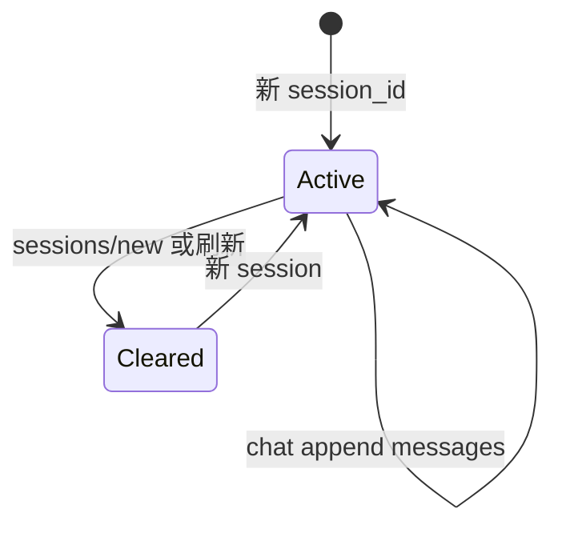
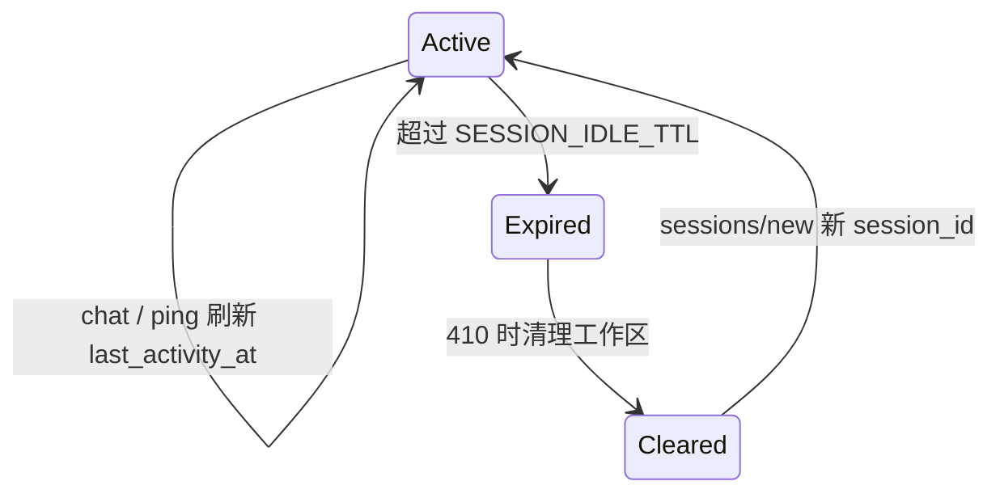
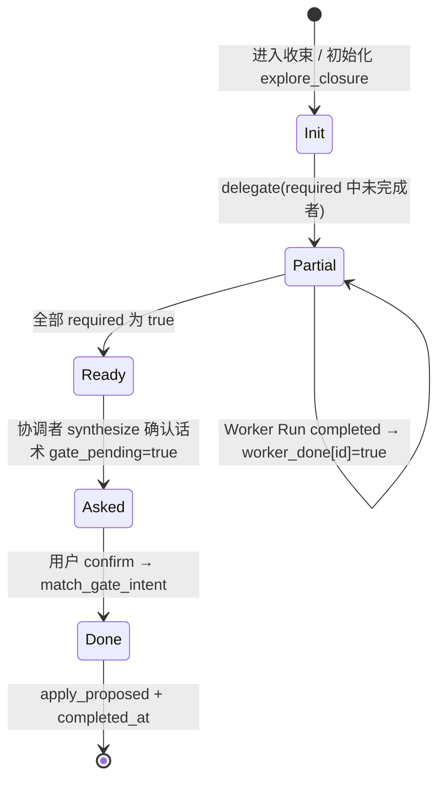

# 会话工作区、闸门与 state.json

| 属性 | 内容 |
|------|------|
| 文档版本 | v0.3 |
| 父文档 | [02-平台服务.md](./02-平台服务.md) |
| 最后更新 | 2026-05-31（M1 对话裁剪 + 推荐新会话） |

## 1. 会话工作区生命周期

### 1.1 存储分层

| 层级 | 路径 | 生命周期 |
|------|------|----------|
| 对话历史 | `data/sessions/{session_id}/messages.json` | 当前 session；换会话清空 |
| 派工/闸门 | `data/sessions/{session_id}/state.json` | 同上 |
| 任务 | `data/tasks/{list_id}/`（`meta.session_id`） | 绑定 session；换会话 **删除全部**（含 `ready`） |
| 长期事实 | `data/profile.json` | 跨 session |
| 产物 | `output/` | 跨 session |

### 1.2 换会话（R2：刷新清空）

触发：`POST /v1/sessions/new`、首次 chat 不带 `session_id`、前端刷新不复用旧 ID。

| 动作 | 对象 |
|------|------|
| 删除/废弃 | `messages.json`、`state.json` |
| 删除 | 该 `session_id` 下 **全部** task list（`ready` + `active`） |
| 清空 | `data/tasks/_active.json` |
| **保留** | `profile.json`、`output/` |



### 1.3 `messages.json` 格式（示意）

```json
{
  "messages": [
    { "role": "user", "content": "..." },
    { "role": "assistant", "content": "..." }
  ]
}
```

`begin_chat`：读入、按 [§1.5 M1](#15-m1-对话历史上限与裁剪) 裁剪后拼进协调者 `CoordinatorState.messages`；本轮结束后 append 并写回 **完整** 磁盘历史（裁剪仅影响 **注入 LLM 的窗口**，不删盘）。

### 1.5 M1：对话历史上限与裁剪

v0.1 **不** 做跨轮摘要落盘；仅对协调者 context 做窗口裁剪。Worker Run **不** 读取全量 `messages.json`（仅 `DelegateRequest.context.user_message` + `profile_slices` + `prior_results`）。

| 项 | 约定 |
|----|------|
| **窗口** | **首条** user 消息（进入深度探讨/建档上下文）+ **最近** `CHAT_HISTORY_MAX_MESSAGES` 条（默认 **40**）；或估计 token 达 `CHAT_HISTORY_MAX_TOKENS`（默认 **12000**）— **先触达者** 生效 |
| **磁盘** | `messages.json` 仍 append 全量；裁剪只在 `begin_chat` 加载到内存时 |
| **元数据** | 写入 `state.json.messages_meta`（见 [§2.1](#21-statejson-结构示意)） |

#### 1.5.1 `messages_meta`

| 字段 | 说明 |
|------|------|
| `total_count` | 磁盘 messages 总条数 |
| `loaded_count` | 本次注入协调者的条数 |
| `trimmed` | 本次是否发生裁剪（`loaded_count < total_count`） |
| `usage_ratio` | `loaded_count / min(total_count, CHAT_HISTORY_MAX_MESSAGES)` 或 token 比值，取值 0–1 |

#### 1.5.2 推荐新会话（M1-R）

当 **`trimmed === true`**（已裁剪）**或** **`usage_ratio >= 0.95`** 时：

| 行为 | 说明 |
|------|------|
| **协调者** | 在本轮 `synthesize` **末尾** 软推荐：「对话较长，建议 `POST /v1/sessions/new` 开新会话；档案与 HTML 仍保留」（**不阻断** 当前流程） |
| **SSE** | 可选 `history_notice` 事件（见 [05 §3.2](./05-API与流式协议.md#321-事件类型说明)）供前端轻提示 |
| **不强制** | 不自动 `sessions/new`；用户可忽略继续 |

与 **I2 过期**、**R2 刷新清空** 独立：M1-R 是 **同 session 内** 上下文过长时的体验提示。

### 1.4 闲置过期（I2）

页面或 session **长时间无活动** 时，服务端使该 `session_id` 失效，避免 stale 闸门 / 半完成 task 误导用户。

| 项 | 约定 |
|----|------|
| **TTL** | 默认 **24h**（`SESSION_IDLE_TTL`，秒；见 [04 §4](../04-应用运行时与部署.md#4-配置与环境变量)） |
| **活动戳** | `state.json` 字段 `last_activity_at`（ISO8601）；每次 `POST /v1/chat` 成功 **开始** 处理前校验并更新；`POST /v1/sessions/{id}/ping` 仅刷新戳、不跑 Agent |
| **判定** | `now - last_activity_at > TTL` → session **已过期** |
| **过期后 chat** | **410** `session_expired`（JSON  body，**不** 开 SSE）；提示调用 `POST /v1/sessions/new` |
| **过期清理** | 与 [§1.2](#12-换会话r2刷新清空) 相同：删该 session 的 `messages.json`、`state.json`、绑定 **全部** tasks |
| **保留** | `profile.json`、`output/` **不** 因过期删除 |



**与 R2 区别**：R2 是用户 **主动** 刷新/新对话；I2 是 **被动** 超时，磁盘清理规则相同，但用户可能仍持有旧 `session_id`（localStorage），需前端引导新会话。

**与 A1 关系**：过期 session 若仍有 in-flight Run（极罕见），清理前先 **取消 Run** 并释放单飞锁。

闸门 **临时态** 存 `state.json`；换 session 清空。需长期保留的确认结果写 `profile.json`。

## 2. Gates（闸门）

### 2.1 `state.json` 结构（示意）

```json
{
  "session_id": "sess_...",
  "list_id": "list_...",
  "last_activity_at": "2026-05-30T12:00:00Z",
  "prior_results": {},
  "messages_meta": {
    "total_count": 86,
    "loaded_count": 40,
    "trimmed": true,
    "usage_ratio": 0.97
  },
  "explore_closure": {
    "gate_name": "explore_complete",
    "required_workers": ["identity", "capability"],
    "worker_done": {
      "identity": false,
      "capability": false
    },
    "gate_pending": false
  },
  "gates": {
    "pending": {
      "name": "optimize_confirm",
      "prompt": "是否确认按该 JD 优化简历？",
      "asked_at": "2026-05-30T12:00:00Z"
    },
    "flags": {
      "deep_explore_accepted": false,
      "optimize_confirmed": false,
      "jd_continue_despite_not_recommended": false
    }
  }
}
```

- `explore_closure`：初探/复盘 **收束** 专用；见 [§2.5](#25-explore_closuree2-双-worker-收束)。非 explore/plan 收束阶段可为 `null` 或省略。
- `gates.pending`：当前待用户确认的闸门（含协调者发起的 explore gate 与 Worker 发起的 JD/策略等 gate）。

### 2.2 闸门流转

| 闸门 | 问句产出者 | `flags` / profile |
|------|------------|-------------------|
| 进入深度探讨 | 协调者邀请 | `deep_explore_accepted` |
| 初探完成（**E2**） | **协调者**（`explore_closure` 齐套后 synthesize） | `apply_proposed_patches` + `exploration.completed_at` |
| 初探复盘完成（**E2**） | **协调者**（同上，`gate_name=explore_review_complete`） | 刷新 `exploration.completed_at` |
| 不推荐仍继续 | `opportunity`（O1，`gate_prompt`） | `jd_continue…` + `career.jd_override[]` |
| 优化确认 | `strategy`（St1，`gate_prompt`） | `optimize_confirmed` → 允许派 `resume` |

### 2.3 `match_gate_intent`（M2）

| 项 | 约定 |
|----|------|
| 输入 | `user_message` + `gates.pending` + PRD 附录 B 话术 |
| 输出 | `{ matched, gate_name, intent: confirm \| reject \| unknown, confidence? }` |
| **规则层** | 附录 B 关键词/正则 + 同义词（优先） |
| **LLM 层** | 规则未命中或 confidence 低时 **轻量分类**；不送整段 JD/简历 |
| `unknown` | 协调者继续澄清，不改 flag |
| confirm | 更新 `flags` / patch profile / `apply_proposed_patches`；协调者 **`complete_task`**（explore milestone 等，B3）；清 `pending` / `explore_closure` |

#### 2.3.1 附录 B → `gate_name` 映射

| PRD 附录 B 场景 | `gate_name` | confirm 示例 | reject 示例 |
|-----------------|-------------|--------------|-------------|
| 进入深度探讨 | `deep_explore` | `确认进入深度探讨` | `暂不` / `先聊聊` |
| 初探完成 | `explore_complete` | `确认完成初探` | `还要改` |
| 初探复盘完成 | `explore_review_complete` | `确认复盘完成` | `再想想` |
| 不推荐仍继续 | `jd_continue_despite_not_recommended` | `确认继续` / `仍要继续` | `算了` / `换 JD` |
| 优化确认 | `optimize_confirm` | `确认按该 JD 优化简历` | `先不优化` |
| JD 后深挖（B06） | `jd_bank_deep_dive` | `继续深挖经历` | `信息已够，直接优化` |
| 任务开始 | `task_start` | `开始执行` / `现在开始` | — |
| 任务放弃 | `task_abandon` | `放弃` / `换 JD 不做了` | — |

reject 语义：用户明确拒绝当前闸门提议；`task_*` 由 `parse_task_control_intent` 处理时可与 `match_gate_intent` 合并调用。

### 2.4 B1：未初探走 JD

- 协调者 **软引导**（话术提醒先初探）。
- **不** HTTP `403`；**不** Harness 硬拦 `create_task_list(jd)` / `delegate(opportunity)`。
- **仍硬拦**：无 `optimize_confirmed` → `delegate_worker(resume)` 拒绝。

### 2.5 `explore_closure`（E2：双 Worker 收束）

初探/复盘落档须 **identity + capability**（或子集）各自完成本段；**齐套后由协调者** 统一发问，Worker **不** 产 `explore_*` 的 `gate_prompt`（替代原 E1 `gate_owner`）。

#### 2.5.1 字段

| 字段 | 说明 |
|------|------|
| `gate_name` | `explore_complete`（首次，`exploration.completed_at` 为空）或 `explore_review_complete`（已有 `completed_at`） |
| `required_workers` | 本轮收束须 Run 完成的 Worker 子集，取值 ⊆ `{ identity, capability }` |
| `worker_done` | 各 Worker 是否已完成本段；**仅** `required_workers` 内需从 `false`→`true` |
| `gate_pending` | 协调者是否已对用户发出确认问句（防重复） |

**默认已结束**：不在 `required_workers` 内的 Worker **视为** 已完成（`worker_done[id]=true`），不参与收束。

#### 2.5.2 初始化 `required_workers`

| 场景 | `required_workers` | 默认 |
|------|-------------------|------|
| 首次初探收束 | `["identity", "capability"]` | Harness 缺省时用此默认 |
| 复盘 · 只改意向 / summary | `["identity"]` | 协调者 LLM 判定 |
| 复盘 · 只补 bank | `["capability"]` | |
| 复盘 · 两者都变 | `["identity", "capability"]` | 顺序连派；齐套后协调者一问 |
| 判不准 | — | **默认双 Worker** |

协调者进入收束阶段时写入/更新 `explore_closure`；Harness 校验 `required_workers` 为合法子集。

#### 2.5.3 生命周期



| 步骤 | 行为 |
|------|------|
| Worker 完成 | Harness：`worker_id ∈ required_workers` 且 Run `status=completed` → `worker_done[worker_id]=true` |
| 判齐 | 协调者循环：`∀ id ∈ required_workers : worker_done[id]` 且 `!gate_pending` → **停止 delegate**，走 synthesize |
| 发问 | 协调者汇总 `prior_results` + `proposed_profile_patches` 草案，生成附录 B 确认问句；写 `gates.pending` + `gate_pending=true`；可选 SSE `gate` |
| confirm | `match_gate_intent` → confirm → `apply_proposed_patches` + 写/刷新 `exploration.completed_at`；协调者 **`complete_task`**（初探 milestone，B3）；清 `explore_closure` 或重置 |

同轮内可 **顺序** `delegate(identity)` → `delegate(capability)`；**两者均 done 之后** 才出现 explore gate（中间无 Worker `gate_prompt`）。

#### 2.5.4 Harness 校验

| 场景 | 行为 |
|------|------|
| `identity` / `capability` 的 `structured_output.gate_prompt` 且 `gate_name` 为 explore 类 | **校验失败**（Run failed 或 strip + 审计告警） |
| synthesize 前 required 未齐 | **禁止** 写 `gates.pending`（explore 类） |
| 已有 `completed_at` | 禁止 `gate_name=explore_complete`，仅允许 `explore_review_complete` |

## 3. Profile 落档双路径（P3）

写入权限分级（V1 可见/不可见）见 [13-Profile-写入权限.md](./13-Profile-写入权限.md)。

| 路径 | 何时 |
|------|------|
| **`proposed_profile_patches`** | 待确认草案：`exploration.*`（gate 前）、未选策略路径等 |
| **`profile_patch` tool** | 已确认或客观事实：`exploration.completed_at`、`market.trend_notes`、`opportunity_snapshots`（O-P1 即时）、gate 后字段 |
| **`apply_proposed_patches`** | `match_gate_intent` → confirm 后批量 apply proposed |

同一 path **禁止** 既 proposed 又 tool。

---

*文档结束*
