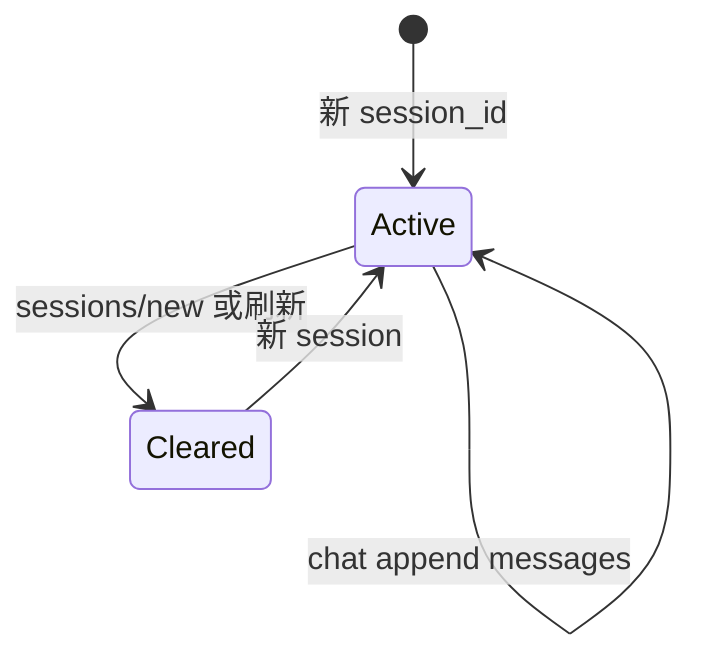
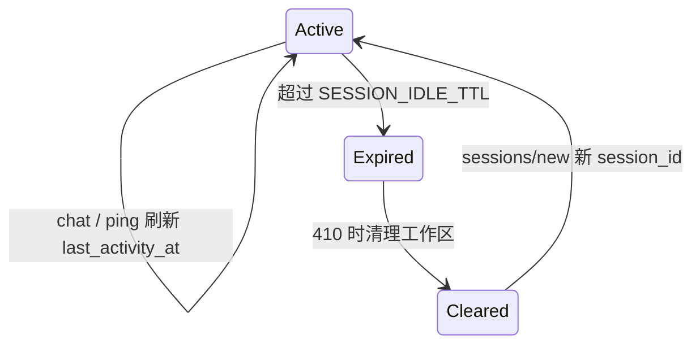

# 会话工作区、闸门与 state.json

| 属性 | 内容 |
|------|------|
| 文档版本 | v0.2 |
| 父文档 | [02-平台服务.md](./02-平台服务.md) |
| 最后更新 | 2026-05-30（I2 session idle TTL） |

## 1. 会话工作区生命周期

### 1.1 存储分层

| 层级 | 路径 | 生命周期 |
|------|------|----------|
| 对话历史 | `data/sessions/{session_id}/messages.json` | 当前 session；换会话清空 |
| 派工/闸门 | `data/sessions/{session_id}/state.json` | 同上 |
| 任务 | `data/tasks/{list_id}/`（`meta.session_id`） | 绑定 session；换会话 **删除全部**（含 `ready`） |
| 长期事实 | `data/profile.json` | 跨 session |
| 产物 | `output/` | 跨 session |

### 1.2 换会话（R2：刷新清空）

触发：`POST /v1/sessions/new`、首次 chat 不带 `session_id`、前端刷新不复用旧 ID。

| 动作 | 对象 |
|------|------|
| 删除/废弃 | `messages.json`、`state.json` |
| 删除 | 该 `session_id` 下 **全部** task list（`ready` + `active`） |
| 清空 | `data/tasks/_active.json` |
| **保留** | `profile.json`、`output/` |



### 1.3 `messages.json` 格式（示意）

```json
{
  "messages": [
    { "role": "user", "content": "..." },
    { "role": "assistant", "content": "..." }
  ]
}
```

`begin_chat`：读入拼进协调者 `CoordinatorState.messages`；本轮结束后 append 并写回。

### 1.4 闲置过期（I2）

页面或 session **长时间无活动** 时，服务端使该 `session_id` 失效，避免 stale 闸门 / 半完成 task 误导用户。

| 项 | 约定 |
|----|------|
| **TTL** | 默认 **24h**（`SESSION_IDLE_TTL`，秒；见 [04 §4](../04-应用运行时与部署.md#4-配置与环境变量)） |
| **活动戳** | `state.json` 字段 `last_activity_at`（ISO8601）；每次 `POST /v1/chat` 成功 **开始** 处理前校验并更新；`POST /v1/sessions/{id}/ping` 仅刷新戳、不跑 Agent |
| **判定** | `now - last_activity_at > TTL` → session **已过期** |
| **过期后 chat** | **410** `session_expired`（JSON  body，**不** 开 SSE）；提示调用 `POST /v1/sessions/new` |
| **过期清理** | 与 [§1.2](#12-换会话r2刷新清空) 相同：删该 session 的 `messages.json`、`state.json`、绑定 **全部** tasks |
| **保留** | `profile.json`、`output/` **不** 因过期删除 |



**与 R2 区别**：R2 是用户 **主动** 刷新/新对话；I2 是 **被动** 超时，磁盘清理规则相同，但用户可能仍持有旧 `session_id`（localStorage），需前端引导新会话。

**与 A1 关系**：过期 session 若仍有 in-flight Run（极罕见），清理前先 **取消 Run** 并释放单飞锁。

闸门 **临时态** 存 `state.json`；换 session 清空。需长期保留的确认结果写 `profile.json`。

### 2.1 `state.json` 结构（示意）

```json
{
  "session_id": "sess_...",
  "list_id": "list_...",
  "last_activity_at": "2026-05-30T12:00:00Z",
  "prior_results": {},
  "gates": {
    "pending": {
      "name": "optimize_confirm",
      "prompt": "是否确认按该 JD 优化简历？",
      "asked_at": "2026-05-30T12:00:00Z"
    },
    "flags": {
      "deep_explore_accepted": false,
      "optimize_confirmed": false,
      "jd_continue_despite_not_recommended": false
    }
  }
}
```

### 2.2 闸门流转

| 闸门 | Worker `gate_prompt` | `flags` / profile |
|------|---------------------|-------------------|
| 进入深度探讨 | 协调者邀请 | `deep_explore_accepted` |
| 初探完成（E1） | `gate_owner` 指定 identity 或 capability | `exploration.completed_at` → profile |
| 不推荐仍继续 | opportunity（O1） | `jd_continue…` + `career.jd_override[]` |
| 优化确认 | strategy（St1） | `optimize_confirmed` → 允许派 `resume` |

### 2.3 `match_gate_intent`（M2）

| 项 | 约定 |
|----|------|
| 输入 | `user_message` + `gates.pending` + PRD 附录 B 话术 |
| 输出 | `{ matched, gate_name, intent: confirm \| reject \| unknown, confidence? }` |
| **规则层** | 附录 B 关键词/正则 + 同义词（优先） |
| **LLM 层** | 规则未命中或 confidence 低时 **轻量分类**；不送整段 JD/简历 |
| `unknown` | 协调者继续澄清，不改 flag |
| confirm | 更新 `flags` / patch profile / `apply_proposed_patches`；清 `pending` |

#### 2.3.1 附录 B → `gate_name` 映射

| PRD 附录 B 场景 | `gate_name` | confirm 示例 | reject 示例 |
|-----------------|-------------|--------------|-------------|
| 进入深度探讨 | `deep_explore` | `确认进入深度探讨` | `暂不` / `先聊聊` |
| 初探完成 | `explore_complete` | `确认完成初探` | `还要改` |
| 初探复盘完成 | `explore_review_complete` | `确认复盘完成` | `再想想` |
| 不推荐仍继续 | `jd_continue_despite_not_recommended` | `确认继续` / `仍要继续` | `算了` / `换 JD` |
| 优化确认 | `optimize_confirm` | `确认按该 JD 优化简历` | `先不优化` |
| JD 后深挖（B06） | `jd_bank_deep_dive` | `继续深挖经历` | `信息已够，直接优化` |
| 任务开始 | `task_start` | `开始执行` / `现在开始` | — |
| 任务放弃 | `task_abandon` | `放弃` / `换 JD 不做了` | — |

reject 语义：用户明确拒绝当前闸门提议；`task_*` 由 `parse_task_control_intent` 处理时可与 `match_gate_intent` 合并调用。

### 2.4 B1：未初探走 JD

- 协调者 **软引导**（话术提醒先初探）。
- **不** HTTP `403`；**不** Harness 硬拦 `create_task_list(jd)` / `delegate(opportunity)`。
- **仍硬拦**：无 `optimize_confirmed` → `delegate_worker(resume)` 拒绝。

## 3. Profile 落档双路径（P3）

写入权限分级（V1 可见/不可见）见 [13-Profile-写入权限.md](./13-Profile-写入权限.md)。

| 路径 | 何时 |
|------|------|
| **`proposed_profile_patches`** | 待确认草案：`exploration.*`（gate 前）、未选策略路径等 |
| **`profile_patch` tool** | 已确认或客观事实：`exploration.completed_at`、`market.trend_notes`、`opportunity_snapshots`（O-P1 即时）、gate 后字段 |
| **`apply_proposed_patches`** | `match_gate_intent` → confirm 后批量 apply proposed |

同一 path **禁止** 既 proposed 又 tool。

---

*文档结束*
