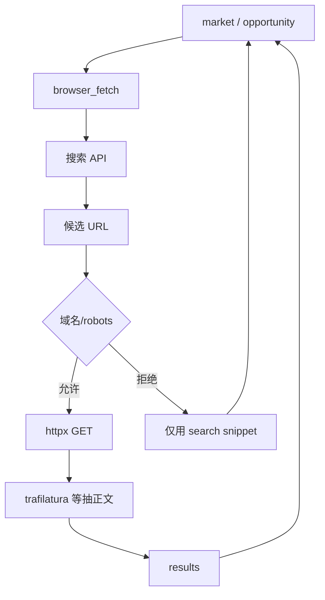

# L7 浏览器 Tool（`browser_fetch`）

| 属性 | 内容 |
|------|------|
| 文档版本 | v0.1 |
| 父文档 | [03-系统分层.md](./03-系统分层.md) |
| 最后更新 | 2026-05-30 |

## 1. 决策：L7-C 混合 + T1 自选

| 项 | 内容 |
|----|------|
| **L7-C** | 搜索 API 发现 URL → 允许域 httpx 抓页 → 正文抽取摘要 |
| **T1** | **Worker**（`market` / `opportunity`）在 ReAct 内 **自行决定**是否调用；协调者不预指定 |
| **产品** | 对齐 B03 §5.3.6：公开情报、溯源、失败降级、不阻塞主路径 |

> 对外工具名 **`browser_fetch`**；实现为「公开网页检索子系统」，**非**登录型招聘站内浏览器自动化。

## 2. 架构



## 3. Tool 契约

### 3.1 入参

```json
{
  "query": "云原生 后端 岗位趋势",
  "intent": "market_trend | company_profile | role_research",
  "max_results": 3
}
```

### 3.2 出参

```json
{
  "status": "ok | partial | failed",
  "results": [
    {
      "source_url": "https://example.com/...",
      "fetched_at": "2026-05-30T12:00:00Z",
      "title": "...",
      "snippet": "摘录摘要（≤800 字，不落全文）"
    }
  ],
  "degraded_reason": null
}
```

### 3.3 约束

| 约束 | 说明 |
|------|------|
| `actor` | 仅 `market`、`opportunity` |
| 禁止 | 登录、Cookie 会话、招聘站内网、自动投递 |
| 超时 | 整 tool 15–20s；单页 fetch ≤5s |
| 日志 | query 哈希、URL、耗时；**不落** JD/简历全文 |
| 降级 | `failed` 时 Worker 继续；对话说明改用语料 + profile |

## 4. 与 Worker 输出衔接

Worker 将引用写入 `structured_output.external_sources` 或经 `profile_patch` 写入 `market.trend_notes[]` / `market.opportunity_snapshots[].external_sources[]`（须 `source_url`、`fetched_at`）。

## 5. 配置

| 变量 | 说明 |
|------|------|
| `SEARCH_API_KEY` | 搜索提供商密钥 |
| `SEARCH_PROVIDER` | `tavily` / `serpapi` / `duckduckgo` 等 |

依赖建议：`httpx`、`trafilatura`（见 [04 §5](./04-应用运行时与部署.md#5-依赖建议v01)）。

---

*文档结束*
