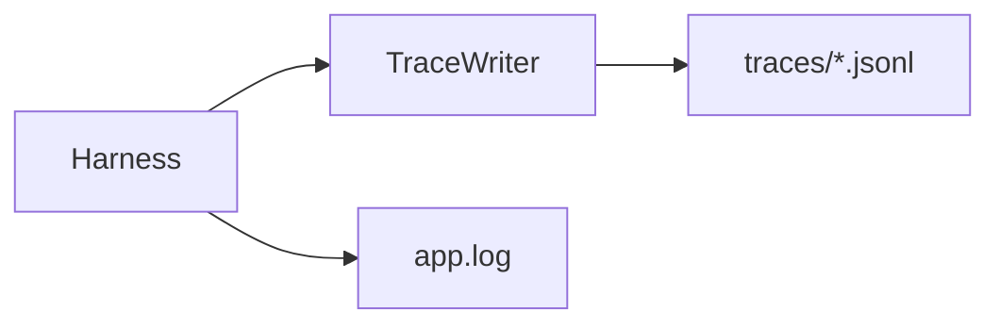
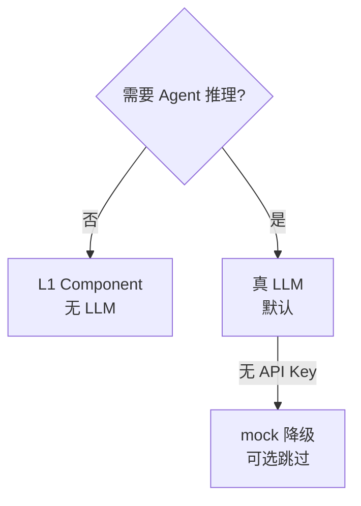

# 评测（Eval）与可观测（Trace）

| 属性 | 内容 |
|------|------|
| 文档版本 | v0.2 |
| 父文档 | [08-PRD追溯.md](./08-PRD追溯.md) |
| 最后更新 | 2026-05-30（真 LLM 优先策略） |

## 1. 目标

| 目标 | 说明 |
|------|------|
| **可证明非 Demo** | ≥20 条可重复 case；闸门、派工链、三档 HTML、Tool 降级有据可查 |
| **Harness 可升级** | JSONL trace 支持失败归因（哪步 delegate / tool / gate 出错） |
| **分层评测** | L1 纯确定性；**L2/L3 能用真 LLM 则优先真 LLM**（见 [§3.0](#30-真-llm-优先e-llm)） |

## 2. Trace（运行时审计）

### 2.1 写入位置

| 路径 | 说明 |
|------|------|
| `data/logs/app.log` | 人类可读摘要（PRD §6.3 打点） |
| `data/logs/traces/{YYYY-MM-DD}.jsonl` | **结构化轨迹**（一行一事件，可 `grep` / 回放） |

均在 `.gitignore`；**不落** JD/简历全文，敏感字段哈希。

### 2.2 JSONL 事件 schema

每行一个 JSON 对象：

```json
{
  "ts": "2026-05-30T12:00:00.000Z",
  "event": "tool.call",
  "run_id": "run_01J8…",
  "session_id": "sess_abc",
  "worker_id": "opportunity",
  "tool_name": "profile_patch",
  "status": "ok",
  "latency_ms": 42,
  "detail": {}
}
```

| `event` | 必填字段 | 说明 |
|---------|----------|------|
| `agent.run.start` | run_id, worker_id, session_id | 协调者或 Worker Run 开始 |
| `agent.run.end` | run_id, status, token_usage? | completed / failed / cancelled |
| `tool.call` | tool_name, actor, status, latency_ms | Harness 工具调用 |
| `skill.load` | skill_name, worker_id, hash | Worker `load_skill` |
| `gate.pending` | gate_name, prompt_hash | 协调者写入 `gates.pending` |
| `gate.pass` | gate_name, intent | match_gate_intent 结果 |
| `task.transition` | list_id, task_id, from, to | task 状态变更 |
| `session.reset` | old_session_id, new_session_id | 换会话清空 |

### 2.3 注入点

在 `Harness.execute_tool`、`delegate_worker`、`apply_proposed_patches`、`SessionStore.reset` 统一调用 `TraceWriter.emit(...)`，**不**在 Worker 子图散落打 log。



### 2.4 回放与排查（v0.1 最小）

```bash
# 按 run 查一条链路
rg '"run_id":"run_01J8"' data/logs/traces/

# 查 gate 失败
rg '"event":"gate' data/logs/traces/
```

后续（P2+）：`python -m career_os.trace replay --run-id …` 输出时序摘要。

## 3. Eval 分层

### 3.0 真 LLM 优先（E-LLM）

| 原则 | 说明 |
|------|------|
| **默认** | 凡涉及协调者路由、Worker 推理、多轮对话、三档文案质量 → **用真 LLM** 跑 case |
| **例外 L1** | schema、白名单、`match_gate_intent` 规则等 **纯确定性** 测项 **不调** LLM |
| **Mock 定位** | 仅作 **无 Key / 离线** 降级（`@pytest.mark.no_llm`），**不**作为 E2E 主路径 |
| **稳定性** | 真 LLM case 断言 **结构 + trace**，少断言逐字文案；必要时 LLM-as-judge 只用于三档/无证据断言 |
| **成本** | case 用短 JD、少轮次；同类场景 parametrized 合并 |



| 层 | 测什么 | LLM 策略 | 框架 |
|----|--------|----------|------|
| **L1 Component** | Tool 白名单、Pydantic schema、gate 规则、`match_gate_intent` | **不用** | pytest |
| **L2 Trajectory** | 派工顺序、C3 gate 停链、Worker 选型 | **真 LLM 优先** | pytest + `LLM_API_KEY` |
| **L3 E2E** | 多轮 chat → profile / HTML / 闸门 | **真 LLM 优先** | pytest |

### 3.1 Case 目录（建议）

```text
backend/tests/
  component/          # L1：tool、store、gate（无 LLM）
  trajectory/         # L2：delegate 链（默认 -m llm）
  e2e/                # L3：场景脚本（默认 -m llm）
  fixtures/
    profiles/
    jd/
    transcripts/      # 附录 B 话术
eval/
  cases.yaml
  golden/
```

### 3.2 ≥20 条 case 分布（简历对齐）

| 类别 | 数量 | 示例 |
|------|:----:|------|
| **闸门** | ≥5 | optimize 未确认拒 resume；not_recommended 必带 gate_prompt；match_gate_intent confirm/reject/unknown |
| **派工链** | ≥5 | C3：有 gate 停链；无 gate 连派；St1 plan 禁止 strategy.gate_prompt |
| **Tool / 存储** | ≥5 | profile_patch 白名单拒写；sessions/new 清空 tasks；O-P1 snapshot 即时写入 |
| **三档 HTML** | ≥5 | 三文件后缀；optimization_level；**真 LLM** 生成后规则断言 + 可选 LLM judge |
| **降级** | ≥3 | browser_fetch failed 不阻塞；LLM 超时 SSE error |

合计 ≥23，允许一条 case 跨层打标签。

### 3.3 E2E 脚本形态（真 LLM 默认）

```python
@pytest.mark.llm  # 无 Key 时 skip
async def test_jd_path_real_llm(harness, fixtures):
    sess = await harness.sessions.new()
    await harness.chat(sess, fixtures.jd_backend_go)
    await harness.chat(sess, "我了解风险，确认仍继续")
    await harness.chat(sess, "确认按该 JD 优化简历")
    profile = harness.profile.get()
    assert profile["market"]["opportunity_snapshots"]
    assert harness.state.gates.flags["optimize_confirmed"]
    trace = harness.trace.for_session(sess)
    assert trace.has_event("gate.pass", gate_name="optimize_confirm")
```

**断言约定**：

| 类型 | 断言内容 |
|------|----------|
| **硬断言** | profile 字段、task 状态、文件存在、schema、trace 事件序列 |
| **软断言** | 对话措辞（smoke）；三档「无编造经历」可用 LLM judge |
| **Mock 降级** | `@pytest.mark.no_llm`；CI 无 Secret 时只跑 L1 + no_llm |

## 4. CI 与本地命令

| 命令 | 用途 |
|------|------|
| `uv run pytest tests/component -q` | 无 Key；PR **必绿** |
| `uv run pytest tests/ -q -m llm` | **默认 eval**；需 `LLM_API_KEY` |
| `uv run pytest tests/ -q -m "not llm"` | 无 Key 降级 |
| `uv run python -m career_os.eval` | 统一入口；默认 `-m llm` |

**v0.1 门槛**：

| 环境 | 要求 |
|------|------|
| **本地 / 作品展示** | L1 全绿 + **L2/L3 真 LLM ≥20 case** + 通过率记录 |
| **CI（有 Key）** | PR 前 `-m llm` 核心 smoke（≥10 条） |
| **CI（无 Key）** | 仅 L1 + `not llm`；**不**代表 eval 完成 |

## 5. 与 PRD §6.3 打点映射

| PRD 打点 | trace event |
|----------|-------------|
| 初探完成 | `gate.pass` + `tool.call` profile_patch exploration |
| Task list 创建/放弃 | `task.transition` |
| JD 闸门 | `gate.pending` / `gate.pass` |
| 优化确认 | `gate.pass` optimize_confirm |
| HTML 生成 | `tool.call` write_resume_html + register_outputs_index |

---

*文档结束*
