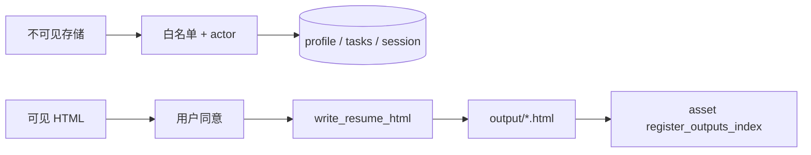

# Profile 写入权限（可见 / 不可见）

| 属性 | 内容 |
|------|------|
| 文档版本 | v0.1 |
| 父文档 | [02-平台服务.md](./02-平台服务.md) |
| 最后更新 | 2026-05-30 |

## 1. 产品原则（V1）

| 类型 | 范围 | 规则 |
|------|------|------|
| **用户可见** | 仅 **`output/**/*.html` 简历正文**（`write_resume_html`） | **用户同意之后** 才生成/覆盖；前置 `optimize_confirmed`、复用 `asset(reuse)` 等闸门 |
| **用户不可见** | `profile.json`、`data/tasks/**`、`data/sessions/**` | **path × actor 白名单**；Harness 校验通过即可写，**不要求每条 patch 再弹确认** |

**`outputs_index` 登记**：对用户不可见；HTML 经闸门落盘后 **自动** `register_outputs_index`，无需二次确认。

## 2. 不可见域：`profile_patch` 白名单

Harness 在 `profile_patch` / `apply_proposed_patches` 执行前校验 **`(path, actor)`**；拒绝则返回 `profile_patch_rejected`。

### 2.1 按 Worker 允许路径（摘要）

| actor | 允许 path 前缀 / 操作 |
|-------|----------------------|
| `identity` | `exploration.*` |
| `capability` | `exploration.*`（复盘）、`resume.experience_bank.*`、`capability.*` |
| `market` | `market.trend_notes[]` append、`market.role_families[]` |
| `opportunity` | `market.opportunity_snapshots[]` append |
| `strategy` | `strategy.*`、`career.*`（不含 `career.jd_override` 直接写，见 gate 后） |
| `resume` | `resume.last_optimization_levels[]` |
| `asset` | **禁止** `profile_patch` 写 exploration；`outputs_index[]` 仅经 **`register_outputs_index` / `delete_output`** |
| `coordinator` | gate 确认后 `career.jd_override[]` append、`apply_proposed_patches`；一般不直接 patch 业务 exploration 字段 |

### 2.2 客观追加（O-P1，即时 patch）

下列 **append-only** 或客观评估字段，Worker 评估完成后 **可直接** `profile_patch`，无需 `proposed_*`：

| path | actor |
|------|-------|
| `market.opportunity_snapshots[]` | `opportunity` |
| `market.trend_notes[]` | `market` |
| `exploration.completed_at` | `identity` / `capability`（gate 确认后） |

### 2.3 禁止（L2）

| 场景 | 行为 |
|------|------|
| `asset` 写 `exploration.*` | Harness 拒绝 |
| Worker 直写 `outputs_index`（绕过 tool） | 拒绝；须 `register_outputs_index` |
| 协调者未 gate 确认写 `career.jd_override[]` | 拒绝 |
| path 不在白名单 | 拒绝 |

### 2.4 `proposed_profile_patches`（可选）

不可见域 **默认** `profile_patch`；`proposed_profile_patches` 仅当协调者需 **批量汇总再 apply** 时使用（非主路径）。同一 path **禁止** 既 proposed 又 tool patch（见 [10 §3](./10-会话闸门与state.md#3-profile-落档双路径-p3)）。

## 3. 可见域：HTML 闸门链

| 步骤 | 闸门 / 条件 | Tool |
|------|-------------|------|
| 优化确认 | `optimize_confirmed=true`（`state.json`） | 才允许 `delegate_worker(resume)` |
| 写盘 | 同上 | `write_resume_html` |
| 登记 | HTML 已存在 | `register_outputs_index`（自动，不可见） |
| 复用（B05） | `asset` `gate_prompt` + 用户确认 | 只读参考历史 HTML，不覆盖 unless 新 Run |

## 4. 并发写（C1）

Harness 对 `profile.json`、`data/tasks/**` 持 **进程内 mutex**；与 [05 §3.5](./05-API与流式协议.md#35-chat-单飞-a1) chat 单飞叠加，避免双 Tab 竞态。

---

*文档结束*
