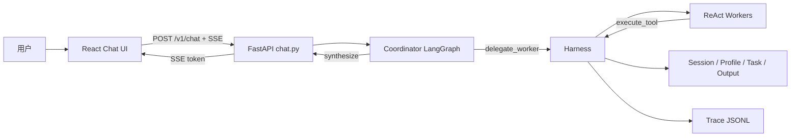

# AI Agent 开发面试项目设计

> 读者定位：这是一份用于 AI Agent 开发技术面试前复习的项目设计文档。它不追求覆盖所有 PRD 细节，而是帮助你把项目讲清楚、讲深入、讲得有代码证据。

## 1. 项目定位

`AI-Optimized-Resume-V2` 是一个面向 IT 职业规划和简历优化的本地优先 Multi-Agent 系统。它不是简单的聊天机器人，而是把用户画像、职业探索、JD 匹配、投递策略、简历生成和产物登记串成一个可追踪的 Agent 工作流。

从架构上看，它采用 `FastAPI + LangGraph Coordinator + ReAct Workers + Harness + 本地状态存储 + Eval`。其中 Coordinator 负责理解用户意图和调度 Worker，Worker 负责领域任务，Harness 负责工具权限、闸门、状态写入、Trace 和执行约束。

面试中可以这样讲：

> 我做的是一个职业规划场景下的垂直 Multi-Agent 系统。它的核心不是让大模型随意聊天，而是用 Coordinator 负责调度，用多个 Worker 执行专业任务，再通过 Harness 把工具权限、状态写入、用户确认闸门和 Trace 收口起来，保证 Agent 行为可控、可追踪、可评测。

代码证据：

- `README.md`（项目定位、技术栈、当前状态）
- `docs/architecture/00-架构总览.md`（一主多从、Python 单体、REST + SSE）
- `backend/career_os/api/chat.py`（聊天接口和 SSE 入口）
- `backend/career_os/agents/graphs/coordinator.py`（Coordinator LangGraph 编排）
- `backend/career_os/harness/executor.py`（Harness 工具权限和执行入口）

## 2. 面试版总览

### 2.1 一句话架构

本项目是一个本地优先的 Python 单体 Agent 应用：前端通过 REST + SSE 进入 FastAPI，后端由 LangGraph Coordinator 编排多个 ReAct Worker，所有工具调用、权限校验、状态写入和审计 Trace 都通过 Harness 收口。

### 2.2 核心架构图



### 2.3 3 分钟项目讲法

这个项目把职业规划和简历优化做成了一个 Agent 系统。用户通过聊天输入简历、职业困惑或 JD，后端先由 Coordinator 判断当前意图和阶段，再按需派发给 identity、capability、market、opportunity、strategy、resume、asset 等 Worker。

Worker 不直接互相调用，也不直接面向用户输出，而是在各自 Run 内通过 ReAct 选择 `load_skill（加载技能包）`、`profile_patch（写入画像）`、`browser_fetch（浏览器检索）`、`write_resume_html（生成简历 HTML）` 等工具。所有工具都必须经过 Harness，Harness 会校验 actor 是否有权限、当前闸门是否通过、Profile 写入路径是否合法，并把关键事件写入 Trace。

这个设计的重点是把 LLM 的不确定性包在工程边界里：LLM 负责理解意图、生成策略和调用工具；Harness 负责权限、流程、状态和审计；Eval 负责验证闸门、派工链、工具白名单、状态写入和端到端链路是否稳定。

## 3. 系统设计问题

### 3.1 为什么需要 Agent，而不是普通 CRUD 或单轮 LLM 调用

问题：

职业规划和简历优化不是一次问答能完成的，它需要多轮收集信息、沉淀用户画像、分析 JD、评估机会、制定策略、生成简历产物，还要在关键步骤让用户确认。

约束：

- 用户输入是不稳定的自然语言，不适合固定表单覆盖全部场景。
- 业务链路有阶段性，例如初探、市场分析、岗位评估、策略确认、简历优化。
- 系统必须保留状态，否则每轮都从零开始，无法形成长期职业画像。
- 简历生成属于用户可见产物，必须经过确认闸门。

设计：

使用 Agent 来承接自然语言决策和工具调用，但不让 Agent 直接拥有所有能力。系统把 Agent 行为拆成 Coordinator 调度、Worker 执行、Harness 校验、Store 持久化、Eval 验证几个层次。

取舍：

Agent 带来了灵活性，但也带来了不可控风险。所以本项目没有把所有逻辑都交给 LLM，而是让 **LLM 做语义判断和内容生成，让 Harness 做确定性规则。**

面试可以这样说：

> 这个场景的难点不是单次生成简历，而是多轮决策和状态沉淀。普通 CRUD 只能处理明确表单，单轮 LLM 又缺少流程控制和工具边界。所以我用 Agent 承接自然语言和工具调用，但用 Harness 固化权限、闸门和状态写入，把 Agent 变成可控的工程系统。

### 3.2 为什么采用一主多从 Multi-Agent，而不是单 Agent

问题：

如果只用一个 Agent，它既要做身份探索，又要做市场分析、JD 匹配、策略制定、简历改写和产物管理，**Prompt 会持续膨胀，工具权限也会混在一起。**

约束：

- 不同任务需要不同 Prompt、Skill 和 Tool。
- 简历 Worker 可以写 HTML，但市场 Worker 不应该写简历文件。
- 资产 Worker 可以登记产物索引，但不应该改写简历正文。
- Worker 之间如果互相调用，会让上下文来源和责任边界变得混乱。

设计：

采用一主多从：

- `coordinator（协调者）`：负责**意图识别、派工、结果合成、闸门话术。**
- `worker（领域智能体）`：负责某个垂直领域的分析或产出。
- Worker 之间不直连，上游结果由 Coordinator 写入 `session_state.prior_results（本会话已完成 Worker 结果摘要）` 后再传给下游 Worker。

取舍：

**一主多从增加了派工和状态管理复杂度，但换来了更清晰的职责隔离、工具权限隔离和故障定位能力。**

代码证据：

- `docs/architecture/01-协调者与Worker.md`：明确“协调者不干活”“Worker 不互通信”“Worker 不直出用户”
- `backend/career_os/platform/worker/registry.py`：`WorkerRegistry（Worker 注册表）` 提供 `get_worker_index（获取 Worker 索引）`
- `backend/career_os/harness/delegate.py`：`delegate_worker（派工 Worker）` 只允许 `coordinator` 调用

面试可以这样说：

> 我把 Agent 切成一主多从，不是为了炫技，而是为了控制上下文、权限和责任边界。Coordinator 像调度层，Worker 像领域服务，Harness 像平台运行时。这样市场分析、机会评估、简历生成的 Prompt 和工具权限都能隔离，出问题也能根据 Trace 定位是哪一层的问题。

### 3.3 为什么引入 Harness，而不是让 LLM 直接调用工具

问题：

LLM 可以决定调用工具，但不能被信任为最终权限判断者。比如 resume Worker 可以写 HTML，但 market Worker 不应该调用 `write_resume_html（写入简历 HTML）`。

约束：

- 工具权限必须确定性校验。
- **Profile 写入必须按 actor 和 path 控制**。
- 简历优化必须等待用户确认。
- JD 链路必须满足前置条件，例如机会评估依赖市场分析结果。
- 关键执行过程必须能审计。

设计：

Harness 作为 Agent Runtime 的控制平面，承担：

- `ToolRegistry（工具注册表）`：登记工具和允许调用的 actor。
- `execute_tool（执行工具）`：所有工具调用统一入口，负责权限校验和 Trace。
- `delegate_worker（派工 Worker）`：校验是否允许派工，并注入 `capability_bundle（能力索引包）`。
- `check_delegate_rules（检查派工规则）`：校验 JD、market、resume 等前置条件。

取舍：

**Harness 会让系统多一层抽象，但它把“模型能做什么”和“系统允许做什么”分开了。这是 Agent 工程化的关键。**

代码证据：

- `backend/career_os/harness/executor.py`
- `backend/career_os/platform/tool/registry.py`
- `backend/career_os/harness/delegate.py`
- `backend/career_os/platform/tool/handlers/profile.py`

面试可以这样说：

> 我没有让 LLM 直接接触文件系统和状态存储，而是把所有工具调用都收口到 Harness。LLM 可以提出 tool call，但 Harness 决定这个 actor 能不能调用、当前阶段能不能调用、写入路径是否合法。这样即使模型判断失误，也不会突破工程边界。

### 3.4 为什么选择本地 Python 单体，而不是一开始拆微服务

问题：

这个项目的主要目标是验证 Agent 工作流、状态管理、工具边界和 Eval，而不是先解决高并发和多团队协作。

约束：

- 面试 Demo 需要容易启动、容易演示、容易追代码证据。
- Agent 运行时、Harness、Store、Trace 在一个进程中更容易调试。
- 当前瓶颈主要是 Agent 行为可靠性，不是服务拆分。

设计：

v0.1 使用 Python 单体承载 API、Harness、Coordinator、Worker、存储和 LLM 调用。前端独立为 React + Vite，但后端不拆 Go、gRPC 或多个服务。

取舍：

单体降低了部署和调试成本，但生产化时需要进一步拆分状态存储、任务执行、Trace 查询和工具执行隔离。

面试可以这样说：

> 我在 v0.1 选择 Python 单体，是因为这个阶段最重要的是把 Agent 工作流和 Harness 边界跑通。微服务会提前引入网络调用、部署和一致性复杂度，但并不能直接提升 Agent 行为可靠性。等状态、Eval 和工具边界稳定后，再拆服务更合理。

## 4. 核心运行链路

主链路只需要记住 8 步：

1. `chat（聊天接口）` 接收用户消息  
   代码入口：`backend/career_os/api/chat.py` 中的 `chat（处理 /v1/chat 请求）`。

2. `SessionStore.get_state（读取会话状态）` 读取 `state.json（会话持久化状态文件）`  
   代码入口：`backend/career_os/platform/store/session.py`。

3. `_apply_pending_gate（处理待确认闸门）` 优先判断用户是否在回复闸门  
   如果当前有 `gates.pending（待确认闸门）`，先进入闸门确认逻辑，而不是直接派工。

4. `run_coordinator_turn（运行协调者单轮）` 构造 LangGraph 初始状态  
   它会注入 `messages（对话历史）`、`session_state（会话运行态）`、`worker_index（Worker 能力索引）` 和 `user_message（用户本轮消息）`。

5. `analyze（分析节点）` 判断本轮是否需要派工  
   如果是闲聊或只聊天，直接进入 `synthesize（合成节点）`；如果需要业务处理，则选择一个或多个 Worker。

6. `delegate（派工节点）` 调用 `harness.delegate_worker（Harness 派工）`  
   Harness 校验 actor、阶段、闸门、JD 前置条件，并注入 `capability_bundle（能力索引包）`。

7. `run_worker_react（运行 ReAct Worker）` 在 Worker 内部循环调用工具  
   Worker 通过 LiteLLM function calling 选择 `load_skill（加载技能）` 或业务工具，工具执行仍走 `Harness.execute_tool（Harness 执行工具）`。

8. `synthesize（合成节点）` 生成用户可见回复，并通过 SSE 输出  
   Worker 的结果不会直接变成前端 token，用户看到的是 Coordinator 统一合成后的回复。

代码证据：

- `backend/career_os/api/chat.py`：`_chat_stream（聊天流处理）`
- `backend/career_os/agents/graphs/coordinator.py`：`analyze（分析节点）`、`delegate（派工节点）`、`synthesize（合成节点）`
- `backend/career_os/agents/graphs/workers/react_runner.py`：`run_worker_react（运行 ReAct Worker）`
- `backend/career_os/harness/executor.py`：`execute_tool（执行工具）`

## 5. Agent 架构设计

### 5.1 Coordinator：调度和合成，不直接干业务

`Coordinator（协调者）` 是用户对话背后的唯一入口。它的职责是：

- `analyze（分析）`：判断用户意图，选择是否派工以及派给哪些 Worker。
- `delegate（派工）`：把任务目标、会话状态、上下文和能力索引交给 Worker。
- `synthesize（合成）`：把 Worker 结构化结果、闸门状态、阶段状态转成用户可见回复。

它不应该直接做 JD 打分、不直接改简历正文、不直接写 HTML 文件。

关键字段说明：

- `messages（对话历史）`：本轮注入 Coordinator 的聊天上下文。
- `messages_meta（对话元信息）`：消息数量、token 估算、上下文使用比例等。
- `session_id（会话 ID）`：当前会话的唯一标识。
- `session_state（会话运行态）`：本轮 Agent 使用的会话状态，来源于 `state.json`。代表这个 session 当前进行到哪一步、有哪些闸门、哪些 Worker 已经执行过、当前任务列表是什么、是否被某些规则阻断。
- `worker_index（Worker 索引）`：所有 Worker 的能力摘要，用于 Coordinator 选人。
- `pending_workers（待派工 Worker 列表）`：本轮还没执行的 Worker 队列。
- `current_worker_id（当前 Worker ID）`：本次 delegate 要执行的 Worker。
- `last_worker_result（最近 Worker 结果）`：用于 synthesize 汇总回复。
- `stop_delegate（停止派工标记）`：遇到闸门、阻断或无需继续时停止派工。
- `delegate_count（派工次数）`：统计本轮已经派工多少次。

代码证据：

- `backend/career_os/agents/state/coordinator.py`：`CoordinatorState（协调者状态结构）`
- `backend/career_os/agents/graphs/coordinator.py`：`build_coordinator_graph（构建协调者图）`

### 5.2 Worker：领域执行，不直接互相通信

Worker 是垂直领域执行单元，每个 Worker 拥有自己的 Prompt、Skill 和 Tool 范围。

主要 Worker：

- `identity（身份智能体）`：处理用户动机、偏好、职业内驱力。
- `capability（能力智能体）`：处理经历库、能力资产、项目证据。
- `market（市场智能体）`：处理岗位市场、趋势和公开信息。
- `opportunity（机会智能体）`：处理 JD 匹配、推荐或不推荐理由。
- `strategy（策略智能体）`：处理投递策略和职业路径。
- `resume（简历智能体）`：处理简历正文和 HTML 生成。
- `asset（资产智能体）`：处理产物索引和文件登记。

Worker 的执行方式：

- `run_worker_react（运行 ReAct Worker）`：使用 LiteLLM 调用模型。
- `get_litellm_tools_for_worker（获取 Worker 可用工具 schema）`：根据 Worker ID 提供工具定义。
- `load_skill（加载技能包）`：Worker 在 Run 内按需加载技能正文。
- `finalize_worker_result（完成 Worker 结果）`：把模型输出整理成结构化结果。

设计重点：

Worker 不互相通信。比如 `opportunity（机会智能体）` 需要 `market（市场智能体）` 的结果，不是直接调用 market，而是由 Coordinator 把 `prior_results.market（市场分析摘要）` 注入下一次派工上下文。

代码证据：

- `backend/career_os/agents/graphs/workers/registry.py`
- `backend/career_os/agents/graphs/workers/react_runner.py`
- `backend/career_os/platform/worker/registry.py`
- `config/workers.registry.json`

### 5.3 Harness：Agent Runtime 控制平面

Harness 是这个项目最值得面试深入讲的部分。它不是简单工具函数集合，而是 Agent Runtime 的控制平面。

Harness 负责：

- 工具注册：哪些工具存在。
- 工具权限：哪个 actor 可以调用哪个工具。
- 派工规则：当前阶段能否派某个 Worker。
- 能力注入：给 Worker 注入 `capability_bundle（能力索引包）`。
- 状态写入：通过 Profile、Session、Task、Output 工具落盘。
- 闸门约束：例如 resume 必须等 `optimize_confirmed（优化确认标记）`。
- Trace：记录 `tool.call（工具调用）`、`agent.run.start（Agent 运行开始）` 等事件。

关键函数说明：

- `Harness.__init__（初始化 Harness）`：创建工具注册表和 TraceWriter。
- `_register_tools（注册工具）`：把 profile、task、skill、resume、asset 等工具注册到 Harness。
- `execute_tool（执行工具）`：统一工具调用入口，校验权限、执行工具、写 Trace。
- `_tool_visible_to_actor（判断工具对 actor 是否可见）`：根据 actor 和工具类型判断能否调用。
- `delegate_worker（派工 Worker）`：把 Worker 派工交给 `harness.delegate` 模块，并返回派工结果或错误。
- `check_delegate_rules（检查派工规则）`：检查 JD 链路、resume 优化确认等规则。

面试可以这样说：

> Harness 的价值是把 Agent 的不确定行为包进确定性运行时。模型可以产生 tool call，但 Harness 会决定这个 tool call 是否允许执行、写入是否合法、当前阶段是否满足前置条件，并把执行过程写入 Trace。所以 Harness 是这个项目的 AgentOps 基础。

## 6. 状态与数据设计

### 6.0 五类核心数据

先从全局看，项目里真正长期有价值的数据不只是一份聊天记录，而是分成五类对象：

| 对象 | 中文含义 | 生命周期 | 作用 |
|------|----------|----------|------|
| `Session（会话工作区）` | 当前会话正在发生什么 | 当前 session 内有效 | 保存 `state.json`、`messages.json`、`artifacts.json` 等会话现场 |
| `Profile（长期档案）` | 用户长期职业事实 | 跨 session 保留 | 保存经历、能力、偏好、策略、简历索引等长期事实 |
| `Task（任务状态机）` | 当前流程走到哪一步 | 绑定当前 session | 保存 `pipeline`、`milestone`、`work` 等任务结构 |
| `Output（交付产物）` | 生成出来的文件 | 跨 session 保留 | 保存 HTML 简历、产物索引等用户可见结果 |
| `Trace（运行审计）` | Agent 运行轨迹 | 按天追加 | 保存派工、工具调用、闸门、错误和耗时，便于排查和 Eval |

面试里可以这样说：

> 我没有把聊天历史直接当成整个系统的记忆，而是把会话现场、长期档案、任务状态、交付产物和运行审计拆开。这样短期流程不会污染长期事实，长期事实又可以跨会话复用。

### 6.1 状态分层

项目里容易混淆的是 `session_state（会话运行态）` 和 `state.json（会话状态文件）`。

| 名称 | 中文含义 | 生命周期 | 作用 |
|------|----------|----------|------|
| `CoordinatorState` | 协调者单轮运行状态 | 单次 LangGraph Run 内 | 给 analyze、delegate、synthesize 节点传递上下文 |
| `session_state` | 会话运行态 | 当前请求内的 dict，来源于 `state.json` | 记录闸门、阶段、派工摘要、当前 list 等会话级信息 |
| `state.json` | 会话状态文件 | 当前 session 持久化 | 请求结束后保存 `session_state`，下一轮继续读取 |
| `messages.json` | 对话历史文件 | 当前 session 持久化 | 保存 user / assistant 消息 |
| `artifacts.json` | 会话产物摘要文件 | 当前 session 持久化 | 保存本会话 market、strategy、resume_outputs 等产物摘要 |
| `profile.json` | 用户长期画像文件 | 跨 session 保留 | 保存用户长期事实、经历、能力、偏好和输出索引 |
| `task tree` | 任务树 | 绑定 session | 保存 pipeline、milestone、work 等任务结构 |
| `trace JSONL` | 结构化运行轨迹 | 按天追加 | 记录工具调用、派工、闸门、延迟和失败原因 |

一句话区分：

> `session_state` 是代码运行时拿在手里的会话状态，`state.json` 是它落盘后的持久化文件。Coordinator 每轮开始读 `state.json`，运行中修改 `session_state`，结束后再写回 `state.json`。

### 6.2 `CoordinatorState` 核心字段

来自 `backend/career_os/agents/state/coordinator.py`：

```python
class CoordinatorState(TypedDict, total=False):
    # 元数据层：描述本轮运行属于哪个会话，以及系统侧有哪些可用能力和上下文统计信息
    session_id: str                             # 会话 ID：当前是哪一个 session
    worker_index: list[dict[str, Any]]          # Worker 索引：当前系统有哪些 Worker 可选
    messages_meta: dict[str, Any]               # 对话元信息：消息数量、token 估算、上下文使用比例
    # 输入层：描述本轮用户输入、历史上下文、附件上下文，以及从 state.json 读入的业务现场
    user_message: str                           # 用户消息：本轮用户输入
    messages: list[dict[str, str]]              # 对话历史：本轮注入 Coordinator 的 user / assistant 消息（本轮可参考的历史消息）
    request_context: dict[str, Any]             # 请求上下文：附件、外部输入等补充信息
    session_state: dict[str, Any]               # 【具体内部结构见 6.3】会话运行态：当前请求内使用和修改的会话状态 【从 state.json 读入的业务现场，既是输入，也会被更新】
    # 中间层：描述 Coordinator 在 analyze / delegate / synthesize 之间临时维护的派工与草稿状态
    pending_workers: list[str]                  # 待派工 Worker：本轮尚未执行的 Worker 队列
    current_worker_id: str | None               # 当前 Worker：当前准备派给哪个 Worker
    stop_delegate: bool                         # 是否停止继续派工：遇到闸门、阻断或无需继续时为 true
    delegate_count: int                         # 派工次数：本轮已经执行的 Worker 数量
    last_worker_result: dict[str, Any] | None   # 最近 Worker 结果：Worker 返回的中间结果，供合成使用
    synthesis_draft: str                        # 合成草稿：临时草稿，可能给 LLM 润色，也可能直接输出
    # 输出层：描述本轮最终面向用户输出的合成结果
    synthesis_text: str                         # 合成文本：Coordinator 生成的用户可见回复
```

#### 6.2.1 `delegate_count（派工次数）`

`delegate_count（派工次数）` 是 Coordinator 单轮运行内的计数器，用来记录当前这一轮 `run_coordinator_turn（运行协调者单轮）` 已经执行过多少次 `delegate（派工节点）`。它不是整个 session 的历史累计次数；每次用户发来新消息，新的 Coordinator Run 都会从 `0` 开始。

它主要有三个作用：

- 区分本轮是否已经派过 Worker：`0` 表示还没有派工，`> 0` 表示至少执行过一个 Worker。
- 判断 pending 队列来源：第一次派工可视为 `preset（预设队列）`，派过一次后继续执行剩余 `pending_workers（待派工 Worker）` 时属于 `queue（队列续派）`。
- 影响回复合成：如果 `delegate_count=0` 且没有 `structured_output（结构化结果）`，`synthesize（合成节点）` 会按普通对话或阶段引导回复；如果 `delegate_count>0`，则更倾向基于 `last_worker_result（最近 Worker 结果）` 合成回复。

一句话理解：

> `delegate_count` 用来告诉 Coordinator：这一轮到底只是普通对话，还是已经进入了 Worker 执行链。

### 6.3 `state.json` 核心字段

`state.json` 由 `SessionStore（会话存储）` 创建和更新。默认字段来自 `backend/career_os/platform/store/session.py` 的 `_DEFAULT_STATE（默认会话状态）`。

```json
{
  // 会话元数据层：说明这个状态文件属于哪个 session，以及最近一次活动时间
  "session_id": "sess_xxx",               // 会话 ID：当前会话唯一标识
  "last_activity_at": "2026-06-10T00:00:00Z", // 最近活动时间：用于会话活动记录

  // 任务流程层：说明当前会话绑定哪条任务流程，以及 pipeline 走到哪一阶段
  "list_id": "list_xxx",                  // 当前任务列表 ID：绑定 task tree 【目前是固定的 5 个阶段】
  "list_type": "pipeline",                // 当前任务列表类型：当前主路径为 pipeline；plan 仍允许；explore / jd 已废弃
  "pipeline_phase": "market",             // 当前 pipeline 阶段：用于阶段推进和跳转

  // 对话上下文层：说明当前对话历史的上下文使用情况；真正消息内容在 messages.json
  "messages_meta": {},                    // 对话元信息：消息数量、token 使用比例等

  // Worker 结果层：保存本 session 内前置 Worker 的结构化摘要，供后续 Worker 或 Coordinator 参考
  "prior_results": {},                    // 已完成 Worker 结果摘要：供后续 Worker 和 Coordinator 使用

  // 闸门与阻断层：说明当前是否等待用户确认、是否需要澄清、是否被 JD 前置条件阻断
  "gates": {                              // 闸门状态：记录待确认问题和已确认标记
    "pending": null,                      // 待确认闸门：当前正在等待用户确认的问题
    "flags": {}                           // 闸门标记：例如 optimize_confirmed
  },
  "gate_clarify_pending": false,          // 闸门澄清标记：用户回复不清楚时要求补充说明
  "chat_only_requested": false,           // 只聊天标记：用户希望暂时不推进流程
  "jd_prerequisite_blocked": false,       // JD 前置阻断标记：缺少必要信息时阻止继续 JD 链路
  "jd_block_reason": "",                  // JD 阻断原因：给 Coordinator 生成自然语言解释
  "jd_override": [],                      // JD 覆盖记录：用户确认后继续不推荐 JD 的记录

  // 初探专项状态层：记录职业初探是否收束、是否阻断、是否需要展示延迟引导选项
  "explore_closure": null,                // 初探收束状态：记录 identity / capability 是否完成
  "explore_intake_blocked": false,        // 初探表单阻断标记：需要先完成初探输入
  "explore_repeat_blocked": false,        // 重复初探阻断标记：已有初探信息时需要用户确认是否重做
  "explore_guidance": {}                  // 初探引导状态：记录已展示的引导选项
}
```

#### 6.3.1  list_id 详细解释

```text
任务的分层：
list_id = list_xxx
└── milestone: ms_explore（职业初探）
    └── work: work_explore_plan（初探阶段子任务）
└── milestone: ms_market（市场分析）
└── milestone: ms_jd（JD 分析）
└── milestone: ms_strategy（简历优化策略）
└── milestone: ms_resume（简历优化）
```

#### 6.3.2  list_type 详细解释

`list_type（任务列表类型）` 需要特别注意：当前代码里有效主类型不是 `explore` 或 `jd`，而是统一收敛到 `pipeline（固定主流程）`，再用 `pipeline_phase（pipeline 当前阶段）` 表示具体走到哪一步。

| `list_type` 取值 | 当前状态 | 含义 |
|------|------|------|
| `pipeline` | 主路径 | 固定五阶段主流程，阶段由 `pipeline_phase` 表示 |
| `plan` | 仍允许 | 纯职业规划流程，不一定进入 JD 分析或简历生成 |
| `null` | 非任务状态 | 闲聊、问候或暂不进入任务流程时可能出现 |
| `explore` | 已废弃 | 历史类型；现在用 `pipeline + pipeline_phase=explore` 表示初探 |
| `jd` | 已废弃 | 历史类型；现在用 `pipeline + pipeline_phase=market / jd_analysis` 表示 JD 链路 |

#### 6.3.3  explore_guidance 详细解释

`explore_guidance（初探引导状态）` 用于在职业初探阶段保存“可延迟展示的参考选项”。它的设计目的不是立刻给用户 A/B/C 选项，而是先让用户自由表达；只有当用户说“给我一些选项”“我不知道怎么答”“有哪些方向”时，系统才把这些参考方向展示出来，避免一开始就诱导用户。

典型结构如下：

```json
{
  "explore_guidance": {
    "worker_id": "identity",             // 来源 Worker：哪个 Worker 生成了这组引导选项
    "question": "一年只允许你解决一件职业相关的事，你会选什么？", // 原始问题：当前正在追问用户的开放问题
    "options": [                         // 引导选项：用户需要帮助时才展示的参考方向
      {
        "id": "A",                       // 选项 ID：展示给用户看的序号
        "label": "技术深度",              // 选项标题：参考方向名称
        "hint": "做深 Go 基础设施"        // 选项提示：帮助用户理解该方向的解释
      },
      {
        "id": "B",                       // 选项 ID：展示给用户看的序号
        "label": "带团队",                // 选项标题：参考方向名称
        "hint": "向 Tech Lead 过渡"       // 选项提示：帮助用户理解该方向的解释
      }
    ],
    "revealed": false                    // 是否已展示：false 表示暂时隐藏，true 表示已经展示给用户
  }
}
```

执行过程：

1. `persist_worker_guidance（保存 Worker 引导选项）`：当 `identity（身份 Worker）` 或 `capability（能力 Worker）` 输出 `guidance_options（引导选项）` 时，写入 `session_state.explore_guidance`。
2. `build_explore_guidance_synthesis_draft（构造初探引导回复草稿）`：Coordinator 先只展示开放问题，并提示用户“如果没画面，可以说给我一些选项”。
3. `should_reveal_explore_guidance（判断是否展示初探引导选项）`：当用户表达需要选项时，判断是否应该展示。
4. `mark_explore_guidance_revealed（标记引导选项已展示）`：把 `revealed（是否已展示）` 改为 `true`，并设置 `explore_guidance_reveal_pending（初探引导待展示标记）`。
5. `format_revealed_options（格式化已展示选项）`：把隐藏的 A/B/C 参考方向组织成用户可读回复。

一句话理解：

> `explore_guidance` 是初探阶段的“延迟展示选项状态”，用于先鼓励用户自由表达，只有在用户需要帮助时才展示参考方向。

说明：不是每个字段都会在新 session 初始出现，有些字段是在运行中按需写入。面试时不需要背完整 JSON，只要说清楚它保存“会话内流程状态、闸门状态、Worker 摘要、任务列表绑定和上下文元信息”。

相关代码证据：

- `TaskStore._DEPRECATED_LIST_TYPES（废弃任务列表类型集合）`：包含 `explore` 和 `jd`，创建时会返回 `list_type_deprecated（任务类型已废弃）`。
- `instantiate_pipeline_for_session（为会话实例化 pipeline）`：创建 `list_type=pipeline`，并初始化 `current_phase=explore`。
- `pipeline_milestones.json（pipeline 里程碑配置）`：定义 `explore`、`market`、`jd_analysis`、`resume_strategy`、`resume_optimize` 五个固定阶段。

### 6.4 长期画像 `profile.json`

`profile.json（用户长期画像文件）` 跨 session 保留，保存用户基础信息、意向、探索结果、能力资产、市场记录、策略记录、简历经历库和产物索引。

关键结构来自 `ProfileStore.EMPTY_PROFILE（空画像结构）`：

- `basic（基础信息）`：用户基本资料。
- `skills（技能信息）`：主要技能和熟练度描述。
- `intent（求职意向）`：目标方向、岗位偏好等。
- `constraints（约束条件）`：城市、薪资、行业限制等。
- `exploration（职业探索）`：内驱力、问题、总结、初探表单。
- `career（职业规划）`：当前评估、下一跳、长期路径、JD 覆盖。
- `capability（能力资产）`：技能图谱、迁移路径、证据缺口。
- `market（市场信息）`：岗位族、趋势、机会快照。
- `strategy（策略信息）`：路径选项、已选策略、风险说明。
- `resume（简历信息）`：源简历路径、优化档位、经历库。
- `outputs_index（产物索引）`：HTML 简历等输出产物索引。

设计重点：

`profile.json` 是长期事实，不是临时对话缓存。临时闸门和本轮派工状态放 `state.json`，跨会话仍要保留的用户事实才写入 `profile.json`。

#### 6.4.1 为什么不把全量聊天历史当长期记忆

全量聊天历史适合作为“短期上下文”，但不适合作为长期记忆，原因是：

- 对话里有探索、犹豫、误解和临时想法，不一定都是确认后的事实。
- 随着会话变长，直接塞全量历史会带来明显 token 成本。
- 后续简历生成需要可追溯事实，不能只依赖临时聊天片段。
- Worker 只需要当前阶段相关材料，读取全量历史反而会引入噪声。

所以项目采用分层记忆：

- `messages.json（对话历史文件）`：保存完整聊天记录，供短期上下文裁剪使用。
- `messages_meta（对话元信息）`：记录上下文使用比例、消息数量等。
- `session_state.prior_results（已完成 Worker 结果摘要）`：保存本 session 内前序 Worker 的结构化摘要。
- `profile.json（用户长期画像文件）`：保存跨 session 复用的确认事实。

面试里可以这样说：

> 聊天历史不是长期记忆本身，它只是原始材料。真正能被后续流程稳定复用的，应该是经过结构化和确认后的 Profile、Worker 摘要和产物索引。

### 6.5 `WorkerState` 核心字段

`WorkerState（Worker 状态）` 定义在 `backend/career_os/agents/state/worker.py`，用于描述单个 Worker 在一次 ReAct 运行中的状态。

```python
class WorkerState(TypedDict, total=False):
    # 身份与目标层：说明当前是哪个 Worker，在执行什么任务
    worker_id: str                         # Worker ID：当前领域 Worker 的标识，例如 identity / resume / asset
    goal: str                              # 任务目标：Coordinator 派给 Worker 的本轮目标

    # 输入上下文层：说明 Worker 执行时可参考哪些会话、档案、前序结果和能力材料
    context: dict[str, Any]                # 上下文：Coordinator 和 Harness 注入的聊天历史、Profile 片段、前序结果、能力索引
    session_state: dict[str, Any]          # 会话状态：当前 Worker 可读取的会话现场，例如 phase、gate、prior_results

    # ReAct 过程层：说明 Worker 与模型、工具交互过程中的临时状态
    messages: list[dict[str, Any]]         # 模型消息：Worker 与 LLM 的 system / user / assistant / tool 消息列表
    iteration: int                         # 当前迭代次数：ReAct 循环当前执行到第几轮
    max_iterations: int                    # 最大迭代次数：防止 Worker 无限 tool call

    # 结果输出层：说明 Worker 最终交付给 Coordinator 的结构化结果
    structured_output: dict[str, Any]      # 结构化输出：Worker 最终返回给 Coordinator 的 JSON 结果

    # 状态与异常层：说明 Worker 当前执行状态和失败原因
    status: str                            # 运行状态：running / completed / failed 等
    error: str | None                      # 错误信息：Worker 失败时的原因
```

`WorkerState` 和 `CoordinatorState` 的区别是：

- `CoordinatorState（协调者状态）` 描述一轮用户消息如何被分析、派工和合成。
- `WorkerState（Worker 状态）` 描述某个 Worker 被派工后，如何在 ReAct 循环里调工具、接收工具结果并输出结构化 JSON。

一句话理解：

> `CoordinatorState` 管“这一轮怎么编排”，`WorkerState` 管“某个 Worker 具体怎么执行”。

## 7. 闸门与安全边界设计

### 7.1 闸门分层机制

项目里的闸门不是单纯靠 Prompt 要求模型“记得确认”，而是分层实现：

1. 硬规则优先  
   `match_gate_intent_rules（匹配闸门意图硬规则）` 先用正则和固定模式判断用户是否确认或拒绝。

2. 轻量分类兜底  
   如果硬规则没有明确命中，且当前确实存在 `pending_gate（待确认闸门）`，再调用 `classify_gate_intent_llm（LLM 闸门意图分类）` 做轻量判断。

3. 协调者补充自然语言说明【无法确认，协调给明确选择让用户确认】  
   如果仍无法确定，`_apply_pending_gate（处理待确认闸门）` 会设置 `gate_clarify_pending（闸门澄清标记）`，再由 `synthesize（合成节点）` 调用 `build_gate_clarify_text（构造闸门澄清文本）` 让用户明确选择。

代码证据：

- `backend/career_os/harness/gate.py`
- `backend/career_os/harness/gate_rules.py`
- `backend/career_os/api/chat.py`
- `backend/career_os/agents/graphs/coordinator.py`

### 7.2 一个面试可讲的例子

场景：系统已经问用户“是否确认按该 JD 优化简历？”，此时 `state.json` 中存在：

```json
{
  "gates": {
    "pending": {
      "name": "optimize_confirm",
      "prompt": "是否确认开始按策略优化简历？"
    },
    "flags": {
      "optimize_confirmed": false
    }
  }
}
```

用户回复：“可以，开始吧。”

执行过程：

1. `chat.py` 中 `_apply_pending_gate（处理待确认闸门）` 先发现 `gates.pending（待确认闸门）` 存在。
2. 调用 `match_gate_intent（匹配闸门意图）`。
3. `match_gate_intent_rules（硬规则匹配）` 先尝试匹配固定确认/拒绝表达。
4. 如果表达不够明确，再进入 `classify_gate_intent_llm（LLM 分类）`。
5. 如果结果是 confirm，系统设置 `flags.optimize_confirmed（优化确认标记） = true`。
6. `advance_current_phase（推进当前阶段）` 尝试把 pipeline 推进到 `resume_optimize（简历优化阶段）`。
7. 返回 `["resume", "asset"]`，表示后续可以派简历 Worker 和资产 Worker。
8. 如果用户回复含糊，比如“再看看”，系统不清空 pending，而是设置 `gate_clarify_pending（闸门澄清标记）`，让 Coordinator 追问。

这个例子的价值：

- 确认不是直接靠模型生成一句话。
- 真正改变流程的是 `state.json.gates.flags.optimize_confirmed（优化确认标记）`。
- resume Worker 是否能执行，还会被 `check_delegate_rules（检查派工规则）` 再校验一次。

面试可以这样说：

> 闸门我做成了双保险。第一层是用户回复解析，把确认意图写成 state 里的 flag；第二层是 Harness 派工校验，即使 Coordinator 错派 resume，`check_delegate_rules` 也会因为没有 `optimize_confirmed` 返回 `gate_blocked`，从而阻止简历生成。

### 7.3 工具权限边界

工具权限由 `ToolRegistry（工具注册表）` 和 `Harness.execute_tool（执行工具）` 控制。

关键权限：

- `coordinator（协调者）`：可以派工、管理任务、读取 profile、应用确认后的 patch。
- `resume（简历 Worker）`：可以 `write_resume_html（写入简历 HTML）`。
- `asset（资产 Worker）`：可以 `register_outputs_index（登记产物索引）`。
- `market（市场 Worker）` 和 `opportunity（机会 Worker）`：可以 `browser_fetch（浏览器检索）`。
- 所有业务 Worker：可以按白名单调用 `profile_patch（写入用户画像）`。

如果 actor 调用不属于自己的工具，`execute_tool（执行工具）` 返回 `tool_not_allowed（工具不允许）`。

#### 7.3.1 `ToolRegistry（工具注册表）` 的作用

`ToolRegistry（工具注册表）` 定义在 `backend/career_os/platform/tool/registry.py`。它不是普通函数列表，而是带权限约束的工具注册中心。

它记录三类信息：

- `name（工具名称）`：例如 `profile_patch`、`write_resume_html`、`browser_fetch`。
- `actors（可调用者集合）`：哪些 actor 可以调用这个工具。
- `handler（处理函数）`：真正执行工具逻辑的 Python 函数。

核心函数：

- `register（注册工具）`：把工具名称、处理函数和可调用 actor 写入注册表。
- `is_allowed（判断是否允许）`：判断某个 actor 是否可以调用某个工具。
- `execute（执行工具）`：执行工具前再次检查 actor 权限，不允许则抛出权限错误。

面试里可以这样说：

> `ToolRegistry` 类似带权限表的服务注册中心。LLM 可能产生 tool call，但能不能执行，最终要看 ToolRegistry 和 Harness 的确定性权限校验。

#### 7.3.2 Tool Calling 从 LLM 到 Harness 的执行链路

Worker 侧的 Tool Calling 不是“模型直接执行工具”，而是一个受控链路：

1. `run_worker_react（运行 Worker ReAct 循环）` 构造 Worker 的 system prompt 和 user prompt。
2. `get_litellm_tools_for_worker（获取 Worker 可见工具）` 根据 `worker_id（Worker ID）` 生成当前 Worker 可用的 tool schema。
3. LiteLLM 调用模型，模型返回 `tool_calls（工具调用请求）`。
4. Worker runner 解析 `tool_name（工具名称）` 和参数。
5. Worker runner 调用 `harness.execute_tool（Harness 执行工具）`。
6. Harness 检查 actor 与 tool 权限，通过后执行真实工具。
7. 工具结果以 `role=tool（工具消息）` 回填到 Worker 的 `messages（模型消息）`。
8. 模型继续推理，直到输出合法 JSON。
9. `finalize_worker_result（收束 Worker 结果）` 把模型 JSON 规范化为 WorkerResult。

这条链路的关键点是：

> 模型只能“提出”工具调用，Harness 才决定这个工具调用能不能真正执行。

### 7.4 Profile 写入白名单

`profile_patch（写入画像）` 不是任意写。它会按 actor 和 path 做白名单检查。

例子：

- `identity（身份 Worker）` 只能写 `exploration.*（职业探索字段）`。
- `capability（能力 Worker）` 可以写 `resume.experience_bank.*（简历经历库）` 和 `capability.*（能力资产）`。
- `resume（简历 Worker）` 只能写 `resume.last_optimization_levels（最近优化档位）`。
- `asset（资产 Worker）` 不能直接写 `exploration.*（职业探索字段）`。

代码证据：

- `backend/career_os/platform/tool/handlers/profile.py`
- `docs/architecture/13-Profile-写入权限.md`

## 8. Eval 与可观测性设计

### 8.1 Eval 测什么

这个项目的 Eval 不是只测“回答像不像人”，而是测 Agent 长流程是否遵守工程契约。

核心验证对象：

- 闸门：用户确认、拒绝、未知回复是否正确处理。
- 派工链：Coordinator 是否按顺序派 Worker，遇到 gate 是否停止。
- 工具权限：不允许的 actor 是否会被 Harness 拒绝。
- 状态写入：`state.json（会话状态）`、`profile.json（用户画像）`、`artifacts.json（会话产物）` 是否按预期变化。
- 产物生成：HTML 文件和产物索引是否符合规则。
- 降级行为：LLM 或 browser tool 失败时是否能返回可解释结果。

### 8.2 L1 / L2 / L3 思路

| 层级 | 中文含义 | 主要验证 |
|------|----------|----------|
| L1 Component | 组件级确定性测试 | gate 规则、工具白名单、store、schema、profile path |
| L2 Trajectory | 轨迹级测试 | Coordinator 派工顺序、C3 gate 停链、Worker 选型 |
| L3 E2E | 端到端测试 | 多轮 chat 到 profile、HTML、闸门、Trace 的完整链路 |

面试可以这样说：

> 我没有把 Eval 只理解成“模型回答质量评估”。这个项目的 Eval 更像 Agent 系统的契约测试：验证它有没有按阶段派工、有没有越权调用工具、有没有绕过用户确认、有没有正确写状态和 Trace。模型文案可以有波动，但工程契约必须稳定。

### 8.3 Trace 如何帮助定位问题

Trace 由 `TraceWriter（轨迹写入器）` 写入 JSONL 文件。关键事件包括：

- `coordinator.analyze（协调者分析事件）`：记录本轮分析来源和选择的 Worker。
- `agent.run.start（Agent 运行开始）`：记录 Worker Run 开始。
- `agent.run.end（Agent 运行结束）`：记录 Worker Run 成功或失败。
- `tool.call（工具调用）`：记录 actor、tool_name、status、latency_ms。
- `gate.rule_hit（闸门规则命中）`：记录硬规则命中的 gate 和 intent。
- `gate.llm_classify（闸门 LLM 分类）`：记录 LLM 分类结果和置信度。

每一行 Trace 都是一条 JSONL 事件，字段结构来自 `TraceWriter.emit（写入 Trace 事件）`：

```json
{
  "ts": "2026-06-10T12:00:00.000000+00:00", // 事件时间：UTC ISO 时间
  "event": "tool.call",                     // 事件类型：例如 tool.call / coordinator.analyze / gate.rule_hit
  "run_id": "run_ab12cd34ef56",             // 运行 ID：单次 Trace 事件所属的运行链路标识
  "session_id": "sess_xxx",                 // 会话 ID：用于把 Trace 归属到某个用户会话
  "worker_id": "resume",                    // Worker ID：当前事件关联的 Worker，可为空
  "tool_name": "write_resume_html",         // 工具名称：当前调用的 Harness Tool，可为空
  "actor": "resume",                        // 执行者：发起事件或工具调用的角色
  "status": "ok",                           // 执行状态：ok / error / failed 等
  "latency_ms": 42,                         // 耗时毫秒：用于定位慢调用，可为空
  "detail": {                               // 事件详情：不同事件放不同结构化补充信息
    "code": "tool_not_allowed",             // 错误码：失败时用于定位原因，可选
    "message": "resume cannot use browser_fetch", // 错误信息：失败时的说明，可选
    "source": "rule",                       // 来源：例如 rule / llm / fallback / queue，可选
    "workers": ["market", "opportunity"],   // 派工队列：coordinator.analyze 常用，可选
    "gate_name": "optimize_confirm",        // 闸门名称：gate 事件常用，可选
    "intent": "confirm"                     // 闸门意图：confirm / reject / unknown，可选
  },
  "_zh": {                                  // 中文备注：annotate_trace_record 追加，保留原英文字段供程序解析
    "summary": "工具调用 · 简历智能体 · 写入简历 HTML · 成功 · 42ms"
  }
}
```

字段可以按三层理解：

- 基础归属字段：`ts（事件时间）`、`event（事件类型）`、`run_id（运行 ID）`、`session_id（会话 ID）`。
- 执行主体字段：`worker_id（Worker ID）`、`tool_name（工具名称）`、`actor（执行者）`。
- 诊断字段：`status（执行状态）`、`latency_ms（耗时毫秒）`、`detail（事件详情）`、`_zh.summary（中文摘要）`。

定位问题时可以这样拆：

- 没派对 Worker：看 `coordinator.analyze（协调者分析事件）`。
- Worker 被拒绝：看 `agent.run.end（Agent 运行结束）` 中的 error code。
- 工具越权：看 `tool.call（工具调用）` 是否返回 error。
- 闸门误判：看 `gate.rule_hit（规则命中）` 或 `gate.llm_classify（LLM 分类）`。

代码证据：

- `backend/career_os/platform/trace/writer.py`
- `backend/career_os/harness/executor.py`
- `backend/career_os/harness/gate.py`
- `docs/architecture/12-评测与可观测.md`

### 8.4 异常与降级

Agent 系统的工程化不只看正常链路，也要看失败后是否能被结构化处理、可解释返回、可追踪定位。

当前项目里比较重要的异常和降级包括：

| 场景 | 处理方式 | 价值 |
|------|----------|------|
| `LLM_API_KEY（LLM API Key）` 未配置 | Worker runner 返回 failed result | 无 Key 环境下不会伪装成真实推理 |
| LiteLLM 调用失败 | 返回结构化错误，例如 `LiteLLM completion failed` | 避免异常散落到调用栈 |
| Worker 未输出合法 JSON | 返回 `No valid JSON object found in worker response` | 强制 Worker 结果结构化 |
| ReAct 超过最大迭代次数 | 返回 `Reached max iterations` | 防止工具调用无限循环 |
| 工具越权 | Harness 返回 `tool_not_allowed` | 防止模型越权调用工具 |
| JD 前置条件不足 | delegate 层返回 `delegate_blocked` 或 JD-B1 原因 | 阻止未建档、未初探时硬进 JD 链路 |
| 简历优化未确认 | delegate 层返回 `gate_blocked` | 防止未确认就生成用户可见 HTML |

这些错误不应该被简单吞掉，而应该进入两条链路：

- 对用户：Coordinator 在 `synthesize（合成节点）` 中转成自然语言解释和下一步建议。
- 对工程：Trace 记录 `event（事件类型）`、`status（执行状态）`、`detail.code（错误码）` 和 `detail.message（错误信息）`，方便回放和定位。

面试里可以这样说：

> 我会把 Agent 的失败也当成系统契约的一部分。模型失败、工具越权、前置条件不满足，都应该结构化返回并进入 Trace，而不是让异常散落在 Worker 内部。

## 9. 技术选型与取舍

### 9.1 FastAPI + SSE

选择原因：

- FastAPI 适合快速搭建 Python Web API。
- SSE 适合聊天场景的逐 token 输出。
- 项目只需要服务端向客户端流式推送，不需要 WebSocket 的双向长连接复杂度。

代码证据：

- `backend/career_os/api/chat.py` 使用 `StreamingResponse（流式响应）`
- `backend/career_os/runtime/sse.py` 提供 SSE 格式化和 token 流输出

### 9.2 LangGraph

选择原因：

- Coordinator 本质是状态机：分析、派工、合成、结束。
- LangGraph 的 `StateGraph（状态图）` 可以显式表达节点和边。
- 比单纯 chain 更适合多步 Agent 编排和条件路由。

代码证据：

- `build_coordinator_graph（构建协调者图）` 中创建 `StateGraph(CoordinatorState)`
- 节点包括 `analyze（分析）`、`delegate（派工）`、`synthesize（合成）`

### 9.3 ReAct Worker + LiteLLM

选择原因：

- Worker 需要在 Run 内根据情况选择 skill 和 tool。
- ReAct 适合“思考 -> 调工具 -> 观察结果 -> 再决策”的循环。
- LiteLLM 让模型提供商适配集中到一层，方便切换模型。

代码证据：

- `backend/career_os/agents/graphs/workers/react_runner.py`
- `backend/career_os/agents/lc/providers.py`
- `backend/career_os/agents/lc/models.py`

### 9.4 本地 JSON / 文件存储

选择原因：

- 面试 Demo 阶段便于观察、调试和解释。
- `state.json（会话状态）`、`profile.json（长期画像）`、`messages.json（对话历史）` 都可以直接打开查看。
- Trace JSONL 也方便用 `rg（ripgrep 搜索工具）` 排查。

取舍：

本地文件不适合高并发和多人协作，后续需要演进到数据库和更完善的锁机制。

### 9.5 Harness

选择原因：

Harness 是为了把 Agent 能力产品化。它把工具、Skill、权限、闸门、Trace、Profile 写入统一到一个运行时边界里，让模型能力提升时系统也能复用这层控制面。

取舍：

Harness 会增加架构复杂度，但这是从“能跑的 Agent Demo”升级到“可控的 Agent 系统”的关键。

### 9.6 从 Go 后端视角理解 Agent 项目

如果用 Go 后端工程视角理解这个项目，可以这样类比：

| Python / Agent 概念 | Go 后端类比 | 在本项目中的意义 |
|------|------|------|
| `TypedDict（类型字典）` | 轻量 struct 字段约束 | 描述状态对象有哪些字段，但运行时比 Go struct 更宽松 |
| `StateGraph（状态图）` | 有限状态机 / 工作流引擎 | 把一次用户消息拆成 analyze、delegate、synthesize 等节点 |
| `ToolRegistry（工具注册表）` | 服务注册中心 + 权限表 | 记录哪个 actor 可以调用哪个工具 |
| `Harness（运行时控制平面）` | 平台层 / 中间件控制面 | 统一处理工具、权限、任务、闸门、存储和 Trace |
| `profile_patch（画像补丁）` | 受控 repository update | Worker 只能按白名单提交结构化写入 |
| `TraceWriter（轨迹写入器）` | 结构化日志 writer | 把关键运行事件写成 JSONL，方便排查和 Eval |

面试里可以这样说：

> 我会把 LangGraph 看成状态机，把 ToolRegistry 看成服务注册和权限表，把 Harness 看成运行时控制平面。这样讲，比单纯说“用了 Agent 框架”更能体现工程边界。

## 10. 后续演进方向

### 10.1 状态存储演进

当前：

- 使用本地 JSON 文件保存 session、profile、task、trace。
- 优点是透明、易调试、适合 Demo。

后续：

- `state.json（会话状态文件）` 和 `messages.json（对话历史文件）` 可迁移到 SQLite 或 Postgres。
- `profile.json（用户画像文件）` 可拆成结构化表，支持版本、审计和回滚。
- `trace JSONL（运行轨迹文件）` 可进入 ClickHouse、OpenSearch 或专用 Trace Store。

面试表达：

> v0.1 我刻意选择本地文件，是为了验证 Agent 边界和便于演示；生产化时我会优先把 session、profile、task 和 trace 分别迁移到数据库和可观测系统。

### 10.2 Harness 演进

当前：

- Harness 已经负责工具权限、派工规则、闸门、Trace 和能力索引。

后续：

- 抽象成更通用的 Agent Runtime。
- 支持 tool policy 配置化，不把所有规则写死在 Python 代码里。
- 增加 tool sandbox 和外部服务权限隔离。
- 增加失败重试、超时、熔断和补偿机制。

### 10.3 Eval 演进

当前：

- 已有 L1、L2、L3 的测试思路和相关测试文件。
- 重点验证工程契约。

后续：

- 建立 `cases.yaml（评测用例集）`，把测试数据和测试逻辑分离。
- 引入 LLM-as-judge 评估简历质量，但不替代硬断言。
- 对每条 Agent 轨迹做 replay，复现派工和工具调用链。
- 建立每次变更后的评测报告，记录通过率和失败类型。

### 10.4 Worker 能力演进

当前：

- Worker 能力由 `workers.registry.json（Worker 注册表）` 和 Skill 包声明。

后续：

- Worker 从固定注册演进到动态能力发现。
- Skill 增加版本、依赖、适用场景和质量评估。
- Worker 可以根据任务复杂度选择不同模型和不同工具预算。

### 10.5 Trace / AgentOps 演进

当前：

- Trace 写入 JSONL，便于搜索和测试断言。

后续：

- 做 Trace 可视化面板，展示用户消息、Coordinator 分析、Worker 派工、工具调用、闸门、状态写入。
- 支持按 `session_id（会话 ID）`、`run_id（运行 ID）`、`worker_id（Worker ID）` 查询。
- 自动归因失败原因，例如 tool_not_allowed、gate_blocked、delegate_blocked、LLM timeout。

### 10.6 外部工具演进

当前：

- `browser_fetch（浏览器检索工具）` 主要服务 market 和 opportunity。
- 失败时 Worker 可以降级继续。

后续：

- 增加可配置的外部工具权限模型。
- 对外部检索结果做来源、时间、可信度标记。
- 引入缓存和去重，避免重复检索。
- 对用户隐私数据做脱敏后再进入外部工具。

## 11. 面试追问准备

### 11.1 为什么不是单 Agent

答法：

> 单 Agent 在早期实现简单，但 Prompt、工具和状态会混在一起。这个项目涉及身份探索、市场分析、机会评估、策略制定、简历生成和产物管理，不同任务的工具权限完全不同。所以我拆成 Coordinator + 多 Worker，既能隔离上下文，也能隔离工具权限。

### 11.2 为什么需要 Harness

答法：

> Harness 是为了把 LLM 的不确定性变成可控的工程行为。LLM 负责提出工具调用和生成内容，但 Harness 负责最终校验：谁能调用什么工具、当前阶段能不能执行、写入路径是否合法、是否需要用户确认、Trace 是否记录。

### 11.3 如何防止 LLM 乱调工具

答法：

> 第一层是工具 schema 只把当前 Worker 可用工具暴露给模型；第二层是 Harness 的 `execute_tool` 做 actor 权限校验；第三层是具体工具内部做 path、phase、gate 等校验。即使模型构造出不该调用的工具，Harness 也会返回 `tool_not_allowed` 或业务错误。

### 11.4 State 和 Memory 怎么设计

答法：

> 我把状态分成短期会话状态和长期用户画像。`session_state` / `state.json` 保存当前会话的阶段、闸门、派工摘要和任务绑定；`profile.json` 保存跨会话的长期事实，例如能力、经历、偏好、市场记录和产物索引。这样既能支持多轮 Agent 流程，又不会把临时状态污染到长期画像里。

### 11.5 Eval 怎么证明系统可靠

答法：

> 我不会只测模型回答是否好听，而是测 Agent 契约是否稳定。比如 gate 是否正确确认、resume 是否必须经过 optimize_confirmed、market 和 opportunity 是否按顺序、非法工具是否被拒绝、profile 是否按白名单写入、Trace 是否能还原执行链路。这些比逐字文案更能说明 Agent 系统可靠。

### 11.6 如果重构为生产系统会怎么做

答法：

> 我会先保留 Coordinator、Worker、Harness 的边界，然后把本地 JSON 存储迁移到数据库，把 Trace 接入可观测平台，把 Harness 规则配置化，再把外部工具调用做沙箱、超时、重试和权限隔离。等这些边界稳定后，再考虑把 Worker 执行拆成异步任务或独立服务。

### 11.7 这个项目里 LangGraph 的核心价值是什么

答法：

> 当前 LangGraph 的核心价值不是堆复杂多图，而是把 Coordinator 的单轮运行变成清晰状态机：先 `analyze` 判断意图和阶段，再 `delegate` 通过 Harness 受控派工，最后 `synthesize` 合成用户可见回复。条件边控制是否继续派工或收束，这让 Agent 行为更容易解释和测试。

### 11.8 如果面试官质疑这是 Demo，不是工程系统，怎么回答

答法：

> 我会承认它是本地优先的 v0.1 项目，不是生产级 SaaS，但它不是只靠 Prompt 的 Demo。它已经把 Agent 工程里最容易失控的部分抽出来了：状态机、工具权限、Profile 写入边界、Gate/HITL、HTML 产物、Trace 和 Eval。它的价值不是规模，而是把长流程 Agent 如何可控落地讲清楚。

## 12. 复习路线

建议按这个顺序复习：

1. 先背熟第 1 到第 4 节：项目定位、架构总览、系统设计问题、核心链路。
2. 再理解第 5 到第 7 节：Coordinator / Worker / Harness、状态分层、闸门和权限。
3. 最后准备第 8 到第 11 节：Eval、Trace、技术选型、后续演进和追问回答。

如果面试官只给你 3 分钟，就讲：

> 这是一个职业规划和简历优化的 Multi-Agent 系统，采用 FastAPI + LangGraph + ReAct Workers。Coordinator 负责意图识别、派工和用户可见回复；Worker 负责领域任务；Harness 负责工具权限、闸门、状态写入和 Trace。系统用 session_state 管短期会话状态，用 profile 管长期用户画像，用 Eval 验证闸门、派工、工具权限和端到端链路。

如果面试官继续追问，就展开：

- 为什么一主多从
- Harness 如何防止越权
- State 和 Memory 如何分层
- Gate 如何从硬规则到 LLM fallback
- Eval 如何验证 Agent 长流程
- 生产化如何演进

### 12.1 建议阅读代码顺序

如果要从代码层面复习，建议按这个顺序看：

1. 先看架构入口
   - `docs/architecture/00-架构总览.md（架构总览文档）`：理解一主多从、Python 单体、REST + SSE。
   - `backend/career_os/agents/graphs/coordinator.py（协调者图编排）`：理解 Coordinator 的 LangGraph 状态机。
   - `backend/career_os/agents/state/coordinator.py（协调者状态结构）`：理解 `CoordinatorState（协调者状态）`。

2. 再看运行时控制
   - `backend/career_os/harness/executor.py（Harness 执行器）`：理解 `Harness（运行时控制平面）`、`execute_tool（执行工具）` 和工具注册。
   - `backend/career_os/platform/tool/registry.py（工具注册表）`：理解 actor 与 tool 权限表。
   - `backend/career_os/harness/delegate.py（派工规则）`：理解 Worker 派发前置规则。
   - `backend/career_os/harness/jd_prerequisites.py（JD 前置条件）`：理解 JD 链路前置拦截。

3. 最后看 Worker 与评测
   - `backend/career_os/agents/graphs/workers/react_runner.py（Worker ReAct 运行器）`：理解 ReAct 循环和 LiteLLM tool calling。
   - `backend/career_os/agents/state/worker.py（Worker 状态结构）`：理解 `WorkerState（Worker 状态）`。
   - `config/workers.registry.json（Worker 注册表配置）`：理解 7 类 Worker 的职责、工具和 gate。
   - `docs/architecture/12-评测与可观测.md（评测与可观测文档）`：理解 Eval 分层和 Trace 设计。
   - `backend/tests/（测试目录）`：对照测试理解权限、派工、gate、trace、产物交付。
