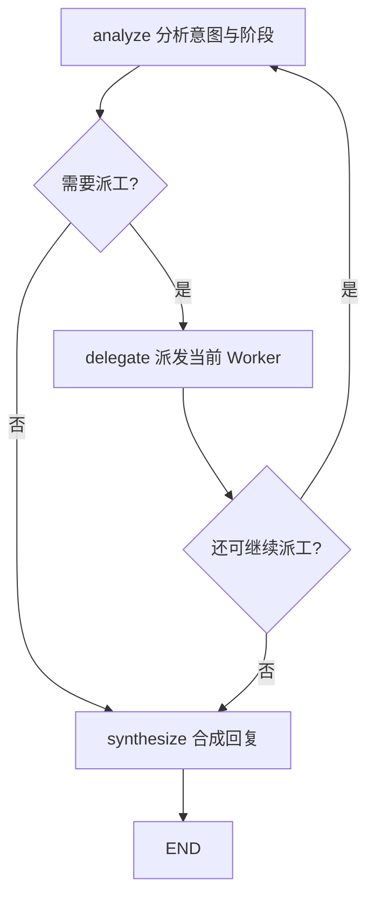

# 项目架构设计与核心技术解析

## 重点

- **项目本质**：AI-Optimized-Resume-V2 不是单点简历改写器，而是面向 IT 求职与职业规划的 Personal Career OS；核心交付是结构化职业档案、策略判断、HTML 简历产物和产物索引。
- **架构主线**：系统采用本地优先的 Python 单体 + 一主多从 Multi-Agent + 自研 Harness；Coordinator 负责决策编排，Worker 负责领域推理，Harness 负责权限、状态、闸门、工具、存储和 trace。
- **LangGraph 使用边界**：当前项目的 LangGraph 重点落在 Coordinator 状态图，主节点是 `analyze`、`delegate`、`synthesize`；Worker 侧主要是 ReAct 循环和 LiteLLM tool calling，不应在面试中夸大为复杂多图平台。
- **工程控制重点**：LLM 负责理解、推理和表达，确定性代码负责阶段转换、工具权限、Profile 写入、Gate/HITL、HTML 产物登记和失败归因。
- **面试表达口径**：这套系统最值得讲的不是“用了多 Agent”，而是为什么长流程需要状态机、权限控制面、上下文治理、可观测 trace 和分层 Eval 来证明它稳定。

## 一、项目概述与核心价值

### 1.1 业务场景

这个项目面向 IT 求职与职业规划，解决的是“职业信息如何被持续沉淀、推演、确认并交付”的问题。

用户输入主要包括：

- 用户对话：职业目标、偏好、困惑、补充经历。
- 简历内容：已有项目、工作经历、技能栈、成果描述。
- JD 信息：目标岗位要求、职责、技术关键词、隐含筛选标准。
- 经历素材：过往项目细节、可量化结果、个人取舍和成长路径。

系统输出主要包括：

- 结构化职业档案：沉淀在 Profile 中，供后续流程复用。
- 市场与机会判断：帮助用户理解岗位方向、匹配度和风险。
- 策略结论：围绕目标岗位生成投递与表达策略。
- HTML 简历产物：把确认后的内容落成可查看、可复用、可索引的文件。
- 产物索引：记录生成过的简历文件、标签、档位和交付信息。

这意味着项目的核心不是“模型能不能回答”，而是“长流程是否可控、可追踪、可回归、可交付”。

### 1.2 为什么不是单 Agent

如果只用一个大 Prompt 或一个通用 ReAct Agent，短期看可以快速跑通，但会很快遇到四类问题：

| 问题 | 单 Agent 的风险 | 本项目的处理方式 |
|------|----------------|------------------|
| 上下文膨胀 | 所有信息塞进一个上下文，关键事实容易被冲掉 | 按阶段注入上下文，Worker 只读必要材料 |
| 权限失控 | 模型可能提前写档案、生成简历或越权调用工具 | Harness 统一校验 actor 与 tool 权限 |
| 状态串线 | 初探、市场、JD、策略、简历阶段互相污染 | Task / pipeline phase 约束当前可执行阶段 |
| 难以验证 | 只能评估“回复像不像”，难证明流程稳定 | L1/L2/L3 Eval + JSONL trace 验证系统契约 |

面试可以这样说：

> 我不是为了炫技才做多 Agent，而是因为这个业务本质上是长流程系统。它需要状态、权限、确认、文件交付和可回放链路。单 Agent 可以回答问题，但很难稳定控制什么时候能做、谁能做、做完写到哪里。

## 二、技术栈与 Go 开发者类比

### 2.1 技术栈

| 层级 | 技术 | 作用 |
|------|------|------|
| 后端运行时 | Python 3.11+ | 承载 FastAPI、Agent、Harness 和本地文件存储 |
| Web API | FastAPI + Uvicorn | 提供 REST 接口和 SSE 流式输出 |
| Agent 编排 | LangGraph | 构建 Coordinator 的状态机工作流 |
| Agent 基础组件 | LangChain Core | 承接消息、工具、模型调用等基础概念 |
| 模型适配 | LiteLLM | 统一不同 LLM Provider 的 completion 与 tool calling |
| 数据约束 | Pydantic / TypedDict | 约束配置、状态、结构化输入输出 |
| 前端 | React + Vite + TypeScript | 对话、任务进度、表单、HTML 产物展示 |
| 存储 | 本地文件系统 | 保存 session、profile、task、output、trace 等项目数据 |

### 2.2 Go 开发者类比

| Python / Agent 概念 | Go 视角类比 | 在项目里的意义 |
|---------------------|-------------|----------------|
| `TypedDict` | 轻量 struct 字段约束 | 描述状态对象有哪些字段，但运行时比 Go struct 更宽松 |
| `StateGraph` | 有限状态机 / 工作流引擎 | 把一次用户消息拆成分析、派工、合成等节点 |
| `ToolRegistry` | 带权限表的服务注册中心 | 统一记录哪个 actor 可以调用哪个工具 |
| `Harness` | 运行时控制平面 / 平台层 | 统一处理工具、权限、任务、闸门、存储和 trace |
| `profile_patch` | 受控写模型 / repository update | Worker 不能随意改长期档案，只能按权限提交结构化 patch |
| `TraceWriter` | 结构化日志 writer | 把关键运行事件写成 JSONL，方便排查和评测 |

面试可以这样说：

> 我是 Go 背景，所以理解这个项目时会把 LangGraph 看成状态机，把 ToolRegistry 看成服务注册和权限表，把 Harness 看成运行时控制平面。这样比单纯说“用了 Agent 框架”更容易讲清楚工程边界。

## 三、核心架构与 LangGraph 工作流

### 3.1 一句话架构

项目采用的是：

> 本地优先的 Python 单体 + 一主多从 Multi-Agent + 自研 Harness。

更具体地说：

- 前端通过 REST + SSE 调用 FastAPI。
- FastAPI 把对话请求交给后端 `career_os` 单体。
- Coordinator 用 LangGraph 管理单轮消息的分析、派工和合成。
- Worker 负责领域任务，例如身份、能力、市场、机会、策略、简历、资产。
- Harness 负责运行时控制，包括工具权限、任务阶段、Profile 写入、Skill 加载、Gate、Trace 和产物登记。

### 3.2 CoordinatorState 字段含义

`CoordinatorState`（协调者状态）定义在 `backend/career_os/agents/state/coordinator.py`，是 Coordinator 图在节点之间传递的状态对象。

| 字段 | 含义与作用 |
|------|------------|
| `messages`（消息列表） | 当前会话可用于分析的聊天历史。Coordinator 会按配置裁剪后传给分析逻辑，避免上下文无限增长。 |
| `messages_meta`（消息元信息） | 消息相关的补充信息，例如来源、附件、结构化上下文等，用于辅助分类和派工。 |
| `session_id`（会话 ID） | 当前会话的唯一标识，用于读写 session、trace 和上下文状态。 |
| `session_state`（会话工作状态） | 当前对话的临时状态，例如当前 pipeline phase、gate、prior_results、list_type 等。 |
| `worker_index`（Worker 索引） | 从 `WorkerRegistry` 读取的 Worker 能力列表，供 Coordinator 判断本轮可以派哪个 Worker。 |
| `pending_workers`（待执行 Worker 列表） | 本轮还没执行完的 Worker 队列，支持连续派工。 |
| `current_worker_id`（当前 Worker ID） | 当前准备派发的 Worker，例如 `market`、`opportunity`、`resume`。 |
| `last_worker_result`（上一个 Worker 结果） | 最近一次 Worker 的结构化输出或错误，用于后续合成回复和继续派工。 |
| `stop_delegate`（停止派工标记） | 如果遇到 gate、错误、闲聊或无需派工，设置为 true，让流程进入合成阶段。 |
| `synthesis_text`（最终回复文本） | 最终返回给用户的自然语言回复。 |
| `synthesis_draft`（回复草稿） | 合成阶段生成的回复草案，便于后续扩展流式输出或调试。 |
| `delegate_count`（派工次数） | 记录本轮已经派发多少次 Worker，用于控制循环和判断是否只是普通对话。 |
| `user_message`（用户当前消息） | 本轮用户输入，是意图分析、流程转换和 Worker goal 的核心输入。 |
| `request_context`（请求上下文） | API 层传入的额外上下文，例如文件、前端状态或临时参数。 |

### 3.3 WorkerState 字段含义

`WorkerState`（Worker 状态）定义在 `backend/career_os/agents/state/worker.py`，用于描述单个 Worker ReAct 运行过程。

| 字段 | 含义与作用 |
|------|------------|
| `worker_id`（Worker ID） | 当前领域 Worker 的标识，例如 `identity`、`resume`、`asset`。 |
| `goal`（任务目标） | Coordinator 派给 Worker 的本轮目标，通常来自用户当前消息。 |
| `context`（上下文） | Harness 和 Coordinator 注入的上下文，例如聊天历史、Profile 片段、前序结果、Skill/Tool 索引。 |
| `session_state`（会话状态） | 当前会话工作区，用于读取 phase、gate、prior_results 等信息。 |
| `iteration`（当前迭代次数） | ReAct 循环当前是第几轮，用于防止无限 tool call。 |
| `max_iterations`（最大迭代次数） | ReAct 最大迭代上限，当前 Worker runner 中是 `MAX_ITERATIONS = 12`。 |
| `messages`（模型消息） | Worker 与 LLM 的消息列表，包括 system、user、assistant、tool 结果。 |
| `structured_output`（结构化输出） | Worker 最终返回的 JSON 结构，供 Coordinator、SessionStore 或 Profile 写入逻辑使用。 |
| `status`（运行状态） | Worker 当前状态，例如 running、completed、failed。 |
| `error`（错误信息） | Worker 失败时的错误原因，例如 LLM 调用失败、没有合法 JSON、达到最大迭代次数。 |

### 3.4 Coordinator 图节点

`build_coordinator_graph`（构建协调者 LangGraph 状态图）定义在 `backend/career_os/agents/graphs/coordinator.py`。它把单轮用户消息拆成三个节点：

| 节点 | 含义与作用 |
|------|------------|
| `analyze`（分析节点） | 判断用户消息是闲聊、流程转换、继续初探、JD 前置不足，还是需要派发某些 Worker。它会更新 `session_state`，并设置 `pending_workers` 和 `current_worker_id`。 |
| `delegate`（派工节点） | 通过 `harness.delegate_worker` 派发当前 Worker，接收 Worker 结构化结果，写入 `prior_results`，必要时更新 session artifacts 或 pipeline phase。 |
| `synthesize`（合成节点） | 把 Worker 结果、gate、错误、前置不足或普通对话状态，合成为用户能理解的回复。 |

节点关系如下：

### 3.5 条件边与状态机收束

`route_after_analyze`（分析后路由函数）根据 `stop_delegate` 和 `current_worker_id` 决定下一步：

- 如果 `stop_delegate=true` 或没有 `current_worker_id`，进入 `synthesize`。
- 否则进入 `delegate`。

`route_after_delegate`（派工后路由函数）根据 `stop_delegate` 和 `pending_workers` 决定下一步：

- 如果 `stop_delegate=true` 或没有剩余 `pending_workers`，进入 `synthesize`。
- 否则回到 `analyze`，继续处理队列。

这个设计的价值是：Coordinator 可以在同一轮对话中连续派工，但遇到 gate、错误、阶段边界或 Worker 未完成时会及时收束。

面试可以这样说：

> 我们没有把一次对话写成一长串 if/else，而是用 LangGraph 把它拆成 analyze、delegate、synthesize 三个节点。这样每一轮都能解释：先判断要不要派工，再让 Harness 做受控派发，最后统一合成用户可读回复。

## 四、Agent 协同与职责边界

### 4.1 Coordinator：入口编排者

Coordinator（协调者）的职责不是亲自完成所有业务，而是控制流程：

- 分析用户意图。
- 判断当前 pipeline phase。
- 根据 `worker_index` 选择 Worker。
- 把前序 Worker 结果放入 `prior_results`。
- 识别 JD 前置不足、Gate、闲聊、流程转换等特殊状态。
- 将结构化结果转成用户能理解的回复。

面试中要避免把 Coordinator 说成“万能 Agent”。更准确的说法是：Coordinator 负责决策编排和用户表达，不负责最终权限控制。

### 4.2 Worker：领域推理者

Worker（领域智能体）负责具体领域问题。当前注册表中有 7 类 Worker：

| Worker | 领域职责 | 关键工具 |
|--------|----------|----------|
| `identity`（身份智能体） | 内心五主题、职业偏好、初探价值锚点 | `profile_patch` |
| `capability`（能力智能体） | 经历素材、能力图谱、简历深挖 | `profile_patch`、`resume_read` |
| `market`（市场智能体） | 生成冻结调研方案并异步启动正式市场调研 | `market_research(plan_id)` |
| `opportunity`（岗位/机会智能体） | JD 解析、匹配评估、推荐判断 | `profile_patch`；只读 Harness 注入的正式市场结果 |
| `strategy`（策略智能体） | 多路径推演、投递策略、优化确认 | `profile_patch` |
| `resume`（简历智能体） | 按档位生成 HTML 简历 | `write_resume_html`、`profile_patch`、`resume_read` |
| `asset`（资产智能体） | 复用建议、产物索引登记、删除产物 | `register_outputs_index`、`delete_output` |

Worker 之间不互相直连。它们通过 Coordinator 和 `session_state.prior_results` 传递必要结果，避免上下文来源不清和状态漂移。

### 4.3 Harness：运行时控制平面

Harness（运行时控制平面）不是薄薄的工具封装，而是系统稳定性的核心。它负责：

- 工具注册和 actor 权限校验。
- `delegate_worker`（派发 Worker）前的阶段和前置条件检查。
- `profile_patch`（档案 patch）等长期写入入口。
- `load_skill`（加载 Skill）和 `list_skills`（列出 Skill）。
- Gate/HITL 意图匹配。
- Task list、phase advance、jump 等任务系统动作。
- HTML 写入和 outputs index 登记。
- Trace 事件写入。

### 4.4 三者边界

| 问题 | 谁负责 | 为什么 |
|------|--------|--------|
| 用户这句话想做什么 | Coordinator | 这是意图理解和编排问题 |
| 某个领域问题怎么分析 | Worker | Worker 有领域 prompt、skill、tool 和输出契约 |
| 当前阶段能不能派这个 Worker | Harness | 阶段约束必须确定性执行，不能交给 LLM 自觉 |
| 某个工具能不能被调用 | Harness / ToolRegistry | 权限属于运行时安全边界 |
| 失败后怎么对用户解释 | Coordinator | 用户表达需要自然语言合成 |
| 长期档案能写哪里 | Harness / profile 写入规则 | 防止 Worker 越权改长期记忆 |

面试可以这样说：

> 我的分层原则是：LLM 可以负责理解和生成，但不能拥有最终权限。Coordinator 决定派谁，Worker 解决子问题，Harness 决定能不能做、能写哪里、是否需要确认、如何留下审计链路。

## 五、工具链、权限与 Tool Calling

### 5.1 ToolRegistry 的作用

`ToolRegistry`（工具注册表）定义在 `backend/career_os/platform/tool/registry.py`。它记录三件事：

- `name`（工具名称）：例如 `write_resume_html`、`profile_patch`、`jump_to_phase`。
- `actors`（可调用者集合）：哪些 actor 可以调用这个工具。
- `handler`（处理函数）：真正执行工具逻辑的 Python 函数。

`ToolRegistry.register`（注册工具）用于把工具加入注册表；`ToolRegistry.execute`（执行工具）会检查 actor 是否有权限，没有权限就抛出 `PermissionError`。

### 5.2 Coordinator 工具与 Worker 工具分离

工具权限不是平铺的，而是按 actor 分层：

| 工具类型 | 示例 | 谁能用 | 设计原因 |
|----------|------|--------|----------|
| 流程工具 | `jump_to_phase`、`advance_current_phase` | Coordinator | 阶段切换必须由入口编排者统一控制 |
| 任务工具 | `create_task_list`、`complete_task` | Coordinator | Task 是流程状态机，不由 Worker 私自推进 |
| 档案读取 | `profile_get` | Coordinator | Coordinator 需要读长期事实做上下文组织 |
| 档案写入 | `profile_patch` | Worker | Worker 提交领域结构化 patch，但仍受 Harness 校验 |
| 简历写入 | `write_resume_html` | resume Worker | 只有简历智能体能生成 HTML 文件 |
| 产物登记 | `register_outputs_index` | asset Worker | 资产智能体负责索引和复用，不负责写 HTML |
| Skill 工具 | `list_skills`、`load_skill` | Worker | Worker 在执行时按需加载技能正文 |

### 5.3 Harness.execute_tool 的执行链路

`Harness.execute_tool`（统一执行工具并做权限与 trace 控制）定义在 `backend/career_os/harness/executor.py`。

它的核心流程是：

1. 调用 `_tool_visible_to_actor`（判断工具对 actor 是否可见），先做权限检查。
2. 如果无权限，返回 `HarnessError("tool_not_allowed", ...)`。
3. 如果有权限，把 `session_id` 注入工具参数。
4. 调用 `self.tools.execute` 执行真实工具。
5. 通过 `self.trace.emit` 写入 `tool.call` 事件，记录状态和耗时。
6. 如果工具返回错误对象，则继续以结构化错误返回，而不是让异常散落到 Worker 内部。

这就是项目把“模型想调用工具”和“系统允许调用工具”分开的关键。

### 5.4 LiteLLM Tool Calling 如何接入

Worker 的 ReAct runner 定义在 `backend/career_os/agents/graphs/workers/react_runner.py`。核心过程是：

1. `run_worker_react`（运行 Worker ReAct 循环）构造 system prompt 和 boot user prompt。
2. 通过 `get_litellm_tools_for_worker`（获取当前 Worker 可见工具 schema）把工具列表传给 LiteLLM。
3. 模型如果返回 `tool_calls`，Worker runner 解析函数名和参数。
4. Worker runner 调用 `harness.execute_tool(worker_id, tool_name, args)`。
5. 工具结果以 `role=tool` 的消息回填到 `messages`。
6. 模型继续推理，直到输出合法 JSON。
7. `finalize_worker_result`（收束 Worker 输出）把 JSON 转成统一 WorkerResult。

面试可以这样说：

> Tool calling 不是模型直接拥有工具权限。模型只能提出 tool call，真正能不能执行由 Harness 根据 actor 和 tool 权限表判断。这样就算模型幻觉调用了不该用的工具，也会被运行时拒绝并留下 trace。

## 六、记忆、持久化与 Human-in-the-loop

### 6.1 五类核心数据

| 对象 | 含义 | 生命周期 |
|------|------|----------|
| Session（会话工作区） | 当前对话正在发生什么，包括 gate、phase、prior_results、临时上下文 | 当前会话内有效 |
| Profile（长期档案） | 用户长期职业事实、偏好、能力、市场认知、策略结论 | 跨会话复用 |
| Task（任务状态机） | 当前业务流程走到哪一步，哪些阶段可推进 | 和流程相关 |
| Output（产物） | 生成的 HTML 简历等文件 | 可查看、可复用、可索引 |
| Trace（运行审计） | 工具调用、派工、gate、失败原因等结构化事件 | 用于排查和评测 |

### 6.2 为什么不用全量聊天历史当记忆

全量聊天历史不适合作为长期记忆，因为：

- 里面混有探索、犹豫、误解和临时想法。
- Token 成本会越来越高。
- 后续流程很难判断哪些事实已经确认。
- 面试和简历生成需要可追溯的事实源，而不是临时上下文拼接。

所以项目把长期事实沉淀到 Profile，把当前流程状态放在 Session，把最终文件放在 Output，把运行过程放在 Trace。

### 6.3 Gate / HITL 的位置

Gate（确认闸门）用于处理“必须先问用户再执行”的动作，例如：

- 初探是否完成。
- 是否继续一个不推荐的 JD。
- 是否确认进入简历优化。
- 是否采用复用建议。
- 是否登记或交付产物。

重要的是：Gate 不是只靠 prompt 提醒模型“记得问一下”，而是写入 `session_state.gates.pending` 这样的结构化状态。后续用户回复会先走 gate intent 判断，再决定是否放行。

### 6.4 写入长期档案的边界

Worker 不能随意写任意 Profile 路径。正确路径是：

1. Worker 生成结构化结果或 proposed patch。
2. 通过 Harness 提供的工具入口提交。
3. Harness 和 profile 写入规则校验 actor 与 path。
4. 校验通过后才落到长期 Profile。

这个设计能避免市场 Worker 修改简历产物、简历 Worker 越权改身份偏好、asset Worker 私自生成 HTML 等边界问题。

面试可以这样说：

> 我没有把聊天记录直接当长期记忆，而是把事实、流程、产物、审计拆开。聊天记录适合做上下文，Profile 适合做长期事实，Task 适合做流程状态，Trace 适合做问题回放。

## 七、可观测性、评估与工程化

### 7.1 Trace 设计

Trace 的核心价值是回答三个问题：

- 本轮为什么派了这个 Worker？
- 工具调用有没有被允许、耗时多久、结果如何？
- 如果流程停住了，是 gate、前置条件、工具权限还是 LLM 输出问题？

已有架构文档中定义的关键事件包括：

| 事件 | 含义 |
|------|------|
| `coordinator.analyze` | Coordinator 分析结果，包括 source、workers、list_type 等 |
| `tool.call` | Harness 工具调用，记录 actor、tool_name、status、latency_ms |
| `gate.pending` | 某个确认闸门进入 pending 状态 |
| `gate.pass` | 用户通过某个 gate |
| `task.transition` | Task 或 pipeline phase 发生状态变更 |
| `agent.run.start` / `agent.run.end` | Agent 运行开始和结束 |

### 7.2 Eval 分层

这个项目的 Eval 不应该只评估“回复是否好听”，而应验证长流程系统契约。

| 层级 | 验证对象 | 示例 |
|------|----------|------|
| L1 Component | 纯确定性规则 | Tool 白名单、profile patch 权限、gate intent、schema 校验 |
| L2 Trajectory | 派工链路 | 是否先 market 后 opportunity，遇 gate 是否停链，JD 前置不足是否拦截 |
| L3 E2E | 端到端交付 | 多轮 chat 后是否写 Profile、生成 HTML、登记 outputs_index、留下 trace |

这种分层更贴合 Agent 工程，因为 Agent 的失败往往不只是“回答错”，还可能是阶段错、工具错、写入错、确认错、产物错。

### 7.3 异常与降级

项目中比较重要的异常控制包括：

- LLM API Key 不存在时，Worker runner 返回 `LLM_API_KEY is not configured`。
- LiteLLM 调用失败时，返回结构化 failed result。
- Worker 未输出合法 JSON 时，返回 `No valid JSON object found in worker response`。
- ReAct 超过最大迭代次数时，返回 `Reached max iterations`。
- 工具越权时，Harness 返回 `tool_not_allowed`。
- JD 前置条件不满足时，Harness delegate 层返回结构化阻断原因。

这些错误不应该被吞掉，而应该进入 Coordinator 合成阶段，变成用户能理解的下一步引导，同时进入 trace 方便排查。

面试可以这样说：

> 我评估这个项目不是只看模型回复质量，而是看长流程契约是否稳定：该拦的能不能拦住，该写的是否写到正确位置，生成文件是否可索引，失败后能不能通过 trace 归因。

## 八、面试高频问题与答辩模板

### 8.1 为什么不用单 Agent？

可以这样答：

> 单 Agent 适合短任务，但这个项目是长流程系统，里面有职业初探、市场分析、JD 评估、策略推演、简历生成和产物登记。它不只是要回答问题，还要控制阶段、权限、确认和写入。如果都放在一个 Agent 里，容易出现上下文污染、越权调用工具、提前生成简历、长期档案被错误更新等问题。所以我把系统拆成 Coordinator、Worker 和 Harness：Coordinator 负责派工，Worker 负责领域推理，Harness 负责确定性控制。

### 8.2 为什么采用一主多从？

可以这样答：

> 一主多从的核心价值是让入口和状态只有一个权威来源。Coordinator 是唯一入口，负责理解用户意图、选择 Worker 和合成回复；各 Worker 只解决自己的领域问题，不互相直连。这样做可以避免多个 Agent 同时改状态、互相传递不完整上下文，也方便在 Harness 层统一做权限和 trace。

### 8.3 Harness 和 Coordinator 的边界是什么？

可以这样答：

> Coordinator 负责“应该做什么”的编排判断，Harness 负责“能不能做、怎么安全地做”的运行时控制。比如 Coordinator 可以决定本轮要派 resume Worker，但 resume Worker 是否可以调用 `write_resume_html`，是否已经通过 optimize confirm，工具调用和产物登记是否合法，都应该由 Harness 的确定性规则控制。

### 8.4 Worker 为什么不互相调用？

可以这样答：

> Worker 互相调用会让上下文来源变复杂，也会让状态责任不清楚。比如 opportunity 直接调用 strategy，strategy 再调用 resume，最后很难判断是谁依据什么信息推动了流程。这个项目把 Worker 结果收回到 Coordinator 和 session_state，再由 Coordinator 决定下一步。这样牺牲了一点自由度，但换来更好的可控性、可解释性和可回归测试。

### 8.5 如何避免 Agent 越权写入或提前生成简历？

可以这样答：

> 我主要靠两层控制。第一层是工具权限，`ToolRegistry` 限制每个 actor 能调用哪些工具，比如只有 resume Worker 能调用 `write_resume_html`，只有 asset Worker 能调用 `register_outputs_index`。第二层是 Harness 的业务前置条件，比如未通过 optimize confirm 时，简历生成路径会被硬拦。也就是说，prompt 会提示模型遵守规则，但最终不是靠模型自觉，而是靠运行时校验。

### 8.6 如何做上下文治理和 Token 控制？

可以这样答：

> 我没有让每个 Worker 读取全量聊天历史，而是由 Coordinator 和 Harness 按阶段注入必要上下文。比如 Coordinator analyze 会裁剪最近对话，Worker context 会包含 chat_history_scope、Profile 片段、prior_results、Skill/Tool 索引。这样可以减少 token 浪费，也能降低旧上下文对当前阶段的干扰。

### 8.7 如何证明系统可靠？

可以这样答：

> 我会从 Eval 和 Trace 两条线证明。Eval 分 L1、L2、L3：L1 测确定性规则，比如工具权限和 gate；L2 测派工轨迹，比如是否按市场到机会再到策略；L3 测端到端交付，比如 profile、HTML、outputs_index 是否都正确。Trace 则记录 coordinator.analyze、tool.call、gate、task.transition 等事件，失败时可以回放到底是哪一步出问题。

### 8.8 这个项目里 LangGraph 的核心价值是什么？

可以这样答：

> 当前 LangGraph 主要承载 Coordinator 的状态机，而不是为了堆很多复杂图。它的价值是把一次用户消息拆成 analyze、delegate、synthesize 三个清晰节点，并用条件边控制是否继续派工或进入合成。这样系统的单轮行为是可解释的，也方便围绕节点和状态做测试。

### 8.9 如果面试官质疑这是 Demo，不是工程系统，怎么回答？

可以这样答：

> 我会承认它是本地优先的 v0.1 项目，不是生产级 SaaS，但它不是只靠 Prompt 的 Demo。它已经把 Agent 工程里最容易失控的部分抽出来了：状态机、工具权限、Profile 写入边界、Gate/HITL、HTML 产物、Trace 和 Eval。也就是说，它的价值不是规模，而是把一个 Agent 长流程如何可控落地讲清楚。

## 九、建议阅读代码顺序

### 9.1 先看架构入口

1. `docs/architecture/00-架构总览.md`：理解一主多从、Python 单体、REST + SSE。
2. `backend/career_os/agents/graphs/coordinator.py`：理解 Coordinator 的 LangGraph 状态机。
3. `backend/career_os/agents/state/coordinator.py`：理解 `CoordinatorState` 各字段。

### 9.2 再看运行时控制

1. `backend/career_os/harness/executor.py`：理解 `Harness`、`execute_tool` 和工具注册。
2. `backend/career_os/platform/tool/registry.py`：理解 actor 与 tool 权限表。
3. `backend/career_os/harness/delegate.py`：理解 Worker 派发前置规则。
4. `backend/career_os/harness/jd_prerequisites.py`：理解 JD 链路前置拦截。

### 9.3 最后看 Worker 与评测

1. `backend/career_os/agents/graphs/workers/react_runner.py`：理解 Worker ReAct 循环和 LiteLLM tool calling。
2. `config/workers.registry.json`：理解 7 类 Worker 的职责、工具和 gate。
3. `docs/architecture/12-评测与可观测.md`：理解 Eval 分层和 trace 设计。
4. `backend/tests/`：对照测试理解权限、派工、gate、trace、产物交付。

## 十、收束总结

这个项目在面试中最好的讲法不是：

> 我做了一个多 Agent 简历优化系统。

而是：

> 我做了一个面向 IT 求职场景的 Personal Career OS。它用本地 Python 单体承载 FastAPI、LangGraph Coordinator、7 类领域 Worker 和自研 Harness。Coordinator 负责编排，Worker 负责领域推理，Harness 负责工具权限、阶段约束、Profile 写入、Gate、Trace 和产物登记。这个设计的重点不是让模型更自由，而是让长流程 Agent 在真实交付中可控、可追踪、可验证。
