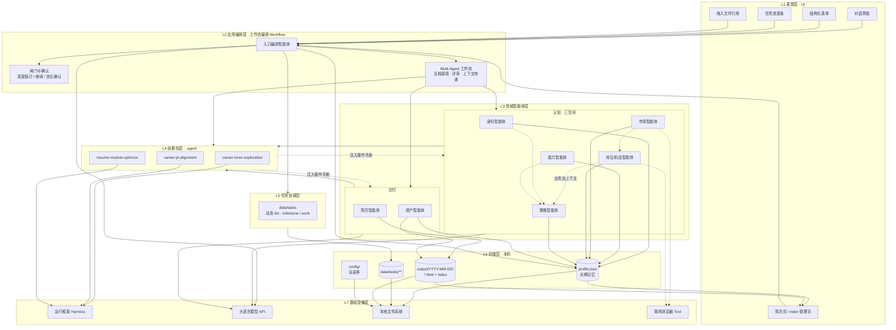
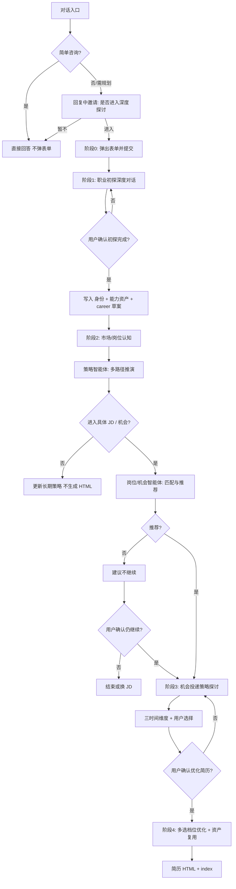
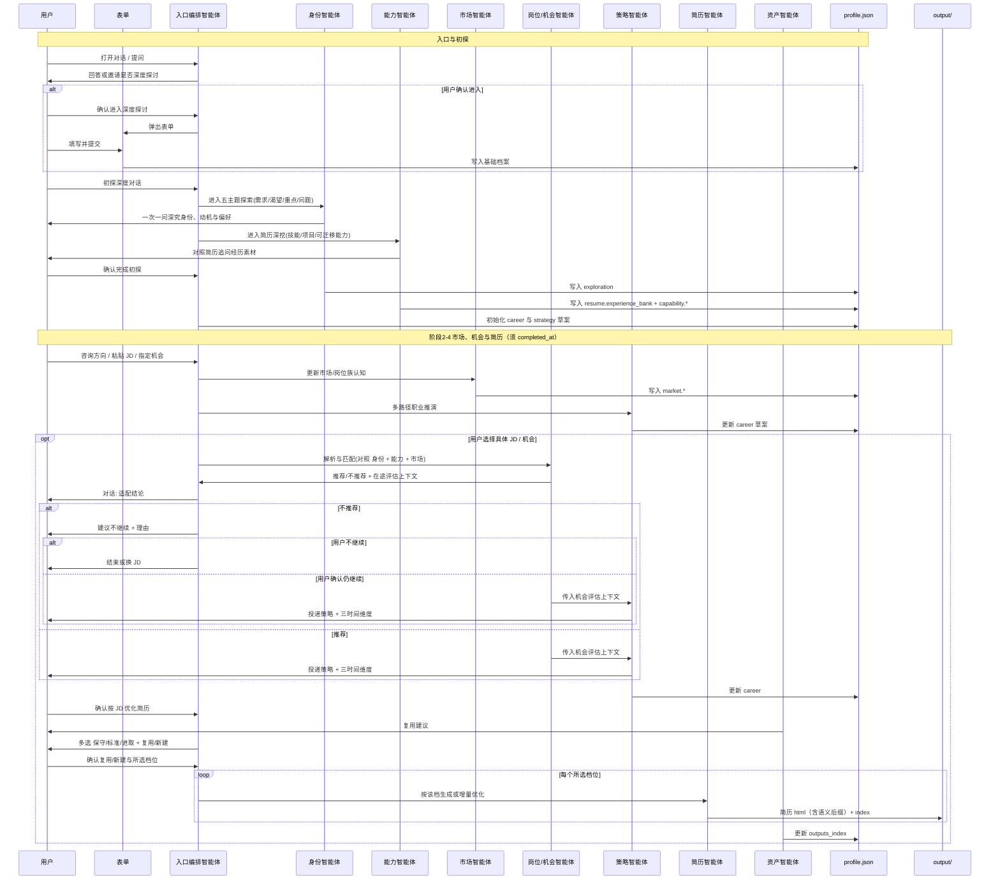
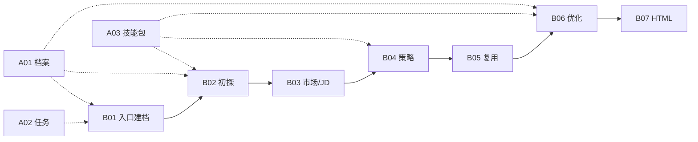

# 个人职业规划智能体 — 产品需求文档（总领）

| 属性 | 内容 |
|------|------|
| 文档版本 | v0.10 |
| 状态 | 草案（已对齐产品讨论结论） |
| 项目 | AI-Optimized-Resume-V2 |
| 最后更新 | 2026-05-22 |

## 重点

- **整体定位升级**：产品不再只聚焦单次 JD 投递，而是长期职业记忆 + 职业资本推演 + 简历 HTML 交付的个人职业操作系统。
- **三空间分层**：身份智能体建模人格/动机/偏好，能力智能体建模技能/经验/可迁移能力，市场智能体建模岗位/行业/趋势/机会。
- **策略层升级**：策略智能体读取身份、能力、市场三层结果，做多路径职业推演，并在具体 JD 出现时生成投递策略与三时间维度。
- **执行边界（当前版本）**：参考文档中的 **执行层（Execution Layer）** 成长系统（周目标、学习路径、项目实践、反馈监督）**暂不实现**（后续版本纳入规划）；当前闭环落点是 **长期记忆落档** + **简历 HTML 交付**。
- **交付职责收敛**：简历智能体只写简历正文，资产智能体只管历史复用、文件命名、`outputs_index` 与打开/删除（HTML 已落盘本机；导出 PDF 由用户在浏览器打印/另存为）。
- **架构对齐**：分层理念见 [docs/参考文档.md](../参考文档.md)；PRD 将 Identity / Capability / Market / Strategy 落到可存储字段与对话流程，而非仅 MVP 单次投递。

## 目录

- [1. 概述](#1-概述)
  - [1.1 背景与问题](#11-背景与问题)
  - [1.2 产品定位](#12-产品定位)
  - [1.3 产品优先级](#13-产品优先级)
  - [1.4 核心价值](#14-核心价值)
  - [1.5 成功指标](#15-成功指标)
  - [1.6 范围边界](#16-范围边界)
- [2. 目标用户与场景](#2-目标用户与场景)
- [3. 产品原则与红线](#3-产品原则与红线)
- [4. 用户旅程与智能体架构](#4-用户旅程与智能体架构)
- [5. 功能规格索引](#5-功能规格索引)
  - [5.1 机制类](#51-机制类)
  - [5.2 流程类（按主路径执行顺序）](#52-流程类按主路径执行顺序)
- [6. 非功能需求](#6-非功能需求)
- [7. 版本规划与 TODO](#7-版本规划与-todo)
- [8. 决策记录](#8-决策记录)
- [附录 B：确认话术（建议）](#附录-b确认话术建议)
- [附录 C：仓库目录约定（建议）](#附录-c仓库目录约定建议)

---

## 1. 概述

### 1.1 背景与问题

求职与职业发展中，从业者常面临：自我偏好、能力资产与市场机会彼此割裂；简历与目标岗位匹配度不清晰；优化标准不一；缺乏对「人格/动机—能力资产—市场机会—长期路径」的统一视角；且通用工具难以结合个人长期记忆持续迭代。

### 1.2 产品定位

**面向 IT 全类的个人职业操作系统（Personal Career OS）**：以结构化职业档案（`profile.json` 长期记忆）、能力资产组合（Capability Portfolio）与 **动态任务系统** 为状态底座。产品按参考文档的三空间与五层认知理念，将主路径落实为「**身份 → 能力 → 市场 → 策略 → 简历交付**」，帮助用户长期沉淀职业资本，并在出现具体 JD / 机会时完成判断、策略对齐与最终可打印简历 HTML 交付。

用户进入产品后 **先对话**，入口编排智能体用大语言模型判断是否需要 **深度探讨与规划**；仅在用户 **确认进入** 后弹出结构化表单，再进入职业初探、能力建模、市场/岗位分析、策略推演、简历交付。简单咨询可始终不弹表单、不建任务。

**与参考文档的分工对照**：

| 参考分层 | 本产品是否实现 | 落点 |
|----------|----------------|------|
| 身份智能体（Identity） | 是 | `exploration.*` |
| 能力智能体（Capability） | 是 | `resume.experience_bank`、`capability.*` |
| 市场智能体（Market） | 是 | `market.*` |
| 岗位/机会评估 | 是（JD 为市场输入之一） | `market.opportunity_snapshots`、对话闸门 |
| 策略智能体（Strategy） | 是 | `strategy.*`、`career.*` |
| 简历 + 资产交付 | 是 | `output/`、`outputs_index` |
| 执行智能体（Execution） | **当前版本否** | 周目标/学习路径/项目实践/反馈监督暂不实现；后续版本考虑 |
| 复盘/机会侦察智能体 | 暂缓 | 由入口编排与策略层对话覆盖，不单独拆 Agent |
| 记忆层（Memory） | 是（数据底座） | `profile.json`，非独立业务智能体 |

### 1.3 产品优先级

| 优先级 | 目标 | 说明 |
|--------|------|------|
| **P0** | 作品展示 | 可演示、可讲解、可复现；展示参考文档中的长期职业分层理念如何落到产品流程 |
| **P1** | 自用 | 本机真实档案、能力资产与 JD 流程，提升长期职业判断与投递准备效率 |
| **不做** | 商业化 | 不设计账号体系、付费、多租户；隐私按本地优先 |

### 1.4 核心价值

- **根基**：用户自愿进入深度探讨并提交表单后，通过初探对话厘清身份、动机、偏好、约束与当下重点，写入 JSON。
- **能力资产**：把简历浓缩信息扩展为结构化经历素材、能力图谱、能力迁移线索与能力资产组合，供后续策略与简历交付复用。
- **市场判断**：JD 是市场输入之一；系统还应沉淀岗位族、行业趋势、技术周期与机会风险，帮助用户判断当前机会是否值得投入。
- **策略推演**：进行中业务流优先接收上游 Agent **在途上下文**；跨会话再从档案读取身份、能力、市场结论，形成当前能力、下一跳、3–5 年路径与具体投递叙事。
- **交付闭环**：用户明确确认后，才产出可打印简历 HTML，并将产物元数据写回长期记忆，支持后续复用。

### 1.5 成功指标

**作品展示（P0）**

- 端到端 Demo 可跑通：对话入口 → 用户确认进入深度探讨 → 表单 → **职业初探与能力建模落档** → 市场/岗位分析 → 策略推演 → 粘贴 JD 或选择机会 → 生成 HTML + `index.html`。
- 仓库内含 `profile.example.json` 与脱敏样例 output，Clone 即可理解产品结构。
- 可讲解技术亮点：入口编排智能体 + 按认知对象划分的多智能体边界、**动态任务系统**（进度条 + 强约束 + 可审计）、**前置初探**、JD 闸门、**三档可多选同轮多份 HTML**、简历复用、JSON 长期记忆、**简历 HTML 纯正文可直打 PDF**。

**自用（P1）**

- 单次「机会/JD → 策略确认 → HTML」流程完成耗时（主观可接受即可）。
- 已有适配简历时被正确识别并复用（跳过或增量优化）的比例。
- 能力资产、市场观察与策略选择可跨会话延续，而不只服务于单个 JD。
- 能力偏好标签在 HTML 交付命名确认后沉淀至 `custom[]`，后续文件名与推荐逻辑可复用。

**隐私与合规（与优先级绑定）**

- 真实 `profile.json` 与 `output/**` 不进入版本库。
- 文档说明模型接口 / 联网工具的数据范围（见 §6）。

### 1.6 范围边界

| 在范围内（核心版本） | 不在范围内（核心版本） |
|-----------------|-------------------|
| IT 全类岗位（开发、测试、运维、数据、AI、技术产品等） | 多行业通用知识库 |
| 简历仅粘贴；JD 仅粘贴 | 简历/JD 文件上传 |
| 用户确认后结构化表单 + JSON 档案 | 启动即强制弹表单 |
| 确认后职业初探深度对话（结论写入 JSON） | 未确认进入深度探讨不得要求填表 |
| 身份、能力、市场、策略的长期记忆沉淀；不保存完整会话历史 | 完整对话历史持久化 |
| 能力资产组合、能力迁移线索、岗位/市场观察、策略选择写入 JSON | 周目标、学习路径、项目实践、反馈监督等成长执行系统（**当前版本**暂不实现） |
| 仅优化后简历生成 HTML | JD 报告、长期规划单独 HTML |
| 本地 HTML + 索引页（打开/删除；打印或另存为 PDF） | 自动投递、招聘站 API；应用内下载 .html 按钮 |
| 动态任务系统（`data/tasks/`，强约束，进度条 UI） | 固定流水线模板；多智能体`负责人` 认领（核心版本暂缓） |
| `.agent` 三个技能包 + 运行框架 `load_skill` | 隐式技能发现、无运行框架显式 `load_skill` |
| **联网浏览器 Tool**（市场/岗位公开情报，[B03 §5.3.6](./B03.%20流程-市场岗位分析%20PRD.md#536-公开信息与市场情报联网浏览器-tool)） | 非公开爬取、招聘站内网登录、自动投递 |

---

## 2. 目标用户与场景

### 2.1 目标用户

- **主要**：将本项目作为 **作品展示** 的开发者（本人），需可演示 智能体架构与职业闭环。
- **次要**：同一使用者的 **日常自用**，在本机维护真实档案与简历产出。

### 2.2 典型场景

| 场景 | 用户行为 | 系统行为 |
|------|----------|----------|
| 打开产品 / 闲聊 | 简单提问 | 入口编排智能体直接回答；**不弹表单**、不建任务（[B01 §5.1.0](./B01.%20流程-对话入口与建档%20PRD.md#510-对话入口与深度探讨邀请先于表单)） |
| 进入深度探讨 | 在对话中确认「进入深度探讨与规划」（[附录 B](#附录-b确认话术建议)） | 弹出结构化表单；提交后生成 `profile.json` 并进入初探 |
| **职业初探（首次）** | 表单提交后进入深度对话 | 身份智能体负责五主题，能力智能体负责简历深挖 → 写入 `exploration.*`、`resume.experience_bank` 与能力资产 |
| **初探复盘** | 已有初探结论，要求更新 | 同 skill **短路径**：读现有档案 → 哪块变了 → 交叉深挖 → 更新 summary → 落档 |
| 能力资产更新 | 用户补充新项目、新技能或新成果 | 能力智能体更新能力图谱、能力迁移线索与经历素材 |
| 市场/岗位认知 | 用户咨询方向、岗位族、行业趋势或粘贴 JD | 市场智能体沉淀趋势观察；岗位/机会智能体沉淀岗位要求、机会风险与是否推荐 |
| 职业战略推演 | 用户想比较路径或选择下一跳 | 策略智能体读取身份 + 能力 + 市场，输出路径 A/B、时间成本、风险、上限与 3–5 年影响 |
| 投递策略 | 用户选择某个 JD / 机会继续 | 策略智能体加载 `career-jd-alignment`：三时间维度、路径选择、投递叙事 → 更新 `career.*` |
| 确认优化 | 用户确认按该 JD 优化简历 | 简历智能体加载 `resume-module-optimize`；资产智能体负责复用、命名与产物管理 |
| 复用历史 | 拖入聊天框引用已有 HTML，或口头指定文件名 | 以用户指定为准；未指定则 智能体推荐并由用户确认 |
| 查看规划 | 对话或查阅 `profile.json` / 主界面 | 初探、长期规划等为 JSON；**不**写入简历 HTML |
| 管理简历 | 在 `index.html` 列表页操作 | **打开**（新标签页）、**删除**；PDF 在新标签页内浏览器打印/另存为 |
| 任务进度 | 侧边栏/顶栏查看当前 list | 有任务则展示进度条；全部完成后展示「已完成」占位直至新对话或新 list |
| 简单咨询 | 单次问答 | 智能体判断不建任务；可对话询问「是否需要拆成任务」 |
| 放弃当前流程 | 换 JD 或改做规划 | 删除对应该 list 的 **任务文件**；可新建另一 `list_id` |
| 成长执行诉求 | 用户要求周目标、学习计划、项目实践监督 | 说明当前版本暂不提供执行层能力，可转为能力缺口记录或职业策略讨论；后续版本可能实现 |

---

## 3. 产品原则与红线

1. **真实**：禁止虚构未提供的经历、项目、职级；进取档仅允许强化表达与 招聘系统关键词，不得造假。
2. **JD 建议闸门（可覆盖）**：JD 不匹配或不推荐时，系统 **明确建议** 用户不要继续，并说明理由；**不隐瞒** 不推荐结论。若用户 **仍确认继续**，则进入后续探讨与简历优化流程。
3. **优化确认**：探讨结束后，须用户 **明确确认**「按该 JD 优化简历」后，才调用 简历智能体生成 HTML。
4. **用户决策权**：是否复用已有简历、是否采纳 智能体推荐，均由用户确认；支持拖入文件引用。
5. **自愿深入**：不强制首屏表单；深度探讨须用户确认后再填表（[B01 §5.1.0](./B01.%20流程-对话入口与建档%20PRD.md#510-对话入口与深度探讨邀请先于表单)）。未完成 **职业初探落档** 前，不进入 JD/简历主流程（见 [B02 §5.2.4](./B02.%20流程-职业初探%20PRD.md#524-已有初探档案的用户)）。
6. **先计划再执行（任务强约束）**：凡智能体判定需拆分的流程，须先 `create_task` 再 `claim/complete`；list 可为 **`ready`（已就绪未开始）** 或 **`active`（进行中）**；仅 `active` 时允许 claim/complete；有 **active** list 时不得跳过 `blockedBy` 前置依赖（[A02 机制 · 任务系统](./A02.%20机制-任务系统%20PRD.md)）。
7. **本地优先**：`profile.json` 与 `data/tasks/**` 存本机；会话对话不持久化；真实数据不进 Git。
8. **透明**：涉及外部接口或浏览器工具时，在文档与交互中说明数据用途。
9. **成长执行系统（当前版本暂不实现）**：当前版本不替用户排周目标、学习计划、项目实践打卡或持续监督反馈；相关诉求可沉淀为能力缺口（`capability.evidence_gaps`）、策略记录（`strategy.*`）或对话建议。执行层能力列入后续版本规划，**非** 产品永久排除项。
10. **闸门对话确认**：进入深度探讨、不推荐仍继续、初探/复盘完成、优化确认等，均在 **对话中** 由智能体询问、用户以自然语言或 [附录 B](#附录-b确认话术建议) 明确回复；**核心版本不使用** 独立 UI 确认按钮（[B01 §5.1.0](./B01.%20流程-对话入口与建档%20PRD.md#510-对话入口与深度探讨邀请先于表单)、[B04 §5.4.3](./B04.%20流程-职业战略与投递策略%20PRD.md#543-优化确认的定义)）。

---

## 4. 用户旅程与智能体架构

本章先介绍 **智能体架构**（§4.1：系统分层图 + Multi-Agent Workflow 说明），再述 **主路径阶段**（§4.2）与 **运行时协作时序**（§4.3）。功能规格见 [§5 功能规格索引](./00.%20职业规划%20Agent%20PRD.md#5-功能规格索引)。认知分层理论见 [docs/参考文档.md](../参考文档.md)。

### 4.1 智能体架构

#### 4.1.0 分层理念（对齐参考文档，保持架构先进）

本产品采纳「**三空间映射 + 多智能体分工 + 长期记忆**」架构，目标不是单次 JD 匹配（Job Matching），而是持续的能力进化（Capability Evolution）与可复用的职业资本沉淀：

```text
人格空间（Personality Space）  → 身份智能体 → exploration.*
能力空间（Capability Space）  → 能力智能体 → experience_bank + capability.*
市场空间（Market Space）      → 市场智能体 + 岗位/机会智能体 → market.*
策略推演（Strategy）           → 策略智能体 → strategy.* + career.*
交付（Resume + Asset）         → 简历 HTML + outputs_index
```

**当前版本范围**：执行智能体所代表的 **Career Operating System**（周目标、学习路径、项目实践、进度检查、面试反馈闭环、情绪稳定器等 **成长执行**）**暂不实现**，后续版本可纳入。当前版本闭环终点是：**用户确认的事实写入 `profile.json`，以及面向投递的简历 HTML**。

**记忆**：不另设 Memory Agent；`profile.json` + `data/tasks/**` + `output/` 构成跨会话事实源与产物索引。

#### 系统分层架构图（技术视图）

自上而下：**上层只依赖下层接口，不跨层直连存储或模型**（入口编排智能体除外，作为唯一纵穿编排中枢）。




| 层级 | 组件 | 职责 | 主要读写 |
|------|------|------|----------|
| **L1 表现层** | 对话、表单、进度条、简历/index | 用户交互；**不** 内含职业判断或 LLM 提示 | 只调编排层 API；渲染 `profile` / `output` |
| **L2 应用编排层** | 入口编排智能体 + **工作流编排（Workflow）** | 唯一对话入口；闸门与确认；编排 Multi-Agent 流程：子智能体 **可互相调用、互相评审、传递上下文**；`load_skill`、任务强约束 | 读写下层存储；驱动 L3/L4/L5 |
| **L3 领域智能体层** | 身份 / 能力 / 市场 / 岗位·机会 / 策略 / 简历 / 资产 | 在 Workflow 中承担专业步骤；**业务流内**由编排层调度并 **Agent 间协作**，非单层 CRUD | 读写在途上下文 + `profile.json`；写各自字段或 HTML |
| **L4 技能包层** | `.agent/skills/*` | 分阶段操作手册（一次一问、落档字段、HARD-GATE） | 由 Harness 注入 L3 上下文 |
| **L5 任务协调层** | `data/tasks` | 先计划再执行；进度条；milestone / work | 读写 `data/tasks/**` |
| **L6 存储层** | `profile.json`、`output/`、`config/` | 跨会话事实源与产物；**非** 会话历史 | 本机 JSON / HTML |
| **L7 基础设施层** | Harness、LLM、文件系统、浏览器工具 | 模型调用、技能加载、持久化 IO；无业务语义 | — |

**分层约束**：

- UI **不得** 直接调用大语言模型或写 `profile.json`（经编排层或本地管理服务，见 [B07 §5.7.6](./B07.%20流程-HTML%20交付%20PRD.md#576-简历文件管理打开--删除)、T-05）。
- **成长执行系统（Execution Layer）**：周目标、学习路径、项目实践监督、打卡督学等 — **当前版本暂不实现**（见 §3 原则 9、§7.2）；**非** 架构层永久禁止，后续版本可扩展 L3/L7 能力。
- **L2 + L3 = Multi-Agent 工作流**：应用层采用 **Workflow 编排**；领域智能体在流程中 **互相调用、互相评审、传递在途上下文**（例如岗位/机会评估结果 **直接传入** 策略智能体），而不是仅由入口编排「点名一次、各说各话」。
- **策略智能体输入**：**进行中的业务流** — 以上游 Agent 传入的 **在途结论 + 必要片段** 为主；**跨会话/复盘** — 再从 `profile.json` 读取 `exploration.*`、`capability.*`、`market.*` 等完整档案。策略 **不重复** 岗位/机会智能体已完成的完整匹配打分（[B04 [B04 流程 · 职业战略与投递策略](./B04.%20流程-职业战略与投递策略%20PRD.md).1](./B04.%20流程-职业战略与投递策略%20PRD.md#541-多轮探讨)），但可基于传入上下文做推演与叙事。
- **当前版本交付范围**：L3/L4 以职业判断、记忆落档与简历 HTML 为主；执行层产品能力留待后续版本。

**工作流编排（L2）与领域协作（L3）**：

入口编排智能体统一接用户对话，并驱动 **Workflow**（任务系统 L5、技能包 L4、子智能体协作）。子智能体在流程中 **可被多次调度**，且 **可在 Workflow 内调用/移交** 其它子智能体。

| 智能体 | 典型进入 Workflow 的时机 | 协作说明 |
|--------|--------------------------|----------|
| 身份 / 能力 | 用户确认进入深度探讨且已提交表单 | 初探 Workflow；产出写入档案，并作为后续步骤上下文 |
| 市场 | 用户问趋势/岗位族/方向 | 可将 `market.*` 片段 **传给** 岗位/机会或策略步骤 |
| 岗位/机会 | 用户粘贴 JD 或描述具体机会 | 评估结论 **传给** 策略（在途）；落档 `market.opportunity_snapshots` 等 |
| 策略 | 路径比较、JD 闸门通过后探讨、纯规划 | 接收上游 **在途上下文**；无 JD 时也可仅读档案推演 |
| 简历 | 优化确认后的生成 Workflow；亦可参与复用/模块讨论 | **生成最终 HTML** 须 **优化确认**（[B04 [B04 流程 · 职业战略与投递策略](./B04.%20流程-职业战略与投递策略%20PRD.md).3](./B04.%20流程-职业战略与投递策略%20PRD.md#543-优化确认的定义)）；此前可在 Workflow 内做复用判断、分模块预研（与资产智能体协作） |
| 资产 | 复用、命名、索引、文件管理 | 与简历步骤并行或衔接，不替代策略/机会判断 |

**长期记忆（L6）与在途上下文**：

- Workflow **进行中**：优先使用 Agent 间传递的 **在途结构化结论**（减少重复读盘与重复推理）。
- Workflow **落档 / 跨会话**：写入 `profile.json`（`exploration.*`、`capability.*`、`market.*`、`strategy.*`、`career.*` 等）。
- **无具体 JD 的纯规划**：策略可读档案推演，不要求 `opportunity_snapshots` 已存在。
- **有具体 JD**：岗位/机会步骤产出推荐结论；策略步骤 **引用** 传入结论，不重做完整匹配打分。
- **简历 HTML**：须在 **优化确认** 后进入生成步骤；步骤内读取档案 + 在途策略结论 + 基线简历 Markdown（`resume.source_path`）。

#### 4.1.1 角色职责表

| 角色 | 职责 |
|------|------|
| **入口编排智能体** | 统一对话入口与 **Workflow 编排**：邀请深度探讨、闸门与确认、`load_skill`、任务系统（[A02 机制 · 任务系统](./A02.%20机制-任务系统%20PRD.md)）；调度 L3 子智能体 **互相调用/评审/传上下文**；不承担领域判断与简历正文撰写 |
| **身份智能体** | 建模“你是谁”：兴趣、动机、风险偏好、价值观、工作偏好、长期约束；负责职业初探五主题与复盘中相对稳定的身份/偏好变化，写入 `exploration.*` |
| **能力智能体** | 建模“你会什么”：技能、项目、实践经验、学习速度、能力迁移与 AI 杠杆能力；负责简历深挖、经历素材沉淀、能力缺口与能力资产组合，写入 `resume.experience_bank`、`capability.*` |
| **市场智能体** | 建模“世界需要什么”：岗位族、行业趋势、技术周期、供需变化、AI 替代风险与机会窗口；可调用 **联网浏览器 Tool** 拉取公开情报（[B03 §5.3.6](./B03.%20流程-市场岗位分析%20PRD.md#536-公开信息与市场情报联网浏览器-tool)）；写入 `market.*`，不直接决定简历表达 |
| **岗位/机会智能体** | 建模“当前机会是什么”：JD 解析、必备项 / 加分项、匹配度、硬伤、风险、与市场趋势的一致性；可与市场智能体共用 **联网浏览器 Tool** 补充公司/岗位公开信息；输出推荐/不推荐，不生成 HTML |
| **策略智能体** | 业务流中接收上游 Agent **在途上下文**（身份/能力/市场/机会结论）；跨会话读 `profile.json`；多路径比较、三时间维度、投递叙事；不重复完整 JD 匹配打分 |
| **简历智能体** | 简历内容表达：`load_skill("resume-module-optimize")`；Workflow 内可参与复用判断与模块预研；**生成最终 HTML** 须优化确认（[B04 [B04 流程 · 职业战略与投递策略](./B04.%20流程-职业战略与投递策略%20PRD.md).3](./B04.%20流程-职业战略与投递策略%20PRD.md#543-优化确认的定义)）；禁止新增未确认事实 |
| **资产智能体** | 只负责简历资产：历史 HTML 复用建议、文件名标签、`outputs_index` 同步、打开/删除；不做 JD 适配判断、不改写简历正文 |

**不保存** 完整会话历史；仅依赖 `profile.json` 与 `output/` 下文件作为跨会话上下文。

### 4.2 阶段总览



> **任务层（[A02 机制 · 任务系统](./A02.%20机制-任务系统%20PRD.md)）**：用户确认进入深度探讨后才建 `list_type=explore` 的 list；`list_id` 为中性 ID；简单问答不建任务。

| 阶段 | 名称 | 参与角色 | 产出 |
|------|------|----------|------|
| — | 对话入口（可选） | 入口编排智能体 | 回答；可能发出深度探讨邀请 |
| 0 | 结构化表单 | 表单 UI（确认进入后弹出） | `profile.json` 基础字段 |
| 1 | **职业初探与能力建模** | 入口编排智能体 + 身份智能体 + 能力智能体 | `exploration.*`、`resume.experience_bank`、`capability.*`、`career.*` 草案 |
| 2 | 市场/岗位认知 | 入口编排智能体 + 市场智能体 + 策略智能体 | `market.*`、多路径策略草案 |
| 3 | 机会评估与投递策略 | 入口编排智能体 + 岗位/机会智能体 + 策略智能体 | 推荐/不推荐；更新 `career.*`；优化确认 |
| 4 | 简历优化与资产管理 | 简历智能体 + 资产智能体 | `output/` 下 HTML 与 `outputs_index` |

### 4.3 时序图（主路径）



> 任务与进度条 UI 的协作时序见 **[A02 [A02 机制 · 任务系统](./A02.%20机制-任务系统%20PRD.md).9](./A02.%20机制-任务系统%20PRD.md#589-运行时序taskui-与入口编排智能体)**。

---
## 5. 功能规格索引

> 原[§5 功能规格索引](./00.%20职业规划%20Agent%20PRD.md#5-功能规格索引)已拆分为 **机制 PRD（A 系列）** 与 **流程 PRD（B 系列）**。主路径 **执行顺序** 见下表「步骤」列；「原 §」列便于对照历史章节号。完整时序见本章 [§4.3](#43-时序图主路径)。

### 5.1 机制类

| 文档 | 原 § | 说明 |
|------|------|------|
| [A01. 机制-职业档案 PRD](./A01.%20机制-职业档案%20PRD.md) | §5.1.2–§5.1.6、[A01 附录 A](./A01.%20机制-职业档案%20PRD.md#附录-a默认能力偏好标签初版) | `profile.json`、增量更新、标签、schema |
| [A02. 机制-任务系统 PRD](./A02.%20机制-任务系统%20PRD.md) | [A02 机制 · 任务系统](./A02.%20机制-任务系统%20PRD.md) | `data/tasks`、milestone/work、进度条 UI |
| [A03. 机制-技能包 PRD](./A03.%20机制-技能包%20PRD.md) | [A03 机制 · 技能包](./A03.%20机制-技能包%20PRD.md) | `load_skill`、三技能包触发矩阵 |

### 5.2 流程类（按主路径执行顺序）

| 步骤 | 文档 | 原 § | 说明 |
|------|------|------|------|
| 1 | [B01. 流程-对话入口与建档 PRD](./B01.%20流程-对话入口与建档%20PRD.md) | [B01 §5.1.0](./B01.%20流程-对话入口与建档%20PRD.md#510-对话入口与深度探讨邀请先于表单)–[B01 §5.1.1](./B01.%20流程-对话入口与建档%20PRD.md#511-建档表单用户确认进入后) | 对话入口、深度探讨邀请、建档表单 |
| 2 | [B02. 流程-职业初探 PRD](./B02.%20流程-职业初探%20PRD.md) | [B02 流程 · 职业初探](./B02.%20流程-职业初探%20PRD.md) | 五主题、简历深挖、复盘 |
| 3 | [B03. 流程-市场岗位分析 PRD](./B03.%20流程-市场岗位分析%20PRD.md) | [B03 流程 · 市场岗位分析](./B03.%20流程-市场岗位分析%20PRD.md) | 市场认知、JD 评估、推荐闸门 |
| 4 | [B04. 流程-职业战略与投递策略 PRD](./B04.%20流程-职业战略与投递策略%20PRD.md) | [B04 流程 · 职业战略与投递策略](./B04.%20流程-职业战略与投递策略%20PRD.md) | 多路径推演、三时间维度、优化确认 |
| 5 | [B05. 流程-简历复用 PRD](./B05.%20流程-简历复用%20PRD.md) | [B05 流程 · 简历复用](./B05.%20流程-简历复用%20PRD.md) | 指定/推荐/跳过/增量复用 |
| 6 | [B06. 流程-简历优化 PRD](./B06.%20流程-简历优化%20PRD.md) | [B06 流程 · 简历优化](./B06.%20流程-简历优化%20PRD.md) | 多选档位、保守/标准/进取 |
| 7 | [B07. 流程-HTML 交付 PRD](./B07.%20流程-HTML%20交付%20PRD.md) | [B07 流程 · HTML 交付](./B07.%20流程-HTML%20交付%20PRD.md) | 目录、命名、页面、文件管理 |

**下图线型说明**：

| 线型 | 含义 |
|------|------|
| 实线 | 用户旅程上的 **业务流程**（一次 JD 投递准备怎么走） |
| 虚线 | **横切能力**，不单独占一步，但在多步里被用到 |



---

## 6. 非功能需求

### 6.1 隐私与数据

| 项 | 要求 |
|----|------|
| 真实档案 | `profile.json` 加入 `.gitignore` |
| 任务目录 | `data/tasks/**` 加入 `.gitignore` |
| 产出目录 | `output/**` 加入 `.gitignore` |
| 仓库样例 | 提供 `profile.example.json`、脱敏 `output/example/` |
| 会话 | 不持久化对话历史 |
| 模型 API | README 说明：简历/JD 片段是否发往第三方；作品 Demo 建议用脱敏数据 |
| 联网浏览器 Tool | 仅拉公开信息（[B03 §5.3.6](./B03.%20流程-市场岗位分析%20PRD.md#536-公开信息与市场情报联网浏览器-tool)）；失败降级；日志不落简历/JD 全文 |

### 6.2 性能与成本（自用）

- 同 JD 且已有高适配 HTML 时，优先复用，减少重复生成。
- 档案 JSON 体积可控（简历正文存独立 Markdown，建议 `profile.json` < 2MB）。

### 6.3 可观测（作品向）

- 主路径各阶段可打点：表单提交、**初探完成**、Task list 创建/完成/放弃、`milestone` 里程碑/`work` claim·complete、JD 闸门、优化确认、HTML 生成（实现期日志即可）。

---

## 7. 版本规划与 TODO

### 7.1 核心版本（v0.1）

- [ ] 对话入口 + 大语言模型邀请深度探讨 + 用户确认后弹表单
- [ ] 结构化表单 + `profile.json` 读写（仅确认进入后）
- [ ] **任务系统**：`data/tasks/{list_id}/`、`ready`/`active`、`start_task_list`、结束后删 meta、完成态=无 `{task_id}.json`
- [ ] **运行框架 `load_skill`** + 三 Skills：`career-inner-exploration`（含复盘短路径）、`career-jd-alignment`、`resume-module-optimize`
- [ ] **职业初探**对话 + `exploration` 落档 + 完成闸门
- [ ] 能力资产组合：`capability.skill_graph`、`transfer_paths`、`portfolio_summary`
- [ ] 市场/岗位认知：岗位族、趋势观察、机会风险与 JD 快照写入 `market.*`；**联网浏览器 Tool** 拉取公开情报（失败降级）
- [ ] 策略推演：多路径比较、用户选择、风险说明与三时间维度写入 `strategy.*` / `career.*`
- [ ] 默认能力偏好标签 + HTML 交付后沉淀 `custom[]`（词义去重）
- [ ] 入口编排智能体 + 身份 / 能力 / 市场 / 岗位机会 / 策略 / 简历 / 资产 子能力
- [ ] 具体机会选择后：JD 粘贴、对话闸门、投递策略三时间维度、优化确认
- [ ] 三档优化可多选，同轮按档各生成一份 HTML（文件名后缀 `-保守`/`-标准`/`-进取` 与 `outputs_index.optimization_level`）
- [ ] 简历复用逻辑 + 拖入文件引用
- [ ] `output/YYYY-MM-DD/` + 简历 HTML（仅正文）+ `index.html`（新标签打开 / 删除；浏览器打印 PDF）
- [ ] `.gitignore` + example 档案

### 7.2 后续版本（架构保持先进，实现分阶段）

> 核心版本已按分层架构设计字段与流程；后续版本 **扩展数据与工具**，不推翻 Identity / Capability / Market / Strategy / 交付 边界。

| 版本 | 内容 |
|------|------|
| v0.2 | 复盘智能体（Reflection）短路径：周期校准 `exploration` / `capability` / `strategy` |
| v0.3 | 成长执行层（Execution）：周目标、学习路径、项目实践监督等（参考文档 Execution Agent） |
| v0.4 | 机会侦察（Opportunity Scout）：**主动** 扫描岗位族/市场窗口写入 `market.*`（在 v0.1 按需联网检索之上增强） |
| v0.5 | （预留）多源情报聚合、行业模板包 |
| v1.x | **多行业** 扩展：表单字段、默认标签库、JD 解析模板按行业切换 |

### 7.3 TODO 清单

| ID | 项 | 说明 |
|----|-----|------|
| T-01 | 联网浏览器 Tool（v0.1） | [B03 §5.3.6](./B03.%20流程-市场岗位分析%20PRD.md#536-公开信息与市场情报联网浏览器-tool)：公开情报检索、来源标注、失败降级、Harness 对接 |
| T-02 | 多行业 | 档案模板、标签库、专家 prompt 分行业 |
| T-03 | 确认交互 | 统一 [附录 B](#附录-b确认话术建议) 与各流程闸门对话询问文案；核心版本不用 UI 按钮 |
| T-04 | 同日多会话目录 | 目录命名冲突策略（`-2` 后缀） |
| T-05 | 本地管理服务 | 为 index 提供列表/删除 API，避免 `file://` 无法删文件 |
| T-06 | 任务创建启发式 | 除 智能体判断外，增加规则/用户默认「简单问题不建任务」 |
| T-07 | 成长执行系统（延后） | 当前版本不实现；相关诉求转为能力缺口或策略记录；见 §7.2 v0.4 |

---

## 8. 决策记录

| 日期 | 决策 |
|------|------|
| 2026-05-21 | 核心版本行业：IT 全类；后续多行业 |
| 2026-05-21 | 档案：表单首次 + JSON；对话增量；简历仅粘贴 |
| 2026-05-21 | 优化：三档；针对 JD 同三档 |
| 2026-05-21 | 市场/岗位智能体：流程环节；对话输出；不推荐则建议停止，用户确认仍继续则可进入后续流程 |
| 2026-05-21 | JD 建议闸门改为软阻断：不推荐时默认暂停，用户可覆盖继续 |
| 2026-05-21 | 简历 HTML 管理：索引页与简历页支持打开、下载、删除；删除同步 `outputs_index` |
| 2026-05-21 | 确认 = 用户同意按 JD 优化简历 |
| 2026-05-21 | 长期规划：仅 JSON；HTML 顶栏渲染 |
| 2026-05-21 | 仅简历 HTML + index；按会话目录 `output/YYYY-MM-DD/` |
| 2026-05-21 | 不保存会话历史 |
| 2026-05-21 | 能力偏好：默认词表 + `selected`/`custom`；文件名标签由 大语言模型按上下文从候选池选取 |
| 2026-05-21 | 简历复用：用户指定（含拖入）> 智能体建议 > 用户确认 |
| 2026-05-21 | 优先级：作品展示 > 自用；不考虑商业化 |
| 2026-05-21 | 主路径调整：表单后 **职业初探** 前置并落档，JD/简历优化在后 |
| 2026-05-21 | 引入 **任务系统**（[A02 机制 · 任务系统](./A02.%20机制-任务系统%20PRD.md)）：动态 list、强约束、milestone/work、按任务文件删除、完成态 UI 占位 |
| 2026-05-21 | Task：每 JD 一 list；放弃/完成后删任务文件与 meta；完成态由是否存在 `{task_id}.json` 判定 |
| 2026-05-21 | 引入 `.agent` 技能包 `career-inner-exploration`（参考 [Superpowers brainstorming](https://github.com/obra/superpowers/tree/main/skills/brainstorming)），绑定职业初探阶段 |
| 2026-05-21 | 初探复盘短路径；新增 `career-jd-alignment`、`resume-module-optimize`；技能包由运行框架 `load_skill` 触发 |
| 2026-05-21 | §4.3–4.6 按业务流重排：JD 分析 → JD 对齐 → 简历优化 → 复用 |
| 2026-05-21 | [B01 §5.1.0](./B01.%20流程-对话入口与建档%20PRD.md#510-对话入口与深度探讨邀请先于表单)：启动不弹表单；大语言模型判断后用户确认进入再填表与初探 |
| 2026-05-21 | 初探双线：五主题 + **简历深度追问**；素材落 `resume.experience_bank`，供 JD 匹配与简历优化引用 |
| 2026-05-21 | [B07 流程 · HTML 交付](./B07.%20流程-HTML%20交付%20PRD.md) 智能体架构移至[§5 功能规格索引](./00.%20职业规划%20Agent%20PRD.md#5-功能规格索引)；原 [A02 机制 · 任务系统](./A02.%20机制-任务系统%20PRD.md)/§5.9 顺延为 §4.7/[A02 机制 · 任务系统](./A02.%20机制-任务系统%20PRD.md) |
| 2026-05-21 | 智能体架构调整为第 4 章 **§4.1**（先于阶段总览与时序图） |
| 2026-05-21 | **第 4、5 章对调**：第 4 章为用户旅程与 智能体架构，[§5 功能规格索引](./00.%20职业规划%20Agent%20PRD.md#5-功能规格索引)为功能规格 |
| 2026-05-22 | 智能体边界从流程阶段调整为认知对象：入口编排、身份、能力、市场/岗位、策略、简历、资产 |
| 2026-05-22 | 原「规划师」拆分为岗位描述前的身份/能力与岗位描述后的策略，避免用户画像成为万能桶 |
| 2026-05-22 | 简历产出拆分为 简历智能体（内容表达）与 资产智能体（复用、命名、索引、打开/下载/删除） |
| 2026-05-22 | 产品定位从单次 JD 投递闭环升级为长期职业记忆 + 职业资本推演 + 简历 HTML 交付 |
| 2026-05-22 | 参考分层理念引入市场智能体、能力资产组合与策略多路径推演；成长执行系统标为当前版本暂不实现 |
| 2026-05-22 | §4.1 修正：L3 采用 Multi-Agent Workflow（可互调、传上下文）；策略优先在途输入；执行层非永久排除 |
| 2026-05-22 | v0.9：补全 §4.1.0 分层理念、§1.2 参考对照表、时序图 capability 落档；审计另一进程中断后的 PRD 一致性 |
| 2026-05-22 | §4.1 拆为调用关系图与数据依赖图（后并入 §4.1 正文，仅保留系统分层架构图） |
| 2026-05-22 | 新增系统分层架构图（L1 UI～L7 基础设施） |
| 2026-05-22 | 删除 §4.1.1/§4.1.2 独立配图，编排与数据流说明并入 §4.1 |
| 2026-05-22 | [B06 流程 · 简历优化](./B06.%20流程-简历优化%20PRD.md)：优化档位支持多选，同轮按档各生成一份 HTML；文件名与 `outputs_index` 增加档位字段 |
| 2026-05-22 | 档位文件名与 `optimization_level` 改用语义后缀：保守、标准、进取（弃用 L1/L2/L3 后缀） |
| 2026-05-22 | PRD 拆分：总领 `00` + 机制 A01–A03 + 流程 B01–B07；§5.1 机制/流程分离；B 编号按主路径执行顺序 |
| 2026-05-29 | [B07](./B07.%20流程-HTML%20交付%20PRD.md)：核心版本不提供应用内下载 .html；HTML 落盘本机，打开/删除 + 浏览器打印 PDF 或另存为 |
| 2026-05-29 | [B07](./B07.%20流程-HTML%20交付%20PRD.md)：单份简历 HTML 仅正文（无顶栏/操作区）；列表页新标签打开、删除仅在列表 |

---
## 附录 B：确认话术（建议）

> **交互方式（核心版本）**：各闸门均由对应智能体在 **对话中询问**，用户回复下列话术或 **语义等价** 的自然语言即视为确认；**不使用** UI 按钮。

**进入深度探讨与规划（弹出表单）** — 入口编排智能体询问

- `确认进入深度探讨`
- `进入深度探讨与规划`

**职业初探结束 — 落档并解锁 JD 流程** — 身份/能力智能体或入口编排确认

- `确认完成初探`
- `初探完成`

**不推荐时 — 仍继续（进入职业战略与投递策略探讨）** — 岗位/机会或入口编排询问

- `确认继续`
- `仍要继续`

**初探复盘完成**

- `确认复盘完成`

**探讨后 — 优化简历（生成 HTML）** — 策略智能体询问（[B04 §5.4.3](./B04.%20流程-职业战略与投递策略%20PRD.md#543-优化确认的定义)）

- `确认按该 JD 优化简历`
- `确认优化`

## 附录 C：仓库目录约定（建议）

```text
AI-Optimized-Resume-V2/
  .agent/README.md
  .agent/skills/career-inner-exploration/   # SKILL.md, phases.md
  .agent/skills/career-jd-alignment/       # SKILL.md
  .agent/skills/resume-module-optimize/    # SKILL.md
  docs/prd/00. 职业规划 Agent PRD.md
  docs/prd/A01. 机制-职业档案 PRD.md
  docs/prd/A02. 机制-任务系统 PRD.md
  docs/prd/A03. 机制-技能包 PRD.md
  docs/prd/B01. 流程-对话入口与建档 PRD.md
  docs/prd/B02. 流程-职业初探 PRD.md
  docs/prd/B03. 流程-市场岗位分析 PRD.md
  docs/prd/B04. 流程-职业战略与投递策略 PRD.md
  docs/prd/B05. 流程-简历复用 PRD.md
  docs/prd/B06. 流程-简历优化 PRD.md
  docs/prd/B07. 流程-HTML 交付 PRD.md
  config/preference-tags-default.json   # 默认标签全量
  data/profile.json                     # gitignore
  data/profile.example.json
  data/resume/source.md                 # gitignore，基线简历 Markdown；profile.resume.source_path 指向
  data/tasks/{list_id}/                 # gitignore
    meta.json
    {task_id}.json                      # 完成后删除
  data/tasks/_active.json               # gitignore，可选
  output/YYYY-MM-DD/                    # gitignore
    index.html
    {date}-{tags}.html
```

---

*文档结束*
