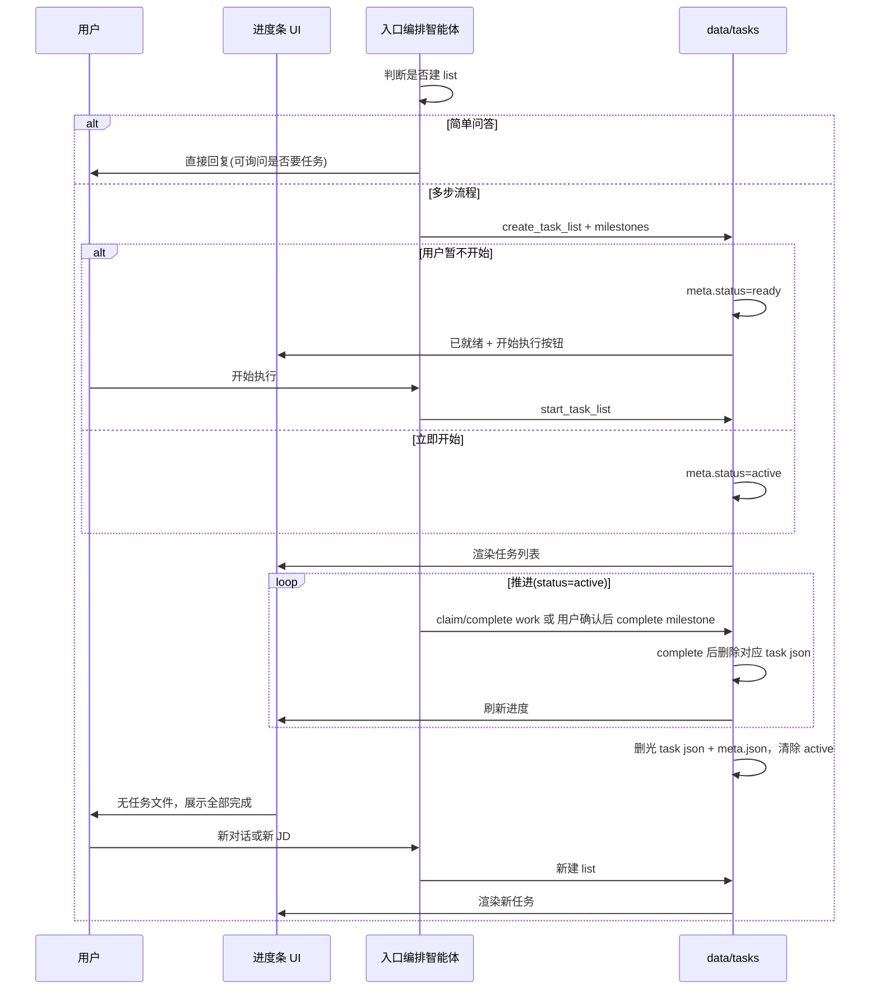

# 机制 · 任务系统 — 产品需求文档

| 属性 | 内容 |
|------|------|
| 文档类型 | 机制 PRD |
| 父文档 | [00. 职业规划 Agent PRD](./00.%20职业规划%20Agent%20PRD.md) |
| 对应章节 | 原 [A02 机制 · 任务系统](./A02.%20机制-任务系统%20PRD.md) |
| 文档版本 | v0.10 |
| 最后更新 | 2026-05-22 |

---

### 5.8 任务系统（Task System / 运行框架）

> 设计参考：[learn-claude-code s12_task_system](https://github.com/shareAI-lab/learn-claude-code/tree/main/s12_task_system)（持久化 JSON、`blockedBy`、`pending → in_progress → completed`）。本项目在 s12 基础上增加：**动态建图**、**milestone/work 分层**、**按文件删除任务**、**以是否存在任务文件判定完成态**（不保留完成后的 `meta.json`）。

#### 5.8.1 定位与职责划分

| 存储 | 职责 |
|------|------|
| `profile.json` | 业务长期记忆（初探、career、`resume.source_path`、标签等） |
| `data/tasks/{list_id}/` | **流程进度**：当前在做什么、依赖顺序、可审计执行记录 |

任务系统对用户是 **进度条**；对 智能体是 **先计划再执行** 的硬约束（有可审计的 `claim/complete` 轨迹）。

**编排与子智能体分工**

- **入口编排智能体**：判断是否建 list、创建 **milestone**、用户确认闸门、`load_skill`、将阶段 **路由/指派** 给对应子智能体；**不** 代做领域内的 `work` 细拆与专业执行（分析、策略、简历改写等）。
- **领域智能体**：承接指派后，自行决定是否追加 `work`、如何拆分步骤，并 `claim` / `complete`（可协作其它子智能体，如简历智能体 + 资产智能体）。

#### 5.8.2 何时创建任务（动态，非固定模板）

- **不创建**：入口编排智能体判断为 **简单问答**（如单次概念咨询）。核心版本仅由智能体判断；可在对话中询问用户「是否需要拆成任务跟进」（**不强制**，后续可优化规则）。
- **创建**：涉及多步流程时，在对话中 **动态** `create_task` / `create_task_list`；`list_id` 由系统生成（如 `list_7f3a9c2e`），**与业务类型解耦**，**禁止** 用 `explore_` / `jd_` / `plan_` 等前缀编码类型。业务类型写入 `list_type` 字段（`meta.json` 与各 `{task_id}.json` 均须携带），例如：
  - 用户 **确认进入深度探讨且表单已提交** → `list_type: explore`
  - 某次粘贴的 JD → `list_type: jd`（`related_jd_fingerprint` 关联该 JD）
  - 纯规划探讨 → `list_type: plan`

**单活跃 list**：同一时刻至多一个 `meta.status = active` 的 list。该 list **完成或放弃** 前，不得将另一 list 置为 `active`（用户放弃 `active` 后可立即新建或启动其它 list）。

**列表生命周期（`meta.status`）**

| 状态 | 含义 | 智能体推进 | 典型触发 |
|------|------|------------|----------|
| `ready` | **已就绪**：任务/milestone 已创建，用户 **暂不开始** | **禁止** `claim_task` / `complete_task`（可对话、可 `list_tasks`） | `create_task_list` 后用户选择「稍后开始」；或编排默认先落盘计划 |
| `active` | **进行中** | 按 [§5.8.5](./A02.%20机制-任务系统%20PRD.md#585-工具与状态机强约束) 强约束推进 | 用户点击「开始执行」或明确表示立即开始（`ready` → `active`） |

**正常结束** 不设 `meta.status = completed`：list 内最后一条任务 `complete` 后，删除 **全部** `{task_id}.json` **与** `meta.json`，并清除 `_active.json`（若启用）。此后进入 **全部完成** 展示（判定见 [§5.8.7](./A02.%20机制-任务系统%20PRD.md#587-前端进度条-ui)）。

**用户放弃**：删除该 list 下全部 `{task_id}.json` **与** `meta.json`，清除 `_active.json`；展示规则同 **全部完成**。

- `ready` 与 `active` 的 list **均可** 同时存在于磁盘（例如一个 JD 计划待开始、用户先去闲聊）；仅 **`active`** 占用「当前执行」槽位并写入 `_active.json`（若启用）。
- 存在 `active` list 时，**不得** 将其它 list 直接置为 `active`，须先完成/放弃当前 `active`，或将当前 list 退回 `ready`（若产品支持「暂停」，实现阶段可选；核心版本可仅支持完成/放弃）。

#### 5.8.3 任务类型

| 类型 | `kind` | 完成方式 | 示例 |
|------|--------|----------|------|
| **大步骤** | `milestone` 里程碑 | 对话中与用户对齐后，用户确认 → 智能体调用 `complete_task` | 规划探讨落档、JD 录入、JD 分析确认、确认按 JD 优化 |
| **小步骤** | `work` | 智能体在 推理-行动循环 内自动 `claim` → `complete`，**无需**用户逐步确认 | 优化简历「工作经历」段、优化「项目」段、生成 HTML |

大步骤未完成时，依赖它的 `work` 任务 `can_start = false`（`blockedBy` 指向 milestone 或前序任务）。

**简历优化**：用户确认里程碑「按 JD 优化简历」并 **多选档位** 后，入口编排智能体 **仅路由**——完成该 milestone 的闸门并 **指派** 给 **简历智能体**（`load_skill("resume-module-optimize")`）。**如何优化、是否按模块/档位拆分为多条 `work`、逐条 claim/complete** 均由 **简历智能体** 负责；**资产智能体** 在正文就绪后负责 HTML 落盘、命名与 `outputs_index`（不替代简历智能体的拆分与改写决策）。

#### 5.8.4 存储结构

> 下列 JSON 中 `//` 为 **中文含义备注**（文档说明用）；落盘文件须为合法 JSON，**不得** 含 `//` 注释。

**目录布局**

```text
data/tasks/{list_id}/          # 单次流程目录；list_id 为中性 ID（如 list_7f3a9c2e），不含业务类型前缀
  meta.json                    # 仅 ready/active 期间存在；list 结束或放弃后删除
  {task_id}.json               # 单条任务；complete 后删除该文件
data/tasks/_active.json        # 可选：全局当前 active 的 list_id 指针（单活跃 list，[A02 机制 · 任务系统](./A02.%20机制-任务系统%20PRD.md).2）
```

**`meta.json` 建议字段**：

```json
{
  "list_id": "list_7f3a9c2e",          // 任务列表 ID，与目录名一致；与 list_type 无关
  "list_type": "jd",                   // 业务流类型：explore（初探/复盘）| jd（某 JD 全流程）| plan（纯规划）
  "status": "ready",                   // 列表生命周期：ready（已就绪）| active（进行中）；结束/放弃后删除本文件
  "ui_phase": "ready_display",         // ready 时 ready_display；active 时 in_progress
  "created_at": "2026-05-22T10:00:00Z", // 创建时间（ISO8601）
  "related_jd_fingerprint": "optional" // list_type=jd 时建议填写，便于与 profile / outputs 对齐
}
```

| `meta.json` 字段 | 中文含义 | 取值说明 |
|------------------|----------|----------|
| `list_id` | 任务列表标识 | 中性 ID，与目录名一致；**不** 承载业务类型语义 |
| `list_type` | 业务流类型 | `explore` \| `jd` \| `plan`（与 `list_id` 分离，见各任务 JSON） |
| `status` | 列表生命周期 | `ready` \| `active`（磁盘上仅这两种；结束即删 `meta.json`） |
| `ui_phase` | 前端进度条（有 meta 时） | `ready_display` \| `in_progress` |
| `created_at` | 创建时间 | ISO8601 |
| `related_jd_fingerprint` | 关联 JD 指纹 | 可选；`list_type = jd` 时建议填写 |

**`_active.json`（可选）建议字段**：

```json
{
  "active_list_id": "list_7f3a9c2e"      // 当前 status=active 的 list_id；无 active 时为空；ready 列表不入此字段
}
```

**单任务 `{task_id}.json` 建议字段**（在 s12 基础上扩展）：

```json
{
  "id": "task_m1",                       // 任务 ID，与文件名 {task_id}.json 一致
  "list_id": "list_7f3a9c2e",           // 所属任务列表 ID（中性 ID）
  "list_type": "jd",                     // 业务流类型，与所属 list 的 meta.list_type 一致
  "kind": "milestone",                   // 任务层级：milestone（大步骤，须用户确认后 complete）| work（小步骤，智能体自动 claim/complete）
  "subject": "机会分析",                  // 任务标题（进度条展示）
  "description": "...",                // 任务说明（get_task 恢复上下文时读取）
  "status": "pending",                   // 任务状态：pending | in_progress | completed（complete 后删文件，磁盘上可能不再保留）
  "owner": "agent",                      // 负责人（核心版本固定 agent；多专家分别认领暂缓）
  "blockedBy": ["task_..."],             // 前置依赖任务 ID 列表；未满足时 can_start=false
  "requires_user_confirm": true,         // 是否须用户显式确认后才能 complete（milestone 通常为 true）
  "metadata": {}                         // 扩展元数据（见下表）
}
```

| 单任务字段 | 中文含义 | 说明 |
|------------|----------|------|
| `id` | 任务 ID | 与 `{task_id}.json` 文件名一致 |
| `list_id` | 所属列表 | 冗余存储，便于跨目录扫描 |
| `list_type` | 业务流类型 | `explore` \| `jd` \| `plan`；与 `meta.list_type` 一致；**类型语义在此字段，不在 list_id** |
| `kind` | 任务层级 | `milestone`：对话对齐 + 用户确认后完成；`work`：推理-行动循环内自动推进 |
| `subject` | 任务标题 | 进度条 / 列表主文案 |
| `description` | 任务说明 | 执行前 `get_task` 恢复的完整指令与上下文 |
| `status` | 执行状态 | `pending` → `in_progress`（claim）→ `completed`（complete 后删文件） |
| `owner` | 负责人 | 核心版本固定 `"agent"` |
| `blockedBy` | 前置依赖 | 指向须先完成的任务 ID；父级 milestone 未完成则子 work 不可 claim |
| `requires_user_confirm` | 须用户确认 | `true` 时 complete 前须有[00 附录 B](./00.%20职业规划%20Agent%20PRD.md#附录-b确认话术建议) 类确认话术 |
| `metadata` | 扩展元数据 | 实现可选键，见下表 |

| `metadata` 常见扩展键（可选） | 中文含义 |
|-------------------------------|----------|
| `optimization_level` | 简历优化语义档位：`保守` \| `标准` \| `进取`（生成 HTML 类 work） |
| `jd_fingerprint` | 本任务关联 JD 指纹 |
| `skill_name` | 绑定的技能包名（如 `career-jd-alignment`、`resume-module-optimize`） |
| `module` | 简历模块名（如「工作经历」「项目经历」，work 拆分用） |

核心版本：负责人字段 `owner` 固定为 `"agent"`（实现层标识，多专家分别认领暂缓）。

#### 5.8.5 工具与状态机（强约束）

与 s12 同构的任务工具集（实现名可调整，含 `start_task_list`）：

| 工具 | 用途 |
|------|------|
| `create_task` / `create_task_list` | 动态建 list 与任务；`create_task_list` **须** 传入 `list_type` 并生成中性 `list_id`；每条 `create_task` **须** 写入与同 list 一致的 `list_type`；`meta.status` 通常为 `ready` 或 `active`（见 [§5.8.2](./A02.%20机制-任务系统%20PRD.md#582-何时创建任务动态非固定模板)） |
| `start_task_list` | `ready` → `active`；写入 `_active.json`（若启用）；**须** 无其它 `active` list |
| `list_tasks` | 列出当前 list 下任务（含 blocked 状态） |
| `get_task` | 恢复执行时读完整 description |
| `claim_task` | `pending` → `in_progress`；须 `can_start` |
| `complete_task` | `in_progress` → `completed`；完成后 **删除该任务的 JSON 文件** |

**强约束规则**：

1. `meta.status = ready` 时：**禁止** `claim_task` / `complete_task`；仅允许查看任务、对话、等待用户 `start_task_list`。
2. 存在 `active` list 时，智能体**只能**在该 list 内通过 claim/complete 推进已规划任务（禁止无任务硬跳阶段）。
3. 执行 `work` 前，其父级 `milestone` 里程碑 须已 `completed`（文件已删且依赖满足）。
4. `complete_task` 对 `milestone` 里程碑：须在用户确认话术（[00 附录 B](./00.%20职业规划%20Agent%20PRD.md#附录-b确认话术建议)）之后方可调用。

#### 5.8.6 任务完成与删除（按文件，非删目录）

| 事件 | 磁盘行为                                               | 说明 |
|------|----------------------------------------------------|------|
| 单任务 `complete` | **删除** `data/tasks/{list_id}/{task_id}.json`       | 不采用「整目录 rm」 |
| list 内全部任务完成 | 删除该 list 下 **全部** `{task_id}.json` **与** `meta.json`；清除 `_active.json` | 可选删除空目录 `{list_id}/`；业务结果已在 `profile.json` / `output/` |
| 用户放弃 list | 同上（任务文件 + `meta.json` 全删） | 释放 active 槽位 |
| 用户开始执行 | 更新 `meta.status = active`，`ui_phase = in_progress` | 调用 `start_task_list`；写入 `_active.json` |

#### 5.8.7 前端进度条 UI

**完成态判定（唯一规则）**：在约定扫描范围内（默认 `data/tasks/**`，或当前 `_active.json` 指向的 list 目录），若 **不存在** 任何 `{task_id}.json`（**不含** `meta.json`、`_active.json`），则 UI 为 **「全部任务已完成」**。

| 磁盘情况 | 渲染 |
|----------|------|
| **无任何** `{task_id}.json`（含：从未建 list、list 已跑完并删光、用户放弃后删光） | **「全部任务已完成」** |
| 存在 `meta.json` 且 `status = ready`（同时有 `{task_id}.json`） | 任务列表（只读计划）+ **「开始执行」** |
| 存在 `meta.json` 且 `status = active`（同时有 `{task_id}.json`） | 任务列表 / 进度条（milestone 为主轴，work 可折叠） |
| **`create_task_list` 成功**（出现 `{task_id}.json`） | 退出完成态，渲染新 list |

> 不依赖 `meta.ui_phase = all_completed`；**有无任务文件** 即完成态与进行中的分界。初启无任务与流程跑完无任务，对用户均为同一完成态文案。

#### 5.8.8 与 PRD 主路径的映射（示例，非固定）

智能体按对话 **动态** 创建，下表仅为常见形态：

| 场景 | `list_type` | 典型 milestone | 典型 work（确认后动态追加） |
|------|-------------|----------------|----------------------------|
| 职业初探 / 复盘 | `explore` | 初探落档（`career-inner-exploration`） | — |
| 某 JD 全流程 | `jd` | JD 录入 → 市场/岗位分析 → 职业战略与投递策略（`career-jd-alignment`）→ 确认优化 | 简历智能体确认优化后 **自行创建** 的 `work`（`resume-module-optimize`）；资产智能体负责 HTML/索引 |
| 纯规划 | `plan` | 探讨落档 | — |

初探 milestone 完成并落档 `exploration.*` 后，可结束该 `list_type=explore` 的 list（删光 `{task_id}.json` 与 `meta.json`）。用户粘贴 JD 时 **新建** 一条 `list_type=jd` 的 list（新 `list_id`）。

#### 5.8.9 运行时序（Task、UI 与入口编排智能体）

与 [A02 机制 · 任务系统](./A02.%20机制-任务系统%20PRD.md).2（何时建 list）、[A02 机制 · 任务系统](./A02.%20机制-任务系统%20PRD.md).7（进度条 UI）配合，描述入口编排智能体与 `data/tasks`、前端的协作顺序。`work` 的细拆与 claim/complete 由 **被指派的领域智能体** 执行（入口编排智能体只建 list / milestone 并路由）。



#### 5.8.10 放弃与切换

- 用户放弃当前 JD / 流程（`ready` 或 `active`）：删除该 list 下 **全部** `{task_id}.json` 与 `meta.json`，清除 `_active.json`（与正常结束相同，完成态由「无任务文件」判定）。
- 之后可立即：新建另一条 `list_type=jd`（另一 JD）或 `list_type=plan` 的 list 等。

---
---

## 相关 PRD

- [机制 · 技能包](./A03.%20机制-技能包%20PRD.md)
- [流程 · 对话入口与建档](./B01.%20流程-对话入口与建档%20PRD.md)
- [流程 · 职业初探](./B02.%20流程-职业初探%20PRD.md)


*文档结束*
