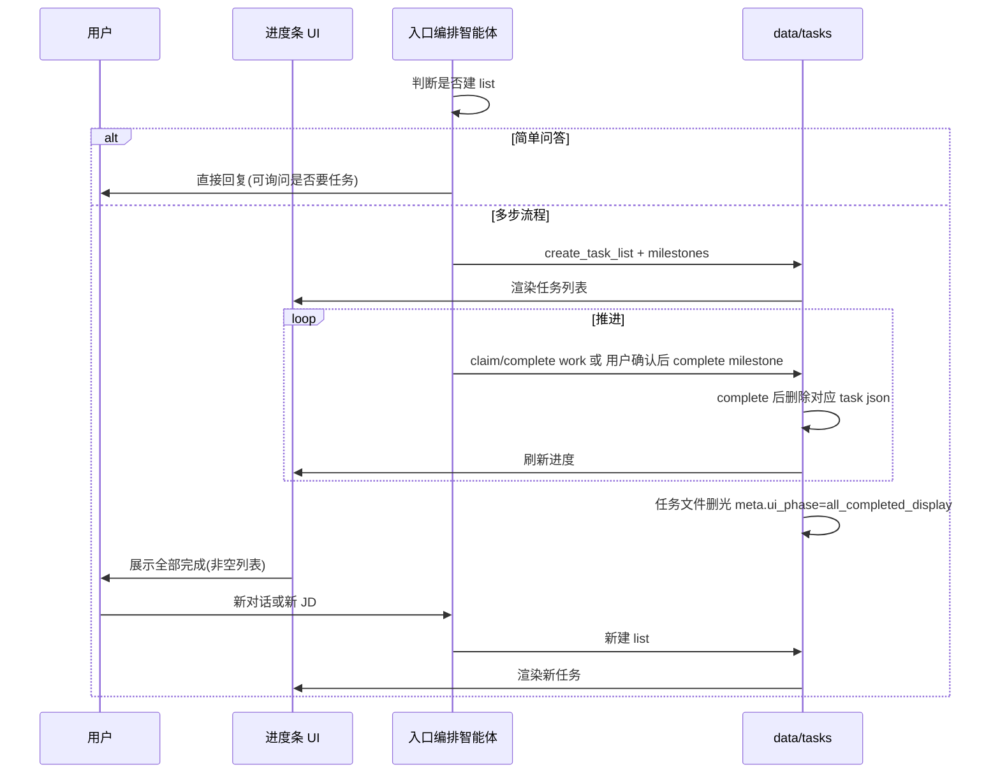

# 机制 · 任务系统 — 产品需求文档

| 属性 | 内容 |
|------|------|
| 文档类型 | 机制 PRD |
| 父文档 | [00. 职业规划 Agent PRD](./00.%20职业规划%20Agent%20PRD.md) |
| 对应章节 | 原 [A02 机制 · 任务系统](./A02.%20机制-任务系统%20PRD.md) |
| 文档版本 | v0.10 |
| 最后更新 | 2026-05-22 |

---

### 5.8 任务系统（Task System / 运行框架）

> 设计参考：[learn-claude-code s12_task_system](https://github.com/shareAI-lab/learn-claude-code/tree/main/s12_task_system)（持久化 JSON、`blockedBy`、`pending → in_progress → completed`）。本项目在 s12 基础上增加：**动态建图**、**milestone/work 分层**、**按文件删除任务**、**前端完成态占位**。

#### 5.8.1 定位与职责划分

| 存储 | 职责 |
|------|------|
| `profile.json` | 业务长期记忆（初探、career、简历原文、标签等） |
| `data/tasks/{list_id}/` | **流程进度**：当前在做什么、依赖顺序、可审计执行记录 |

任务系统对用户是 **进度条**；对 智能体是 **先计划再执行** 的硬约束（有可审计的 `claim/complete` 轨迹）。

#### 5.8.2 何时创建任务（动态，非固定模板）

- **不创建**：入口编排智能体判断为 **简单问答**（如单次概念咨询）。核心版本仅由智能体判断；可在对话中询问用户「是否需要拆成任务跟进」（**不强制**，后续可优化规则）。
- **创建**：涉及多步流程时，在对话中 **动态** `create_task` / `create_task_list`，例如：
  - 用户 **确认进入深度探讨且表单已提交** → `explore_{id}`
  - 某次粘贴的 JD → `jd_{jd_fingerprint}`
  - 纯规划探讨 → `plan_{id}`

**单活跃 list**：同一时刻仅一个 `meta.status = active` 的 list。当前 list 未结束前，须 **完成或放弃** 后才能创建下一 list（用户放弃后可立即新建另一 JD / 规划 list）。

#### 5.8.3 任务类型

| 类型 | `kind` | 完成方式 | 示例 |
|------|--------|----------|------|
| **大步骤** | `milestone` 里程碑 | 对话中与用户对齐后，用户确认 → 智能体调用 `complete_task` | 规划探讨落档、JD 录入、JD 分析确认、确认按 JD 优化 |
| **小步骤** | `work` | 智能体在 推理-行动循环 内自动 `claim` → `complete`，**无需**用户逐步确认 | 优化简历「工作经历」段、优化「项目」段、生成 HTML |

大步骤未完成时，依赖它的 `work` 任务 `can_start = false`（`blockedBy` 指向 milestone 或前序任务）。

**简历优化**：用户确认里程碑「按 JD 优化简历」并 **多选档位** 后，入口编排智能体**当场拆分** 多条 `work`（按简历模块，且须覆盖 **每一所选档位** 的 HTML 落盘），再由简历智能体 / 资产智能体自动执行完毕。

#### 5.8.4 存储结构

> 下列 JSON 中 `//` 为 **中文含义备注**（文档说明用）；落盘文件须为合法 JSON，**不得** 含 `//` 注释。

**目录布局**

```text
data/tasks/{list_id}/          # 单次流程的任务列表目录（list_id 如 explore_xxx、jd_xxx、plan_xxx）
  meta.json                    # 本 list 元信息（类型、生命周期、进度条 UI 阶段）
  {task_id}.json               # 单条任务；complete 后删除该文件（不删整个 list 目录）
data/tasks/_active.json        # 可选：全局当前 active 的 list_id 指针（单活跃 list，[A02 机制 · 任务系统](./A02.%20机制-任务系统%20PRD.md).2）
```

**`meta.json` 建议字段**：

```json
{
  "list_id": "jd_abc123",              // 任务列表 ID，与目录名一致
  "type": "jd",                        // 列表类型：explore（初探/复盘）| jd（某 JD 全流程）| plan（纯规划）
  "status": "active",                  // 列表生命周期：active（进行中）| completed（正常结束）| abandoned（用户放弃）
  "ui_phase": "in_progress",           // 进度条 UI 阶段：in_progress（有任务文件或进行中）| all_completed_display（任务文件已删光，展示「全部完成」占位）
  "created_at": "2026-05-22T10:00:00Z", // 创建时间（ISO8601）
  "related_jd_fingerprint": "optional" // 关联 JD 指纹（jd 类型 list 可选，便于与 profile / outputs 对齐）
}
```

| `meta.json` 字段 | 中文含义 | 取值说明 |
|------------------|----------|----------|
| `list_id` | 任务列表标识 | 与 `data/tasks/{list_id}/` 目录名一致 |
| `type` | 列表业务类型 | `explore` \| `jd` \| `plan` |
| `status` | 列表生命周期 | `active` \| `completed` \| `abandoned` |
| `ui_phase` | 前端进度条展示阶段 | `in_progress` \| `all_completed_display` |
| `created_at` | 创建时间 | ISO8601 |
| `related_jd_fingerprint` | 关联 JD 指纹 | 可选；`jd_*` list 建议填写 |

**`_active.json`（可选）建议字段**：

```json
{
  "active_list_id": "jd_abc123"          // 当前唯一进行中的 list_id；放弃或完成后清空或指向新 list
}
```

**单任务 `{task_id}.json` 建议字段**（在 s12 基础上扩展）：

```json
{
  "id": "task_m1",                       // 任务 ID，与文件名 {task_id}.json 一致
  "list_id": "jd_abc123",                // 所属任务列表 ID
  "kind": "milestone",                   // 任务层级：milestone（大步骤，须用户确认后 complete）| work（小步骤，智能体自动 claim/complete）
  "subject": "机会分析",                  // 任务标题（进度条展示）
  "description": "...",                // 任务说明（get_task 恢复上下文时读取）
  "status": "pending",                   // 任务状态：pending | in_progress | completed（complete 后删文件，磁盘上可能不再保留）
  "owner": "agent",                      // 负责人（核心版本固定 agent；多专家分别认领暂缓）
  "blockedBy": ["task_..."],             // 前置依赖任务 ID 列表；未满足时 can_start=false
  "requires_user_confirm": true,         // 是否须用户显式确认后才能 complete（milestone 通常为 true）
  "metadata": {}                         // 扩展元数据（见下表）
}
```

| 单任务字段 | 中文含义 | 说明 |
|------------|----------|------|
| `id` | 任务 ID | 与 `{task_id}.json` 文件名一致 |
| `list_id` | 所属列表 | 冗余存储，便于跨目录扫描 |
| `kind` | 任务层级 | `milestone`：对话对齐 + 用户确认后完成；`work`：推理-行动循环内自动推进 |
| `subject` | 任务标题 | 进度条 / 列表主文案 |
| `description` | 任务说明 | 执行前 `get_task` 恢复的完整指令与上下文 |
| `status` | 执行状态 | `pending` → `in_progress`（claim）→ `completed`（complete 后删文件） |
| `owner` | 负责人 | 核心版本固定 `"agent"` |
| `blockedBy` | 前置依赖 | 指向须先完成的任务 ID；父级 milestone 未完成则子 work 不可 claim |
| `requires_user_confirm` | 须用户确认 | `true` 时 complete 前须有[00 附录 B](./00.%20职业规划%20Agent%20PRD.md#附录-b确认话术建议) 类确认话术 |
| `metadata` | 扩展元数据 | 实现可选键，见下表 |

| `metadata` 常见扩展键（可选） | 中文含义 |
|-------------------------------|----------|
| `optimization_level` | 简历优化语义档位：`保守` \| `标准` \| `进取`（生成 HTML 类 work） |
| `jd_fingerprint` | 本任务关联 JD 指纹 |
| `skill_name` | 绑定的技能包名（如 `career-jd-alignment`、`resume-module-optimize`） |
| `module` | 简历模块名（如「工作经历」「项目经历」，work 拆分用） |

核心版本：负责人字段 `owner` 固定为 `"agent"`（实现层标识，多专家分别认领暂缓）。

#### 5.8.5 工具与状态机（强约束）

与 s12 同构的五类能力（实现名可调整）：

| 工具 | 用途 |
|------|------|
| `create_task` / `create_task_list` | 对话中动态建 list 与任务 |
| `list_tasks` | 列出当前 list 下任务（含 blocked 状态） |
| `get_task` | 恢复执行时读完整 description |
| `claim_task` | `pending` → `in_progress`；须 `can_start` |
| `complete_task` | `in_progress` → `completed`；完成后 **删除该任务的 JSON 文件** |

**强约束规则**：

1. 存在 `active` list 时，智能体**只能**通过 claim/complete 推进已规划任务（禁止无任务硬跳阶段）。
2. 执行 `work` 前，其父级 `milestone` 里程碑 须已 `completed`（文件已删且依赖满足）。
3. `complete_task` 对 `milestone` 里程碑：须在用户确认话术（[00 附录 B](./00.%20职业规划%20Agent%20PRD.md#附录-b确认话术建议)）之后方可调用。

#### 5.8.6 任务完成与删除（按文件，非删目录）

| 事件 | 磁盘行为 | 说明 |
|------|----------|------|
| 单任务 `complete` | **删除** `data/tasks/{list_id}/{task_id}.json` | 不采用「整目录 rm」 |
| list 内全部任务完成 | 删除所有剩余 `{task_id}.json`；**保留** `meta.json` | 更新 `meta.status = completed`，`meta.ui_phase = all_completed_display` |
| 用户放弃 list | 逐个删除该 list 下任务文件；更新 `meta.status = abandoned` | 释放 active，允许新建其他 list |

#### 5.8.7 前端进度条 UI

| 状态 | 渲染 |
|------|------|
| 无 `data/tasks` 或无可展示 list | **不展示** 任务区域 |
| 存在任务文件 | 展示任务列表 / 进度条（milestone 为主轴，work 可折叠） |
| 任务文件已全部删除且 `ui_phase = all_completed_display` | 展示 **「全部任务已完成」** 完成态（**不**渲染空列表） |
| **新对话开始** 或 **新 list 创建成功** | 清除完成态占位，渲染新 list 任务 |

> 后端在任务删光后立即落盘 `meta.ui_phase`；前端读取 meta 决定完成态，避免闪空列表。

#### 5.8.8 与 PRD 主路径的映射（示例，非固定）

智能体按对话 **动态** 创建，下表仅为常见形态：

| 场景 | `list_id` | 典型 milestone | 典型 work（确认后动态追加） |
|------|-----------|----------------|----------------------------|
| 职业初探 / 复盘 | `explore_*` | 初探落档（`career-inner-exploration`） | — |
| 某 JD 全流程 | `jd_*` | JD 录入 → 市场/岗位分析 → 职业战略与投递策略（`career-jd-alignment`）→ 确认优化 | 简历各段（`resume-module-optimize`）、生成 HTML |
| 纯规划 | `plan_*` | 探讨落档 | — |

初探 milestone 完成并落档 `exploration.*` 后，可结束 `explore_*` list（任务文件删光 + meta 完成态）。用户粘贴 JD 时 **新建** `jd_*` list。

#### 5.8.9 运行时序（Task、UI 与入口编排智能体）

与 [A02 机制 · 任务系统](./A02.%20机制-任务系统%20PRD.md).2（何时建 list）、[A02 机制 · 任务系统](./A02.%20机制-任务系统%20PRD.md).7（进度条 UI）配合，描述入口编排智能体与 `data/tasks`、前端的协作顺序：



#### 5.8.10 放弃与切换

- 用户放弃当前 JD / 流程：删除该 list 下**各任务文件**，更新 `meta.status = abandoned`，清除 active。
- 之后可立即：新建另一 `jd_*`（另一 JD 优化）或 `plan_*`（规划探讨）等。

---
---

## 相关 PRD

- [机制 · 技能包](./A03.%20机制-技能包%20PRD.md)
- [流程 · 对话入口与建档](./B01.%20流程-对话入口与建档%20PRD.md)
- [流程 · 职业初探](./B02.%20流程-职业初探%20PRD.md)


*文档结束*
