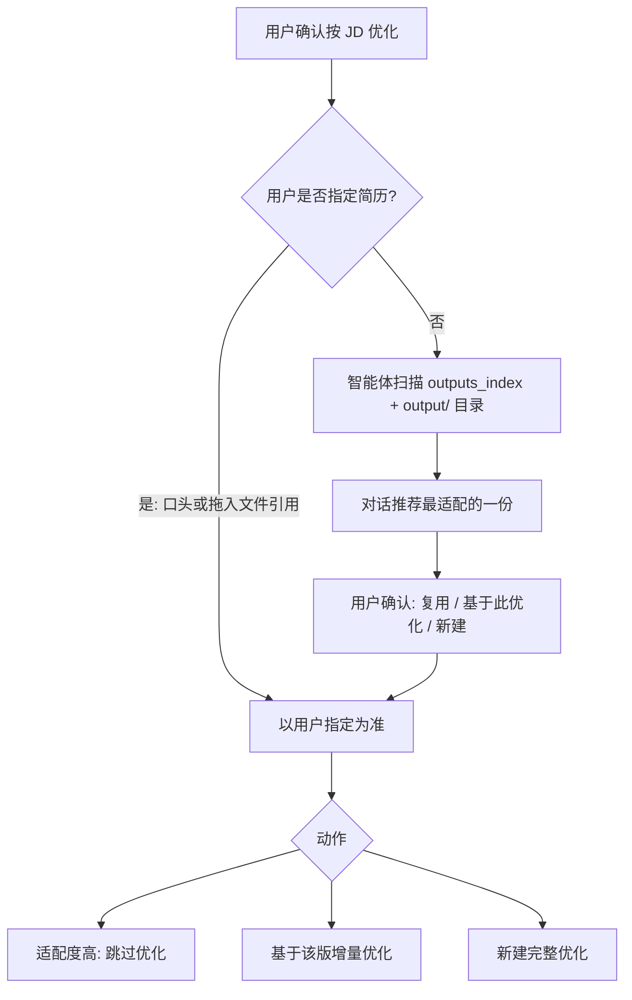

# 流程 · 简历复用 — 产品需求文档

| 属性 | 内容 |
|------|------|
| 文档类型 | 流程 PRD |
| 父文档 | [00. 职业规划 Agent PRD](./00.%20职业规划%20Agent%20PRD.md) |
| 对应章节 | 原 [B05 流程 · 简历复用](./B05.%20流程-简历复用%20PRD.md)（主路径第 7 步） |
| 文档版本 | v0.10 |
| 最后更新 | 2026-05-22 |

---

### 5.6 已有简历复用

| 规则 | 说明 |
|------|------|
| 用户指定 | 支持在聊天框 **拖入** 已有 HTML 文件引用；优先级最高 |
| 智能体推荐 | 结合 JD 指纹、标签、日期、匹配分推荐；**须用户确认** |
| 跳过优化 | 当现有简历已充分适配，用户可选择不生成新文件（**所有** 已选档位均不生成） |
| 增量优化 | 以选定版本为基底；用户多选 N 档时，**各档各生成一份** HTML，分别应用对应档位规则 |

复用或新建后，由 资产智能体更新 `outputs_index[]` 与 `profile.json` 的 `meta.updated_at`。

用户通过管理页 **删除** 简历后，资产智能体须从 `outputs_index[]` 移除对应项，避免后续继续推荐已删文件。
---

## 相关 PRD

- [流程 · 职业战略与投递策略](./B04.%20流程-职业战略与投递策略%20PRD.md)
- [流程 · 简历优化](./B06.%20流程-简历优化%20PRD.md)
- [机制 · 职业档案](./A01.%20机制-职业档案%20PRD.md)

*文档结束*
