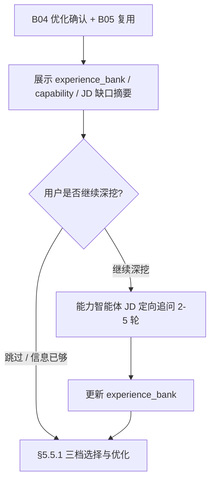

# 流程 · 简历优化 — 产品需求文档

| 属性 | 内容 |
|------|------|
| 文档类型 | 流程 PRD |
| 父文档 | [00. 职业规划 Agent PRD](./00.%20职业规划%20Agent%20PRD.md) |
| 对应章节 | 原 [B06 流程 · 简历优化](./B06.%20流程-简历优化%20PRD.md)（主路径第 8 步） |
| 文档版本 | v0.11 |
| 最后更新 | 2026-05-29 |

---

### 5.5 简历优化与优化程度

**前置条件**：已完成 [B04 [B04 流程 · 职业战略与投递策略](./B04.%20流程-职业战略与投递策略%20PRD.md).3](./B04.%20流程-职业战略与投递策略%20PRD.md#543-优化确认的定义) **优化确认**，且已完成 [B05 流程 · 简历复用](./B05.%20流程-简历复用%20PRD.md) 复用判断（若适用）。在进入 [§5.5.1](./B06.%20流程-简历优化%20PRD.md#551-三档选项可多选--通用优化与针对-jd-优化共用) 三档选择与模块化改写 **之前**，须完成 [§5.5.0](./B06.%20流程-简历优化%20PRD.md#550-jd-后经历素材补齐可选深挖)（用户可跳过）。

简历智能体须同时读取基线简历 Markdown（`resume.source_path`）、**`resume.experience_bank`**（初探及 JD 后追问素材）、`capability.*`、`market.*` 与 `exploration` / `career` / `strategy`；在 **标准/进取** 档位下 **优先** 从 `experience_bank` 和能力资产中选取经用户确认的事实补入模块，禁止凭空添加未在 bank 与对话中出现的内容。

#### 5.5.0 JD 后经历素材补齐（可选深挖）

针对 **当前 JD** 的简历优化前，对「简历未体现、但 JD/策略需要证据」的经历素材做 **可选** 补充。与 [B02 §5.2.2.1](./B02.%20流程-职业初探%20PRD.md#5221-简历深度追问要求) 初探深挖 **互补**：初探建库，本段按 **JD 缺口** 定向补采，**不** 重跑五主题。

| 项 | 要求 |
|----|------|
| **时机** | [B04](./B04.%20流程-职业战略与投递策略%20PRD.md) 优化确认 + [B05](./B05.%20流程-简历复用%20PRD.md) 复用判断之后；**三档多选与 `work` 拆分之前** |
| **主持** | 入口编排智能体或简历智能体 **展示**；**能力智能体** 评估缺口并执行追问（**不** 加载 `career-inner-exploration` 完整清单） |
| **步骤 1：展示已知** | 对话中结构化呈现 **当前已有信息**（须用户可见后再选）：`resume.experience_bank`（`items[]` 要点 + `narrative_summary` 摘要）、`capability.*` 与 JD 相关的要点、本 JD 的匹配/缺口摘要（来自 [B03](./B03.%20流程-市场岗位分析%20PRD.md) 评估或当轮策略结论，若有）、基线简历 Markdown 已覆盖的关键经历（2–4 句，非全文粘贴） |
| **步骤 2：是否深挖** | 能力智能体对照 **本 JD + 拟优化档位倾向**（若用户尚未选档，按「可能选标准/进取」评估）判断素材是否 **足以支撑** 改写；**无论** 系统判断是否足够，均须 **询问用户** 是否继续深挖（对话确认，[00 附录 B](./00.%20职业规划%20Agent%20PRD.md#附录-b确认话术建议)） |
| **用户选择：跳过** | 用户表示信息已够、直接优化（见附录 B）→ **不** 新增追问，进入 §5.5.1 |
| **用户选择：深挖** | 走 **JD 定向短路径**（一次一问，建议 **2–5 轮**）：聚焦 JD 必备项/投递叙事缺口、简历未写清项、未写入 `experience_bank` 的可证明成果；禁止虚构；逐条确认后 **合并** 写入 `experience_bank.items[]`，`source` 为 `jd_optimize`（见 [A01](./A01.%20机制-职业档案%20PRD.md)） |
| **落档** | 有新增则更新 `narrative_summary`（用户确认）；无新增须在对话说明「沿用既有 bank」 |
| **与初探关系** | 初探阶段 **必须** 执行的简历深挖见 B02；本段 **可跳过**，不得因跳过而阻塞优化 |

#### 5.5.1 三档选项（可多选 · 通用优化与针对 JD 优化共用）

每轮优化前，以 **多选** 方式让用户勾选一种或多种 **语义档位**（**至少选 1 项**）：`保守`、`标准`、`进取`；默认勾选上次选择（档案 `resume.last_optimization_levels[]`，见 [A01 §5.1.6](./A01.%20机制-职业档案%20PRD.md#516-profilejson-结构纲要)）。对话与 UI 展示档位名称；文件名后缀、`optimization_level`、任务元数据 **统一使用下表「语义后缀」列**，**不使用** `L1`/`L2`/`L3`。

| 语义档位 | 语义后缀（文件名、`optimization_level`） | 行为 |
|----------|---------------------------------------------|------|
| 保守 | `保守` | 措辞、结构、错别字；不新增未提供事实 |
| 标准 | `标准` | 在保守档基础上 + 情境-任务-行动-结果（STAR）重组 + 基于档案的量化表达 |
| 进取 | `进取` | 在标准档基础上 + 招聘系统关键词补强、可迁移能力突出；**禁止虚构** |

针对 JD / 机会的优化在 **同一三档规则** 下执行；每一被选档位各生成 **一份独立 HTML**，额外约束：须对齐 JD 中必备项表述和策略智能体已确认的投递叙事，但仍遵守红线。

**多选生成规则**：

| 项 | 规则 |
|----|------|
| 产物数量 | 用户勾选 N 个档位 → **同轮生成 N 份** 优化简历 HTML（如同时选 `保守`+`进取` 则产出 2 份） |
| 共用上下文 | 同一轮共用：档案、`experience_bank`、复用基底（[B05 流程 · 简历复用](./B05.%20流程-简历复用%20PRD.md)）、JD 指纹、策略投递叙事、文件名能力偏好标签（[A01 §5.1.5](./A01.%20机制-职业档案%20PRD.md#515-能力偏好标签用于文件名与推荐)） |
| 档位差异 | 各份 HTML **仅** 按对应档位规则改写正文；不得因多选而跨档混用规则（保守档文件不得含进取档才允许的夸大表述） |
| 文件区分 | 文件名 **必须** 含语义后缀 `-保守` / `-标准` / `-进取`（[B07 [B07 流程 · HTML 交付](./B07.%20流程-HTML%20交付%20PRD.md).3](./B07.%20流程-HTML%20交付%20PRD.md#573-文件命名)）；`outputs_index[].optimization_level` 取值为 `保守`\|`标准`\|`进取`，与文件一一对应 |
| 任务拆分 | **简历智能体** 在用户多选 N 档后 **`create_task` × N**（同一 `list_type=jd` list 内）；每条 `work` 带 `metadata.optimization_level`；**固定顺序** 保守 → 标准 → 进取，`blockedBy` 链式依赖；**一次** resume Run 内顺序 `write_resume_html` × N |
| 档位复用 | **标准** 可读保守档 structured 摘要；**进取** 可读标准档摘要（仅表述力度，不编造经历） |
| 对话说明 | 生成结束后，对话中 **按档位列表** 说明各版差异要点（1–2 句/档，非必须单独报告页） |

#### 5.5.2 产出物

- 每个被选档位各生成 **一份** 优化后简历 **HTML**（见 [B07 流程 · HTML 交付](./B07.%20流程-HTML%20交付%20PRD.md)）；同目录下可出现多份仅 `-保守`/`-标准`/`-进取` 后缀不同的文件。
- 简历智能体落盘每份 HTML 并产出 `html_deliveries`；资产智能体在协调者派工后 **登记** `outputs_index[]` 与 `index.html` 列表行（见 [架构 01 §4.3](../../architecture/01-协调者与Worker.md#43-html-交付协作resume-写盘--asset-登记)）。
- 修改说明可在对话中按档位简要给出；核心版本不要求单独 HTML 报告页。

---
---

## 相关 PRD

- [流程 · 简历复用](./B05.%20流程-简历复用%20PRD.md)
- [流程 · HTML 交付](./B07.%20流程-HTML%20交付%20PRD.md)
- [机制 · 技能包](./A03.%20机制-技能包%20PRD.md)

*文档结束*
