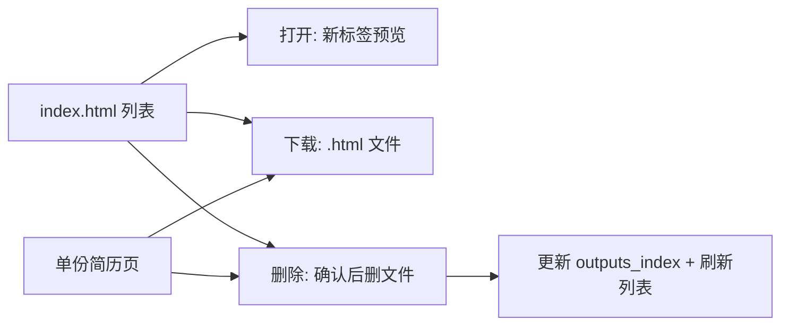

# 流程 · HTML 交付 — 产品需求文档

| 属性 | 内容 |
|------|------|
| 文档类型 | 流程 PRD |
| 父文档 | [00. 职业规划 Agent PRD](./00.%20职业规划%20Agent%20PRD.md) |
| 对应章节 | 原 [B07 流程 · HTML 交付](./B07.%20流程-HTML%20交付%20PRD.md) |
| 文档版本 | v0.10 |
| 最后更新 | 2026-05-22 |

---

### 5.7 HTML 交付

#### 5.7.1 生成范围

| 类型 | 是否生成 HTML |
|------|----------------|
| 优化后简历 | **是** |
| JD 适配报告 | **否**（对话 only） |
| 长期规划 | **否**（JSON only；顶栏渲染） |

#### 5.7.2 目录与会话

- 每次会话的简历 HTML 存放在 **同一目录**：`output/YYYY-MM-DD/`（同日多轮共用；若冲突可实现 `YYYY-MM-DD-2`，实现阶段注明）。
- 提供 **`index.html`**（简历列表 / 管理页）：扫描并列出该目录（及可选全局 `outputs_index`）下全部简历，支持 **打开、下载、删除**（见 [B07 [B07 流程 · HTML 交付](./B07.%20流程-HTML%20交付%20PRD.md).6](./B07.%20流程-HTML%20交付%20PRD.md#576-简历文件管理打开--下载--删除)）。

#### 5.7.3 文件命名

```text
{YYYY-MM-DD}-{能力偏好摘要}-{语义档位}.html
```

- `{能力偏好摘要}`：由 **大语言模型** 按 [A01 §5.1.5](./A01.%20机制-职业档案%20PRD.md#515-能力偏好标签用于文件名与推荐) 候选池与优先级动态选取（最多 3 个，`-` 连接），依据档案 + 当轮对话/JD 上下文；**同轮多档可共用同一摘要前缀**。
- `{语义档位}`：固定为 `保守` | `标准` | `进取`，与用户当轮勾选项一一对应（[B06 流程 · 简历优化](./B06.%20流程-简历优化%20PRD.md).1）；作为文件名最后一段，**不使用** `L1`/`L2`/`L3`。
- 示例：`2026-05-21-后端-云原生-高并发-标准.html`；同轮另选保守档时：`2026-05-21-后端-云原生-高并发-保守.html`

#### 5.7.4 页面结构

**单份简历 HTML 页**

1. **顶栏（只读）**：从 `profile.json` 渲染 — 基本信息、**初探摘要**（`exploration.summary`）、求职意向、**长期规划摘要**（当前能力 / 下一跳 / 3–5 年已选路径）。
2. **操作区**：下载、删除、返回列表（[B07 [B07 流程 · HTML 交付](./B07.%20流程-HTML%20交付%20PRD.md).6](./B07.%20流程-HTML%20交付%20PRD.md#576-简历文件管理打开--下载--删除)）。
3. **正文**：优化后简历内容（打印友好 CSS，`@media print`）。

**索引页 `index.html`**

1. 简历文件列表（文件名、**优化档位** 保守/标准/进取、生成时间、能力偏好摘要、可选关联 JD 摘要）。
2. 每行操作：打开、下载、删除。
3. 支持从列表进入任意简历页进行打印 PDF。

#### 5.7.5 打印 PDF

用户通过浏览器「打印 → 另存为 PDF」；PRD 要求样式适配 A4、避免顶栏分页断裂（实现细节见技术设计文档）。

#### 5.7.6 简历文件管理（打开 / 下载 / 删除）

本地管理页与单份简历页均须提供以下能力（核心版本必做）：

| 操作 | 说明 | 交互要求 |
|------|------|----------|
| **打开** | 在新标签页或当前页打开该份 `.html` 简历 | 列表行提供「打开」；点击文件名默认可打开 |
| **下载** | 将对应 `.html` 文件下载到用户本地（保留原文件名） | 列表行与简历页顶栏均提供「下载」 |
| **删除** | 从磁盘删除该 `.html` 文件，并同步更新 `profile.json` 的 `outputs_index[]` 与列表展示 | **二次确认**（如弹窗「确认删除？」）；删除后不可恢复 |

**实现约定（PRD 级）**

- 因浏览器安全限制，纯静态 `file://` 难以可靠执行删除与目录刷新；须通过 **本地轻量服务**（如内置 HTTP 服务）提供列表 API 与删除接口，或由桌面壳统一托管 `output/`。
- 删除成功后：若该文件曾被 智能体推荐复用，不再出现在索引中；资产智能体下次扫描时以磁盘 + `outputs_index` 一致为准。
- 单份 **简历 HTML 页**顶栏（或固定操作区）须同样提供：**下载**、**删除**、返回列表（打开列表页）。



---
---

## 相关 PRD

- [流程 · 简历优化](./B06.%20流程-简历优化%20PRD.md)
- [机制 · 职业档案](./A01.%20机制-职业档案%20PRD.md)


*文档结束*
