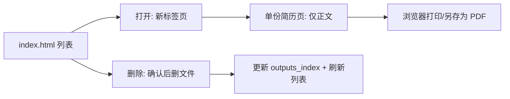

# 流程 · HTML 交付 — 产品需求文档

| 属性 | 内容 |
|------|------|
| 文档类型 | 流程 PRD |
| 父文档 | [00. 职业规划 Agent PRD](./00.%20职业规划%20Agent%20PRD.md) |
| 对应章节 | 原 [B07 流程 · HTML 交付](./B07.%20流程-HTML%20交付%20PRD.md) |
| 文档版本 | v0.12 |
| 最后更新 | 2026-05-30 |

---

### 5.7 HTML 交付

> **职责（与 [00 §4.1](../00.%20职业规划%20Agent%20PRD.md#41-智能体架构) 一致）**：
>
> 1. **简历智能体**：`write_resume_html` 写 `output/`；在 `structured_output.html_deliveries[]` 回传路径与元数据。
> 2. **协调者**：将交付清单注入派工 `asset` 的 `context`。
> 3. **资产智能体**：`register_outputs_index` — 只读校验文件存在后更新 `outputs_index` / `index.html`；删除走 `delete_output`；**不** 写 HTML 正文。
>
> 详见 [架构 01 §4.3](../../architecture/01-协调者与Worker.md#43-html-交付协作resume-写盘--asset-登记)。Tool schema：[write_resume_html §8](../../architecture/05-API与流式协议.md#8-harness-toolwrite_resume_htmlresume)、[register_outputs_index §7](../../architecture/05-API与流式协议.md#7-harness-toolregister_outputs_indexasset)。

#### 5.7.1 生成范围

| 类型 | 是否生成 HTML |
|------|----------------|
| 优化后简历 | **是** |
| JD 适配报告 | **否**（对话 only） |
| 长期规划 | **否**（JSON only；对话 / 主界面查阅，**不**写入简历 HTML） |

#### 5.7.2 目录与会话

- 每次会话的简历 HTML 存放在 **同一目录**：`output/YYYY-MM-DD/`（同日多轮共用；若冲突可实现 `YYYY-MM-DD-2`，实现阶段注明）。
- 提供 **`index.html`**（简历列表 / 管理页）：扫描并列出该目录（及可选全局 `outputs_index`）下全部简历，支持 **打开、删除**（见 [B07 §5.7.6](./B07.%20流程-HTML%20交付%20PRD.md#576-简历文件管理打开--删除)）。HTML 已生成于本机 `output/`，**不提供** 应用内「下载 .html」按钮。

#### 5.7.3 文件命名

```text
{YYYY-MM-DD}-{能力偏好摘要}-{语义档位}.html
```

- `{能力偏好摘要}`：由 **简历智能体** 在 `write_resume_html` 时按 [A01 §5.1.5](./A01.%20机制-职业档案%20PRD.md#515-能力偏好标签用于文件名与推荐) 优先级生成（最多 3 个，`-` 连接）；**资产智能体** 登记 `outputs_index` 时落档 `filename_tags`；依据档案 + 当轮对话/JD 上下文；**不** 照搬历史 HTML 文件名；**同轮多档可共用同一摘要前缀**。
- **重名**：若 `{YYYY-MM-DD}-{能力偏好摘要}-{语义档位}` 与同目录或 `outputs_index` 冲突，在摘要末尾加 `(1)`、`(2)` …（见 [A01 §5.1.5](./A01.%20机制-职业档案%20PRD.md#515-能力偏好标签用于文件名与推荐)）。
- **交付确认后**：用户确认当次简历交付（含文件名）后，将 `filename_tags[]` 中 **不在默认词表** 的标签按 **词义去重** 追加至 `preference_tags.custom[]`（对用户不可见，无需二次确认；同轮多档只写一次），见 [A01 §5.1.5](./A01.%20机制-职业档案%20PRD.md#515-能力偏好标签用于文件名与推荐)。
- `{语义档位}`：固定为 `保守` | `标准` | `进取`，与用户当轮勾选项一一对应（[B06 流程 · 简历优化](./B06.%20流程-简历优化%20PRD.md).1）；作为文件名最后一段，**单档、多档均须包含**；**不使用** `L1`/`L2`/`L3`。
- 示例：`2026-05-21-后端-云原生-高并发-标准.html`；同轮另选保守档时：`2026-05-21-后端-云原生-高并发-保守.html`；与同日前缀冲突时：`2026-05-21-后端-云原生-高并发(1)-标准.html`

#### 5.7.4 页面结构

**单份简历 HTML 页**（投递物 / PDF 源）

- **仅**包含优化后简历正文（与打印 PDF 一致的可投递内容）。
- **不得**包含：顶栏、操作区、返回列表、档案/初探/长期规划摘要、导航等与简历无关的区块。
- 样式：打印友好 CSS（`@media print`），适配 A4；整页即简历，避免分页断裂（实现细节见技术设计文档）。
- 管理类操作（打开、删除）**不在**本页提供；导出 PDF 在用户于**新标签页**打开本页后，通过浏览器 **打印 → PDF** 或 **另存为**（见 [§5.7.5](./B07.%20流程-HTML%20交付%20PRD.md#575-打印-pdf-与本地留存)）。

**索引页 `index.html`**（管理页，非投递物）

1. 简历文件列表（文件名、**优化档位** 保守/标准/进取、生成时间、能力偏好摘要、可选关联 JD 摘要）。
2. 每行操作：**打开**（**新标签页**，`target="_blank"` 或等价；**不得**在当前列表页内嵌或跳转替换列表）、**删除**（二次确认）。
3. 用户在新标签页查看简历后，自行 **打印 → PDF** 或 **另存为**（见 [§5.7.5](./B07.%20流程-HTML%20交付%20PRD.md#575-打印-pdf-与本地留存)）。

#### 5.7.5 打印 PDF 与本地留存

核心版本 **仅在本机运行**：优化后简历 HTML 直接写入 `output/YYYY-MM-DD/`，用户可在资源管理器中打开该路径，**无需** 产品内「下载 .html」。

用户获取可投递副本的方式：

- 在**新标签页**打开单份简历 HTML 后，浏览器 **打印 → 另存为 PDF**（推荐；页面仅含简历正文，样式适配 A4，实现细节见技术设计文档）；
- 浏览器 **另存为** 或系统级复制 `output/` 下对应 `.html` 文件。

#### 5.7.6 简历文件管理（列表页：打开 / 删除）

**仅在 `index.html` 列表页**提供管理操作；单份简历 HTML **不含**任何管理 UI（见 [§5.7.4](./B07.%20流程-HTML%20交付%20PRD.md#574-页面结构)）。

| 操作 | 说明 | 交互要求 |
|------|------|----------|
| **打开** | 在浏览器**新标签页**打开该份 `.html` 简历（本机路径或通过本地 HTTP 服务） | 列表行「打开」及点击文件名均须 `target="_blank"`（或等价）；**禁止**在当前列表页内打开或替换列表内容 |
| **删除** | 从磁盘删除该 `.html` 文件，并同步更新 `profile.json` 的 `outputs_index[]` 与列表展示 | **仅**列表行提供；**二次确认**（如弹窗「确认删除？」）；删除后不可恢复 |

**不在核心版本范围**：应用内 **下载** 按钮；单份简历页上的删除 / 返回列表 / 顶栏 / 档案摘要等。

**实现约定（PRD 级）**

- 因浏览器安全限制，纯静态 `file://` 难以可靠执行删除与目录刷新；须通过 **本地轻量服务**（如内置 HTTP 服务）提供列表 API 与删除接口，或由桌面壳统一托管 `output/`。
- 删除成功后：若该文件曾被 智能体推荐复用，不再出现在索引中；资产智能体下次扫描时以磁盘 + `outputs_index` 一致为准。



---
---

## 相关 PRD

- [流程 · 简历优化](./B06.%20流程-简历优化%20PRD.md)
- [机制 · 职业档案](./A01.%20机制-职业档案%20PRD.md)


*文档结束*
