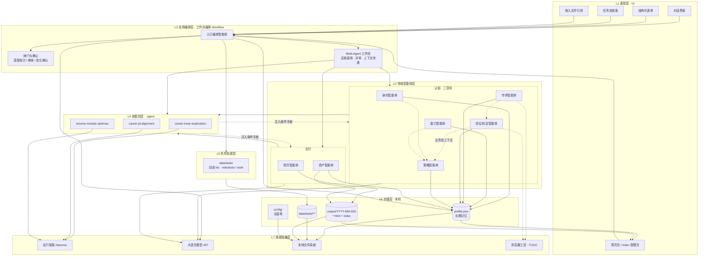
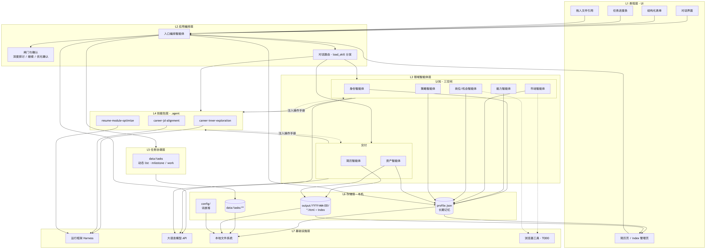
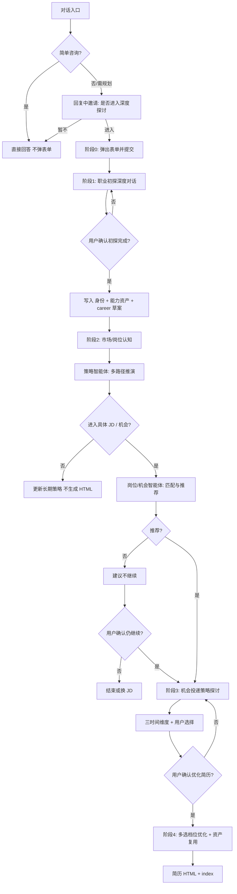
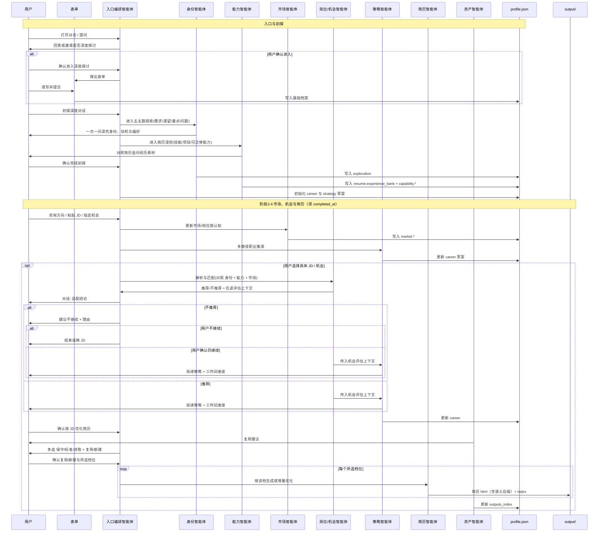
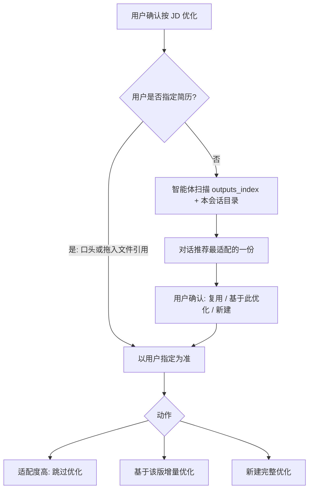
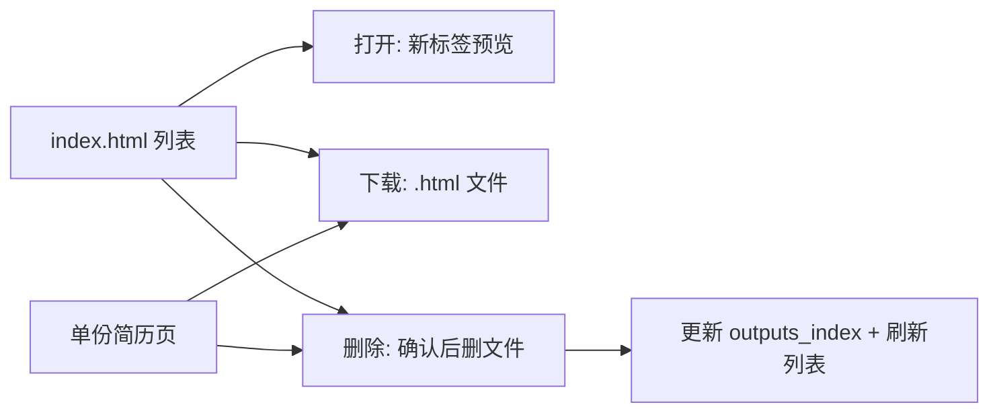
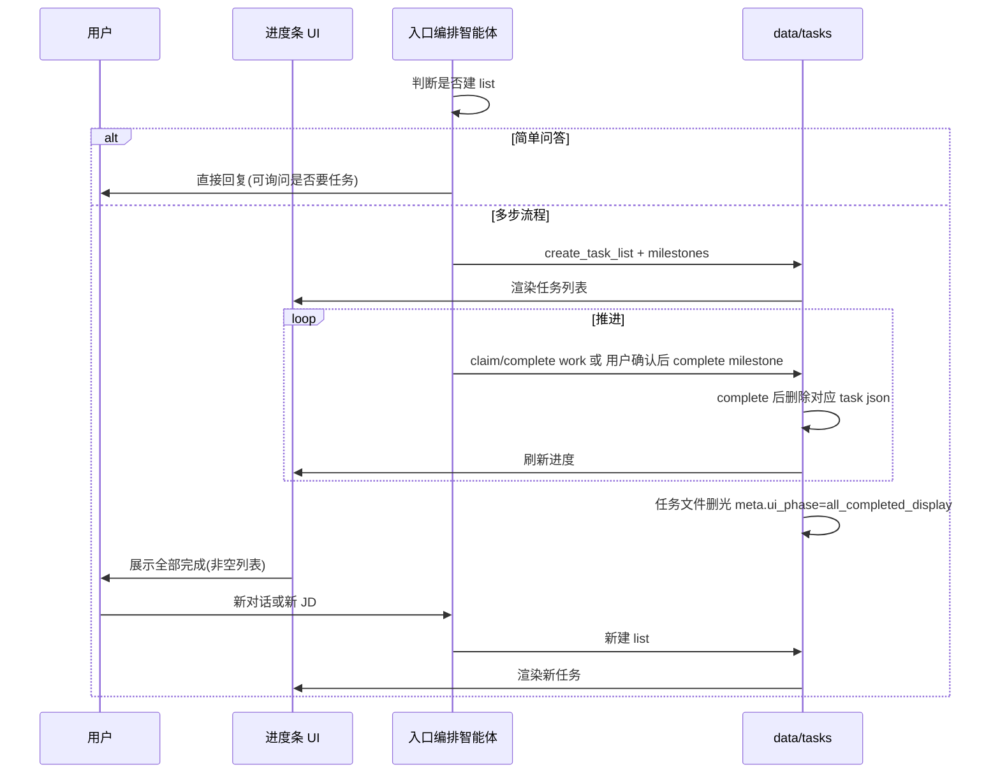

# 个人职业规划智能体 — 产品需求文档

| 属性 | 内容 |
|------|------|
| 文档版本 | v0.9 |
| 状态 | 草案（已对齐产品讨论结论） |
| 项目 | AI-Optimized-Resume-V2 |
| 最后更新 | 2026-05-22 |

## 重点

- **整体定位升级**：产品不再只聚焦单次 JD 投递，而是长期职业记忆 + 职业资本推演 + 简历 HTML 交付的个人职业操作系统。
- **三空间分层**：身份智能体建模人格/动机/偏好，能力智能体建模技能/经验/可迁移能力，市场智能体建模岗位/行业/趋势/机会。
- **策略层升级**：策略智能体读取身份、能力、市场三层结果，做多路径职业推演，并在具体 JD 出现时生成投递策略与三时间维度。
- **执行边界（当前版本）**：参考文档中的 **执行层（Execution Layer）** 成长系统（周目标、学习路径、项目实践、反馈监督）**暂不实现**（后续版本纳入规划）；当前闭环落点是 **长期记忆落档** + **简历 HTML 交付**。
- **交付职责收敛**：简历智能体只写简历正文，资产智能体只管历史复用、文件命名、`outputs_index` 与打开/下载/删除。
- **架构对齐**：分层理念见 [docs/参考文档.md](../参考文档.md)；PRD 将 Identity / Capability / Market / Strategy 落到可存储字段与对话流程，而非仅 MVP 单次投递。

## 目录

- [1. 概述](#1-概述)
  - [1.1 背景与问题](#11-背景与问题)
  - [1.2 产品定位](#12-产品定位)
  - [1.3 产品优先级](#13-产品优先级)
  - [1.4 核心价值](#14-核心价值)
  - [1.5 成功指标](#15-成功指标)
  - [1.6 范围边界](#16-范围边界)
- [2. 目标用户与场景](#2-目标用户与场景)
  - [2.1 目标用户](#21-目标用户)
  - [2.2 典型场景](#22-典型场景)
- [3. 产品原则与红线](#3-产品原则与红线)
- [4. 用户旅程与智能体架构](#4-用户旅程与智能体架构)
  - [4.1 智能体架构](#41-智能体架构)
    - [4.1.0 分层理念（对齐参考文档，保持架构先进）](#410-分层理念对齐参考文档保持架构先进)
    - [系统分层架构图（技术视图）](#系统分层架构图技术视图)
    - [4.1.1 角色职责表](#411-角色职责表)
  - [4.2 阶段总览](#42-阶段总览)
  - [4.3 时序图（主路径）](#43-时序图主路径)
- [5. 功能规格](#5-功能规格)
  - [5.1 职业档案（长期记忆）](#51-职业档案长期记忆)
    - [5.1.0 对话入口与深度探讨邀请（先于表单）](#510-对话入口与深度探讨邀请先于表单)
    - [5.1.1 建档表单（用户确认进入后）](#511-建档表单用户确认进入后)
    - [5.1.2 对话增量更新](#512-对话增量更新)
    - [5.1.3 简历输入](#513-简历输入)
    - [5.1.4 长期记忆、职业资本与初探存储](#514-长期记忆职业资本与初探存储)
    - [5.1.5 能力偏好标签（用于文件名与推荐）](#515-能力偏好标签用于文件名与推荐)
    - [5.1.6 `profile.json` 结构纲要](#516-profilejson-结构纲要)
  - [5.2 职业初探深度对话（确认进入 + 表单后 · JD 前）](#52-职业初探深度对话确认进入-表单后-jd-前)
    - [5.2.1 定位](#521-定位)
    - [5.2.2 对话依据与探索主题](#522-对话依据与探索主题)
    - [5.2.2.1 简历深度追问（要求）](#5221-简历深度追问要求)
    - [5.2.3 初探结束与落档](#523-初探结束与落档)
    - [5.2.4 已有初探档案的用户](#524-已有初探档案的用户)
    - [5.2.5 技能包机制（运行框架显式加载）](#525-技能包机制运行框架显式加载)
  - [5.3 市场/岗位分析（含 JD 机会评估）](#53-市场岗位分析含-jd-机会评估)
    - [5.3.1 定位](#531-定位)
    - [5.3.2 输入](#532-输入)
    - [5.3.3 处理](#533-处理)
    - [5.3.4 输出](#534-输出)
    - [5.3.5 JD 建议闸门（软阻断，用户可覆盖）](#535-jd-建议闸门软阻断用户可覆盖)
    - [5.3.6 公司画像（TODO）](#536-公司画像todo)
  - [5.4 职业战略与投递策略、三时间维度与优化确认](#54-职业战略与投递策略三时间维度与优化确认)
    - [5.4.1 多轮探讨](#541-多轮探讨)
    - [5.4.2 三时间维度（长期策略与当前机会均须呈现）](#542-三时间维度长期策略与当前机会均须呈现)
    - [5.4.3 「优化确认」的定义](#543-优化确认的定义)
  - [5.5 简历优化与优化程度](#55-简历优化与优化程度)
    - [5.5.1 三档选项（通用优化与针对 JD 优化共用）](#551-三档选项通用优化与针对-jd-优化共用)
    - [5.5.2 产出物](#552-产出物)
  - [5.6 已有简历复用](#56-已有简历复用)
  - [5.7 HTML 交付](#57-html-交付)
    - [5.7.1 生成范围](#571-生成范围)
    - [5.7.2 目录与会话](#572-目录与会话)
    - [5.7.3 文件命名](#573-文件命名)
    - [5.7.4 页面结构](#574-页面结构)
    - [5.7.5 打印 PDF](#575-打印-pdf)
    - [5.7.6 简历文件管理（打开 / 下载 / 删除）](#576-简历文件管理打开-下载-删除)
  - [5.8 任务系统（Task System / 运行框架）](#58-任务系统task-system-运行框架)
    - [5.8.1 定位与职责划分](#581-定位与职责划分)
    - [5.8.2 何时创建任务（动态，非固定模板）](#582-何时创建任务动态非固定模板)
    - [5.8.3 任务类型](#583-任务类型)
    - [5.8.4 存储结构](#584-存储结构)
    - [5.8.5 工具与状态机（强约束）](#585-工具与状态机强约束)
    - [5.8.6 任务完成与删除（按文件，非删目录）](#586-任务完成与删除按文件非删目录)
    - [5.8.7 前端进度条 UI](#587-前端进度条-ui)
    - [5.8.8 与 PRD 主路径的映射（示例，非固定）](#588-与-prd-主路径的映射示例非固定)
    - [5.8.9 运行时序（Task、UI 与入口编排智能体）](#589-运行时序taskui-与入口编排智能体)
    - [5.8.10 放弃与切换](#5810-放弃与切换)
- [6. 非功能需求](#6-非功能需求)
  - [6.1 隐私与数据](#61-隐私与数据)
  - [6.2 性能与成本（自用）](#62-性能与成本自用)
  - [6.3 可观测（作品向）](#63-可观测作品向)
- [7. 版本规划与 TODO](#7-版本规划与-todo)
  - [7.1 核心版本（v0.1）](#71-核心版本v01)
  - [7.2 后续版本（架构保持先进，实现分阶段）](#72-后续版本架构保持先进实现分阶段)
  - [7.3 TODO 清单](#73-todo-清单)
- [8. 决策记录](#8-决策记录)
- [附录 A：默认能力偏好标签（初版）](#附录-a默认能力偏好标签初版)
- [附录 B：确认话术（建议）](#附录-b确认话术建议)
- [附录 C：仓库目录约定（建议）](#附录-c仓库目录约定建议)

---

## 1. 概述

### 1.1 背景与问题

求职与职业发展中，从业者常面临：自我偏好、能力资产与市场机会彼此割裂；简历与目标岗位匹配度不清晰；优化标准不一；缺乏对「人格/动机—能力资产—市场机会—长期路径」的统一视角；且通用工具难以结合个人长期记忆持续迭代。

### 1.2 产品定位

**面向 IT 全类的个人职业操作系统（Personal Career OS）**：以结构化职业档案（`profile.json` 长期记忆）、能力资产组合（Capability Portfolio）与 **动态任务系统** 为状态底座。产品按参考文档的三空间与五层认知理念，将主路径落实为「**身份 → 能力 → 市场 → 策略 → 简历交付**」，帮助用户长期沉淀职业资本，并在出现具体 JD / 机会时完成判断、策略对齐与最终可打印简历 HTML 交付。

用户进入产品后 **先对话**，入口编排智能体用大语言模型判断是否需要 **深度探讨与规划**；仅在用户 **确认进入** 后弹出结构化表单，再进入职业初探、能力建模、市场/岗位分析、策略推演、简历交付。简单咨询可始终不弹表单、不建任务。

**与参考文档的分工对照**：

| 参考分层 | 本产品是否实现 | 落点 |
|----------|----------------|------|
| 身份智能体（Identity） | 是 | `exploration.*` |
| 能力智能体（Capability） | 是 | `resume.experience_bank`、`capability.*` |
| 市场智能体（Market） | 是 | `market.*` |
| 岗位/机会评估 | 是（JD 为市场输入之一） | `market.opportunity_snapshots`、对话闸门 |
| 策略智能体（Strategy） | 是 | `strategy.*`、`career.*` |
| 简历 + 资产交付 | 是 | `output/`、`outputs_index` |
| 执行智能体（Execution） | **当前版本否** | 周目标/学习路径/项目实践/反馈监督暂不实现；后续版本考虑 |
| 复盘/机会侦察智能体 | 暂缓 | 由入口编排与策略层对话覆盖，不单独拆 Agent |
| 记忆层（Memory） | 是（数据底座） | `profile.json`，非独立业务智能体 |

### 1.3 产品优先级

| 优先级 | 目标 | 说明 |
|--------|------|------|
| **P0** | 作品展示 | 可演示、可讲解、可复现；展示参考文档中的长期职业分层理念如何落到产品流程 |
| **P1** | 自用 | 本机真实档案、能力资产与 JD 流程，提升长期职业判断与投递准备效率 |
| **不做** | 商业化 | 不设计账号体系、付费、多租户；隐私按本地优先 |

### 1.4 核心价值

- **根基**：用户自愿进入深度探讨并提交表单后，通过初探对话厘清身份、动机、偏好、约束与当下重点，写入 JSON。
- **能力资产**：把简历浓缩信息扩展为结构化经历素材、能力图谱、能力迁移线索与能力资产组合，供后续策略与简历交付复用。
- **市场判断**：JD 是市场输入之一；系统还应沉淀岗位族、行业趋势、技术周期与机会风险，帮助用户判断当前机会是否值得投入。
- **策略推演**：进行中业务流优先接收上游 Agent **在途上下文**；跨会话再从档案读取身份、能力、市场结论，形成当前能力、下一跳、3–5 年路径与具体投递叙事。
- **交付闭环**：用户明确确认后，才产出可打印简历 HTML，并将产物元数据写回长期记忆，支持后续复用。

### 1.5 成功指标

**作品展示（P0）**

- 端到端 Demo 可跑通：对话入口 → 用户确认进入深度探讨 → 表单 → **职业初探与能力建模落档** → 市场/岗位分析 → 策略推演 → 粘贴 JD 或选择机会 → 生成 HTML + `index.html`。
- 仓库内含 `profile.example.json` 与脱敏样例 output，Clone 即可理解产品结构。
- 可讲解技术亮点：入口编排智能体 + 按认知对象划分的多智能体边界、**动态任务系统**（进度条 + 强约束 + 可审计）、**前置初探**、JD 闸门、**三档可多选同轮多份 HTML**、简历复用、JSON 长期记忆、顶栏规划渲染。

**自用（P1）**

- 单次「机会/JD → 策略确认 → HTML」流程完成耗时（主观可接受即可）。
- 已有适配简历时被正确识别并复用（跳过或增量优化）的比例。
- 能力资产、市场观察与策略选择可跨会话延续，而不只服务于单个 JD。
- 能力偏好标签在对话中补充后，后续文件名与推荐逻辑可复用。

**隐私与合规（与优先级绑定）**

- 真实 `profile.json` 与 `output/**` 不进入版本库。
- 文档说明模型接口 / 联网工具的数据范围（见 §6）。

### 1.6 范围边界

| 在范围内（核心版本） | 不在范围内（核心版本） |
|-----------------|-------------------|
| IT 全类岗位（开发、测试、运维、数据、AI、技术产品等） | 多行业通用知识库 |
| 简历仅粘贴；JD 仅粘贴 | 简历/JD 文件上传 |
| 用户确认后结构化表单 + JSON 档案 | 启动即强制弹表单 |
| 确认后职业初探深度对话（结论写入 JSON） | 未确认进入深度探讨不得要求填表 |
| 身份、能力、市场、策略的长期记忆沉淀；不保存完整会话历史 | 完整对话历史持久化 |
| 能力资产组合、能力迁移线索、岗位/市场观察、策略选择写入 JSON | 周目标、学习路径、项目实践、反馈监督等成长执行系统（**当前版本**暂不实现） |
| 仅优化后简历生成 HTML | JD 报告、长期规划单独 HTML |
| 本地 HTML + 索引页（打开/下载/删除） | 自动投递、招聘站 API |
| 动态任务系统（`data/tasks/`，强约束，进度条 UI） | 固定流水线模板；多智能体`负责人` 认领（核心版本暂缓） |
| `.agent` 三个技能包 + 运行框架 `load_skill` | Cursor 自动发现技能包；IDE 绑定 |

---

## 2. 目标用户与场景

### 2.1 目标用户

- **主要**：将本项目作为 **作品展示** 的开发者（本人），需可演示 智能体架构与职业闭环。
- **次要**：同一使用者的 **日常自用**，在本机维护真实档案与简历产出。

### 2.2 典型场景

| 场景 | 用户行为 | 系统行为 |
|------|----------|----------|
| 打开产品 / 闲聊 | 简单提问 | 入口编排智能体直接回答；**不弹表单**、不建任务（§5.1.0） |
| 进入深度探讨 | 在回复中选择「进入深度探讨与规划」 | 弹出结构化表单；提交后生成 `profile.json` 并进入初探 |
| **职业初探（首次）** | 表单提交后进入深度对话 | 身份智能体负责五主题，能力智能体负责简历深挖 → 写入 `exploration.*`、`resume.experience_bank` 与能力资产 |
| **初探复盘** | 已有初探结论，要求更新 | 同 skill **短路径**：读现有档案 → 哪块变了 → 交叉深挖 → 更新 summary → 落档 |
| 能力资产更新 | 用户补充新项目、新技能或新成果 | 能力智能体更新能力图谱、能力迁移线索与经历素材 |
| 市场/岗位认知 | 用户咨询方向、岗位族、行业趋势或粘贴 JD | 市场智能体沉淀趋势观察；岗位/机会智能体沉淀岗位要求、机会风险与是否推荐 |
| 职业战略推演 | 用户想比较路径或选择下一跳 | 策略智能体读取身份 + 能力 + 市场，输出路径 A/B、时间成本、风险、上限与 3–5 年影响 |
| 投递策略 | 用户选择某个 JD / 机会继续 | 策略智能体加载 `career-jd-alignment`：三时间维度、路径选择、投递叙事 → 更新 `career.*` |
| 确认优化 | 用户确认按该 JD 优化简历 | 简历智能体加载 `resume-module-optimize`；资产智能体负责复用、命名与产物管理 |
| 复用历史 | 拖入聊天框引用已有 HTML，或口头指定文件名 | 以用户指定为准；未指定则 智能体推荐并由用户确认 |
| 查看规划 | 打开任意简历 HTML | 顶栏展示初探摘要、档案摘要与长期规划 |
| 管理简历 | 在索引页或简历页操作 | **打开**、**下载**、**删除** 本机 HTML 简历文件 |
| 任务进度 | 侧边栏/顶栏查看当前 list | 有任务则展示进度条；全部完成后展示「已完成」占位直至新对话或新 list |
| 简单咨询 | 单次问答 | 智能体判断不建任务；可对话询问「是否需要拆成任务」 |
| 放弃当前流程 | 换 JD 或改做规划 | 删除对应该 list 的 **任务文件**；可新建另一 `list_id` |
| 成长执行诉求 | 用户要求周目标、学习计划、项目实践监督 | 说明当前版本暂不提供执行层能力，可转为能力缺口记录或职业策略讨论；后续版本可能实现 |

---

## 3. 产品原则与红线

1. **真实**：禁止虚构未提供的经历、项目、职级；进取档仅允许强化表达与 招聘系统关键词，不得造假。
2. **JD 建议闸门（可覆盖）**：JD 不匹配或不推荐时，系统 **明确建议** 用户不要继续，并说明理由；**不隐瞒** 不推荐结论。若用户 **仍确认继续**，则进入后续探讨与简历优化流程。
3. **优化确认**：探讨结束后，须用户 **明确确认**「按该 JD 优化简历」后，才调用 简历智能体生成 HTML。
4. **用户决策权**：是否复用已有简历、是否采纳 智能体推荐，均由用户确认；支持拖入文件引用。
5. **自愿深入**：不强制首屏表单；深度探讨须用户确认后再填表（§5.1.0）。未完成 **职业初探落档** 前，不进入 JD/简历主流程（见 §5.2.4）。
6. **先计划再执行（任务强约束）**：凡智能体判定需拆分的流程，须先 `create_task` 再 `claim/complete`；有 **进行中** 任务列表时不得跳过 `blockedBy` 前置依赖（§5.8）。
7. **本地优先**：`profile.json` 与 `data/tasks/**` 存本机；会话对话不持久化；真实数据不进 Git。
8. **透明**：涉及外部接口或浏览器工具时，在文档与交互中说明数据用途。
9. **成长执行系统（当前版本暂不实现）**：当前版本不替用户排周目标、学习计划、项目实践打卡或持续监督反馈；相关诉求可沉淀为能力缺口（`capability.evidence_gaps`）、策略记录（`strategy.*`）或对话建议。执行层能力列入后续版本规划，**非** 产品永久排除项。

---

## 4. 用户旅程与智能体架构

本章先介绍 **智能体架构**（§4.1：系统分层图 + Multi-Agent Workflow 说明），再述 **主路径阶段**（§4.2）与 **运行时协作时序**（§4.3）。功能规格见第 5 章。认知分层理论见 [docs/参考文档.md](../参考文档.md)。

### 4.1 智能体架构

#### 4.1.0 分层理念（对齐参考文档，保持架构先进）

本产品采纳「**三空间映射 + 多智能体分工 + 长期记忆**」架构，目标不是单次 JD 匹配（Job Matching），而是持续的能力进化（Capability Evolution）与可复用的职业资本沉淀：

```text
人格空间（Personality Space）  → 身份智能体 → exploration.*
能力空间（Capability Space）  → 能力智能体 → experience_bank + capability.*
市场空间（Market Space）      → 市场智能体 + 岗位/机会智能体 → market.*
策略推演（Strategy）           → 策略智能体 → strategy.* + career.*
交付（Resume + Asset）         → 简历 HTML + outputs_index
```

**当前版本范围**：执行智能体所代表的 **Career Operating System**（周目标、学习路径、项目实践、进度检查、面试反馈闭环、情绪稳定器等 **成长执行**）**暂不实现**，后续版本可纳入。当前版本闭环终点是：**用户确认的事实写入 `profile.json`，以及面向投递的简历 HTML**。

**记忆**：不另设 Memory Agent；`profile.json` + `data/tasks/**` + `output/` 构成跨会话事实源与产物索引。

#### 系统分层架构图（技术视图）

自上而下：**上层只依赖下层接口，不跨层直连存储或模型**（入口编排智能体除外，作为唯一纵穿编排中枢）。





| 层级 | 组件 | 职责 | 主要读写 |
|------|------|------|----------|
| **L1 表现层** | 对话、表单、进度条、简历/index | 用户交互；**不** 内含职业判断或 LLM 提示 | 只调编排层 API；渲染 `profile` / `output` |
| **L2 应用编排层** | 入口编排智能体 + **工作流编排（Workflow）** | 唯一对话入口；闸门与确认；编排 Multi-Agent 流程：子智能体 **可互相调用、互相评审、传递上下文**；`load_skill`、任务强约束 | 读写下层存储；驱动 L3/L4/L5 |
| **L3 领域智能体层** | 身份 / 能力 / 市场 / 岗位·机会 / 策略 / 简历 / 资产 | 在 Workflow 中承担专业步骤；**业务流内**由编排层调度并 **Agent 间协作**，非单层 CRUD | 读写在途上下文 + `profile.json`；写各自字段或 HTML |
| **L4 技能包层** | `.agent/skills/*` | 分阶段操作手册（一次一问、落档字段、HARD-GATE） | 由 Harness 注入 L3 上下文 |
| **L5 任务协调层** | `data/tasks` | 先计划再执行；进度条；milestone / work | 读写 `data/tasks/**` |
| **L6 存储层** | `profile.json`、`output/`、`config/` | 跨会话事实源与产物；**非** 会话历史 | 本机 JSON / HTML |
| **L7 基础设施层** | Harness、LLM、文件系统、浏览器工具 | 模型调用、技能加载、持久化 IO；无业务语义 | — |

**分层约束**：

- UI **不得** 直接调用大语言模型或写 `profile.json`（经编排层或本地管理服务，见 §5.7.6、T-05）。
- **成长执行系统（Execution Layer）**：周目标、学习路径、项目实践监督、打卡督学等 — **当前版本暂不实现**（见 §3 原则 9、§7.2）；**非** 架构层永久禁止，后续版本可扩展 L3/L7 能力。
- **L2 + L3 = Multi-Agent 工作流**：应用层采用 **Workflow 编排**；领域智能体在流程中 **互相调用、互相评审、传递在途上下文**（例如岗位/机会评估结果 **直接传入** 策略智能体），而不是仅由入口编排「点名一次、各说各话」。
- **策略智能体输入**：**进行中的业务流** — 以上游 Agent 传入的 **在途结论 + 必要片段** 为主；**跨会话/复盘** — 再从 `profile.json` 读取 `exploration.*`、`capability.*`、`market.*` 等完整档案。策略 **不重复** 岗位/机会智能体已完成的完整匹配打分（§5.4.1），但可基于传入上下文做推演与叙事。
- **当前版本交付范围**：L3/L4 以职业判断、记忆落档与简历 HTML 为主；执行层产品能力留待后续版本。

**工作流编排（L2）与领域协作（L3）**：

入口编排智能体统一接用户对话，并驱动 **Workflow**（任务系统 L5、技能包 L4、子智能体协作）。子智能体在流程中 **可被多次调度**，且 **可在 Workflow 内调用/移交** 其它子智能体。

| 智能体 | 典型进入 Workflow 的时机 | 协作说明 |
|--------|--------------------------|----------|
| 身份 / 能力 | 用户确认进入深度探讨且已提交表单 | 初探 Workflow；产出写入档案，并作为后续步骤上下文 |
| 市场 | 用户问趋势/岗位族/方向 | 可将 `market.*` 片段 **传给** 岗位/机会或策略步骤 |
| 岗位/机会 | 用户粘贴 JD 或描述具体机会 | 评估结论 **传给** 策略（在途）；落档 `market.opportunity_snapshots` 等 |
| 策略 | 路径比较、JD 闸门通过后探讨、纯规划 | 接收上游 **在途上下文**；无 JD 时也可仅读档案推演 |
| 简历 | 优化确认后的生成 Workflow；亦可参与复用/模块讨论 | **生成最终 HTML** 须 **优化确认**（§5.4.3）；此前可在 Workflow 内做复用判断、分模块预研（与资产智能体协作） |
| 资产 | 复用、命名、索引、文件管理 | 与简历步骤并行或衔接，不替代策略/机会判断 |

**长期记忆（L6）与在途上下文**：

- Workflow **进行中**：优先使用 Agent 间传递的 **在途结构化结论**（减少重复读盘与重复推理）。
- Workflow **落档 / 跨会话**：写入 `profile.json`（`exploration.*`、`capability.*`、`market.*`、`strategy.*`、`career.*` 等）。
- **无具体 JD 的纯规划**：策略可读档案推演，不要求 `opportunity_snapshots` 已存在。
- **有具体 JD**：岗位/机会步骤产出推荐结论；策略步骤 **引用** 传入结论，不重做完整匹配打分。
- **简历 HTML**：须在 **优化确认** 后进入生成步骤；步骤内读取档案 + 在途策略结论 + `resume.source_text`。

#### 4.1.1 角色职责表

| 角色 | 职责 |
|------|------|
| **入口编排智能体** | 统一对话入口与 **Workflow 编排**：邀请深度探讨、闸门与确认、`load_skill`、任务系统（§5.8）；调度 L3 子智能体 **互相调用/评审/传上下文**；不承担领域判断与简历正文撰写 |
| **身份智能体** | 建模“你是谁”：兴趣、动机、风险偏好、价值观、工作偏好、长期约束；负责职业初探五主题与复盘中相对稳定的身份/偏好变化，写入 `exploration.*` |
| **能力智能体** | 建模“你会什么”：技能、项目、实践经验、学习速度、能力迁移与 AI 杠杆能力；负责简历深挖、经历素材沉淀、能力缺口与能力资产组合，写入 `resume.experience_bank`、`capability.*` |
| **市场智能体** | 建模“世界需要什么”：岗位族、行业趋势、技术周期、供需变化、AI 替代风险与机会窗口；写入 `market.*`，不直接决定简历表达 |
| **岗位/机会智能体** | 建模“当前机会是什么”：JD 解析、必备项 / 加分项、匹配度、硬伤、风险、与市场趋势的一致性；输出推荐/不推荐，不生成 HTML |
| **策略智能体** | 业务流中接收上游 Agent **在途上下文**（身份/能力/市场/机会结论）；跨会话读 `profile.json`；多路径比较、三时间维度、投递叙事；不重复完整 JD 匹配打分 |
| **简历智能体** | 简历内容表达：`load_skill("resume-module-optimize")`；Workflow 内可参与复用判断与模块预研；**生成最终 HTML** 须优化确认（§5.4.3）；禁止新增未确认事实 |
| **资产智能体** | 只负责简历资产：历史 HTML 复用建议、文件名标签、`outputs_index` 同步、打开/下载/删除；不做 JD 适配判断、不改写简历正文 |

**不保存** 完整会话历史；仅依赖 `profile.json` 与 `output/` 下文件作为跨会话上下文。

### 4.2 阶段总览



> **任务层（§5.8）**：用户确认进入深度探讨后才建 `explore_*` 等 list；简单问答不建任务。

| 阶段 | 名称 | 参与角色 | 产出 |
|------|------|----------|------|
| — | 对话入口（可选） | 入口编排智能体 | 回答；可能发出深度探讨邀请 |
| 0 | 结构化表单 | 表单 UI（确认进入后弹出） | `profile.json` 基础字段 |
| 1 | **职业初探与能力建模** | 入口编排智能体 + 身份智能体 + 能力智能体 | `exploration.*`、`resume.experience_bank`、`capability.*`、`career.*` 草案 |
| 2 | 市场/岗位认知 | 入口编排智能体 + 市场智能体 + 策略智能体 | `market.*`、多路径策略草案 |
| 3 | 机会评估与投递策略 | 入口编排智能体 + 岗位/机会智能体 + 策略智能体 | 推荐/不推荐；更新 `career.*`；优化确认 |
| 4 | 简历优化与资产管理 | 简历智能体 + 资产智能体 | `output/` 下 HTML 与 `outputs_index` |

### 4.3 时序图（主路径）



> 任务与进度条 UI 的协作时序见 **§5.8.9**。

---

## 5. 功能规格

### 5.1 职业档案（长期记忆）

#### 5.1.0 对话入口与深度探讨邀请（先于表单）

**启动行为**：用户进入产品后 **仅呈现对话界面**，**不** 默认弹出结构化表单。

| 情况 | 入口编排智能体行为 |
|------|----------------|
| **简单咨询** | 直接回答（概念、行业、流程说明等）；可不建任务；可顺带一句询问「是否需要深度探讨」（不强制） |
| **需深度探讨/规划**（大语言模型判断） | 在回复中说明进入初探的价值，并提供 **明确选项** 供用户选择（见下） |

**大语言模型判断为「可能需深度探讨」的典型信号**（核心版本由入口编排智能体判断，后续可规则化，见 T-06）：

- 用户表达求职/转行/迷茫/职业规划/想理清方向等
- 用户粘贴 JD 或简历并要求「从整体规划开始」
- 多轮对话已涉及价值观、长期目标而非单次事实问答

**用户选择（须在回复中可点击或话术确认）**：

| 选项 | 系统行为 |
|------|----------|
| **进入深度探讨与规划** | 弹出 **结构化表单**（§5.1.1）；提交后创建 `explore_*` Task list（若启用任务）并进入 §5.2 |
| **暂不，继续聊聊** | 保持普通对话，不弹表单 |

> 未确认「进入深度探讨」前，**不得** 强制要求填写表单或开始初探完整清单（五主题 + 简历深挖）。

#### 5.1.1 建档表单（用户确认进入后）

- 用户选择 **进入深度探讨与规划** 后，才展示 **结构化 Web 表单** 一次性采集（必填校验、减少遗漏）。
- 表单含：基本信息、求职意向、能力偏好多选（附录 A）、**简历全文粘贴**（仅粘贴，不上传）等。
- 提交后写入本机 **`profile.json`**（长期记忆事实源），并进入 §5.2 职业初探。

#### 5.1.2 对话增量更新

- 会话中识别到新事实（技能、项目、意向变化等）时，入口编排智能体**提议** 更新项。
- 用户同意后 merge 入 `profile.json`（含 `meta.updated_at` 版本信息）。

#### 5.1.3 简历输入

- **仅支持粘贴** 简历全文至档案字段 `resume.source_text`（核心版本不支持上传）。

#### 5.1.4 长期记忆、职业资本与初探存储

以下内容 **仅存 JSON**，不单独生成 HTML：

**职业初探（§5.2，用户确认进入并提交表单后、JD 前写入）**

- `exploration` — 见 §5.2.3；含内心需求、渴望、职业需要、当下重点、当前问题及初探摘要
- `resume.experience_bank` — 初探阶段 **简历深度追问** 补充的经历素材（§5.2.2），供后续 JD 匹配与简历优化引用；**不** 改写 `resume.source_text` 原文
- `capability` — 能力资产组合；含技能图谱、能力迁移线索、证据缺口与 AI 杠杆能力，不等同于简历关键词列表
- `market` — 市场/岗位认知；含岗位族、行业趋势、技术周期、机会风险、AI 替代风险与具体 JD 快照
- `strategy` — 职业战略推演；含多路径比较、用户选择、路径风险、时间成本、收益上限与失败恢复能力

**长期规划（初探、市场分析与 JD 阶段逐步完善）**

- `career.current_assessment` — 当前能力评估（结构化 + 摘要）
- `career.next_hop` — 下一跳建议（含用户已选方案）
- `career.horizon_3_5y` — 3–5 年路径影响（含用户已选路径）
- 用户每次在「三时间维度」或「多路径推演」中的 **显式选择** 须回写 JSON（如 `career.selected_path_id`）；JD 阶段须 **引用** 初探结论、能力资产与市场判断，避免与已落档意愿冲突

#### 5.1.5 能力偏好标签（用于文件名与推荐）

**用途**：供 智能体推荐复用简历时参考；其中 **文件名** 中的 `{能力偏好摘要}` 由 **大语言模型动态选取**（见 §5.7.3），非简单拼接 `selected[]`。

**三类数据来源**（职责不同，不是三种「并列用户标签」）：

| 类型 | 说明 | 存储位置 |
|------|------|----------|
| **默认标签（词表）** | 系统预置 IT 常见方向，供表单多选 | `config/preference-tags-default.json`（附录 A），**不写入** `profile.json` |
| **用户已选** | 表单多选结果 | `preference_tags.selected[]` |
| **动态补充** | 对话中确认后的新标签（词表未覆盖） | `preference_tags.custom[]` |

对话中若出现新偏好（如「边缘计算」），入口编排智能体询问是否加入 `custom[]`；确认后写入 `profile.json`。

**文件名标签：大语言模型动态选取（生成 HTML 前）**

由 **资产智能体** 根据 **`profile.json` 全部相关内容**（含 `exploration`、`career`、简历原文）及 **当前对话上下文**（本 JD、本轮优化目标、用户口头强调的方向）从候选池选 **1–3** 个标签，拼入 `{YYYY-MM-DD}-{能力偏好摘要}.html`。

**候选池与优先级**（大语言模型只可从下列集合中选，**禁止** 自造词表外新词作为文件名标签）：

| 优先级 | 来源 | 说明 |
|--------|------|------|
| 1 | `preference_tags.selected[]` | 用户表单已选，**优先选用** |
| 2 | `preference_tags.custom[]` | 对话已确认补充 |
| 3 | 默认词表中 **用户未选** 的项 | 若与当前 JD/上下文更贴切，**允许** 选用（如表单未勾「云原生」但本 JD 强依赖云原生） |

**选取约束**：

- 最多 **3** 个标签，`-` 连接；单标签最长 **16** 字符；非法文件名字符替换为 `_`。
- 须在生成 HTML 时写入 `outputs_index[].filename_tags[]` 与 `optimization_level`（`保守`/`标准`/`进取`）留痕，便于复用判断与审计。
- 多档同轮生成时，能力偏好标签候选池可共用，但 **每档独立文件** 且文件名 **必须** 含对应语义档位后缀 `-保守`/`-标准`/`-进取`（§5.7.3）。
- 选取理由可在对话中 **一句说明**（非必须写入文件名）。

#### 5.1.6 `profile.json` 结构纲要

> 下列 JSON 中 `//` 为 **中文含义备注**（文档说明用）；落盘文件须为合法 JSON，**不得** 含 `//` 注释。

```json
{
  "meta": {
    "version": 1,              // 档案 schema 版本号
    "updated_at": "ISO8601"    // 最近一次确认落档时间
  },
  "basic": {},                   // 基本信息（表单 §5.1.1：姓名、联系方式、工作年限等）
  "skills": {},                  // 技能清单（表单采集 + 对话增量，结构化技能/熟练度）
  "intent": {},                  // 求职意向（目标岗位族、城市、薪资区间、到岗时间等）
  "constraints": {},             // 个人约束（地域、远程、加班、家庭、签证等硬性/软性限制）
  "exploration": {                // 身份初探（身份智能体 · §5.2）
    "completed_at": null,        // 初探完成时间；null 表示未完成，JD 闸门不开放
    "inner_needs": "",           // 内心真实需求
    "desires": "",               // 渴望（理想工作状态、成就感来源）
    "career_needs": "",          // 职业需要（理性层面的岗位/行业/成长诉求）
    "priorities_now": "",        // 当下最重要（未来 6–12 个月优先事项）
    "current_problems": "",      // 当前问题（阻碍、焦虑、缺口）
    "summary": ""                // 初探摘要（用户确认后的总述）
  },
  "career": {                     // 长期职业路径与评估（策略智能体 · §5.4）
    "current_assessment": {},    // 当前能力评估（强项、短板、与机会匹配摘要）
    "next_hop": {},              // 下一跳（约 6–18 个月路径、简历侧重、能力迁移重点）
    "horizon_3_5y": {},          // 3–5 年路径影响（长期履历标签、路径对照）
    "selected_path_id": "",      // 用户已选路径/策略 ID（多路径推演中的显式选择）
    "jd_override": []            // 用户在不推荐 JD 时仍继续的记录（见下表）
  },
  "capability": {                 // 能力资产组合（能力智能体 · §5.2）
    "skill_graph": {},           // 技能图谱（技能节点、熟练度、证据关联）
    "transfer_paths": [],        // 能力迁移线索（从 A 能力/经历可迁移至 B 方向）
    "evidence_gaps": [],         // 证据缺口（策略/JD 阶段识别的待补强能力或经历）
    "portfolio_summary": ""      // 能力资产组合摘要（供匹配与简历智能体速读）
  },
  "market": {                     // 市场/岗位认知（市场 + 岗位/机会智能体 · §5.3）
    "role_families": [],         // 关注的岗位族列表
    "trend_notes": [],           // 行业/技术趋势、供需、AI 替代风险等观察
    "opportunity_snapshots": []  // 具体 JD/机会评估快照（见下表）
  },
  "strategy": {                   // 职业战略推演（策略智能体 · §5.4）
    "path_options": [],          // 多路径选项（路径 A/B/C 及利弊）
    "selected_strategy": {},     // 用户已选策略（含三时间维度对齐结论）
    "risk_notes": [],            // 路径/投递风险备注
    "last_reviewed_at": null     // 最近一次策略复盘时间
  },
  "resume": {                     // 简历原文与经历素材（表单 + 能力智能体）
    "source_text": "",           // 用户粘贴的基线简历全文（只读原文，初探不改写）
    "last_optimization_levels": [], // 上一轮多选档位：保守 | 标准 | 进取（供默认勾选）
    "experience_bank": {         // 经历素材库（初探深挖产出，§5.2.2.1）
      "items": [],               // 结构化经历条目（见下表）
      "narrative_summary": ""    // 经历素材摘要（200–500 字，供速读）
    }
  },
  "preference_tags": {            // 能力偏好标签（§5.1.5）
    "selected": [],              // 表单多选（来自默认词表）
    "custom": []                 // 对话确认后补充的标签
  },
  "outputs_index": []             // 已生成 HTML 简历索引（资产智能体维护）
}
```

**嵌套对象与数组元素含义**

| 路径 | 中文含义 | 典型内容 / 说明 |
|------|----------|-----------------|
| `career.jd_override[]` | 不推荐仍继续投递记录 | `jd_fingerprint`（JD 指纹）、`at`（时间）、`reason_snapshot`（不推荐理由快照） |
| `market.opportunity_snapshots[]` | 单次机会评估快照 | JD 指纹、推荐/不推荐结论、匹配要点、硬伤、风险、评估时间 |
| `strategy.path_options[]` | 战略路径候选项 | `path_id`、路径名称、时间成本、收益上限、失败恢复、与初探一致性 |
| `strategy.selected_strategy` | 已选战略 | 当前采纳的路径 ID、三时间维度摘要、针对当前 JD 的投递叙事要点 |
| `capability.skill_graph` | 技能图谱 | 节点（技能名、层级）、边（关联/依赖）、证据指向 `experience_bank` 条目 |
| `capability.transfer_paths[]` | 能力迁移路径 | 源能力/经历 → 目标岗位能力、迁移条件与缺口 |
| `capability.evidence_gaps[]` | 证据缺口 | 能力或经历维度、缺口描述、建议补齐方式（当前版本仅记录，不触发执行层） |
| `resume.experience_bank.items[]` | 单条经历素材 | 见下表 |
| `outputs_index[]` | 单份 HTML 产物元数据 | 见下表 |

| `resume.experience_bank.items[]` 字段 | 中文含义 |
|---------------------------------------|----------|
| `period` | 时间段 |
| `org_or_project` | 公司或项目名称 |
| `role` | 担任角色 |
| `highlights[]` | 亮点/成果要点 |
| `skills_demonstrated[]` | 本条经历体现的技能 |
| `source` | 来源：`resume_gap`（简历未写清）或 `dialogue`（对话挖掘） |

| `outputs_index[]` 字段 | 中文含义 |
|------------------------|----------|
| `path` | 本机 HTML 文件路径 |
| `created_at` | 生成时间 |
| `optimization_level` | 优化档位：`保守` \| `标准` \| `进取`（与文件名语义后缀一致，§5.5） |
| `filename_tags[]` | 当次写入文件名的能力偏好标签（大语言模型从候选池选取，§5.1.5） |
| `jd_fingerprint` | 关联 JD 指纹（可选） |
| `session_date` | 所属会话目录日期 `YYYY-MM-DD`（可选，便于扫描） |

实现阶段 `basic` / `skills` / `intent` / `constraints` 及 `{}` 占位对象的具体键名，可在 `profile.example.json` 中与表单字段一一对齐；上表覆盖 PRD 主路径已引用的全部顶层与关键嵌套字段。

---

### 5.2 职业初探深度对话（确认进入 + 表单后 · JD 前）

#### 5.2.1 定位

深度主路径的 **第一阶段对话**，在用户 **确认进入深度探讨** 且 **提交表单（§5.1.1）** 后开始。此前用户可与入口编排智能体自由闲聊（§5.1.0）。本阶段 **不生成/不改写** 面向投递的简历 HTML，但须完成两类探索，并明确拆分业务边界：

1. **身份智能体 / 内心五主题**：真实需求、渴望、职业需要、当下重点、当前问题 → 形成后续 JD 与简历的 **价值锚点**（`exploration.*`）。
2. **能力智能体 / 简历深度追问与能力资产建模**：基线简历（`resume.source_text`）是个人经历的 **浓缩**，无法承载全部事实；能力智能体须 **逐步追问**，把未写入简历的项目、职责、成果、量化与可迁移能力沉淀到 `resume.experience_bank`，并进一步形成 `capability.skill_graph`、`capability.transfer_paths` 与 `capability.portfolio_summary`，供 §5.3–§5.5 匹配、策略与优化时 **有据可选用**。

由 **入口编排智能体** 主持流程，身份智能体主导身份/动机/偏好归纳，能力智能体主导技能/经历/能力迁移归纳；市场智能体、岗位/机会智能体、策略智能体、简历智能体、资产智能体**不参与** 本阶段（简历智能体仅在 §5.5 消费 `experience_bank`）。

身份智能体与 能力智能体在进入本阶段时 **必须加载** 项目技能包：`career-inner-exploration`（见 §5.2.5、`.agent/skills/`），但两者只负责各自认知对象，避免把用户画像做成万能桶。

#### 5.2.2 对话依据与探索主题

- **输入依据**：表单已填写的结构化字段 + 粘贴的基线简历（`resume.source_text`，如有）。
- **双线并行（均须覆盖）**：
  - **身份线**：五主题表格（下表）— 每主题 **至少 2–4 轮** 深究，一次一问，回答“你是谁、你想要什么、你适合什么长期工作状态”。
  - **能力线**：对照 `source_text` 的 **深度追问**— 与 身份线 **交织进行**（每完成 1–2 个主题后宜穿插 1 轮简历对照），并在五主题结束后安排 **集中简历深挖段**（§5.2.2.1），回答“你会什么、哪些能力可迁移、还缺什么证据”。

| 主题 | 说明 | 写入字段 |
|------|------|----------|
| 内心真实需求 | 用户真正想解决的问题或追求的状态 | `exploration.inner_needs` |
| 渴望 | 理想工作/生活方式、成就感来源 | `exploration.desires` |
| 职业需要 | 理性层面的岗位、行业、成长诉求 | `exploration.career_needs` |
| 当下最重要 | 未来 6–12 个月最优先的 1–3 件事 | `exploration.priorities_now` |
| 当前问题 | 阻碍、焦虑、技能/机会缺口 | `exploration.current_problems` |
| 简历经历扩充 | 发掘简历未写清/未写出的经历、可证明成果与可迁移能力 | `resume.experience_bank`、`capability.*` |

对话可多轮，允许沉默、反复与追问；入口编排智能体根据回答 **提议** 更新 `preference_tags.custom[]` 或表单相关字段（须用户确认）。

**原则**：简历追问服务于 **素材完备** 与 **价值锚点对齐**（例如用户渴望「技术影响力」→ 追问简历中是否有带人、方案、开源等未写出的证据），**不是** 在本阶段润色或改写 `source_text`。

#### 5.2.2.1 简历深度追问（要求）

| 项 | 要求 |
|----|------|
| 触发 | 用户已提供 `resume.source_text` 时 **必须** 执行；未提供则先说明价值并邀请粘贴，仍无则记入 `experience_bank` 元数据「待补充」，不阻塞五主题 |
| 最少轮次 | **集中深挖段** 至少 **3–5 轮**（一次一问）；全阶段简历相关追问合计建议 **≥6 轮**（含与五主题交织的对照问） |
| 追问方向 | 简历省略的时间段/项目；职责边界与 **个人贡献** vs 团队；量化结果与佐证；未写出的技术栈/工具；可迁移到目标方向的 **隐性能力** |
| 禁止 | 虚构经历；替用户改简历正文；在本阶段输出 HTML |
| 落档 | 结构化条目写入 `resume.experience_bank.items[]`（`period`、`org_or_project`、`role`、`highlights[]`、`skills_demonstrated[]`、`source`：`resume_gap` \| `dialogue`）；`narrative_summary` 为用户确认后的 **经历素材摘要**（200–500 字，供 岗位/简历智能体速读） |
| 与复盘 | 初探复盘时增加探针：「简历里有没有 **新经历/新成果** 要补进 experience_bank？」仅对 **新增/变化** 追问 |

问题库见 skill `phases.md`「简历深度追问」节。

#### 5.2.3 初探结束与落档

用户 **确认完成初探**（见附录 B）后：

1. 身份智能体输出 **初探摘要**（`exploration.summary`），用户确认或修订。
2. 写入 `exploration.*`；能力智能体写入或合并 `resume.experience_bank` 与 `capability.*`（无新素材时保留既有内容，须在对话中说明「沿用上次」）。
3. 设置 `exploration.completed_at` 为 ISO8601 时间。
4. 同步初始化或更新 `career.*`、`strategy.*` 的 **草案**（市场/策略阶段可再细化）。
5. 主路径 **解锁** 市场/岗位分析、策略推演与（在用户选择具体机会后）简历优化相关流程。

> 未设置 `exploration.completed_at` 时，系统提示先完成初探，不接收 JD 粘贴进入评估（Returning 用户见 §5.2.4）。

#### 5.2.4 已有初探档案的用户

| 情况 | 行为 |
|------|------|
| 直接进入 JD | 若 `exploration.completed_at` 已存在且用户无意向更新，**跳过** 完整初探，粘贴 JD 并建 `jd_*` list |
| **初探复盘** | 用户要更新内心意向/优先级等；入口编排智能体调用身份智能体 / 能力智能体 `load_skill("career-inner-exploration")` 并走 **复盘短路径**（见下） |

**初探复盘**（非首次）定义：在已有 `exploration.*` 前提下，仅针对 **发生变化** 的部分对话更新，**不** 从零重问五主题。

复盘步骤（与 skill 清单 B 一致）：读现有 `exploration.*` 与 `resume.experience_bank` 并复述 → 一次一问「哪块变了」→ 对变化块交叉深挖 → **若有简历素材新增** 则走短路径简历追问 → 分段确认 `summary` → 更新字段并刷新 `completed_at` → 用户 `确认完成初探` / `确认复盘完成`。

#### 5.2.5 技能包机制（运行框架显式加载）

Skills 为 `.agent/skills/{name}/SKILL.md` 操作手册，由 **自建运行框架** 的 `load_skill(name)` 注入子智能体，**不** 由 Cursor IDE 自动发现。

设计范式参考 Superpowers [brainstorming](https://github.com/shareAI-lab/learn-claude-code/tree/main/skills/brainstorming)：一次一问、分段确认、HARD-GATE、清单化步骤。

| 技能包 | 执行者 | 触发 | 产出 |
|-------|--------|------|------|
| `career-inner-exploration` | 身份智能体 + 能力智能体 | `explore_*` / `plan_*`；首次初探或复盘 | `exploration.*`、`resume.experience_bank`、`capability.*`、`career.*` 草案 |
| `career-jd-alignment` | 策略智能体 | `jd_*` 且 JD 评估已完成（含用户确认仍继续） | 更新 `career.*`、`strategy.*`；直至用户确认优化简历 |
| `resume-module-optimize` | 简历智能体 | 用户确认按 JD 优化 + 多选档位 + `work` 已建 | 按档各一份 HTML 简历正文 |

资产智能体不加载上述技能包；它消费 简历智能体的产物，负责复用建议、文件名标签、`outputs_index` 与本地 HTML 管理。

**模式（初探技能包）**

| 模式 | 条件 | 清单 |
|------|------|------|
| 首次 | 无 `exploration.completed_at` | 完整清单：五主题 + 简历深挖 + 交叉/路径/summary（`phases.md`） |
| 复盘 | 已有 `completed_at` 且用户要更新 | 短路径：不重问五主题；**按需** 补简历素材 |

**与任务（§5.8）**：里程碑与技能包 绑定；`work` 由 `resume-module-optimize` 规范逐条 claim/complete。

详见 [.agent/README.md](../.agent/README.md)。

---

> **§5.1–5.6 业务顺序**：对话入口（§5.1.0，可选）→ 用户确认 → 表单（§5.1.1）→ 初探与能力资产落档（§5.2）→ **市场/岗位分析（§5.3）** → **职业战略与投递策略（§5.4）** → **简历优化（§5.5）** → **简历复用（§5.6）**。

### 5.3 市场/岗位分析（含 JD 机会评估）

**前置条件**：`exploration.completed_at` 已存在（§5.2）。

#### 5.3.1 定位

**市场智能体** 与 **岗位/机会智能体** 共同回答「世界需要什么」与「当前机会是否值得投入一次简历定制成本」。本阶段既支持无具体 JD 的岗位族/市场趋势讨论，也支持有具体 JD 时的机会评估；但不生成独立 JD 报告 HTML。

#### 5.3.2 输入

- 用户咨询岗位族、行业趋势、技术方向、AI 替代风险等市场问题。
- 用户 **粘贴** JD 全文，或口头描述一个具体机会。

#### 5.3.3 处理

1. 市场分析：岗位族、行业趋势、技术周期、供需变化、AI 替代风险、机会窗口，写入 `market.*`。
2. JD / 机会解析：职级、职责、必备项 / 加分项、技术栈、组织语境、隐含能力要求。
3. 匹配：对照 `profile.json`（含 **`exploration`、`capability`、`market`、`career`**）、`resume.source_text`、**`resume.experience_bank`** 及可选已有 HTML。
4. 结论：无具体 JD 时输出岗位族/市场判断；有具体 JD 时输出 **推荐 / 不推荐** + 理由（匹配度、硬伤、风险、与身份初探意向的一致性、与能力侧当前能力/迁移能力的一致性、与市场趋势的一致性）。

#### 5.3.4 输出

- **仅通过对话** 告知用户（不生成 JD 适配报告 HTML）。

#### 5.3.5 JD 建议闸门（软阻断，用户可覆盖）

| 结论 | 系统行为 | 默认后续 | 用户覆盖 |
|------|----------|----------|----------|
| **推荐** | 对话说明匹配点、与初探意向的一致性、可选风险 | 进入 §5.4 职业战略与投递策略探讨 | — |
| **不推荐**或匹配不足 | **明确建议不要继续**，说明硬伤、匹配度、投递风险、与初探/长期意向的冲突；不隐瞒结论 | **暂停**；不默认生成简历 HTML | 用户 **确认仍继续** 后，同等进入 §5.4（须再次提示风险） |

**两级确认（均须用户显式表达）**：

1. **继续确认**（仅在不推荐时出现）：用户确认仍要针对该 JD 往下走 → 记录至 `career.jd_override[]`（含 JD 指纹、时间、不推荐理由快照）。
2. **优化确认**（§5.4.3）：职业战略与投递策略探讨后用户确认按该 JD / 机会优化简历 → 进入 §5.6 复用 → §5.5 多选档位 → **按档生成多份** HTML。

> 不推荐时 **默认不继续**；继续与优化两步确认可合并为一句实现，但语义上须区分「明知不匹配仍投递」与「确认生成简历」。

#### 5.3.6 公司画像（TODO）

- 后续引入 **联网浏览器 Tool**，根据公司名、岗位族或行业关键词拉取公开信息辅助探讨。
- 核心版本可先由用户提供公开信息或 JD 文本；联网失败时降级为基于用户输入与已有市场记忆分析。

---

### 5.4 职业战略与投递策略、三时间维度与优化确认

> 本阶段在 **市场/岗位分析（§5.3）** 之后、**简历优化（§5.5）** 之前；探讨须 **引用** `exploration.summary`、`capability.*`、`market.*` 与 `career.*`，避免与已确认的内心意向和能力事实背离。

#### 5.4.1 多轮探讨

策略智能体读取身份、能力、市场三层结果，先做多路径职业战略推演；当用户选择具体 JD / 机会继续时，再围绕该机会对齐投递策略：身份初探结论在该机会下的含义、能力侧当前能力与迁移能力如何被叙事化、该机会对下一跳和 3–5 年路径的影响。

策略智能体不重新做完整初探，不推翻市场智能体或岗位/机会智能体的事实判断；**进行中的 JD/机会流程** 应优先使用岗位/机会步骤 **传入的评估上下文**，而非仅依赖用户复述。若探讨中发现新的身份偏好、能力事实或市场事实，Workflow 可 **回调** 对应智能体更新，而不是由策略智能体自行写入未经确认的新事实。

无具体 JD 时，本阶段可只更新 `strategy.path_options`、`strategy.selected_strategy` 与 `career.*`，不进入 §5.5 简历优化。

#### 5.4.2 三时间维度（长期策略与当前机会均须呈现）

| 维度 | 内容 | 存储 |
|------|------|------|
| 当前能力 | 当前能力资产、强项、短板、证据缺口；若有 JD，则补充与 **该 JD** 的匹配情况 | 更新 `career.current_assessment`、`capability.evidence_gaps` |
| 下一跳 | 6–18 个月路径影响、简历侧重、能力迁移重点；与身份偏好/约束是否一致 | 更新 `career.next_hop`、`strategy.selected_strategy` |
| 3–5 年影响 | 路径 A/B/C 及长期履历标签影响（与初探 `horizon_3_5y` 对照） | 更新 `career.horizon_3_5y`、`strategy.path_options` |

用户 **显式选择** 采纳的路径/策略后写入 JSON，供 简历智能体默认对齐。

#### 5.4.3 「优化确认」的定义

**优化确认** = 用户在职业战略与投递策略探讨后，**明确表示同意按该 JD / 机会优化简历**（固定话术或 UI 按钮，实现阶段二选一）。

- 未确认：可持续探讨、更新 JSON；**不** 生成最终简历 HTML。
- 已确认：进入 §5.6 复用判断 → §5.5 多选档位 → 简历智能体 **按档各生成一份** HTML，资产智能体更新产物索引。

> 与 §5.2「初探完成确认」区分：前者结束 **价值探索**；后者启动 **简历生产**。

---

### 5.5 简历优化与优化程度

**前置条件**：已完成 §5.4.3 **优化确认**，且已完成 §5.6 复用判断（若适用）。简历智能体须同时读取 `resume.source_text`、**`resume.experience_bank`**（初探追问素材）、`capability.*`、`market.*` 与 `exploration` / `career` / `strategy`；在 **标准/进取** 档位下 **优先** 从 `experience_bank` 和能力资产中选取经用户确认的事实补入模块，禁止凭空添加未在 bank 与对话中出现的内容。

#### 5.5.1 三档选项（可多选 · 通用优化与针对 JD 优化共用）

每轮优化前，以 **多选** 方式让用户勾选一种或多种 **语义档位**（**至少选 1 项**）：`保守`、`标准`、`进取`；默认勾选上次选择（档案 `resume.last_optimization_levels[]`，见 §5.1.6）。对话与 UI 展示档位名称；文件名后缀、`optimization_level`、任务元数据 **统一使用下表「语义后缀」列**，**不使用** `L1`/`L2`/`L3`。

| 语义档位 | 语义后缀（文件名、`optimization_level`） | 行为 |
|----------|---------------------------------------------|------|
| 保守 | `保守` | 措辞、结构、错别字；不新增未提供事实 |
| 标准 | `标准` | 在保守档基础上 + 情境-任务-行动-结果（STAR）重组 + 基于档案的量化表达 |
| 进取 | `进取` | 在标准档基础上 + 招聘系统关键词补强、可迁移能力突出；**禁止虚构** |

针对 JD / 机会的优化在 **同一三档规则** 下执行；每一被选档位各生成 **一份独立 HTML**，额外约束：须对齐 JD 中必备项表述和策略智能体已确认的投递叙事，但仍遵守红线。

**多选生成规则**：

| 项 | 规则 |
|----|------|
| 产物数量 | 用户勾选 N 个档位 → **同轮生成 N 份** 优化简历 HTML（如同时选 `保守`+`进取` 则产出 2 份） |
| 共用上下文 | 同一轮共用：档案、`experience_bank`、复用基底（§5.6）、JD 指纹、策略投递叙事、文件名能力偏好标签（§5.1.5） |
| 档位差异 | 各份 HTML **仅** 按对应档位规则改写正文；不得因多选而跨档混用规则（保守档文件不得含进取档才允许的夸大表述） |
| 文件区分 | 文件名 **必须** 含语义后缀 `-保守` / `-标准` / `-进取`（§5.7.3）；`outputs_index[].optimization_level` 取值为 `保守`\|`标准`\|`进取`，与文件一一对应 |
| 任务拆分 | 入口编排智能体按所选档位拆分 `work`（典型：共享「模块优化」work + **每档一条**「生成 HTML」work，或按「模块 × 档位」展开；实现二选一，须保证每档均有完整正文） |
| 对话说明 | 生成结束后，对话中 **按档位列表** 说明各版差异要点（1–2 句/档，非必须单独报告页） |

#### 5.5.2 产出物

- 每个被选档位各生成 **一份** 优化后简历 **HTML**（见 §5.7）；同目录下可出现多份仅 `-保守`/`-标准`/`-进取` 后缀不同的文件。
- 资产智能体为 **每一份** 更新 `outputs_index[]` 与 `index.html` 列表行。
- 修改说明可在对话中按档位简要给出；核心版本不要求单独 HTML 报告页。

---

### 5.6 已有简历复用



| 规则 | 说明 |
|------|------|
| 用户指定 | 支持在聊天框 **拖入** 已有 HTML 文件引用；优先级最高 |
| 智能体推荐 | 结合 JD 指纹、标签、日期、匹配分推荐；**须用户确认** |
| 跳过优化 | 当现有简历已充分适配，用户可选择不生成新文件（**所有** 已选档位均不生成） |
| 增量优化 | 以选定版本为基底；用户多选 N 档时，**各档各生成一份** HTML，分别应用对应档位规则 |

复用或新建后，由 资产智能体更新 `outputs_index[]` 与 `profile.json` 的 `meta.updated_at`。

用户通过管理页 **删除** 简历后，资产智能体须从 `outputs_index[]` 移除对应项，避免后续继续推荐已删文件。

---

### 5.7 HTML 交付

#### 5.7.1 生成范围

| 类型 | 是否生成 HTML |
|------|----------------|
| 优化后简历 | **是** |
| JD 适配报告 | **否**（对话 only） |
| 长期规划 | **否**（JSON only；顶栏渲染） |

#### 5.7.2 目录与会话

- 每次会话的简历 HTML 存放在 **同一目录**：`output/YYYY-MM-DD/`（同日多轮共用；若冲突可实现 `YYYY-MM-DD-2`，实现阶段注明）。
- 提供 **`index.html`**（简历列表 / 管理页）：扫描并列出该目录（及可选全局 `outputs_index`）下全部简历，支持 **打开、下载、删除**（见 §5.7.6）。

#### 5.7.3 文件命名

```text
{YYYY-MM-DD}-{能力偏好摘要}-{语义档位}.html
```

- `{能力偏好摘要}`：由 **大语言模型** 按 §5.1.5 候选池与优先级动态选取（最多 3 个，`-` 连接），依据档案 + 当轮对话/JD 上下文；**同轮多档可共用同一摘要前缀**。
- `{语义档位}`：固定为 `保守` | `标准` | `进取`，与用户当轮勾选项一一对应（§5.5.1）；作为文件名最后一段，**不使用** `L1`/`L2`/`L3`。
- 示例：`2026-05-21-后端-云原生-高并发-标准.html`；同轮另选保守档时：`2026-05-21-后端-云原生-高并发-保守.html`

#### 5.7.4 页面结构

**单份简历 HTML 页**

1. **顶栏（只读）**：从 `profile.json` 渲染 — 基本信息、**初探摘要**（`exploration.summary`）、求职意向、**长期规划摘要**（当前能力 / 下一跳 / 3–5 年已选路径）。
2. **操作区**：下载、删除、返回列表（§5.7.6）。
3. **正文**：优化后简历内容（打印友好 CSS，`@media print`）。

**索引页 `index.html`**

1. 简历文件列表（文件名、**优化档位** 保守/标准/进取、生成时间、能力偏好摘要、可选关联 JD 摘要）。
2. 每行操作：打开、下载、删除。
3. 支持从列表进入任意简历页进行打印 PDF。

#### 5.7.5 打印 PDF

用户通过浏览器「打印 → 另存为 PDF」；PRD 要求样式适配 A4、避免顶栏分页断裂（实现细节见技术设计文档）。

#### 5.7.6 简历文件管理（打开 / 下载 / 删除）

本地管理页与单份简历页均须提供以下能力（核心版本必做）：

| 操作 | 说明 | 交互要求 |
|------|------|----------|
| **打开** | 在新标签页或当前页打开该份 `.html` 简历 | 列表行提供「打开」；点击文件名默认可打开 |
| **下载** | 将对应 `.html` 文件下载到用户本地（保留原文件名） | 列表行与简历页顶栏均提供「下载」 |
| **删除** | 从磁盘删除该 `.html` 文件，并同步更新 `profile.json` 的 `outputs_index[]` 与列表展示 | **二次确认**（如弹窗「确认删除？」）；删除后不可恢复 |

**实现约定（PRD 级）**

- 因浏览器安全限制，纯静态 `file://` 难以可靠执行删除与目录刷新；须通过 **本地轻量服务**（如内置 HTTP 服务）提供列表 API 与删除接口，或由桌面壳统一托管 `output/`。
- 删除成功后：若该文件曾被 智能体推荐复用，不再出现在索引中；资产智能体下次扫描时以磁盘 + `outputs_index` 一致为准。
- 单份 **简历 HTML 页**顶栏（或固定操作区）须同样提供：**下载**、**删除**、返回列表（打开列表页）。



---

### 5.8 任务系统（Task System / 运行框架）

> 设计参考：[learn-claude-code s12_task_system](https://github.com/shareAI-lab/learn-claude-code/tree/main/s12_task_system)（持久化 JSON、`blockedBy`、`pending → in_progress → completed`）。本项目在 s12 基础上增加：**动态建图**、**milestone/work 分层**、**按文件删除任务**、**前端完成态占位**。

#### 5.8.1 定位与职责划分

| 存储 | 职责 |
|------|------|
| `profile.json` | 业务长期记忆（初探、career、简历原文、标签等） |
| `data/tasks/{list_id}/` | **流程进度**：当前在做什么、依赖顺序、可审计执行记录 |

任务系统对用户是 **进度条**；对 智能体是 **先计划再执行** 的硬约束（有可审计的 `claim/complete` 轨迹）。

#### 5.8.2 何时创建任务（动态，非固定模板）

- **不创建**：入口编排智能体判断为 **简单问答**（如单次概念咨询）。核心版本仅由智能体判断；可在对话中询问用户「是否需要拆成任务跟进」（**不强制**，后续可优化规则）。
- **创建**：涉及多步流程时，在对话中 **动态** `create_task` / `create_task_list`，例如：
  - 用户 **确认进入深度探讨且表单已提交** → `explore_{id}`
  - 某次粘贴的 JD → `jd_{jd_fingerprint}`
  - 纯规划探讨 → `plan_{id}`

**单活跃 list**：同一时刻仅一个 `meta.status = active` 的 list。当前 list 未结束前，须 **完成或放弃** 后才能创建下一 list（用户放弃后可立即新建另一 JD / 规划 list）。

#### 5.8.3 任务类型

| 类型 | `kind` | 完成方式 | 示例 |
|------|--------|----------|------|
| **大步骤** | `milestone` 里程碑 | 对话中与用户对齐后，用户确认 → 智能体调用 `complete_task` | 规划探讨落档、JD 录入、JD 分析确认、确认按 JD 优化 |
| **小步骤** | `work` | 智能体在 推理-行动循环 内自动 `claim` → `complete`，**无需**用户逐步确认 | 优化简历「工作经历」段、优化「项目」段、生成 HTML |

大步骤未完成时，依赖它的 `work` 任务 `can_start = false`（`blockedBy` 指向 milestone 或前序任务）。

**简历优化**：用户确认里程碑「按 JD 优化简历」并 **多选档位** 后，入口编排智能体**当场拆分** 多条 `work`（按简历模块，且须覆盖 **每一所选档位** 的 HTML 落盘），再由简历智能体 / 资产智能体自动执行完毕。

#### 5.8.4 存储结构

> 下列 JSON 中 `//` 为 **中文含义备注**（文档说明用）；落盘文件须为合法 JSON，**不得** 含 `//` 注释。

**目录布局**

```text
data/tasks/{list_id}/          # 单次流程的任务列表目录（list_id 如 explore_xxx、jd_xxx、plan_xxx）
  meta.json                    # 本 list 元信息（类型、生命周期、进度条 UI 阶段）
  {task_id}.json               # 单条任务；complete 后删除该文件（不删整个 list 目录）
data/tasks/_active.json        # 可选：全局当前 active 的 list_id 指针（单活跃 list，§5.8.2）
```

**`meta.json` 建议字段**：

```json
{
  "list_id": "jd_abc123",              // 任务列表 ID，与目录名一致
  "type": "jd",                        // 列表类型：explore（初探/复盘）| jd（某 JD 全流程）| plan（纯规划）
  "status": "active",                  // 列表生命周期：active（进行中）| completed（正常结束）| abandoned（用户放弃）
  "ui_phase": "in_progress",           // 进度条 UI 阶段：in_progress（有任务文件或进行中）| all_completed_display（任务文件已删光，展示「全部完成」占位）
  "created_at": "2026-05-22T10:00:00Z", // 创建时间（ISO8601）
  "related_jd_fingerprint": "optional" // 关联 JD 指纹（jd 类型 list 可选，便于与 profile / outputs 对齐）
}
```

| `meta.json` 字段 | 中文含义 | 取值说明 |
|------------------|----------|----------|
| `list_id` | 任务列表标识 | 与 `data/tasks/{list_id}/` 目录名一致 |
| `type` | 列表业务类型 | `explore` \| `jd` \| `plan` |
| `status` | 列表生命周期 | `active` \| `completed` \| `abandoned` |
| `ui_phase` | 前端进度条展示阶段 | `in_progress` \| `all_completed_display` |
| `created_at` | 创建时间 | ISO8601 |
| `related_jd_fingerprint` | 关联 JD 指纹 | 可选；`jd_*` list 建议填写 |

**`_active.json`（可选）建议字段**：

```json
{
  "active_list_id": "jd_abc123"          // 当前唯一进行中的 list_id；放弃或完成后清空或指向新 list
}
```

**单任务 `{task_id}.json` 建议字段**（在 s12 基础上扩展）：

```json
{
  "id": "task_m1",                       // 任务 ID，与文件名 {task_id}.json 一致
  "list_id": "jd_abc123",                // 所属任务列表 ID
  "kind": "milestone",                   // 任务层级：milestone（大步骤，须用户确认后 complete）| work（小步骤，智能体自动 claim/complete）
  "subject": "机会分析",                  // 任务标题（进度条展示）
  "description": "...",                // 任务说明（get_task 恢复上下文时读取）
  "status": "pending",                   // 任务状态：pending | in_progress | completed（complete 后删文件，磁盘上可能不再保留）
  "owner": "agent",                      // 负责人（核心版本固定 agent；多专家分别认领暂缓）
  "blockedBy": ["task_..."],             // 前置依赖任务 ID 列表；未满足时 can_start=false
  "requires_user_confirm": true,         // 是否须用户显式确认后才能 complete（milestone 通常为 true）
  "metadata": {}                         // 扩展元数据（见下表）
}
```

| 单任务字段 | 中文含义 | 说明 |
|------------|----------|------|
| `id` | 任务 ID | 与 `{task_id}.json` 文件名一致 |
| `list_id` | 所属列表 | 冗余存储，便于跨目录扫描 |
| `kind` | 任务层级 | `milestone`：对话对齐 + 用户确认后完成；`work`：推理-行动循环内自动推进 |
| `subject` | 任务标题 | 进度条 / 列表主文案 |
| `description` | 任务说明 | 执行前 `get_task` 恢复的完整指令与上下文 |
| `status` | 执行状态 | `pending` → `in_progress`（claim）→ `completed`（complete 后删文件） |
| `owner` | 负责人 | 核心版本固定 `"agent"` |
| `blockedBy` | 前置依赖 | 指向须先完成的任务 ID；父级 milestone 未完成则子 work 不可 claim |
| `requires_user_confirm` | 须用户确认 | `true` 时 complete 前须有附录 B 类确认话术 |
| `metadata` | 扩展元数据 | 实现可选键，见下表 |

| `metadata` 常见扩展键（可选） | 中文含义 |
|-------------------------------|----------|
| `optimization_level` | 简历优化语义档位：`保守` \| `标准` \| `进取`（生成 HTML 类 work） |
| `jd_fingerprint` | 本任务关联 JD 指纹 |
| `skill_name` | 绑定的技能包名（如 `career-jd-alignment`、`resume-module-optimize`） |
| `module` | 简历模块名（如「工作经历」「项目经历」，work 拆分用） |

核心版本：负责人字段 `owner` 固定为 `"agent"`（实现层标识，多专家分别认领暂缓）。

#### 5.8.5 工具与状态机（强约束）

与 s12 同构的五类能力（实现名可调整）：

| 工具 | 用途 |
|------|------|
| `create_task` / `create_task_list` | 对话中动态建 list 与任务 |
| `list_tasks` | 列出当前 list 下任务（含 blocked 状态） |
| `get_task` | 恢复执行时读完整 description |
| `claim_task` | `pending` → `in_progress`；须 `can_start` |
| `complete_task` | `in_progress` → `completed`；完成后 **删除该任务的 JSON 文件** |

**强约束规则**：

1. 存在 `active` list 时，智能体**只能**通过 claim/complete 推进已规划任务（禁止无任务硬跳阶段）。
2. 执行 `work` 前，其父级 `milestone` 里程碑 须已 `completed`（文件已删且依赖满足）。
3. `complete_task` 对 `milestone` 里程碑：须在用户确认话术（附录 B）之后方可调用。

#### 5.8.6 任务完成与删除（按文件，非删目录）

| 事件 | 磁盘行为 | 说明 |
|------|----------|------|
| 单任务 `complete` | **删除** `data/tasks/{list_id}/{task_id}.json` | 不采用「整目录 rm」 |
| list 内全部任务完成 | 删除所有剩余 `{task_id}.json`；**保留** `meta.json` | 更新 `meta.status = completed`，`meta.ui_phase = all_completed_display` |
| 用户放弃 list | 逐个删除该 list 下任务文件；更新 `meta.status = abandoned` | 释放 active，允许新建其他 list |

#### 5.8.7 前端进度条 UI

| 状态 | 渲染 |
|------|------|
| 无 `data/tasks` 或无可展示 list | **不展示** 任务区域 |
| 存在任务文件 | 展示任务列表 / 进度条（milestone 为主轴，work 可折叠） |
| 任务文件已全部删除且 `ui_phase = all_completed_display` | 展示 **「全部任务已完成」** 完成态（**不**渲染空列表） |
| **新对话开始** 或 **新 list 创建成功** | 清除完成态占位，渲染新 list 任务 |

> 后端在任务删光后立即落盘 `meta.ui_phase`；前端读取 meta 决定完成态，避免闪空列表。

#### 5.8.8 与 PRD 主路径的映射（示例，非固定）

智能体按对话 **动态** 创建，下表仅为常见形态：

| 场景 | `list_id` | 典型 milestone | 典型 work（确认后动态追加） |
|------|-----------|----------------|----------------------------|
| 职业初探 / 复盘 | `explore_*` | 初探落档（`career-inner-exploration`） | — |
| 某 JD 全流程 | `jd_*` | JD 录入 → 市场/岗位分析 → 职业战略与投递策略（`career-jd-alignment`）→ 确认优化 | 简历各段（`resume-module-optimize`）、生成 HTML |
| 纯规划 | `plan_*` | 探讨落档 | — |

初探 milestone 完成并落档 `exploration.*` 后，可结束 `explore_*` list（任务文件删光 + meta 完成态）。用户粘贴 JD 时 **新建** `jd_*` list。

#### 5.8.9 运行时序（Task、UI 与入口编排智能体）

与 §5.8.2（何时建 list）、§5.8.7（进度条 UI）配合，描述入口编排智能体与 `data/tasks`、前端的协作顺序：



#### 5.8.10 放弃与切换

- 用户放弃当前 JD / 流程：删除该 list 下**各任务文件**，更新 `meta.status = abandoned`，清除 active。
- 之后可立即：新建另一 `jd_*`（另一 JD 优化）或 `plan_*`（规划探讨）等。

---

## 6. 非功能需求

### 6.1 隐私与数据

| 项 | 要求 |
|----|------|
| 真实档案 | `profile.json` 加入 `.gitignore` |
| 任务目录 | `data/tasks/**` 加入 `.gitignore` |
| 产出目录 | `output/**` 加入 `.gitignore` |
| 仓库样例 | 提供 `profile.example.json`、脱敏 `output/example/` |
| 会话 | 不持久化对话历史 |
| 模型 API | README 说明：简历/JD 片段是否发往第三方；作品 Demo 建议用脱敏数据 |
| 浏览器 Tool（TODO） | 仅拉公开信息；失败降级；日志不落敏感全文 |

### 6.2 性能与成本（自用）

- 同 JD 且已有高适配 HTML 时，优先复用，减少重复生成。
- 档案 JSON 体积可控（简历原文除外，建议 < 2MB）。

### 6.3 可观测（作品向）

- 主路径各阶段可打点：表单提交、**初探完成**、Task list 创建/完成/放弃、`milestone` 里程碑/`work` claim·complete、JD 闸门、优化确认、HTML 生成（实现期日志即可）。

---

## 7. 版本规划与 TODO

### 7.1 核心版本（v0.1）

- [ ] 对话入口 + 大语言模型邀请深度探讨 + 用户确认后弹表单
- [ ] 结构化表单 + `profile.json` 读写（仅确认进入后）
- [ ] **任务系统**：`data/tasks/{list_id}/`、五工具、强约束、milestone/work、按文件删除、完成态 UI
- [ ] **运行框架 `load_skill`** + 三 Skills：`career-inner-exploration`（含复盘短路径）、`career-jd-alignment`、`resume-module-optimize`
- [ ] **职业初探**对话 + `exploration` 落档 + 完成闸门
- [ ] 能力资产组合：`capability.skill_graph`、`transfer_paths`、`portfolio_summary`
- [ ] 市场/岗位认知：岗位族、趋势观察、机会风险与 JD 快照写入 `market.*`
- [ ] 策略推演：多路径比较、用户选择、风险说明与三时间维度写入 `strategy.*` / `career.*`
- [ ] 默认能力偏好标签 + 对话补充 `custom[]`
- [ ] 入口编排智能体 + 身份 / 能力 / 市场 / 岗位机会 / 策略 / 简历 / 资产 子能力
- [ ] 具体机会选择后：JD 粘贴、对话闸门、投递策略三时间维度、优化确认
- [ ] 三档优化可多选，同轮按档各生成一份 HTML（文件名后缀 `-保守`/`-标准`/`-进取` 与 `outputs_index.optimization_level`）
- [ ] 简历复用逻辑 + 拖入文件引用
- [ ] `output/YYYY-MM-DD/` + 简历 HTML + `index.html`（打开/下载/删除）+ 顶栏渲染
- [ ] `.gitignore` + example 档案

### 7.2 后续版本（架构保持先进，实现分阶段）

> 核心版本已按分层架构设计字段与流程；后续版本 **扩展数据与工具**，不推翻 Identity / Capability / Market / Strategy / 交付 边界。

| 版本 | 内容 |
|------|------|
| v0.2 | 联网 **浏览器工具** 公司公开画像，辅助市场/机会探讨（仍不替代 JD 闸门逻辑） |
| v0.3 | 复盘智能体（Reflection）短路径：周期校准 `exploration` / `capability` / `strategy` |
| v0.4 | 成长执行层（Execution）：周目标、学习路径、项目实践监督等（参考文档 Execution Agent） |
| v0.5 | 机会侦察（Opportunity Scout）：主动扫描岗位族/市场窗口写入 `market.*`（可选联网） |
| v1.x | **多行业** 扩展：表单字段、默认标签库、JD 解析模板按行业切换 |

### 7.3 TODO 清单

| ID | 项 | 说明 |
|----|-----|------|
| T-01 | 浏览器工具 | 公司画像；来源标注与失败降级 |
| T-02 | 多行业 | 档案模板、标签库、专家 prompt 分行业 |
| T-03 | 确认交互 | 统一「确认优化」话术或 UI 按钮规范 |
| T-04 | 同日多会话目录 | 目录命名冲突策略（`-2` 后缀） |
| T-05 | 本地管理服务 | 为 index 提供列表/删除 API，避免 `file://` 无法删文件 |
| T-06 | 任务创建启发式 | 除 智能体判断外，增加规则/用户默认「简单问题不建任务」 |
| T-07 | 成长执行系统（延后） | 当前版本不实现；相关诉求转为能力缺口或策略记录；见 §7.2 v0.4 |

---

## 8. 决策记录

| 日期 | 决策 |
|------|------|
| 2026-05-21 | 核心版本行业：IT 全类；后续多行业 |
| 2026-05-21 | 档案：表单首次 + JSON；对话增量；简历仅粘贴 |
| 2026-05-21 | 优化：三档；针对 JD 同三档 |
| 2026-05-21 | 市场/岗位智能体：流程环节；对话输出；不推荐则建议停止，用户确认仍继续则可进入后续流程 |
| 2026-05-21 | JD 建议闸门改为软阻断：不推荐时默认暂停，用户可覆盖继续 |
| 2026-05-21 | 简历 HTML 管理：索引页与简历页支持打开、下载、删除；删除同步 `outputs_index` |
| 2026-05-21 | 确认 = 用户同意按 JD 优化简历 |
| 2026-05-21 | 长期规划：仅 JSON；HTML 顶栏渲染 |
| 2026-05-21 | 仅简历 HTML + index；按会话目录 `output/YYYY-MM-DD/` |
| 2026-05-21 | 不保存会话历史 |
| 2026-05-21 | 能力偏好：默认词表 + `selected`/`custom`；文件名标签由 大语言模型按上下文从候选池选取 |
| 2026-05-21 | 简历复用：用户指定（含拖入）> 智能体建议 > 用户确认 |
| 2026-05-21 | 优先级：作品展示 > 自用；不考虑商业化 |
| 2026-05-21 | 主路径调整：表单后 **职业初探** 前置并落档，JD/简历优化在后 |
| 2026-05-21 | 引入 **任务系统**（§5.8）：动态 list、强约束、milestone/work、按任务文件删除、完成态 UI 占位 |
| 2026-05-21 | Task：每 JD 一 list；放弃/完成后删任务文件保留 meta；简单问答仅 智能体判断是否建任务 |
| 2026-05-21 | 引入 `.agent` 技能包 `career-inner-exploration`（参考 Superpowers brainstorming），绑定职业初探阶段 |
| 2026-05-21 | 初探复盘短路径；新增 `career-jd-alignment`、`resume-module-optimize`；技能包由运行框架 `load_skill` 触发 |
| 2026-05-21 | §4.3–4.6 按业务流重排：JD 分析 → JD 对齐 → 简历优化 → 复用 |
| 2026-05-21 | §5.1.0：启动不弹表单；大语言模型判断后用户确认进入再填表与初探 |
| 2026-05-21 | 初探双线：五主题 + **简历深度追问**；素材落 `resume.experience_bank`，供 JD 匹配与简历优化引用 |
| 2026-05-21 | §5.7 智能体架构移至第 5 章；原 §5.8/§5.9 顺延为 §4.7/§5.8 |
| 2026-05-21 | 智能体架构调整为第 4 章 **§4.1**（先于阶段总览与时序图） |
| 2026-05-21 | **第 4、5 章对调**：第 4 章为用户旅程与 智能体架构，第 5 章为功能规格 |
| 2026-05-22 | 智能体边界从流程阶段调整为认知对象：入口编排、身份、能力、市场/岗位、策略、简历、资产 |
| 2026-05-22 | 原「规划师」拆分为岗位描述前的身份/能力与岗位描述后的策略，避免用户画像成为万能桶 |
| 2026-05-22 | 简历产出拆分为 简历智能体（内容表达）与 资产智能体（复用、命名、索引、打开/下载/删除） |
| 2026-05-22 | 产品定位从单次 JD 投递闭环升级为长期职业记忆 + 职业资本推演 + 简历 HTML 交付 |
| 2026-05-22 | 参考分层理念引入市场智能体、能力资产组合与策略多路径推演；成长执行系统标为当前版本暂不实现 |
| 2026-05-22 | §4.1 修正：L3 采用 Multi-Agent Workflow（可互调、传上下文）；策略优先在途输入；执行层非永久排除 |
| 2026-05-22 | v0.9：补全 §4.1.0 分层理念、§1.2 参考对照表、时序图 capability 落档；审计另一进程中断后的 PRD 一致性 |
| 2026-05-22 | §4.1 拆为调用关系图与数据依赖图（后并入 §4.1 正文，仅保留系统分层架构图） |
| 2026-05-22 | 新增系统分层架构图（L1 UI～L7 基础设施） |
| 2026-05-22 | 删除 §4.1.1/§4.1.2 独立配图，编排与数据流说明并入 §4.1 |
| 2026-05-22 | §5.5：优化档位支持多选，同轮按档各生成一份 HTML；文件名与 `outputs_index` 增加档位字段 |
| 2026-05-22 | 档位文件名与 `optimization_level` 改用语义后缀：保守、标准、进取（弃用 L1/L2/L3 后缀） |

---

## 附录 A：默认能力偏好标签（初版）

> 表单多选数据源；实现时可按「岗位族」分组展示。对话中确认后的新标签写入 `preference_tags.custom[]`。

**岗位方向**：后端、前端、全栈、移动端、算法、AI 工程、数据开发、数据分析、测试、QA、运维、SRE、DevOps、安全、区块链、嵌入式、游戏客户端、游戏服务端、技术管理、架构师

**技术域**：云原生、微服务、高并发、分布式、消息队列、数据库、大数据、实时计算、机器学习平台、CV、NLP、推荐系统

**行业/场景**：电商、金融、政企、医疗、教育、物联网、车联网、音视频、广告、企业服务

**工作方式**：远程优先、外企、开源贡献、英文工作环境

（实现时可从上述列表选 **常用子集** 作为表单默认展示，其余折叠为「更多」；全量列表可放 `config/preference-tags-default.json`。）

---

## 附录 B：确认话术（建议）

**进入深度探讨与规划（弹出表单）**

- `确认进入深度探讨`
- `进入深度探讨与规划`

**职业初探结束 — 落档并解锁 JD 流程**

- `确认完成初探`
- `初探完成`

**不推荐时 — 仍继续（进入职业战略与投递策略探讨）**

- `确认继续`
- `仍要继续`

**初探复盘完成**

- `确认复盘完成`

**探讨后 — 优化简历（生成 HTML）**

- `确认按该 JD 优化简历`
- `确认优化`

---

## 附录 C：仓库目录约定（建议）

```text
AI-Optimized-Resume-V2/
  .agent/README.md
  .agent/skills/career-inner-exploration/   # SKILL.md, phases.md
  .agent/skills/career-jd-alignment/       # SKILL.md
  .agent/skills/resume-module-optimize/    # SKILL.md
  docs/prd/career-planning-agent-prd.md
  config/preference-tags-default.json   # 默认标签全量
  data/profile.json                     # gitignore
  data/profile.example.json
  data/tasks/{list_id}/                 # gitignore
    meta.json
    {task_id}.json                      # 完成后删除
  data/tasks/_active.json               # gitignore，可选
  output/YYYY-MM-DD/                    # gitignore
    index.html
    {date}-{tags}.html
```

---

*文档结束*
