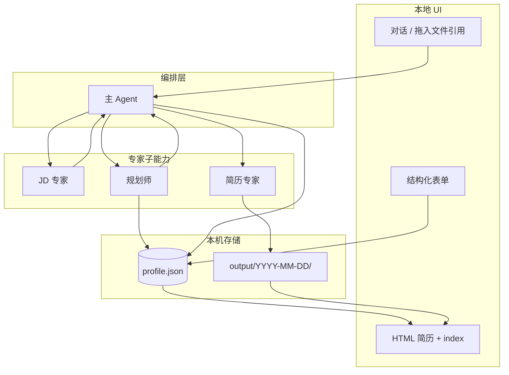
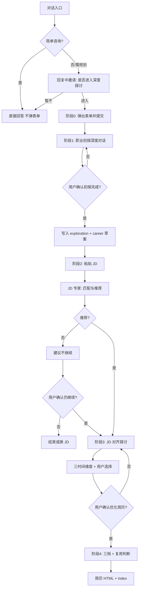
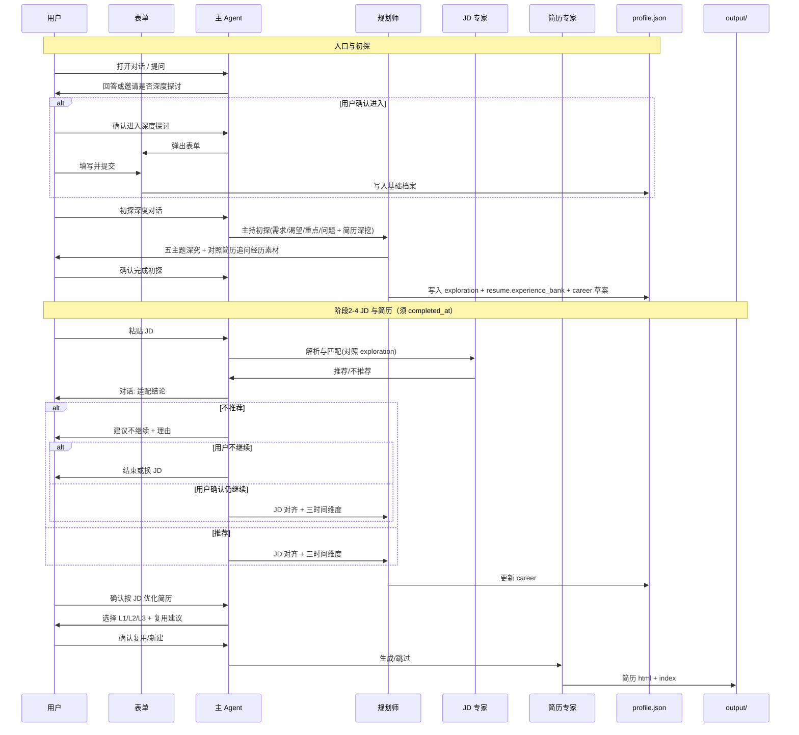
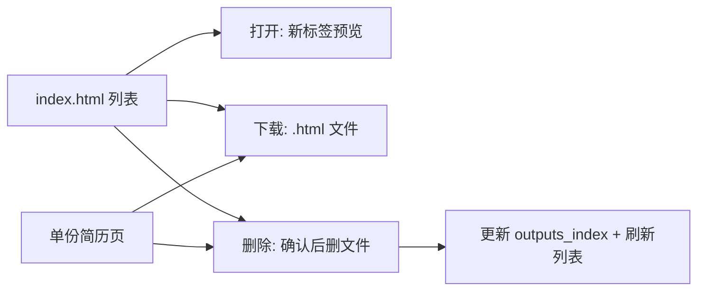
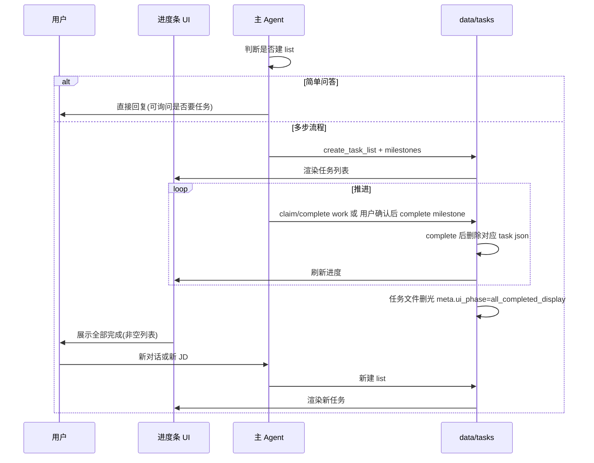

# 个人职业规划 Agent — 产品需求文档（PRD）

| 属性 | 内容 |
|------|------|
| 文档版本 | v0.8 |
| 状态 | 草案（已对齐产品讨论结论） |
| 项目 | AI-Optimized-Resume-V2 |
| 最后更新 | 2026-05-21 |

## 目录

- [目录](#目录)
- [1. 概述](#1-概述)
  - [1.1 背景与问题](#11-背景与问题)
  - [1.2 产品定位](#12-产品定位)
  - [1.3 产品优先级](#13-产品优先级)
  - [1.4 核心价值](#14-核心价值)
  - [1.5 成功指标](#15-成功指标)
  - [1.6 范围边界](#16-范围边界)
- [2. 目标用户与场景](#2-目标用户与场景)
  - [2.1 目标用户](#21-目标用户)
  - [2.2 典型场景](#22-典型场景)
- [3. 产品原则与红线](#3-产品原则与红线)
- [4. 用户旅程与 Agent 架构](#4-用户旅程与-agent-架构)
  - [4.1 Agent 架构](#41-agent-架构)
  - [4.2 阶段总览](#42-阶段总览)
  - [4.3 时序图（主路径）](#43-时序图主路径)
- [5. 功能规格](#5-功能规格)
  - [5.1 职业档案（长期记忆）](#51-职业档案长期记忆)
    - [5.1.0 对话入口与深度探讨邀请（先于表单）](#510-对话入口与深度探讨邀请先于表单)
    - [5.1.1 建档表单（用户确认进入后）](#511-建档表单用户确认进入后)
    - [5.1.2 对话增量更新](#512-对话增量更新)
    - [5.1.3 简历输入](#513-简历输入)
    - [5.1.4 长期规划与初探存储](#514-长期规划与初探存储)
    - [5.1.5 能力偏好标签（用于文件名与推荐）](#515-能力偏好标签用于文件名与推荐)
    - [5.1.6 `profile.json` 结构纲要](#516-profilejson-结构纲要)
  - [5.2 职业初探深度对话（确认进入 + 表单后 · JD 前）](#52-职业初探深度对话确认进入-表单后-jd-前)
    - [5.2.1 定位](#521-定位)
    - [5.2.2 对话依据与探索主题](#522-对话依据与探索主题)
    - [5.2.2.1 简历深度追问（要求）](#5221-简历深度追问要求)
    - [5.2.3 初探结束与落档](#523-初探结束与落档)
    - [5.2.4 已有初探档案的用户](#524-已有初探档案的用户)
    - [5.2.5 Skill 机制（Harness 显式加载）](#525-skill-机制harness-显式加载)
  - [5.3 JD 分析（流程内环节，非独立产品功能）](#53-jd-分析流程内环节非独立产品功能)
    - [5.3.1 定位](#531-定位)
    - [5.3.2 输入](#532-输入)
    - [5.3.3 处理](#533-处理)
    - [5.3.4 输出](#534-输出)
    - [5.3.5 JD 建议闸门（软阻断，用户可覆盖）](#535-jd-建议闸门软阻断用户可覆盖)
    - [5.3.6 公司画像（TODO）](#536-公司画像todo)
  - [5.4 JD 对齐探讨、三时间维度与优化确认](#54-jd-对齐探讨三时间维度与优化确认)
    - [5.4.1 多轮探讨](#541-多轮探讨)
    - [5.4.2 三时间维度（针对当前 JD，每次须呈现）](#542-三时间维度针对当前-jd每次须呈现)
    - [5.4.3 「优化确认」的定义](#543-优化确认的定义)
  - [5.5 简历优化与优化程度](#55-简历优化与优化程度)
    - [5.5.1 三档选项（通用优化与针对 JD 优化共用）](#551-三档选项通用优化与针对-jd-优化共用)
    - [5.5.2 产出物](#552-产出物)
  - [5.6 已有简历复用](#56-已有简历复用)
  - [5.7 HTML 交付](#57-html-交付)
    - [5.7.1 生成范围](#571-生成范围)
    - [5.7.2 目录与会话](#572-目录与会话)
    - [5.7.3 文件命名](#573-文件命名)
    - [5.7.4 页面结构](#574-页面结构)
    - [5.7.5 打印 PDF](#575-打印-pdf)
    - [5.7.6 简历文件管理（打开 / 下载 / 删除）](#576-简历文件管理打开-下载-删除)
  - [5.8 任务系统（Task System / Harness）](#58-任务系统task-system-harness)
    - [5.8.1 定位与职责划分](#581-定位与职责划分)
    - [5.8.2 何时创建任务（动态，非固定模板）](#582-何时创建任务动态非固定模板)
    - [5.8.3 任务类型](#583-任务类型)
    - [5.8.4 存储结构](#584-存储结构)
    - [5.8.5 工具与状态机（强约束）](#585-工具与状态机强约束)
    - [5.8.6 任务完成与删除（按文件，非删目录）](#586-任务完成与删除按文件非删目录)
    - [5.8.7 前端进度条 UI](#587-前端进度条-ui)
    - [5.8.8 与 PRD 主路径的映射（示例，非固定）](#588-与-prd-主路径的映射示例非固定)
    - [5.8.9 运行时序（Task、UI 与主 Agent）](#589-运行时序taskui-与主-agent)
    - [5.8.10 放弃与切换](#5810-放弃与切换)
- [6. 非功能需求](#6-非功能需求)
  - [6.1 隐私与数据](#61-隐私与数据)
  - [6.2 性能与成本（自用）](#62-性能与成本自用)
  - [6.3 可观测（作品向）](#63-可观测作品向)
- [7. 版本规划与 TODO](#7-版本规划与-todo)
  - [7.1 MVP（v0.1）](#71-mvpv01)
  - [7.2 后续版本](#72-后续版本)
  - [7.3 TODO 清单](#73-todo-清单)
- [8. 决策记录](#8-决策记录)
- [附录 A：默认能力偏好标签（初版）](#附录-a默认能力偏好标签初版)
- [附录 B：确认话术（建议）](#附录-b确认话术建议)
- [附录 C：仓库目录约定（建议）](#附录-c仓库目录约定建议)

---

## 1. 概述

### 1.1 背景与问题

求职与职业发展中，从业者常面临：简历与目标岗位匹配度不清晰、优化标准不一、缺乏对「当前能力—下一跳—长期路径」的统一视角，且通用工具难以结合个人长期记忆持续迭代。

### 1.2 产品定位

**面向 IT 全类的职业发展 Agent（计算机相关岗位 MVP，后续扩展多行业）**：以结构化职业档案（`profile.json` 长期记忆）与 **动态 Task 系统** 为双轨状态。用户进入产品后 **先对话**，主 Agent 用 LLM 判断是否需要 **深度探讨与规划**；仅在用户 **确认进入** 后弹出结构化表单，再进入初探 → JD → 简历主路径。简单咨询可始终不弹表单、不建 Task。

### 1.3 产品优先级

| 优先级 | 目标 | 说明 |
|--------|------|------|
| **P0** | 作品展示 | 可演示、可讲解、可复现；仓库提供脱敏样例，不含真实用户数据 |
| **P1** | 自用 | 本机真实档案与 JD 流程，提升投递准备效率 |
| **不做** | 商业化 | 不设计账号体系、付费、多租户；隐私按本地优先 |

### 1.4 核心价值

- **根基**：用户自愿进入深度探讨并提交表单后，通过初探对话厘清内心需求、职业渴望与当下重点，写入 JSON。
- **短期**：JD 适配判断清晰；系统建议不推荐时透明说明原因，用户确认继续后才产出可打印简历 HTML。
- **中期**：下一跳方向与简历表达一致，并与初探结论一致；避免无效优化。
- **长期**：当前能力、下一跳、3–5 年路径写入 JSON，跨会话延续；能力偏好标签可积累复用。

### 1.5 成功指标

**作品展示（P0）**

- 端到端 Demo 可跑通：对话入口 → 用户确认进入深度探讨 → 表单 → **职业初探落档** → 粘贴 JD → … → 生成 HTML + `index.html`。
- 仓库内含 `profile.example.json` 与脱敏样例 output，Clone 即可理解产品结构。
- 可讲解技术亮点：主 Agent 编排、**动态 Task 系统**（进度条 + 强约束 + 可审计）、**前置初探**、JD 闸门、三档优化、简历复用、JSON 长期记忆、顶栏规划渲染。

**自用（P1）**

- 单次「JD → 确认 → HTML」流程完成耗时（主观可接受即可）。
- 已有适配简历时被正确识别并复用（跳过或增量优化）的比例。
- 能力偏好标签在对话中补充后，后续文件名与推荐逻辑可复用。

**隐私与合规（与优先级绑定）**

- 真实 `profile.json` 与 `output/**` 不进入版本库。
- 文档说明模型 API / 联网 Tool 的数据范围（见 §6）。

### 1.6 范围边界

| 在范围内（MVP） | 不在范围内（MVP） |
|-----------------|-------------------|
| IT 全类岗位（开发、测试、运维、数据、AI、技术产品等） | 多行业通用知识库 |
| 简历仅粘贴；JD 仅粘贴 | 简历/JD 文件上传 |
| 用户确认后结构化表单 + JSON 档案 | 启动即强制弹表单 |
| 确认后职业初探深度对话（结论写入 JSON） | 未确认进入深度探讨不得要求填表 |
| 对话增量更新档案；不保存会话历史 | 完整对话历史持久化 |
| 仅优化后简历生成 HTML | JD 报告、长期规划单独 HTML |
| 本地 HTML + 索引页（打开/下载/删除） | 自动投递、招聘站 API |
| 动态任务系统（`data/tasks/`，强约束，进度条 UI） | 固定流水线模板；多 Agent `owner` 认领（MVP 暂缓） |
| `.agent` 三 Skills + Harness `load_skill` | Cursor 自动 skill；IDE 绑定 |

---

## 2. 目标用户与场景

### 2.1 目标用户

- **主要**：将本项目作为 **作品展示** 的开发者（本人），需可演示 Agent 架构与职业闭环。
- **次要**：同一使用者的 **日常自用**，在本机维护真实档案与简历产出。

### 2.2 典型场景

| 场景 | 用户行为 | 系统行为 |
|------|----------|----------|
| 打开产品 / 闲聊 | 简单提问 | 主 Agent 直接回答；**不弹表单**、不建 Task（§5.1.0） |
| 进入深度探讨 | 在回复中选择「进入深度探讨与规划」 | 弹出结构化表单；提交后生成 `profile.json` 并进入初探 |
| **职业初探（首次）** | 表单提交后与规划师深度对话 | 加载 `career-inner-exploration`：**五主题 + 简历深挖 + 完整清单** → 写入 `exploration.*` 与 `resume.experience_bank` |
| **初探复盘** | 已有初探结论，要求更新 | 同 skill **短路径**：读现有档案 → 哪块变了 → 交叉深挖 → 更新 summary → 落档 |
| 投前评估 | 初探完成后粘贴目标 JD | JD 专家对照档案+简历输出匹配与是否推荐；不推荐则**建议**不继续，用户确认后仍可继续 |
| JD 对齐 | JD 闸门通过后 | 规划师加载 `career-jd-alignment`：三时间维度、路径选择 → 更新 `career.*` |
| 确认优化 | 用户确认按该 JD 优化简历 | 简历专家加载 `resume-module-optimize`：三档 + `work` 模块化 ReAct → HTML |
| 复用历史 | 拖入聊天框引用已有 HTML，或口头指定文件名 | 以用户指定为准；未指定则 Agent 推荐并由用户确认 |
| 查看规划 | 打开任意简历 HTML | 顶栏展示初探摘要、档案摘要与长期规划 |
| 管理简历 | 在索引页或简历页操作 | **打开**、**下载**、**删除** 本机 HTML 简历文件 |
| 任务进度 | 侧边栏/顶栏查看当前 list | 有任务则展示进度条；全部完成后展示「已完成」占位直至新对话或新 list |
| 简单咨询 | 单次问答 | Agent 判断不建任务；可对话询问「是否需要拆成任务」 |
| 放弃当前流程 | 换 JD 或改做规划 | 删除对应该 list 的 **任务文件**；可新建另一 `list_id` |

---

## 3. 产品原则与红线

1. **真实**：禁止虚构未提供的经历、项目、职级；进取档仅允许强化表达与 ATS 关键词，不得造假。
2. **JD 建议闸门（可覆盖）**：JD 不匹配或不推荐时，系统 **明确建议** 用户不要继续，并说明理由；**不隐瞒** 不推荐结论。若用户 **仍确认继续**，则进入后续探讨与简历优化流程。
3. **优化确认**：探讨结束后，须用户 **明确确认**「按该 JD 优化简历」后，才调用简历专家生成 HTML。
4. **用户决策权**：是否复用已有简历、是否采纳 Agent 推荐，均由用户确认；支持拖入文件引用。
5. **自愿深入**：不强制首屏表单；深度探讨须用户确认后再填表（§5.1.0）。未完成 **职业初探落档** 前，不进入 JD/简历主流程（见 §5.2.4）。
6. **先计划再执行（Task 强约束）**：凡 Agent 判定需拆分的流程，须先 `create_task` 再 `claim/complete`；有 **active** 任务 list 时不得跳过 `blockedBy`（§5.8）。
7. **本地优先**：`profile.json` 与 `data/tasks/**` 存本机；会话对话不持久化；真实数据不进 Git。
8. **透明**：涉及外部 API 或浏览器 Tool 时，在文档与交互中说明数据用途。

---

## 4. 用户旅程与 Agent 架构

本章先介绍 **Agent 架构**（§4.1），再述 **主路径阶段**（§4.2）与 **运行时协作时序**（§4.3）。功能规格见第 5 章。

### 4.1 Agent 架构



| 角色 | 职责 |
|------|------|
| **主 Agent** | 统一编排入口：对话应答、**LLM 判断是否邀请深度探讨**、用户确认后才触发表单（§5.1.0）、档案 merge、`load_skill` 分发、Task 编排（§5.8）、闸门与确认、复用与 output 索引；按需调用专家子能力 |
| **规划师** | 被主 Agent 调用；`load_skill`：`career-inner-exploration`（首次/复盘）、`career-jd-alignment`（JD 对齐） |
| **JD 专家** | 被主 Agent 调用；初探完成后：JD 解析、匹配、推荐与否；对话输出，无 HTML；**不** 加载 skill |
| **简历专家** | 被主 Agent 调用；`load_skill("resume-module-optimize")`；三档 + `work` 模块化 ReAct + HTML |

**不保存** 完整会话历史；仅依赖 `profile.json` 与 `output/` 下文件作为跨会话上下文。

### 4.2 阶段总览



> **Task 层（§5.8）**：用户确认进入深度探讨后才建 `explore_*` 等 list；简单问答不建 Task。

| 阶段 | 名称 | 参与角色 | 产出 |
|------|------|----------|------|
| — | 对话入口（可选） | 主 Agent | 回答；可能发出深度探讨邀请 |
| 0 | 结构化表单 | 表单 UI（确认进入后弹出） | `profile.json` 基础字段 |
| 1 | **职业初探** | 主 Agent + 规划师 | `exploration.*`、`resume.experience_bank`、`career.*` 草案 |
| 2 | JD 评估 | 主 Agent + JD 专家 | 对话：推荐/不推荐 |
| 3 | JD 对齐 | 主 Agent + 规划师 | 更新 `career.*`；优化确认 |
| 4 | 简历优化 | 主 Agent + 简历专家 | `output/` 下 HTML |

### 4.3 时序图（主路径）



> Task 与进度条 UI 的协作时序见 **§5.8.9**。

---

## 5. 功能规格

### 5.1 职业档案（长期记忆）

#### 5.1.0 对话入口与深度探讨邀请（先于表单）

**启动行为**：用户进入产品后 **仅呈现对话界面**，**不** 默认弹出结构化表单。

| 情况 | 主 Agent 行为 |
|------|----------------|
| **简单咨询** | 直接回答（概念、行业、流程说明等）；可不建 Task；可顺带一句询问「是否需要深度探讨」（不强制） |
| **需深度探讨/规划**（LLM 判断） | 在回复中说明进入初探的价值，并提供 **明确选项** 供用户选择（见下） |

**LLM 判断为「可能需深度探讨」的典型信号**（MVP 由主 Agent 判断，后续可规则化，见 T-06）：

- 用户表达求职/转行/迷茫/职业规划/想理清方向等
- 用户粘贴 JD 或简历并要求「从整体规划开始」
- 多轮对话已涉及价值观、长期目标而非单次事实问答

**用户选择（须在回复中可点击或话术确认）**：

| 选项 | 系统行为 |
|------|----------|
| **进入深度探讨与规划** | 弹出 **结构化表单**（§5.1.1）；提交后创建 `explore_*` Task list（若启用 Task）并进入 §5.2 |
| **暂不，继续聊聊** | 保持普通对话，不弹表单 |

> 未确认「进入深度探讨」前，**不得** 强制要求填写表单或开始初探完整清单（五主题 + 简历深挖）。

#### 5.1.1 建档表单（用户确认进入后）

- 用户选择 **进入深度探讨与规划** 后，才展示 **结构化 Web 表单** 一次性采集（必填校验、减少遗漏）。
- 表单含：基本信息、求职意向、能力偏好多选（附录 A）、**简历全文粘贴**（仅粘贴，不上传）等。
- 提交后写入本机 **`profile.json`**（长期记忆事实源），并进入 §5.2 职业初探。

#### 5.1.2 对话增量更新

- 会话中识别到新事实（技能、项目、意向变化等）时，主 Agent **提议** 更新项。
- 用户同意后 merge 入 `profile.json`（含 `meta.updated_at` 版本信息）。

#### 5.1.3 简历输入

- **仅支持粘贴** 简历全文至档案字段 `resume.source_text`（MVP 不支持上传）。

#### 5.1.4 长期规划与初探存储

以下内容 **仅存 JSON**，不单独生成 HTML：

**职业初探（§5.2，用户确认进入并提交表单后、JD 前写入）**

- `exploration` — 见 §5.2.3；含内心需求、渴望、职业需要、当下重点、当前问题及初探摘要
- `resume.experience_bank` — 初探阶段 **简历深度追问** 补充的经历素材（§5.2.2），供后续 JD 匹配与简历优化引用；**不** 改写 `resume.source_text` 原文

**长期规划（初探与 JD 阶段逐步完善）**

- `career.current_assessment` — 当前能力评估（结构化 + 摘要）
- `career.next_hop` — 下一跳建议（含用户已选方案）
- `career.horizon_3_5y` — 3–5 年路径影响（含用户已选路径）
- 用户每次在「三时间维度」中的 **显式选择** 须回写 JSON（如 `career.selected_path_id`）；JD 阶段须 **引用** 初探结论，避免与已落档意愿冲突

#### 5.1.5 能力偏好标签（用于文件名与推荐）

**用途**：供 Agent 推荐复用简历时参考；其中 **文件名** 中的 `{能力偏好摘要}` 由 **LLM 动态选取**（见 §5.7.3），非简单拼接 `selected[]`。

**三类数据来源**（职责不同，不是三种「并列用户标签」）：

| 类型 | 说明 | 存储位置 |
|------|------|----------|
| **默认标签（词表）** | 系统预置 IT 常见方向，供表单多选 | `config/preference-tags-default.json`（附录 A），**不写入** `profile.json` |
| **用户已选** | 表单多选结果 | `preference_tags.selected[]` |
| **动态补充** | 对话中确认后的新标签（词表未覆盖） | `preference_tags.custom[]` |

对话中若出现新偏好（如「边缘计算」），主 Agent 询问是否加入 `custom[]`；确认后写入 `profile.json`。

**文件名标签：LLM 动态选取（生成 HTML 前）**

由 **简历专家**（或主 Agent 在生成文件名前一步）根据 **`profile.json` 全部相关内容**（含 `exploration`、`career`、简历原文）及 **当前对话上下文**（本 JD、本轮优化目标、用户口头强调的方向）从候选池选 **1–3** 个标签，拼入 `{YYYY-MM-DD}-{能力偏好摘要}.html`。

**候选池与优先级**（LLM 只可从下列集合中选，**禁止** 自造词表外新词作为文件名标签）：

| 优先级 | 来源 | 说明 |
|--------|------|------|
| 1 | `preference_tags.selected[]` | 用户表单已选，**优先选用** |
| 2 | `preference_tags.custom[]` | 对话已确认补充 |
| 3 | 默认词表中 **用户未选** 的项 | 若与当前 JD/上下文更贴切，**允许** 选用（如表单未勾「云原生」但本 JD 强依赖云原生） |

**选取约束**：

- 最多 **3** 个标签，`-` 连接；单标签最长 **16** 字符；非法文件名字符替换为 `_`。
- 须在生成 HTML 时写入 `outputs_index[].filename_tags[]`（或等价字段）留痕，便于复用判断与审计。
- 选取理由可在对话中 **一句说明**（非必须写入文件名）。

#### 5.1.6 `profile.json` 结构纲要

```json
{
  "meta": { "version": 1, "updated_at": "ISO8601" },
  "basic": {},
  "skills": {},
  "intent": {},
  "constraints": {},
  "exploration": {
    "completed_at": null,
    "inner_needs": "",
    "desires": "",
    "career_needs": "",
    "priorities_now": "",
    "current_problems": "",
    "summary": ""
  },
  "career": {
    "current_assessment": {},
    "next_hop": {},
    "horizon_3_5y": {},
    "selected_path_id": "",
    "jd_override": []
  },
  "resume": {
    "source_text": "",
    "experience_bank": {
      "items": [],
      "narrative_summary": ""
    }
  },
  "preference_tags": {
    "selected": [],
    "custom": []
  },
  "outputs_index": []
}
```

`outputs_index[]`：记录本机已生成 HTML 简历的元数据（路径、日期、**`filename_tags[]`（LLM 当次选取）**、关联 JD 指纹 optional），供 Agent 判断复用。

---

### 5.2 职业初探深度对话（确认进入 + 表单后 · JD 前）

#### 5.2.1 定位

深度主路径的 **第一阶段对话**，在用户 **确认进入深度探讨** 且 **提交表单（§5.1.1）** 后开始。此前用户可与主 Agent 自由闲聊（§5.1.0）。本阶段 **不生成/不改写** 面向投递的简历 HTML，但须完成两类探索：

1. **内心五主题**：真实需求、渴望、职业需要、当下重点、当前问题 → 形成后续 JD 与简历的 **价值锚点**（`exploration.*`）。
2. **简历深度追问**：基线简历（`resume.source_text`）是个人经历的 **浓缩**，无法承载全部事实；规划师须 **逐步追问**，把未写入简历的项目、职责、成果、量化与可迁移能力沉淀到 `resume.experience_bank`，供 §5.3–§5.5 匹配与优化时 **有据可选用**。

由 **主 Agent** 主持，**规划师** 主导提问与归纳；JD 专家、简历专家 **不参与** 本阶段（简历专家仅在 §5.5 消费 `experience_bank`）。

规划师在进入本阶段时 **必须加载** 项目 Skill：`career-inner-exploration`（见 §5.2.5、`.agent/skills/`）。

#### 5.2.2 对话依据与探索主题

- **输入依据**：表单已填写的结构化字段 + 粘贴的基线简历（`resume.source_text`，如有）。
- **双线并行（均须覆盖）**：
  - **内心线**：五主题表格（下表）— 每主题 **至少 2–4 轮** 深究，一次一问。
  - **简历线**：对照 `source_text` 的 **深度追问**— 与内心线 **交织进行**（每完成 1–2 个主题后宜穿插 1 轮简历对照），并在五主题结束后安排 **集中简历深挖段**（§5.2.2.1）。

| 主题 | 说明 | 写入字段 |
|------|------|----------|
| 内心真实需求 | 用户真正想解决的问题或追求的状态 | `exploration.inner_needs` |
| 渴望 | 理想工作/生活方式、成就感来源 | `exploration.desires` |
| 职业需要 | 理性层面的岗位、行业、成长诉求 | `exploration.career_needs` |
| 当下最重要 | 未来 6–12 个月最优先的 1–3 件事 | `exploration.priorities_now` |
| 当前问题 | 阻碍、焦虑、技能/机会缺口 | `exploration.current_problems` |
| 简历经历扩充 | 发掘简历未写清/未写出的经历与可证明成果 | `resume.experience_bank` |

对话可多轮，允许沉默、反复与追问；主 Agent 根据回答 **提议** 更新 `preference_tags.custom[]` 或表单相关字段（须用户确认）。

**原则**：简历追问服务于 **素材完备** 与 **价值锚点对齐**（例如用户渴望「技术影响力」→ 追问简历中是否有带人、方案、开源等未写出的证据），**不是** 在本阶段润色或改写 `source_text`。

#### 5.2.2.1 简历深度追问（要求）

| 项 | 要求 |
|----|------|
| 触发 | 用户已提供 `resume.source_text` 时 **必须** 执行；未提供则先说明价值并邀请粘贴，仍无则记入 `experience_bank` 元数据「待补充」，不阻塞五主题 |
| 最少轮次 | **集中深挖段** 至少 **3–5 轮**（一次一问）；全阶段简历相关追问合计建议 **≥6 轮**（含与五主题交织的对照问） |
| 追问方向 | 简历省略的时间段/项目；职责边界与 **个人贡献** vs 团队；量化结果与佐证；未写出的技术栈/工具；可迁移到目标方向的 **隐性能力** |
| 禁止 | 虚构经历；替用户改简历正文；在本阶段输出 HTML |
| 落档 | 结构化条目写入 `resume.experience_bank.items[]`（`period`、`org_or_project`、`role`、`highlights[]`、`skills_demonstrated[]`、`source`：`resume_gap` \| `dialogue`）；`narrative_summary` 为用户确认后的 **经历素材摘要**（200–500 字，供 JD/简历 Agent 速读） |
| 与复盘 | 初探复盘时增加探针：「简历里有没有 **新经历/新成果** 要补进 experience_bank？」仅对 **新增/变化** 追问 |

问题库见 skill `phases.md`「简历深度追问」节。

#### 5.2.3 初探结束与落档

用户 **确认完成初探**（见附录 B）后：

1. 规划师输出 **初探摘要**（`exploration.summary`），用户确认或修订。
2. 写入 `exploration.*` 各字段；写入或合并 `resume.experience_bank`（无新素材时保留既有 bank，须在对话中说明「沿用上次」）。
3. 设置 `exploration.completed_at` 为 ISO8601 时间。
4. 同步初始化或更新 `career.current_assessment` / `career.next_hop` / `career.horizon_3_5y` 的 **草案**（JD 阶段可再细化）。
5. 主路径 **解锁** JD 评估与简历优化相关流程。

> 未设置 `exploration.completed_at` 时，系统提示先完成初探，不接收 JD 粘贴进入评估（Returning 用户见 §5.2.4）。

#### 5.2.4 已有初探档案的用户

| 情况 | 行为 |
|------|------|
| 直接进入 JD | 若 `exploration.completed_at` 已存在且用户无意向更新，**跳过** 完整初探，粘贴 JD 并建 `jd_*` list |
| **初探复盘** | 用户要更新内心意向/优先级等；主 Agent `load_skill("career-inner-exploration")` 并走 **复盘短路径**（见下） |

**初探复盘**（非首次）定义：在已有 `exploration.*` 前提下，仅针对 **发生变化** 的部分对话更新，**不** 从零重问五主题。

复盘步骤（与 skill 清单 B 一致）：读现有 `exploration.*` 与 `resume.experience_bank` 并复述 → 一次一问「哪块变了」→ 对变化块交叉深挖 → **若有简历素材新增** 则走短路径简历追问 → 分段确认 `summary` → 更新字段并刷新 `completed_at` → 用户 `确认完成初探` / `确认复盘完成`。

#### 5.2.5 Skill 机制（Harness 显式加载）

Skills 为 `.agent/skills/{name}/SKILL.md` 操作手册，由 **自建 Harness** 的 `load_skill(name)` 注入子 Agent，**不** 由 Cursor IDE 自动发现。

设计范式参考 Superpowers [brainstorming](https://github.com/shareAI-lab/learn-claude-code/tree/main/skills/brainstorming)：一次一问、分段确认、HARD-GATE、清单化步骤。

| Skill | 执行者 | 触发 | 产出 |
|-------|--------|------|------|
| `career-inner-exploration` | 规划师 | `explore_*` / `plan_*`；首次初探或复盘 | `exploration.*`、`career.*` 草案 |
| `career-jd-alignment` | 规划师 | `jd_*` 且 JD 评估已完成（含用户确认仍继续） | 更新 `career.*`；直至用户确认优化简历 |
| `resume-module-optimize` | 简历专家 | 用户确认按 JD 优化 + `work` 子任务已建 | HTML 简历、`outputs_index` |

**模式（初探 skill）**

| 模式 | 条件 | 清单 |
|------|------|------|
| 首次 | 无 `exploration.completed_at` | 完整清单：五主题 + 简历深挖 + 交叉/路径/summary（`phases.md`） |
| 复盘 | 已有 `completed_at` 且用户要更新 | 短路径：不重问五主题；**按需** 补简历素材 |

**与 Task（§5.8）**：milestone 与 skill 绑定；`work` 由 `resume-module-optimize` 规范逐条 claim/complete。

详见 [.agent/README.md](../.agent/README.md)。

---

> **§5.1–5.6 业务顺序**：对话入口（§5.1.0，可选）→ 用户确认 → 表单（§5.1.1）→ 初探落档（§5.2）→ **JD 分析（§5.3）** → **JD 对齐（§5.4）** → **简历优化（§5.5）** → **简历复用（§5.6）**。

### 5.3 JD 分析（流程内环节，非独立产品功能）

**前置条件**：`exploration.completed_at` 已存在（§5.2）。

#### 5.3.1 定位

**JD 专家** 是主流程中的一环，服务于「是否值得为该 JD 改简历」，**不是** 面向用户的独立功能模块。

#### 5.3.2 输入

- 用户 **粘贴** JD 全文。

#### 5.3.3 处理

1. 解析：职级、职责、must-have / nice-to-have、技术栈等。
2. 匹配：对照 `profile.json`（含 **`exploration` 与 `career`**）、`resume.source_text`、**`resume.experience_bank`** 及可选已有 HTML。
3. 结论：**推荐 / 不推荐** + 理由（匹配度、硬伤、风险、与初探意向的一致性）。

#### 5.3.4 输出

- **仅通过对话** 告知用户（不生成 JD 适配报告 HTML）。

#### 5.3.5 JD 建议闸门（软阻断，用户可覆盖）

| 结论 | 系统行为 | 默认后续 | 用户覆盖 |
|------|----------|----------|----------|
| **推荐** | 对话说明匹配点、与初探意向的一致性、可选风险 | 进入 §5.4 JD 对齐探讨 | — |
| **不推荐**或匹配不足 | **明确建议不要继续**，说明硬伤、匹配度、投递风险、与初探/长期意向的冲突；不隐瞒结论 | **暂停**；不默认生成简历 HTML | 用户 **确认仍继续** 后，同等进入 §5.4（须再次提示风险） |

**两级确认（均须用户显式表达）**：

1. **继续确认**（仅在不推荐时出现）：用户确认仍要针对该 JD 往下走 → 记录至 `career.jd_override[]`（含 JD 指纹、时间、不推荐理由快照）。
2. **优化确认**（§5.4.3）：JD 对齐探讨后用户确认按该 JD 优化简历 → 进入 §5.5 选档与 §5.6 复用 → HTML 生成。

> 不推荐时 **默认不继续**；继续与优化两步确认可合并为一句实现，但语义上须区分「明知不匹配仍投递」与「确认生成简历」。

#### 5.3.6 公司画像（TODO）

- 后续引入 **联网浏览器 Tool**，根据公司名拉取公开信息辅助探讨。
- MVP 不实现；见 §7 TODO 列表。

---

### 5.4 JD 对齐探讨、三时间维度与优化确认

> 本阶段在 **JD 分析（§5.3）** 之后、**简历优化（§5.5）** 之前；探讨须 **引用** `exploration.summary` 与 `career.*`，避免与已确认的内心意向背离。

#### 5.4.1 多轮探讨

JD 评估完成，且（**推荐** 或用户已 **确认仍继续**）后，主 Agent 协同 **规划师** 围绕 **该 JD** 与用户对齐策略：初探结论在本 JD 下的含义、是否值得投入、简历应突出的叙事。

#### 5.4.2 三时间维度（针对当前 JD，每次须呈现）

| 维度 | 内容 | 存储 |
|------|------|------|
| 当前能力 | 与 **该 JD** 的匹配、强项、短板、证据缺口；对照初探中的 `current_problems` | 更新 `career.current_assessment` |
| 下一跳 | 若拿下该 JD，对 6–18 个月路径的影响；简历侧重 | 更新 `career.next_hop` |
| 3–5 年影响 | 路径 A/B 及长期履历标签影响（与初探 `horizon_3_5y` 对照） | 更新 `career.horizon_3_5y` |

用户 **显式选择** 采纳的路径/策略后写入 JSON，供简历专家默认对齐。

#### 5.4.3 「优化确认」的定义

**优化确认** = 用户在 JD 对齐探讨后，**明确表示同意按该 JD 优化简历**（固定话术或 UI 按钮，实现阶段二选一）。

- 未确认：可持续探讨、更新 JSON；**不** 生成最终简历 HTML。
- 已确认：进入 §5.5 选档 → §5.6 复用判断 → 简历专家生成 HTML。

> 与 §5.2「初探完成确认」区分：前者结束 **价值探索**；后者启动 **简历生产**。

---

### 5.5 简历优化与优化程度

**前置条件**：已完成 §5.4.3 **优化确认**。简历专家须同时读取 `resume.source_text`、**`resume.experience_bank`**（初探追问素材）与 `exploration` / `career`，在 L2/L3 档位下 **优先** 从 `experience_bank` 选取经用户确认的事实补入模块，禁止凭空添加未在 bank 与对话中出现的内容。

#### 5.5.1 三档选项（通用优化与针对 JD 优化共用）

每轮优化前，以 **选项** 方式让用户选择（可记住上次选择至档案 `resume.last_optimization_level`）：

| 档位 | 名称 | 行为 |
|------|------|------|
| L1 | 保守 | 措辞、结构、错别字；不新增未提供事实 |
| L2 | 标准 | L1 + STAR 重组 + 基于档案的量化表达 |
| L3 | 进取 | L2 + ATS 关键词补强、可迁移能力突出；**禁止虚构** |

针对 JD 的优化在 **同一三档** 下执行，额外约束：须对齐 JD 中 must-have 表述，但仍遵守红线。

#### 5.5.2 产出物

- **仅** 优化后的简历生成 **HTML**（见 §5.7）。
- 修改说明可在对话中简要给出；MVP 不要求单独 HTML 报告页。

---

### 5.6 已有简历复用


| 规则 | 说明 |
|------|------|
| 用户指定 | 支持在聊天框 **拖入** 已有 HTML 文件引用；优先级最高 |
| Agent 推荐 | 结合 JD 指纹、标签、日期、匹配分推荐；**须用户确认** |
| 跳过优化 | 当现有简历已充分适配，用户可选择不生成新文件 |
| 增量优化 | 以选定版本为基底应用所选三档规则 |

复用或新建后，更新 `outputs_index[]` 与 `profile.json` 的 `meta.updated_at`。

用户通过管理页 **删除** 简历后，须从 `outputs_index[]` 移除对应项，避免 Agent 继续推荐已删文件。

---

### 5.7 HTML 交付

#### 5.7.1 生成范围

| 类型 | 是否生成 HTML |
|------|----------------|
| 优化后简历 | **是** |
| JD 适配报告 | **否**（对话 only） |
| 长期规划 | **否**（JSON only；顶栏渲染） |

#### 5.7.2 目录与会话

- 每次会话的简历 HTML 存放在 **同一目录**：`output/YYYY-MM-DD/`（同日多轮共用；若冲突可实现 `YYYY-MM-DD-2`，实现阶段注明）。
- 提供 **`index.html`**（简历列表 / 管理页）：扫描并列出该目录（及可选全局 `outputs_index`）下全部简历，支持 **打开、下载、删除**（见 §5.7.6）。

#### 5.7.3 文件命名

```text
{YYYY-MM-DD}-{能力偏好摘要}.html
```

- `{能力偏好摘要}`：由 **LLM** 按 §5.1.5 候选池与优先级动态选取（最多 3 个，`-` 连接），依据档案 + 当轮对话/JD 上下文。
- 示例：`2026-05-21-后端-云原生-高并发.html`

#### 5.7.4 页面结构

**单份简历 HTML 页**

1. **顶栏（只读）**：从 `profile.json` 渲染 — 基本信息、**初探摘要**（`exploration.summary`）、求职意向、**长期规划摘要**（当前能力 / 下一跳 / 3–5 年已选路径）。
2. **操作区**：下载、删除、返回列表（§5.7.6）。
3. **正文**：优化后简历内容（打印友好 CSS，`@media print`）。

**索引页 `index.html`**

1. 简历文件列表（文件名、生成时间、能力偏好摘要、可选关联 JD 摘要）。
2. 每行操作：打开、下载、删除。
3. 支持从列表进入任意简历页进行打印 PDF。

#### 5.7.5 打印 PDF

用户通过浏览器「打印 → 另存为 PDF」；PRD 要求样式适配 A4、避免顶栏分页断裂（实现细节见技术设计文档）。

#### 5.7.6 简历文件管理（打开 / 下载 / 删除）

本地管理页与单份简历页均须提供以下能力（MVP 必做）：

| 操作 | 说明 | 交互要求 |
|------|------|----------|
| **打开** | 在新标签页或当前页打开该份 `.html` 简历 | 列表行提供「打开」；点击文件名默认可打开 |
| **下载** | 将对应 `.html` 文件下载到用户本地（保留原文件名） | 列表行与简历页顶栏均提供「下载」 |
| **删除** | 从磁盘删除该 `.html` 文件，并同步更新 `profile.json` 的 `outputs_index[]` 与列表展示 | **二次确认**（如弹窗「确认删除？」）；删除后不可恢复 |

**实现约定（PRD 级）**

- 因浏览器安全限制，纯静态 `file://` 难以可靠执行删除与目录刷新；须通过 **本地轻量服务**（如内置 HTTP 服务）提供列表 API 与删除接口，或由桌面壳统一托管 `output/`。
- 删除成功后：若该文件曾被 Agent 推荐复用，不再出现在索引中；主 Agent 下次扫描时以磁盘 + `outputs_index` 一致为准。
- 单份 **简历 HTML 页**顶栏（或固定操作区）须同样提供：**下载**、**删除**、返回列表（打开列表页）。



---

### 5.8 任务系统（Task System / Harness）

> 设计参考：[learn-claude-code s12_task_system](https://github.com/shareAI-lab/learn-claude-code/tree/main/s12_task_system)（持久化 JSON、`blockedBy`、`pending → in_progress → completed`）。本项目在 s12 基础上增加：**动态建图**、**milestone/work 分层**、**按文件删除任务**、**前端完成态占位**。

#### 5.8.1 定位与职责划分

| 存储 | 职责 |
|------|------|
| `profile.json` | 业务长期记忆（初探、career、简历原文、标签等） |
| `data/tasks/{list_id}/` | **流程进度**：当前在做什么、依赖顺序、可审计执行记录 |

Task 系统对用户是 **进度条**；对 Agent 是 **先计划再执行** 的硬约束（有可审计的 `claim/complete` 轨迹）。

#### 5.8.2 何时创建任务（动态，非固定模板）

- **不创建**：主 Agent 判断为 **简单问答**（如单次概念咨询）。MVP 仅 Agent 判断；可在对话中询问用户「是否需要拆成任务跟进」（**不强制**，后续可优化规则）。
- **创建**：涉及多步流程时，在对话中 **动态** `create_task` / `create_task_list`，例如：
  - 用户 **确认进入深度探讨且表单已提交** → `explore_{id}`
  - 某次粘贴的 JD → `jd_{jd_fingerprint}`
  - 纯规划探讨 → `plan_{id}`

**单活跃 list**：同一时刻仅一个 `meta.status = active` 的 list。当前 list 未结束前，须 **完成或放弃** 后才能创建下一 list（用户放弃后可立即新建另一 JD / 规划 list）。

#### 5.8.3 任务类型

| 类型 | `kind` | 完成方式 | 示例 |
|------|--------|----------|------|
| **大步骤** | `milestone` | 对话中与用户对齐后，用户确认 → Agent 调用 `complete_task` | 规划探讨落档、JD 录入、JD 分析确认、确认按 JD 优化 |
| **小步骤** | `work` | Agent 在 ReAct 内自动 `claim` → `complete`，**无需**用户逐步确认 | 优化简历「工作经历」段、优化「项目」段、生成 HTML |

大步骤未完成时，依赖它的 `work` 任务 `can_start = false`（`blockedBy` 指向 milestone 或前序任务）。

**简历优化**：用户确认 milestone「按 JD 优化简历」后，主 Agent **当场拆分** 多条 `work`（按简历模块），再自动执行完毕。

#### 5.8.4 存储结构

```text
data/tasks/{list_id}/
  meta.json                 # list 元信息（类型、active、UI 占位状态等）
  {task_id}.json            # 单任务；完成后删除该文件（非删整个目录）
data/tasks/_active.json     # 可选：当前 active 的 list_id 指针
```

**`meta.json` 建议字段**：

```json
{
  "list_id": "jd_abc123",
  "type": "explore | jd | plan",
  "status": "active | completed | abandoned",
  "ui_phase": "in_progress | all_completed_display",
  "created_at": "ISO8601",
  "related_jd_fingerprint": "optional"
}
```

**单任务 `{task_id}.json` 建议字段**（在 s12 基础上扩展）：

```json
{
  "id": "task_...",
  "list_id": "jd_abc123",
  "kind": "milestone | work",
  "subject": "JD 分析",
  "description": "...",
  "status": "pending | in_progress | completed",
  "owner": "agent",
  "blockedBy": ["task_..."],
  "requires_user_confirm": true,
  "metadata": {}
}
```

MVP：`owner` 固定为 `"agent"`（多专家 `owner` 暂缓）。

#### 5.8.5 工具与状态机（强约束）

与 s12 同构的五类能力（实现名可调整）：

| 工具 | 用途 |
|------|------|
| `create_task` / `create_task_list` | 对话中动态建 list 与任务 |
| `list_tasks` | 列出当前 list 下任务（含 blocked 状态） |
| `get_task` | 恢复执行时读完整 description |
| `claim_task` | `pending` → `in_progress`；须 `can_start` |
| `complete_task` | `in_progress` → `completed`；完成后 **删除该任务的 JSON 文件** |

**强约束规则**：

1. 存在 `active` list 时，Agent **只能**通过 claim/complete 推进已规划任务（禁止无任务硬跳阶段）。
2. 执行 `work` 前，其父级 `milestone` 须已 `completed`（文件已删且依赖满足）。
3. `complete_task` 对 `milestone`：须在用户确认话术（附录 B）之后方可调用。

#### 5.8.6 任务完成与删除（按文件，非删目录）

| 事件 | 磁盘行为 | 说明 |
|------|----------|------|
| 单任务 `complete` | **删除** `data/tasks/{list_id}/{task_id}.json` | 不采用「整目录 rm」 |
| list 内全部任务完成 | 删除所有剩余 `{task_id}.json`；**保留** `meta.json` | 更新 `meta.status = completed`，`meta.ui_phase = all_completed_display` |
| 用户放弃 list | 逐个删除该 list 下任务文件；更新 `meta.status = abandoned` | 释放 active，允许新建其他 list |

#### 5.8.7 前端进度条 UI

| 状态 | 渲染 |
|------|------|
| 无 `data/tasks` 或无可展示 list | **不展示** 任务区域 |
| 存在任务文件 | 展示任务列表 / 进度条（milestone 为主轴，work 可折叠） |
| 任务文件已全部删除且 `ui_phase = all_completed_display` | 展示 **「全部任务已完成」** 完成态（**不**渲染空列表） |
| **新对话开始** 或 **新 list 创建成功** | 清除完成态占位，渲染新 list 任务 |

> 后端在任务删光后立即落盘 `meta.ui_phase`；前端读取 meta 决定完成态，避免闪空列表。

#### 5.8.8 与 PRD 主路径的映射（示例，非固定）

Agent 按对话 **动态** 创建，下表仅为常见形态：

| 场景 | `list_id` | 典型 milestone | 典型 work（确认后动态追加） |
|------|-----------|----------------|----------------------------|
| 职业初探 / 复盘 | `explore_*` | 初探落档（`career-inner-exploration`） | — |
| 某 JD 全流程 | `jd_*` | JD 录入 → JD 分析 → JD 对齐（`career-jd-alignment`）→ 确认优化 | 简历各段（`resume-module-optimize`）、生成 HTML |
| 纯规划 | `plan_*` | 探讨落档 | — |

初探 milestone 完成并落档 `exploration.*` 后，可结束 `explore_*` list（任务文件删光 + meta 完成态）。用户粘贴 JD 时 **新建** `jd_*` list。

#### 5.8.9 运行时序（Task、UI 与主 Agent）

与 §5.8.2（何时建 list）、§5.8.7（进度条 UI）配合，描述主 Agent 与 `data/tasks`、前端的协作顺序：



#### 5.8.10 放弃与切换

- 用户放弃当前 JD / 流程：删除该 list 下**各任务文件**，更新 `meta.status = abandoned`，清除 active。
- 之后可立即：新建另一 `jd_*`（另一 JD 优化）或 `plan_*`（规划探讨）等。

---

## 6. 非功能需求

### 6.1 隐私与数据

| 项 | 要求 |
|----|------|
| 真实档案 | `profile.json` 加入 `.gitignore` |
| 任务目录 | `data/tasks/**` 加入 `.gitignore` |
| 产出目录 | `output/**` 加入 `.gitignore` |
| 仓库样例 | 提供 `profile.example.json`、脱敏 `output/example/` |
| 会话 | 不持久化对话历史 |
| 模型 API | README 说明：简历/JD 片段是否发往第三方；作品 Demo 建议用脱敏数据 |
| 浏览器 Tool（TODO） | 仅拉公开信息；失败降级；日志不落敏感全文 |

### 6.2 性能与成本（自用）

- 同 JD 且已有高适配 HTML 时，优先复用，减少重复生成。
- 档案 JSON 体积可控（简历原文除外，建议 < 2MB）。

### 6.3 可观测（作品向）

- 主路径各阶段可打点：表单提交、**初探完成**、Task list 创建/完成/放弃、`milestone`/`work` claim·complete、JD 闸门、优化确认、HTML 生成（实现期日志即可）。

---

## 7. 版本规划与 TODO

### 7.1 MVP（v0.1）

- [ ] 对话入口 + LLM 邀请深度探讨 + 用户确认后弹表单
- [ ] 结构化表单 + `profile.json` 读写（仅确认进入后）
- [ ] **Task 系统**：`data/tasks/{list_id}/`、五工具、强约束、milestone/work、按文件删除、完成态 UI
- [ ] **Harness `load_skill`** + 三 Skills：`career-inner-exploration`（含复盘短路径）、`career-jd-alignment`、`resume-module-optimize`
- [ ] **职业初探**对话 + `exploration` 落档 + 完成闸门
- [ ] 默认能力偏好标签 + 对话补充 `custom[]`
- [ ] 主 Agent + JD / 简历 / 规划师 子能力
- [ ] 初探完成后：JD 粘贴、对话闸门、JD 对齐三时间维度、优化确认
- [ ] 三档优化（含针对 JD）
- [ ] 简历复用逻辑 + 拖入文件引用
- [ ] `output/YYYY-MM-DD/` + 简历 HTML + `index.html`（打开/下载/删除）+ 顶栏渲染
- [ ] `.gitignore` + example 档案

### 7.2 后续版本

| 版本 | 内容 |
|------|------|
| v0.2 | 联网 **浏览器 Tool** 公司公开画像，辅助探讨（仍不替代 JD 闸门逻辑） |
| v1.x | **多行业** 扩展：表单字段、默认标签库、JD 解析模板按行业切换 |

### 7.3 TODO 清单

| ID | 项 | 说明 |
|----|-----|------|
| T-01 | 浏览器 Tool | 公司画像；来源标注与失败降级 |
| T-02 | 多行业 | 档案模板、标签库、专家 prompt 分行业 |
| T-03 | 确认交互 | 统一「确认优化」话术或 UI 按钮规范 |
| T-04 | 同日多会话目录 | 目录命名冲突策略（`-2` 后缀） |
| T-05 | 本地管理服务 | 为 index 提供列表/删除 API，避免 `file://` 无法删文件 |
| T-06 | Task 创建启发式 | 除 Agent 判断外，增加规则/用户默认「简单问题不建任务」 |

---

## 8. 决策记录

| 日期 | 决策 |
|------|------|
| 2026-05-21 | 行业 MVP：IT 全类；后续多行业 |
| 2026-05-21 | 档案：表单首次 + JSON；对话增量；简历仅粘贴 |
| 2026-05-21 | 优化：三档；针对 JD 同三档 |
| 2026-05-21 | JD 专家：流程环节；对话输出；不推荐则建议停止，用户确认仍继续则可进入后续流程 |
| 2026-05-21 | JD 建议闸门改为软阻断：不推荐时默认暂停，用户可覆盖继续 |
| 2026-05-21 | 简历 HTML 管理：索引页与简历页支持打开、下载、删除；删除同步 `outputs_index` |
| 2026-05-21 | 确认 = 用户同意按 JD 优化简历 |
| 2026-05-21 | 长期规划：仅 JSON；HTML 顶栏渲染 |
| 2026-05-21 | 仅简历 HTML + index；按会话目录 `output/YYYY-MM-DD/` |
| 2026-05-21 | 不保存会话历史 |
| 2026-05-21 | 能力偏好：默认词表 + `selected`/`custom`；文件名标签由 LLM 按上下文从候选池选取 |
| 2026-05-21 | 简历复用：用户指定（含拖入）> Agent 建议 > 用户确认 |
| 2026-05-21 | 优先级：作品展示 > 自用；不考虑商业化 |
| 2026-05-21 | 主路径调整：表单后 **职业初探** 前置并落档，JD/简历优化在后 |
| 2026-05-21 | 引入 **Task 系统**（§5.8）：动态 list、强约束、milestone/work、按任务文件删除、完成态 UI 占位 |
| 2026-05-21 | Task：每 JD 一 list；放弃/完成后删任务文件保留 meta；简单问答仅 Agent 判断是否建任务 |
| 2026-05-21 | 引入 `.agent` Skill `career-inner-exploration`（参考 Superpowers brainstorming），绑定职业初探阶段 |
| 2026-05-21 | 初探复盘短路径；新增 `career-jd-alignment`、`resume-module-optimize`；Skill 由 Harness `load_skill` 触发 |
| 2026-05-21 | §4.3–4.6 按业务流重排：JD 分析 → JD 对齐 → 简历优化 → 复用 |
| 2026-05-21 | §5.1.0：启动不弹表单；LLM 判断后用户确认进入再填表与初探 |
| 2026-05-21 | 初探双线：五主题 + **简历深度追问**；素材落 `resume.experience_bank`，供 JD 匹配与简历优化引用 |
| 2026-05-21 | §5.7 Agent 架构移至第 5 章；原 §5.8/§5.9 顺延为 §4.7/§5.8 |
| 2026-05-21 | Agent 架构调整为第 4 章 **§4.1**（先于阶段总览与时序图） |
| 2026-05-21 | **第 4、5 章对调**：第 4 章为用户旅程与 Agent 架构，第 5 章为功能规格 |

---

## 附录 A：默认能力偏好标签（初版）

> 表单多选数据源；实现时可按「岗位族」分组展示。对话中确认后的新标签写入 `preference_tags.custom[]`。

**岗位方向**：后端、前端、全栈、移动端、算法、AI 工程、数据开发、数据分析、测试、QA、运维、SRE、DevOps、安全、区块链、嵌入式、游戏客户端、游戏服务端、技术管理、架构师

**技术域**：云原生、微服务、高并发、分布式、消息队列、数据库、大数据、实时计算、机器学习平台、CV、NLP、推荐系统

**行业/场景**：电商、金融、政企、医疗、教育、物联网、车联网、音视频、广告、企业服务

**工作方式**：远程优先、外企、开源贡献、英文工作环境

（实现时可从上述列表选 **常用子集** 作为表单默认展示，其余折叠为「更多」；全量列表可放 `config/preference-tags-default.json`。）

---

## 附录 B：确认话术（建议）

**进入深度探讨与规划（弹出表单）**

- `确认进入深度探讨`
- `进入深度探讨与规划`

**职业初探结束 — 落档并解锁 JD 流程**

- `确认完成初探`
- `初探完成`

**不推荐时 — 仍继续（进入 JD 对齐探讨）**

- `确认继续`
- `仍要继续`

**初探复盘完成**

- `确认复盘完成`

**探讨后 — 优化简历（生成 HTML）**

- `确认按该 JD 优化简历`
- `确认优化`

---

## 附录 C：仓库目录约定（建议）

```text
AI-Optimized-Resume-V2/
  .agent/README.md
  .agent/skills/career-inner-exploration/   # SKILL.md, phases.md
  .agent/skills/career-jd-alignment/       # SKILL.md
  .agent/skills/resume-module-optimize/    # SKILL.md
  docs/prd/career-planning-agent-prd.md
  config/preference-tags-default.json   # 默认标签全量
  data/profile.json                     # gitignore
  data/profile.example.json
  data/tasks/{list_id}/                 # gitignore
    meta.json
    {task_id}.json                      # 完成后删除
  data/tasks/_active.json               # gitignore，可选
  output/YYYY-MM-DD/                    # gitignore
    index.html
    {date}-{tags}.html
```

---

*文档结束*
