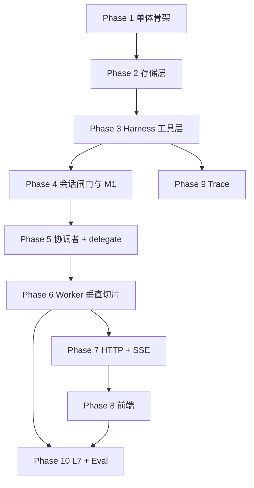

# career_os v0.1 实现计划

> **状态：** ✅ 主体已完成（2026-06-01 · main @ `dd83651`）· 余 1 项 eval 独立 commit 未提交

> **For agentic workers:** REQUIRED SUB-SKILL: Use superpowers:subagent-driven-development (recommended) or superpowers:executing-plans to implement this plan task-by-task. Steps use checkbox (`- [x]`) syntax for tracking.

**Goal:** 将当前架构文档（`docs/architecture/` + PRD + `config/workers.registry.json`）落实为可本地运行的 Python 单体 `career_os` + React 前端，完成职业规划 Agent 主路径（对话 → 初探 → JD → 策略 → 多档 HTML）。

**Architecture:** 单进程 FastAPI + Harness 平台服务（Tool/Skill/Task/Store/Worker Registry）+ LangGraph 协调者/Worker；用户仅见协调者 SSE；硬约束在 Harness（JD-R1、profile 白名单、E2/B3/Opt-1/M1）。**本计划按模块依赖排序，不采用 [08 实施顺序](../architecture/08-PRD追溯.md) 的 P0/P1/P2 编号。**

**Tech Stack:** Python 3.11+、FastAPI、Uvicorn、Pydantic v2、LangChain、LangGraph、pytest、React 19、Vite、TypeScript、Tailwind 4

---

## 完成状态（2026-06-01 审计）

| Phase | Task | 状态 | Commit / 备注 |
|-------|------|------|----------------|
| 1 | 1 healthz | ✅ | `1085b63` |
| 2 | 2–4 Store | ✅ | `a7ed592` `080eda3` `08e0bf9` |
| 3 | 5–8 Harness | ✅ | `d60d55e`–`75c5943` |
| 4 | 9–11 Gate/M1 | ✅ | `10bbd2e` |
| 5 | 12–14 Agent 骨架 | ✅ | `4b3fcb9` + real-agent plan |
| 6 | 15–19 Workers | ✅ | ReAct + LiteLLM（`feat/real-agent-worker-react`） |
| 7 | 20–21 API/SSE | ✅ | REST + chat SSE |
| 8 | 22–23 前端 | ✅ | Chat / 建档 / 进度条 |
| 9 | 24 browser_fetch | ✅ | 含于 workers commit |
| 9 | 25 Eval | ⚠️ | L1/L2/L3 用例已有；独立 `test(eval)` commit **未提交** |
| — | 会话持久化 | ✅ | `714b219`–`a57a48e` → main |
| — | 任务隔离 | ✅ | `dd83651` → main |

**测试：** `196 passed`（`uv run pytest tests/ -q`，2026-06-01）· **main @ `dd83651`**

## 已知偏差与未完成项

| 项 | 计划 | 实际 |
|----|------|------|
| Worker 子图 | boot→react→emit LangGraph | 七个 `run()` 硬编码 |
| load_skill | Harness Worker 元工具 | 仅 SkillRegistry 单测 |
| capability_bundle | delegate 注入 | 未实现 |
| task_snapshot | SSE 事件 | 未推送 |
| REST 文件 | `api/profile.py` 等 | 合并为 `api/sessions.py` |
| chat 测试 | `test_chat_sse.py` | 合并入 `test_rest.py` |
| Eval 文档 | 写入简历/CHANGELOG | ✅ 2026-05-31 补 `CASES.md` + 简历 §实测 |
| 真 LLM Worker | Task 15/16 LLM 验收 | golden 结构通过，推理仍为桩 |

**后续：** [2026-05-31-real-agent-worker-react.md](./2026-05-31-real-agent-worker-react.md)


**权威文档索引：**

| 主题 | 文档 |
|------|------|
| 模块树 | [03-系统分层](../architecture/03-系统分层.md) |
| Harness / Task / Store | [02-平台服务](../architecture/02-平台服务.md) |
| 协调者 / 派工 | [01-协调者与Worker](../architecture/01-协调者与Worker.md) |
| Session / Gate / M1 | [10-会话闸门与state](../architecture/10-会话闸门与state.md) |
| API / SSE | [05-API与流式协议](../architecture/05-API与流式协议.md) |
| Agent 图 | [07-Agent运行时](../architecture/07-Agent运行时.md) |
| Worker 契约 | [09-Worker结构化输出](../architecture/09-Worker结构化输出.md) |
| Tool Schema | [14-Harness-Tools-Schema](../architecture/14-Harness-Tools-Schema.md) |
| Profile 写入 | [13-Profile-写入权限](../architecture/13-Profile-写入权限.md) |
| Eval / Trace | [12-评测与可观测](../architecture/12-评测与可观测.md) |
| 部署 | [04-应用运行时与部署](../architecture/04-应用运行时与部署.md) |

---

## 依赖总览（非 08 顺序）



---

## Phase 1：单体骨架与配置

### Task 1: backend 工程与 `/healthz`

**Files:**
- Create: `backend/pyproject.toml`
- Create: `backend/career_os/__init__.py`
- Create: `backend/career_os/main.py`
- Create: `backend/career_os/config.py`
- Create: `backend/tests/test_health.py`

**Architecture refs:** [04 §1–2](../architecture/04-应用运行时与部署.md)

- [x] **Step 1: Write failing test**

```python
# backend/tests/test_health.py
from fastapi.testclient import TestClient
from career_os.main import app

def test_healthz():
    r = TestClient(app).get("/healthz")
    assert r.status_code == 200
    assert r.json() == {"status": "ok"}
```

- [x] **Step 2: Run test — expect FAIL**

```bash
cd backend && uv sync && uv run pytest tests/test_health.py -v
```

- [x] **Step 3: Minimal implementation**

`config.py` 读取 [04 §4](../architecture/04-应用运行时与部署.md) 环境变量：`DATA_DIR`、`OUTPUT_DIR`、`SESSION_IDLE_TTL`、`CHAT_HISTORY_MAX_MESSAGES`（40）、`CHAT_HISTORY_MAX_TOKENS`（12000）、`CHAT_HISTORY_WARN_RATIO`（0.95）。

`main.py`：`FastAPI()` + `GET /healthz`。

- [x] **Step 4: Run test — expect PASS**

- [x] **Step 5: Commit**

```bash
git add backend/
git commit -m "feat(backend): 初始化 career_os 单体与 healthz"
```

---

## Phase 2：存储层（L6）

### Task 2: ProfileStore / ResumeStore

**Files:**
- Create: `backend/career_os/platform/store/profile.py`
- Create: `backend/career_os/platform/store/resume.py`
- Create: `backend/tests/store/test_profile.py`
- Use: `data/profile.example.json`

**Architecture refs:** [02 §6](../architecture/02-平台服务.md)、[13](../architecture/13-Profile-写入权限.md)

- [x] **Step 1: Test — patch/get roundtrip**

```python
def test_profile_patch_set(tmp_path, monkeypatch):
    monkeypatch.setenv("DATA_DIR", str(tmp_path))
    from career_os.platform.store.profile import ProfileStore
    store = ProfileStore()
    store.patch([{"path": "basic.name", "value": "测试", "op": "set"}])
    assert store.get(["basic.name"])["basic"]["name"] == "测试"
```

- [x] **Step 2–4: Implement `Get/Patch` + 进程内 mutex（C1）**

- [x] **Step 5: Commit** `feat(store): ProfileStore 与 ResumeStore 读写`

### Task 3: SessionStore（messages + state + M1 元数据）

**Files:**
- Create: `backend/career_os/platform/store/session.py`
- Create: `backend/tests/store/test_session.py`

**Architecture refs:** [10 §1](../architecture/10-会话闸门与state.md)、[10 §1.5 M1](../architecture/10-会话闸门与state.md#15-m1-对话历史上限与裁剪)

- [x] **Step 1: Test — append messages + load with trim**

```python
def test_messages_trim_keeps_first_user(tmp_path, monkeypatch):
    monkeypatch.setenv("DATA_DIR", str(tmp_path))
    monkeypatch.setenv("CHAT_HISTORY_MAX_MESSAGES", "5")
    from career_os.platform.store.session import SessionStore
    s = SessionStore()
    sid = s.create_session()
    for i in range(10):
        s.append_message(sid, "user" if i % 2 == 0 else "assistant", f"m{i}")
    loaded, meta = s.load_messages_for_coordinator(sid)
    assert loaded[0]["content"] == "m0"  # 首条 user
    assert len(loaded) <= 5
    assert meta["trimmed"] is True
```

- [x] **Step 2–4: Implement**

  - 路径：`data/sessions/{id}/messages.json`、`state.json`
  - `state.json` 支持：`prior_results`、`explore_closure`、`messages_meta`、`gates`
  - `load_messages_for_coordinator` 实现 M1；计算 `usage_ratio`

- [x] **Step 5: Test — R2 reset clears session tasks binding hook**

- [x] **Step 6: Commit** `feat(store): SessionStore 与 M1 对话裁剪`

### Task 4: TaskStore + OutputStore

**Files:**
- Create: `backend/career_os/platform/store/task.py`
- Create: `backend/career_os/platform/store/output.py`
- Create: `backend/tests/store/test_task.py`

**Architecture refs:** [02 §5](../architecture/02-平台服务.md)、[A02 PRD](../prd/A02.%20机制-任务系统%20PRD.md)

- [x] **Implement:** `list_id`/`task_id` 文件布局；`ready` 禁 `claim/complete`；换 session 删绑定 list（与 SessionStore 协作）
- [x] **Test:** `create_task_list` → files on disk；`complete_task` 删 `{task_id}.json`
- [x] **Commit** `feat(store): TaskStore 与 OutputStore`

---

## Phase 3：Harness 工具层

### Task 5: Worker Registry + Skill Registry

**Files:**
- Create: `backend/career_os/platform/worker/registry.py`
- Create: `backend/career_os/platform/skill/registry.py`
- Create: `backend/tests/platform/test_worker_registry.py`
- Use: `config/workers.registry.json`、`.agent/skills/`

**Architecture refs:** [02 §2–3](../architecture/02-平台服务.md)

- [x] **Test:** 加载 7 workers；`get_worker_index()` 返回元数据列表
- [x] **Test:** `load_skill("career-inner-exploration", mode="exploration_first")` 校验 `allowed_workers`
- [x] **Commit** `feat(platform): Worker 与 Skill 注册表`

### Task 6: Tool 注册表与 `execute_tool`

**Files:**
- Create: `backend/career_os/platform/tool/registry.py`
- Create: `backend/career_os/platform/tool/handlers/profile.py`
- Create: `backend/career_os/harness/executor.py`
- Create: `backend/tests/harness/test_profile_patch_whitelist.py`

**Architecture refs:** [14](../architecture/14-Harness-Tools-Schema.md)、[13](../architecture/13-Profile-写入权限.md)

- [x] **Test — 白名单拒写**

```python
def test_asset_cannot_patch_exploration(harness):
    err = harness.execute_tool("asset", "profile_patch", {
        "path": "exploration.summary", "value": "x"
    })
    assert err.code == "profile_patch_rejected"
```

- [x] **Implement:** `coordinator_tools` vs worker tool sets；`apply_proposed_patches`
- [x] **Commit** `feat(harness): Tool 执行与白名单校验`

### Task 7: Harness 硬约束（JD-R1 / resume gate / B3）

**Files:**
- Modify: `backend/career_os/harness/executor.py`
- Create: `backend/career_os/harness/delegate.py`
- Create: `backend/tests/harness/test_delegate_rules.py`

**Architecture refs:** [01 §9](../architecture/01-协调者与Worker.md)、[02 §3.3](../architecture/02-平台服务.md)

- [x] **Test — JD-R1**

```python
def test_opportunity_blocked_without_market(harness, session_state):
    session_state["list_type"] = "jd"
    session_state["prior_results"] = {}
    err = harness.delegate_worker("coordinator", "opportunity", "eval jd", session_state)
    assert err.code == "delegate_blocked"
```

- [x] **Test — 无 optimize_confirmed 拒 resume**
- [x] **Test — Worker 无 complete_task tool**
- [x] **Commit** `feat(harness): delegate 硬约束 JD-R1 与 gate_blocked`

### Task 8: Task 工具与 B3 complete_task

**Files:**
- Create: `backend/career_os/platform/tool/handlers/task.py`
- Create: `backend/tests/harness/test_complete_task.py`

**Architecture refs:** [02 §5.5 B3](../architecture/02-平台服务.md#55-任务完成b3)

- [x] **Test:** 仅 coordinator 可 `complete_task`；Worker 返 `proposed_task_completions` 不自动 complete
- [x] **Commit** `feat(harness): Task 工具与 B3 完成规则`

---

## Phase 4：会话闸门、E2、M1-R

### Task 9: `match_gate_intent`（M2）

**Files:**
- Create: `backend/career_os/harness/gate.py`
- Create: `backend/tests/harness/test_match_gate_intent.py`

**Architecture refs:** [10 §2.3](../architecture/10-会话闸门与state.md)

- [x] **Test:** 附录 B 关键词 — `确认完成初探` → `explore_complete` / confirm
- [x] **Test:** `optimize_confirm` reject 话术
- [x] **Commit** `feat(harness): match_gate_intent 规则层`

### Task 10: `explore_closure`（E2）

**Files:**
- Create: `backend/career_os/harness/explore_closure.py`
- Create: `backend/tests/harness/test_explore_closure.py`

**Architecture refs:** [10 §2.5](../architecture/10-会话闸门与state.md#25-explore_closuree2-双-worker-收束)

- [x] **Test:** 默认 `required_workers=["identity","capability"]`；单 worker 场景另一者视为 done
- [x] **Test:** 两者 done 后允许 coordinator 写 `gates.pending`（explore_complete）
- [x] **Test:** identity/capability structured_output 含 explore 类 `gate_prompt` → 校验失败
- [x] **Commit** `feat(harness): explore_closure E2 双 Worker 收束`

### Task 11: begin_chat 编排（M1-R + I2 + A1 单飞）

**Files:**
- Create: `backend/career_os/harness/orchestrator.py`
- Create: `backend/tests/harness/test_orchestrator.py`

**Architecture refs:** [10 §1.4 I2](../architecture/10-会话闸门与state.md)、[05 §3.5 A1](../architecture/05-API与流式协议.md)

- [x] **Test:** 409 `chat_in_progress` 双发
- [x] **Test:** 410 `session_expired`
- [x] **Test:** `usage_ratio>=0.95` 或 `trimmed` 时 synthesize 上下文带 `recommend_new_session`
- [x] **Commit** `feat(harness): begin_chat 单飞、过期与 M1-R`

---

## Phase 5：Agent 运行时（协调者 + Worker 子图）

### Task 12: LangGraph 协调者主图

**Files:**
- Create: `backend/career_os/agents/state/coordinator.py`
- Create: `backend/career_os/agents/graphs/coordinator.py`
- Create: `backend/career_os/agents/lc/models.py`
- Create: `backend/tests/agents/test_coordinator_c3.py`

**Architecture refs:** [07 §3](../architecture/07-Agent运行时.md)、[01 §9 C3/WR](../architecture/01-协调者与Worker.md)

- [x] **Implement nodes:** `analyze` → `delegate` → `synthesize`
- [x] **Inject:** `worker_index` at start；无 Worker `gate_prompt` 时顺序连派；遇 gate 或 explore_closure 齐套停链
- [x] **Test (LLM or stub):** mock Worker 返 `gate_prompt` → 本轮不再 delegate（C3）
- [x] **Commit** `feat(agents): 协调者 LangGraph 与 C3`

### Task 13: Worker 子图模板 + structured_output 校验

**Files:**
- Create: `backend/career_os/agents/state/worker.py`
- Create: `backend/career_os/agents/graphs/workers/base.py`
- Create: `backend/career_os/agents/schemas/workers.py`（Pydantic，对齐 [09](../architecture/09-Worker结构化输出.md)）
- Create: `backend/tests/agents/test_worker_emit.py`

- [x] **Test:** opportunity schema 缺 `recommendation` → failed
- [x] **Test:** identity explore 输出含 `gate_prompt` → failed（E2）
- [x] **Commit** `feat(agents): Worker 子图模板与 S2 校验`

### Task 14: TraceWriter

**Files:**
- Create: `backend/career_os/platform/trace/writer.py`
- Modify: `backend/career_os/harness/executor.py`, `delegate.py`
- Create: `backend/tests/trace/test_trace_writer.py`

**Architecture refs:** [12 §2](../architecture/12-评测与可观测.md)

- [x] **Test:** `execute_tool` 后 jsonl 含 `tool.call`
- [x] **Commit** `feat(trace): JSONL TraceWriter`

---

## Phase 6：Worker 垂直切片（按业务依赖）

> 每个 Worker 一个 Task；实现 `agents/graphs/workers/{id}.py` + prompt `.tmpl` + L1/L2 测试。

### Task 15: market + opportunity（JD-R1 链）

**Files:**
- Create: `backend/career_os/agents/graphs/workers/market.py`
- Create: `backend/career_os/agents/graphs/workers/opportunity.py`
- Create: `backend/career_os/platform/prompt/market/default.tmpl`
- Create: `backend/career_os/platform/prompt/opportunity/default.tmpl`
- Create: `backend/tests/e2e/test_jd_eval_chain.py`

- [x] **Test L1:** delegate 顺序 market→opportunity；O-P1 snapshot append
- [x] **Test LLM (`-m llm`):** 粘贴短 JD → `recommendation` + trace 含两次 delegate
- [x] **Commit** `feat(workers): market 与 opportunity`

### Task 16: identity + capability（E2 初探链）

**Files:**
- Create: `backend/career_os/agents/graphs/workers/identity.py`
- Create: `backend/career_os/agents/graphs/workers/capability.py`
- Create: `backend/tests/e2e/test_explore_closure.py`

- [x] **Test:** 顺序 delegate 后 `worker_done` 齐套 → coordinator explore gate（非 Worker gate_prompt）
- [x] **Test LLM:** 确认完成初探 → `exploration.completed_at` + milestone complete（B3）
- [x] **Commit** `feat(workers): identity 与 capability 初探链`

### Task 17: strategy + asset（reuse）

**Files:**
- Create: `backend/career_os/agents/graphs/workers/strategy.py`
- Create: `backend/career_os/agents/graphs/workers/asset.py`
- Skill: `.agent/skills/career-jd-alignment/`

- [x] **Test:** strategy 产 `optimize_confirm` gate_prompt；plan list 禁止该 gate
- [x] **Test:** asset reuse `gate_prompt` + `reuse_recommendation`
- [x] **Commit** `feat(workers): strategy 与 asset`

### Task 18: resume（Opt-1 多档 HTML）

**Files:**
- Create: `backend/career_os/platform/tool/handlers/resume_html.py`
- Create: `backend/career_os/agents/graphs/workers/resume.py`
- Skill: `.agent/skills/resume-module-optimize/`

**Architecture refs:** [05 §8](../architecture/05-API与流式协议.md)、Opt-1

- [x] **Test L1:** `selected_optimization_levels=["标准","进取"]` → 2 次 `write_resume_html`；顺序保守→标准→进取
- [x] **Test:** 完成后 patch `last_optimization_levels`
- [x] **Test LLM:** 生成 HTML 文件存在于 `output/YYYY-MM-DD/`
- [x] **Commit** `feat(workers): resume 多档 write_resume_html`

### Task 19: asset register + `register_outputs_index`

**Files:**
- Create: `backend/career_os/platform/tool/handlers/outputs.py`
- Modify: `backend/career_os/agents/graphs/workers/asset.py`

**Architecture refs:** [05 §7](../architecture/05-API与流式协议.md)、[01 §4.3](../architecture/01-协调者与Worker.md)

- [x] **Test:** resume `html_deliveries` → asset 只读登记 `outputs_index`
- [x] **Commit** `feat(workers): asset 产物登记`

---

## Phase 7：HTTP API + SSE

### Task 20: REST 端点（非 chat）

**Files:**
- Create: `backend/career_os/api/profile.py`
- Create: `backend/career_os/api/tasks.py`
- Create: `backend/career_os/api/outputs.py`
- Create: `backend/career_os/api/sessions.py`
- Create: `backend/tests/api/test_rest.py`

**Architecture refs:** [05 §2](../architecture/05-API与流式协议.md)

- [x] **Implement:** `/v1/sessions/new`、`/ping`、`/profile/onboarding`、`GET /profile`、`GET /tasks`、`GET/DELETE /outputs`
- [x] **Commit** `feat(api): REST 端点与 session 生命周期`

### Task 21: `POST /v1/chat` SSE

**Files:**
- Create: `backend/career_os/api/chat.py`
- Create: `backend/career_os/runtime/sse.py`
- Create: `backend/tests/api/test_chat_sse.py`

**Architecture refs:** [05 §3](../architecture/05-API与流式协议.md)

- [x] **Test:** 事件顺序 `session` → `token`* → `done`；含 `task_snapshot` / `gate` / `history_notice`
- [x] **Test:** Worker 不产生 SSE token
- [x] **Commit** `feat(api): chat SSE 与协调者流式`

---

## Phase 8：前端（L1）

### Task 22: Vite + Chat SSE 壳

**Files:**
- Create: `web/package.json`, `web/vite.config.ts`, `web/src/…`（见 [06](../architecture/06-前端架构.md)）
- Create: `web/src/hooks/useChatSSE.ts`
- Create: `web/src/pages/ChatPage.tsx`

- [x] **Implement:** POST SSE、`token` 拼接、409/410 处理、R2 刷新 `sessions/new`
- [x] **Implement:** `history_notice` 非阻塞提示条（M1-R）
- [x] **Commit** `feat(web): Chat 页与 SSE 流式`

### Task 23: Onboarding + TaskProgress + Outputs

**Files:**
- Create: `web/src/pages/OnboardingForm.tsx`
- Create: `web/src/components/TaskProgress.tsx`
- Create: `web/src/pages/OutputsPage.tsx`

- [x] **约束:** 无任务开始/放弃按钮；无三档多选控件（Opt-1）
- [x] **Commit** `feat(web): 建档、进度条与产物列表`

---

## Phase 9：L7 + Eval

### Task 24: `browser_fetch`（L7-C）

**Files:**
- Create: `backend/career_os/platform/tool/handlers/browser_fetch.py`
- Create: `backend/tests/harness/test_browser_fetch_degrade.py`

**Architecture refs:** [11-L7](../architecture/11-L7-浏览器Tool.md)

- [x] **Test:** 无 `SEARCH_API_KEY` → `status=failed` Worker 仍可完成
- [x] **Commit** `feat(l7): browser_fetch 与降级`

### Task 25: Eval 套件（≥20 case 分布）

> **状态：** ⚠️ 部分完成（2026-05-31）：`tests/eval/CASES.md` + `test_eval_coverage.py` 已补；golden LLM 结构通过；Worker 仍为 stub。

**Files:**
- Create: `backend/tests/eval/` 目录与 case 清单
- Create: `backend/pyproject.toml` markers：`llm`、`no_llm`

**Architecture refs:** [12 §3](../architecture/12-评测与可观测.md)

- [x] **L1 ≥8:** 白名单、JD-R1、E2、B3、M1 trim、session reset、Tool schema
- [x] **LLM ≥1 golden:** 初探→JD(market→opportunity)→策略→多档 HTML（结构 + trace 断言）
- [x] **Document:** eval 通过率与 token 摘要写入 `docs/简历项目描述.md`（2026-05-31）
- [ ] **Commit** `test(eval): L1 与 golden path 评测集`

---

## 自检（Spec Coverage）

| 架构结论 | 覆盖 Task |
|----------|-----------|
| WR Worker Registry | 5, 12 |
| JD-R1 market→opportunity | 7, 15 |
| E2 explore_closure | 10, 16 |
| Opt-1 三档纯对话 | 18, 22 |
| B3 complete_task | 8, 16 |
| M1 + M1-R | 3, 11, 21, 22 |
| C3 / 顺序连派 | 12 |
| Profile 白名单 V1 | 6 |
| HTML resume→asset | 18, 19 |
| I2 / A1 | 11, 21 |
| Trace JSONL | 14 |
| browser_fetch 降级 | 24 |

**刻意 v0.1 不做：** 执行层、跨 session 对话、LangGraph 跨请求 checkpoint、trace replay CLI（见 [00 §7](../architecture/00-架构总览.md)）。

---

## 执行方式

Plan 已保存至 `docs/superpowers/plans/2026-05-31-career-os-v0.1.md`。

**1. Subagent-Driven（推荐）** — 每 Task 派生子 agent，Task 间人工/协调者 review  

**2. Inline Execution** — 本会话按 Phase 批量执行，Phase 末 checkpoint  

你希望用哪种方式开始？建议从 **Task 1** 起。
