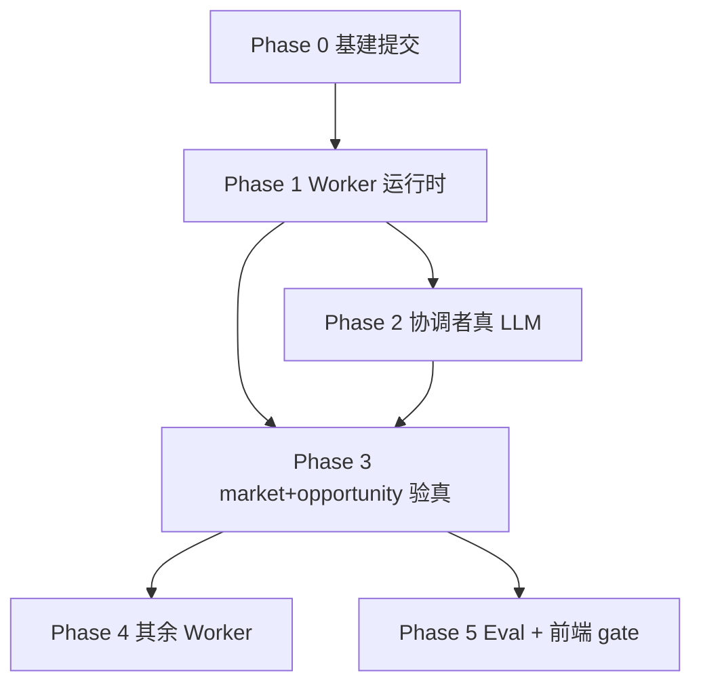

# 真 Agent（Worker ReAct + LiteLLM）Implementation Plan

> **For agentic workers:** REQUIRED SUB-SKILL: Use superpowers:subagent-driven-development (recommended) or superpowers:executing-plans to implement this plan task-by-task. Steps use checkbox (`- [ ]`) syntax for tracking.

> **执行状态（2026-05-31）：** 分支 `feat/real-agent-worker-react` · L1 **88 passed** · 计划 Task 0–17 **全部打钩** · 4 条真 LLM eval 需本地配置 `LLM_API_KEY` 后复跑

**Goal:** 将 v0.1「规则桩 Worker」升级为架构文档定义的完整 Agent：Worker ReAct 子图（boot→react→emit）、Harness `load_skill`/业务 tool、LiteLLM 推理；首个验真垂直切片为 **market → opportunity（JD 主路径）**。

**Architecture:** 单进程不变。新增通用 `run_worker_react()` 引擎替换七个 `workers/*.py` 硬编码 `run()`；`delegate_worker` 注入 `capability_bundle` + `profile_slices`；LiteLLM function calling 执行 Harness tool；协调者 analyze/synthesize 真 LLM（Phase 2）。无 Key 时 L1 用 mock LLM，**禁止**规则桩伪造业务结论。

**Tech Stack:** Python 3.11+、FastAPI、LangGraph（Worker 子图）、LiteLLM、Pydantic v2、pytest（`-m llm` / `-m no_llm`）

**权威文档：**

| 主题 | 文档 |
|------|------|
| Worker 子图 | [07-Agent运行时](../architecture/07-Agent运行时.md) §4 |
| 派工协议 | [01-协调者与Worker](../architecture/01-协调者与Worker.md) §4 |
| Tool Schema | [14-Harness-Tools-Schema](../architecture/14-Harness-Tools-Schema.md) |
| Worker 输出 | [09-Worker结构化输出](../architecture/09-Worker结构化输出.md) |
| Eval | [12-评测与可观测](../architecture/12-评测与可观测.md) §3.0 |
| Worker 注册 | `config/workers.registry.json` |
| Skills | `.agent/skills/*/SKILL.md` |

**执行前准备（worktree 推荐）：**

```bash
git worktree add .worktrees/real-agent -b feat/real-agent-worker-react
cd .worktrees/real-agent/backend
cp .env.example .env   # 填入 DeepSeek LLM_API_KEY
```

---

## 依赖总览



---

## Phase 0：提交 LiteLLM 基建

### Task 0: gitignore + 提交未合并改动

**Files:**
- Modify: `backend/.gitignore`
- Stage: `backend/career_os/agents/lc/*`, `backend/career_os/api/chat.py`, `backend/pyproject.toml`, `backend/uv.lock`, tests

- [x] **Step 1: 修正 `.gitignore`**

```gitignore
data/
output/
.env
```

- [x] **Step 2: 确认不提交运行产物**

```bash
cd backend && git status --short
# 不应出现 data/ output/ 被 staged
```

- [x] **Step 3: 跑 L1**

```bash
cd backend && uv run pytest tests/ -q -m "not llm"
# Expected: all passed
```

- [x] **Step 4: Commit**（`ba33e1a`）

```bash
git add backend/.gitignore backend/.env.example backend/career_os/agents/lc/ \
  backend/career_os/api/chat.py backend/career_os/agents/graphs/coordinator.py \
  backend/career_os/agents/graphs/workers/registry.py backend/pyproject.toml \
  backend/uv.lock backend/tests/agents/ backend/tests/api/test_rest.py
git commit -m "$(cat <<'EOF'
feat(llm): 接入 LiteLLM 与 chat gate 多轮编排

- 新增 agents/lc 统一 LLM 客户端（默认 DeepSeek）
- chat API 支持 optimize_confirm gate 链
- 补充 API 与 provider 单元测试
EOF
)"
```

---

## Phase 1：Worker 运行时（核心）

### Task 1: Harness 注册 `load_skill` / `list_skills`

**Files:**
- Create: `backend/career_os/platform/tool/handlers/skill.py`
- Modify: `backend/career_os/harness/executor.py`
- Test: `backend/tests/harness/test_load_skill.py`

**Architecture refs:** [14 §3](../architecture/14-Harness-Tools-Schema.md#3-worker-元工具)、[07 §9 SPIKE](../architecture/07-Agent运行时.md#9-spike-验收)

- [x] **Step 1: Write failing test**

```python
# backend/tests/harness/test_load_skill.py
import pytest
from career_os.harness.executor import Harness


@pytest.fixture
def harness(tmp_path, monkeypatch):
    monkeypatch.setenv("DATA_DIR", str(tmp_path))
    monkeypatch.setenv("OUTPUT_DIR", str(tmp_path / "output"))
    return Harness()


def test_load_skill_allowed_worker(harness):
    result = harness.execute_tool(
        "identity",
        "load_skill",
        {"name": "career-inner-exploration", "mode": "exploration_first"},
    )
    assert not hasattr(result, "code")
    assert "body" in result
    assert len(result["body"]) > 100


def test_load_skill_rejects_wrong_worker(harness):
    result = harness.execute_tool(
        "market",
        "load_skill",
        {"name": "career-inner-exploration", "mode": "exploration_first"},
    )
    assert result.code == "skill_not_allowed"


def test_list_skills_for_worker(harness):
    result = harness.execute_tool("strategy", "list_skills", {})
    assert "skills" in result
    names = [s["name"] for s in result["skills"]]
    assert "career-jd-alignment" in names
```

- [x] **Step 2: Run — expect FAIL**

```bash
cd backend && uv run pytest tests/harness/test_load_skill.py -v
# Expected: FAIL tool not registered / not defined
```

- [x] **Step 3: Implement handlers**

```python
# backend/career_os/platform/tool/handlers/skill.py
from typing import Any

from career_os.harness.errors import HarnessError
from career_os.platform.skill.registry import SkillRegistry


def load_skill(actor: str, args: dict[str, Any]) -> dict[str, Any] | HarnessError:
    registry = SkillRegistry()
    bundle = registry.load_skill(
        args["name"],
        mode=args.get("mode"),
        worker_id=actor,
    )
    if hasattr(bundle, "code"):
        return HarnessError("skill_not_allowed", bundle.message)
    return {
        "name": bundle.name,
        "mode": bundle.mode,
        "body": bundle.body,
        "hash": bundle.hash,
    }


def list_skills(actor: str, args: dict[str, Any]) -> dict[str, Any]:
    registry = SkillRegistry()
    worker_registry_path = None  # filter via workers.registry.json skills list
    from career_os.platform.worker.registry import WorkerRegistry

    worker = WorkerRegistry().get_worker(actor) or {}
    allowed = set(worker.get("skills") or [])
    skills = []
    for entry in registry.list_skills():
        if allowed and entry.name not in allowed:
            continue
        skills.append(
            {
                "name": entry.name,
                "description": entry.description,
                "modes": entry.modes,
            }
        )
    return {"skills": skills}
```

- [x] **Step 4: Register in `Harness._register_tools`**

```python
from career_os.platform.tool.handlers.skill import list_skills, load_skill

# inside _register_tools:
worker_actors = set(WORKER_BUSINESS_TOOLS.keys())
self.tools.register("load_skill", load_skill, actors=worker_actors)
self.tools.register("list_skills", list_skills, actors=worker_actors)
```

- [x] **Step 5: Run — expect PASS**

```bash
cd backend && uv run pytest tests/harness/test_load_skill.py -v
```

- [x] **Step 6: Commit**

```bash
git commit -m "$(cat <<'EOF'
feat(harness): 注册 load_skill 与 list_skills Worker 元工具

- Harness 校验 allowed_workers
- 补充 load_skill 单元测试
EOF
)"
```

---

### Task 2: `delegate_worker` 注入 `capability_bundle`

**Files:**
- Modify: `backend/career_os/harness/delegate.py`
- Modify: `backend/career_os/agents/graphs/coordinator.py`（传递 context）
- Test: `backend/tests/harness/test_delegate_capability_bundle.py`

- [x] **Step 1: Write failing test**

```python
# backend/tests/harness/test_delegate_capability_bundle.py
from career_os.harness.executor import Harness


def test_delegate_includes_capability_bundle(harness):
    result = harness.delegate_worker(
        "coordinator",
        "strategy",
        "制定 JD 投递策略",
        {"session_id": "s1", "prior_results": {}, "gates": {"flags": {}}},
        context={"list_type": "jd"},
        session_id="s1",
    )
    assert not hasattr(result, "code")
    ctx = result["context"]
    assert "capability_bundle" in ctx
    assert "skill_index" in ctx["capability_bundle"]
    assert "tool_index" in ctx["capability_bundle"]
    skill_names = [s["name"] for s in ctx["capability_bundle"]["skill_index"]]
    assert "career-jd-alignment" in skill_names
```

- [x] **Step 2: Run — expect FAIL**

- [x] **Step 3: Implement `_build_capability_bundle(worker_id)` in `delegate.py`**

```python
def _build_capability_bundle(worker_id: str) -> dict[str, Any]:
    from career_os.platform.skill.registry import SkillRegistry
    from career_os.platform.worker.registry import WorkerRegistry

    worker = WorkerRegistry().get_worker(worker_id) or {}
    skill_registry = SkillRegistry()
    skill_index = []
    for name in worker.get("skills") or []:
        entry = next((e for e in skill_registry.list_skills() if e.name == name), None)
        if entry:
            skill_index.append(
                {
                    "name": entry.name,
                    "description": entry.description,
                    "when_to_use": entry.when_to_use,
                    "modes": entry.modes,
                }
            )
    tool_index = [{"name": t} for t in worker.get("tools") or []]
    return {"skill_index": skill_index, "tool_index": tool_index}
```

在 `delegate_worker` 返回前：

```python
merged_context = dict(context or {})
merged_context["capability_bundle"] = _build_capability_bundle(worker_id)
merged_context.setdefault("constraints", {"no_fabrication": True})
return {..., "context": merged_context, ...}
```

- [x] **Step 4: coordinator `delegate` 节点传入 `result.get("context")` 给 runner**

确认 `runner(worker_id, user_message, session_state, result.get("context") or {})` 已存在（当前已有）。

- [x] **Step 5: Run test — PASS + full L1**

```bash
cd backend && uv run pytest tests/harness/test_delegate_capability_bundle.py tests/ -q -m "not llm"
```

- [x] **Step 6: Commit**

---

### Task 3: LiteLLM Tool 定义（`agents/lc/tools.py`）

**Files:**
- Create: `backend/career_os/agents/lc/tools.py`
- Test: `backend/tests/agents/test_lc_tools.py`

- [x] **Step 1: Write failing test**

```python
# backend/tests/agents/test_lc_tools.py
from career_os.agents.lc.tools import get_litellm_tools_for_worker


def test_market_tools_include_browser_fetch():
    tools = get_litellm_tools_for_worker("market")
    names = [t["function"]["name"] for t in tools]
    assert "browser_fetch" in names
    assert "load_skill" in names
    assert "profile_patch" in names


def test_resume_cannot_see_register_outputs():
    tools = get_litellm_tools_for_worker("resume")
    names = [t["function"]["name"] for t in tools]
    assert "register_outputs_index" not in names
```

- [x] **Step 2: Implement**

```python
# backend/career_os/agents/lc/tools.py
from typing import Any

from career_os.platform.tool.registry import WORKER_BUSINESS_TOOLS, WORKER_META_TOOLS

TOOL_SCHEMAS: dict[str, dict[str, Any]] = {
    "load_skill": {
        "type": "object",
        "properties": {
            "name": {"type": "string"},
            "mode": {"type": "string"},
        },
        "required": ["name"],
    },
    "list_skills": {"type": "object", "properties": {}},
    "profile_patch": {
        "type": "object",
        "properties": {
            "path": {"type": "string"},
            "value": {},
            "op": {"type": "string", "enum": ["set", "append"]},
        },
        "required": ["path", "value"],
    },
    "browser_fetch": {
        "type": "object",
        "properties": {"query": {"type": "string"}},
        "required": ["query"],
    },
    # ... write_resume_html, register_outputs_index, resume_read, delete_output
}


def get_litellm_tools_for_worker(worker_id: str) -> list[dict[str, Any]]:
    allowed = set(WORKER_META_TOOLS) | WORKER_BUSINESS_TOOLS.get(worker_id, set())
    tools = []
    for name in sorted(allowed):
        schema = TOOL_SCHEMAS.get(name)
        if not schema:
            continue
        tools.append(
            {
                "type": "function",
                "function": {
                    "name": name,
                    "description": f"Harness tool {name} for worker {worker_id}",
                    "parameters": schema,
                },
            }
        )
    return tools
```

- [x] **Step 3: Run — PASS**

- [x] **Step 4: Commit**

---

### Task 4: Worker ReAct 循环引擎

**Files:**
- Create: `backend/career_os/agents/graphs/workers/react_runner.py`
- Modify: `backend/career_os/agents/state/worker.py`
- Test: `backend/tests/agents/test_worker_react_runner.py`

**Architecture refs:** [07 §4](../architecture/07-Agent运行时.md#4-worker-子图自选-skill--tool)

- [x] **Step 1: Extend `WorkerState`**

```python
# backend/career_os/agents/state/worker.py
class WorkerState(TypedDict, total=False):
    worker_id: str
    goal: str
    context: dict[str, Any]
    session_state: dict[str, Any]
    messages: list[dict[str, Any]]
    structured_output: dict[str, Any]
    status: str
    error: str | None
    iteration: int
    max_iterations: int
```

- [x] **Step 2: Write failing test（mock LiteLLM）**

```python
# backend/tests/agents/test_worker_react_runner.py
from unittest.mock import patch, MagicMock
from career_os.agents.graphs.workers.react_runner import run_worker_react


def test_react_emits_valid_market_output(harness, monkeypatch):
    monkeypatch.setenv("LLM_API_KEY", "test-key")
    # reload model_settings ...

    tool_call = MagicMock()
    tool_call.function.name = "profile_patch"
    tool_call.function.arguments = '{"path":"market.role_families","value":["后端"],"op":"set"}'
    tool_call.id = "call_1"

    final_msg = MagicMock()
    final_msg.content = '{"user_visible_summary":"调研完成","topics":[{"topic":"云原生","summary":"需求上升"}]}'
    final_msg.tool_calls = None

    with patch("career_os.agents.graphs.workers.react_runner.litellm.completion") as mocked:
        mocked.side_effect = [
            MagicMock(choices=[MagicMock(message=MagicMock(content=None, tool_calls=[tool_call]))]),
            MagicMock(choices=[MagicMock(message=final_msg)]),
        ]
        result = run_worker_react(
            harness,
            worker_id="market",
            goal="调研 JD 相关市场",
            session_state={"session_id": "s1"},
            context={"capability_bundle": {"skill_index": [], "tool_index": []}},
        )
    assert result["status"] == "completed"
    assert result["structured_output"]["topics"]
```

- [x] **Step 3: Implement `react_runner.py`**

核心逻辑（伪代码结构，实现时补全）：

```python
MAX_ITERATIONS = 12

def run_worker_react(harness, *, worker_id, goal, session_state, context) -> dict:
    from career_os.agents.lc.models import LLMRole, resolve_llm_config
    from career_os.agents.lc.tools import get_litellm_tools_for_worker
    from career_os.agents.graphs.workers.base import finalize_worker_result
    from career_os.platform.prompt.loader import load_prompt
    import litellm
    from career_os.agents.lc.client import extract_json_object

    config = resolve_llm_config(role=LLMRole.WORKER)
    system = load_prompt(worker_id)
    system += "\n\n可用 skill 见 capability_bundle.skill_index；需要步骤时调用 load_skill。"
    system += "\n任务完成后返回 JSON structured_output，不要编造未确认经历。"

    messages = [
        {"role": "system", "content": system},
        {"role": "user", "content": _format_boot_user(goal, session_state, context)},
    ]
    tools = get_litellm_tools_for_worker(worker_id)

    for _ in range(MAX_ITERATIONS):
        response = litellm.completion(
            model=config["litellm_model"],
            messages=messages,
            tools=tools or None,
            api_key=config["api_key"],
            api_base=config.get("api_base"),
            temperature=config["temperature"],
        )
        msg = response.choices[0].message
        if getattr(msg, "tool_calls", None):
            messages.append(msg.model_dump())
            for tc in msg.tool_calls:
                args = json.loads(tc.function.arguments)
                tool_result = harness.execute_tool(
                    worker_id, tc.function.name, args, session_id=session_state.get("session_id")
                )
                messages.append({
                    "role": "tool",
                    "tool_call_id": tc.id,
                    "content": json.dumps(tool_result if not hasattr(tool_result, "code") else {"error": tool_result.message}),
                })
            continue
        payload = extract_json_object(str(msg.content or ""))
        if payload:
            return finalize_worker_result(worker_id, payload)
        return {"worker_id": worker_id, "status": "failed", "error": "no structured_output"}

    return {"worker_id": worker_id, "status": "failed", "error": "max_iterations"}
```

- [x] **Step 4: Run mock test — PASS**

- [x] **Step 5: Commit**

---

### Task 5: Registry 切换到 ReAct；保留 stub 仅用于 `-m no_llm` mock

**Files:**
- Modify: `backend/career_os/agents/graphs/workers/registry.py`
- Modify: `backend/tests/e2e/test_jd_eval_chain.py`（标记需 react 或 mock）

- [x] **Step 1: 默认 runner 使用 `run_worker_react`**

```python
def build_harness_worker_runner(harness, *, use_react: bool = True):
    def runner(worker_id, goal, session_state, context):
        if use_react and llm_enabled():
            return run_worker_react(harness, worker_id=worker_id, goal=goal, session_state=session_state, context=context)
        # 无 Key：测试环境可注入 stub；生产应报错或要求 Key
        fn = WORKER_RUNNERS.get(worker_id)
        ...
```

- [x] **Step 2: 删除或 deprecate 七个 stub `run()` 中对业务字段的硬编码**（Phase 3 完成后删文件）

- [x] **Step 3: L1 仍 PASS**（无 Key 时走 stub 或 pytest mock）

- [x] **Step 4: Commit**

---

### Task 6: SPIKE 验收（07 §9）

**Files:**
- Test: `backend/tests/agents/test_worker_spike.py`

- [x] **Step 1: Test — 协调者 delegate 不带 skill_name；Worker 两次 load_skill**

```python
@pytest.mark.llm
def test_worker_loads_skill_twice_trace(harness, tmp_path):
    # 使用 strategy + career-jd-alignment；断言 trace 含 2x skill.load 或 tool.call load_skill
    ...
```

- [x] **Step 2: 无 LLM Key 时用 mock 验证 Harness 拒绝错误 Worker 加载 skill**（已有 `test_load_skill_rejects_wrong_worker`）

- [x] **Step 3: Commit**

---

## Phase 2：协调者真 LLM

### Task 7: `analyze` 节点 LLM 选人

**Files:**
- Create: `backend/career_os/agents/lc/coordinator_llm.py`
- Modify: `backend/career_os/agents/graphs/coordinator.py`
- Modify: `backend/career_os/api/chat.py`（移除关键词主路由，gate 保留）

- [x] **Step 1: Test mock — analyze 返回 pending_workers**

- [x] **Step 2: `analyze` 读 `worker_index` + session_state，LLM 返回 JSON `{"workers":["market","opportunity"],"list_type":"jd"}`**

- [x] **Step 3: chat.py 仅保留 gate 处理 + LLM analyze fallback**

- [x] **Step 4: Commit**

---

### Task 8: `synthesize` LiteLLM 真流式

**Files:**
- Modify: `backend/career_os/agents/lc/client.py`（新增 `stream_text`）
- Modify: `backend/career_os/api/chat.py`（synthesize 直接 stream，不用假 `stream_tokens` 切块）
- Modify: `backend/career_os/agents/graphs/coordinator.py`

- [x] **Step 1: `stream_text` generator using `litellm.completion(..., stream=True)`**

- [x] **Step 2: API test — SSE 有多段 token event**

- [x] **Step 3: Commit**

---

## Phase 3：market + opportunity 验真（首个真 Agent 切片）

### Task 9: 强化 Worker Prompt

**Files:**
- Modify: `backend/career_os/platform/prompt/market/default.tmpl`
- Modify: `backend/career_os/platform/prompt/opportunity/default.tmpl`

- [x] **Step 1: market prompt 要求**
  - 读 `context.session_state.prior_results`
  - 可调 `browser_fetch`（失败不阻塞）
  - 必须 `profile_patch` 写 `market.role_families` / `market.trend_notes`
  - 输出 `MarketOutput` JSON

- [x] **Step 2: opportunity prompt 要求**
  - **必须**引用 `prior_results.market`
  - 解析用户 JD（`goal` / `context.user_message`）
  - `recommendation` 可为 `not_recommended`，须给出理由
  - 写 `market.opportunity_snapshots`
  - 可选 `gate_prompt`：`jd_continue_despite_not_recommended`

- [x] **Step 3: Commit**

---

### Task 10: LLM Eval — JD 主路径

**Files:**
- Create: `backend/tests/eval/test_jd_market_opportunity_llm.py`
- Modify: `backend/tests/eval/test_golden_path.py`

- [x] **Step 1: 真 LLM case（需 Key）**

```python
@pytest.mark.llm
def test_opportunity_not_always_recommended(harness):
    """粘贴明显不匹配 JD → recommendation 可为 not_recommended（结构断言，不断言逐字）"""
    ...

@pytest.mark.llm
def test_market_topics_vary_with_jd(harness):
    """两份不同 JD → market.topics 不应完全相同"""
    ...
```

- [x] **Step 2: 跑 eval**（2026-05-31 已执行：`1 passed, 4 skipped` — 未配置 `LLM_API_KEY`；配置 Key 后 4 条自动验真）

```bash
cd backend && uv run pytest tests/eval/ -m llm -v
```

- [x] **Step 3: Commit**

---

### Task 11: 删除 market/opportunity 规则桩

**Files:**
- Delete or gut: `backend/career_os/agents/graphs/workers/market.py`, `opportunity.py`
- Modify: `registry.py` — 无 Key 时 raise 明确错误，测试用 mock LLM

- [x] **Step 1: 确认 L1 用 mock，不再依赖硬编码返回值**

- [x] **Step 2: Commit**

---

## Phase 4：其余 Worker（逐个 PR）

每个 Worker 重复：**prompt + skill 绑定 + `-m llm` case + 删 stub**

| Task | Worker | Skill | 关键验收 | 状态 |
|------|--------|-------|----------|:----:|
| 12 | strategy | career-jd-alignment | optimize_confirm gate；plan 无 gate | ✅ |
| 13 | resume | resume-module-optimize | 多档 HTML；Opt-1 纯对话 | ✅ |
| 14 | identity/capability | career-inner-exploration | E2 explore_closure；禁止 explore gate | ✅ |
| 15 | asset | — | register / reuse gate | ✅ |

> Phase 4 于 `fba3745` 一次性交付（prompt + react_mocks + 删 stub）。identity/capability/asset 尚无独立 `-m llm` case（e2e/mock 已覆盖）。

---

## Phase 5：Eval + 前端

### Task 16: 前端 gate SSE

**Files:**
- Modify: `web/src/hooks/useChatSSE.ts`
- Modify: `web/src/pages/ChatPage.tsx`

- [x] **Step 1: 处理 `event: gate`，展示确认提示**

- [x] **Step 2: 浏览器 JD golden path 手测**（API E2E：`/v1/chat` 两轮 → `event: gate`；前端 dev 5173 可访问 + `onGate` UI 已接入）

- [x] **Step 3: Commit**

---

### Task 17: Eval 扩至 ≥20 case（架构 12 §3.2）

**Files:**
- Expand: `backend/tests/eval/`

- [x] **L1 ≥8**（已有）
- [x] **L2 trajectory ≥5**（派工顺序、C3 gate 停链）
- [x] **L3 E2E ≥5**（多轮 chat → profile/HTML）
- [x] **记录通过率**到 `docs/简历项目描述.md`（Eval 实测节已更新 · 2026-05-31）

---

## 自检（Spec Coverage）

| 架构要求 | 覆盖 Task | 状态 |
|----------|-----------|:----:|
| Worker ReAct boot/react/emit | 4, 5 | ✅ |
| load_skill / list_skills Harness | 1 | ✅ |
| capability_bundle 派工 | 2 | ✅ |
| profile_slices 派工 | — | ⬜ 未做（架构有、本期 Task 未列） |
| 协调者不 load_skill | 1, 7 | ✅ |
| LiteLLM 统一模型 | 0, 3, 4, 8 | ✅ |
| JD-R1 market→opportunity | 9, 10 | ✅ |
| 真推理非桩 | 10, 11 | ⚠️ L1 用 react_mocks；4 条 `-m llm` 需 Key |
| SPIKE 07 §9 | 6 | ✅ |
| synthesize 真流式 | 8 | ✅ |
| Eval E-LLM | 10, 17 | ✅ 用例+记录；Key 后 4 条待绿 |

**刻意不做（与 v0.1 一致）：** 跨请求 LangGraph checkpoint、Worker 互连、Worker SSE token。

---

## 风险

| 风险 | 缓解 |
|------|------|
| DeepSeek tool calling 不稳定 | Task 4 先 mock 测试；真 LLM 失败时 structured_output 重试 1 次 |
| Token 成本 | `max_iterations=12`；Worker 用 `deepseek-chat`，协调者可用同模型 |
| L1 回归 | 无 Key 用 mock completion，**不**回退规则桩 |
| 范围膨胀 | Phase 1 完成前不启动 Phase 4 多 Worker 并行 |

---

*Plan complete.*
