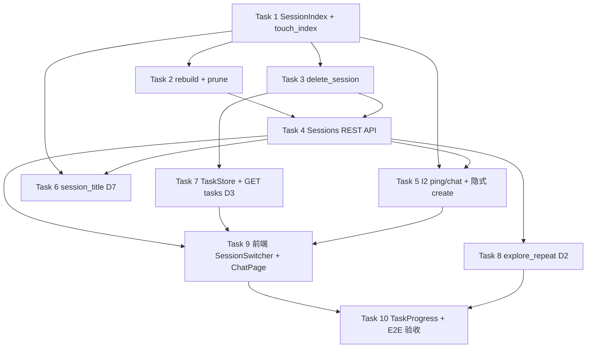

# 多会话持久化 Implementation Plan

> **状态：** ✅ 已完成（2026-06-01 · 已合并 `main` @ `dd83651`）

> **For agentic workers:** REQUIRED SUB-SKILL: Use superpowers:subagent-driven-development (recommended) or superpowers:executing-plans to implement this plan task-by-task. Steps use checkbox (`- [x]`) syntax for tracking.

**Goal:** 按 [spec v1.5](../specs/2026-05-31-session-persistence-design.md) 一次性交付多 session 列表/切换/DELETE/刷新恢复，并落实 D1–D7 产品决策；v0.1 architecture/PRD **不改动**。

**Architecture:** `data/sessions/_index.json` 作为列表 SSOT；`SessionStore` 扩展 touch/rebuild/delete/title；FastAPI 新增 sessions/messages/tasks 端点；React `SessionSwitcher` + `ChatPage` 改造（D1=B、D4=C、410 不自动 new）。

**Tech Stack:** Python 3.11+ / FastAPI / pytest · React 19 / Vite / TypeScript / Tailwind 4

**Spec SSOT:** `docs/superpowers/specs/2026-05-31-session-persistence-design.md`（§10 交付范围 · §1.6 D1–D7 · §9 测试要点）

---

## 产品决策速查（§1.6，已全部确认）

| ID | 决策 |
|----|------|
| D1 | 列表空且无合法 localStorage → **不** POST new；首条 chat 隐式 create |
| D2 | 全局已初探 → `explore_repeat` 闸门再问是否填表 |
| D3 | TaskProgress：`GET /v1/tasks?session_id=`；active → 最新 ready → 空 |
| D4 | SSE 进行中 **允许** 切换 session，不 Abort |
| D5 | 归档仅隐藏列表，未过期仍可 chat |
| D6 | 无消息 title =「未命名会话」 |
| D7 | **首条 user 消息**后异步 LLM auto title |

---

## 依赖总览



---

## Task 1: `_index.json` 模型与 `touch_index`

**Files:**
- Modify: `backend/career_os/platform/store/session.py`
- Create: `backend/career_os/platform/store/session_index.py`（可选：index 读写独立模块，减少 session.py 膨胀）
- Test: `backend/tests/store/test_session_index.py`

**Spec refs:** §3.1 · §1.5.3 · §1.5.4 · §5

- [x] **Step 1: Write failing test — create + touch_index 初始字段**

```python
# backend/tests/store/test_session_index.py
def test_touch_index_on_create(tmp_path, monkeypatch):
    monkeypatch.setenv("DATA_DIR", str(tmp_path))
    import importlib
    import career_os.config as config_mod
    import career_os.platform.store.session as session_mod
    importlib.reload(config_mod)
    importlib.reload(session_mod)
    s = session_mod.SessionStore()
    sid = s.create_session()
    s.touch_index(sid)
    index = s.load_index()
    assert sid in index["sessions"]
    row = index["sessions"][sid]
    assert row["title"] == "未命名会话"  # D6
    assert row["title_source"] == "fallback"
    assert row["message_count"] == 0
    assert row["preview"] == ""
```

- [x] **Step 2: Run test — expect FAIL**

Run: `cd backend && uv run pytest tests/store/test_session_index.py::test_touch_index_on_create -v`

- [x] **Step 3: Implement minimal code**

在 `SessionStore` 中：
- `_index_path()` → `data/sessions/_index.json`
- `load_index()` / `_save_index_unlocked()`
- `touch_index(session_id)`：从 messages/state 计算 preview、message_count、list_type、activity_headline、expired（不落盘 expired）
- `create_session()` 末尾调用 `touch_index`
- index 条目字段对齐 spec §3.1

- [x] **Step 4: Run test — expect PASS**

- [x] **Step 5: Commit**

```text
feat(session): 新增 _index.json 与 touch_index

- create_session 后写入 fallback 标题（D6）
- 从 messages/state 计算 preview 与 message_count
```

---

## Task 2: `rebuild_index` 与孤儿 prune

**Files:**
- Modify: `backend/career_os/platform/store/session.py`
- Test: `backend/tests/store/test_session_index.py`

**Spec refs:** §5.1 · §1.5.5

- [x] **Step 1: Write failing tests**

```python
def test_rebuild_index_from_disk_dirs(tmp_path, monkeypatch):
    # 手动 mkdir sess_xxx + messages.json，无 _index.json
    # rebuild_index() 后 index 含该 session

def test_rebuild_prunes_orphan_index_entries(tmp_path, monkeypatch):
    # index 有条目但目录已删 → rebuild 后 prune
```

- [x] **Step 2: Run tests — expect FAIL**

- [x] **Step 3: Implement `rebuild_index()`**

- 扫描 `sessions/sess_*` 目录（跳过 `_index.json`）
- 对每个合法目录 `touch_index`
- prune：index 中无对应目录的 `sess_*` 键删除
- `sess_` 格式校验：非法 ID 在 API 层 400（本 task 仅 store 层 helper）

- [x] **Step 4: Run tests — expect PASS**

- [x] **Step 5: Commit**

```text
feat(session): rebuild_index 扫描目录并 prune 孤儿条目
```

---

## Task 3: `delete_session` + TaskStore 联动

**Files:**
- Modify: `backend/career_os/platform/store/session.py`
- Modify: `backend/career_os/platform/store/task.py`（确认 `delete_lists_for_session` 已有）
- Test: `backend/tests/store/test_session_index.py`

**Spec refs:** §5.2 · §4.6 · §1.4 删 session 行

- [x] **Step 1: Write failing test**

```python
def test_delete_session_removes_dir_index_and_tasks(tmp_path, monkeypatch):
    # create session + task list + append message
    # delete_session(sid)
    # 目录不存在、index 无键、tasks 下该 session 的 list 已删
```

- [x] **Step 2: Run — FAIL**

- [x] **Step 3: Implement `delete_session(session_id)`**

- `shutil.rmtree(session_dir)`（不存在则 no-op）
- 从 index 删除键
- `TaskStore().delete_lists_for_session(session_id)`
- 若删的是 global `_active` 指向的 list，清理 `_active.json`（对齐 spec §4.6）

- [x] **Step 4: Run — PASS**

- [x] **Step 5: Commit**

```text
feat(session): delete_session 删目录、index 与绑定 tasks
```

---

## Task 4: Sessions REST API（list / get / messages / patch / delete）

**Files:**
- Modify: `backend/career_os/api/sessions.py`
- Test: `backend/tests/api/test_rest.py`（或新建 `test_sessions_api.py`）

**Spec refs:** §4.1–4.6 · §8

- [x] **Step 1: Write failing tests**

```python
def test_list_sessions_empty_rebuilds(client):
    r = client.get("/v1/sessions")
    assert r.status_code == 200
    assert r.json()["sessions"] == []

def test_new_session_does_not_delete_old(client):
    a = client.post("/v1/sessions/new").json()["session_id"]
    client.post(f"/v1/sessions/{a}/messages", ...)  # 或经 chat 写入
    b = client.post("/v1/sessions/new").json()["session_id"]
    listed = client.get("/v1/sessions").json()["sessions"]
    assert {a, b} <= {s["session_id"] for s in listed}

def test_get_messages_returns_history(client):
    # POST chat 或 append 后 GET /v1/sessions/{id}/messages

def test_patch_title_and_archived(client):
    # PATCH title_source=user；archived=true/false（D5）

def test_delete_session_404_after(client):
    sid = client.post("/v1/sessions/new").json()["session_id"]
    assert client.delete(f"/v1/sessions/{sid}").status_code == 200
    assert client.get(f"/v1/sessions/{sid}/messages").status_code == 404
```

- [x] **Step 2: Run — FAIL**

- [x] **Step 3: Implement endpoints**

| 方法 | 路径 | 要点 |
|------|------|------|
| GET | `/v1/sessions` | 无 index → `rebuild_index()`；支持 `?q=`、`?archived=` |
| GET | `/v1/sessions/{id}` | 单条 + expired badge 字段 |
| GET | `/v1/sessions/{id}/messages` | 全量 messages（UI 恢复用） |
| PATCH | `/v1/sessions/{id}` | `title` / `archived` |
| DELETE | `/v1/sessions/{id}` | 调 `delete_session` |

- `GET /v1/sessions/{id}` 与 list 均复用 `build_session_activity(state)`

- [x] **Step 4: Run — PASS**

- [x] **Step 5: Commit**

```text
feat(api): 多会话 list/get/messages/patch/delete 端点
```

---

## Task 5: I2 过期 — `ping` / `chat` + 隐式 create

**Files:**
- Modify: `backend/career_os/api/sessions.py`（ping）
- Modify: `backend/career_os/api/chat.py`
- Modify: `backend/career_os/harness/orchestrator.py`（若过期校验集中于此）
- Test: `backend/tests/api/test_rest.py`

**Spec refs:** §4.9 · §4.10 · §1.5.2 · §1.5.3

- [x] **Step 1: Write failing tests**

```python
def test_ping_expired_returns_410_disk_intact(client, monkeypatch):
    monkeypatch.setenv("SESSION_IDLE_TTL", "1")  # 或 mock last_activity_at
    sid = client.post("/v1/sessions/new").json()["session_id"]
    # 使 session 过期
    assert client.post(f"/v1/sessions/{sid}/ping").status_code == 410
    assert client.get(f"/v1/sessions/{sid}/messages").status_code == 200

def test_chat_without_session_id_creates_and_indexes(client):
    with client.stream("POST", "/v1/chat", json={"message": "hi"}, ...) as resp:
        ...
    listed = client.get("/v1/sessions").json()["sessions"]
    assert len(listed) >= 1
    assert listed[0]["title"] in ("未命名会话", ...)  # D6/D7
```

- [x] **Step 2: Run — FAIL**

- [x] **Step 3: Implement**

- 抽取 `is_session_expired(state)`（读 `SESSION_IDLE_TTL`）
- `ping`：过期 → 410，**不** 刷新 `last_activity_at`；未过期 → 刷新
- `chat`：过期 → 410；通过校验且写入 user 消息后刷新 activity + `touch_index`
- `POST /v1/chat` 无 `session_id`：`create_session()` + `touch_index`（§1.5.3）
- 同 session 双 Tab：`409 session_busy`（若 orchestrator 已有锁，补测试）

- [x] **Step 4: Run — PASS**

- [x] **Step 5: Commit**

```text
fix(session): ping/chat 对齐 I2 过期语义与隐式 create 写 index
```

---

## Task 6: Auto title（D7）与 `generate-title`

**Files:**
- Create: `backend/career_os/platform/store/session_title.py`
- Modify: `backend/career_os/platform/store/session.py`（append_message 后 fire-and-forget）
- Modify: `backend/career_os/api/sessions.py`（`POST .../generate-title`）
- Test: `backend/tests/store/test_session_title.py`

**Spec refs:** §3.4 · §4.7 · D7

- [x] **Step 1: Write failing tests**

```python
def test_maybe_generate_title_after_first_user(monkeypatch):
    # mock LLM 返回 "职业方向探讨"
    # append 首条 user → touch_index → maybe_generate_title
    # title_source=auto

def test_generate_title_force_overrides_user(client):
    # PATCH user title 后 POST generate-title?force=true
```

- [x] **Step 2: Run — FAIL**

- [x] **Step 3: Implement**

- `maybe_generate_title(session_id)`：仅当 `title_source != "user"` 且已有 ≥1 user 消息
- LLM 失败保留 fallback（首条 user 前 20 字或「未命名会话」）
- `append_message` 在 role=user 且为第一条 user 时，线程池/BackgroundTasks 异步调用（不阻塞 chat SSE）
- `POST /v1/sessions/{id}/generate-title?force=false|true`

- [x] **Step 4: Run — PASS**

- [x] **Step 5: Commit**

```text
feat(session): 首条 user 消息后异步 LLM 自动标题（D7）
```

---

## Task 7: `GET /v1/tasks?session_id=`（D3）

**Files:**
- Modify: `backend/career_os/platform/store/task.py` — 新增 `list_lists_for_session(session_id)`
- Modify: `backend/career_os/api/sessions.py` 或 tasks 路由
- Test: `backend/tests/store/test_task.py` · `backend/tests/api/test_rest.py`

**Spec refs:** §4.8 · D3

- [x] **Step 1: Write failing tests**

```python
def test_list_lists_for_session_orders_active_then_ready(task_store):
    active = task_store.create_task_list("sess_a", status="active")
    ready = task_store.create_task_list("sess_a", status="ready")
    rows = task_store.list_lists_for_session("sess_a")
    assert rows[0]["list_id"] == active

def test_get_tasks_by_session_id(client):
    sid = client.post("/v1/sessions/new").json()["session_id"]
    # 创建 task list 绑定 sid
    r = client.get(f"/v1/tasks?session_id={sid}")
    assert r.status_code == 200
```

- [x] **Step 2: Run — FAIL**

- [x] **Step 3: Implement**

- `GET /v1/tasks?session_id=`：**必带** query（前端切换时用）；无 query 兼容读 `_active.json`（spec §4.8）
- 返回逻辑：优先 **active** list → 否则 **最新 ready**（按 updated_at）→ 否则空

- [x] **Step 4: Run — PASS**

- [x] **Step 5: Commit**

```text
feat(tasks): GET /v1/tasks 支持 session_id 查询（D3）
```

---

## Task 8: `explore_repeat` 闸门（D2）

**Files:**
- Modify: `backend/career_os/harness/gate.py` — 新增 `explore_repeat` pattern
- Modify: `backend/career_os/harness/orchestrator.py` 或 coordinator 路由
- Test: `backend/tests/api/test_rest.py`

**Spec refs:** §1.5.1 · D2

- [x] **Step 1: Write failing test**

```python
def test_explore_repeat_gate_when_intake_already_submitted(client):
    client.post("/v1/profile/explore-intake", json={...})
    sid = client.post("/v1/sessions/new").json()["session_id"]
    with client.stream("POST", "/v1/chat", json={
        "session_id": sid, "message": "帮我理清职业方向"
    }, ...) as resp:
        body = "".join(resp.iter_text())
    # 应先出现 explore_repeat 对话闸门，而非直接 explore_intake 表单
    assert "再次" in body or "explore_repeat" in body
```

- [x] **Step 2: Run — FAIL**

- [x] **Step 3: Implement**

- 路由进入 explore 且 `explore_intake_submitted()` 为 true → 设 `gates.pending`，`gate_name=explore_repeat`
- 用户 **否** → 不弹表、不派 explore Worker
- 用户 **是** → 触发 `ExploreIntakeForm`（现有 explore_intake SSE）
- 可选：`flags.explore_repeat_accepted` / `explore_repeat_declined`

- [x] **Step 4: Run — PASS**

- [x] **Step 5: Commit**

```text
feat(gate): 全局已初探时 explore_repeat 闸门（D2）
```

---

## Task 9: 前端 — API 客户端 + SessionSwitcher + ChatPage

**Files:**
- Create: `web/src/lib/sessionsApi.ts`
- Create: `web/src/components/SessionSwitcher.tsx`
- Create: `web/src/components/ExpiredSessionBanner.tsx`
- Modify: `web/src/pages/ChatPage.tsx`
- Modify: `web/src/hooks/useChatSSE.ts`（移除 410 自动 POST new）
- Test: 手动 / 可选 Vitest component test

**Spec refs:** §6.1–6.7 · D1 · D4 · §1.4 410 行

- [x] **Step 1: API 客户端**

```typescript
// web/src/lib/sessionsApi.ts
export async function listSessions(opts?: { q?: string; archived?: boolean })
export async function getMessages(sessionId: string)
export async function patchSession(sessionId: string, patch: { title?: string; archived?: boolean })
export async function deleteSession(sessionId: string)
export async function createSession() // POST new
```

- [x] **Step 2: SessionSwitcher**

- Drawer：会话列表、搜索 `?q=`、归档 tab（D5）
- 新建 / 切换 / 重命名 / 删除确认
- 选中 session 写入 `localStorage.session_id`

- [x] **Step 3: ChatPage 初始化（D1=B）**

```text
mount:
  1. GET /v1/sessions
  2. 若 localStorage.session_id 在列表中 → 选中 + GET messages 恢复 UI
  3. 若 localStorage 无效 → 清 key；列表非空 → 选首条；列表空 → sessionId=null（不 POST new）
  4. 404 on GET messages → 清 localStorage，回退步骤 3
```

- [x] **Step 4: 410 与 ExpiredSessionBanner**

- `useChatSSE` / ChatPage：410 → 展示 banner，禁用输入；**禁止** 自动 `POST /v1/sessions/new`
- 用户操作：切换其它 session 或手动「新建会话」

- [x] **Step 5: SSE 切换（D4=C）**

- 切换 session **不** Abort 进行中的 fetch；切回时 `GET messages` 合并展示
- `sessionId` 为 null 时允许发送首条消息（隐式 create）

- [x] **Step 6: 手动验收清单**

- [x] 刷新页面 messages 恢复
- [x] 两个 session 并存，new 不删旧数据
- [x] 过期 session 只读 + badge

- [x] **Step 7: Commit**

```text
feat(web): SessionSwitcher 与会话刷新恢复（D1/D4/410）
```

---

## Task 10: TaskProgress（D3）+ 全量回归

**Files:**
- Modify: `web/src/components/TaskProgress.tsx`
- Test: `backend/tests/api/test_rest.py`（补集成）· `cd backend && uv run pytest tests/ -q`

**Spec refs:** §4.8 · D3 · §9

- [x] **Step 1: TaskProgress 改数据源**

- 移除全局 `_active` 假设
- `useEffect` 依赖 `sessionId` → `GET /v1/tasks?session_id=`
- 展示 priority：active → ready → 空

- [x] **Step 2: 后端全量测试**

Run: `cd backend && uv run pytest tests/ -q`

期望：§9 所列用例均有对应测试且 PASS

- [x] **Step 3: 前端 build**

Run: `cd web && npm run build`

- [x] **Step 4: Commit**

```text
feat(web): TaskProgress 按 session_id 拉取任务（D3）
```

---

## 验收对照表（§10 → Task）

| §10 交付物 | Task |
|------------|------|
| `_index.json` / touch / rebuild / delete | 1–3 |
| Sessions REST + messages + patch + delete | 4 |
| ping/chat I2 + 隐式 create | 5 |
| maybe_generate_title / generate-title | 6 |
| GET tasks?session_id= | 7 |
| explore_repeat | 8 |
| SessionSwitcher / drawer / 410 / 刷新 | 9 |
| TaskProgress D3 | 10 |

---

## 风险与边界（实现时注意）

| 风险 | 处理 |
|------|------|
| index 与目录不一致 | 每次 `GET /v1/sessions` 可 lazy rebuild；touch 双向更新 |
| 全局单 active × 多 session | `start_task_list` 409 + 前端提示切回占用 session |
| localStorage 指向已删 session | GET messages 404 → 清 key（§11） |
| M1-R trimmed vs recommend | **不改**；仅 `usage_ratio≥0.95` 推荐新会话 |
| v0.1 文档 R2/I2 表述 | **以 spec 为准**；不回写 architecture |

---

## 执行方式

**已完成。** Task 1–10 全部落地；`196 passed`（backend pytest，2026-06-01）· `npm run build` 通过。
