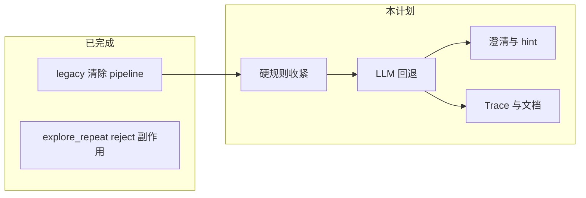

# 闸门意图匹配（硬规则 + LLM 回退）— 实现计划

| 属性 | 内容 |
|------|------|
| 状态 | **已实施** |
| 日期 | 2026-06-01 |
| 设计 SSOT | [../specs/2026-06-01-gate-intent-llm-fallback-design.md](../specs/2026-06-01-gate-intent-llm-fallback-design.md) v0.3.0 |
| 前置 | [老模式清除 plan](./2026-06-01-legacy-task-mode-removal.md)（**已实施** `561c69d`）；Q1/Q6 副作用勿重复开发 |
| 说明 | **不修改** 已归档 pipeline / session 等 plan·spec；任务仅在本计划与设计 spec 维护 |

---

## 目标与范围

| 项 | 内容 |
|----|------|
| 入口 | `POST /v1/chat` → `_apply_pending_gate` → `match_gate_intent` |
| 交付 | 规则优先 + LLM 兜底 + `source` 可观测 + unknown 澄清 + 末尾 `GATE_REPLY_HINTS` |
| 非目标 | 前端闸门按钮；异步 SSE 拆轮确认；Worker 首次 `gate_prompt` 生成逻辑 |

**建议 PR 顺序**：G0（可独立合）→ G1 → G2 → G3。

### 实现约定（与 spec 0.3.0 一致）

| 项 | 约定 |
|----|------|
| `recent_turns` | `match_gate_intent(..., session_id=)` 内用 `SessionStore` 读取；`chat.py` 只传 `session_id` + `session_state`（**不**改 Harness 工具 schema，除非后续单独扩展） |
| `gate_clarify_pending` | `chat.py` 在 gate 未消费（`unknown`）时写入；`coordinator` synthesize **只读** |
| Trace | **仅 G3** 落盘 `gate.rule_hit` / `gate.llm_classify`（G1 不写 trace） |
| 低置信 LLM | `confidence < τ` → `matched=false`, `intent=unknown`, **`source=llm`**（§5.4） |

---

## Task G0: 硬规则拆分与收紧

**Files:**
- Modify: `backend/career_os/harness/gate.py`
- Create: `backend/career_os/harness/gate_rules.py`（可选，与 `gate.py` 二选一：同文件内函数亦可）
- Modify: `backend/tests/harness/test_match_gate_intent.py`
- Create: `backend/tests/harness/test_gate_rules.py`

**Spec refs:** 设计 spec §4.1、§六、§十 10.1

- [x] **Step 1:** 抽出 `match_gate_intent_rules(message, pending_gate) -> dict`，纯函数、无 IO；`explore_complete` 专用 affirmative 逻辑保留
- [x] **Step 2:** 定义「明确命中」：reject 先于 confirm；§六 歧义排除（`explore_repeat` 下单独 `确认`/`要`/`好`/`继续` 不算 confirm）
- [x] **Step 3:** `explore_repeat` **新增** reject：`无需`、`不用了`、`下一步`、`进入下一步`、`推进下一步`、`先看看市场` 等（与 spec §六 表一致）
- [x] **Step 4:** 规则命中响应增加 `source: "rule"`（`confidence` 保持 0.95）
- [x] **Step 5:** 单测：`无需` + pending `explore_repeat` → reject；`已经完成初探 下一步` + pending `explore_repeat` → reject；`确认完成初探` + pending `explore_repeat` → **不得** confirm（reject 或 G1 前为 unknown）
- [x] **Step 6:** `pytest tests/harness/test_gate_rules.py tests/harness/test_match_gate_intent.py -q`

---

## Task G1: LLM 分类器与编排

**Files:**
- Create: `backend/career_os/harness/gate_llm.py`
- Create: `backend/career_os/platform/prompt/gate_intent/system.md`（+ loader 若需 `platform/prompt/loader.py` 扩展）
- Modify: `backend/career_os/harness/gate.py`（`match_gate_intent` 编排：rules → llm）
- Modify: `backend/career_os/config.py`、`.env.example`
- Modify: `backend/career_os/agents/lc/models.py`（`LLMRole.GATE_INTENT` 或复用 `WORKER` + 文档注明）
- Modify: `backend/career_os/api/chat.py`（`_apply_pending_gate` 调用 `match_gate_intent` 时传入 `session_id`、`session_state`）
- Create: `backend/tests/harness/test_gate_llm.py`
- Modify: `backend/tests/harness/test_match_gate_intent.py`（spy：rule 命中不调 LLM）

**Spec refs:** 设计 spec §4.2、§5、§9.1（**不含** §9.2 trace，归属 G3）

- [x] **Step 1:** `Settings.gate_llm_accept_threshold: float`，env `GATE_LLM_ACCEPT_THRESHOLD`，默认 **0.75**；`.env.example` 注释区间 `[0.5, 0.95]`
- [x] **Step 2:** `classify_gate_intent_llm(...)`：输入 `user_message`、`pending_gate`、`recent_turns`（**2 轮** user+assistant，各 ≤200 字）、`session_hints`（`list_type`、`current_phase`）
- [x] **Step 3:** `match_gate_intent` 扩展 `session_id`；在 `gate_llm` / `gate.py` 内从 `SessionStore` 组装 `recent_turns`；禁止送入简历/JD 全文
- [x] **Step 4:** Prompt 落 `platform/prompt/gate_intent/`：含 `explore_repeat` 特规（§5.5）；仅输出 JSON
- [x] **Step 5:** 编排：`rule_clear_hit` → 返回 `source=rule`；`llm_enabled()` false → `unknown` + `source=none`；LLM 且 `confidence >= τ` → `matched` + `source=llm`；LLM 且 `confidence < τ` → `unknown` + **`source=llm`**（§5.4）
- [x] **Step 6:** LLM 命中时可选 `reason`（≤120 字，供 G3 trace 使用，不展示给用户）
- [x] **Step 7:** 超时 ≤3s、JSON 解析失败 → `unknown`；单测 mock，不依赖真 Key
- [x] **Step 8:** 回归：§1.2 四句（`无需`、`推进下一步` 等）在 mock LLM 或收紧规则后命中 reject
- [x] **Step 9:** `pytest tests/harness/test_gate_llm.py tests/harness/test_match_gate_intent.py -q`

---

## Task G2: unknown 澄清与 `gate_reply_hint`

**Files:**
- Modify: `backend/career_os/harness/gate.py`（`GATE_REPLY_HINTS` 与 `gate_reply_hint(gate_name)`）
- Modify: `backend/career_os/api/chat.py`（gate 未消费时设 `gate_clarify_pending` 或等价 flag）
- Modify: `backend/career_os/agents/graphs/coordinator.py`（synthesize：unknown 复述 `pending.prompt` + 请详细说明）
- Modify: `backend/tests/api/test_rest.py`（`test_explore_repeat_gate_when_intake_already_submitted` 等可扩展）
- Create: `backend/tests/harness/test_gate_reply_hint.py`
- Create: `backend/tests/agents/test_coordinator_gate_clarify.py`（或并入 coordinator 测试）

**Spec refs:** 设计 spec §八、§十 10.2

- [x] **Step 1:** `GATE_REPLY_HINTS` 初版表（spec §8.2）；`explore_repeat` → `请回复：不需要 / 需要`
- [x] **Step 2:** 协调者 **首次** 挂 `gates.pending`（`explore_repeat_blocked` 等路径）后，synthesis **末尾** append hint（确定性，非 LLM 自由发挥）
- [x] **Step 3:** `chat.py`：gate 未消费（`unknown` / 低置信）时保持 `gates.pending`，写 `session_state.gate_clarify_pending=true`
- [x] **Step 4:** synthesize：`gate_clarify_pending` 时正文 = 复述 `pending.prompt` +「我没完全理解…请补充说明」+ 末尾 hint
- [x] **Step 5:** `llm_enabled=false` + 口语 → SSE/正文含复述 + hint（§10.2）
- [x] **Step 6:** `pytest` 新增用例 + `tests/api/test_rest.py` 相关闸门链

---

## Task G3: Trace、Schema 与文档

**Files:**
- Modify: `backend/career_os/platform/trace/`（`gate.rule_hit`、`gate.llm_classify`；`gate.pass` 增 `source`）
- Modify: `docs/architecture/14-Harness-Tools-Schema.md`（`match_gate_intent` 响应字段）
- Modify: `docs/architecture/10-会话闸门与state.md` §2.3（标注「已实现」+ 指向本 spec）
- Modify: `backend/tests/eval/test_eval_coverage.py`、`tests/eval/CASES.md`（闸门 case + `source` 断言，按需）
- Modify: `docs/superpowers/specs/2026-06-01-gate-intent-llm-fallback-design.md` §零（实施后勾选）

**Spec refs:** 设计 spec §九、§十 10.3、§十三

- [x] **Step 1:** Trace 事件与 spec §9.2 对齐；`_apply_pending_gate` 后写入
- [x] **Step 2:** 更新 Harness Tools Schema 文档
- [x] **Step 3:** 架构 10 §2.3 与实现对齐说明
- [x] **Step 4:** `cd backend && uv run pytest -q` 全绿
- [x] **Step 5:** 本计划验收表逐条勾选；设计 spec §零 状态改为已实现

---

## 验收清单（设计 spec §十 10.2 + §零）

| # | 场景 | 验证 |
|---|------|------|
| 1 | `explore_repeat` + `无需` | reject（rule 或 llm），`source` 可查（G3 trace 可选） |
| 2 | `explore_repeat` + `确认完成初探` | pending=`explore_repeat` 时 **不得** confirm（reject / unknown） |
| 2b | `explore_repeat` + `已经完成初探 下一步` | reject（rule 或 llm） |
| 3 | `explore_complete` + `已经完成初探 下一步` | pending=`explore_complete` → confirm |
| 4 | `optimize_confirm` + `先不优化` | reject |
| 5 | `llm_enabled=false` + 口语 + pending | unknown + `source=none`；助手复述 + 详细说明 + hint |
| 5b | LLM 命中但 `confidence < τ` | unknown + **`source=llm`** |
| 6 | 首次挂 `explore_repeat` pending | 正文末尾含 `请回复：不需要 / 需要` |
| 7 | Q1 副作用 | `explore_repeat` reject + intake 已提交 → `explore_gate_confirmed`（**已有**，回归不破坏） |
| 8 | 全量 pytest | 通过（228 passed, 5 skipped） |

---

## 风险与边界

| 风险 | 缓解 |
|------|------|
| 单轮 chat 延迟增加（同步 LLM） | 3s 超时；G0 减少 LLM 调用面 |
| `explore_repeat` 误命中 | G0 必做；G1 兜底 |
| 与协调者 synthesize 重复问句 | G2 `gate_clarify_pending` 显式分支 |
| 无 API Key 环境 | `llm_enabled=false` 行为与 spec §4.2 一致 |

---

*计划版本：2026-06-01 · v0.3.0 已实施 · 仅维护本文件与 gate-intent-llm-fallback-design.md*
