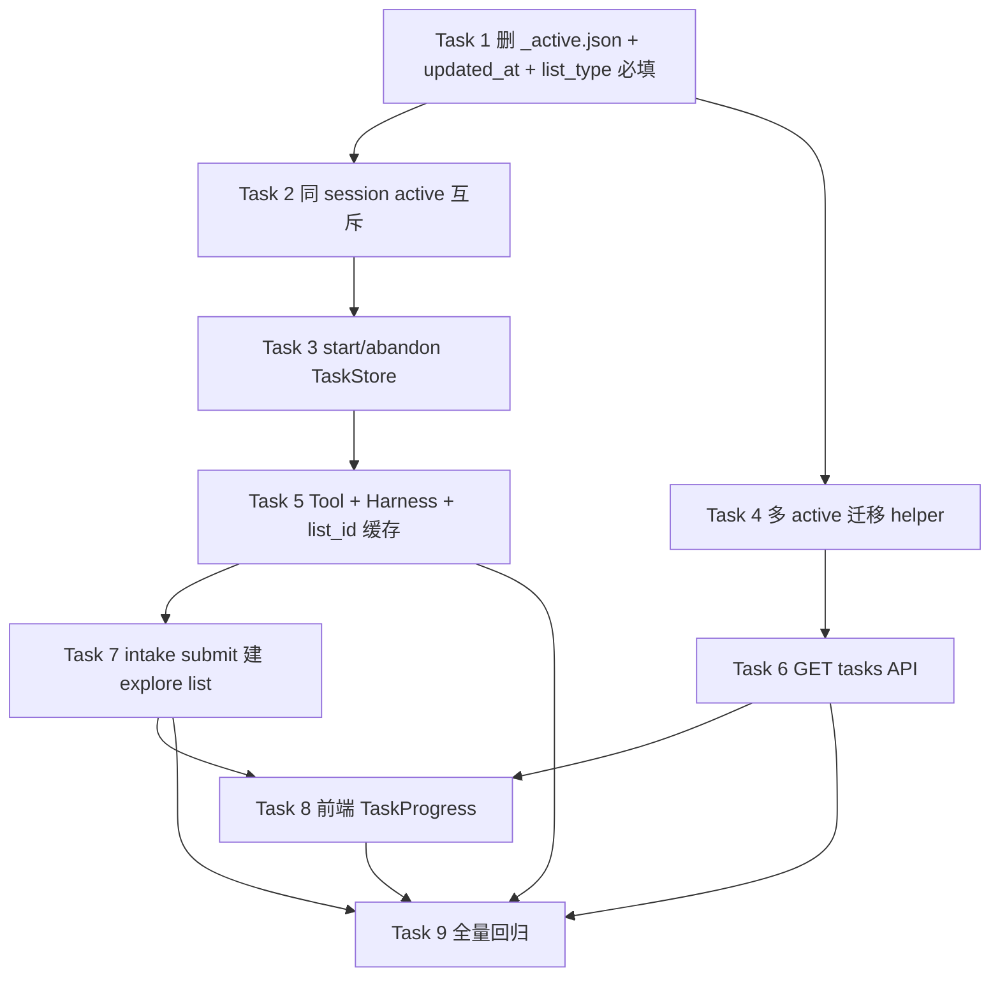

# 多 Session 任务隔离 Implementation Plan

> **状态：** ✅ 已完成（2026-06-01 · 已合并 `main` @ `dd83651`）

> **For agentic workers:** REQUIRED SUB-SKILL: Use superpowers:subagent-driven-development (recommended) or superpowers:executing-plans to implement this plan task-by-task. Steps use checkbox (`- [x]`) syntax for tracking.

**Goal:** 按 [spec v1.3](../specs/2026-06-01-session-task-isolation-design.md) 将任务系统改为按 session 隔离 active list，删除 `_active.json`，补齐 `start_task_list` / `abandon_task_list`，intake submit 后建 explore task list，前端 TaskProgress 仅读 tasks API。

**Architecture:** 任务 SSOT 为 `data/tasks/{list_id}/meta.json`（`status`: `ready`|`active`）；TaskStore 强约束同 session 单 active；`state.list_id` 仅作协调者缓存；REST `GET /v1/tasks` 必填 `session_id`；Tool 错误 `{code,message}` 不透射 HTTP。

**Tech Stack:** Python 3.11+ / FastAPI / pytest · React 19 / Vite / TypeScript

**Spec SSOT:** `docs/superpowers/specs/2026-06-01-session-task-isolation-design.md`（**v1.3**，与 plan 已对齐）

**前置条件:** `main` 上 session 持久化已落地；v0.1 architecture/PRD **不改**。

---

## 已锁定产品决策（2026-06-01）

| # | 议题 | 决策 |
|---|------|------|
| 1 | Explore task list **何时创建** | **submit intake 后立即创建**（非 coordinator 首次派工时） |
| 2 | 初始 **status** | **`active`** |
| 3 | **Milestone** | **2 条**：`identity`（内心探索）、`capability`（能力素材补充），与 `session_activity` worker 线对齐 |
| 4 | **TaskProgress 刷新** | **chat 流结束后** bump refresh key，重新 `getTasks` |
| 5 | 无 task 时 **UI** | 仍渲染 **headline + 空列表骨架**（不整段隐藏） |
| 6 | **list_tasks** 缺省 list_id | 从 **`state.list_id`** 解析（需 session 上下文） |
| 7 | **store 默认 list_type** | Task 1 **去掉默认值**，调用方必须显式传入 `explore`/`jd`/`plan` |
| 8 | **创建挂点** | **`POST /v1/profile/explore-intake`** 成功写 profile 后（非 coordinator.analyze） |

> **挂点约束：** 当前 intake API 为 profile 全局、**无 session_id**。Task 7 须扩展 `ExploreIntakeRequest` + 前端 `ExploreIntakeForm` 传入当前 `sessionId`，否则无法按 session 建 list。

---

## 文件结构（本计划 touch 范围）

| 文件 | 职责 |
|------|------|
| `backend/career_os/platform/store/task.py` | TaskStore：删 `_active.json`、互斥、start/abandon、migrate、updated_at、list_type 必填 |
| `backend/career_os/platform/tool/handlers/task.py` | Tool handler + `state.list_id` 同步 + list_tasks 缺省解析 |
| `backend/career_os/harness/executor.py` | 注册 start/abandon |
| `backend/career_os/api/sessions.py` | `GET /v1/tasks` 必填 + object 400 + active_list_id 扫描 |
| `backend/career_os/api/explore_intake.py` | intake submit 后 ensure explore task list |
| `backend/tests/store/test_task.py` | Store 单测 |
| `backend/tests/api/test_rest.py` | API 单测（含 intake → list） |
| `backend/tests/harness/test_task_tools.py` | Tool 注册与 handler（新建） |
| `backend/tests/harness/test_complete_task.py` | create_task_list 返回值变更 |
| `web/src/components/TaskProgress.tsx` | 新展示优先级 + 空骨架 + refetch prop |
| `web/src/pages/ChatPage.tsx` | 移除 activity fallback；chat 结束 bump refresh |
| `web/src/pages/ExploreIntakeForm.tsx` | 提交时带 sessionId |
| `web/src/lib/exploreIntake.ts` | payload 增 session_id |
| `web/src/lib/sessionsApi.ts` | 解析 object detail（必做） |

---

## 依赖总览



**硬顺序：** Task 4 **必须在 Task 6 之前**（避免多 active 脏数据下 `active_list_id` 不准）。

---

## Task 1: 删除 `_active.json`、`updated_at` 与 list_type 必填

**Files:**
- Modify: `backend/career_os/platform/store/task.py`
- Modify: `backend/tests/store/test_session_index.py`（删 `_active.json` 断言）
- Test: `backend/tests/store/test_task.py`

**Spec refs:** §0.5 · §3.4 · §9.1 · 产品决策 #7

- [x] **Step 1: Write failing test — meta 含 updated_at**

```python
def test_create_task_list_writes_created_and_updated_at(task_store):
    list_id = task_store.create_task_list("sess_test", list_type="explore", status="ready")
    assert isinstance(list_id, str)
    meta = task_store.get_task_list(list_id)
    assert meta["created_at"]
    assert meta["updated_at"] == meta["created_at"]
```

- [x] **Step 2: Run — expect FAIL**

Run: `cd backend && uv run pytest tests/store/test_task.py::test_create_task_list_writes_created_and_updated_at -v`

- [x] **Step 3: Implement**

在 `task.py`：
- 删除 `_active_path`、`get_active`、`_set_active_unlocked`、`_read_active_unlocked`
- `create_task_list(session_id, *, list_type: str, status=...)`：**去掉 `list_type` 默认值**（禁止 silent `list_type="active"`）
- `now = datetime.now(UTC).isoformat()` 写入 `created_at` 与 `updated_at`；**不再**写 `_active.json`
- `delete_lists_for_session`：去掉 `_active.json` 清理分支
- 新增 `get_active_list_id_for_session(session_id) -> str | None`：扫描 meta `status==active`（0 个 → None；>1 个暂返回 `created_at` 最新，Task 4 normalize 后保证唯一）

- [x] **Step 4: 更新 test_session_index.py**

删除 `test_delete_session_removes_dir_index_and_tasks` 中对 `tasks/_active.json` 存在/为 `{}` 的断言（删 `_active.json` 后文件不应存在）。

- [x] **Step 5: Run store tests**

Run: `cd backend && uv run pytest tests/store/test_task.py tests/store/test_session_index.py -q`

- [x] **Step 6: Commit**

```text
refactor(tasks): 移除 _active.json 并写入 meta updated_at

- TaskStore 不再读写全局 active 指针
- create_task_list 初始化 created_at 与 updated_at
- list_type 改为必填，去掉错误默认值
```

---

## Task 2: 同 session 单 active 互斥

**Files:**
- Modify: `backend/career_os/platform/store/task.py`
- Test: `backend/tests/store/test_task.py`

**Spec refs:** §3 · §4.3

**实现约定（锁定）：** `create_task_list` 冲突时 **返回 `TaskStoreError`**，成功返回 `list_id: str`。

- [x] **Step 1: Write failing tests**

```python
def test_create_second_active_same_session_returns_error(task_store):
    assert isinstance(task_store.create_task_list("sess_a", list_type="jd", status="active"), str)
    err = task_store.create_task_list("sess_a", list_type="plan", status="active")
    assert isinstance(err, TaskStoreError)
    assert err.code == "active_list_conflict_same_session"

def test_cross_session_parallel_active_ok(task_store):
    a = task_store.create_task_list("sess_a", list_type="explore", status="active")
    b = task_store.create_task_list("sess_b", list_type="explore", status="active")
    assert isinstance(a, str) and isinstance(b, str)
```

- [x] **Step 2: 改写所有受影响的测试（清单）**

| 文件 | 用例 | 改动 |
|------|------|------|
| `tests/store/test_task.py` | `test_create_task_list_writes_files` | 断言 `isinstance(list_id, str)`；显式 `list_type` |
| `tests/store/test_task.py` | `test_complete_task_deletes_file` | 显式 `list_type="jd"` |
| `tests/store/test_task.py` | `test_list_lists_for_session_orders_active_then_ready` | 第二个 list 改为 `status="ready"`（同 session 不能双 active） |
| `tests/store/test_task.py` | `test_delete_lists_for_session` | 显式 `list_type` |
| `tests/store/test_session_index.py` | `test_delete_session_removes_dir_index_and_tasks` | 显式 `list_type` |
| `tests/api/test_rest.py` | `test_get_tasks_*` | store 调用已传 list_type，确认 `isinstance` |
| `tests/harness/test_complete_task.py` | create_task_list 路径 | handler 返回 TaskStoreError 时断言 |

- [x] **Step 3: Implement `_find_active_meta_for_session` + 互斥**

- [x] **Step 4: Run**

Run: `cd backend && uv run pytest tests/store/test_task.py tests/store/test_session_index.py tests/harness/test_complete_task.py -q`

- [x] **Step 5: Commit**

```text
feat(tasks): 同 session 仅允许一个 active list

- create_task_list status=active 时 TaskStore 强校验
- 跨 session 并行 active 仍允许
```

---

## Task 3: `start_task_list` 与 `abandon_task_list`

**Files:**
- Modify: `backend/career_os/platform/store/task.py`
- Test: `backend/tests/store/test_task.py`

**Spec refs:** §2.2 · §3 · §8

- [x] **Step 1: Write failing tests**

```python
def test_start_task_list_ready_to_active(task_store):
    list_id = task_store.create_task_list("sess_a", list_type="explore", status="ready")
    assert isinstance(list_id, str)
    assert task_store.start_task_list(list_id) is None
    meta = task_store.get_task_list(list_id)
    assert meta["status"] == "active"
    assert meta["updated_at"] >= meta["created_at"]

def test_start_task_list_rejects_non_ready(task_store):
    list_id = task_store.create_task_list("sess_a", list_type="explore", status="active")
    err = task_store.start_task_list(list_id)
    assert err.code == "list_not_ready"

def test_start_task_list_rejects_when_other_active(task_store):
    assert isinstance(
        task_store.create_task_list("sess_a", list_type="explore", status="active"), str
    )
    ready_id = task_store.create_task_list("sess_a", list_type="jd", status="ready")
    err = task_store.start_task_list(ready_id)
    assert err.code == "active_list_conflict_same_session"

def test_abandon_task_list_deletes_files(task_store, tmp_path):
    list_id = task_store.create_task_list("sess_a", list_type="explore", status="ready")
    task_store.create_task(list_id, "identity", "内心探索", kind="milestone")
    assert task_store.abandon_task_list(list_id) is None
    assert not (tmp_path / "tasks" / list_id).exists()
```

- [x] **Step 2: Run — FAIL**

- [x] **Step 3: Implement**

```python
def start_task_list(self, list_id: str) -> TaskStoreError | None:
    # meta 须 ready；同 session 无其它 active；写 status=active + updated_at

def abandon_task_list(self, list_id: str) -> TaskStoreError | None:
    # 删 list 目录下全部文件 + rmdir；list_not_found → error
```

- [x] **Step 4: Run — PASS**

Run: `cd backend && uv run pytest tests/store/test_task.py -q`

- [x] **Step 5: Commit**

```text
feat(tasks): 实现 start_task_list 与 abandon_task_list

- ready 转 active 并刷新 updated_at
- 同 session 已有 active 时 start 拒绝
- abandon 物理删除 list 目录
```

---

## Task 4: 多 active 迁移 helper

**Files:**
- Modify: `backend/career_os/platform/store/task.py`
- Test: `backend/tests/store/test_task.py`

**Spec refs:** §3.3

> **必须在 Task 6 之前完成。**

- [x] **Step 1: Write failing test**

（bypass Task 2 互斥：直接 patch 两个 `status=active` 的 meta 文件模拟历史脏数据。）

- [x] **Step 2: Implement `normalize_multi_active_for_session(session_id)`**

- 按 `created_at` 降序保留 1 条 active，其余改 `ready` + `updated_at=now`
- `logging.warning(...)`

- [x] **Step 3: 在 `list_lists_for_session` 开头调用 normalize**

- [x] **Step 4: Run + Commit**

```text
feat(tasks): 迁移同 session 多 active 脏数据

- 保留 created_at 最新 active，其余降为 ready
- 写 warn 日志
```

---

## Task 5: Tool handlers + Harness 注册 + `state.list_id`

**Files:**
- Modify: `backend/career_os/platform/tool/handlers/task.py`
- Modify: `backend/career_os/harness/executor.py`
- Create: `backend/tests/harness/test_task_tools.py`

**Spec refs:** §2.2 · §3.2 · §4.2 · 产品决策 #6

- [x] **Step 1: Write failing tests**

```python
def test_start_task_list_tool_registered(harness):
    assert harness.tools.is_allowed("coordinator", "start_task_list")

def test_create_task_list_updates_state_list_id(harness, session_id):
    result = harness.execute_tool("coordinator", "create_task_list", {
        "session_id": session_id,
        "list_type": "explore",
        "status": "active",
    }, session_id=session_id)
    assert "list_id" in result
    assert SessionStore().get_state(session_id)["list_id"] == result["list_id"]

def test_list_tasks_defaults_to_state_list_id(harness, session_id):
    created = harness.execute_tool("coordinator", "create_task_list", {...}, session_id=session_id)
    harness.execute_tool("coordinator", "create_task", {
        "list_id": created["list_id"], "task_id": "identity", "kind": "milestone", "subject": "内心探索",
    }, session_id=session_id)
    listed = harness.execute_tool("coordinator", "list_tasks", {}, session_id=session_id)
    assert len(listed["tasks"]) == 1
```

- [x] **Step 2: Implement handlers**

**`state.list_id` 同步规则（锁定）：**
- **不**依赖 `args.session_id`（schema 无此字段时）
- 从 `meta.json` 读 `session_id`；`create_task_list` 用 args 中的 `session_id`
- `abandon_task_list`：若 `state.list_id == list_id` 则清 `null`

```python
def _sync_state_list_id(session_id: str, list_id: str | None) -> None:
    store = SessionStore()
    state = store.get_state(session_id)
    if list_id is None and state.get("list_id") != abandoned_list_id:
        return  # 仅清指向被 abandon 的 list
    store.update_state(session_id, {"list_id": list_id})

def list_tasks(actor, args):
    list_id = args.get("list_id")
    if not list_id:
        session_id = args.get("session_id")  # harness 注入
        list_id = SessionStore().get_state(session_id).get("list_id")
        if not list_id:
            return TaskToolError("list_not_found", "No active list for session")
    ...
```

- [x] **Step 3: Register start/abandon in executor.py**

- [x] **Step 4: Fix `create_task_list` handler for `TaskStoreError` return type**

- [x] **Step 5: Run + Commit**

```text
feat(tasks): 注册 start/abandon 工具并同步 state.list_id

- Harness 注册 start_task_list 与 abandon_task_list
- create/start 成功时更新 session state.list_id
- list_tasks 缺省 list_id 时读 state.list_id
```

---

## Task 6: `GET /v1/tasks` API

**Files:**
- Modify: `backend/career_os/api/sessions.py`
- Test: `backend/tests/api/test_rest.py`

**Spec refs:** §5 · §4.3

**前置：** Task 4 已完成。

- [x] **Step 1: Write failing tests**

```python
def test_get_tasks_without_session_id_returns_400_object(client):
    r = client.get("/v1/tasks")
    assert r.status_code == 400
    assert r.json()["detail"]["code"] == "session_id_required"

def test_get_tasks_invalid_session_id_400_object(client):
    r = client.get("/v1/tasks", params={"session_id": "bad-id"})
    assert r.status_code == 400
    assert r.json()["detail"]["code"] == "invalid_session_id"

def test_get_tasks_active_list_id_from_meta_scan(client):
    sid = client.post("/v1/sessions/new").json()["session_id"]
    store = TaskStore()
    list_id = store.create_task_list(sid, list_type="explore", status="active")
    assert isinstance(list_id, str)
    body = client.get("/v1/tasks", params={"session_id": sid}).json()
    assert body["active_list_id"] == list_id
```

- [x] **Step 2: 删除/改写旧测试**

- 删除 `test_get_tasks_without_session_id_v01_compat`
- 改写 `test_get_tasks_invalid_session_id_400`：string detail → object detail

- [x] **Step 3: Implement**

- 新增 `_validate_session_id_for_tasks(session_id)` → object detail
- `get_tasks`：无参 → 400 object；`active_list_id = store.get_active_list_id_for_session(session_id)`

- [x] **Step 4: Run**

Run: `cd backend && uv run pytest tests/api/test_rest.py -k tasks -q`

- [x] **Step 5: Commit**

```text
feat(api): GET /v1/tasks 必填 session_id 且 active 来自 meta 扫描

- 删除无参 v0.1 兼容分支
- 任务域 400 返回 object detail
```

---

## Task 7: Intake submit 后创建 explore task list

**Files:**
- Modify: `backend/career_os/api/explore_intake.py`
- Modify: `backend/career_os/api/sessions.py`（若路由层需透传）
- Modify: `web/src/lib/exploreIntake.ts`
- Modify: `web/src/pages/ExploreIntakeForm.tsx`
- Modify: `web/src/pages/ChatPage.tsx`（传 sessionId 给表单）
- Test: `backend/tests/api/test_rest.py`

**Spec refs:** §3.1 · §8.7 · 产品决策 #1–3、#8

**锁定行为：**
- **时机：** `POST /v1/profile/explore-intake` profile patch 成功后
- **status：** `active`
- **幂等：** 该 session 已有 `list_type=explore` 的 list → 跳过
- **Milestones：**

| task_id | kind | title |
|---------|------|-------|
| `identity` | milestone | 内心探索 |
| `capability` | milestone | 能力素材补充 |

- [x] **Step 1: 扩展 API — `ExploreIntakeRequest` 增 `session_id: str`**

前端 `ExploreIntakeForm` 接收 `sessionId` prop，`submitExploreIntake` 一并提交。

- [x] **Step 2: Write failing test**

```python
def test_explore_intake_submit_creates_explore_task_list(client):
    sid = client.post("/v1/sessions/new").json()["session_id"]
    payload = {
        "session_id": sid,
        "resume_text": "张三\n3年经验\n期望岗位：后端开发\n",
        "years_of_experience": "3年",
    }
    r = client.post("/v1/profile/explore-intake", json=payload)
    assert r.status_code == 200

    tasks = client.get("/v1/tasks", params={"session_id": sid}).json()
    explore = [lst for lst in tasks["lists"] if lst["list_type"] == "explore"]
    assert len(explore) == 1
    assert explore[0]["status"] == "active"
    assert tasks["active_list_id"] == explore[0]["list_id"]
    task_ids = {t["id"] for t in explore[0]["tasks"]}
    assert task_ids == {"identity", "capability"}

    # 幂等：再次 submit 不重复建 list
    client.post("/v1/profile/explore-intake", json=payload)
    tasks2 = client.get("/v1/tasks", params={"session_id": sid}).json()
    assert len([l for l in tasks2["lists"] if l["list_type"] == "explore"]) == 1
```

- [x] **Step 3: Implement `ensure_explore_task_list(session_id)`**

在 `explore_intake.py`（或 `platform/store/task_helpers.py`）：

```python
def ensure_explore_task_list(session_id: str) -> str | None:
    store = TaskStore()
    for row in store.list_lists_for_session(session_id):
        if row.get("list_type") == "explore":
            return row["list_id"]
    result = store.create_task_list(session_id, list_type="explore", status="active")
    if isinstance(result, TaskStoreError):
        raise ...  # 或 log + 返回已有 active 冲突
    list_id = result
    for task_id, title in [("identity", "内心探索"), ("capability", "能力素材补充")]:
        store.create_task(list_id, task_id, title, kind="milestone")
    SessionStore().update_state(session_id, {"list_id": list_id, "list_type": "explore"})
    return list_id
```

在 `submit_explore_intake` 末尾调用（须校验 `session_id` 格式且 session 存在）。

- [x] **Step 4: Run**

Run: `cd backend && uv run pytest tests/api/test_rest.py::test_explore_intake_submit tests/api/test_rest.py::test_explore_intake_submit_creates_explore_task_list -q`

- [x] **Step 5: Commit**

```text
feat(explore): intake 提交后为当前 session 创建 explore task list

- POST explore-intake 增 session_id
- create_task_list active + identity/capability milestones
- 幂等跳过已存在的 explore list
```

---

## Task 8: 前端 TaskProgress + sessionsApi

**Files:**
- Modify: `web/src/components/TaskProgress.tsx`
- Modify: `web/src/pages/ChatPage.tsx`
- Modify: `web/src/lib/sessionsApi.ts`

**Spec refs:** §6 · §9.5 · 产品决策 #4、#5

- [x] **Step 1: 更新 `pickTaskListForDisplay`**

```typescript
export function pickTaskListForDisplay(lists: TaskListRow[]): TaskListRow | null {
  const active = lists.find((l) => l.status === "active");
  if (active?.tasks?.length) return active;

  const readyLists = lists.filter((l) => l.status === "ready");
  if (active && readyLists.length > 0) return readyLists[0];

  if (readyLists[0]?.tasks?.length) return readyLists[0];

  // 产品决策 #5：active 存在但无 task → 仍展示 active（headline + 空骨架）
  if (active) return active;

  return null;
}
```

- [x] **Step 2: 空骨架渲染**

当 `display.list` 存在但 `items.length === 0` 时，仍渲染 headline（如「职业初探」）+ 空 `<ul>`，**不** `return null`。

- [x] **Step 3: 移除 sessionActivity fallback**

- `TaskProgress`：删除 `activity` prop 及 items fallback；headline 仅来自 tasks API / `LIST_TYPE_HEADLINES`
- `ChatPage`：`<TaskProgress sessionId={sessionId} refreshTrigger={taskRefreshTrigger} />`

- [x] **Step 4: chat 结束后 refetch（产品决策 #4）**

`ChatPage`：chat SSE 正常结束后 `setTaskRefreshTrigger(n => n + 1)`；`TaskProgress` `useEffect` 依赖 `[sessionId, refreshTrigger]`。

- [x] **Step 5: sessionsApi object detail**

```typescript
// detail 支持 string | { code: string; message: string }
function formatApiDetail(detail: unknown): string {
  if (typeof detail === "string") return detail;
  if (detail && typeof detail === "object" && "message" in detail)
    return String((detail as { message: string }).message);
  return "Request failed";
}
```

- [x] **Step 6: Build**

Run: `cd web && npm run build`

- [x] **Step 7: Commit**

```text
feat(web): TaskProgress 仅读 tasks API 并支持空骨架与 chat 后刷新

- active 无 task 时展示 headline 空列表
- 移除 sessionActivity items fallback
- sessionsApi 解析 object detail
```

---

## Task 9: 全量回归

**Files:** —

- [x] **Step 1: Backend**

Run: `cd backend && uv run pytest tests/ -q`

- [x] **Step 2: Frontend build**

Run: `cd web && npm run build`

- [x] **Step 3: 手动 smoke**

- [x] 两 session 各 submit intake / 各有 explore active list，互不影响
- [x] 同 session 第二个 active 被拒绝
- [x] intake submit 后 `GET /v1/tasks` 有 explore list + 2 milestones
- [x] chat 结束后 TaskProgress 刷新
- [x] intake 填写期间（submit 前）TaskProgress 为空（预期；headline 在 chat 区）

- [x] **Step 4: Commit（若有遗漏修复）**

```text
test(tasks): 任务隔离全量回归通过
```

---

## Spec 覆盖自检（v1.3）

| Spec / 决策 | Task |
|-------------|------|
| 删 `_active.json` | 1 |
| list_type 必填 | 1 |
| 同 session 单 active | 2, 3 |
| start 同 session 冲突 | 3 |
| 跨 session 并行 | 2 |
| start/abandon | 3, 5 |
| 迁移多 active（T4 先于 T6） | 4 |
| GET tasks 必填 + object detail | 6 |
| state.list_id 缓存 | 5, 7 |
| list_tasks 缺省 → state.list_id | 5 |
| intake submit 建 explore list | 7 |
| milestones identity + capability | 7 |
| TaskProgress 优先级 + 空骨架 | 8 |
| chat 后 refetch | 8 |
| sessionsApi object detail | 8 |
| get_task 非本期 | — |
| 会话 API string detail 不变 | 6 |

---

## 风险

| 风险 | 缓解 |
|------|------|
| `create_task_list` 返回 `TaskStoreError` 破坏调用方 | Task 2 测试清单 + Task 5 handler |
| intake API 原为 profile 全局，缺 session_id | Task 7 扩展 request + 前端传 sessionId |
| intake submit 前 TaskProgress 空 | 预期行为；chat headline 仍展示 |
| explore list 在 intake 前不创建 | 与产品决策 #1 一致（非 bug） |
| Task 6 早于 Task 4 导致 active_list_id 不准 | 依赖图硬顺序 T4 → T6 |
| profile 全局 intake + 多 session 各自 explore list | 每 session 独立 list；intake 数据仍全局 profile |

---

## 执行方式

**已完成。** Task 1–9 全部落地；`196 passed`（backend pytest，2026-06-01）· `npm run build` 通过 · commit `dd83651`。
