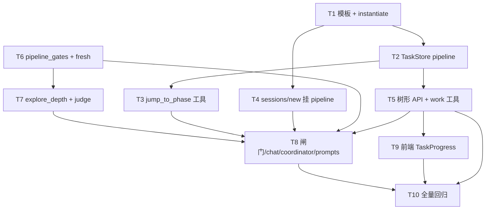

# 任务系统 Pipeline 升级 Implementation Plan

> **For agentic workers:** REQUIRED SUB-SKILL: Use superpowers:subagent-driven-development (recommended) or superpowers:executing-plans to implement this plan task-by-task. Steps use checkbox (`- [ ]`) syntax for tracking.

**Goal:** 按 [spec v0.5.3](../specs/2026-06-01-task-system-pipeline-upgrade-design.md) 将任务系统升级为 **单 session 单条 `pipeline` list**、五步 milestone 壳 + 动态 work、闸门/jump/初探轮次判定，并同步前端进度条。

**Architecture:** `config/pipeline_milestones.json` 为五步 SSOT；`POST /v1/sessions/new` 实例化 pipeline；`meta.current_phase` 驱动焦点；**禁止** `complete_task` pipeline milestone；work 可 `complete` 删文件；准入与 jump 由 `career_os/harness/pipeline_gates.py`（新建）集中判定；初探 `explore_depth` 分轨计轮 + 专用判定节点。

**Tech Stack:** Python 3.11+ / FastAPI / pytest · React 19 / Vite / TypeScript

**Spec SSOT:** `docs/superpowers/specs/2026-06-01-task-system-pipeline-upgrade-design.md`（**v0.5.3**）

**前置:** [session-task-isolation plan](./2026-06-01-session-task-isolation.md) 已落地（`start_task_list` / `abandon_task_list` / 按 session 扫 active）。

**非目标（本期）:** `list_type=plan` 旁路；`skip_phase`；跨 session 任务恢复；改 A02 PRD 正文（可最后补一节 pipeline）。

---

## 已锁定产品决策（摘自 spec §11）

| 主题 | 决策 |
|------|------|
| List | 每 session **一条** `list_type=pipeline`；**不删** 其它 session tasks |
| 创建挂点 | **`POST /v1/sessions/new`** 实例化五步；intake **只** patch profile |
| Milestone | **壳文件**，不 `complete`；进度靠 `current_phase` |
| Work | 进入 phase → **自动 claim 首条**；离开 phase → **删该 phase 全部 work** |
| UI | 五步常驻；**当前/其他/禁用**；未填表 → 强弱化 |
| 离开 explore | **`explore_complete` 用户确认**（session flag），不看 profile `completed_at` |
| 初探 | 从未初探 **不跑 F1–F3**；够深 **6→+2→+1** / 专用 Harness 节点；closure **两 Worker 各 ≥1** |
| 策略/简历 | `strategy_complete` → 可问 optimize；`optimize_confirm` → **`advance` 至 resume 步**（非 jump）+ 派 resume |
| Jump | 合法目标：`explore`（**可跳回**）\|`market`\|`jd_analysis`\|`resume_strategy`；**禁止** jump `resume_optimize`（**Q26/G-08**） |
| 进入 resume 步 | 仅 `current_phase=resume_strategy` + `optimize_confirm` → **`advance_current_phase`** |
| 换 JD | 同 pipeline，更新 fingerprint + jump 清下游 |

---

## 文件结构（本计划 touch 范围）

| 文件 | 职责 |
|------|------|
| `config/pipeline_milestones.json` | **新建** — 五步模板 SSOT |
| `backend/career_os/platform/pipeline_template.py` | **新建** — 读模板、实例化 list + 5×ms_*.json |
| `backend/career_os/platform/store/task.py` | pipeline 字段、work 父子、禁止 ms complete、phase work 清理 |
| `backend/career_os/harness/pipeline_gates.py` | **新建** — fresh/hard/depth、jump 校验、清 flag |
| `backend/career_os/harness/explore_depth.py` | **新建** — 分轨计轮、触发判定、调用 depth judge |
| `backend/career_os/harness/explore_depth_judge.py` | **新建** — 小模型/prompt 判定单轨够深 |
| `backend/career_os/harness/gate.py` | +`strategy_complete`；`explore_gate_confirmed`；`optimize_confirm` → `advance_current_phase` |
| `backend/career_os/api/chat.py` | optimize / strategy / explore confirm 写 flag + baseline |
| `backend/career_os/api/sessions.py` | `new_session` → `ensure_pipeline_for_session`；`GET /v1/tasks` 树形响应 |
| `backend/career_os/api/explore_intake.py` | **移除** `ensure_explore_task_list`；保留 profile patch |
| `backend/career_os/harness/jd_prerequisites.py` | 收敛为 `explore_gate_confirmed` |
| `backend/career_os/harness/delegate.py` | resume / phase / jump 硬拦 |
| `backend/career_os/platform/tool/handlers/task.py` | `jump_to_phase`、`advance_current_phase`、`get_task`、`ensure_milestone_works`、`apply_proposed_work_tasks` |
| `backend/career_os/harness/executor.py` | 注册 jump / advance / work 工具 |
| `backend/career_os/agents/graphs/coordinator.py` | analyze 注入 pipeline 上下文；E2 改挂闸门条件 |
| `backend/career_os/agents/lc/coordinator_llm.py` | prompt：`can_offer_explore_complete`、jump/work 提案字段 |
| `backend/career_os/agents/lc/worker_llm.py`（或等价 prompt） | work 提案 JSON 形状、`parent_milestone_id` |
| `backend/career_os/harness/jd_change.py`（或 `jd_prerequisites` 旁） | 换 JD 写 `related_jd_fingerprint` + 下游 jump/清 work |
| `backend/tests/harness/test_pipeline_gates.py` | **新建** |
| `backend/tests/harness/test_explore_depth.py` | **新建** |
| `backend/tests/store/test_task_pipeline.py` | **新建** |
| `backend/tests/api/test_rest.py` | sessions/new pipeline、tasks 树形 API |
| `web/src/components/TaskProgress.tsx` | 五步 + current_phase + 弱化档 + 二级 work |
| `web/src/lib/sessionsApi.ts` | 解析树形 `GET /v1/tasks` |

---

## 依赖总览



**建议落地顺序：** T1→T2→T4→T6→T7→T3→T5（含 `get_task` / work 工具）→T8→T9→T10（T4 可与 T6 并行）。

---

## Task 1: 五步模板与实例化

**Files:**
- Create: `config/pipeline_milestones.json`
- Create: `backend/career_os/platform/pipeline_template.py`
- Create: `backend/tests/platform/test_pipeline_template.py`

**Spec refs:** §4.1.1 · §4.3 · A6 · §11 Q16

- [x] **Step 1: 写模板 JSON**

`config/pipeline_milestones.json` — 5 项：`pipeline_phase`、`subject`、`task_id`（`ms_explore` … `ms_resume`）。

- [x] **Step 2: 写失败测试 `test_instantiate_pipeline_creates_five_milestone_files`**

```python
def test_instantiate_pipeline_creates_five_milestone_files(tmp_path, monkeypatch):
    # monkeypatch settings.data_dir → tmp_path
    list_id = instantiate_pipeline_for_session("sess_test")
    assert list_id.startswith("list_")
    meta = json.loads((tmp_path / "tasks" / list_id / "meta.json").read_text())
    assert meta["list_type"] == "pipeline"
    assert meta["current_phase"] == "explore"
    assert meta["session_id"] == "sess_test"
    ms_files = [p for p in (tmp_path / "tasks" / list_id).glob("ms_*.json")]
    assert len(ms_files) == 5
```

- [x] **Step 3: 实现 `instantiate_pipeline_for_session(session_id) -> list_id`**

- `TaskStore.create_task_list(..., list_type="pipeline", status="active")`
- 按模板写 5 个 milestone JSON（无 `status` 或固定 `pending` 壳；**不含** work）
- `SessionStore.update_state(session_id, {"list_id": list_id, "list_type": "pipeline"})`

- [x] **Step 4: `pytest tests/platform/test_pipeline_template.py -q`**

- [ ] **Step 5: Commit**（用户要求时，中文 conventional commit）

```text
feat(task): 增加 pipeline 五步模板与实例化
```

---

## Task 2: TaskStore — pipeline 语义

**Files:**
- Modify: `backend/career_os/platform/store/task.py`
- Create: `backend/tests/store/test_task_pipeline.py`

**Spec refs:** §4.1.1 · §5.2 · A3 · A4 · §7.3

- [x] **Step 1: 扩展 `create_task`**

字段：`parent_milestone_id`、`pipeline_phase`、`description`、`sort_order`、`list_type`；校验 parent 属于同一 list。

- [x] **Step 2: 测试 — `complete_task` 拒绝 pipeline milestone**

```python
def test_complete_task_rejects_pipeline_milestone(task_store):
    list_id = ...  # pipeline
    err = task_store.complete_task(list_id, "ms_explore")
    assert err.code == "milestone_complete_forbidden"
```

- [x] **Step 3: 实现 `complete_task` 分支**

- `list_type=pipeline` + `kind=milestone` → 返回错误
- `kind=work` → 仍 `unlink`

- [x] **Step 4: `set_current_phase(list_id, phase)` + `clear_works_for_phase(list_id, phase)`**

- 删除 `parent_milestone_id` 对应 `ms_*` 下全部 work 文件

- [x] **Step 5: `claim_first_work_for_phase`（或 handler 层）**

进入 phase 后：该 phase 下 sort_order 最小 pending work → `status=active`（统一用 `in_progress` 若本期改字段名）

- [x] **Step 6: `list_tasks_tree(list_id)` → §4.5 形状**

- 模板五步始终返回；`works` 仅挂在 `current_phase` 对应 milestone 下

- [x] **Step 8: `get_task(list_id, task_id)`（Store + Harness 工具）**

- 供协调者/Worker 读取单条 milestone/work 元数据（spec §12 Tools）

- [x] **Step 9: `pytest tests/store/test_task_pipeline.py -q`**

---

## Task 3: `jump_to_phase` 工具

**Files:**
- Create: `backend/career_os/harness/pipeline_gates.py`（初版仅 jump + clear flags）
- Modify: `backend/career_os/platform/tool/handlers/task.py`
- Modify: `backend/career_os/harness/executor.py`
- Create: `backend/tests/harness/test_pipeline_gates.py`

**Spec refs:** §3.2.1 · §5.1 · §7.7 · G-02/G-05/G-06/G-07/G-08 · Q26 · C2

**`jump_to_phase` 目标校验（与 spec §3.2.1 一致）：**

| 目标 | 允许 | 前置 |
|------|------|------|
| `explore` | ✓ | 无（**任意时刻可跳回**，Q15/Q26） |
| `market` / `jd_analysis` / `resume_strategy` | ✓ | `session.explore_gate_confirmed` |
| `resume_optimize` | **✗** | **非 jump 目标**；见 Task 8 `advance_current_phase` |

- [x] **Step 1: 测试 jump 清 work + 更新 current_phase**

```python
def test_jump_to_market_clears_explore_works_and_flags():
    # setup pipeline at explore with work file
    jump_to_phase(..., target="market")
    assert no work files under ms_explore
    assert meta["current_phase"] == "market"
    assert flags["strategy_complete"] is False
```

- [x] **Step 2: 实现 `jump_to_phase`**

- 按上表校验目标与前置；拒绝时返回明确 error code
- 按 §7.7 表清 `gates.flags`（跳回 explore 时清 session `explore_gate_confirmed` 等）
- 流程：清**离开** phase 下全部 work（G-07）→ 写 `current_phase` → 若目标 phase 已有 work → **自动 claim 首条**（A4）
- **测例补充：** 未 `explore_gate_confirmed` 时 `jump_to_phase(explore)` **仍成功**；自 `market` jump 至 `explore` 成功；`jump_to_phase(resume_optimize)` **始终** 返回 `jump_target_forbidden`（或等价）

- [x] **Step 3: 注册 Harness tool（coordinator-only）**

- [x] **Step 4: `pytest tests/harness/test_pipeline_gates.py -q`**

---

## Task 4: `sessions/new` 创建 pipeline

**Files:**
- Modify: `backend/career_os/api/sessions.py`
- Modify: `backend/career_os/api/explore_intake.py`（删除 `ensure_explore_task_list`）
- Modify: `backend/tests/api/test_rest.py`

**Spec refs:** Q16 · A6 · §8

- [x] **Step 1: 测试 `POST /v1/sessions/new` 后存在 pipeline**

```python
def test_new_session_creates_pipeline_list(client):
    sid = client.post("/v1/sessions/new").json()["session_id"]
    body = client.get("/v1/tasks", params={"session_id": sid}).json()
    assert len(body["lists"]) == 1
    assert body["lists"][0]["list_type"] == "pipeline"
    assert body["lists"][0]["current_phase"] == "explore"
```

- [x] **Step 2: `new_session()` 内调用 `instantiate_pipeline_for_session`**

- [x] **Step 3: 两个 session 各有 pipeline、互不影响**

```python
def test_two_sessions_two_pipelines_no_cross_delete(client):
    a = client.post("/v1/sessions/new").json()["session_id"]
    b = client.post("/v1/sessions/new").json()["session_id"]
    # tasks for a still exist
```

- [x] **Step 4: `explore_intake` 不再 `create_task_list(explore)`**

- [x] **Step 5: `pytest tests/api/test_rest.py -q -k session`**

---

## Task 5: 树形 API + 动态 work 工具

**Files:**
- Modify: `backend/career_os/api/sessions.py`（`get_tasks`）
- Modify: `backend/career_os/platform/tool/handlers/task.py`
- Modify: `backend/career_os/harness/executor.py`
- Modify: `web/src/lib/sessionsApi.ts`（类型）
- Create: `backend/tests/platform/test_task_work_tools.py`（或并入 `test_task_pipeline.py`）

**Spec refs:** §4.5 · §5.2 · §7.3 · §7.8 · B3

- [x] **Step 1: API 返回 `current_phase`、`milestones[]`（含 `works`）**

- `all_tasks_completed`：**pipeline 下恒 false**（有五步壳）；无 list 时才 true

- [x] **Step 2: 测试树形结构**

- [x] **Step 3: `ensure_milestone_works(list_id, phase)`**

- 当前 phase 下若无 pending work：协调者可调；用于「进入步但尚无 work」时占位/引导（与 A4 首条 claim 配合）
- `resume_optimize`：幂等创建 spec §6 默认 **4 条** work 后再 claim 首条

- [x] **Step 4: `apply_proposed_work_tasks(list_id, proposals[])`**

- Worker 提案 → 校验 `parent_milestone_id` 属于当前 `current_phase` 的 `ms_*` → 批量 `create_task(kind=work)` → 可选自动 claim 首条

- [x] **Step 5: 注册 Harness 工具（`jump_to_phase`、`get_task`、`ensure_milestone_works`、`apply_proposed_work_tasks`；coordinator claim/complete；Worker 仅 propose）

- [x] **Step 6: 更新 TS 类型 `TaskListRow` / `MilestoneRow` / `WorkRow`**

- [x] **Step 7: `pytest` work 工具 + 树形 API**

---

## Task 6: `pipeline_gates` — hard / fresh / explore_gate

**Files:**
- Modify: `backend/career_os/harness/pipeline_gates.py`（扩充）
- Modify: `backend/career_os/harness/jd_prerequisites.py`

**Spec refs:** §3.1 · F1–F3 · A1 · A2 · C4

- [x] **Step 1: `compute_hard_pass(profile) -> (bool, reasons)`**

简历 + 表单必填（复用 `explore_intake_fields` / basic）。

- [x] **Step 2: `compute_needs_full_explore(profile, session_state)`**

- 从未初探 → True，**不评估** F1–F3
- 否则 F1（无 `completed_at` 不触发 F1）、F2（对 `intake_baseline`）、F3（intent）

- [x] **Step 3: `explore_gate_confirmed` 写入/读取**

`session_state.flags` 或 `gates.flags`；与 profile `completed_at` **解耦**（C4）

- [x] **Step 4: `jd_prerequisites_met` → `explore_gate_confirmed`**

- [x] **Step 5: 测试 never_explored / F2 / jump 回 explore 清 session flag 不清 profile**

---

## Task 7: 初探分轨计轮 + 够深判定

**Files:**
- Create: `backend/career_os/harness/explore_depth.py`
- Create: `backend/career_os/harness/explore_depth_judge.py`
- Modify: `backend/career_os/harness/session_activity.py` 或 coordinator 派工后钩子

**Spec refs:** §3.1.1 · Q19–Q22 · A9

- [x] **Step 1: `record_explore_round(session, workers_delegated)`**

一问一答 + 按 identity/capability 入账（Q20–Q21）

- [x] **Step 2: `should_run_depth_judge(track) -> bool`**

6 / +2 / +1 节奏

- [x] **Step 3: `run_depth_judge(track, profile, messages) -> {sufficient, reasons}`**

可 mock LLM；**非** `delegate_worker`

- [x] **Step 4: `can_offer_explore_complete(session, profile)`**

`hard_pass && depth_pass_personal && depth_pass_capability && explore_closure_both_done`（**不含** fresh_pass 阻塞，C3乙）

- [x] **Step 5: `delegate_blocked` 当 explore 且缺 capability 轮次**（A9）

- [x] **Step 6: `pytest tests/harness/test_explore_depth.py -q`**

---

## Task 8: 闸门、JD 变更、prompts、闸门后清 work

**Files:**
- Modify: `backend/career_os/harness/gate.py`
- Modify: `backend/career_os/api/chat.py`
- Modify: `backend/career_os/agents/graphs/coordinator.py`
- Modify: `backend/career_os/agents/lc/coordinator_llm.py`
- Modify: `backend/career_os/agents/lc/worker_llm.py`（或项目内 Worker prompt 路径）
- Modify: `backend/career_os/harness/jd_prerequisites.py` 或 **Create** `jd_change.py`

**Spec refs:** §7.5.1 · §7.6 · §7.7 · Q10 · Q16 · Q26 · G-08 · A5 · C2

- [x] **Step 1: 注册 `strategy_complete` confirm 话术**

- [x] **Step 2: `explore_complete` confirm → `explore_gate_confirmed=true` + 写 `exploration.intake_baseline`（A1）+ `fresh_pass=true`（C3乙）**

- confirm 后：对**当前** `explore` phase 调用 `clear_works_for_phase`（与 jump 一致，避免残留 work）

- [x] **Step 3: 修订 E2：仅当 `can_offer_explore_complete` 才 `gates.pending=explore_complete`（Q23-B）**

- [x] **Step 4: 实现 `advance_current_phase(list_id, "resume_optimize")` 并注册 Harness 工具**

- **仅** 在 `current_phase=resume_strategy` 且 `optimize_confirm` 已确认时由 gate/chat 调用；**禁止** 经 `jump_to_phase`
- 推进后：清 `resume_strategy` phase work → `ensure_milestone_works` 默认 4 条（§6）→ 自动 claim 首条（A4）

- [x] **Step 5: `optimize_confirm` confirm → `optimize_confirmed` + 调用 `advance_current_phase(resume_optimize)`**

- 若 `current_phase != resume_strategy` → 拒绝 advance，引导先 jump 至策略步

- [x] **Step 6: `delegate_worker(resume)` 须 `optimize_confirmed` 且 `current_phase=resume_optimize`**

- [x] **Step 7: 换 JD：`related_jd_fingerprint` 变更检测**

- fingerprint 变化 → `jump_to_phase` 或等价：更新 session/meta fingerprint、清 `jd_analysis` 及下游 phase work、重置相关 `gates.flags`（见 spec **A7 / Q16**）

- [x] **Step 8: Coordinator / Worker prompt**

- Coordinator：`can_offer_explore_complete`、`current_phase`、**可 jump 回 explore**、**禁止** jump/直达 `resume_optimize`、禁止 complete milestone
- Worker：`apply_proposed_work_tasks` 提案 schema（`title`/`description`/`parent_milestone_id`）

- [x] **Step 9: 测试：jump 回 explore；jump resume_optimize 拒绝；optimize 后 advance；双闸门顺序；JD fingerprint**

---

## Task 9: 前端 TaskProgress

**Files:**
- Modify: `web/src/components/TaskProgress.tsx`
- Modify: `web/src/pages/ChatPage.tsx`

**Spec refs:** §7.1 · §7.8 · Q17–Q18

- [x] **Step 1: 消费 `milestones` + `current_phase`**

- 五步全渲染；当前步展开 `works`；其它步弱化

- [x] **Step 2: `ui_mode`: `weak` | `normal`**

`hard_pass=false` → 强弱化 + 引导填表（Q18）

- [x] **Step 3: 禁用态**

- 非 explore 且未 `explore_gate_confirmed`：后四步灰显
- `resume_optimize`：`current_phase != resume_optimize` 时灰显（**无** jump 入口；仅 optimize 后 advance 进入）

- [x] **Step 4: chat 结束 refetch（沿用 refreshTrigger）**

- [x] **Step 5: 手动冒烟：新 session → 见五步；填表后弱化消失**

---

## Task 10: 全量回归与文档

**Files:**
- Modify: `backend/tests/api/test_rest.py`
- Modify: `backend/tests/e2e/*`（若有）
- Optional: `docs/architecture/02-平台服务.md` pipeline 小节

- [x] **Step 1: `cd backend && uv run pytest -q`**（210 passed）

- [x] **Step 2: 修 broken tests**（`list_type=explore` 建 list 的用例改为 pipeline；e2e 补 reload `outputs` handler）

- [x] **Step 3: 验收清单对照 spec §10**（逐条勾选）

- [x] **Step 4: architecture 02 §5.4 增 **Preset: pipeline****（可选，与 A02 同步）

---

## 验收清单（spec §10 映射）

| # | 场景 | 验证方式 |
|---|------|----------|
| 1 | 未 **`explore_gate_confirmed`**（session） | `jump_to_phase(market\|jd_analysis\|resume_strategy)` 拒绝；`jump_to_phase(explore)` **仍允许**；UI 后四步禁用 |
| 2 | 已 `explore_gate_confirmed` + jump `resume_strategy`（可跳过 JD） | 离开 phase work 已删；`current_phase` 更新 |
| 3a | 无 **`strategy_complete`** | 不可挂 `optimize_confirm` pending |
| 3b | 有 strategy、无 **`optimize_confirmed`** | `resume_optimize` UI 禁用；`delegate_worker(resume)` 失败 |
| 3c | `resume_strategy` + **`optimize_confirmed`** | `advance_current_phase(resume_optimize)` 成功；**非** jump |
| 3d | `jump_to_phase(resume_optimize)` | **始终拒绝**（Q26） |
| 3e | 自 `market` **`jump_to_phase(explore)`** | 成功；session 闸门按 §7.7 清理 |
| 4 | 五步常驻 + 当前步展开 work | `GET /v1/tasks` 树形快照 |
| 5 | jump / 闸门 confirm 离开 phase | 该 phase 磁盘无 work 文件 |
| 6 | session 内 5×`ms_*.json` 一直在 | 列举 `tasks/{list_id}/` |
| 7 | Worker 提案 → `apply_proposed_work_tasks` | 仅挂在当前 phase 的 `ms_*` 下 |
| 8 | 换 JD fingerprint 变化 | 下游 work 清、flags 重置 |

---

## 风险与缓解

| 风险 | 缓解 |
|------|------|
| 改动面大、旧测试假设 `explore` list | Task 10 集中改测；保留旧 list 只读 |
| depth judge 成本/延迟 | 仅 6/+2/+1 触发；可配置 mock 于 eval |
| 与现网 `explore_closure` E2 行为变更 | Task 8 单测 + e2e explore 路径 |
| milestone 不 complete 与 A02 文档冲突 | implementation 末补 architecture 注记 |

---

*Plan 版本：2026-06-01 · 对齐 spec v0.5.3（与 spec 交叉审阅统一）*
