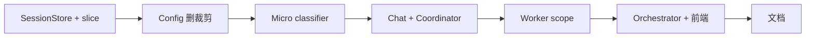

# 会话对话历史注入（协调者 / Worker 分窗 + 全量按需）— 实现计划

> **For agentic workers:** REQUIRED SUB-SKILL: Use superpowers:subagent-driven-development (recommended) or superpowers:executing-plans to implement this plan task-by-task. Steps use checkbox (`- [ ]`) syntax for tracking.

**Goal:** 协调者 analyze 6 轮、synthesize 1 轮；Worker 默认 10 轮；用户明确要求查全量上下文时经 `history_scope` 微分类后 Worker 用全量；`gate_intent` 与 `history_scope` 共用 `micro_classifier`；删除旧 M1 裁剪。

**Architecture:** `load_chat_history` 全量读盘；`slice_chat_rounds` 按轮切窗；`micro_classifier.classify(task, ...)` 统一 gate + history_scope；`delegate` 时选择 Worker 的 `chat_history` 与 `chat_history_scope`。

**Tech Stack:** Python 3 / FastAPI / LangGraph / pytest / 前端 `contextUsage`

**设计 SSOT:** [../specs/2026-06-02-coordinator-full-chat-history-design.md](../specs/2026-06-02-coordinator-full-chat-history-design.md) **v0.4**

---

## 建议 PR 顺序



| Task | 说明 |
|------|------|
| H0 | `load_chat_history` + `slice_chat_rounds` |
| H1 | 删 M1 条数裁、200K 默认 |
| H2 | **`micro_classifier`** + `history_scope` + 迁移 `gate_intent` |
| H3 | chat + 协调者 6/1 轮 |
| H4 | Worker 10 轮 / 全量按需 |
| H5 | `over_limit`、前端 |
| H6 | 架构文档 |

---

## Task H0: `slice_chat_rounds` + `load_chat_history`

**Files:**
- Modify: `backend/career_os/platform/store/session.py`
- Create: `backend/tests/store/test_chat_history_slice.py`

**Spec refs:** spec §1、§2.1

- [ ] **Step 1: 写失败单测** — `test_slice_one_round_*`、`test_slice_six_rounds_from_tail`、`test_slice_ten_rounds`（10 轮用 12 个 user 段会话断言起点）

- [ ] **Step 2: 实现 `slice_chat_rounds` + `load_chat_history`**（`messages_meta` 含 `over_limit`，无 `trimmed`）

- [ ] **Step 3:** `pytest tests/store/test_chat_history_slice.py -v`

- [ ] **Step 4: Commit** — `feat(store): load_chat_history 与 slice_chat_rounds`

---

## Task H1: 删除旧 M1 裁剪与配置

**Files:**
- Modify: `backend/career_os/config.py`
- Modify: `backend/career_os/platform/store/session.py`
- Modify: `backend/career_os/api/chat.py`、`backend/career_os/api/sessions.py`
- Modify: `backend/tests/store/test_session.py`、`backend/tests/eval/test_l1_suite.py`

**Spec refs:** spec §2.2、§八

- [ ] **Step 1: config** — 删除 `chat_history_max_messages`；`chat_history_max_tokens=200_000`；新增：

```python
coordinator_analyze_max_rounds: int = 6
coordinator_synthesize_max_rounds: int = 1
worker_default_max_rounds: int = 10
history_scope_llm_accept_threshold: float = 0.75  # env: HISTORY_SCOPE_LLM_ACCEPT_THRESHOLD
```

- [ ] **Step 2:** 删除 `_trim_*`、`load_messages_for_coordinator` → 全局 `load_chat_history`

- [ ] **Step 3:** 改写/删除 trim 相关测试

- [ ] **Step 4:** `rg` 无 `CHAT_HISTORY_MAX_MESSAGES|_trim_by_|trimmed` 残留（H5 前允许 orchestrator/前端）

- [ ] **Step 5: Commit** — `refactor(store): 移除 M1 条数裁剪`

---

## Task H2: `micro_classifier` + `history_scope` + 迁移 gate

**Files:**
- Create: `backend/career_os/harness/micro_classifier.py`
- Create: `backend/career_os/harness/micro_classifier_rules.py`
- Create: `backend/career_os/platform/prompt/micro_classifier/gate_intent/system.md`（自 `gate_intent/system.md` 迁移）
- Create: `backend/career_os/platform/prompt/micro_classifier/history_scope/system.md`
- Modify: `backend/career_os/platform/prompt/loader.py`（`load_micro_classifier_prompt(task)`）
- Modify: `backend/career_os/harness/gate.py`（`match_gate_intent` → `micro_classifier`）
- Modify or Delete: `backend/career_os/harness/gate_llm.py`（薄 re-export 或删除）
- Create: `backend/tests/harness/test_micro_classifier_history_scope.py`
- Modify: `backend/tests/harness/test_gate_llm.py`（改 import / payload 断言）

**Spec refs:** spec §4

- [ ] **Step 1: 写失败单测 — history_scope 规则**

```python
# tests/harness/test_micro_classifier_history_scope.py
from career_os.harness.micro_classifier import classify
from career_os.harness.micro_classifier_rules import match_history_scope_rules

def test_rule_full_history_phrases():
    r = match_history_scope_rules("请根据我们完整对话里贴的 JD 分析")
    assert r["needs_full_history"] is True
    assert r["source"] == "rule"

def test_rule_default_continue_false():
    r = match_history_scope_rules("好的，继续")
    assert r is None  # 交 LLM 或默认 false

def test_classify_history_scope_mock_llm(monkeypatch):
    monkeypatch.setattr("career_os.harness.micro_classifier.llm_enabled", lambda: True)
    monkeypatch.setattr(
        "career_os.harness.micro_classifier.invoke_json",
        lambda _s, _u, **kw: {"needs_full_history": True, "confidence": 0.9},
    )
    out = classify("history_scope", "回顾上文我说的岗位要求", {})
    assert out["needs_full_history"] is True
    assert out["source"] == "llm"
```

- [ ] **Step 2: 实现 `micro_classifier_rules`**

- `match_gate_intent_rules` 可迁入或继续由 `gate_rules.py` 提供，经 `classify("gate_intent")` 调用
- `match_history_scope_rules(message) -> dict | None`

- [ ] **Step 3: 实现 `classify(task, user_message, context)`**

```python
TASKS = frozenset({"gate_intent", "history_scope"})

def classify(task: str, user_message: str, context: dict[str, Any] | None = None) -> dict[str, Any]:
    context = context or {}
    if task == "gate_intent":
        rule = match_gate_intent_rules(user_message, context.get("pending_gate"))
        ...
    elif task == "history_scope":
        rule = match_history_scope_rules(user_message)
        if rule:
            return rule
        return _classify_history_scope_llm(user_message)
    raise ValueError(task)
```

- [ ] **Step 4: Prompt `history_scope/system.md`**

输出 schema：`needs_full_history`, `confidence`, `reason`；仅看当前 `user_message`。

- [ ] **Step 5: 迁移 gate** — `classify_gate_intent_llm` 改为：

```python
def classify_gate_intent_llm(user_message, pending_gate, **kwargs):
    return classify(
        "gate_intent",
        user_message,
        {"pending_gate": pending_gate},
    )
```

删除 `build_recent_turns`、payload 中的 `recent_turns` / `session_hints`。

- [ ] **Step 6: `pytest tests/harness/test_gate_llm.py tests/harness/test_gate_rules.py tests/harness/test_micro_classifier_history_scope.py -q`**

- [ ] **Step 7: Commit** — `feat(harness): micro_classifier 统一 gate_intent 与 history_scope`

---

## Task H3: Chat API + 协调者 6/1 轮

**Files:**
- Modify: `backend/career_os/api/chat.py`
- Modify: `backend/career_os/agents/graphs/coordinator.py`
- Modify: `backend/career_os/agents/lc/coordinator_llm.py`
- Modify: `backend/career_os/platform/prompt/coordinator/system.md`
- Create: `backend/tests/agents/test_coordinator_chat_history.py`

**Spec refs:** spec §3

- [ ] **Step 1: 单测** — analyze 窗 6 轮、synthesize 窗 1 轮（`slice_chat_rounds` + payload 断言）

- [ ] **Step 2: `chat.py`** — append user → `load_chat_history` → `run_coordinator_turn(chat_history=..., messages_meta=...)`

- [ ] **Step 3: `coordinator.py`**

```python
from career_os.config import settings
from career_os.platform.store.session import slice_chat_rounds

# analyze
h_analyze = slice_chat_rounds(
    state["chat_history"],
    max_rounds=settings.coordinator_analyze_max_rounds,
)
# synthesize
h_syn = slice_chat_rounds(
    state["chat_history"],
    max_rounds=settings.coordinator_synthesize_max_rounds,
)
```

- [ ] **Step 4: `coordinator_llm`** — `analyze_workers(..., chat_history=, messages_meta=)`；`build_synthesis_messages` 同理

- [ ] **Step 5: coordinator prompt v2.6** — 6/1 轮说明；不含 Worker 全量

- [ ] **Step 6: `delegate` 暂传 `chat_history_full` 在 state**（H4 再切 Worker 窗）：

```python
state["chat_history"]  # 全量列表，供 H4 select_worker_history 使用
```

- [ ] **Step 7: pytest + commit** — `feat(coordinator): analyze 6 轮 synthesize 1 轮`

---

## Task H4: Worker 10 轮 + `history_scope` 全量

**Files:**
- Create: `backend/career_os/harness/chat_history_scope.py`（或放在 `micro_classifier` 旁）
- Modify: `backend/career_os/agents/graphs/coordinator.py`（`delegate` 节点）
- Modify: `backend/career_os/agents/graphs/workers/react_runner.py`
- Modify: `backend/career_os/platform/prompt/` worker `react_boot_user` 模板
- Create: `backend/tests/agents/test_worker_chat_history_scope.py`
- Create: `backend/tests/harness/test_select_worker_chat_history.py`

**Spec refs:** spec §4.6、§5

- [ ] **Step 1: 实现 `select_worker_chat_history`**

```python
def select_worker_chat_history(
    chat_history_full: list[dict[str, str]],
    user_message: str,
    messages_meta: dict[str, Any],
) -> tuple[list[dict[str, str]], str]:
    from career_os.config import settings
    from career_os.harness.micro_classifier import classify
    from career_os.platform.store.session import slice_chat_rounds

    decision = classify("history_scope", user_message, {})
    threshold = settings.history_scope_llm_accept_threshold
    full = bool(
        decision.get("needs_full_history")
        and (decision.get("confidence") or 0) >= threshold
    )
    if full:
        return list(chat_history_full), "full"
    window = slice_chat_rounds(
        chat_history_full,
        max_rounds=settings.worker_default_max_rounds,
    )
    return window, "recent_10"
```

- [ ] **Step 2: 单测**

```python
def test_worker_default_ten_rounds_not_full_disk():
    # 20 轮消息 + classify history_scope false → len(window) < len(full)

def test_worker_full_when_rule_matches():
    # 「完整对话」→ scope full, len == len(full)
```

- [ ] **Step 3: `delegate` 节点**

```python
worker_history, scope_label = select_worker_chat_history(
    state["chat_history"],
    state["user_message"],
    state.get("messages_meta") or {},
)
merged_context = {
    **(result.get("context") or {}),
    "chat_history": worker_history,
    "chat_history_scope": scope_label,
    "messages_meta": state.get("messages_meta") or {},
}
```

- [ ] **Step 4: `react_runner._format_boot_user`** — 写入 `chat_history`、`chat_history_scope`、`messages_meta`

- [ ] **Step 5: Worker prompt** — 说明 `recent_10` vs `full`

- [ ] **Step 6: trace（可选）** — `delegate` detail 增加 `chat_history_scope`、`chat_history_count`

- [ ] **Step 7: pytest + commit** — `feat(worker): 默认 10 轮历史，history_scope 时全量`

---

## Task H5: Orchestrator + 前端

**Files:**
- Modify: `backend/career_os/harness/orchestrator.py`
- Modify: `backend/tests/harness/test_orchestrator.py`
- Modify: `web/src/lib/contextUsage.ts`、`web/src/components/ContextUsageIndicator.tsx`、`web/src/pages/ChatPage.tsx`

**Spec refs:** spec §6

- [ ] **Step 1:** `recommend_new_session` ← `over_limit or usage_ratio >= warn`

- [ ] **Step 2:** 前端用 `over_limit` 替代 `trimmed`

- [ ] **Step 3: Commit** — `feat(ui): context_usage over_limit`

---

## Task H6: 架构文档与回归

**Files:**
- Modify: `docs/architecture/10-会话闸门与state.md` §1.5
- Modify: `docs/architecture/04-应用运行时与部署.md`
- Modify: `docs/architecture/01-协调者与Worker.md`（Worker 上下文一句）
- Modify: `docs/superpowers/specs/2026-06-01-gate-intent-llm-fallback-design.md` 附录：gate LLM 实现迁 `micro_classifier`（一行指针即可）

- [ ] **Step 1:** 文档更新

- [ ] **Step 2:** `cd backend && pytest -q`

- [ ] **Step 3: Commit** — `docs(architecture): 对话历史分窗与 micro_classifier`

---

## Spec 覆盖自检（v0.4）

| Spec | Task |
|------|------|
| 删 M1 / 200K | H1 |
| 协调者 6 / 1 轮 | H3 |
| Worker 10 轮默认 | H4 |
| history_scope 全量 | H2 + H4 |
| micro_classifier = gate + history | H2 |
| gate 无 recent_turns | H2 |
| over_limit 提示 | H5 |
| pipeline 状态机 | — |

---

## 执行方式

计划路径：`docs/superpowers/plans/2026-06-02-coordinator-full-chat-history.md`

1. **Subagent-Driven** — 每 Task 子 agent + review  
2. **Inline** — 本会话 H0→H6 连续实现  

选定后开始 **H0**。
