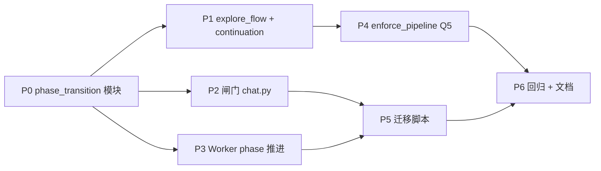

# Pipeline `current_phase` 与初探流状态机 — 实现计划

> **For agentic workers:** REQUIRED SUB-SKILL: Use superpowers:subagent-driven-development (recommended) or superpowers:executing-plans to implement this plan task-by-task. Steps use checkbox (`- [ ]`) syntax for tracking.

**Goal:** 对齐 `meta.current_phase`、`explore_gate_confirmed`、`explore_closure` 与协调者路由；消除「已解禁/已有 JD 产物仍走初探兜底」；Worker **segment_complete** 与闸门 **显式** 推进 phase；**禁止** 运行期 reconcile；**一次性迁移** 存量 pipeline 数据。

**Architecture:** 路径光标 SSOT = `TaskStore.get_list_meta().current_phase`；`explore_flow_active` / `explore_continuation_analyze` 服从 spec §4.2、§5.4；phase 写入集中在 `pipeline_phase_transition`（新建）+ `api/chat.py` 闸门 + `coordinator` delegate 收尾；`enforce_pipeline_phase_rules` 过滤仅用磁盘 phase（Q5）。

**Tech Stack:** Python 3.11+ / FastAPI / LangGraph / pytest

**设计 SSOT:** [../specs/2026-06-02-pipeline-phase-explore-state-design.md](../specs/2026-06-02-pipeline-phase-explore-state-design.md) **v0.2.0**

**前置:** [coordinator-full-chat-history plan](./2026-06-02-coordinator-full-chat-history.md) 已落地；[task-system-pipeline-upgrade](./2026-06-01-task-system-pipeline-upgrade.md) 基线存在。

**非目标:** chat history 分窗；explore 6+2+1 深度轨道本体；前端 TaskProgress 大改（仅消费更准确的 `session_activity`）。

---

## 已锁定决策（摘自 spec §0、§七）

| ID | 决策 |
|----|------|
| Q1 | `explore_complete` → **`set_current_phase(market)`** |
| Q2 | `explore_repeat` reject → `closure.completed` + `profile.completed_at` + phase 按 prior 表推进 |
| Q3 | `explore_gate_confirmed` ⇒ **`explore_flow_active=false`** |
| Q4 | 仅显式事件写 phase；**禁止** chat 入口 reconcile |
| Q5 | `filter_workers_for_pipeline` **恒用** `get_current_phase()` |
| Q6 | **一次性迁移**；不保留旧语义兼容 |

---

## 建议 PR / Task 顺序



| Task | 说明 | 可并行 |
|------|------|--------|
| **P0** | `pipeline_phase_transition.py` + 单测 | — |
| **P1** | `explore_flow_active` + `explore_continuation_analyze` | 与 P2 并行（P0 后） |
| **P2** | `chat.py` 闸门：`explore_complete` / `explore_repeat` reject | 与 P1 并行 |
| **P3** | coordinator delegate：`market`/`opportunity` → phase | P0 后 |
| **P4** | `enforce_pipeline_phase_rules` Q5 | P1 后 |
| **P5** | 迁移 CLI + demo 数据 | P2+P3 后 |
| **P6** | 全量 pytest + 架构 doc 增量 | 最后 |

---

## 文件结构（本计划 touch 范围）

| 文件 | 职责 |
|------|------|
| `backend/career_os/harness/pipeline_phase_transition.py` | **新建** — `set_phase_after_explore_complete`、`set_phase_after_repeat_decline`、`set_phase_after_worker_complete` |
| `backend/career_os/harness/explore_closure.py` | `explore_continuation_analyze` 前置守卫 |
| `backend/career_os/harness/session_activity.py` | `explore_flow_active` v0.2 |
| `backend/career_os/api/chat.py` | 闸门副作用：phase + closure + profile |
| `backend/career_os/agents/graphs/coordinator.py` | delegate 收尾调用 phase transition |
| `backend/career_os/harness/pipeline_routing.py` | `enforce_pipeline_phase_rules` Q5 |
| `backend/scripts/migrate_pipeline_phase.py` | **新建** — Q6 一次性迁移（`--dry-run` / `--apply`） |
| `backend/tests/harness/test_pipeline_phase_transition.py` | **新建** |
| `backend/tests/harness/test_explore_flow_active.py` | **新建** |
| `backend/tests/harness/test_explore_continuation_guards.py` | **新建** |
| `backend/tests/api/test_explore_gate_phase.py` | **新建** — chat 闸门集成 |
| `backend/tests/agents/test_coordinator_phase_synthesis.py` | **新建** — 初探兜底回归 |
| Modify | `backend/tests/api/test_rest.py`、`test_coordinator_c3.py` 等既有用例 |
| `docs/architecture/10-会话闸门与state.md` | phase / closure 字段增量 |
| `docs/superpowers/specs/2026-06-02-pipeline-phase-explore-state-design.md` | 链到本 plan |

---

## Task P0: `pipeline_phase_transition` 模块

**Files:**
- Create: `backend/career_os/harness/pipeline_phase_transition.py`
- Create: `backend/tests/harness/test_pipeline_phase_transition.py`

**Spec refs:** spec §5.1、§5.2

- [ ] **Step 1: 写失败单测 — repeat reject 推进规则**

```python
# test_infer_phase_after_repeat_decline
# prior {} -> market
# prior {market: segment_complete} -> market
# prior {market, opportunity: segment_complete} -> jd_analysis
```

- [ ] **Step 2: 写失败单测 — worker complete**

```python
# market segment_complete -> market
# opportunity segment_complete -> jd_analysis
# identity segment_complete -> None (no phase change)
```

- [ ] **Step 3: 实现**

```python
def worker_result_is_segment_complete(structured: dict) -> bool: ...
def infer_phase_after_repeat_decline(prior_results: dict) -> str: ...
def apply_current_phase(list_id: str, phase: str) -> None: ...  # TaskStore.set_current_phase + 错误处理

def on_explore_complete_confirmed(list_id: str) -> str:  # -> "market"
def on_explore_repeat_declined(list_id: str, prior_results: dict) -> str: ...
def on_worker_segment_complete(list_id: str, worker_id: str, structured: dict) -> str | None: ...
```

- [ ] **Step 4:** `pytest backend/tests/harness/test_pipeline_phase_transition.py -v`

- [ ] **Step 5: Commit** — `feat(harness): pipeline phase 显式推进辅助模块`

---

## Task P1: `explore_flow_active` + `explore_continuation_analyze`

**Files:**
- Modify: `backend/career_os/harness/session_activity.py`
- Modify: `backend/career_os/harness/explore_closure.py`
- Create: `backend/tests/harness/test_explore_flow_active.py`
- Create: `backend/tests/harness/test_explore_continuation_guards.py`

**Spec refs:** spec §4.2、§5.4

- [ ] **Step 1: 单测 fixture** — `explore_gate_confirmed=true` + `closure worker_done false` → `explore_flow_active is False`

- [ ] **Step 2: 单测** — `explore_repeat_declined=true` → `explore_continuation_analyze` 返回 `None`

- [ ] **Step 3: 单测** — `explore_closure.completed=true` → continuation `None`

- [ ] **Step 4: 实现 `explore_flow_active`**（spec §4.2 伪代码原样落地）

- [ ] **Step 5: 实现 `explore_continuation_analyze` 顶部守卫**（gate confirmed / repeat declined / closure.completed）

- [ ] **Step 6:** `pytest tests/harness/test_explore_flow_active.py tests/harness/test_explore_continuation_guards.py -v`

- [ ] **Step 7: Commit** — `fix(harness): 初探流 active/continuation 与 gate 对齐`

---

## Task P2: 闸门路径写 phase + closure + profile

**Files:**
- Modify: `backend/career_os/api/chat.py`（`_apply_pending_gate`）
- Create: `backend/tests/api/test_explore_gate_phase.py`

**Spec refs:** spec §5.1、Q1、Q2

- [ ] **Step 1: 单测 — `explore_complete` confirm**

  - 断言 `meta.current_phase == "market"`
  - 断言 `explore_closure.completed is True`（已有，回归）

- [ ] **Step 2: 单测 — `explore_repeat` reject + intake submitted**

  - 断言 `explore_gate_confirmed`、`closure.completed`、`profile.exploration.completed_at` 存在
  - 断言 phase 按 prior：`market+opportunity` → `jd_analysis`

- [ ] **Step 3: 实现 `explore_complete` 分支**

  - 在现有 profile patch / clear works **之后** 调用 `on_explore_complete_confirmed(list_id)`

- [ ] **Step 4: 实现 `explore_repeat` reject 分支**

  - 替换「仅 `set_explore_gate_confirmed`」为：closure.completed + profile.completed_at（与 complete 同路径复用小函数）+ `on_explore_repeat_declined`

- [ ] **Step 5:** `pytest tests/api/test_explore_gate_phase.py -v`

- [ ] **Step 6: Commit** — `feat(chat): explore 闸门确认同步推进 current_phase`

---

## Task P3: Worker `segment_complete` → `set_current_phase`

**Files:**
- Modify: `backend/career_os/agents/graphs/coordinator.py`（`delegate` 节点，`mark_worker_done` 之后）
- Modify: `backend/tests/agents/test_coordinator_explore_phase.py` 或新建 phase 测试

**Spec refs:** spec §5.2、Q4

- [ ] **Step 1: 单测** — mock `market` worker 返回 `phase_status=segment_complete` → 调用后 `get_list_meta().current_phase == "market"`

- [ ] **Step 2: 单测** — `opportunity` segment_complete → `jd_analysis`

- [ ] **Step 3: 在 delegate 收尾插入**

```python
# coordinator.py after mark_worker_done, when status==completed:
phase = on_worker_segment_complete(list_id, worker_id, structured)
if phase:
    session_state["pipeline_phase"] = phase  # 可选：当轮 trace 一致
```

- [ ] **Step 4: 确认 `strategy` 路径** — 若当前无 segment_complete，文档记录 follow-up；本期至少 market/opportunity

- [ ] **Step 5:** `pytest tests/agents/ -k phase -v`（或 targeted files）

- [ ] **Step 6: Commit** — `feat(coordinator): Worker 完成显式推进 pipeline phase`

---

## Task P4: `enforce_pipeline_phase_rules`（Q5）

**Files:**
- Modify: `backend/career_os/harness/pipeline_routing.py`
- Modify: `backend/tests/harness/test_pipeline_routing.py`（若无则新建）

**Spec refs:** spec §5.3、P5 根因

- [ ] **Step 1: 单测** — LLM 返回 `workers=["market"]`、`current_phase=explore`、`explore_gate_confirmed=true` → 过滤后 **保留** `market`（或按 JD chain 规则），且 **不因 infer  alone 改 filter phase**

- [ ] **Step 2: 单测** — `current_phase=jd_analysis`、workers=`["identity"]` → 过滤为空（explore worker 不在 jd phase）

- [ ] **Step 3: 重构 `enforce_pipeline_phase_rules`**

  - `filter_phase = get_current_phase(session_state) or "explore"` **唯一** 传入 `filter_workers_for_pipeline`
  - `pipeline_phase` 输出仍可 `infer_pipeline_phase_from_workers` 供 LLM，但与 filter 解耦
  - 删除/注释「`phase` 用 inferred 而 filter 用 current」的双轨歧义

- [ ] **Step 4:** `pytest tests/harness/test_pipeline_routing.py -v`

- [ ] **Step 5: Commit** — `fix(harness): pipeline 过滤仅依磁盘 current_phase`

---

## Task P5: 一次性迁移（Q6）

**Files:**
- Create: `backend/scripts/migrate_pipeline_phase.py`
- Create: `backend/tests/scripts/test_migrate_pipeline_phase.py`（或 `tests/harness/test_migrate_pipeline_phase.py`）
- Modify: `backend/data/demo/**`（若仓库含 demo 快照，apply 后提交）

**Spec refs:** spec §5.5

- [ ] **Step 1: 实现推导函数**（与 P0 共用 `infer_phase_after_repeat_decline` + worker prior 扫描）

  - 输入：`meta.json` + `state.json`（经 `list_id` / `session_id` 关联）
  - 输出：`target_phase`、`explore_closure.completed`、`explore_gate_confirmed` 补丁

- [ ] **Step 2: CLI**

```bash
python backend/scripts/migrate_pipeline_phase.py --dry-run
python backend/scripts/migrate_pipeline_phase.py --apply
```

  - 扫描 `data/tasks/**/meta.json` 中 `list_type=pipeline`
  - `--dry-run` 打印 diff；`--apply` 写盘

- [ ] **Step 3: 单测** — 用临时目录 fixture 模拟 Demo 矛盾快照 → apply 后 phase=`jd_analysis`、closure.completed=true

- [ ] **Step 4: 对仓库 demo 数据执行 `--apply`**（若存在）

- [ ] **Step 5: Commit** — `chore(scripts): pipeline phase 存量一次性迁移`

---

## Task P6: 协调者 synthesize 回归 + 全量 pytest + 文档

**Files:**
- Create: `backend/tests/agents/test_coordinator_phase_synthesis.py`
- Modify: `docs/architecture/10-会话闸门与state.md`
- Modify: `docs/superpowers/specs/2026-06-02-pipeline-phase-explore-state-design.md`（实现计划链接）

**Spec refs:** spec §八

- [ ] **Step 1: synthesize 回归单测**

  - Fixture：`explore_gate_confirmed` + `explore_repeat_declined` + `current_phase=jd_analysis`（迁移后态）+ `prior_results` 含 market/opportunity
  - `delegate_count=0` → 文本 **不包含** `explore_continue_synthesis_draft` 固定句首

- [ ] **Step 2: 更新 `test_rest.py` / `test_coordinator_c3.py`** 中断言 `current_phase` 的用例

- [ ] **Step 3:** `cd backend && pytest -q` 全绿

- [ ] **Step 4: 架构 doc** — `state.json` 增加「phase 仅显式事件写入」；`explore_flow_active` 条件列表

- [ ] **Step 5: spec 文档** — 实现计划 URL、`状态 → 已实现（plan 已建）`

- [ ] **Step 6: Commit** — `test(coordinator): phase 状态机回归` + `docs: pipeline phase 状态说明`

---

## 验收清单（与 spec §八 对齐）

| # | 检查项 |
|---|--------|
| 1 | Demo 类 fixture：「推进下一步」不走初探兜底 |
| 2 | `explore_continuation_analyze` 在 gate confirmed / repeat declined 时 `None` |
| 3 | `explore_complete` / `explore_repeat` reject 单测覆盖 phase + closure |
| 4 | `market`/`opportunity` segment_complete 后 meta phase 正确 |
| 5 | 全量 `pytest` 通过 |
| 6 | 迁移 `--dry-run` 无意外 diff；`--apply` 后 demo 可手工 chat 验证 |

---

## 手工验证（Demo）

1. 对迁移后的 demo session 发：「继续 JD / 推进下一步」。
2. 确认 SSE trace **无** `explore_continuation` → `identity`；`session_activity.headline` 反映 `jd_analysis` 或 `market`。
3. 确认回复 **非**「我们仍在进行职业初探…」兜底（除非 `current_phase=explore` 且 gate 未 confirmed）。

---

## 风险与回滚

| 风险 | 处理 |
|------|------|
| 迁移误判 phase | `--dry-run` 人工 spot-check；保留 git 快照 |
| 既有测试假设 phase 恒为 explore | P6 集中改断言 |
| `strategy` 无 segment_complete | 本期不拦；resume 仍走 `advance_current_phase` |

**回滚：**  revert 代码 commit；demo 数据从 git 恢复迁移前快照（**无** 运行期 reconcile 可依赖）。

---

*计划版本 0.1.0 — 2026-06-02，对应 spec v0.2.0*
