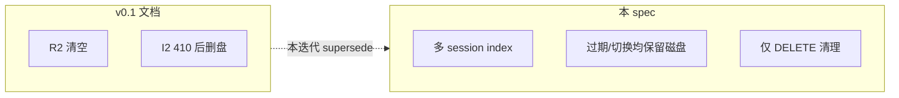
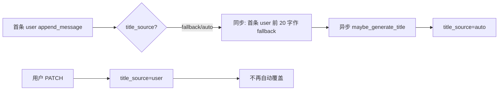
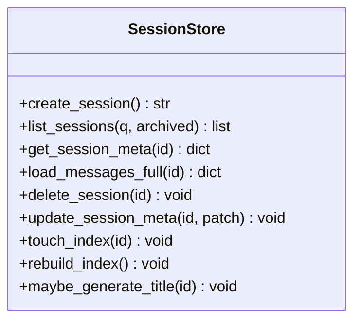
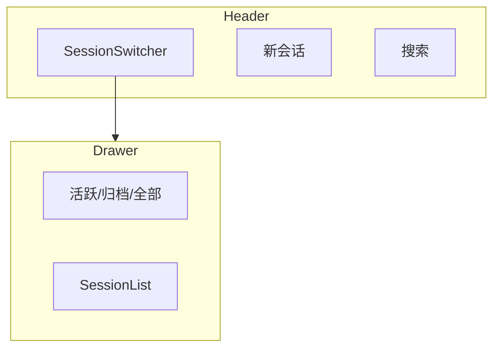
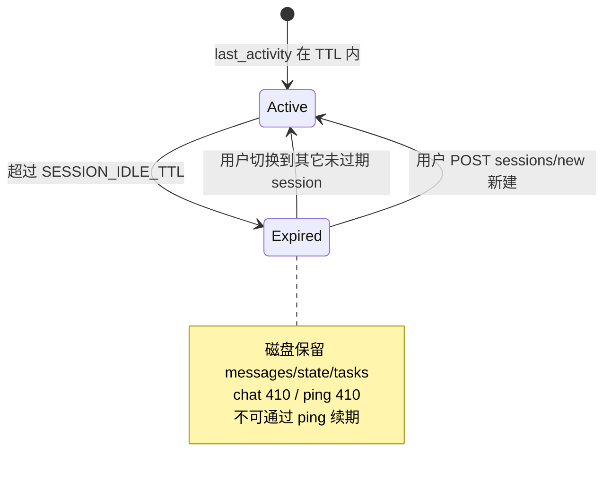

# 会话持久化与切换 — 设计规格

| 属性 | 内容 |
|------|------|
| 状态 | 已确认（方案 B + 全部保留 / 手动删除 + **单次交付**） |
| 版本 | **1.5** |
| 日期 | 2026-05-31 |
| 适用范围 | **多 session 能力**（相对 v0.1 的增量；**不修改** v0.1 架构/PRD 原文） |
| v0.1 基线 | [10-会话闸门与state.md](../../architecture/10-会话闸门与state.md)、[05-API与流式协议.md](../../architecture/05-API与流式协议.md)、[06-前端架构.md](../../architecture/06-前端架构.md)、[PRD 00](../../prd/00.%20职业规划%20Agent%20PRD.md) |

## 0. 文档关系（必读）

- **`docs/architecture/`、`docs/prd/` 保持 v0.1 版本**，其中 R2「刷新/new 清空」、I2「过期清理工作区」等表述 **不作修订**。
- **本 spec 是多 session 实现的唯一依据**；与 v0.1 冲突时 **以本 spec 为准**。
- v0.1 文档仍可用于：Worker 契约、闸门、任务状态机、Profile 落档等 **与会话列表无关** 的行为。
- 实现完成后 **不必** 回写 architecture/PRD；若将来发 v0.2 再统一合稿。

## 1. 背景与问题

### 1.1 现状（代码 + v0.1 文档）

- 后端 **已在磁盘** 持久化：`data/sessions/{session_id}/messages.json`、`state.json`。
- v0.1 文档约定 **R2**：`POST /v1/sessions/new` / 刷新 → 清空 session 工作区与绑定 tasks。
- **实际代码**：`POST /v1/sessions/new` 仅 `create_session()`，**不删** 旧目录；与 v0.1 文档不一致，但与 **本 spec** 一致。
- 前端仅 `localStorage.session_id` 绑定 **一个** 活跃会话；**无** 列表、切换、刷新恢复 messages。
- 用户感知为「会话不保存」——实为 **缺少 `_index.json`、列表 API 与切换 UI**。

### 1.2 目标

1. 用户可在页面上 **查看历史会话列表**。
2. 用户可 **继续** 任一历史会话，或 **新建** 会话（**不删除** 其它会话）。
3. 用户可 **手动删除** 不需要的会话。
4. `profile.json`、`output/` 仍 **全局共享**；`state.json`、绑定 tasks、`prior_results` 仍 **按 session 隔离**。

### 1.3 非目标

- 多用户 / 登录 / 云端同步
- 自动过期 **清理**（**全部保留**，用户手动 `DELETE`；过期仅 **只读**）
- 跨 session 合并对话
- 修改 v0.1 architecture/PRD 正文

### 1.4 相对 v0.1 的行为变更（实现对照表）

| 主题 | v0.1 文档 | 本 spec（实现依据） |
|------|-----------|---------------------|
| **R2 换会话** | `new` / 刷新 → 清空 `messages`/`state` + 绑定 tasks | **多 session 并存**；`new` **仅创建**；刷新 **复用** `localStorage.session_id` + `GET messages` |
| **I2 过期** | 410 后 **清理工作区**（同 R2 删盘） | 410 **仅禁 chat**；磁盘 **保留**；列表 badge + 只读浏览；**不** 自动 `new` |
| **`ping`** | v0.1 写过期 410 且「已清理工作区」 | 未过期：`204` 刷新 `last_activity_at`；**已过期：`410`，不刷新戳、不续期** |
| **删 session** | 隐式（R2/I2 触发） | **显式** `DELETE /v1/sessions/{id}`；删目录 + index 项 + 绑定 tasks |
| **任务绑定** | `new`/换会话删该 session 全部 list | **仅 DELETE** 删 list；`meta.session_id` 不变 |
| **`GET /v1/tasks`** | 读全局 `_active.json` | **`?session_id=` 必带**（切换 session 时）；无 query 时兼容读 `_active` |
| **`prior_results`** | v0.1 写「换会话清空」 | **按 session** 读对应 `state.json`；切换 session 加载各自 state |
| **单 active list** | v0.1 全局至多一个 `active`（A02） | **沿用**；跨 session 互斥——Session A 有 `active` 时，Session B 不能 `start_task_list` 直到 A 完成/放弃 |
| **完成态 UI** | A02 扫 `data/tasks/**` 全局 | 前端 **按当前 `session_id`** 调 `GET /v1/tasks?session_id=`，**不** 用全局扫描判定 |
| **M1-R** | v0.1：`trimmed` 或 `usage_ratio` 触发推荐 | **沿用当前代码**：仅 `usage_ratio≥0.95` 推荐新会话；`trimmed` 单独轻提示（见 §12） |
| **410 前端** | v0.1 引导 `sessions/new` | **ExpiredSessionBanner** + 禁用输入；用户选 **切换** 或 **新建**；**禁止** 自动 `POST new` |



### 1.5 边界条件（已约定）

#### 1.5.1 与 profile / 初探表单（全局）— **D2 已确认**

- **初探信息表**（`exploration.intake`）落在 **`profile.json`**，全局一次（v0.1 不变）。
- 各 session 的 **`explore_closure` / `prior_results` / gates** 在 **`state.json`**，按 session 隔离。

**再次初探（`explore_repeat` 闸门）**：当本 session 路由进入 **职业初探**（`list_type=explore` 或派 identity/capability），且全局 **`explore_intake_submitted()` 为 true** 时：

| 步骤 | 行为 |
|------|------|
| 1 | 协调者 **先对话询问**（附录 B 风格）：「您已完成初探，是否需要再次进行？」写 `gates.pending`，`gate_name=explore_repeat` |
| 2 | 用户 **否** | 不弹表、不派 explore Worker；按用户意图闲聊或其它流程 |
| 3 | 用户 **是** | 触发 **`ExploreIntakeForm`**（须 **再次提交** 表单）；`submit` 后本 session 才进入 explore 派工链 |
| 4 | 全局 intake **未** 提交 | 维持 v0.1：直接走填表闸门 + explore（不询问重复） |

- `state.json` 可选记 `flags.explore_repeat_accepted` / `explore_repeat_declined`（仅本 session）。
- **不** 修改 v0.1 PRD 表单字段；重复填表仍写 `profile.json`（覆盖/合并 intake，与现 `submit_explore_intake` 一致）。

#### 1.5.2 `last_activity_at` 与 I2

| 动作 | 是否刷新 `last_activity_at` |
|------|----------------------------|
| `POST /v1/chat` 通过过期校验后，**写入 user 消息**（`append_message`） | **是** |
| `begin_chat` 仅校验、未写入消息 | **否** |
| `GET messages` / `GET context` / 只读浏览 | **否**（**打开过期 session 不会续期**） |
| `POST ping` 未过期 | **是** |
| `POST ping` 已过期 | **否**（410） |

#### 1.5.3 隐式创建 session（`POST /v1/chat` 无 `session_id`）

- 行为：`create_session()` 生成新 ID（与 `POST new` 相同落盘）。
- **必须** 同步 `touch_index(session_id)`，与 `POST new` 一致；**禁止** 出现「磁盘有目录、index 无条目」。
- index 初始（`POST new` 或隐式 create）：`title="未命名会话"`（**D6**）、`title_source=fallback`、`preview=""`、`message_count=0`。

#### 1.5.4 index 字段计算

| 字段 | 规则 |
|------|------|
| `preview` | 自 **后向前** 找最后一条 `role=user` 的 `content` 前 **40** 字；无 user 消息则 `""` |
| `message_count` | `messages.json` 内 **全部** 条数（user + assistant） |
| `list_type` | `state.json.list_type`；无则 `null`（**不**读 task `meta`，以 session state 为准） |
| `activity_headline` | `build_session_activity(state).headline`；列表 API 与 `GET sessions/{id}` 复用 |
| `expired` | 每次 list/touch 时按 `SESSION_IDLE_TTL` 计算，**不落盘** |

**auto title（D7）**：在 **`append_message` 写入首条 `role=user` 之后**（且 `title_source != user`），**异步**调用 `maybe_generate_title`；**不**等待 ≥4 条。LLM 成功 → `title_source=auto`；失败保留 fallback（首条 user 前 20 字或「未命名会话」）。

#### 1.5.5 index 一致性（双向）

| 方向 | 处理 |
|------|------|
| 有目录无 index | `GET /v1/sessions` → `rebuild_index()` |
| 有 index 无目录 | `rebuild_index()` **丢弃** 孤儿条目；list API **不** 返回 |
| 手动删目录 | 下次 rebuild 清理 index |

#### 1.5.6 `session_id` 校验

- 路径参数须匹配 `^sess_[0-9a-f]{32}$`；否则 **400** `invalid_session_id`（防路径穿越）。

#### 1.5.7 端点职责划分

| 端点 | 职责 |
|------|------|
| `GET /v1/sessions/{id}` | **index 元数据** + `activity_headline` + `expired`；**不含** messages、**不含** M1 `context_usage` |
| `GET /v1/sessions/{id}/context` | **M1** `context_usage` + `session_activity`（协调者窗口）；v0.1 已有 |
| `GET /v1/sessions/{id}/messages` | **全量** messages + 同上 `context_usage` / `session_activity` / `expired`（刷新恢复用） |

`context_usage` 计算与 v0.1 一致：`orchestrator.context_usage_payload(messages_meta)`。

#### 1.5.8 A1 单飞与多 Tab

- **同一 `session_id`** 并发 `POST /v1/chat` → **409** `chat_in_progress`（v0.1 不变）。
- **不同 session** 可并行 chat（各自 A1 锁互不影响）。
- **DELETE**：仅当 **被删 session** 存在 in-flight chat 时 **409**；删 **其它** session **不** 409。

#### 1.5.9 全局单 active list（Harness）

- 沿用 v0.1：**全局** 至多一个 `meta.status=active` 的 list（`_active.json`）。
- Session B 在 Session A 仍有 active list 时调用 `start_task_list` → **409**：

```json
{
  "code": "active_list_elsewhere",
  "message": "其它会话仍有进行中的任务列表，请先完成或放弃",
  "session_id": "sess_…",
  "list_id": "list_…"
}
```

- 前端：toast 并引导用户 **切换到该 session** 或对话中放弃任务。

#### 1.5.10 `POST .../generate-title`

- Query：`?force=true`（可选）；默认 `force=false`。
- `title_source=user` 且 `force=false` → **409** `title_locked`。

#### 1.5.11 TaskProgress（**D3 已确认**）

- 数据源：`GET /v1/tasks?session_id=`（切换 session 时必调）。
- 展示优先级：**`active` list** → 若无则 **`ready` list**（若多条 ready，取 **`created_at` 最新** 一条）→ 若无则 **不渲染**（空）。
- 展示内容：该 list 的 `tasks[]`（milestone/work 标题 + 状态）；**不**再用纯 `session_activity` 步骤条替代 task 文件（explore 进行中的 activity 可作为 subtitle，可选）。

#### 1.5.12 切换 session 与后台 SSE（**D4 已确认**）

- SSE 进行中 **允许** 切换 session；**不** `AbortController` 取消旧流。
- 旧 session 后端 Run **跑完并落盘**；用户切回时 `GET messages` 拉全量。
- 当前 Tab 只展示 **选中 session** 的 UI；旧 session 的流式 token **不** 写入当前 Tab 气泡。

### 1.6 产品决策（已确认）

| ID | 决策 |
|----|------|
| **D1** | **B** — 列表为空且无合法 `localStorage.session_id` 时 **不** `POST new`；首条 `POST /v1/chat`（无 `session_id`）隐式创建 + `touch_index` |
| **D2** | **自定义** — 全局已初探 → 先问是否再次初探；**是** → 再填表；**否** → 不 explore（见 §1.5.1） |
| **D3** | **自定义** — TaskProgress：`active` → `ready` → 空（见 §1.5.11） |
| **D4** | **C** — 允许切换；旧 session SSE 后台完成（见 §1.5.12） |
| **D5** | **A** — 归档仅隐藏列表，**未过期** 仍可 chat |
| **D6** | **C** — 无消息时 title **「未命名会话」** |
| **D7** | **自定义** — **首条 user 消息** 后即异步 LLM auto title（见 §1.5.4） |

## 2. 方案选型

采用 **方案 B：索引文件**。

| 项 | 说明 |
|----|------|
| 索引路径 | `data/sessions/_index.json` |
| 会话数据 | `{session_id}/messages.json` + `state.json` |
| 一致性 | 写 session 时 `touch_index`；提供 `rebuild_index()` 扫目录修复 |

## 3. 数据模型

### 3.1 索引文件 `_index.json`

```json
{
  "version": 1,
  "sessions": [
    {
      "session_id": "sess_a1b2…",
      "title": "职业初探 · Go 后端方向",
      "title_source": "auto",
      "preview": "帮我理清职业方向…",
      "created_at": "2026-05-31T08:00:00+00:00",
      "last_activity_at": "2026-05-31T10:30:00+00:00",
      "message_count": 24,
      "list_type": "explore",
      "expired": false,
      "archived": false
    }
  ]
}
```

| 字段 | 来源 | 说明 |
|------|------|------|
| `title` | 见 §3.4 | 列表主标题 |
| `title_source` | `"fallback"` \| `"auto"` \| `"user"` | 标题来源 |
| `preview` | 见 §1.5.4 | 列表副文案 |
| `message_count` | 见 §1.5.4 | 列表展示 |
| `list_type` | `state.json.list_type` | explore / jd / plan / null |
| `expired` | `last_activity_at` vs `SESSION_IDLE_TTL` | **仅展示**；不触发删盘 |
| `archived` | 用户 PATCH | 归档后默认列表隐藏 |

列表默认按 `last_activity_at` **降序**；归档项排在非归档项之后。

### 3.2 与现有 state 的关系

- **不** 把 index 字段冗余进 `state.json`（除已有 `last_activity_at`）。
- `touch_session_index(session_id)` 时机：
  - `create_session`（含 `POST new` 与 **`POST /v1/chat` 隐式创建**）
  - `append_message` / `update_state`（`list_type` 或 explore 相关字段变化）
  - `delete_session` / `PATCH` title|archived / 自动标题完成

### 3.3 保留策略

- **全部保留**，无数量/天数上限。
- **仅** `DELETE /v1/sessions/{id}`：删目录 + index 项 + 该 session 绑定 **全部** tasks（含 `ready` + `active`），并清理 `_active.json`（若指向其中任一 list）。
- **归档**（`archived=true`）不删数据，仅从默认列表隐藏。

### 3.4 标题策略（fallback → auto）



| 规则 | 说明 |
|------|------|
| 创建 | `title="未命名会话"`（**D6**）；`title_source=fallback` |
| 首条 user | index 更新 preview；title 可先改为首条 user 前 20 字；**随即异步 LLM**（**D7**） |
| 用户重命名 | `PATCH title` → `user`，永久优先 |

LLM 标题：首条 user 消息（不足 200 字则全文）→ ≤16 字中文，无引号。

## 4. API 设计

> v0.1 已有：`POST /v1/sessions/new`、`POST .../ping`、`GET .../context`、`POST /v1/chat`。下表 **新增或变更语义** 以本 spec 为准。

### 4.1 端点一览

| 方法 | 路径 | 说明 |
|------|------|------|
| `GET` | `/v1/sessions` | 会话列表；`?q=`、`?archived=` |
| `GET` | `/v1/sessions/{id}` | 元数据 + activity 摘要 |
| `GET` | `/v1/sessions/{id}/messages` | 全量 messages（刷新恢复） |
| `POST` | `/v1/sessions/new` | **仅创建**；**不删** 其它 session / tasks |
| `PATCH` | `/v1/sessions/{id}` | `title` / `archived` |
| `DELETE` | `/v1/sessions/{id}` | 删 session + 绑定 tasks |
| `POST` | `/v1/sessions/{id}/generate-title` | 手动 LLM 标题 |
| `GET` | `/v1/sessions/{id}/context` | 已有 |
| `POST` | `/v1/sessions/{id}/ping` | 见 §4.9 |
| `GET` | `/v1/tasks` | **`?session_id=` 必带**（切换时） |

### 4.2 `GET /v1/sessions`

**Query**：`q` 搜 title/preview；`archived=false|true|all`（默认 `false`）。

**响应**：`{ "sessions": [ { session_id, title, title_source, preview, created_at, last_activity_at, message_count, list_type, expired, archived, activity_headline? } ] }`

- index 不存在 → `rebuild_index()` 后返回；仍空 → `{ "sessions": [] }`。
- **首次进入（D1=B）**：允许空列表 + 无 `session_id` 的聊天区；用户发首条消息后 SSE `session` 事件带回新 ID。

### 4.2.1 `GET /v1/sessions/{id}`

**响应**（index 元数据 + 活动标题，无 messages）：

```json
{
  "session_id": "sess_…",
  "title": "…",
  "title_source": "fallback",
  "preview": "…",
  "created_at": "…",
  "last_activity_at": "…",
  "message_count": 0,
  "list_type": null,
  "expired": false,
  "archived": false,
  "activity_headline": "当前：职业初探 · 内心探索进行中"
}
```

- 404：无 index 条目且无对应目录。

### 4.3 `GET /v1/sessions/{id}/messages`

```json
{
  "session_id": "sess_…",
  "messages": [ { "role": "user", "content": "…" } ],
  "context_usage": { "usage_ratio": 0.17, "trimmed": true, "recommend_new_session": false },
  "session_activity": { "headline": "…", "items": [] },
  "expired": false
}
```

- UI 展示 **磁盘全量** messages；协调者 M1 裁剪 **仅影响 LLM 窗口**，不删盘。
- `expired=true`：仍可读；`POST /v1/chat` → **410**。

### 4.4 `POST /v1/sessions/new`

| v0.1 文档 | 本 spec |
|-----------|---------|
| 清空旧 session + 删绑定 tasks | **仅** 生成新 `session_id`、写 index、空 messages/state |
| 刷新应调 new | 刷新 **不调** new（见 §6.3） |

### 4.5 `PATCH /v1/sessions/{id}`

- `{ "title": "…" }`：1–32 字 → `title_source=user`
- `{ "archived": true|false }`：不删盘
- 400：空 body

### 4.6 `DELETE /v1/sessions/{id}`

1. 409：该 session A1 in-flight
2. 删 `data/sessions/{id}/`
3. 从 `_index.json` 移除
4. 删 `meta.session_id == id` 的 **全部** task list；清 `_active.json` 若相关

### 4.7 `POST /v1/sessions/{id}/generate-title`

- Query：`force=true|false`（默认 `false`），见 §1.5.10。
- 无 Key → 503，保留 fallback。

### 4.8 `GET /v1/tasks`

**Query**：`session_id`（多 session UI **必带**）；省略时读 `_active.json`（v0.1 兼容）。

**响应**：

```json
{
  "session_id": "sess_…",
  "active_list_id": "list_…",
  "lists": [
    {
      "list_id": "list_…",
      "list_type": "explore",
      "status": "active",
      "tasks": [{ "id": "t1", "title": "…", "status": "pending", "kind": "milestone" }]
    }
  ],
  "all_tasks_completed": false
}
```

| 字段 | 说明 |
|------|------|
| `lists` | 该 `session_id` 下 **全部** 仍存盘的 list（含 `ready` + `active`） |
| `active_list_id` | 全局 `_active.json` 中且属于本 session 的 list；否则 `null` |
| `all_tasks_completed` | 该 session 下 **无任何** `{task_id}.json` |

**TaskProgress** 取 list 规则见 §1.5.11（active → 最新 ready → 空）。

### 4.8.1 `POST /v1/chat` 与 index

- 无 `session_id`：隐式 `create_session` + `touch_index`（§1.5.3）。
- 响应 SSE 首条 `session` 事件须带回 `session_id`，前端写入 `localStorage`。

### 4.9 `POST /v1/sessions/{id}/ping`（I2，相对 v0.1 修订）

| 状态 | HTTP | 行为 |
|------|------|------|
| 未过期 | `204` | 更新 `last_activity_at` |
| 已过期 | `410` | **不** 更新戳；**不** 续期；前端引导切换/new |
| 不存在 | `404` | — |

**禁止**：过期 session 通过 ping「复活」——与 v0.1 文档中「410 已清理」不同，本 spec **不清理磁盘**，但 chat/ping 均不可用直至用户切换或新建。

### 4.10 `POST /v1/chat`（I2 + A1，相对 v0.1 修订）

- 未过期：通过校验 → SSE；**`last_activity_at` 在 `append_message` 时更新**（§1.5.2）。
- 已过期：**410** JSON（非 SSE）；**不删** messages/state/tasks。
- 410 body `hint`：建议 **切换 session 或** `POST /v1/sessions/new`。
- 同 session 并发 → **409** `chat_in_progress`（§1.5.8）。

## 5. SessionStore 扩展



### 5.1 `rebuild_index()`

- 扫描 `data/sessions/sess_*`（跳过 `_index.json`；非法目录名忽略）
- 自各目录重建 index 字段（§1.5.4）；`archived` 默认 `false`（**会丢失归档标记**，见 §11）
- **丢弃** index 中无对应目录的条目（§1.5.5）

### 5.2 `delete_session(id)`

- 删 session 目录 + index 项
- 调用 `TaskStore.delete_lists_for_session(id)`

### 5.3 废弃 `reset_session` 的生产路径

- v0.1 概念上的「清空工作区」由 **`delete_session`** 或 **多 session 切换** 替代
- `reset_session()` 可保留供测试，**不得** 被 `POST /v1/sessions/new` 调用

## 6. 前端设计

### 6.1 信息架构



### 6.2 组件一览

| 组件 | 职责 |
|------|------|
| `SessionSwitcher` | Header + 展开 drawer |
| `SessionDrawer` / `SessionListItem` | 列表、切换、expired/archived badge |
| `RenameSessionDialog` | PATCH title |
| `DeleteSessionDialog` | 二次确认 DELETE |
| `ExpiredSessionBanner` | 过期 session 只读 + 引导切换/new |
| `SessionSearchInput` | debounce 300ms → `GET ?q=` |
| `SessionArchiveTabs` | 进行中 / 已归档 / 全部 |

### 6.3 状态流

| 事件 | 行为 |
|------|------|
| **首次进入（D1=B）** | `GET /v1/sessions` 恢复历史列表；无合法 `localStorage.session_id` → **不** 自动 `new`，聊天区 `sessionId=null` |
| **首条消息** | `POST /v1/chat` 无 `session_id` → 隐式 create + `touch_index`；SSE `session` 写 localStorage |
| **刷新** | 有 `session_id` → `GET messages`；无则同首次 |
| **切换（D4=C）** | 更新 id → `GET messages` + `GET tasks?session_id=`；**不** abort 其它 session 进行中的 SSE |
| **新会话** | `POST new` → 空 UI + 「未命名会话」进列表 |
| **发消息** | SSE；`onDone` 刷新列表 preview / auto title |
| **删除** | 确认 → DELETE；删当前 session 则切列表首条或等待首条消息创建（D1） |
| **410** | Banner + 禁用输入；**不** 自动 new |
| **归档（D5=A）** | 仍可 chat（未过期） |
| **同 session 双 Tab** | 409 toast |

### 6.4 过期态 UI



### 6.5 删除确认

「确定删除「{title}」？对话记录与关联任务进度将永久删除，档案与 HTML 产物保留。」

### 6.6 搜索与归档

- Drawer 顶：`?q=` debounce 300ms
- Tab：`archived=false` | `true` | `all`
- 菜单：重命名 | 归档/取消 | 删除
- **归档后能否 chat** — **D5=A**：可以（expired 仍 410，与 archived 独立）

### 6.7 localStorage

| Key | 说明 |
|-----|------|
| `session_id` | 当前活跃 session |
| `session_drawer_tab` | 可选 `active` \| `archived` \| `all` |

## 7. 与 v0.1 文档的读法

| 想查… | 读 v0.1 | 读本 spec |
|-------|---------|-----------|
| 闸门 / explore_closure / M2 | architecture 10 §2 | — |
| Worker / Harness / Skills | architecture 01–02、PRD A/B | — |
| **会话列表 / 切换 / 删除 / 刷新恢复** | —（v0.1 为 R2 单 session） | **全文** |
| **I2 过期是否删盘** | v0.1 写「清理」 | **本 spec：不删** |
| **tasks 与 session** | v0.1 写 new 时删 | **本 spec：DELETE 才删** |

## 8. 错误处理

| 场景 | HTTP | 前端 |
|------|------|------|
| `session_id` 格式非法 | 400 | toast |
| session 不存在 | 404 | toast；有历史则选列表首条；否则 D1=B 等待首条 chat 创建 |
| chat / ping 过期 | 410 | ExpiredSessionBanner；**不** 自动 new |
| chat 同 session 并发 | 409 | 「上一条仍在处理中」 |
| DELETE 目标 session in-flight | 409 | toast |
| `active_list_elsewhere` | 409 | toast + 引导切换 session（§1.5.9） |
| generate-title 无 LLM | 503 | 静默，保留 fallback |
| PATCH title 过长 | 400 | 表单校验 |
| `title_locked` | 409 | 提示已手动命名或 `force=true` |

## 9. 测试要点（单次交付全量）

**后端 / SessionStore**

- `_index.json` CRUD、`rebuild_index`（空目录 / 脏数据）
- `GET sessions`（含 `?q=`、`?archived=`）、`GET messages`、`DELETE session`
- `POST new` **不删** 旧 session 磁盘与 tasks
- `DELETE` 删 session + 绑定 tasks + `_active` 清理
- `PATCH` title / archived；`POST generate-title?force=`；**首条 user 后** auto title（D7）
- TaskProgress：active → ready → 空（D3）
- `explore_repeat` 闸门（D2）
- index 孤儿 prune；`sess_` 格式 400
- chat 隐式 create + touch_index
- `ping` / `chat`：未过期正常；过期 410 且 **磁盘仍在**
- 同 session 双 Tab 409

**前端**

- 首次进入 D1=B / 刷新 / 后台 SSE 切换 D4=C
- TaskProgress D3；`explore_repeat` D2

## 10. 交付范围（单次实现）

本迭代 **一次性交付** 下列能力，不再分 Phase：

| 层 | 交付物 |
|----|--------|
| **存储** | `_index.json`、`touch_index`、`rebuild_index`、`delete_session`、`maybe_generate_title` |
| **API** | `GET/PATCH/DELETE sessions`、`GET sessions/{id}`、`GET messages`、`POST generate-title`、`GET tasks?session_id=`；`new`/chat 隐式 create 写 index；`ping`/`chat` 对齐 §4.9–4.10；`active_list_elsewhere` |
| **TaskStore** | `delete_lists_for_session`（**已有**）；`list_lists_for_session`（新增，供 tasks API） |
| **前端** | `SessionSwitcher`、drawer、搜索、归档 tab、重命名/删除确认、`ExpiredSessionBanner`、刷新恢复、410 行为修正 |

## 11. 风险

| 风险 | 缓解 |
|------|------|
| index 与目录不一致 | touch + rebuild + 孤儿 prune（§1.5.5） |
| rebuild 丢 `archived` | 接受；或 index 备份 |
| 全局单 active × 多 session | 409 + UI 引导（§1.5.9） |
| 磁盘上 v0.1 遗留多 session 目录 | 首次 `GET sessions` → `rebuild_index()` |
| v0.1 文档与实现并存 | **本 spec 为会话域 SSOT** |
| **磁盘无限增长**（§3.3 全部保留） | 用户手动 DELETE；可选 drawer 底栏「共 N 个会话」**无** 自动清理 |
| **初探 repeat × 多 session** | §1.5.1 D2 + `explore_repeat` 闸门 |
| **SSE 切换竞态** | §1.5.12 D4：后台跑完，切回 pull messages |
| **D1=B 无 session 发消息** | ChatPage 允许 `sessionId=null` |
| **归档 + 过期 badge 叠加** | UI 同时展示两 badge（§6.6） |
| **localStorage 指向已删 session** | `GET messages` 404 → 清 localStorage；有列表则选首条，否则 D1=B |
| **实现前 D1–D7 未拍板** | **已全部确认** §1.6 |

## 12. 当前代码基线（2026-05-31）

| 项 | 现状 | 目标 |
|----|------|------|
| `POST /v1/sessions/new` | 仅 create ✓ | + 写 index |
| `reset_session` | 存在，API 未调 ✓ | 保持 |
| `_index.json` | 无 | 本迭代 |
| `GET sessions/messages` | 无 | 本迭代 |
| `TaskStore.delete_lists_for_session` | **已有** ✓ | 接入 DELETE API |
| `DELETE session` API | 无 | 本迭代 |
| `ping` | **不校验过期**（可误续期） | 对齐 §4.9 |
| `GET /tasks` | 仅 `_active` | + `session_id` query |
| 前端刷新 | 不拉 messages | `GET messages` |
| 前端 410 | **自动 POST new** | ExpiredSessionBanner §6.3 |
| M1-R | 仅 `usage_ratio≥0.95` ✓ | 保持；v0.1 文档仍写 trimmed，**以代码+§1.4 为准** |

---

*Spec 1.5 — v0.1 文档不改动；§1.6 产品决策已全部确认。*
