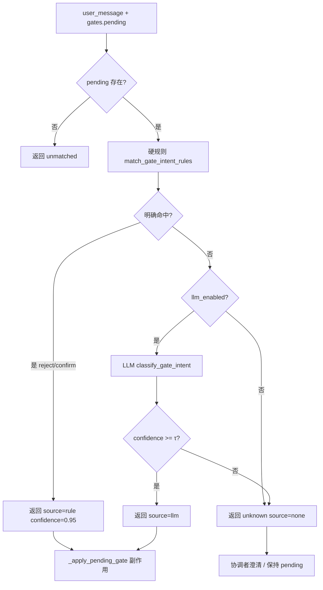

# 闸门意图匹配 — 硬规则 + LLM 回退

## 重点

- **产品决策**：Q1–Q6 已全部确认（2026-06-01）；本文件为实现 SSOT。
- **代码现状（0.3.0）**：`match_gate_intent` = `gate_rules` → `gate_llm` 编排；`source` / `GATE_LLM_ACCEPT_THRESHOLD` / §六收紧 / §八澄清与 `GATE_REPLY_HINTS` / trace 已落地。
- **已随 legacy 清除落地（`561c69d`）**：会话与路由 **仅** `list_type=pipeline` + `current_phase`；`explore_repeat` **reject** 且 `explore_intake_submitted()` → `set_explore_gate_confirmed(true)`（`chat.py` `_apply_pending_gate`，**不区分** list_type）。
- **仍待本 spec 实现**：硬规则优先 + LLM 回退；未命中口语（如「无需」「下一步」）在规则未收紧前仍会 `unknown` 并可能死循环。
- **目标**：**硬规则优先**；未明确命中时走 **轻量 LLM 分类**；响应扩展 `source`（`rule` \| `llm` \| `none`）与可选 `reason`。
- **范围**：所有经 `gates.pending` + `match_gate_intent` 处理的闸门（含 `explore_repeat`）；**不含** Worker 产出的 `gate_prompt` 首次挂闸逻辑。
- **安全**：硬规则 **reject 优先于 confirm**；LLM 仅 `confidence ≥ τ`（**env 可配**，默认 0.75）才视为命中；否则仍为 `unknown`。
- **unknown（目标）**：复述 `pending.prompt` 并请用户**详细说明**；**不清** pending。
- **话术引导（目标）**：无前端固定按钮/提示条；助手回复**末尾**确定性追加 `GATE_REPLY_HINTS`（如 `请回复：不需要 / 需要`）。
- **基线**：与 [10-会话闸门与state.md](../../architecture/10-会话闸门与state.md) §2.3 一致；架构仍写「规则 + LLM 回退」，**以本 spec + 落地代码为准**。

| 属性 | 内容 |
|------|------|
| 状态 | **已确认（Q1–Q6）** · **已实现**（G0–G3，见 §零） |
| 版本 | **0.3.0** |
| 日期 | 2026-06-01（0.3.0 代码落地） |
| 适用范围 | `backend/career_os/harness/gate.py`、`api/chat.py` `_apply_pending_gate`、Harness 工具 `match_gate_intent`、coordinator synthesize、评测/trace |
| 关联 | [10-会话闸门与state.md](../../architecture/10-会话闸门与state.md) §2.3、[14-Harness-Tools-Schema.md](../../architecture/14-Harness-Tools-Schema.md) §2.4、[老模式清除 spec](./2026-06-01-legacy-task-mode-removal-design.md)（**已实施**，`561c69d`）、[老模式清除 plan](../plans/2026-06-01-legacy-task-mode-removal.md)、**[实现计划](../plans/2026-06-01-gate-intent-llm-fallback.md)** |

---

## 零、实现对照（2026-06-01 代码基线）

与 `main` @ `561c69d`（legacy 清除）对齐；**本 spec 条目未另注「已实现」者均为待做**。

| 条目 | 状态 | 代码落点 / 说明 |
|------|------|-----------------|
| Q6 仅 pipeline + `current_phase` | ✅ 已实现 | `TaskStore` 拒绝 `explore`/`jd` list；`coordinator_llm` / `pipeline_routing` |
| Q1 `explore_repeat` reject → `explore_gate_confirmed` | ✅ 已实现 | `api/chat.py` `_apply_pending_gate`（reject 分支 + `explore_intake_submitted()`） |
| `match_gate_intent` 编排 | ✅ 已实现 | `gate.py` + `gate_rules.py` + `gate_llm.py`；含 `source` |
| §六 `explore_repeat` 收紧 + 新 reject 短语 | ✅ 已实现 | `gate_patterns.py` + `gate_rules.py` |
| LLM 分类器 + `GATE_LLM_ACCEPT_THRESHOLD` | ✅ 已实现 | `gate_llm.py`、`config.py` |
| Q2 最近 2 轮对话入 LLM | ✅ 已实现 | `build_recent_turns` + `SessionStore` |
| Q4 unknown 复述 + 请详细说明 | ✅ 已实现 | `gate_clarify_pending` + `build_gate_clarify_text` |
| Q5 `gate_reply_hint` 末尾追加 | ✅ 已实现 | `GATE_REPLY_HINTS` + coordinator/chat |
| Trace `gate.rule_hit` / `gate.llm_classify` | ✅ 已实现 | `gate.py` → `TraceWriter` |

---

## 一、背景与问题

### 1.1 现状

| 项 | 说明 |
|----|------|
| 入口 | `POST /v1/chat` → `_apply_pending_gate` → `match_gate_intent(message, gates.pending)` |
| 规则 | `GATE_PATTERNS` + `explore_complete` 专用 `_EXPLORE_COMPLETE_AFFIRMATIVE` |
| 命中 | `re.search` 子串/锚点匹配，`confidence=0.95`；响应 **无** `source` 字段（目标契约见 §5.3） |
| 未命中 | `matched=false`, `intent=unknown` → **不改** `flags` / `pending`，协调者可能每轮重复 synthesize 同类问句 |
| Session | `list_type` **恒为** `pipeline`；`session_hints` 供 LLM 时仅白名单：`list_type`、`current_phase`（来自 `pipeline_routing.get_current_phase`） |
| 副作用 | `explore_repeat` reject + intake 已提交 → `explore_gate_confirmed`（**已实现**，见 §七） |

### 1.2 典型失败（真实会话）

| 用户说法 | pending | 规则结果 | 用户预期 |
|----------|---------|----------|----------|
| `无需` | `explore_repeat` | unknown | reject（不要再来一轮） |
| `推进下一步` / `下一步` | `explore_repeat` | unknown | reject 或等价「离开初探」 |
| `已经完成初探 下一步` | `explore_repeat` | unknown | reject + 推进 pipeline |
| `确认完成初探` | `explore_repeat` | **confirm**（误命中「确认」） | 应 **reject** 或走 `explore_complete`，而非「同意再来一轮」 |

### 1.3 架构文档缺口

`10-会话闸门与state.md` §2.3 已约定「规则层优先 + LLM 层回退」，**代码尚未实现**。本 spec 补齐可落地的行为与阈值。

---

## 二、目标与非目标

### 2.1 目标

1. **所有** `gate_name` 在硬规则未**明确命中**时，调用统一 LLM 分类器做二次判定。
2. 硬规则命中时 **不调用 LLM**（延迟与成本可控）。
3. 保持 `_apply_pending_gate` 副作用表不变（confirm/reject 仍由 `chat.py` 按 `gate_name` 分支执行）。
4. 可观测：`source=rule|llm`、可选 `reason` 写入 trace（§9.2）；评测可 mock LLM。
5. 顺带收紧 **高危硬规则**（见 §六），降低「短词误命中」。

### 2.2 非目标

- 用 LLM **生成** 闸门问句（仍由协调者 synthesize / Worker `gate_prompt` 负责）。
- 无 `gates.pending` 时做开放域意图识别（仍由协调者 `analyze_workers` 负责）。
- 多轮澄清对话状态机大改（`unknown` 仍由协调者自然语言澄清；本期仅提高首轮命中率）。
- 前端按钮式确认（可作后续迭代；本期仍文本输入）。

---

## 三、闸门清单（SSOT）

与 `gate.py` `GATE_PATTERNS` 及 `chat.py` 副作用对齐：

| `gate_name` | confirm 副作用（摘要） | reject 副作用（摘要） |
|-------------|------------------------|------------------------|
| `explore_complete` | `explore_gate_confirmed`、profile `completed_at`、清 explore work | 清 pending，无 flag |
| `explore_review_complete` | 刷新 `completed_at`（与 v0.1 E2 一致） | 清 pending |
| `explore_repeat` | `explore_repeat_accepted`、弹 intake | `explore_repeat_declined`；若 intake 已提交 → `explore_gate_confirmed`（§七 Q1） |
| `optimize_confirm` | `optimize_confirmed` + `advance_current_phase(resume_optimize)` | 清 pending |
| `strategy_complete` | `strategy_complete` + 挂 `optimize_confirm` | 清 pending |
| `deep_explore` | `deep_explore_accepted`（若已实现） | 清 pending |
| `jd_continue_despite_not_recommended` | jd 继续 flags | 清 pending |
| `jd_bank_deep_dive` | 深挖路径 | 清 pending |
| `task_start` / `task_abandon` | 任务控制（与现网一致） | — |

**LLM 分类器仅处理「当前 `pending.name`」对应的二/三分类**，不把其它 `gate_name` 纳入候选。

---

## 四、总体流程



### 4.1 「明确命中」定义（硬规则）

满足 **任一** 即视为明确命中，**跳过 LLM**：

| 条件 | 说明 |
|------|------|
| R1 | 对当前 `pending.name`，在 **reject_patterns** 上命中（**先于** confirm 扫描，与现实现一致） |
| R2 | 对当前 `pending.name`，在 **confirm_patterns** 上命中，且 **不** 触发 §六「歧义排除」 |
| R3 | `pending.name == explore_complete` 且 `_matches_explore_complete_affirmative` 为 true |

**非明确命中**（须走 LLM，若启用）：

- 无任何 pattern 命中；
- 仅命中 §六 排除列表（视为未命中硬规则）；
- 同时命中 confirm 与 reject 时 **仅 reject 算明确命中**（R1）；若实现 bug 导致双命中且未先 reject，则 **不** 视为明确命中，交给 LLM。

### 4.2 LLM 回退触发

```text
need_llm = pending is not None AND NOT rule_clear_hit
```

`llm_enabled() == false` 时：`need_llm` 直接产出 `unknown`（与现网一致，不阻塞聊天）。

---

## 五、LLM 分类器设计

### 5.1 模块边界

| 模块 | 路径（建议） | 职责 |
|------|--------------|------|
| `match_gate_intent_rules` | `harness/gate.py` 或 `harness/gate_rules.py` | 现逻辑拆分，纯函数、无 IO |
| `classify_gate_intent_llm` | `harness/gate_llm.py` | 调 LLM，返回结构化结果 |
| `match_gate_intent` | `harness/gate.py` | 编排：rules → llm → 合并 |

### 5.2 输入（最小上下文）

| 字段 | 必填 | 说明 |
|------|------|------|
| `user_message` | ✓ | 本轮用户原文 |
| `pending_gate.name` | ✓ | 当前闸门 |
| `pending_gate.prompt` | ✓ | 协调者已展示的问句（LLM 对齐语义） |
| `recent_turns` | **✓（已确认）** | 最近 **2** 轮 user+assistant（各截断 200 字），消解「无需」「可以」等指代；由 `SessionStore` 读取当前 session 消息 |
| `session_hints` | 可选 | 仅白名单：`list_type`（应为 `pipeline`）、`current_phase`（`get_current_phase(session_state)`） |

**禁止**送入：完整简历、JD 全文、`profile` 大段 exploration 字段。

### 5.3 输出（JSON Schema）

与 [14-Harness-Tools-Schema.md](../../architecture/14-Harness-Tools-Schema.md) 兼容并扩展：

```json
{
  "matched": true,
  "gate_name": "explore_repeat",
  "intent": "confirm",
  "confidence": 0.88,
  "source": "llm",
  "reason": "用户表示不需要再次初探，希望进入市场分析"
}
```

| 字段 | 类型 | 约束 |
|------|------|------|
| `matched` | bool | `intent != unknown` 时为 true |
| `gate_name` | string | **必须** 等于 `pending_gate.name` |
| `intent` | enum | `confirm` \| `reject` \| `unknown` |
| `confidence` | float | 0–1；仅 LLM 路径填写 |
| `source` | enum | `rule` \| `llm` \| `none` |
| `reason` | string | ≤120 字；仅 trace/debug，不展示给用户 |

### 5.4 置信度阈值（已确认：env 可配）

| 项 | 约定 |
|----|------|
| 环境变量 | `GATE_LLM_ACCEPT_THRESHOLD`（`Settings.gate_llm_accept_threshold: float`） |
| 默认值 | **0.75** |
| 行为 | `confidence ≥ τ` 且 `intent ∈ {confirm,reject}` → `matched=true` |
| 低于 τ | 降级为 `unknown`，`matched=false`，`source=llm` |

实现位置：`career_os/config.py` + `.env.example` 注释说明取值区间建议 `[0.5, 0.95]`。

**硬规则与 LLM 冲突**：若未来同时启用「规则弱命中」，本期 **不做**；仅「规则明确命中」即返回，不调用 LLM。

### 5.5 Prompt 要点（实现时落 `platform/prompt/gate_intent/`）

1. 角色：闸门确认分类器，**只**判断用户对 **当前问句** 的态度。
2. 给出 `pending_gate.prompt` 与 `gate_name` 的语义说明（§8.2 `GATE_REPLY_HINTS` 表；PRD 话术映射见 [架构 10 §2.3.1](../../architecture/10-会话闸门与state.md#231-附录-b--gate_name-映射)）。
3. 明确 **confirm / reject / unknown** 定义：
   - **confirm**：用户同意问句提议的动作（如愿意再次初探、确认优化简历）。
   - **reject**：用户明确拒绝或表达「已足够 / 进入下一步 / 不要重复」。
   - **unknown**：离题、仅闲聊、无法判断、同时想要互斥动作。
4. **`explore_repeat` 特规**（写入 prompt）：
   - 「完成初探 / 不用再做 / 下一步 / 看市场」→ **reject**（不要再来一轮），**不是** confirm。
   - 只有明确愿意 **重新做一轮初探** 才是 confirm。
5. 要求 **仅输出 JSON**，无 markdown 包裹。

### 5.6 模型与降级

| 项 | 约定 |
|----|------|
| 角色 | `LLMRole` 新增 `GATE_INTENT`，或复用 `WORKER`（实现计划 G1 二选一，写入 `models.py`） |
| 超时 | ≤ **3s**；超时 → `unknown` |
| 解析失败 | JSON 无效 → `unknown`，打 warn trace |
| 单测 | `llm_enabled=false` 或注入 mock classifier |

---

## 六、硬规则收紧（与 LLM 回退同版本；**G0 先行**）

硬规则在 **G0** 合入；LLM 回退在 **G1**。降低「明确命中」的误伤，以下 **不** 视为 R2 明确命中（改 pattern 或移入排除表）：

| `gate_name` | 原问题 pattern | 调整 |
|-------------|----------------|------|
| `explore_repeat` | 单独 `确认`、`要`、`好`、`继续` | 删除或改为更长短语；「确认完成初探」走 `explore_complete` 专用表，**不得**在 `explore_repeat` 下命中 confirm |
| `explore_repeat` | — | **新增** reject：`无需`、`不用了`、`下一步`、`进入下一步`、`推进下一步`、`先看看市场` |
| 全局 | — | 维持 **reject 先于 confirm** 扫描顺序 |

硬规则收紧后，更多边界 case 由 LLM 兜底，但 §六 仍减少 LLM 被误调用的争议输入。

---

## 七、与 pipeline / explore_repeat 的联动（已确认）

分类器 **只** 返回 `intent`（目标：`source=rule|llm`）；副作用仍在 `chat.py` `_apply_pending_gate`。

| 场景 | 行为（**已确认**） | 实现状态 |
|------|-------------------|----------|
| `explore_repeat` + **reject**（rule 或 llm） | ① `flags.explore_repeat_declined = true`；② 若 `explore_intake_submitted()` → **`set_explore_gate_confirmed(session_state, True)`**（Q1+Q6）；③ 清 `gates.pending` | ②③ **已实现**（`chat.py`）；① 依赖 `match_gate_intent` 先命中 reject |
| `explore_repeat` + **confirm** | `explore_repeat_accepted`、baseline、`explore_intake_blocked` | ✅ 已实现 |
| `explore_complete` + **confirm** | 含 `explore_gate_confirmed`、profile `completed_at` 等 | ✅ 已实现 |

**Q1（2026-06-01）**：**是** — 拒绝「再次初探」且全局 intake 已提交 → 本 session `explore_gate_confirmed=true`。**代码已落地**；若用户话术未命中 reject（仍为 `unknown`），则 **不会** 触发该副作用。

**Q6（2026-06-01）**：**已实施**（`561c69d`）— 新会话仅 `list_type=pipeline` + `current_phase`；`create_task_list(explore|jd)` → `list_type_deprecated`。详见 **[老模式任务清除 spec](./2026-06-01-legacy-task-mode-removal-design.md)**。**本 spec 不再依赖** 老 list_type 分支实现闸门副作用。

---

## 八、`unknown` 与助手话术（Q4 / Q5，已确认）

### 8.1 Q4：`unknown` 时的协调者回复

触发条件：存在 `gates.pending`，且本轮 `match_gate_intent` 结果为 `matched=false` 或 `intent=unknown`（含 LLM 低于 τ、`llm_enabled=false`）。

| 项 | 约定 |
|----|------|
| `gates.pending` | **保持**，不清除 |
| 助手正文 | ① **复述** `pending.prompt`（或与之等价的协调者问句）；② **追加** 请用户详细说明，例如：「我没完全理解您的意思，请补充说明您的选择或下一步打算。」 |
| 实现落点 | `coordinator` synthesize 分支，或 `chat.py` 在 gate 未消费后设置 `session_state.gate_clarify_pending=true` 供 synthesize 读取；**禁止**静默当作闲聊跳过 pending |

**非目标**：不在此轮自动改 `flags` 或代用户 confirm/reject。

### 8.2 Q5：回复末尾追加「请回复」示例（无前端组件）

| 项 | 约定 |
|----|------|
| 前端 | **不** 增加固定按钮、TaskProgress 提示条、独立闸门 UI |
| 助手话术 | 凡协调者 **首次挂出** `gates.pending` 或 **Q4 澄清轮**，在 `synthesis_text` / 流式正文 **末尾** 追加 `gate_reply_hint(gate_name)` |
| 示例 | `explore_repeat` → `请回复：不需要 / 需要`（可带换行，与正文空一行） |
| 其它闸门 | 附录 `GATE_REPLY_HINTS`（实现时与 `GATE_PATTERNS` 同文件维护） |

建议 `GATE_REPLY_HINTS` 初版：

| `gate_name` | 末尾追加文案 |
|-------------|----------------|
| `explore_repeat` | 请回复：不需要 / 需要 |
| `explore_complete` | 请回复：确认完成初探 / 还要继续聊聊 |
| `explore_review_complete` | 请回复：确认复盘完成 / 再想想 |
| `optimize_confirm` | 请回复：确认优化 / 先不优化 |
| `strategy_complete` | 请回复：策略可以了 / 还要改策略 |
| 其它 | 请明确回复「同意」或「暂不」 |

协调者 **LLM 自由生成正文** 后，由代码 **确定性 append** hint（避免模型漏写引导句）。

---

## 九、API / Harness / Trace

### 9.1 对外契约

`match_gate_intent` 响应在 §5.3 基础上增加 `source`（breaking：旧客户端忽略即可）。

### 9.2 Trace 事件

| 事件 | 字段 |
|------|------|
| `gate.rule_hit` | `gate_name`, `intent`, `pattern`（可选） |
| `gate.llm_classify` | `gate_name`, `intent`, `confidence`, `reason` |
| `gate.pass` | 沿用；增加 `source` |

### 9.3 聊天路径

`_apply_pending_gate` **保持同步**；LLM 在 gate 阶段 **await**（单轮增加延迟）。若后续延迟敏感，可拆「先返回 clarifying SSE + 下轮再确认」——**非本期**。

---

## 十、测试与验收

### 10.1 单元测试

| 套件 | 内容 |
|------|------|
| `test_gate_rules_*.py` | 硬规则：§1.2 典型句、§六 排除、reject 优先；PRD 话术见 [架构 10 §2.3.1](../../architecture/10-会话闸门与state.md#231-附录-b--gate_name-映射) |
| `test_gate_llm_*.py` | mock LLM：§1.2 典型失败句 → 预期 intent |
| `test_match_gate_intent.py` | 编排：rule 命中不调 LLM（spy）；rule 未命中调 LLM |

### 10.2 回归用例（最低）

- `explore_repeat` + `无需` → reject（rule 或 llm）
- `explore_repeat` + `确认完成初探` → **reject** 或 `unknown`，**不得** confirm（pending 须为 `explore_repeat`）
- `explore_repeat` + `已经完成初探 下一步` → reject（rule 或 llm），可触发 Q1 副作用
- `explore_complete` + `已经完成初探 下一步`（pending=`explore_complete`）→ confirm（rule 或 llm）
- `optimize_confirm` + `先不优化` → reject
- `llm_enabled=false` + 口语 → unknown → 助手复述问句 + 请详细说明 + 末尾 hint
- `explore_repeat` 挂闸 synthesize → 正文末尾含 `请回复：不需要 / 需要`

### 10.3 Eval

`tests/eval` 中闸门 case 补充 `source` 断言；L1 可继续只测硬规则短语。

---

## 十一、实现分期（建议计划）

| 阶段 | Plan | 内容 | 状态 |
|------|------|------|------|
| **P2′** | — | 老模式清除（pipeline 唯一主路径、`explore_repeat` reject 副作用） | ✅ **已完成**（[legacy removal plan](../plans/2026-06-01-legacy-task-mode-removal.md)，`561c69d`） |
| **P0** | **G0** | 拆分 `match_gate_intent_rules` + §六 硬规则收紧（含 `explore_repeat` 新 reject 短语）；规则命中带 `source=rule` | ✅ 已完成 |
| **P1** | **G1** | `gate_llm.py` + `platform/prompt/gate_intent/` + `GATE_LLM_ACCEPT_THRESHOLD` + `match_gate_intent` 编排（**不含** trace 落盘） | ✅ 已完成 |
| **P3** | **G2** | §八 Q4/Q5：`unknown` 澄清 + `gate_reply_hint` append | ✅ 已完成 |
| **P4** | **G3** | Trace（§9.2）、架构 10 / 14 文档、eval 扩充 | ✅ 已完成 |

**实现任务拆解**：见 **[实现计划](../plans/2026-06-01-gate-intent-llm-fallback.md)**（Task G0–G3）。建议 PR 顺序：G0 → G1 → G2 → G3（G1 与 G3 可同 PR，但 trace **归属 G3**）。P2′ 勿重复开发。

---

## 十二、决策记录（全部已确认，2026-06-01）

| ID | 决策 |
|----|------|
| **Q1** | `explore_repeat` **reject** 且 `explore_intake_submitted()` → **必须** `set_explore_gate_confirmed(true)` |
| **Q2** | LLM 分类 **必须** 带入最近 **2 轮** 对话（§5.2） |
| **Q3** | 置信度阈值 **env 可配**：`GATE_LLM_ACCEPT_THRESHOLD`，默认 **0.75**（§5.4） |
| **Q4** | `unknown` 时：**复述** `pending.prompt` + 请用户**详细说明**；**保持** pending（§8.1） |
| **Q5** | **无**前端固定按钮/提示条；助手回复**末尾**追加 `GATE_REPLY_HINTS`（如 `请回复：不需要 / 需要`）（§8.2） |
| **Q6** | 清除 `explore`/`jd` 老模式；仅 **pipeline** + `current_phase` — **已实现**（[legacy removal spec](./2026-06-01-legacy-task-mode-removal-design.md)，`561c69d`） |

---

## 十三、文档关系

| 文档 | 关系 |
|------|------|
| `docs/architecture/10-会话闸门与state.md` §2.3 | 本 spec **细化** LLM 层；**当前代码未达** 架构描述，实现后以本 spec + 代码为准 |
| `docs/architecture/14-Harness-Tools-Schema.md` | G3（P4）：更新 `match_gate_intent` 响应增加 `source`、`reason?` |
| [老模式清除 spec](./2026-06-01-legacy-task-mode-removal-design.md) | **已实施**；Q6 / `explore_repeat` 副作用前置依赖 |
| [pipeline 升级 spec](./2026-06-01-task-system-pipeline-upgrade-design.md) | **已归档**，只读；与闸门冲突时以本 spec §七 + legacy 清除为准 |

---

## 十四、变更记录

| 版本 | 日期 | 说明 |
|------|------|------|
| 0.1.2 | 2026-06-01 | Q1–Q6 产品确认 |
| **0.2.0** | 2026-06-01 | 对齐 `561c69d`：新增 §零 实现对照；Q6/Q1 标已实现；分期 P2′ 完成；明确 LLM/§六/§八 仍待实现 |
| **0.2.1** | 2026-06-01 | 与 plan 对齐：P1/G1 不含 trace；§三补 Q1 副作用；§10.2 拆分 explore_repeat / explore_complete 用例；§六 G0 先行 |
| **0.3.0** | 2026-06-01 | G0–G3 代码与架构文档落地 |

---

*Spec 版本：0.3.0 · 2026-06-01（Q1–Q6 已确认 · 已实现）*
