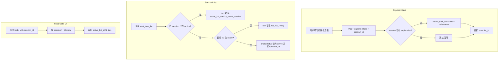

# 多 Session 任务隔离 — 设计规格

| 属性 | 内容 |
|------|------|
| 状态 | 已确认（任务系统按 Session 隔离） |
| 版本 | **1.3** |
| 日期 | 2026-06-01 |
| 适用范围 | 任务系统隔离规则（在会话持久化基础上的增量） |
| 基线文档 | `docs/superpowers/specs/2026-05-31-session-persistence-design.md` |
| 实现计划 | `docs/superpowers/plans/2026-06-01-session-task-isolation.md` |

> **文档策略**：v0.1 architecture/PRD **不改**；任务域变更 **仅写本 spec**。与旧 spec / PRD 冲突时，**本 spec 在任务域优先**。

### v1.3 变更摘要（相对 v1.2）

- Explore list：**intake submit 后**于 `POST /v1/profile/explore-intake` 创建（非协调者派工时）
- Milestone：**identity + capability** 双条
- TaskProgress：active 无 task 且无 ready → **headline 空骨架**；chat 结束后 **refetch**
- intake **提交前**可无 list；**提交后**必须有 list
- TaskStore **`list_type` 必填**；`list_tasks` 缺省 `list_id` → `state.list_id`

---

## 0. 目标与结论

1. **同一 session 内只允许 1 个 active list**
2. **不同 session 之间允许并行 active list**
3. **一个 session 内允许多个 ready list**
4. **`GET /v1/tasks` 的 `session_id` 必填**
5. **删除 `_active.json`，不保留兼容**
6. **任务 list 仅 `ready` \| `active` 两态**；放弃 = 物理删除（跟 PRD A02），**本期不引入 task list 的 `archived` 状态**
7. **初探（explore）submit intake 后须创建 task list**（`list_type=explore`，`status=active`），进度以 task 为准

---

## 1. 术语：session archived vs task list 状态

| 概念 | 字段 | 含义 |
|------|------|------|
| **会话归档** | `_index.json` 的 `archived` | 会话列表 UI 隐藏；与任务无关（见 session persistence spec） |
| **任务 list 状态** | `meta.json` 的 `status` | **仅** `ready` \| `active`（本期） |

**回答「什么时候是 archived？」**

- **会话 archived**：用户 PATCH `/v1/sessions/{id}` `{archived:true}` 时。
- **任务 list archived**：**本期不存在**。旧 spec v1.1 曾预留 `meta.status=archived`，已取消；list 结束路径只有：
  - **完成**：删光 `{task_id}.json` + `meta.json`
  - **放弃**：`abandon_task_list` → 同上（物理删除）

勿与会话 `archived` 混淆。

---

## 2. 工具入口

### 2.1 现状缺口

| 工具 | 白名单 | Harness 已注册 | handler |
|------|--------|----------------|---------|
| `create_task_list` | ✓ | ✓ | ✓ |
| `create_task` | ✓ | ✓ | ✓ |
| `start_task_list` | ✓ | ✗ | 本期实现 |
| `abandon_task_list` | ✓ | ✗ | 本期实现 |
| `get_task` | ✓ | ✗ | **非本期**（见 §2.3） |
| `list_tasks` | ✓ | ✓ | ✓ |

### 2.2 本期工具职责

| 工具 | 职责 |
|------|------|
| `create_task_list` | 新建 list；**`list_type` 必填**（`explore` \| `jd` \| `plan`）；默认 `ready`；`active` 时走同 session 互斥；写 `session_id`；成功时更新 `state.list_id` |
| `start_task_list` | `ready` → `active`；同 session 互斥；写 `updated_at`；更新 `state.list_id` |
| `abandon_task_list` | 删该 list 下全部 task 文件 + `meta.json`（PRD A02）；清 `state.list_id`（若指向该 list） |
| `list_tasks` | 显式 `list_id` 或 **缺省时读当前 session 的 `state.list_id`**（Harness 注入 session 上下文） |

### 2.3 `get_task` 是什么？

**是协调者 Tool**（PRD A02 / architecture 14 定义）：按 `list_id` + `task_id` 读取任务完整 `description`，供 claim/complete 前恢复上下文。

- 与 REST `GET /v1/tasks` **不是同一个东西**（后者按 session 列 list）。
- 当前 **未注册** 到 Harness，协调者无法调用。
- **本期不实现**；待协调者真正走 claim/complete 动态任务链时再补。

---

## 3. 行为定义（TaskStore 强约束）

| 操作 | 规则 |
|------|------|
| `create_task_list(..., list_type=…)` | **`list_type` 必填**，无默认值 |
| `create_task_list(..., status="active")` | 该 session 已有 active → `TaskStoreError` |
| `start_task_list(list_id)` | 同 session 已有其它 active → 拒绝；目标须为 `ready` |
| `create_task_list(..., status="ready")` | 允许多个 |
| `abandon_task_list` | 物理删除，无 archived 中间态 |
| 跨 session | 允许并行 active |

### 3.1 初探须建 task list

**时机（已确认）：** 用户 **`POST /v1/profile/explore-intake` 提交成功**（profile patch 完成后），为该请求的 **`session_id`** 创建 explore task list。

**挂点：** `submit_explore_intake` → `ensure_explore_task_list(session_id)`（**非**协调者 analyze 派工时）。

**行为：**

| 项 | 值 |
|----|-----|
| `list_type` | `explore` |
| `status` | `active` |
| 幂等 | 该 session 已有 `list_type=explore` 的 list → **跳过** |
| `state.list_id` | 创建成功后写入；`list_type=explore` 写入 session state |

**Milestones（本期固定 2 条，与 worker 线对齐）：**

| task_id | kind | title |
|---------|------|-------|
| `identity` | milestone | 内心探索 |
| `capability` | milestone | 能力素材补充 |

**intake 提交前：** 允许无 explore list；TaskProgress 为空属 **正常**（chat 区仍可有 headline / 填表引导）。

**intake 提交后：** 该 session **必须有** explore list；若无 → **bug / 未建 list**。

- 初探进度 **以 task list 为 SSOT**；不再依赖 `sessionActivity.items` fallback。
- `build_session_activity` 仍可用于 chat headline，但 **TaskProgress 只读 tasks API**。

### 3.2 `state.list_id` 与 task meta

| 存储 | 角色 |
|------|------|
| `data/tasks/{list_id}/meta.json` | **任务域 SSOT** |
| `state.json.list_id` | **缓存**；`create_task_list` / `start_task_list` / **`ensure_explore_task_list` 成功**时更新 |
| 读任务 UI | **仅** `GET /v1/tasks?session_id=` |

### 3.3 历史脏数据（多 active）

迁移默认策略（**已确认**）：

1. 按 session 分组 scan `meta.status=active`
2. `created_at` **最新**的一条为 canonical active
3. 其余 active → 改为 `ready`
4. 打 **warn** 日志；**不** 写 `archived`

### 3.4 `updated_at`

- `create_task_list`：写 `created_at`；`updated_at` 初始等于 `created_at`
- `start_task_list` 及任意 `meta.status` 变更：刷新 `updated_at`
- `list_lists_for_session` 排序 ready：`updated_at` 降序，fallback `created_at`

---

## 4. 错误码（统一风格）

### 4.1 分层

| 层 | 形态 |
|----|------|
| **TaskStore** | `TaskStoreError(code, message)` |
| **Tool** | `TaskToolError(code, message)` — 透传 store，**无 HTTP 状态码** |
| **任务相关 REST** | `HTTPException(..., detail={"code","message",...})` — **object** |
| **会话域 REST** | 本期 **保持** string `detail`（如 `chat_in_progress`）；后续渐进改 object |

### 4.2 Tool vs REST

协调者 `execute_tool` 失败 → 返回 `{code, message}` 给 LLM/SSE/trace，**不**映射 HTTP 409。  
仅 REST 端点（如未来暴露的 HTTP 包装层、`GET /v1/tasks` 校验）使用 HTTP status。

### 4.3 任务域 `code` 枚举

| code | HTTP（仅 REST） | 场景 |
|------|-----------------|------|
| `session_id_required` | 400 | `GET /v1/tasks` 缺 query |
| `invalid_session_id` | 400 | 格式非法 |
| `active_list_conflict_same_session` | 409 | 同 session 第二个 active |
| `list_not_found` | 404 | list_id 不存在 |
| `list_not_ready` | 409 | 对非 ready list 调用 start |
| `chat_in_progress` | 409 | 删 session 时仍在 chat（会话域，string detail 本期不变） |

（已移除 `archived_list_cannot_activate`。）

---

## 5. API

### 5.1 `GET /v1/tasks`

- **必填** `session_id`
- 缺失 → 400 object：`{code: session_id_required, message: "..."}`
- `invalid_session_id` → 400 object
- `active_list_id`：扫描该 session 的 `meta.status=active`（不读 `_active.json`）
- 无参旧分支 **删除**

### 5.2 响应

```json
{
  "session_id": "sess_xxx",
  "active_list_id": "list_…",
  "lists": [
    { "list_id": "…", "list_type": "explore", "status": "active", "tasks": [] },
    { "list_id": "…", "list_type": "jd", "status": "ready", "tasks": [] }
  ],
  "all_tasks_completed": false
}
```

### 5.3 `POST /v1/profile/explore-intake`

- 请求体 **必填** `session_id`（当前 chat session；用于按 session 建 task list）
- profile patch 成功后调用 `ensure_explore_task_list(session_id)`（见 §3.1）
- intake 数据仍写入 **全局** `profile.json`；task list 按 **session** 隔离

---

## 6. 前端 TaskProgress

**仅** `GET /v1/tasks?session_id=`；**不再**用 `sessionActivity.items` fallback。

**刷新：** chat SSE **正常结束后** bump refresh key，重新请求 `GET /v1/tasks`（不仅依赖 `sessionId` 变化）。

显示优先级（**已确认**）：

1. **active list 且有 tasks** → 展示 active 任务条
2. **active list 无 tasks** → 展示 **接下来要执行的 ready**（最新 ready，按 `updated_at`）
3. **无 active、有 ready 且有 tasks** → 展示该 ready
4. **active 存在、无 tasks、且无 ready list** → 展示 **headline + 空列表骨架**（不整段隐藏）
5. **以上皆无**（含 intake 提交前）→ **空态**（不渲染 TaskProgress）

**intake 提交后**该 session 无 explore list → 视为 **bug**（见 §3.1）。

Chat 区可继续展示 `session_activity.headline`（与 TaskProgress 解耦）。

---

## 7. 流程图



---

## 8. 测试要求

1. 同 session 双 active → store/tool 拒绝
2. 跨 session 双 active → 成功
3. 同 session 多 ready → GET 全返回
4. `GET /v1/tasks` 无 session_id → 400 object；`invalid_session_id` → 400 object
5. `abandon_task_list` → 目录删光，无 archived meta
6. 迁移：多 active → 最新保留，其余 ready + warn
7. **`POST /v1/profile/explore-intake` 提交后为该 session 创建 `list_type=explore` list + identity/capability milestones**；重复 submit 幂等
8. TaskProgress：active 无 task 时有 ready → 展示 ready；active 无 task 且无 ready → **headline 空骨架**；intake 提交前 → 空态
9. `start_task_list` / `abandon_task_list` 已注册
10. `list_tasks` 缺省 `list_id` → 读 `state.list_id`
11. `create_task_list` 缺 `list_type` → 类型错误或测试覆盖必填

---

## 9. 成套改动清单

### 9.1 TaskStore

- [ ] 删 `_active.json` 相关
- [ ] `list_type` **必填**，去掉错误默认值
- [ ] 同 session active 互斥
- [ ] `start_task_list` / `abandon_task_list`
- [ ] `created_at` / `updated_at`
- [ ] 迁移 helper（多 active → ready）

### 9.2 Tool + Harness

- [ ] handlers + register `start_task_list`、`abandon_task_list`
- [ ] 成功时 patch `state.list_id`
- [ ] `list_tasks` 缺省 `list_id` → `state.list_id`
- [ ] `get_task`：**不注册**（本期）

### 9.3 API

- [ ] `get_tasks` 必填 session_id + object 400
- [ ] `active_list_id` 来自 scan
- [ ] `explore-intake` 增 `session_id` + `ensure_explore_task_list`

### 9.4 Explore intake（原「协调者 explore 入口」）

- [ ] `submit_explore_intake` 后 `ensure_explore_task_list`
- [ ] milestones：identity + capability
- [ ] 前端 `ExploreIntakeForm` 提交时带 `sessionId`

### 9.5 前端

- [ ] TaskProgress 新优先级逻辑 + **空骨架**
- [ ] chat 结束后 **refetch** tasks
- [ ] 移除 sessionActivity items fallback
- [ ] 任务 REST 解析 object detail

---

## 10. 与旧文档关系

| 文档 | 关系 |
|------|------|
| v0.1 PRD A02 | 全局单 active / `_active.json` → **本 spec supersede**；explore milestone 数量以 **本 spec §3.1** 为准（双 milestone） |
| 2026-05-31 session spec | `active_list_elsewhere` → **取消** |
| v0.1 architecture | **不改**；`list_tasks` 缺省语义以本 spec §2.2 为准 |
| plan v1.3 对齐 | 实现步骤见 `docs/superpowers/plans/2026-06-01-session-task-isolation.md` |
