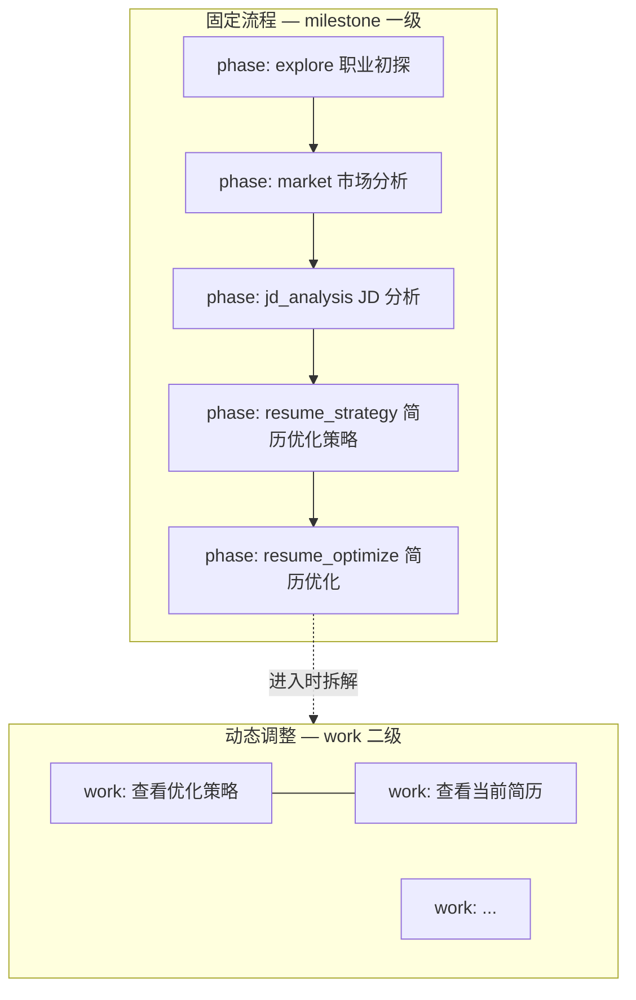
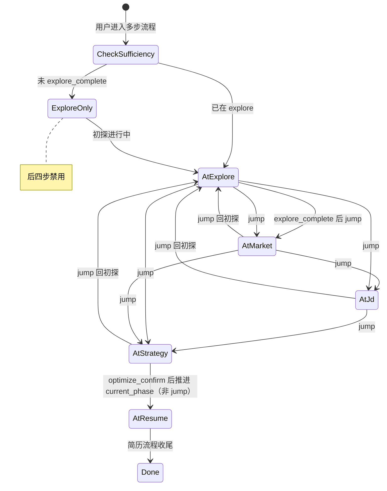

# 任务系统升级 — 固定主流程 + 动态小任务（设计规格）

| 属性 | 内容 |
|------|------|
| 状态 | **已确认（产品 Q1–Q25 + §13 审查，2026-06-01）** |
| 版本 | **0.5.3** |
| 日期 | 2026-06-01 |
| 需求来源 | 产品：Agent 主路径明确，任务系统拆为「固定流程」与「动态调整」 |
| 基线文档 | [A02 机制 · 任务系统 PRD](../../prd/A02.%20机制-任务系统%20PRD.md)、[02-平台服务 §5](../../architecture/02-平台服务.md#5-task-管理)、[2026-06-01-session-task-isolation-design](./2026-06-01-session-task-isolation-design.md) |
| 实现计划 | [2026-06-01-task-system-pipeline-upgrade.md](../plans/2026-06-01-task-system-pipeline-upgrade.md) |

> **文档策略**：本 spec 描述任务域 **目标态** 与 **相对现状的增量改造**。与 A02 v0.10 冲突时，**本 spec 在「主路径 pipeline」范围内优先**；`plan` 等旁路 list 可保留 A02 语义直至二期收敛。

---

## 0. 摘要

将任务系统从「协调者按场景动态建 `explore` / `jd` / `plan` 三套 list」升级为：

1. **固定主流程（milestone 一级）**：职业初探 → 市场分析 → JD 分析 → 简历优化策略 → 简历优化；**用户确认初探完成（`explore_complete`）后** 方可离开初探、jump 后四步（非「信息够深」即可跳过）；支持 **放弃当前阶段并跳转** 到指定后续阶段（受硬规则约束）。
2. **动态执行计划（work 二级）**：进入某个 milestone 后，执行方 **先规划再拆 work**，work **挂在当前 milestone 下** 展示与推进。

---

## 1. 现状评估

### 1.1 产品与架构（A02 / 00 PRD）

| 维度 | 现状 |
|------|------|
| list 粒度 | `list_type`: `explore` \| `jd` \| `plan`，**按场景拆 list**（初探一条、每个 JD 一条） |
| milestone 预设 | [02 §5.4 Preset](../../architecture/02-平台服务.md#54-典型任务流程预设preset)：`jd` 含 4 个 milestone；`explore` 仅 1 个；**无跨 list 的统一五步主路径** |
| 层级 | PRD 定义 `milestone` + `work`，`blockedBy` 表达依赖；work 由 **领域 Worker** 动态追加 |
| 准入 | 协调者 prompt + Harness：`jd_prerequisites_met`（建档 + `exploration.completed_at`）才派 jd 链；**无「档案足够可跳过初探」的细粒度规则** |
| 跳转 | A02 §5.8.10：放弃 list 后可 **新建** 另一 list；**无「放弃并跳到主路径第 N 步」的一等公民** |

### 1.2 实现（backend / web）

| 能力 | PRD/A02 | 当前实现 |
|------|---------|----------|
| `blockedBy` | 有 | **未实现** |
| `parent_id` / 二级展示 | 隐含（milestone→work） | **扁平** `tasks[]`，无父子字段 |
| `subject` / `description` | 有 | 存 **`title`**，无 `description` |
| `list_type` 写入任务 JSON | 有 | **仅 meta**，任务文件无 `list_type` |
| `requires_user_confirm` | milestone 默认 true | **未实现** |
| `claim` 状态 | `in_progress` | 存 **`active`** |
| `get_task` | 协调者恢复上下文 | **未注册** Harness |
| `create_task` | 协调者 + 领域 Worker（PRD） | **仅 coordinator** |
| 初探 list | 协调者或 intake 后 | **intake submit** 建 `explore` + 2 milestone（identity/capability） |
| UI | milestone 主轴 + work 可折叠 | **扁平列表**，无缩进/分组 |

### 1.3 与目标需求的差距

| 需求 | 差距 |
|------|------|
| 五步固定主路径 | 需 **单一 pipeline 语义**（或等价的状态机），而非 explore/jd 分裂 |
| 初探不足 → 只能初探 | 仅有 JD 前置；需 **可配置的 profile 充分度** + 工具层硬拦 |
| 用户确认后可离开初探 | 须 **`explore_complete` 确认** 后方可 jump 后四步；**`can_offer_explore_complete`** 决定是否可发起该确认问句 |
| 任意时刻放弃并跳入 市场/JD/策略 | 需 **`jump_to_phase`**（或 abandon + 重建 pipeline 并定位 cursor） |
| 简历优化前必有策略 | **不可 jump** 至 `resume_optimize`；须先处于 `resume_strategy`，`optimize_confirm` 后 **推进** `current_phase`（§3.2.1、G-08） |
| 大任务下先拆小任务再展示 | 需 **`parent_milestone_id`** + Worker 建 work 通路 + UI 二级 |

---

## 2. 目标形态

### 2.1 概念拆分



| 层 | `kind` | 谁创建 | 谁完成 | 用户可见 |
|----|--------|--------|--------|----------|
| 固定主流程 | `milestone` | **系统 Preset**（建 list 时一次性写入 5 条） | **不** `complete_task`（**A3 乙**）；仅 `current_phase` 迁移 + 各 phase 闸门 | 进度条 **一级**（五步） |
| 动态执行 | `work` | **当前 milestone 对应 Worker**（或协调者代建） | Worker 循环内 `claim`/`complete`（B3：complete 仍可由协调者执行） | 进度条 **二级**（缩进在父 milestone 下） |

### 2.2 主流程阶段定义（`pipeline_phase`）

| `pipeline_phase` | 用户文案 | 典型 Worker | 落档要点（profile） |
|------------------|----------|-------------|---------------------|
| `explore` | 职业初探 | identity, capability | `exploration.*`, `resume.experience_bank`, `capability.*` |
| `market` | 市场分析 | market | `market.*` |
| `jd_analysis` | JD 分析 | opportunity | `market.opportunity_snapshots`、JD 结论 |
| `resume_strategy` | 简历优化策略 | strategy | `strategy.*`, `career.*`、优化确认相关 |
| `resume_optimize` | 简历优化 | resume, asset | HTML、`outputs_index` |

> 命名与现有 `list_type=jd` 内 milestone 对齐关系见 §4.3。

### 2.3 固定流程状态机（list 级）



> **图注（A10 已采纳）**：箭头为 **推荐顺序**，**非强制**；实际以 `jump_to_phase`、`current_phase` 与各 **闸门**（§3.2、§7.4、§7.6）为准。

**`current_phase`**：存于 `meta.json`（及可选 `session_state.pipeline` 缓存），表示 **当前应推进的 milestone**（非「最后一个已完成的」）。

---

## 3. 准入、跳过与跳转规则

### 3.1 长期记忆充分度（`explore_sufficiency`）— 已确认（Q4）

**目的**：回答「是否可以不经初探进入后续阶段 / 是否允许 jump」。

实现为 **硬性规则 + LLM 判定** 两层，输出：

```json
{
  "explore_sufficient": false,
  "hard_pass": false,
  "depth_pass": false,
  "hard_reasons": ["resume_text missing"],
  "depth_reasons": ["职业深探尚未覆盖动机与约束"],
  "checked_at": "2026-06-01T12:00:00Z"
}
```

| 层级 | 判定方 | 规则（产品确认） |
|------|--------|------------------|
| **硬性 `hard_pass`** | Harness / 代码 | ① **有简历**；② **表单必填**齐全（**不** 含新鲜度；新鲜度见 `fresh_pass` / F1–F3） |
| **新鲜度 `fresh_pass`** | Harness / 代码（Q24；**C3 方案乙**；**A2**） | **从未初探**：不跑 F1–F3，须完整初探。 **已有落档**：F1\|F2\|F3 → 初值 `false`；**不** 参与挂 `explore_complete`。本轮收尾后 **`fresh_pass=true`** |
| **深度 `depth_pass`** | Harness **专用判定节点**（Q22） | 个人/能力两轨轮次触发后判定；两轨均够深为 `true` |
| **`can_offer_explore_complete`** | — | `hard_pass && depth_pass && explore_closure 齐套`（**不含** `fresh_pass`，**C3 方案乙**） |
| **`explore_sufficient`（telemetry，可选）** | — | `hard_pass && depth_pass && fresh_pass`；**禁止** 作为挂 `explore_complete` 或 jump 的唯一条件 |
| **`depth_pass` 调度** | 见 §3.1.1（Q19） | 个人初探 / 能力初探 **分轨计轮**，非每用户消息全量重算 |

**不** 单独以 `exploration.completed_at` 替代上述双层判定（completed_at 可作为落档副产物，非 jump 唯一条件）。

#### 3.1.1 深探完成度判定节奏（Q19 — 产品规则）

进入 **职业初探**（`current_phase=explore`）后，**个人初探**（identity）与 **能力初探**（capability）**各维护独立对话轮次计数**（`explore_depth_rounds.personal` / `explore_depth_rounds.capability`，存在 `session_state`）。

**单轨判定触发**（每一轨单独适用）：

| 阶段 | 触发条件 | 动作 |
|------|----------|------|
| 首次 | 该轨累计 **满 6 轮** | LLM 判定该轨是否「够深」 |
| 二次 | 若未够深，再 **满 2 轮** | 再判定一次 |
| 之后 | 若仍未够深，**每再满 1 轮** | 判定一次 |

**`depth_pass`**：两轨均判定为够深时为 `true`（实现可存 `depth_pass_personal` / `depth_pass_capability`）。判定输入：**profile 既有落档 + 该轨当前会话对话**。

**与 `explore_complete` 关系（Q23 — 已确认 B + 新鲜度）**：

| 条件 | 说明 |
|------|------|
| `explore_closure` 齐套 | 本轮 session **identity 与 capability 均至少派工完成一次**（用户进入初探即视为有更新/深化需求，**不能** 仅靠旧档案跳过两 Worker） |
| `can_offer_explore_complete` | `hard_pass && depth_pass && explore_closure 齐套`（**C3**：挂闸门 **不看** `fresh_pass`） |
| 挂 `explore_complete` | **`can_offer_explore_complete`** 满足后，协调者方可 pending；用户 confirm 后写 session 确认态 + 落档；随后 Harness 置 **`fresh_pass=true`**（**C3 方案乙**） |

**新鲜度（Q23–Q24 + A2）**：

| 情形 | 行为 |
|------|------|
| **从未初探**（**A2**） | 无 `exploration.completed_at` 且无可用的 `intake_baseline`（或 session 从未 `explore_gate_confirmed`）→ **必须做初探**；**不执行** F1/F2/F3 判定（无「过期/不一致」语义，直接走 closure + 轮次 + `explore_complete`） |
| **已有初探落档** | 此时才评估 F1–F3；**任一** 成立 → `fresh_pass` 初值 `false`，须本轮 Q23-B 刷新 |

| # | 条件（仅 **已有初探** 时评估） |
|---|------------------------------|
| F1 | `exploration.completed_at` 早于 **1 个自然月** |
| F2 | 本次 intake 简历/表单与 **`exploration.intake_baseline`** 不一致（基线见 **A1**：`explore_complete` 确认后写入） |
| F3 | 用户 **明确要复盘**（话术/intent 词表可配置） |

**进行中** 不因 `fresh_pass=false` 阻塞挂 `explore_complete`（**C3 方案乙**）。本轮深探收尾且用户 confirm 后 **`fresh_pass=true`**。解禁后四步仍只看 **session `explore_gate_confirmed`**（Q14-B / C2）。

**「一轮」定义（Q20 — 已确认 C）**：**用户 1 条消息 + 协调者/Worker 面向用户 1 次汇总回复** = 计 1 轮（按轨入账，见下）。

**入账规则（Q21 — 已确认 A）**：

| 本轮派工 | 轮次 |
|----------|------|
| 仅 `identity` | **personal** +1 |
| 仅 `capability` | **capability** +1 |
| 同轮两者均派 | **personal +1** 且 **capability +1** |
| 未派 explore 相关 Worker | 两轨均不计 |

每轨独立套用 **6 → +2 → 每 +1** 判定节奏（§3.1.1）。

**两轨派工补齐（A9 甲）**：在触发够深判定 **之前**，若 personal 或 capability 轨轮次 **低于** 当前应触发阈值，协调者 **必须** 补派对应 Worker（`analyze` 硬约束或 Harness `delegate_blocked`）；与 Q23-B「closure 两 Worker 各 ≥1 次」一致。

**够深判定执行方（Q22 — 已确认 C）**：达触发轮次时，由 Harness **专用判定节点**（小模型 / 固定 prompt，**非** 完整 `delegate_worker`）读取 **profile + 该轨会话片段**，输出该轨 `depth_sufficient` 与理由；协调者合并两轨为 `depth_pass` 并决定是否挂 `explore_complete` pending。

### 3.2 阶段进入硬规则

| 规则 ID | 条件 | 行为 |
|---------|------|------|
| **G-01** | 本次 session **`explore_gate_confirmed` 未置位**（**C4**：**不看** profile `completed_at` 作为解禁依据） | **仅允许** 焦点在 `explore`；后四步 **禁用**；**禁止 jump 至** market/jd/strategy 与对应 `delegate_worker`；**仍允许** `jump_to_phase(explore)`（含跳回，Q15/Q26） |
| **G-01b** | `can_offer_explore_complete = false` | 不得 pending `explore_complete`；仅能在 explore 内对话 / 建档 / 深探 |
| **G-02** | `explore_complete` 已确认 | 允许 `jump_to_phase`（受 §7.7 清 flag 与 §7.4 策略/优化闸门约束） |
| **G-03** | 用户放弃当前阶段并 jump | 更新 `current_phase` 为目标 phase；**可跳过 JD 分析**直接进入 `resume_strategy`（产品确认 Q2） |
| **G-04** | 进入 `resume_optimize`（UI / 建 work / 推进 `current_phase`） | **必须** `optimize_confirmed`（**A5 乙**）；且 **`current_phase` 已为 `resume_strategy`**（须先经历策略步，**G-08**） |
| **G-04b** | `delegate_worker(resume)` | **必须** `optimize_confirmed` 且 **`current_phase = resume_optimize`**（与 G-04 一致） |
| **G-05** | `jump_to_phase` 合法目标 | 见 **§3.2.1**：**仅** `explore` \| `market` \| `jd_analysis` \| `resume_strategy`（**不含** `resume_optimize`） |
| **G-08** | `resume_optimize` 进入方式 | **禁止** `jump_to_phase(resume_optimize)`；**仅** 在 `current_phase=resume_strategy` 且用户确认 **`optimize_confirm`** 后，由 Harness **`advance_current_phase("resume_optimize")`**（或 gate 回调等价）推进 |
| **G-06** | `jump_to_phase` 且目标 **非** `explore` | 须本次 session **`explore_complete` 已确认**（`session.explore_gate_confirmed` 或等价 flags；**C2 已采纳**）。`explore_sufficient` **不** 作为 jump 条件 |
| **G-07** | 执行 jump | 放弃当前 phase 下未完成的 work；**不** 自动 complete 未执行的 milestone；五步仍在列表中展示（见 §7） |

#### 3.2.1 `jump_to_phase` 目标与前置（实施以本表为准）

| 目标 `pipeline_phase` | 允许 jump | 额外前置 |
|------------------------|-----------|----------|
| `explore` | ✓ | 无（**Q15 / Q26**：任意时刻可 **跳回**；清 session 闸门见 §7.7） |
| `market` | ✓ | `explore_gate_confirmed`（G-06） |
| `jd_analysis` | ✓ | 同上 |
| `resume_strategy` | ✓ | 同上 |
| `resume_optimize` | **✗** | **非 jump 目标**（**G-08**）；见下表 |

**进入 `resume_optimize`（非 jump）：**

| 步骤 | 条件 | 动作 |
|------|------|------|
| 1 | `current_phase = resume_strategy` 且 `strategy_complete` | 可挂 `optimize_confirm` |
| 2 | 用户确认 `optimize_confirm` → `optimize_confirmed` | Harness **`advance_current_phase("resume_optimize")`**；清 strategy phase work（§7.3）；可建 work / 派 resume |

> **产品约束（Q26）**：不得从 `market` / `jd_analysis` / `explore` **直接 jump** 到简历优化步；必须先 **到达策略步**（jump 或顺序推进均可），再经 **optimize 确认** 进入简历优化。

### 3.3 用户话术与协调者动作

| 用户意图 | 协调者 / Harness |
|----------|------------------|
| 「跳过初探/直接做市场」等 | **未** `explore_complete` 确认 → 引导先完成初探；**已** 确认 → 允许 `jump_to_phase`（Q2：可跳过 JD 等，非跳过用户确认本身） |
| 「不做了，直接看市场/JD/策略」 | 解析 `jump_to_phase`；校验 G-05/G-06；`abandon_work_on_current_phase` + 更新 `current_phase` |
| 「开始优化简历」 | 若未在策略步 / 未 `optimize_confirmed` → 引导先 `resume_strategy` + 双闸门；满足且 `current_phase=resume_optimize` → `delegate_worker(resume)` |
| 「直接改简历 / 跳过策略」 | **拒绝** `jump_to_phase(resume_optimize)`；引导 `jump_to_phase(resume_strategy)` 或完成当前策略对话 |

与现有能力关系：

- `jd_prerequisites_met` **收敛为** session **`explore_gate_confirmed`**（与 G-01 / C2 一致）。
- `optimize_confirmed`（gate）仍是 **resume** 的额外闸门，与 G-04 叠加。

---

## 4. 数据模型

### 4.1 `list_type` 策略 — 已确认（Q1）

| `list_type` | 用途 |
|-------------|------|
| **`pipeline`** | **主路径唯一形态**：同 session 一条 list，五步 milestone + `current_phase` |
| `explore` / `jd` | **新会话不再创建**；旧数据只读兼容 |
| `plan` | 保留纯规划旁路（二期可收敛） |

**`POST /v1/sessions/new`（或等价建 session）即建 `pipeline`**（`current_phase=explore`，从模板实例化五步）；intake 只写 profile，**不** 单独建 list（Q16 **C**）。

**单 session 主路径**：同一 session **至多 1 个** `list_type=pipeline` 且 `status=active`（与 session-task-isolation 一致）。

**多 session（A6 已确认）**：`POST /v1/sessions/new` → 生成 **新 `session_id`** + 为该 session **新建** 一份 pipeline（模板实例化）；**不删除** 其它 session 目录下的 tasks（**按 session 隔离**，旧会话进度保留）。

### 4.2 `meta.json` 扩展

```json
{
  "list_id": "list_7f3a9c2e",
  "list_type": "pipeline",
  "status": "active",
  "session_id": "sess_...",
  "current_phase": "market",
  "related_jd_fingerprint": "optional",
  "created_at": "...",
  "updated_at": "..."
}
```

### 4.3 固定五步 Preset（milestone）

建 `pipeline` list 时 **一次性** `create_task` 5 条 milestone（`blockedBy` 链式可选，**阶段准入以 G-xx 为准**）：

| task_id 建议 | `pipeline_phase` | `subject` | `blockedBy`（弱依赖，仅 UI 排序） |
|--------------|------------------|-----------|-----------------------------------|
| `ms_explore` | explore | 职业初探 | — |
| `ms_market` | market | 市场分析 | ms_explore |
| `ms_jd` | jd_analysis | JD 分析 | ms_market |
| `ms_strategy` | resume_strategy | 简历优化策略 | ms_jd |
| `ms_resume` | resume_optimize | 简历优化 | ms_strategy |

每条 milestone JSON 增加：

- `pipeline_phase`: string（枚举）
- `requires_user_confirm`: true
- `list_type`: `"pipeline"`

### 4.1.1 存储生命周期 — 已确认（存储讨论 Q1–Q2、Q5–Q6）

| 层 | 位置 | 行为 |
|----|------|------|
| **模板（SSOT）** | `config/pipeline_milestones.json`（路径实现可调） | 项目内 **默认五步流程定义**；改流程改模板、发版 |
| **实例** | `data/tasks/{list_id}/ms_*.json` | **每 session 一份** `list_type=pipeline`；从模板实例化；与 **session 同生命周期**（删 session → 删该 session 全部 list） |
| **milestone** | 实例文件 | **壳文件、不删不改 status**（**A3 乙**）；进度只靠 `meta.current_phase`；**禁止** 对 pipeline milestone 调用 `complete_task` |
| **work** | 实例文件 | **`complete_task` 仍删文件**（与现网 work 一致） |
| **多轮** | 同 `list_id` | 不记 `round`；新一轮 = 用户意图 + **重置 `current_phase`**（jump），非新 list |

> **修订 A02**：仅 **pipeline milestone** 改为软完成；`all_tasks_completed` **不得** 再用「零 task 文件」推断（见 §7.2）。

### 4.4 work 任务（二级）

```json
{
  "id": "work_view_strategy",
  "list_id": "list_7f3a9c2e",
  "list_type": "pipeline",
  "kind": "work",
  "parent_milestone_id": "ms_resume",
  "pipeline_phase": "resume_optimize",
  "subject": "查看优化策略",
  "description": "读取 strategy.* 与本轮 JD 上下文...",
  "status": "pending",
  "blockedBy": [],
  "requires_user_confirm": false,
  "sort_order": 1
}
```

| 字段 | 说明 |
|------|------|
| `parent_milestone_id` | **必填**；归属的一级 milestone |
| `sort_order` | 同级 work 展示顺序 |
| `pipeline_phase` | 冗余，便于 list_tasks 过滤 |

**简历优化 milestone 默认 work 模板**（Worker 进入时可 `ensure_default_works` 若不存在）：

1. 查看优化策略  
2. 查看当前简历  
3. 查看简历模板  
4. 优化简历（可按模块再拆多条 work）

### 4.5 `list_tasks` 返回形状（API）

```json
{
  "list_id": "...",
  "list_type": "pipeline",
  "current_phase": "resume_optimize",
  "milestones": [
    {
      "id": "ms_resume",
      "pipeline_phase": "resume_optimize",
      "subject": "简历优化",
      "status": "in_progress",
      "works": [
        {"id": "work_1", "subject": "查看优化策略", "status": "completed"},
        {"id": "work_2", "subject": "查看当前简历", "status": "pending"}
      ]
    }
  ]
}
```

由服务端 **组装树**（非要求 Agent 读扁平列表自行分组）。

---

## 5. 工具与 Harness 变更

### 5.1 新增 / 修改工具

| 工具 | 变更 |
|------|------|
| `create_task_list` | 支持 `list_type=pipeline`；创建时写入 5 milestone Preset + `current_phase`（默认 `explore` 或按 G-01/G-03 计算） |
| `create_task` | 支持 `parent_milestone_id`、`pipeline_phase`、`blockedBy`、`description`、`sort_order`；work 由 Worker **提议**、协调者创建（Q5） |
| `jump_to_phase` | **新增**，coordinator-only；参数 `target_phase` ∈ {explore, market, jd_analysis, resume_strategy}；校验 G-05/G-06；**禁止** `resume_optimize`（**G-08**） |
| `advance_current_phase` | **新增**（或 gate 内等价）；**仅** `optimize_confirm` 后 `resume_strategy` → `resume_optimize` |
| `ensure_milestone_works` | **新增**，worker + coordinator；按模板 id 幂等创建默认 work |
| `claim_task` / `complete_task` | **milestone（pipeline）**：**不可** complete（**A3 乙**）；**work**：仍 unlink；见 §5.2、§7.3 |
| `clear_phase_works` | **新增**（或合入 `jump_to_phase`）：离开某 `pipeline_phase` 时删除该 phase 下全部 work |
| `get_task` | **本期实现**；返回含 `description` |
| `list_tasks` | 返回 **树形** milestones（§4.5） |

### 5.2 推进规则（强约束）

1. `meta.status = ready` → 仍禁止 claim/complete（同 A02）。  
2. **work**：仅当 `parent_milestone_id` 对应当前 `current_phase` 的 `ms_*` 时可 claim；`complete` 后删文件。**进入 phase**（`current_phase` 变更且该 phase work 已存在）时，协调者 **自动 `claim` 首条 work**（**A4-1**）。  
3. **pipeline milestone**：**无** claim/complete（**A3 乙**）；阶段结束 = 闸门确认和/或 `jump_to_phase` 更新 `current_phase`。  
4. **离开 phase 时清 work**：见 §7.3（闸门确认后清 或 jump 时清）；**不** 通过 `complete_task(milestone)`。  
5. `delegate_worker(resume)`：须 **`optimize_confirmed`** 且 **`current_phase = resume_optimize`**（**G-04b**）；仅 `strategy_complete` **不足以** 派 resume（§7.6）。  
6. `delegate_worker(market|opportunity|strategy)`：G-01；`current_phase` 由用户 jump 意图决定，**无强制顺序**。  
7. **`jump_to_phase`**：更新 `current_phase` 前 **删除离开步的全部 work**；**允许 jump 回 `explore`（Q15）**；**不** 通过 jump 进入 `resume_optimize`（**G-08**，§7.3）。

### 5.3 Worker 输出扩展

在现有 `proposed_task_completions` 旁增加：

```json
{
  "proposed_work_tasks": [
    {
      "parent_milestone_id": "ms_resume",
      "subject": "优化工作经历模块",
      "description": "...",
      "sort_order": 5,
      "metadata": {"module": "工作经历"}
    }
  ]
}
```

协调者工具 `apply_proposed_work_tasks`（或合入 `create_task` 批量）在派工返回后执行。

---

## 6. 角色职责（协调者 vs Worker）

| 动作 | 协调者 | Worker |
|------|--------|--------|
| 创建 pipeline list + 5 milestone | ✓ | — |
| 判断充分度 / 跳过 / 跳转 | ✓（解析用户话术后调工具） | — |
| 进入 milestone 前规划 work | 可代劳 | **✓ 主责**（先 `list_tasks` / 思考，再 `ensure_milestone_works` 或 `proposed_work_tasks`） |
| claim/complete work | **B3（Q5 确认）**：Worker 仅 `proposed_*`，协调者 `claim_task` / `complete_task` | 执行逻辑在 Worker；状态变更在协调者 |
| 推进 `current_phase` / 阶段闸门 | ✓（用户确认后） | `proposed_task_completions` **不** 用于 pipeline milestone（**A3 乙**） |

**Prompt 变更要点**（`coordinator/system.md`、各 Worker `system.md`）：

- `list_type` 表增加 `pipeline`；analyze 输出 `pipeline_phase` 意图（可选字段）。  
- 明确：**不再** 为同一 JD 新建独立 `jd` list，而在 pipeline 上推进 `current_phase`。  
- resume Worker：进入 `resume_optimize` 时 **必须先** 列出/创建 §2.2 默认 4 条 work 再执行。

---

## 7. 进度展示、完成态与 work 清理 — 已确认（Q3–Q4、存储 Q3–Q9）

### 7.1 UI 三态（不对用户区分完成 / 跳过 / 未做）

| 态 | 含义 |
|----|------|
| **当前正在进行** | `meta.current_phase`；高亮 + 展开 `works[]` |
| **其他** | 其余四步；非焦点；**不展示** completed / skipped / pending 文案 |
| **禁用** | 不可 jump、不可派工（灰显）；见 §7.4 |

数据层 milestone **可不暴露** 用户向的 `completed`/`skipped` 标签；必要时仅用内部字段或 gate state 驱动 Harness。

### 7.2 完成态（修订 A02 §5.8.7）

| 旧规则 | 新规则（pipeline） |
|--------|-------------------|
| 无 `{task_id}.json` →「全部任务已完成」 | **废弃** 用于 pipeline |
| — | session **无** `pipeline` list → 空态 / 引导建流程 |
| — | 有 pipeline 且用户结束会话内流程 → 可选文案「暂无进行中步骤」；**五步仍展示**，`current_phase` 可为 null 或最后停留步 |

### 7.3 work 清理（离开当前步）

| 触发 | 动作 |
|------|------|
| 用户 **jump** 到其他 `pipeline_phase` | 删除 **离开前** `current_phase` 下全部 work |
| 当前 phase **闸门确认完成**（如 `explore_complete` / `strategy_complete`）且将离开该 phase | 删除 **该 phase** 下全部 work（**无** milestone `complete_task`，**A3 乙**） |
| 产品假设 | **可 jump 回 `explore`（Q15）**；其它已离开步 **不保留** 旧 work（再次进入该步时由 Worker 重建 work） |

### 7.4 禁用规则

| 条件 | 禁用对象 |
|------|----------|
| `explore_complete` 未确认 | 除 `explore` 外四步（UI + Harness jump / 派工）；与 G-01 一致 |
| **`strategy_complete` 未确认** | 不可完成策略阶段；**不可** 挂 `optimize_confirm`；`resume_optimize` **禁用** |
| **`optimize_confirm` 未确认** | **`resume_optimize` 步禁用**（UI + **不可** `advance` 进入 + **不建 work**、**不** 自动 claim）（**A5 乙**）；**不可** `delegate_worker(resume)` |

### 7.5.1 初探双阶段（Q13 — 已确认）

| 顺序 | 机制 | 谁判定 | 作用 |
|------|------|--------|-----------------------------------------------|
| 1 | **`can_offer_explore_complete`** | `hard_pass && depth_pass && closure` | 允许挂 **`explore_complete`** 问句（**不含** `fresh_pass`，C3 乙） |
| 2 | **`explore_complete`** | 用户确认 | 落档；**session 确认态**；此后 jump 后四步（Q14-B / C2）；流程末尾 **`fresh_pass=true`**（C3 乙） |

二者 **先后**：`can_offer_explore_complete` → pending → 用户 confirm → jump 解禁 + `fresh_pass` 置 true。

### 7.6 双闸门（存储讨论 Q10 — 已确认 **B**）

| 顺序 | `gates.pending.name` | 确认后写入 | 作用 |
|------|----------------------|------------|------|
| 1 | **`strategy_complete`** | `flags.strategy_complete=true` | 策略阶段结束；可挂 **`optimize_confirm`** 问句（**A5 乙** 修订：此时 **仍不** 解禁 `resume_optimize` 步） |
| 2 | **`optimize_confirm`** | `flags.optimize_confirmed=true` | 用户同意 **开始改简历**；**仅当** `current_phase=resume_strategy` 时 **`advance_current_phase(resume_optimize)`**（**G-08**，非 jump）；解禁 work / UI；允许 `delegate_worker(resume)` |

- 策略 Worker：策略探讨收尾时产出 `gate_prompt.name=strategy_complete`（附录 B 话术另补）。  
- 简历优化 Worker：**仅** 在 `optimize_confirmed` 后派工（与 B04 一致）。  
- `match_gate_intent` / `chat._apply_pending_gate` 须注册 `strategy_complete` 的 confirm 模式。

### 7.7 多轮时闸门 flag 清理（Q11 — 已确认 **D**）

`jump_to_phase`（或等效改 `current_phase`）时 **按目标 phase** 清理 `gates.flags`（并清 `gates.pending` 若冲突）：

| 目标 `pipeline_phase` | 清理 `strategy_complete` | 清理 `optimize_confirmed` | 说明 |
|------------------------|-------------------------|---------------------------|------|
| `explore` | ✓ | ✓ | 清 **策略/优化** 闸门 flag；**不清** `profile` 初探落档（`exploration.*`、`completed_at` 保留） |
| `market` | ✓ | ✓ | 新一轮上游，下游闸门重做 |
| `jd_analysis` | ✓ | ✓ | 同上 |
| `resume_strategy` | 保留 | ✓ | 仍可做策略；若再进简历须重新 `optimize_confirm` + `advance` |
| `resume_optimize` | — | — | **非** `jump_to_phase` 目标；由 §7.6 闸门 `advance` 进入（**G-08**） |

实现：`jump_to_phase` 内带 `clear_gate_flags` 表；**不** 使用 `round` 字段。

**jump 回 `explore` 时（Q15 + **C4**）**：

| **可清除（session 状态 / 闸门）** | **不清理（用户档案内容）** |
|--------------------------------|---------------------------|
| `gates.pending`；`strategy_complete` / `optimize_confirmed` | `exploration.*` 字段内容、`resume.experience_bank` 正文等 **用户事实** |
| **`explore_gate_confirmed`**（session；**C4**） | 不把 profile 当作「从未初探」 |
| `explore_closure`（`worker_done` / `gate_pending` / `completed` 等 **流程态**） | **`exploration.completed_at` 可保留** 作历史时间戳；**解禁后四步不看它**，只看 session 确认态 |

> **C4 澄清**：「不清 profile」= **不删用户已填写的信息与落档内容**；**session 闸门与流程状态可以清除**。

**复判**：`can_offer_explore_complete` / 够深判定仍结合 **profile 既有内容 + 当前对话**；不要求用户重复填写 intake（除非 F2 与基线不一致）。

### 7.5 API

- `GET /v1/tasks`：合并 **模板五步** + **实例 `current_phase`** + **仅当前 phase 的 works**。
- chat 结束 refetch（同 session-task-isolation spec）。

### 7.8 进度条初显与弱化档位（Q17–Q18）

| 项 | 行为 |
|----|------|
| 显示时机 | **session 创建后即展示** 五步（Q17 **C**） |
| 当前步 | 默认 `explore`；子 work 可为空 |

**弱化档位（Q18 — 已确认 B）**：

| 档位 | 条件 | UI |
|------|------|-----|
| **强弱化** | 硬性未过：无简历 / 表单必填未齐（`hard_pass=false`） | 整卡弱化 + 文案 **请先完成建档/初探表单** |
| **正常** | 已填表（`hard_pass=true`），用户仅寒暄、尚无职业任务意图 | 五步 **正常亮度**；当前 explore；**不** 重复强调填表；可选轻提示「说说你的职业诉求」 |
| **正常** | 已进入初探对话 / 有明确意图 | 同正常档；按 `current_phase` 高亮展开 |

寒暄（analyze 不派工）**不** 单独隐藏进度条，也 **不** 套用强弱化，除非仍缺表单。

---

## 8. 迁移与兼容

| 场景 | 策略 |
|------|------|
| 磁盘上已有 `explore` / `jd` list | 只读展示；新会话走 `pipeline`；**不** 自动迁移旧 list |
| intake submit | 仅 patch profile；pipeline 已在 **sessions/new** 创建 |
| `sessions/new` | 创建 session 工作区 + **实例化 `pipeline` list**（模板 → 5 milestone） |
| `session_state.list_type` | 增加 `pipeline`；`list_type=jd` 逐步废弃 |
| 测试 | 新 suite `test_pipeline_gates.py`、`test_task_tree.py` |

---

## 9. 非目标（v0.1 不做）

- 多 JD 并行多个 active pipeline（**A7**：同 session **单** pipeline；换 JD = 更新 fingerprint + jump，**不** 新建 list）  
- 用户 UI 按钮「开始/放弃」（仍对话驱动）  
- 跨 session 恢复 task 文件（仍删 session 即删 tasks）  
- 执行层（周目标、打卡）任务化  

---

## 10. 验收标准

1. 未 **`explore_gate_confirmed`**（session）时，除 explore 外四步 **UI 禁用** 且 jump 至 market/jd/strategy / 派工拒绝；**`jump_to_phase(explore)` 仍允许**（含跳回）。  
2. 已 `explore_gate_confirmed` + 用户 jump 至 `resume_strategy`（可跳过 JD）→ `current_phase` 更新，离开步 work 已删。  
3. **`jump_to_phase(resume_optimize)` 始终拒绝**；须 `current_phase=resume_strategy` 且 **`optimize_confirmed`** 后才 `advance` 至 resume 步；无 `strategy_complete` 不可挂 optimize；未 optimize 不可派 resume。  
4. **`jump_to_phase(explore)`** 自 market/jd/strategy **允许**；清 session 闸门、保留 profile（§7.7）。  
5. 五步始终展示；仅 `current_phase` 高亮并展开 work。  
6. jump / 闸门离开 phase 后，该 phase 下 **无** work 文件残留。  
7. pipeline milestone 文件在 session 存活期间 **始终存在**（5 个）；work complete 仍删。  

---

## 11. 产品确认记录

### 11.1 流程与闸门（首轮）

| # | 结论 |
|---|------|
| **Q1** | **统一 `pipeline` list**；不再 per-JD 建 `jd` list |
| **Q2** | 信息足够时可 **jump**，含 **跳过 JD** 至「简历优化策略」；不足则 **只能初探** |
| **Q3** | UI 仅 **当前 / 其他**；不区分完成、跳过、未做 |
| **Q4** | **硬性**：简历 + 表单必填；**LLM**：职业/个人深探是否够深 |
| **Q5** | **维持 B3**，work claim/complete 仅协调者 |

### 11.2 存储与生命周期（存储讨论）

| # | 结论 |
|---|------|
| **S1** | milestone **永不删**；work **完成后删** |
| **S2** | **C**：`config` 模板 SSOT + session 实例；模板为项目默认流程 |
| **S3** | 与 Q3 一致：不维护 skipped/completed 展示态 |
| **S4** | **禁用**：初探不足；**策略闸门未确认 → 简历优化禁用** |
| **S5** | **每 session 一个** pipeline 实例；与 session 同删；可多轮、**不记 round** |
| **S6** | 多轮：**重置执行态**；起点由用户 jump 决定，**非固定顺序** |
| **S7** | 离开当前步（complete 或 jump）：**删除该步全部 work**；**可 jump 回 explore**（Q15），其它步不保留旧 work |
| **S8** | 策略阶段结束：**仅闸门话术**（`gates`），不用 milestone 展示态 |
| **S9（Q10）** | **双闸门**（**A5 乙 + Q26**）：`strategy_complete` → 可问 optimize；`optimize_confirm` → **`advance` 至 resume 步**（非 jump）+ 派 resume |
| **Q26** | **禁止** jump 至 `resume_optimize`；**须先** `resume_strategy`；**允许** jump 回 `explore` |
| **S10（Q11）** | 多轮：**按 jump 目标 phase** 清理 gate flags（§7.7 表） |
| **S11（Q12）** | §7.7 表 **全文确认**，无修改 |
| **S12（Q13）** | 初探：**先 `can_offer_explore_complete`（系统够深+closure）→ 再 `explore_complete`（用户确认）** |
| **S13（Q14）** | **B**：未 `explore_complete` **不可** jump 到后四步；sufficient 只解锁「可问用户是否完成初探」 |
| **S14（Q15）** | jump 回 explore：**清闸门态、不清 profile**；sufficient/complete 结合档案 + 当前对话复判 |
| **S15（Q16）** | **`sessions/new` 即建 pipeline**；非 intake 后、非首次多步意图 |
| **S16（Q17）** | 进度条 **始终展示五步**；未填表 → 强弱化 + 引导填表 |
| **S17（Q18）** | **两档**：未填表强弱化；已填表仅寒暄 → 正常亮度 + 轻提示诉求，不重复催表 |
| **S18（Q19）** | 初探 **personal/capability 分轨计轮**；判定节奏 **6 → +2 → 每 +1**；结合 profile + 对话 |
| **S19（Q20）** | **一轮 = 一问一答**（用户 1 条 + 汇总回复 1 次）；两轨同规则、分计 |
| **S20（Q21）** | 轮次 **按本轮派工入账**：identity→personal；capability→capability；同轮双派则两轨各 +1 |
| **S21（Q22）** | 够深判定：**Harness 专用节点**（小模型/固定 prompt），非完整 Worker 派工 |
| **S22（Q23）** | 挂 `explore_complete`：**closure 齐套 + 够深 + 新鲜**；进入初探 = 有更新需求；**全但旧** 须全新初探 |
| **S23（Q24）** | `fresh_pass` 否决：**>1 月** / intake·表单与落档不一致 / 用户明确复盘 |
| **S24（Q25）** | 首次无快照：**与空档案比**；有 intake 即不一致，走完整初探 |
| **C1** | 离开初探：**用户确认过后** 可 jump 后四步；非仅凭信息够深 |
| **C2** | jump（非 explore）：须 **session `explore_complete` 已确认** |
| **C3** | **fresh_pass 方案乙**：不阻塞挂闸门；本轮深探完成后置 true |
| **C4** | 不清 **用户档案内容**；**可清 session 状态**；jump/解禁不看 profile `completed_at` |
| **C5** | 够深判定：**Harness 专用节点**（全文统一） |
| **C6** | **删除** `skip_phase`、`skipped_phases` |
| **C7** | 两闸门（**A5 乙 + Q26**）：strategy → optimize 问句；optimize → **`advance` resume 步**（非 jump）+ 派 resume |
| **C8** | G-04 / G-04b 拆开 |
| **A1** | F2 基线：**explore_complete 确认后** 写 `intake_baseline` |
| **A2** | **从未初探**：不跑 F1–F3，直接完整初探 |
| **A3** | milestone **不 complete**；只 `current_phase` |
| **A4** | 进入 phase → **自动 claim 首条 work**（`resume_optimize` 须先 optimize 确认，A5） |
| **A5** | 未 optimize：**resume 步禁用**，不建 work |
| **A6** | **sessions/new** → 新 session 新建 pipeline；**不删** 其它 session tasks |
| **A7** | **换 JD**：同 pipeline，更新 fingerprint + jump 清下游 |
| **A9** | 够深前 **强制补派** 另一轨；防只聊 personal |
| **A10** | 状态图加「推荐顺序、非强制」图注 |

---

## 12. 改造清单（按层）

| 层 | 文件/模块 | 改造要点 |
|----|-----------|----------|
| Store | `platform/store/task.py` | 树形 list；parent；phase；jump；**无** skip_phase |
| Tools | `platform/tool/handlers/task.py` | `jump_to_phase`；`advance_current_phase`；`get_task`；`apply_proposed_work_tasks`；`ensure_milestone_works` |
| Harness | `harness/executor.py`, gates | `profile_sufficiency`；G-01~G-08；resume 双闸门 + advance |
| API | `api/sessions.py`（`GET /v1/tasks`）, `explore_intake.py`, `sessions` | 树形响应；**sessions/new** 建 pipeline；intake 只 patch profile + baseline 时机 |
| Coordinator | `prompt/coordinator/system.md` | pipeline 路由、跳转话术 |
| Workers | resume/market/… `system.md` | 先拆 work 再执行 |
| Web | `TaskProgress.tsx`, `sessionsApi.ts` | 二级 UI；三态 + 弱化档 |
| Docs | A02 PRD | 确认后升 v0.11 或增补 pipeline 章节 |
| Config | `config/pipeline_milestones.json` | 五步模板 SSOT（**新增**） |

---

---

## 13. Spec 自检（v0.5 审查）

> 审查日期：2026-06-01。下列项需在 implementation plan 前修订正文或产品二次确认。

### 13.1 冲突（必须改）

| ID | 位置 | 问题 | 建议 |
|----|------|------|------|
| **C1** | §0、§1.3、§3.3 | ~~信息够可跳过初探~~ | **已确认**：改为 **用户 `explore_complete` 确认过后** 方可离开初探；信息够深只决定能否 **发起** 该确认 |
| **C2** | **G-06** | ~~jump 须 `explore_sufficient`~~ | **已采纳**：jump（非 explore）须 **session `explore_complete` 已确认** |
| **C3** | **`fresh_pass` 逻辑环** | ~~乘进 explore_sufficient 阻塞挂闸门~~ | **已确认方案乙**：挂闸门 = `can_offer_explore_complete`（不含 fresh_pass）；F1\|F2\|F3 仅置初值 false；closure+depth 完成并用户 confirm 流程末尾置 **fresh_pass=true** |
| **C4** | G-01 vs jump 回 explore | ~~二选一绑定 completed_at~~ | **已确认**：**不清用户档案内容**；**可清 session 状态/闸门**（含 `explore_gate_confirmed`、`explore_closure`）；解禁后四步 **仅看 session 确认态** |
| **C5** | depth 判定执行方 | ~~协调者/Worker~~ | **已采纳**：仅 **Harness 专用判定节点**（§3.1.1） |
| **C6** | `skip_phase` / `skipped_phases` | 与 Q3 重复 | **已确认甲**：**删除**；仅用 `jump_to_phase` + `current_phase` |
| **C7** | §7.4 策略 vs 派 resume | 混为一谈 | **已采纳 + Q26**：`strategy_complete` → optimize 问句；`optimize_confirm` → **`advance` 至 resume 步**（非 jump）+ `delegate_worker(resume)` |
| **C8** | **G-04** | 混写两闸门 | **已采纳**：见 **G-04 / G-04b** |

### 13.2 模糊（实现前需写死）

| ID | 位置 | 问题 | 建议 |
|----|------|------|------|
| **A1** | F2 落档基线 | 何时写入 baseline？ | **已采纳**：**`explore_complete` 确认后** 写 `exploration.intake_baseline`（与落档同事务） |
| **A2** | 从未初探 | F1/F2/F3？ | **已确认**：**不执行 F1–F3**；直接完整初探 |
| **A3** | milestone 完成态 | UI 不展示 | **已确认乙**：**不** `complete_task` milestone；五步为壳，只动 `current_phase` |
| **A4** | work claim 时机 | 进入 phase 是否自动 claim？ | **已确认 1**：进入某 `current_phase` 且该 phase 下已有 work 时，协调者 **自动 `claim` 第一条**（或默认模板首条）；其余 pending |
| **A5** | 未 optimize 时 resume 步 | 能否建 work？ | **已确认乙 + Q26**：**否**；须 **`optimize_confirmed` 且自 `resume_strategy` `advance`** 才解禁（建 work / UI）。**不可** `jump_to_phase(resume_optimize)` |
| **A6** | `sessions/new` | 是否删其它 session tasks？ | **已确认**：**新建** 本 session pipeline；**不删** 其它 session 的 tasks；多 session **隔离** |
| **A7** | 换 JD | 新建 list？ | **已确认甲**：**同一** pipeline；更新 `related_jd_fingerprint`；`jump` 至 `market`/`jd_analysis` 时按 §7.7 清下游闸门 + 清 work |
| **A8** | §3.3 `jd_prerequisites_met` | 收敛为 `explore_complete` 还是 `explore_sufficient`？ | 建议：**`explore_complete` 已确认**（与 G-01 一致） |
| **A9** | 两轨轮次失衡 | 只派 identity？ | **已确认甲**：closure 须两 Worker 各 ≥1 次；**够深判定前** Harness 检查两轨已达触发轮次门槛，不足则 **强制补派** 另一轨 |
| **A10** | §2.3 状态图 | 顺序箭头误读 | **已采纳**：加图注，非强制顺序 |

### 13.3 过时/笔误（应直接改文档）

| ID | 位置 | 问题 |
|----|------|------|
| **T1** | 页脚 | ~~v0.3~~ → **v0.5**（**已修**） |
| **T2–T5** | 笔误 | — | **已修**（见正文） |

### 13.4 核心公式（C1–C3 已纳入）

```text
never_explored            = 无 completed_at 且无 intake_baseline  // → 不跑 F1–F3，直接完整初探（A2）
needs_full_explore_init   = (F1 || F2 || F3) && !never_explored  // → fresh_pass 初值 false
can_offer_explore_complete = hard_pass && depth_pass && explore_closure_both_done  // 不含 fresh_pass（C3 乙）
allow_leave_explore       = session.explore_gate_confirmed       // Q14-B / C2（与 G-06 同字段）
allow_jump_non_explore    = allow_leave_explore && 目标 ∈ {market, jd_analysis, resume_strategy}
allow_jump_explore        = true  // Q15/Q26：任意时刻可跳回初探
allow_jump_resume_optimize = false  // Q26/G-08
enter_resume_optimize     = (current_phase == resume_strategy) && optimize_confirmed
                            → advance_current_phase(resume_optimize)
fresh_pass                // 初值见上；closure+depth 且 explore 流程收尾后 → true（C3 乙）
```

---

*文档结束 — v0.5.3（与 plan 交叉审阅统一：G-01 跳回 explore、§5.2.5=G-04b、§12 API 路径）；§13.1 C1–C8、§13.2 A1–A10 已确认。*
