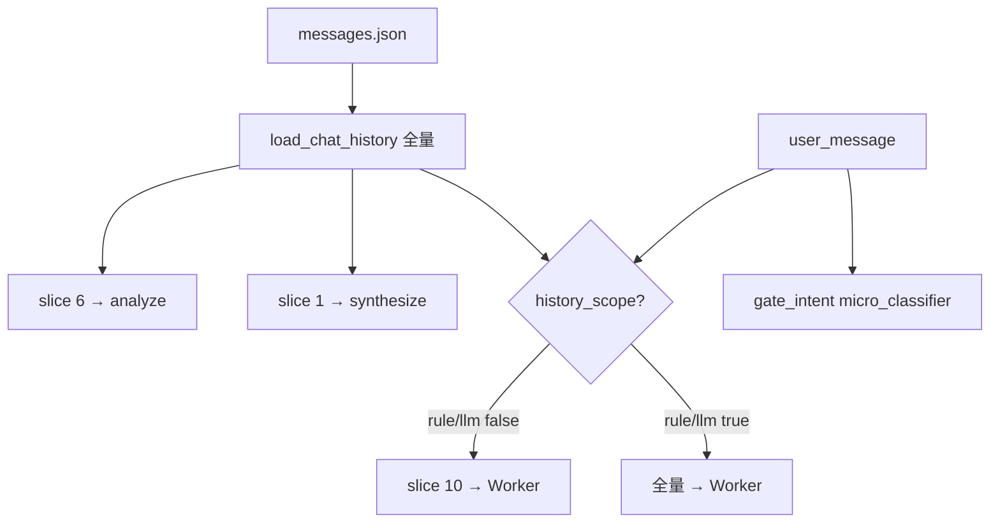

# 会话对话历史注入（协调者 / Worker 分窗 + 全量按需）— 设计规格

| 属性 | 内容 |
|------|------|
| 状态 | **已实现**（v0.4） |
| 版本 | **0.4.1** |
| 日期 | 2026-06-02 |
| 适用范围 | `SessionStore`、`micro_classifier`、`POST /v1/chat`、协调者、Worker ReAct、架构文档 |
| 关联 | [10-会话闸门与state.md](../../architecture/10-会话闸门与state.md) §1.5、[gate-intent spec](./2026-06-01-gate-intent-llm-fallback-design.md)、[profile-long-term-memory spec](./2026-06-02-profile-long-term-memory-design.md) |

---

## 重点（v0.4）

| 角色 | 注入范围 |
|------|----------|
| **协调者 analyze** | **最近 6 轮** 用户对话 |
| **协调者 synthesize** | **最近 1 轮** 用户对话 |
| **Worker**（ReAct）默认 | **最近 10 轮**（`worker_default_max_rounds`） |
| **Worker** 例外 | 用户 **明确要求查全量上下文/历史** → **全量** `messages.json`（至 200K 护栏） |
| **全量判定** | 硬规则优先 + **`micro_classifier` 任务 `history_scope`**（与 `gate_intent` 同套骨架，不同 Prompt） |
| **gate_intent** | 迁入 `micro_classifier`；输入仍 **仅** `pending_gate` + `user_message` |

**对话轮**（§1）仅指 **用户 ↔ 助手** 的 `messages.json` 条目，**不含** Worker ReAct 内部多步 LLM/tool 消息。

其它：删除旧 M1 条数裁；`CHAT_HISTORY_MAX_TOKENS=200000`；超窗仍调 LLM + 强提示新会话；pipeline 状态机本期不做。

---

## 一、对话轮（SSOT）

### 1.1 定义

- 每条 `role=user` **开启新的一轮**。
- 该轮包含该 user 及下一条 user 之前的所有 `assistant`（通常 1 条）。
- **当前轮**：刚 append 的 user，尚无 assistant。

### 1.2 切片

`slice_chat_rounds(messages, max_rounds=N)`：从末尾向前数 N 轮，取其中全部 message，**时间正序** 返回。

---

## 二、加载与配置

### 2.1 `SessionStore`

| API | 行为 |
|-----|------|
| `load_chat_history(session_id)` | 磁盘 **全量**，不裁条；写 `messages_meta`（token / `over_limit`） |
| `slice_chat_rounds(messages, max_rounds)` | 纯函数切片 |

### 2.2 配置

```python
chat_history_max_tokens: int = 200_000
chat_history_warn_ratio: float = 0.95
coordinator_analyze_max_rounds: int = 6      # 可 env，默认 6
coordinator_synthesize_max_rounds: int = 1   # 默认 1
worker_default_max_rounds: int = 10          # 默认 10
history_scope_llm_accept_threshold: float = 0.75  # 与 gate 同级可 env
```

**删除**：`CHAT_HISTORY_MAX_MESSAGES`、`_trim_by_*`、`messages_meta.trimmed` / `max_messages`。

### 2.3 `messages_meta`

| 字段 | 说明 |
|------|------|
| `total_count` | 磁盘条数 |
| `token_count` | 全量估计 token |
| `max_tokens` | 200000 |
| `usage_ratio` | `token_count / max_tokens` |
| `over_limit` | 全量是否超 200K |

---

## 三、协调者分窗（同 v0.3）

| 节点 | `max_rounds` |
|------|----------------|
| analyze | **6** |
| synthesize | **1** |

`chat.py`：`append_message(user)` → `load_chat_history` → `run_coordinator_turn(chat_history=全量列表, ...)`；节点内 slice。

**不向 Worker 默认传全量**；见 §五。

---

## 四、`micro_classifier`（与 gate_llm 统一）

### 4.1 动机

`gate_intent` 与 `history_scope` 均为：**短输入、JSON 输出、规则优先、小 LLM 兜底、低温度、超时 ≤3s**。合并为一套实现，避免再复制 `gate_llm.py` 模式。

### 4.2 模块边界

| 路径 | 职责 |
|------|------|
| `harness/micro_classifier.py` | 编排：`classify(task, user_message, context) -> dict` |
| `harness/micro_classifier_rules.py` | 各 task 硬规则（可选） |
| `platform/prompt/micro_classifier/gate_intent/system.md` | 原 gate_intent 正文迁移 |
| `platform/prompt/micro_classifier/history_scope/system.md` | **新增** |
| `harness/gate_llm.py` | **删除** 或薄封装 `classify_gate_intent_llm` → 调 `micro_classifier`（一期可保留 re-export 减 diff） |

### 4.3 通用契约

```python
def classify(
    task: str,  # "gate_intent" | "history_scope"
    user_message: str,
    context: dict[str, Any],
) -> dict[str, Any]:
    ...
```

| 项 | 约定 |
|----|------|
| LLM Role | 复用 `LLMRole.GATE_INTENT` 或新增 `LLMRole.MICRO_CLASSIFIER` |
| 流程 | `rules[task]` 明确命中 → `source=rule`；否则 `llm_enabled()` → `invoke_json(system_prompt(task), payload)` |
| Trace | `micro_classifier.{task}`，`detail` 含 `source`、`confidence` |

### 4.4 Task: `gate_intent`

**context**（仅允许）：

```json
{
  "pending_gate": { "name": "explore_repeat", "prompt": "..." }
}
```

**输出**（不变）：`matched`, `gate_name`, `intent`（confirm|reject|unknown）, `confidence`, `source`, `reason?`

**无** `recent_turns` / `session_hints`（v0.3 已删）。

`match_gate_intent` 仍对外入口在 `gate.py`；内部改调 `micro_classifier.classify("gate_intent", ...)`。

### 4.5 Task: `history_scope`

**目的**：判断本轮 Worker 是否应使用 **全量** 聊天历史。

**context**（最小）：

```json
{
  "user_message": "请根据我们完整对话里贴的 JD 再分析一遍"
}
```

（`user_message` 与顶层参数重复时 payload 只保留一处即可。）

**输出 JSON**：

```json
{
  "needs_full_history": true,
  "confidence": 0.92,
  "source": "llm",
  "reason": "用户要求依据完整对话"
}
```

| 字段 | 说明 |
|------|------|
| `needs_full_history` | `true` → Worker 用全量；`false` → 最近 10 轮 |
| `confidence` | 0–1 |
| `source` | `rule` \| `llm` \| `none` |
| `reason` | 可选，≤120 字，trace 用 |

**判定生效**：`needs_full_history && confidence >= HISTORY_SCOPE_LLM_ACCEPT_THRESHOLD`（默认 0.75，可与 gate 共 env 或独立 `HISTORY_SCOPE_LLM_ACCEPT_THRESHOLD`）。

**硬规则（先于 LLM）** — 子串/短语表，命中则 `needs_full_history=true`, `source=rule`, `confidence=0.95`：

| 示例短语（实现可扩展） |
|------------------------|
| 完整对话、全部历史、整个会话、检查上下文、查看历史、上文说过、之前提到的、前面发的 JD、回顾聊天记录 |

**明确不算**（规则 reject → 交 LLM 或默认 false）：纯「继续」「好的」、与历史无关的新 JD 粘贴（无「上文/之前」类指代）。

**LLM Prompt 要点**：

- 仅根据 **当前 user 一句** 判断是否要求 Agent **跨越默认窗口、查看更早的聊天内容**。
- `true`：明确指向上文/全对话/完整上下文；`false`：默认窗口足够或新话题。
- 只输出 JSON，不执行任务本身。

### 4.6 调用时机

在 **即将 `delegate_worker` / `run_worker_react` 之前**（协调者 `delegate` 节点或 `delegate.py` 内）：

```python
chat_history_full, meta = ...  # 已在 turn 入口 load
scope = classify_history_scope(user_message)
if scope["needs_full_history"]:
    worker_history = chat_history_full
    scope_label = "full"
else:
    worker_history = slice_chat_rounds(chat_history_full, max_rounds=10)
    scope_label = "recent_10"

context["chat_history"] = worker_history
context["chat_history_scope"] = scope_label  # trace / 调试
context["messages_meta"] = meta
```

**每 Worker 派工各判一次**（用户句相同）；同一轮多次 delegate 结果一致。

**可选优化**（非必须）：同一 `user_message` 在 `session_state` 缓存 `history_scope_decision` 至本轮结束，避免重复 LLM。

---

## 五、Worker 历史窗

### 5.1 默认：最近 10 轮

与协调者相同轮定义；`slice_chat_rounds(full, max_rounds=10)`。

### 5.2 全量：用户明确要求

经 §4.5 `history_scope` 为 **true**（规则或 LLM）→ `chat_history` = `load_chat_history` 全量列表。

### 5.3 `react_runner` boot

```json
{
  "goal": "...",
  "chat_history": [ "..." ],
  "chat_history_scope": "full | recent_10",
  "messages_meta": { "over_limit": false, ... },
  "session_state": { "prior_results", "list_type", ... }
}
```

Worker system / boot 模板增补：

- 默认窗内回答；`chat_history_scope=full` 时可引用更早轮次。
- 仍 **禁止** 索要窗内已出现的 JD/经历全文。

### 5.4 超 200K

`over_limit=true` 时仍传入当前 scope 对应列表（全量或 10 轮），不裁条；synthesize / done 强提示新会话。

---

## 六、超窗与 M1-R

同 v0.3：`over_limit` 或 `usage_ratio≥0.95` → 推荐新会话；不静默裁磁盘。

---

## 七、数据流



---

## 八、删除 / 迁移清单

| 操作 |
|------|
| 删除 M1 条数裁与 `CHAT_HISTORY_MAX_MESSAGES` |
| `load_messages_for_coordinator` → `load_chat_history` |
| `gate_llm.build_recent_turns` 删除 |
| `gate_llm` 逻辑迁入 `micro_classifier`（或薄包装） |
| 新增 `history_scope` prompt + rules |
| Worker **不再** 默认全量 |

---

## 九、验收

1. `slice_chat_rounds`：6 / 1 / 10 轮单测通过。
2. analyze payload：`chat_history` ≤ 6 轮；synthesize ≤ 1 轮。
3. Worker 默认：`chat_history_scope=recent_10`，条数对应 ≤10 轮（20 轮会话时少于磁盘总数）。
4. 用户句「请根据我们完整对话里的 JD」→ `history_scope` true → Worker boot 全量条数 = `total_count`。
5. `gate_intent` 行为回归：`pytest tests/harness/test_gate_*` 全过。
6. `history_scope` 单测：规则命中 + mock LLM；`source` 字段正确。
7. 无 `CHAT_HISTORY_MAX_MESSAGES` / `_trim_by_*` / `recent_turns`。

---

## 十、确认记录

| 项 | v0.4 |
|----|------|
| 协调者 analyze / synthesize | 6 轮 / 1 轮 |
| Worker 默认 | **10 轮** |
| Worker 全量 | 用户明确要求 + `history_scope` 判定 |
| gate_llm | 并入 **micro_classifier**（`gate_intent` task） |
| 旧 M1 / 回滚 | **删除** |
| pipeline 状态机 | 下期 |

---

*文档结束 — v0.4 与 plan 对齐后编码。*
