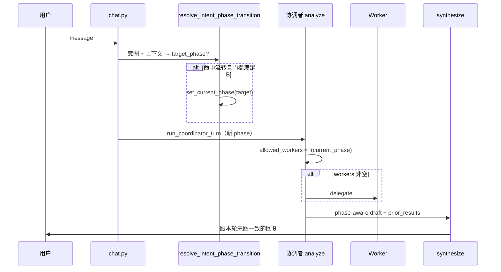
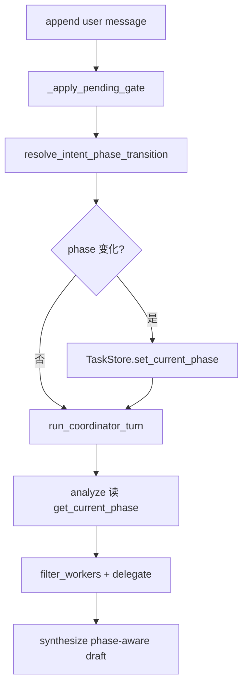

# Pipeline 全阶段意图流转与派工 — 设计规格

| 属性 | 内容 |
|------|------|
| 状态 | **已实现** |
| 版本 | **0.1.0** |
| 日期 | 2026-06-02 |
| 适用范围 | `POST /v1/chat`、协调者 analyze/delegate/synthesize、`TaskStore.meta.current_phase`、`pipeline_routing` |
| 关联 | [pipeline-phase-explore-state](./2026-06-02-pipeline-phase-explore-state-design.md)（**已实现**，本期 **扩展**）、[profile-long-term-memory](./2026-06-02-profile-long-term-memory-design.md)、[coordinator-full-chat-history](./2026-06-02-coordinator-full-chat-history-design.md)、[task-system-pipeline-upgrade](./2026-06-01-task-system-pipeline-upgrade-design.md) |
| 实现计划 | [../plans/2026-06-02-pipeline-intent-phase-transitions.md](../plans/2026-06-02-pipeline-intent-phase-transitions.md) |

---

## 0. 摘要

**问题**：用户意图已进入下一阶段（如「按这份 JD 讲简历优化策略」「用正在做的 Agent 项目」），磁盘 `current_phase` 仍停在上一阶段（如 `jd_analysis`）。协调者 analyze 虽运行，但 **只能派当前阶段白名单 Worker**（`jd_analysis` → 仅 `opportunity`），`strategy` 被滤成 **`workers=[]`**，synthesize 复读旧 `prior_results`，表现为「不跟用户思路、老强调系统议程」。

**原则**：

1. **全阶段一张表**：explore → market → jd_analysis → resume_strategy → resume_optimize 的推进规则 **同一套机制**（非单点 jd→strategy 补丁）。
2. **意图可推进阶段（B）**：用户消息语义明确指向某阶段能力，且会话具备 **JD/路径上下文** 时，允许 **先 `set_current_phase` 再派工**；**不要求**上一阶段 Worker 产物 `segment_complete`（尤其 opportunity `not_recommended` 未确认闸门时）。
3. **与 Q4-A 兼容**：阶段写入仍是 **显式事件**；**用户意图命中流转表** 算一种显式事件，**不是**每轮按 `prior_results` 惰性 reconcile。
4. **派工恒以磁盘 phase 为准**：推进后的 **新** `current_phase` 参与 `filter_workers_for_pipeline`（延续 [pipeline-phase spec §5.3](./2026-06-02-pipeline-phase-explore-state-design.md)）。

### 拍板（2026-06-02）

| ID | 结论 |
|----|------|
| **Q-INTENT-1** | 采用 **B（松门槛）**：意图推进所需「上下文」见 §4.2，**不**强制 `prior_results.opportunity.segment_complete` |
| **Q-INTENT-2** | 意图推进在 **`run_coordinator_turn` 之前**（`chat.py`）执行，保证同轮 analyze 已读新 phase |
| **Q-INTENT-3** | 硬规则优先 + 可选 `micro_classifier` 任务 `pipeline_phase_intent`（与 `profile_memory_scope` 同骨架） |
| **Q-INTENT-4** | 阶段推进后，若本轮应派工而未派，**禁止** 用「上一阶段 chat_only / 旧 gate」draft；改用 **阶段专用 synthesize draft**（§7） |

---

## 一、现状与目标态对比

### 1.1 现状（缺口）

| 阶段 | 用户典型意图 | 现状 | 缺口 |
|------|--------------|------|------|
| `explore` | 评估 JD / 下一步 | gate 可解禁，phase 可能仍为 explore | 依赖 repeat/complete 表，**无**统一意图表 |
| `market` | 分析市场 / 评估 JD | fallback 可派 market/opportunity | opportunity 意图 **不** 自动进 `jd_analysis` |
| `jd_analysis` | 简历策略 / 怎么改 | 只能派 opportunity；strategy 被滤掉 | **核心事故** |
| `resume_strategy` | 开始改简历 / 生成 HTML | 需 `optimize_confirmed` 才进 optimize | 意图「直接优化」与闸门关系未统一 |
| `resume_optimize` | 改某模块 | 闸门 + 派 resume/asset | 相对清晰 |

Worker 完成映射（已实现）**不覆盖**「用户口头进入下一阶段」：

```11:14:backend/career_os/harness/pipeline_phase_transition.py
WORKER_SEGMENT_PHASE: dict[str, str] = {
    "market": "market",
    "opportunity": "jd_analysis",
}
```

`opportunity` 完成后 phase 仍为 `jd_analysis`，**不会** 因用户要问策略而进入 `resume_strategy`。

### 1.2 目标态（单轮 chat）



---

## 二、概念：三类阶段写入触发器

| 触发器类型 | 说明 | 既有实现 | 本期 |
|------------|------|----------|------|
| **gate** | 闸门 confirm/reject、jump | `api/chat.py`、`pipeline_gates` | 保留；写入规则见 [pipeline-phase §5.1](./2026-06-02-pipeline-phase-explore-state-design.md) |
| **worker_complete** | Worker `segment_complete` 后 Harness 写 phase | `pipeline_phase_transition` §5.2 | 保留；**补充** strategy → `resume_strategy` 等缺失行 |
| **user_intent** | 本轮 `user_message` 命中阶段能力意图 + §4.2 上下文 | **无** | **新增**，全表统一 |

**禁止**：

- 在 `POST /v1/chat` 入口用 `prior_results` 做 **无用户消息** 的惰性 phase 猜测（仍属 Q4/Q6）。
- analyze 输出的 `pipeline_phase` **替代** 磁盘 phase 做过滤（仍属 Q5）。

---

## 三、全阶段状态机（路径光标）


**回退**：仅 `jump_to_phase`（产品/API 显式），**不**由用户口语「回到初探」自动回退（避免误触）；若需支持另开 spec。

---

## 四、统一流转表 `PIPELINE_INTENT_TRANSITIONS`

### 4.1 表结构（SSOT）

每条边：

| 字段 | 含义 |
|------|------|
| `from_phase` | 当前 `meta.current_phase`（可 `*` 表示通配，慎用） |
| `to_phase` | 目标 phase |
| `intent` | `rule` / `classifier` / `gate_only` |
| `rule_id` | 硬规则 id（可测） |
| `preconditions` | 门槛 id 列表（§4.2） |
| `primary_workers` | 进入目标 phase 后 **建议本轮派工**（analyze 参考，非强制） |
| `notes` | 产品说明 |

实现模块建议：`harness/pipeline_intent_transition.py`（或合并进 `pipeline_phase_transition.py` 的 `resolve_intent_phase_transition`）。

### 4.2 门槛（Preconditions）— **B 松门槛**

| 门槛 id | 满足条件（任一组合按表要求） |
|---------|------------------------------|
| `P0_session_pipeline` | `list_type=pipeline` 且 `list_id` 存在 |
| `P1_jd_prerequisites` | `check_jd_prerequisites` → ready（建档 + 初探解禁，与现网一致） |
| `P2_jd_context` | **B**：会话已有 JD/评估上下文，满足 **任一**：`meta.related_jd_fingerprint` 非空；`prior_results` 含 `market` 或 `opportunity`；本轮或近 6 轮 analyze 窗内用户消息含 JD 意图关键词（`is_jd_intent`）；用户明确指代「这份 JD/这个岗位/刚才的评估」 |
| `P3_strategy_context` | **B**：在 `P2_jd_context` 基础上，用户消息含策略/改简历意图（§4.3） |
| `P4_explore_gate` | `explore_gate_confirmed` 或 `explore_closure.completed` |
| `P5_optimize_confirmed` | `gates.flags.optimize_confirmed` |
| `P6_not_small_talk` | 非 `is_small_talk` |

**B 与 A 差异（记录决策）**：

| 边 | A（严） | **B（本期）** |
|----|---------|----------------|
| → `jd_analysis` | `opportunity` segment_complete | `P2_jd_context` + JD 评估意图 |
| → `resume_strategy` | `opportunity` 完成且用户确认继续 | `P3_strategy_context`，**不要求** opportunity 完成、**不要求** 消费 `jd_continue_despite_not_recommended` |

### 4.3 意图硬规则（`rule_id` 摘要）

规则实现：`match_pipeline_intent_rules(user_message) -> list[TransitionMatch]`，按 **优先级**（表顺序）取 **第一条** 命中且 `from_phase` 匹配的边。

| rule_id | 典型用户表述 | `from_phase` | `to_phase` |
|---------|--------------|--------------|------------|
| `intent_market` | 市场、趋势、岗位族、行业分析 | `explore`† | `market` |
| `intent_jd_eval` | 评估 JD、匹配度、投这个岗、分析岗位 | `explore`,`market` | `jd_analysis`‡ |
| `intent_resume_strategy` | 简历策略、怎么改简历、优化方案、按这份 JD、按照这个 jd | `jd_analysis`,`market`§ | `resume_strategy` |
| `intent_resume_optimize` | 开始优化简历、改工作经历、生成 HTML 简历 | `resume_strategy` | `resume_optimize` |

† `explore` 还需 `P4_explore_gate` + `P1_jd_prerequisites`。  
‡ 进入 `jd_analysis` 后本轮 `primary_workers`: `["opportunity"]`（若尚未有结论或用户要求重评）。  
§ `market` 下若仅有市场结论、用户要策略，允许 **跨到** `resume_strategy`（B：已有 `P2`）。

**歧义「下一步 / 继续」**：

- **不单独** 构成流转；落入当前 phase 的 fallback 派工或 chat_only。
- 若 `gates.pending` 存在，**先** 走 `match_gate_intent`（现有），**不** 与意图推进抢跑。

### 4.4 全表（机器可读摘要）

| from | to | preconditions | primary_workers（进入 to 后） |
|------|-----|---------------|-------------------------------|
| `explore` | `market` | P0,P4,P6 + (intent_market **or** gate explore_complete/repeat 表) | `["market"]` |
| `explore` | `jd_analysis` | P0,P1,P4,P2,P6 + intent_jd_eval | `["opportunity"]`（或 market 未跑则 `["market","opportunity"]` 由 analyze 缩序） |
| `market` | `jd_analysis` | P0,P1,P2,P6 + intent_jd_eval | `["opportunity"]` |
| `jd_analysis` | `resume_strategy` | P0,P1,P3,P6 + intent_resume_strategy | `["strategy"]` |
| `resume_strategy` | `resume_optimize` | P0,P5,P6 + intent_resume_optimize | `["resume","asset"]` |

**Worker 完成补充（与意图正交，写入仍发生）**：

| Worker 完成 | `to_phase`（保持 [pipeline-phase §5.2](./2026-06-02-pipeline-phase-explore-state-design.md)） |
|-------------|--------------------------------------------------------------------------------------------------|
| `market` | `market` |
| `opportunity` | `jd_analysis` |
| `strategy` | `resume_strategy`（**新增**，与 `strategy_complete` flag 对齐） |

意图推进与 worker 完成 **同轮冲突**：**取 phase 序更靠后** 的目标（`resume_optimize` > … > `explore`），避免倒退。

### 4.5 可选微分类 `pipeline_phase_intent`

| 项 | 约定 |
|----|------|
| 任务名 | `pipeline_phase_intent` |
| 输入 | `user_message`, `current_phase`, `prior_workers`, `has_jd_context`, `gates.pending` |
| 输出 | `{ "target_phase": "…" \| null, "confidence", "reason", "source" }` |
| 调用时机 | 硬规则未命中且非 small_talk |
| 阈值 | `confidence >= history_scope_llm_accept_threshold` 且 `target_phase` 在表允许邻接内 |
| Prompt | `platform/prompt/micro_classifier/pipeline_phase_intent/system.md` |

---

## 五、执行顺序（`POST /v1/chat`）



| 步骤 | 说明 |
|------|------|
| 1 | 闸门意图 **先于** 阶段意图（用户答「继续/拒绝」不是跳阶段） |
| 2 | `resolve_intent_phase_transition` 返回 `{ applied, from_phase, to_phase, rule_id }` 写入 trace（可选 `state.last_phase_transition`） |
| 3 | 同轮 `session_state` / `pipeline_analyze_payload` 使用 **更新后** phase |
| 4 | analyze LLM 仍输出 workers，但 **fallback** 与 **filter** 已按新 phase |

---

## 六、派工契约（analyze 之后）

| 项 | 规则 |
|----|------|
| 过滤 | `filter_workers_for_pipeline(..., phase=get_current_phase())` **不变** |
| 意图建议 | `resolve_intent_phase_transition` 可返回 `suggested_workers`；analyze payload 增 `intent_suggested_workers`（供 LLM 参考，**不**绕过过滤） |
| 空 workers | 若已意图推进到 `resume_strategy` 且用户问策略，fallback **必须** 尝试 `["strategy"]`（扩展 `pipeline_fallback_workers`） |
| JD 链重跑 | 用户在 `jd_analysis` 明确「重新评估」→ 不推进 phase，派 `opportunity` |

---

## 七、Synthesize 与「空派工」防复读

### 7.1 阶段专用 draft（替代深路径 chat_only）

| `current_phase` | `workers=[]` 时 draft 来源 |
|-----------------|----------------------------|
| `explore` | 现有 `explore_continue` / intake / explore_complete（不变） |
| `market` | `market_continue_draft`：续聊市场或邀请提交 JD |
| `jd_analysis` | `jd_analysis_continue_draft`：续评 JD；**若用户问策略** 应已推进到 `resume_strategy`，不应落在此 |
| `resume_strategy` | `resume_strategy_draft`：基于 `prior_results` + profile 回答策略；**禁止** 复述 `not_recommended` 二选一（除非 `gates.pending` 仍指向该闸门） |
| `resume_optimize` | 现有 optimize / asset 流 |

`build_profile_aware_chat_draft`：**禁止** 在 `current_phase ∈ {jd_analysis, resume_strategy, resume_optimize}` 使用 `chat_only_draft` 寒暄模板。

### 7.2 prior_results 消费

| 场景 | 规则 |
|------|------|
| 已进入 `resume_strategy` | synthesize **优先** `prior_results.strategy`；无则允许 summarize `opportunity.user_visible_summary` 中策略段落，**不得** 强制用户再选「继续 vs 补项目」 |
| 用户声明已有 Agent 项目 | draft **硬事实**：「用户称已有实战项目：{摘录}」；与 `profile_memory.resume` 一致 |
| `gates.pending == jd_continue_*` | 仅当 pending 存在时允许闸门话术 |

---

## 八、模块与文件

| 路径 | 职责 |
|------|------|
| `harness/pipeline_intent_transition.py` | 表驱动 `resolve_intent_phase_transition`、`has_jd_context`（B） |
| `harness/micro_classifier_rules.py` | `match_pipeline_intent_rules` |
| `harness/micro_classifier.py` | `pipeline_phase_intent` |
| `harness/pipeline_routing.py` | phase 级 fallback 扩展 |
| `api/chat.py` | analyze 前调用 resolve |
| `agents/lc/coordinator_llm.py` | 阶段 draft 工厂 |
| `platform/prompt/micro_classifier/pipeline_phase_intent/system.md` | 分类 Prompt |
| `platform/prompt/coordinator/system.md` | 附录：阶段 draft 片段 |

---

## 九、验收标准

1. **Demo 复现**：`current_phase=jd_analysis`，用户「告诉我如何按这个 jd 做简历优化 / 策略」→ 同轮 `current_phase=resume_strategy`，派 `strategy` 或 fallback 非空；回复 **不** 强制二选一闸门。
2. **B 门槛**：无 JD 上下文（新会话、无 fingerprint、无 prior、消息无 JD 词）→ **不** 推进到 `resume_strategy`。
3. **全表覆盖**：§4.4 每行至少 1 个 harness 单测（rule 命中 + phase 写入）。
4. **闸门优先**：`gates.pending` 存在时，用户「继续」→ 走 gate，**不** 误推进 phase。
5. **与旧 spec 回归**：[pipeline-phase §8](./2026-06-02-pipeline-phase-explore-state-design.md) 用例仍绿；新增 ≥8 条意图流转单测。
6. **禁止惰性 reconcile**：无 `user_message` 时不调用 `resolve_intent_phase_transition`。

---

## 十、非目标

| 项 | 说明 |
|----|------|
| 用户口语回退 phase | 仅 `jump_to_phase` |
| 修改 chat history 分窗 | 仍 6/1 轮 |
| 替换 Worker 内部逻辑 | 仅改阶段与派工入口 |
| 跨 list 同步 phase | 仍按 list_id |

---

## 十一、与已实现 spec 的关系

| 文档 | 关系 |
|------|------|
| [pipeline-phase-explore-state](./2026-06-02-pipeline-phase-explore-state-design.md) | Q4-A/Q5/Q6 **保留**；新增 **`user_intent` 为第 3 类显式写 phase 事件**；§5.2 补充 `strategy` 完成写 phase |
| [profile-long-term-memory](./2026-06-02-profile-long-term-memory-design.md) | 意图推进后 `allowed_workers` 变化，profile 切片规则不变 |

---

## 十二、确认记录

| 版本 | 日期 | 说明 |
|------|------|------|
| 0.1.0 | 2026-06-02 | 初版：全阶段意图流转表 + B 松门槛 + synthesize 阶段 draft |

---

*文档结束 — 待评审后进入实现计划。*
